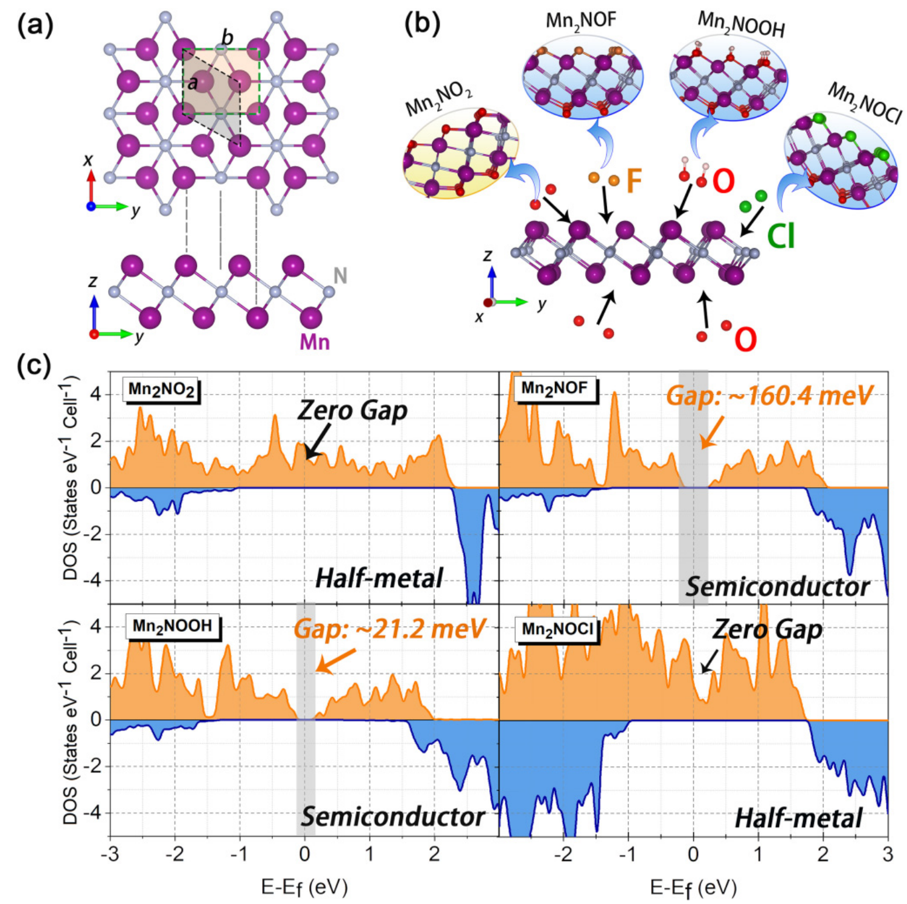
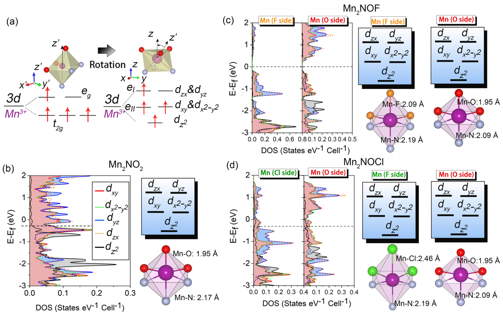
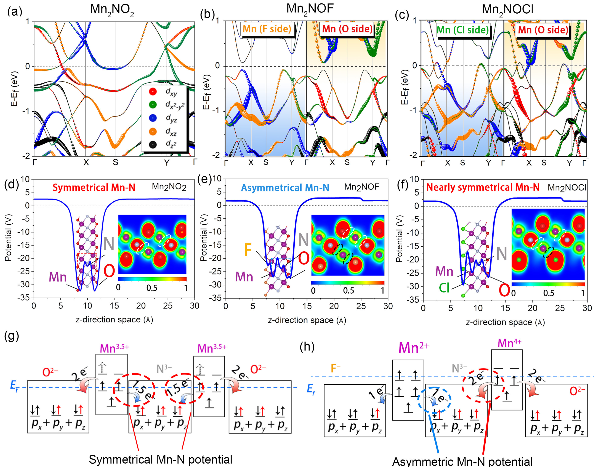
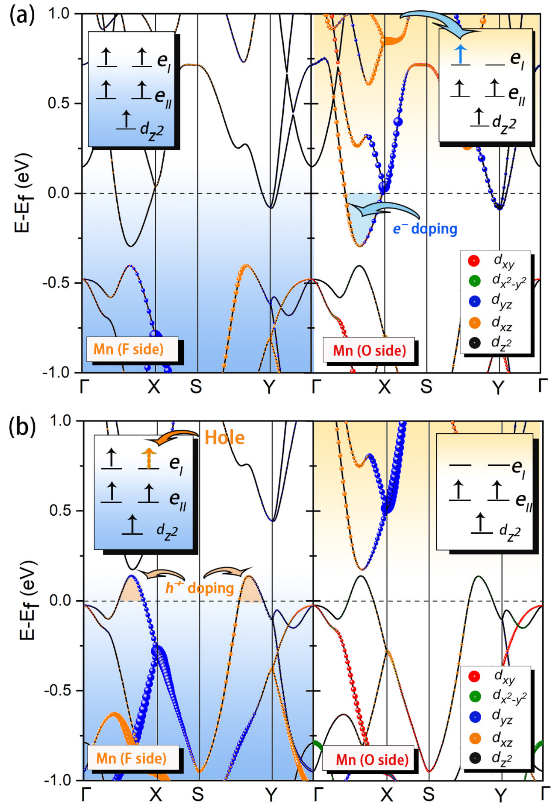
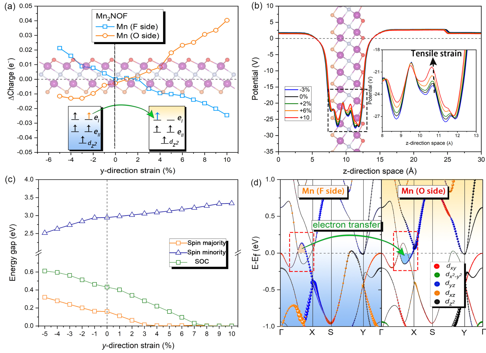

## chen3dLevelSymmetry2025 — 金属层间3d能级对称性控制Mn2N MXenes的电子构型并实现半金属性与半导体性之间的调制

## 📄 元数据
Kaiyun Chen、Xue Yan、Junkai Deng、Yuan Yan、Jiabei He、Dongxiao Kan、Wangtu Huo、Le Zhang、Jefferson Zhe Liu，2025，Physical Review B 112, 085118，DOI: [10.1103/l1lf-d6hc](https://doi.org/10.1103/l1lf-d6hc)
## 💡 一句话
通过DFT计算揭示Mn2N MXenes的半金属性/半导体性由两侧Mn原子3d能级分离程度（而非局域配位对称性）决定，并据此用电荷掺杂和单轴应变实现两种态的可逆切换。

## 🔗 Wiki 双链
  - 概念 [[../concepts/density-functional-theory]]、[[../concepts/strain-engineering]]、[[../concepts/spin-orbit-coupling]]、[[../concepts/2D-materials]]、[[../concepts/electron-counting-rule]]、[[../concepts/half-metallicity]]、[[../concepts/janus-structure]]、[[../concepts/crystal-field-theory]]、[[../concepts/charge-doping]]、[[../concepts/electronic-phase-transition]]
  - 实体 [[../entities/MXenes]]、[[../entities/TMDs]]、[[../entities/VASP]]、[[../entities/h-BN]]、[[../entities/Mn2N]]、[[../entities/Mn2NO2]]、[[../entities/Mn2NOF]]、[[../entities/V2NOF]]
  - 图表 [[../figures/crystal-structures]]、[[../figures/electronic-bands]]、[[../figures/heterostructures-stacking-domains-devices]]
  - 年度 [[../write/2025]]
  - 相关论文 **chen3dLevelSymmetry2025**

## 📊 关键图表
  -  → [[../figures/heterostructures-stacking-domains-devices|铁弹畴、畴壁、In₂Se₃ 与器件应用]]
  - 
  - 
  - 
  - 

## 🔬 项目连接
  - **project-2（Mn多铁）— strong**：本文核心材料是Mn基二维体系Mn2N MXene，使用DFT+U（U=4 eV）系统研究Mn的氧化态（Mn2+/Mn3.5+/Mn4+）、3d轨道填充与磁矩（3.5 μB、4.48 μB、3.624 μB），对理解Mn基磁性/多铁材料中电荷转移与轨道占据的关系有直接参考价值；铁磁基态、强关联处理流程可复用。
  - **project-5（SnTe铁电模拟）— medium**：方法论参考——GGA+U/HSE06/SOC交叉验证带隙、PBAND/PDOS/静电势/ELF/Bader联合分析、单轴应变扫描（-5%至+10%）诱导电子相变的计算流程，对SnTe铁电/拓扑相变的应变调控模拟具方法学借鉴；"面外静电势不对称驱动能级重排"的图像可类比于极化体系的内建场分析。
  - **project-7（CDW）— weak**：同属二维材料电子态调控话题，应变/掺杂驱动的电子相变与CDW中费米面嵌套/带隙打开存在形式上的类比，但物理机制不同，仅作为二维电子相变案例参考。
  - project-1、project-3、project-4、project-6无直接连接。

## 📝 组织与用词
论文按"现象观察（图1 DOS）→ 排他性分析（图2 轨道简并未变）→ 机制建立（图3 PBAND+静电势+ELF+离子模型）→ 调控验证（图4掺杂、图5应变）"的递进逻辑组织，先证伪局域配位对称性解释，再立论3d能级分离机制，最后展示该机制的预测能力。值得复用的术语：
  - 3d-level symmetry / 3d能级对称性（两侧金属层3d轨道的能级对齐关系）
  - [[../concepts/janus-structure|Janus structure / Janus结构]]（不对称双面钝化）
  - energy-level separation / 能级分离（两侧Mn 3d轨道的相对能量差）
  - [[../concepts/half-metallicity|half-metallicity / 半金属性]]（单自旋通道导电）
  - electron pocket / hole pocket / 电子口袋/空穴口袋（费米面附近的能带特征）
  - charge redistribution / 电荷重新分布（由能级差驱动的Mn↔Mn、Mn→N电荷转移）
  - spin majority / spin minority / 自旋多数/自旋少数通道
  - critical strain / 临界应变（带隙闭合、半导体→半金属转变点）

## ✏️ 可写入 Wiki 的要点
  1. Mn2N为"反1T-TMD"三明治结构（N在中间，两层Mn在外），铁磁基态，居里温度文献值在566–1877 K范围。
  2. 表面钝化决定电子态：对称Mn2NO2和Janus Mn2NOCl为半金属（自旋多数零带隙、自旋少数带隙3.21 eV）；Janus Mn2NOF（带隙160.4 meV，SOC下~0.46 eV）和Mn2NOOH（21.2 meV，SOC下~0.28 eV）为半导体。HSE06与Γ-M-K原胞路径验证结论不变。
  3. 所有结构中Mn的3d轨道在C3v三角晶场下均分裂为单态dz2 + 双重态eI(dyz+dxz) + 双重态eII(dxy+dx²-y²)，简并模式不随钝化原子改变——局域配位对称性不是决定半金属/半导体的主经。
  4. 核心机制：两侧Mn的3d能级分离度决定Mn→N的电荷转移量与Mn 3d电子构型。能级分离小（O/O、O/Cl）时两边均为Mn3.5+（d3.5），最高eI轨道部分填充→半金属；能级分离大（O/F、O/OH）时F侧Mn为Mn2+高自旋d5（eI全满）、O侧Mn为Mn4+低自旋d3（eI全空），费米能级落在满/空eI之间→半导体。
  5. DFT磁矩印证离子模型：Mn2NO2每Mn约3.5 μB；Mn2NOF中MnF为4.480 μB、MnO为3.624 μB。
  6. 电荷掺杂直接改变eI占据：0.02 e⁻/atom填充MnO空eI（CBM下移穿费米能级），0.02 h⁺/atom清空MnF满eI（VBM上移穿费米能级），均可使Mn2NOF转为半金属；掺杂不引起两侧Mn间电荷转移。
  7. 单轴拉伸应变驱动电子从MnF（高自旋d5）转向MnO（低自旋d3），减小两侧Mn-N静电势差；Mn2NOF在GGA+U下临界应变约+3%、SOC下约+7%带隙闭合；Mn2NOOH临界应变更小（约+2%/+5%）。压缩应变效应相反，增大带隙。
  8. 机制具普适性：同样解释了V2NOF的半导体性（F侧V2+ d3、O侧V4+ d1，F侧dz2+eII满而eI空，O侧eII/eI空），修正了先前晶体场框架因假定两侧等电荷转移而错误预测其为半金属的问题。
  9. 计算细节：VASP、PAW、PBE、截断500 eV、k网格15×11×1（弛豫）/21×19×1（静态）、力收敛0.005 eV/Å、能量10⁻⁵–10⁻⁶ eV、30 Å真空层、Janus结构加偶极修正；300 K下6 ps AIMD验证热稳定性；U=4 eV为主、U=5 eV验证。
  10. 意义：提出"金属层间3d能级对称性"概念统一MXenes电子性质图像，为在单一材料内通过局域掺杂/应变实时"写入/擦除"半金属导电通道、构建无化学界面的可重构自赢电子器件提供理论蓝图。
