## chenHafniumBasedFerroelectricPostMoore2026 — 铪基铁电后摩尔电子学：器件物理、集成结构和神经形态系统实现

## 📄 元数据
Xiangwei Chen, Zheng Wang, Jialin Meng, Tianyu Wang（山东大学），2026，Nano-Micro Letters，18:326，DOI: 10.1007/s40820-026-02158-z
## 💡 一句话
本文系统综述了与CMOS工艺兼容的铪基铁电体（Hf-FEs）从掺杂材料工程、四类器件结构（FeFET/FTJ/FeRAM/Fe-Diode）、极化翻转微观机制到神经形态存算一体系统实现的完整技术链条，并批判性地指出亚稳相稳定、BEOL热预算、可靠性与3D集成等核心挑战。
## 🔗 Wiki 双链
  - 概念 [[../concepts/ferroelectricity|铁电性]]
  - 概念 [[../concepts/ferroelectric-tunnel-junction]]
  - 概念 [[../concepts/polarization-switching]]
  - 概念 [[../concepts/neuromorphic-computing|神经形态计算]]
  - 概念 [[../concepts/in-memory-computing|存内计算]]
  - 概念 [[../concepts/synaptic-plasticity|突触可塑性]]
  - 概念 [[../concepts/domain-wall-motion|畴壁运动]]
  - 概念 [[../concepts/oxygen-vacancy|氧空位]]
  - 概念 [[../concepts/schottky-barrier|肖特基势垒]]
  - 概念 [[../concepts/soft-mode-phonon|软模声子]]
  - 概念 [[../concepts/cmos-compatibility|CMOS兼容性]]
  - 概念 [[../concepts/wake-up-fatigue|唤醒与疲劳效应]]
  - 概念 [[../concepts/strain-engineering]]
  - 概念 [[../concepts/density-functional-theory]]
  - 概念 [[../concepts/2D-materials]]
  - 概念 [[../concepts/multiferroicity]]
  - 实体 [[../entities/HfO2|HfO₂（氧化铪）]]
  - 实体 [[../entities/HZO|HZO（Hf₀.₅Zr₀.₅O₂）]]
  - 实体 [[../entities/FeFET|FeFET（铁电场效应晶体管）]]
  - 实体 [[../entities/FTJ|FTJ（铁电隧道结）]]
  - 实体 [[../entities/FeRAM|FeRAM（铁电随机存取存储器）]]
  - 实体 [[../entities/Fe-Diode|Fe-Diode（铁电二极管）]]
  - 实体 [[../entities/PZT|PZT（锆钛酸铅）]]
  - 实体 [[../entities/BaTiO3|BaTiO₃（钛酸钡）]]
  - 实体 [[../entities/domain-wall]]
  - 实体 [[../entities/MXenes]]
  - 实体 [[../entities/TMDs]]（MoS₂）
  - 图表 [[../figures/crystal-structures]]
  - 图表 [[../figures/electronic-devices]]
  - 图表 [[../figures/heterostructures-stacking]]
  - 图表 [[../figures/experimental-setups|实验测试与测量装置]]
  - 图表 [[../figures/mathematical-models|数学模型与物理公式]]
  - 年度 [[../write/2026]]
  - 项目 [[../projects/project-5-snte-ferroelectric-sim]]
  - 相关论文 **chenHafniumBasedFerroelectricPostMoore2026**
## 📊 关键图表
  - 图1：Hf-FEs材料、器件结构与应用总览
  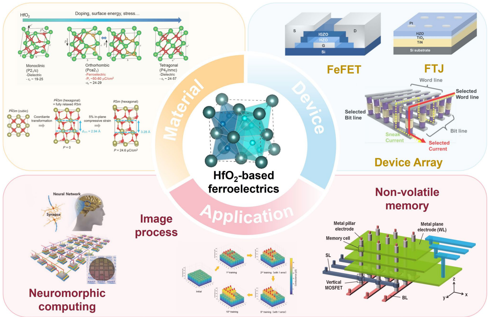
  - 图2：2011–2025年Hf-FEs关键进展时间线
  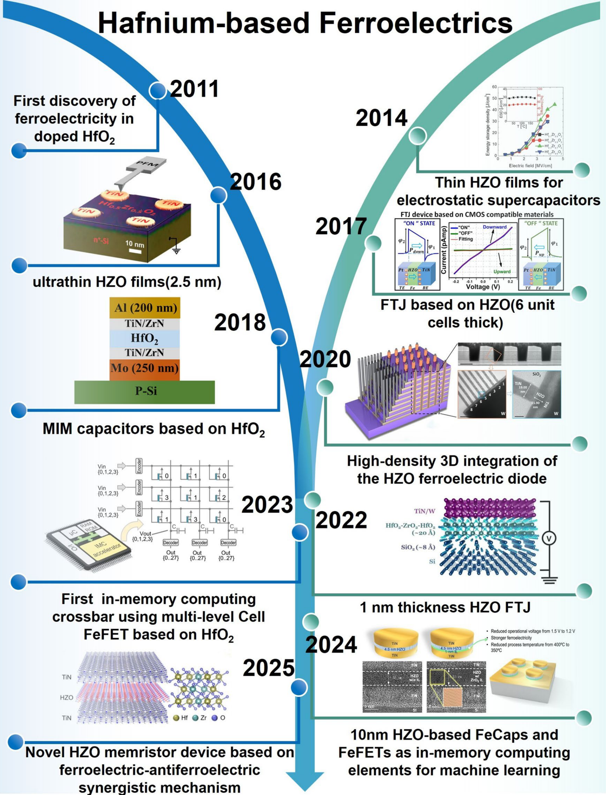
  - 图3：掺杂HfO₂晶体结构、STEM/TEM图像与器件制造工艺流程
  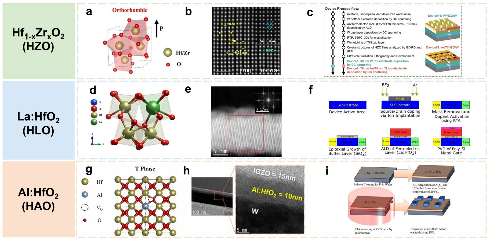
  - 图4：FeFET/FTJ/FeRAM/Fe-Diode四类器件结构与阵列
  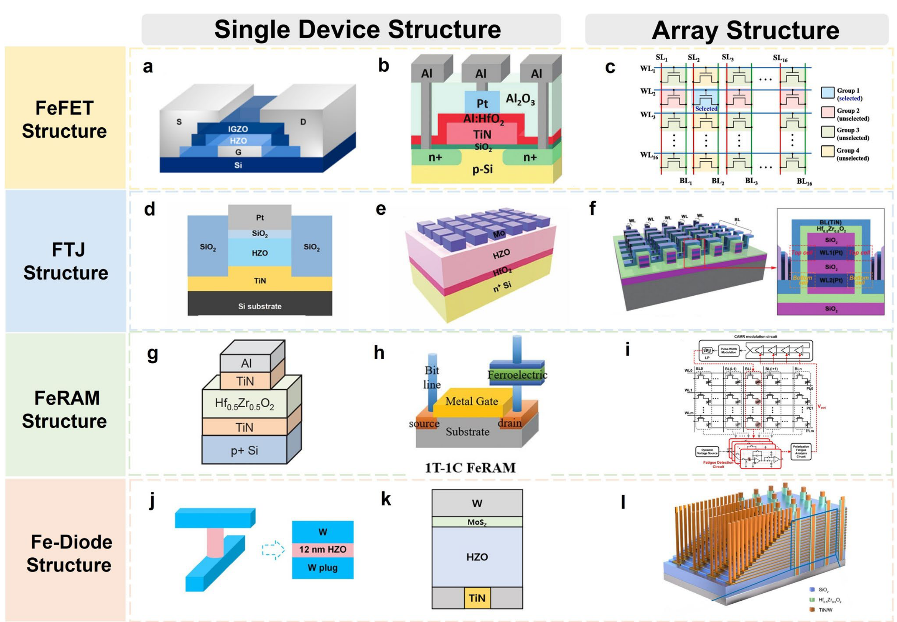
  - 图5：物理机制——声子平带、相变、DFT掺杂筛选、应变、氧空位、畴壁运动与氧离子迁移路径
  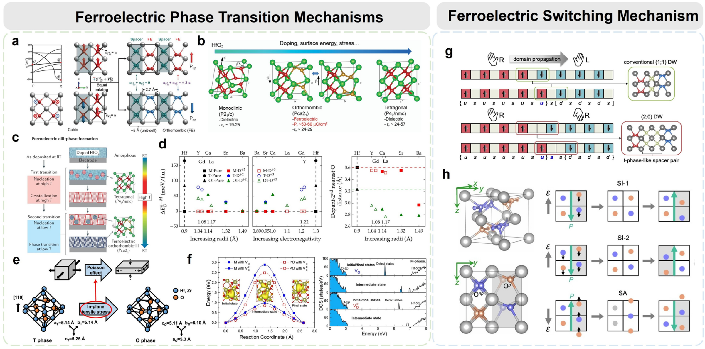
  - 图6：P-E回线、I-V/C-V曲线、漏电流、开关速度、热稳定性、耐久性、均匀性与保持性
  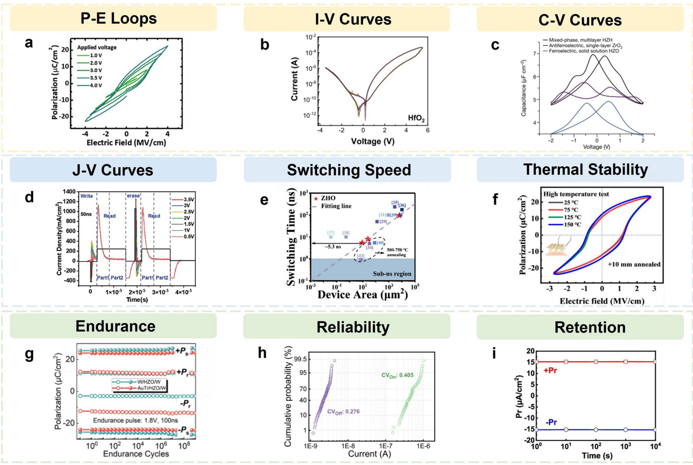
  - 图7：存储应用——TCAM/CECAM阵列与2D/3D FeNAND
  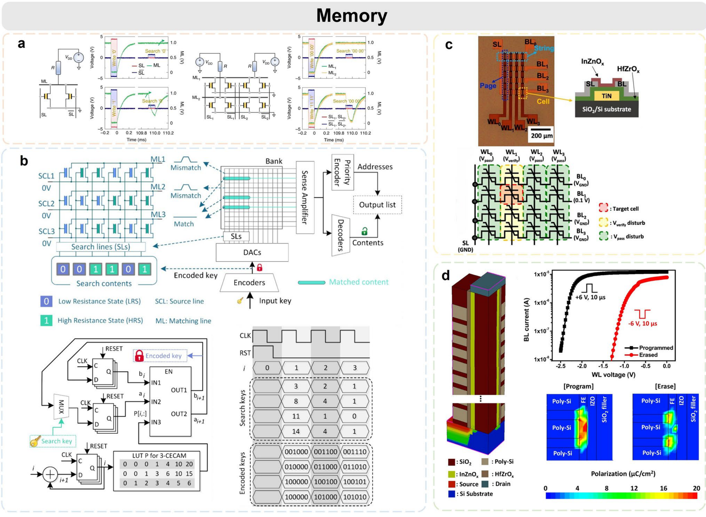
  - 图8：突触可塑性——EPSC/PPF/LTP-LTD/SADP/SWDP/SRDP/STDP/学习-遗忘-再学习
  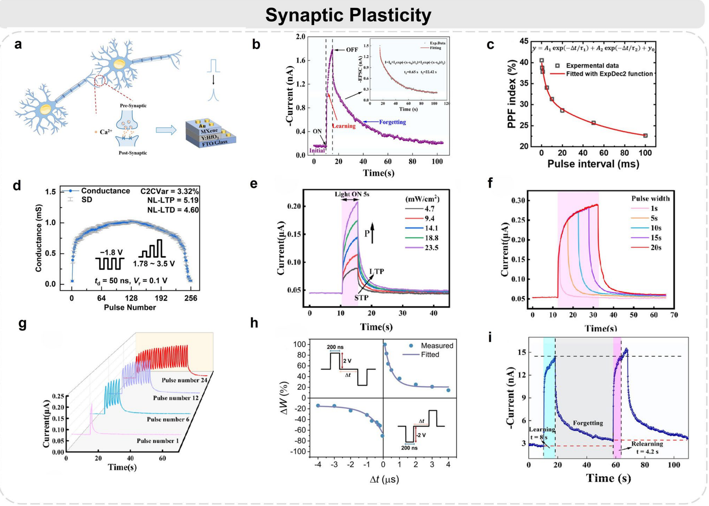
  - 图9：神经网络——SLP/CNN/SNN/VGG-11架构、MNIST识别与芯片集成
  
  - 图10：图像处理——ANN/CNN、储备池计算、图像加密、贝叶斯医学诊断、边缘检测
  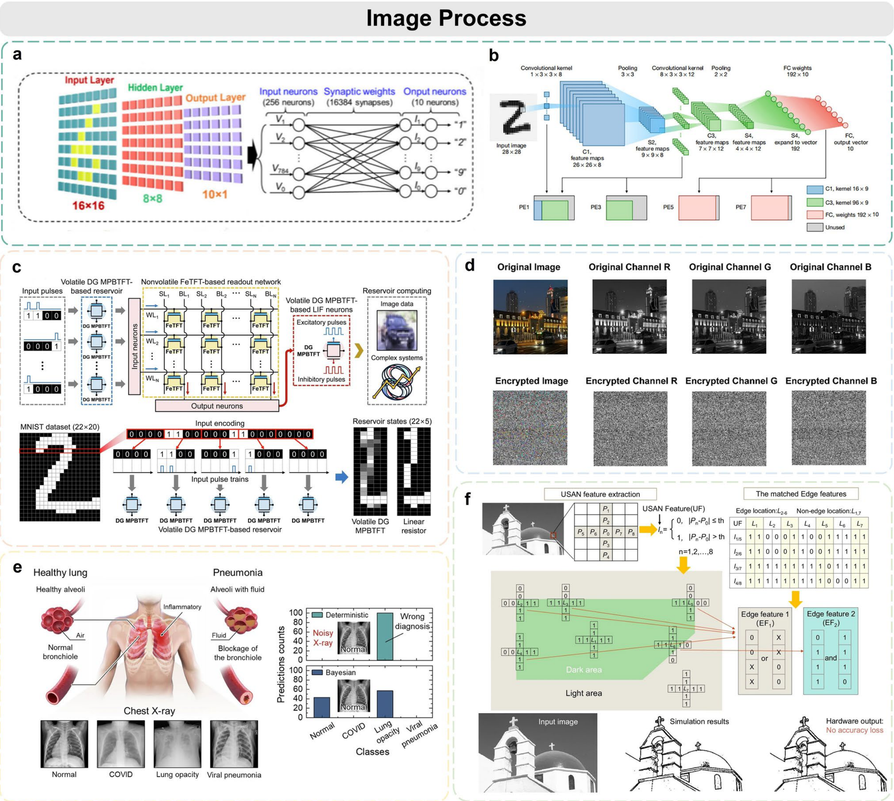
  - 图11：存内逻辑运算——AND/OR/NOR/NAND可重构布尔逻辑
  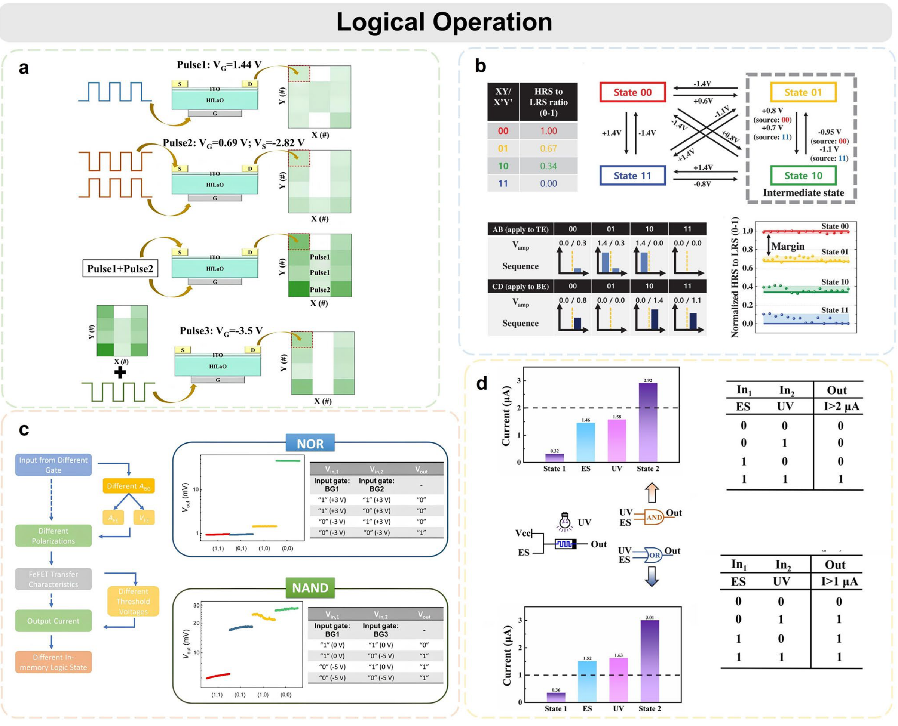
  - 图12：未来展望与挑战思维导图
  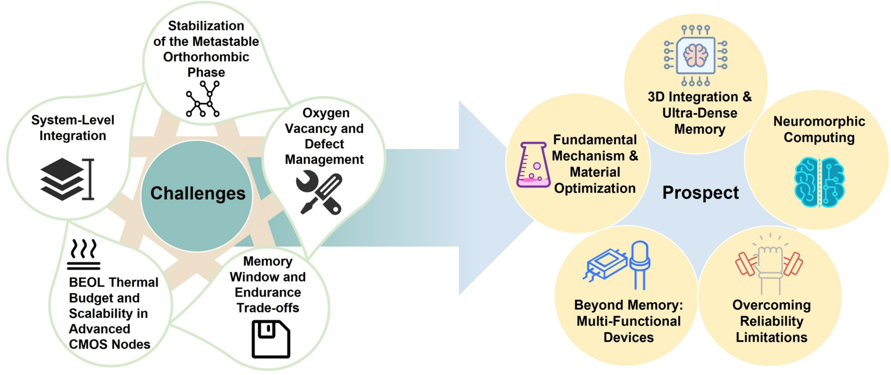
  - 表1：不同掺杂HfO₂铁电薄膜性能对比（掺杂剂/浓度/厚度/堆叠/2Pr/Ec/热稳定性）
  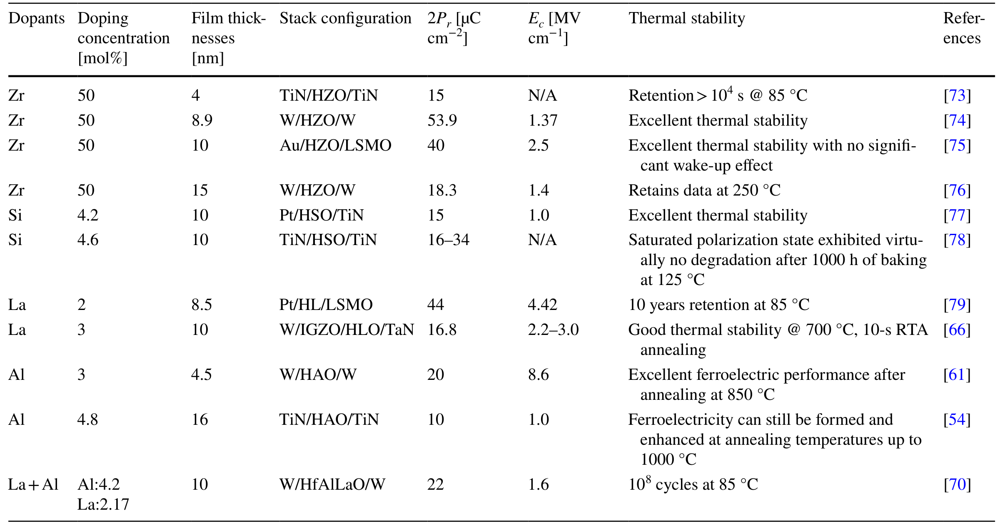
  - 表2：不同HfO₂铁电器件性能交叉对比（结构/开关速度/保持/耐久性/功耗）
  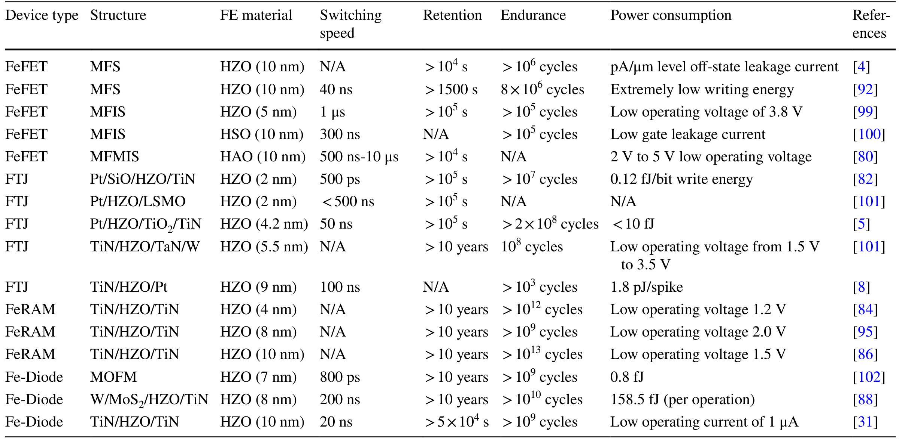
## 🔬 项目连接
  - **project-5 SnTe铁电模拟（medium）**：本文虽以HfO₂薄膜器件为核心，不直接涉及SnTe，但在铁电物理与计算方法层面对project-5 有明确参考价值：
    1. **极化翻转微观机制**：综述详细总结了畴壁运动（(2;0)型路径能垒仅73 meV，对比(1;1)型1.36 eV）与氧离子协同迁移（层内/层间路径）两种翻转机制，这一"低能垒畴壁路径"图像可类比SnTe中铁电畴翻转的能垒分析。
    2. **应变工程稳定铁电相**：Fan等证明>3%双轴拉伸应变使Pca2₁相比反极性Pbca相更稳定；泊松效应通过面内拉伸驱动t→o相变。这为SnTe应变调控铁电性提供了可类比的热力学框架。
    3. **DFT方法学参考**：Rohit Batra等用高通量第一性原理DFT筛选近40种掺杂剂对HfO₂相稳定性的影响，He等用DFT证明V_O²⁺浓度>2%时o相热力学稳定——这些掺杂/缺陷筛选的计算流程可迁移至SnTe的缺陷与应变计算。
    4. **软模声子图像**：Lee等通过第一性原理发现极性声子平带诱导无标度铁电序，这一声子软化机制与SnTe铁电失稳的软模图像相通。
    5. **FTJ器件物理**：铁电隧道结的隧穿电致电阻（TER）效应、极化调制势垒形状的概念，对理解SnTe作为铁电势垒层的器件物理有类比价值。
    局限：HfO₂为萤石结构氧化物、实验器件导向，SnTe为IV-VI族岩盐结构、DFT基础研究导向，材料体系与研究尺度差异较大，故评为medium而非strong。
  - **project-2 Mn多铁（weak）**：仅在展望中一句提及"基于HfO₂的多铁性材料有望应用于自旋轨道转矩器件"，无实质性 Mn或多铁机制讨论，参考价值有限。
  - project-1双光子、project-3机械发光NN、project-4 TTF分子计算、project-6湿度传感器、project-7 CDW：无直接项目连接。
## 📝 组织与用词
文章采用"背景问题→材料基础→器件结构→物理机制→性能指标→存储应用→神经形态计算→挑战展望"的总-分-总递进结构，逻辑链条是"冯·诺依曼瓶颈→Hf-FEs材料优势（CMOS兼容/微缩）→掺杂工程稳定o相→四类器件各有侧重→微观翻转机制→突触可塑性模拟→交叉阵列VMM→系统级集成挑战"。每个器件小节均按"结构原理→代表性性能数据→现存挑战"三段式展开。值得复用的关键词/术语：
  - 亚稳态极性正交相（metastable polar orthorhombic phase, Pca2₁）
  - 无标度铁电性（scale-free ferroelectricity）/ 平带声子（flat phonon bands）
  - 畴壁运动（domain wall motion）/ (2;0)-type vs (1;1)-type DW
  - 成核限制开关模型（nucleation-limited switching, NLS）/ KAI模型
  - 隧穿电致电阻比（tunneling electroresistance ratio, TER）
  - 存内计算/存内逻辑（in-memory computing / logic-in-memory, LiM）
  - 向量-矩阵乘法（vector-matrix multiplication, VMM）
  - 唤醒/疲劳/印记效应（wake-up / fatigue / imprint effect）
  - BEOL热预算（back-end-of-line thermal budget, <400 °C）
## ✏️ 可写入 Wiki 的要点
  1. HfO₂铁电性源于亚稳态极性正交相（o-phase, Pca2₁），而非稳定的单斜相（m-phase, P2₁/c）；温度序列为m→t（P4₂/nmc, >1973 K）→c（Fm3̄m, >2773 K）。2011年Böscke等首次在Si:HfO₂中发现铁电性。
  2. 掺杂工程是稳定o相的核心手段：Zr掺杂（HZO）工艺窗口最宽（400–600 °C结晶，50%浓度）；La掺杂稳定效应最强，2Pr可达55 μC cm⁻²（800 °C退火），并抑制氧空位；Al掺杂通过压应变稳定超薄膜铁电相；La-Al共掺杂协同调控氧空位与应变。
  3. 四类器件性能对比：FeFET（三端，MFS/MFMIS，开关比3.5×10⁶，存储窗口2 V）；FTJ（两端，500 ps开关，0.12 fJ/bit写入，>10⁷次循环）；FeRAM（1T-1C FeCAP，1.2 V低压，>10¹²–10¹³次循环，10年保持）；Fe-Diode（肖特基势垒调制，自选择抑制潜行电流，800 ps开关，16层3D堆叠，面积效率0.06 F²/state）。
  4. 铁电性起源三大理论：声子带驱动机制（软模→晶格失稳，Lee等平带声子诱导无标度铁电序）；缺陷介导机制（V_O²⁺>2%使o相热力学稳定于m相，解释唤醒/疲劳）；界面/尺寸约束机制（纳米尺度表面/界面能主导相稳定性）。当前共识为多尺度多物理场协同。
  5. 极化翻转微观路径：(2;0)型畴壁路径能垒仅73 meV（几何上类似t相），远低于(1;1)型1.36 eV；0.4%拉伸应变可消除过渡势垒。氧离子迁移分"层内迁移"（Op原位反转偶极）与"层间迁移"（Onp跨极性/非极性边界交换身份）两条路径。
  6. 宏观开关动力学：多晶HfO₂薄膜由成核过程主导（NLS模型），而非经典KAI模型的成核后自由横向扩展；Cristóbal Alessandri等提取HZO的最小开关时间τ∞≈236 ns、激活场Ea≈2.4 MV cm⁻¹、局域场增强因子符合广义贝塔分布。
  7. 应变调控定量结果：Fan等证明>3%双轴拉伸应变使Pca2₁相比反极性Pbca相更稳定；面内拉伸通过泊松效应引起面外收缩，驱动t→o相变。
  8. DFT掺杂筛选：Rohit Batra等用高通量DFT研究近40种掺杂剂，发现离子半径大、电负性低的掺杂剂（镧系、Ca/Sr/Ba/Y等）最有效稳定P-O1相。
  9. 神经形态实现：Hf-FEs交叉阵列通过欧姆定律+基尔霍夫定律在模拟域物理完成VMM；SLP在MNIST达90%准确率，SNN 50个epoch达~98%且抗噪声，VGG-11用于CNN评估；AFE HZO电容突触能耗245 fJ/spike，保持>10年，>10⁹次循环；1T-1R忆阻芯片能效119.7 TOPS/W，10 ns读出。
  10. 核心挑战：o相亚稳性可靠稳定；氧空位双重角色的精确纳米尺度控制；存储窗口-耐久性-低电压三角权衡；BEOL热预算冲突（结晶>450 °C vs BEOL <400 °C，PE-ALD可在300 °C实现2Pr≈20–40 μC cm⁻²）；3D集成的高深宽比保形沉积；器件间/循环间变异性的系统级容错。
