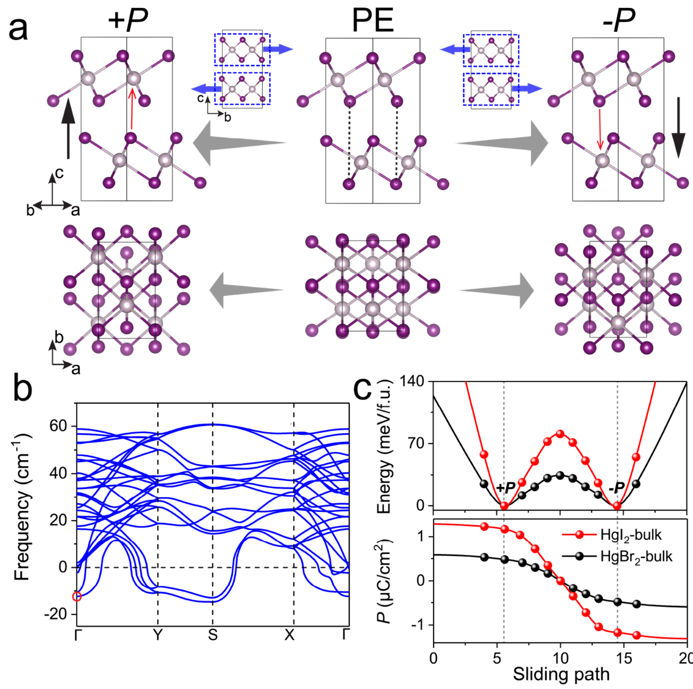

## chenStrongSlidingFerroelectricity2024 — 二维HgI₂层中的强滑动铁电性与层间滑动可控自旋电子效应

## 📄 元数据
陈新峰、丁新凯、缑高阳、曾晓成 et al.，2024，Nano Letters，24(10), 3089-3096，DOI: 10.1021/acs.nanolett.3c04869
## 💡 一句话
基于第一性原理计算预测可合成的范德华层状晶体 HgX₂（X=Br, I）为新型二维滑动铁电体，其中 HgI₂ 多层具有高达 0.16 μC/cm² 的实验可检测极化、室温可切换性以及层间滑动可控的 Rashba 自旋纹理，可用于二维自旋场效应晶体管。

## 🔗 Wiki 双链
  - 概念 [[../concepts/sliding-ferroelectricity]]
  - 概念 [[../concepts/berry-phase]]
  - 概念 [[../concepts/2D-materials]]
  - 概念 [[../concepts/spin-orbit-coupling]]
  - 概念 [[../concepts/polarization-switching]]
  - 概念 [[../concepts/multiferroicity]]
  - 概念 [[../concepts/strain-engineering]]
  - 概念 [[../concepts/depolarization-field|退极化场]]
  - 概念 [[../concepts/interfacial-charge-rearrangement|层间电荷重排]]
  - 概念 [[../concepts/rashba-effect|Rashba 效应]]
  - 概念 [[../concepts/slidetronics|滑移电子学]]
  - 概念 [[../concepts/soft-phonon-mode|软声子模式]]
  - 概念 [[../concepts/spin-texture|自旋纹理]]
  - 实体 [[../entities/VASP]]
  - 实体 [[../entities/In2Se3]]
  - 实体 [[../entities/SnTe]]
  - 实体 [[../entities/CrI3|CrI₃]]
  - 实体 [[../entities/HgBr2|HgBr₂]]
  - 实体 [[../entities/HgI2|HgI₂]]
  - 实体 [[../entities/MoTe2|MoTe₂]]
  - 实体 [[../entities/WTe2|WTe₂]]
  - 实体 [[../entities/ZrI2|ZrI₂]]
  - 图表 [[../figures/crystal-structures]]
  - 图表 [[../figures/electronic-bands]]
  - 图表 [[../figures/electronic-devices]]
  - 图表 [[../figures/mathematical-models]]
  - 图表 [[../figures/heterostructures-stacking-sliding|层间滑移铁电：机制、翻转与动力学]]
  - 年度 [[../write/2024]]
  - 项目 [[../projects/project-5-snte-ferroelectric-sim]]
  - 项目 [[../projects/project-2-mn-multiferroics]]
  - 相关论文 **chenStrongSlidingFerroelectricity2024**

## 🆕 新概念/实体建议
  - `rashba-effect`：Rashba 效应——结构反演不对称与 SOC 共同导致的自旋-动量锁定，能带在 Γ 点附近分裂为内/外两支并呈切向自旋纹理；本文通过极化翻转反转 Rashba 场方向。
  - `slidetronics`：滑移电子学——利用层间滑动调控铁电性及其他物理性质的新兴领域，本文将其功能拓展至自旋操控。
  - `depolarization-field`：退极化场——二维薄膜中由表面束缚电荷产生的与极化反向的电场，可抑制极化但同时降低翻转能垒；HgI₂ 双层 ε_d = −0.013 V/Å。
  - `interfacial-charge-rearrangement`：层间电荷重排——FE 双层相对于孤立单层在层间区域发生的电荷积累/耗尽，形成净层间偶极，是滑动铁电极化的主要微观来源。
  - `spin-texture`：自旋纹理——动量空间中电子自旋分量的分布图；FE-HgI₂ 双层在 k_x−k_y 平面呈近圆形切向 Rashba 纹理，±P 态纹理完全相反。
  - `screening-charge-integration`：屏蔽电荷积分法——对二维体系 FE 与 PE 相平面平均电荷密度差 Δρ(z) 沿面外方向积分以确定极化的方法，适用于无面外周期性的二维多层。
  - `soft-phonon-mode`：软声子模式——PE-HgI₂ 体相在 Γ 点附近的虚频模式（ω = −13.57 cm⁻¹），对应层间滑动不稳定性，驱动滑动铁电相变。
  - `double-well-potential`：双势阱——连接 ±P 态并经过 PE 态的能量曲线，是铁电双稳态的能量学标志。
  - 实体 `HgI2`：碘化汞，β-HgI₂（黄色）正交晶系 Cmc2₁ 相，由共边 HgI₆ 八面体构成单层，AB 堆垛形成体相；本文预测其二维多层为强滑动铁电体。
  - 实体 `HgBr2`：溴化汞，与 HgI₂ 同构 but 极化较弱（体相 0.47 μC/cm²，双层 0.02 μC/cm²）。
  - 实体 `WTe2`：外尔半金属，首个实验证实的滑动铁电体（2017），双层极化约 0.03 μC/cm²，作为本文极化强度对比基准。
  - 实体 `MoTe2`：1T′ 相过渡金属二硫化物，具有滑动铁电性，其 PE 相软模频率约 −9 cm⁻¹。
  - 实体 `CrI3`：扭曲 CrI₃ 双层中堆垛铁电性与铁磁性共存，是罕见的二维多铁材料，在本文引言中作为多铁耦合案例引用。
  - 实体 `ZrI2`：β-ZrI₂，T_d 相滑动铁电体，体相极化 0.24 μC/cm² 但翻转势垒极高。
  - 实体 `Datta-Das-spin-FET`：Datta–Das 型自旋场效应晶体管，利用 Rashba 场调控自旋进动实现开关；本文基于 FE-HgI₂ 双层设计沟道长度 143 nm 的自旋 FET。

## 📊 关键图表
  -  → [[../figures/heterostructures-stacking-sliding|层间滑移铁电：机制、翻转与动力学]]
  -  → [[../figures/heterostructures-stacking-sliding|层间滑移铁电：机制、翻转与动力学]]
  -  → [[../figures/heterostructures-stacking-sliding|层间滑移铁电：机制、翻转与动力学]]
  -  → [[../figures/heterostructures-stacking-sliding|层间滑移铁电：机制、翻转与动力学]]
  -  → [[../figures/heterostructures-stacking-sliding|层间滑移铁电：机制、翻转与动力学]]
  -  -> [[../figures/mathematical-models|数学模型与物理公式]]

## 🔬 项目连接
  - **project-5（SnTe铁电模拟）— strong**：本文是二维铁电材料的第一性原理模拟工作，方法链与 project-5 高度可复用：(1) Berry 相位法计算体相极化、屏蔽电荷积分法计算二维极化，可直接迁移至 SnTe 薄膜/异质结极化计算；(2) NEB 方法计算极化翻转路径与能垒（体相 80.90 meV/f.u. → 双层 24.65 meV/f.u. 的维度调控思路），对 SnTe 翻转势垒的厚度/应变依赖研究有直接参考价值；(3) 退极化场 ε_d 的估算方法（拟合宏观平均静电势斜率）及 ε_d × P 静电排斥能与 FE-PE 能垒的比较判据，可用于判断 SnTe 超薄膜铁电稳定性；(4) DFT-D3 范德华修正、VASP 计算流程、声子谱/AIMD 稳定性验证均为可复用计算流程。此外，参考文献 [9] 即 Chang et al. Science 2016 的 SnTe 面内铁电性实验工作，与项目直接相关。
  - **project-2（Mn多铁）— weak**：本文核心是铁电-自旋耦合（Rashba 自旋纹理可被极化翻转电控），属于广义磁电耦合/多铁物理范畴；引言中引用了扭曲 CrI₃ 双层中堆垛铁电性与铁磁性共存的二维多铁案例。对 project-2 的参考价值主要在于物理图像层面：层间滑动诱导铁电性、铁电极化反转自旋-轨道场方向的机制，可为 Mn 基多铁材料中电控磁的微观机制提供类比；但材料体系（HgI₂ vs Mn 氧化物）差异较大，无直接方法迁移。
  - project-1（双光子）：无直接连接。文中仅一句提及 HgI₂ 体相因非中心对称结构已用于二阶非线性光学，但不涉及双光子荧光。
  - project-3（机械发光NN）：无连接。
  - project-4（TTF分子计算）：无直接连接。虽同为 DFT 计算，但 HgI₂ 为无机层状晶体，与 TTF 分子晶体体系差异大；Berry 相位极化计算方法在分子晶体中一般不适用。
  - project-6（湿度传感器）：无连接。
  - project-7（CDW）：无直接连接。文中提到的 WTe₂、MoTe₂ 等材料在其他文献中与 CDW 物理相关，但本文不涉及 CDW。

## 🔗 项目双链
- 项目 [[../projects/project-5-snte-ferroelectric-sim|项目五：lammps势函数SnTe铁电模拟]]
- 项目 [[../projects/project-2-mn-multiferroics|项目二：Mn极化结构铁电材料]]

## 📝 组织与用词
  文章采用"体相→少层→多层→器件应用"的递进论证结构。首先从实验已知的 Cmc2₁ 体相出发，构建 Cmca 高对称 PE 参考相，通过声子软模和双势阱曲线证实滑动铁电性并指出体相不可切换的瓶颈；然后"剥离"双层，展示退极化场降低能垒实现可切换性，并用差分电荷密度阐明层间电荷重排的微观机制；接着扩展到 3-6 层，揭示极化饱和规律；最后利用 SOC + 反演破缺产生的 Rashba 效应设计自旋 FET。每一步都有对称性论证、能量学判据和电子结构分析三重支撑。

  值得在 wiki 叙述中复用的关键词/术语：
  - 滑动铁电性（sliding ferroelectricity）
  - 滑移电子学 [[../concepts/slidetronics|滑移电子学]]（slidetronics）
  - 退极化场 [[../concepts/depolarization-field|退极化场]]（depolarization field, ε_d）
  - 层间电荷重排 [[../concepts/interfacial-charge-rearrangement|层间电荷重排]]（interfacial charge rearrangement）
  - 屏蔽电荷（screening charge, Δρ）
  - 软声子模/滑动声子（soft/sliding phonon mode）
  - 双势阱势能（double-well potential）
  - Rashba 自旋纹理（Rashba spin texture）
  - 自旋-动量锁定（spin-momentum locking）
  - Datta–Das 自旋场效应晶体管（Datta–Das spin-FET）

## ✏️ 可写入 Wiki 的要点
  1. **HgI₂ 晶体结构**：β-HgI₂（黄色）正交晶系，空间群 Cmc2₁（FE 相），由共边连接的扭曲 HgI₆ 八面体构成单层（四个长键、两个短键），单层本身中心对称；体相由单层沿 b 轴净滑动后 AB 堆垛而成。高对称 PE 参考相为 AA 堆垛，空间群 Cmca。层间结合能 E_b = −24.41 meV/Ų（HgI₂ 体相），属范德华层间作用。
  2. **滑动铁电相变的声子判据**：PE-HgI₂ 体相声子谱在 Γ 点附近出现虚频软模 ω = −13.57 cm⁻¹（HgBr₂ 为 −10.40 cm⁻¹），位移模式对应层间沿 ±b 轴滑动，优化后得到 ±P 两个 FE 态。该软模频率大于 T_d-MoTe₂ 的约 −9 cm⁻¹，预示更强的滑动[[../concepts/ferroelectricity|铁电性]]。
  3. **极化与能垒的维度调控**：体相 HgI₂ 极化 P = 1.16 μC/cm²（Berry 相位法），但[[../concepts/switching-barrier|翻转势垒]]高达 80.90 meV/f.u.（HgBr₂ 为 34.42 meV/f.u.），远超室温热涨落，体相实际不可电场翻转，更像具有负纵向压电性的垂直极化层状材料。减薄为双层后，[[../concepts/depolarization-field|退极化场]] ε_d = −0.013 V/Å 将极化压至 0.11 μC/cm²，但势垒降至 24.65 meV/f.u.（HgBr₂ 双层 11.25 meV/f.u.），与室温 k_BT 可比，实现可切换铁电性。
  4. **极化起源为[[../concepts/interfacial-charge-rearrangement|层间电荷重排]]而非离子位移**：FE-HgI₂ 双层差分[[../concepts/charge-density|电荷密度]]（等值面 ±4.5×10⁻⁴ e/bohr³）显示层间区域电荷积累/耗尽形成净偶极，方向与总极化平行；而 Hg 离子相对八面体中心的位移 d_Hg = 0.06 Å（双层）方向与总极化相反，对极化作负贡献。单层区域屏蔽电荷积分近乎抵消。这一结论与 β-ZrI₂ 等过渡金属碘化物滑动铁电体一致字段。
  5. **退极化场与铁电稳定性判据**：FE-HgI₂ 双层 ε_d × P 对应的静电排斥能为 0.43 meV/f.u.，远小于 FE-PE 能垒 ΔE_FE-PE = −24.65 meV/f.u.，解释了超薄双层在室温下铁电序的稳健性。ε_d 由拟合宏观平均静电势斜率得到。
  6. **多层极化饱和**：3-6 层 Δρ(z) 分区积分表明：单层区贡献抵消，表面区贡献负向极化，层间区贡献正向且协同叠加。随层数增加，层间极化贡献增多但平均层间极化 P̄ 下降（退极化场增强），总极化 P 在约 4-5 层后趋于饱和，预测厚纳米片 P ≈ 0.16 μC/cm²。该值高于 WTe₂ 双层（~0.03 μC/cm²）和 3R-MoS₂（~0.05 μC/cm²），超过 PFM 等实验手段的可靠检测阈值（~0.1 μC/cm²）。
  7. **Rashba 自旋分裂**：PBE+SOC 计算显示 FE-HgI₂ 双层 VBM 和 CBM 沿 Γ−X、Γ−Y 方向均分裂为内/外两支（inner/outer），内外支自旋取向相反（顺时针/逆时针切向）。Rashba SOC 哈密顿量 H_SOC = α(σ_x k_y − σ_y k_x)。±P 态的[[../concepts/spin-texture|自旋纹理]]完全相反，即层间滑动翻转极化的同时反转自旋-轨道场方向。体相 FE-HgI₂ 因极化更强，能带分裂更显著。
  8. **Datta–Das 自旋 FET 设计**：以 FE-HgI₂ 双层为半导体沟道，两端铁磁电极沿 +z 方向磁化。注入自旋在 Rashba 场下进动，沟道长度 L = 143 nm 时进动角 θ = ±π/2；栅压翻转极化使 Rashba 场反向，到达漏极的自旋平行（ON）或反平行（OFF）于漏极磁化，实现非易失逻辑开关。
  9. **稳定性验证**：声子计算无虚频（FE 相）、300 K AIMD 模拟结构保持完整，证实双层/多层动力学与热力学稳定性。HgI₂ 体相早在数十年前即由 Bridgman–Stockbarger 法或气相传输法合成，少层有望通过机械剥离获得，材料可合成性强。
  10. **方法学细节**：使用 VASP 包，[[../concepts/pbe-functional|PBE 泛函]]，DFT-D3 [[../concepts/vdw-correction|范德华修正]]；体相极化用 Berry 相位法，二维多层极化用 FE/PE 相平面平均屏蔽电荷差 Δρ(z) 积分法；翻转路径用 NEB（climbing-image NEB）；声子用有限位移法。HgI₂ 双层极化 0.11 μC/cm² 大于 WTe₂ 双层（~0.03 μC/cm²），是其"强滑动铁电性"定位的定量依据。
