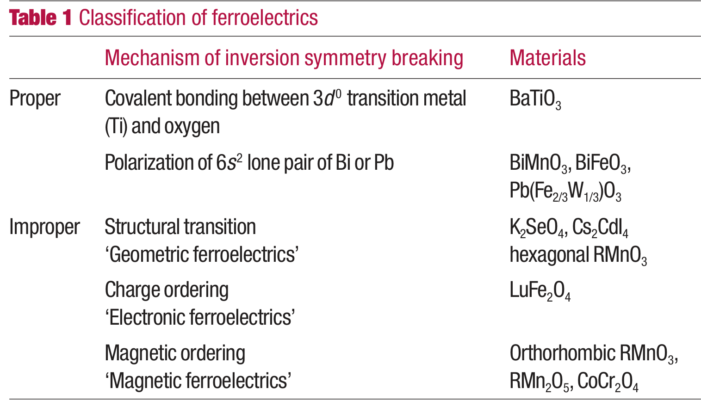
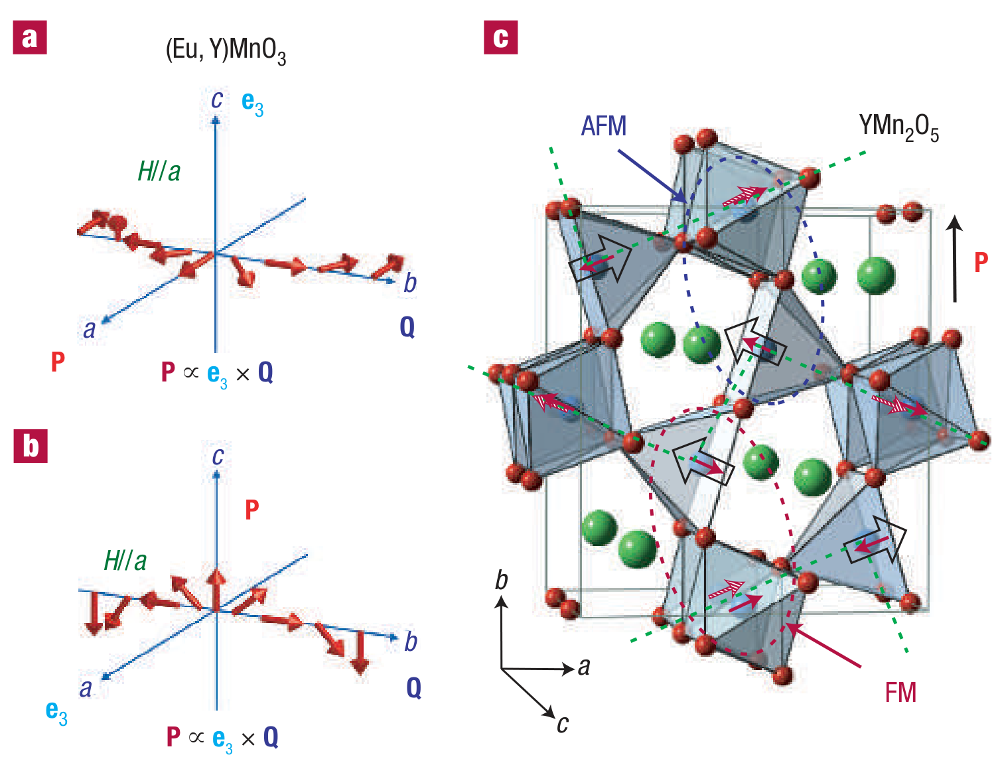
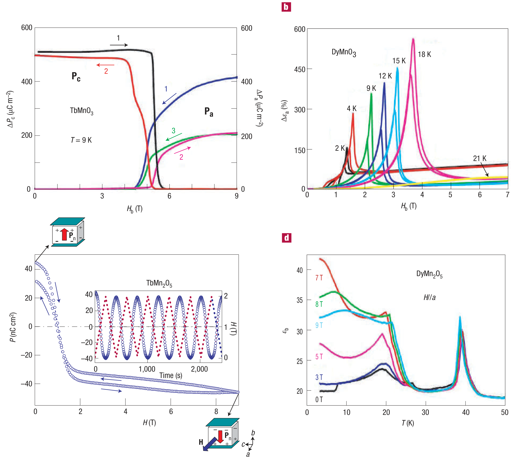

## cheongMultiferroicsMagneticTwist2007a — 多铁性：铁电的磁扭曲（Multiferroics: a magnetic twist for ferroelectricity）

## 📄 元数据
Sang-Wook Cheong & Maxim Mostovoy，2007，*Nature Materials* 6(1), 13–20，DOI [10.1038/nmat1804](https://doi.org/10.1038/nmat1804)
## 💡 一句话
系统阐述"磁阻挫 → 复杂（螺旋/共线）磁序 → 自发破缺空间反演 → 磁致电极性"这一新范式，给出逆 DM（自旋流）与交换伸缩两类微观机制及 P ∥ e₃×Q 的方向定则。

## 🔗 Wiki 双链
  - 概念 [[../concepts/multiferroicity]]
  - 概念 [[../concepts/magnetoelectric-coupling]]
  - 概念 [[../concepts/polarization-switching]]
  - 概念 [[../concepts/spin-orbit-coupling]]
  - 概念 [[../concepts/berry-phase]]（电极化的现代理论背景，文中讨论 P 作为序参量）
  - 概念 [[../concepts/magnetic-frustration|磁阻挫]]
  - 概念 [[../concepts/improper-ferroelectricity|非本征铁电性]]
  - 概念 [[../concepts/spiral-magnetic-order|螺旋磁序]]
  - 概念 [[../concepts/inverse-dm-interaction|逆 Dzyaloshinskii–Moriya 相互作用 / 自旋流机制]]
  - 概念 [[../concepts/exchange-striction|交换伸缩]]
  - 概念 [[../concepts/electromagnon|电磁振子]]
  - 概念 [[../concepts/toroidal-moment|环矩]]
  - 概念 [[../concepts/TbMnO3|TbMnO₃（铽锰氧）]]
  - 实体 [[../entities/BiFeO3]]
  - 实体 [[../entities/HoMnO3]]
  - 实体 [[../entities/domain-wall]]
  - 实体 [[../entities/CoCr2O4|CoCr₂O₄（尖晶石锥形磁体）]]
  - 实体 [[../entities/LuFe2O4|LuFe₂O₄（电子铁电体）]]
  - 图表 [[../figures/crystal-structures]]
  - 图表 [[../figures/mathematical-models]]
  - 图表 [[../figures/heterostructures-stacking-multiferroic|多铁与磁电异质结 (Multiferroic & Magnetoelectric Heterostructures)]]
  - 年度 [[../write/2007]]
  - 项目 [[../projects/project-2-mn-multiferroics]]
  - 主题 [[../topics/D02-多铁性材料]]
  - 相关论文 **cheongMultiferroicsMagneticTwist2007a**

## 🆕 新概念/实体建议
  - `RMn2O5.md`（实体）：第二类多铁性的原型材料家族，应建实体条目。

## 📊 关键图表
  - 
  - 
  - 
  - 
  -  → [[../figures/heterostructures-stacking-multiferroic|多铁与磁电异质结]]
  - 
  - 

## 🔬 项目连接
  - **project-2（Mn 极化结构铁电材料）—— 核心综述参考**：本文是理解 Mn 基多铁性的奠基性综述，直接覆盖正交 RMnO₃（TbMnO₃、DyMnO₃、Eu₀.₇₅Y₀.₂₅MnO₃）与 RMn₂O₅ 两大 Mn 氧化物家族，详述 Mn³⁺/Mn⁴⁺ 共存时的交换伸缩机制、Mn³⁺ 轨道有序导致的 a–b 面铁磁/次近邻反铁磁竞争、以及极化方向与螺旋波矢/旋转轴的 P ∥ e₃×Q 关系。为项目的第一性原理计算提供：(1) 判断"磁序是否破缺反演对称"的对称性分析框架；(2) 逆 DM 与交换伸缩两种极化微观机制的物理图像；(3) 具体材料的磁转变温度序列（RMn₂O₅: T₁≈42–45 K 非公度正弦、T₂≈38–41 K 公度反铁磁/铁电、T₃≈20–25 K 重入、T₄≤10 K 稀土有序）；(4) BiMnO₃/BiFeO₃ 作为"本征共存但弱耦合"反例的对照。写 prb.tex 时可作为引言与机制讨论的核心引文。
  - **project-1（双光子）—— 无直接项目连接**：文中讨论电磁振子的光学吸收（红外/THz 频段），与双光子非线性光学在频段和物理机制上均不同，无可复用方法或数据。
  - **project-3（机械发光 NN）—— 无直接项目连接**：无机械发光、力电耦合或神经网络相关内容。
  - **project-4（TTF 分子计算）—— 无直接项目连接**：对象为无机过渡金属氧化物，与分子晶体 TTF 的计算流程无方法学共性。
  - **project-5（SnTe 铁电模拟）—— 弱概念参考**：SnTe 是本征铁电体（孤对电子机制），本文表 1 将其与 BiFeO₃ 等并列为本征类；文章对"本征 vs 非本征铁电性"的界定、极化作为对称性破缺序参量的讨论、以及 P ∝ ∂φ（极化正比于螺旋角梯度）这一拓扑式表达，对理解铁电相变的朗道理论有参考价值，但不涉及 SnTe 本身或其计算方法，判定为弱概念连接。
  - **project-6（湿度传感器）—— 无直接项目连接**。
  - **project-7（CDW 电荷密度波）—— 边缘参考**：文章讨论电荷有序绝缘体（Fe₃O₄ 的 Verwey 转变、Pr₁₋ₓCaₓMnO₃ 位点/键中心电荷序、LuFe₂O₄ 电子铁电体），这些"电荷序破缺反演对称"的物理与 CDW 体系中的对称性破缺、非公度调制有可类比之处，但 CDW 项目关注的是过渡金属二硫化物中的 CDW，机理与材料体系差异较大，仅作边缘类比。

## 📝 组织与用词
  - 文章采用"困境 → 范式转换 → 物理引擎 → 微观机制 → 实验验证 → 展望"的递进结构。先以 d⁰/dⁿ 填充矛盾说明传统多铁性的互斥性，再引入非本征铁电性，随后以对称性变换（P 在空间反演变号、M 在时间反演变号）论证静态 P–M 只能非线性耦合，而 PM∂M 三阶项使空间非均匀磁序必然诱导极化；主体分两章分别讲螺旋序（逆 DM/自旋流）与共线序（交换伸缩），最后给出锥形磁体、畴壁、电磁振子、复合材料与室温化等方向。
  - 值得复用的术语：
    - 多铁性材料 multiferroics
    - 本征/非本征铁电性 proper / improper ferroelectricity
    - [[../concepts/magnetic-frustration|磁阻挫 magnetic frustration]]
    - [[../concepts/spiral-magnetic-order|螺旋磁序 spiral magnetic order]]
    - [[../concepts/inverse-dzyaloshinskii-moriya|逆 Dzyaloshinskii–Moriya 相互作用 / 自旋流机制 inverse DM interaction / spin-current mechanism]]
    - [[../concepts/exchange-striction|交换伸缩 exchange striction]]
    - 极化翻转 polarization flop（90°）/ reversal（180°）
    - [[../concepts/electromagnon|电磁振子 electromagnon]]
    - [[../concepts/toroidal-moment|环矩 toroidal moment]]

## ✏️ 可写入 Wiki 的要点
  1. **d 壳层填充矛盾**：传统本征铁电体需要过渡金属空 d 壳层（如 BaTiO₃ 中 Ti⁴⁺ 的 3d⁰，通过 O 2p→Ti 3d 虚跃迁形成共价键与集体位移），磁性需要部分填充 d 壳层；这使铁电性与磁性在同一离子上互斥。BiMnO₃、BiFeO₃ 靠 Bi³⁺ 的 6s² 孤对电子提供铁电、Mn³⁺/Fe³⁺ 提供磁性，因源自不同离子 而耦合极弱——BiMnO₃ 在 9 T 场下介电常数变化 < 0.6%。
  2. **非本征铁电性分类（表1）**：几何铁电体（六方 RMnO₃，R=Ho–Lu,Y；K₂SeO₄）、电子铁电体（LuFe₂O₄，Fe 平均价 +2.5，低温下双层 Fe²⁺:Fe³⁺ 呈 2:1 与 1:2 交替产生层间极化）、磁性铁电体（正交 RMnO₃、RMn₂O₅、CoCr₂O₄）。
  3. **对称性论证（公式1）**：P 在 r→–r 下变号、在 t→–t 下不变；M 反之。静态均匀 M 与 P 间只允许 –P²M² 四阶项（不足以克服极化畸变能 +P²）；当 M 空间变化时，三阶项 P·[(M·∇)M – M(∇·M)] 被允许，对 P 线性，任意弱耦合也能在适当磁序出现时诱导极化。
  4. **自旋链模型与阻挫判据**：最近邻铁磁 J<0、次近邻反铁磁 J′>0 的一维链，当 J′/|J|>1/4 时海森堡基态为螺旋态 S_n = S[e₁cosQx_n + e₂sinQx_n]，cos(Q/2)=–J′/(4J)；伊辛极限下（J′/|J|>1/2）为 ↑↑↓↓ 共线基态。磁阻挫的实验判据为 |T_CW| ≫ T_N，如 YMn₂O₅ 的 T_CW≈250 K 而 T₁≈45 K（比值约 5.5）。
  5. **P ∥ e₃ × Q（公式3）**：螺旋磁序由波矢 Q 与自旋旋转轴 e₃=e₁×e₂ 表征，诱导极化同时垂直于二者。该定则定量解释 TbMnO₃ 零场下 Q∥b、e₃∥a（文中按 Mn 自旋描述）给出 P∥c，以及 H∥a (~5 T) 自旋翻转后 e₃∥c、P 转至 a 轴的 90° polarization flop；正弦自旋密度波 S_n∝cosQx_n 在反演下不变，故为顺电态，这也是铁电转变温度略低于首个磁相变温度的原因。
  6. **逆 DM / 自旋流微观机制（图5）**：Dzyaloshinskii 矢量 D_{n,n+1} ∝ x × r_{n,n+1}（x 为配体氧偏离 M–M 连线的位移）；DM 能 D·(S_n×S_{n+1}) 随 x 增大而降低，螺旋序中所有相邻 S_n×S_{n+1} 同向，等效于把所有负氧离子推向同一方向产生宏观 P。等价表述为自旋流 j_{n,n+1} ∝ S_n×S_{n+1}，键偶极 P_{n,n+1} ∝ r_{n,n+1}×j_{n,n+1}。
  7. **交换伸缩机制（RMn₂O₅，图6c）**：Mn³⁺(S=2，氧金字塔) 与 Mn⁴⁺(S=3/2，氧八面体) 构成五自旋环 Mn⁴⁺–Mn³⁺–Mn³⁺–Mn⁴⁺–Mn³⁺，奇数环导致阻挫；公度相中沿 a 轴形成 AFM 锯齿链，跨链 Mn³⁺–Mn⁴⁺ 对一半反平行、一半平行，海森堡交换使反平行对键缩短、平行对键拉长，非对称畸变破缺反演对称并产生沿 b 轴的 P。该机制由海森堡交换（而非弱 DM）驱动，故潜在极化更大；朗道耦合形式为 P(L₁²–L₂²)，L₁、L₂ 为两种 ↑↑↓↓ 序。
  8. **标志性实验数据**：TbMnO₃ 中铁电性与螺旋序在 ~28 K 同步出现；~5 T 场下极化矢量旋转 90°；DyMnO₃ 在 ~5 T 窄场范围内介电常数增长约 500%（巨磁介电/colossal magnetodielectric effect）；TbMn₂O₅ 中脉冲磁场可高度可逆地实现 180° 极化翻转（+P_b ↔ –P_b，约 ±40 nC/cm²），显示非易失存储潜力；磁致电铁体的极化值约 10⁻² μC/cm² 量级，比传统铁电体（10⁰–10² μC/cm²）小 2–3 个数量级，但磁场可调性空前。
  9. **锥形磁体与环矩**：CoCr₂O₄ 等尖晶石中 S_n = S⊥[e₁cosQx_n+e₂sinQx_n]+S∥e₃，旋转分量产生 P、均匀铁磁分量提供低场"手柄"，反转 P 所需磁场远低于稀土锰氧化物；P 与净 M 共存产生平均环矩 ⟨T⟩ ∝ ⟨P×M⟩，平行于 Q，低场旋转 P、M 时 T 不变。
  10. **畴壁极化与电磁振子**：由式(1)，P ∝ ∂φ（φ 为螺旋中自旋取向角），故总极化正比于自旋旋转总圈数；180° Néel 壁等价于半周期螺旋（e₃⊥Q）因而携带净电极化，而 Bloch 壁（e₃∥Q）不携带——这为在室温常规铁磁薄膜中实现局域多铁性提供思路。磁振子通过 PM∂M 项与极性声子杂化形成 electromagnon，使磁振子可被电偶极跃迁（红外吸收）直接观测，Tb(Gd)MnO₃ 中已有吸收峰报道。
