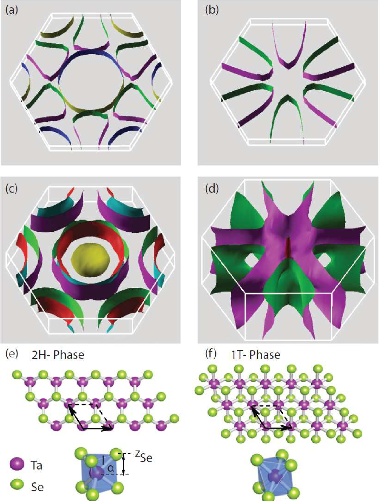
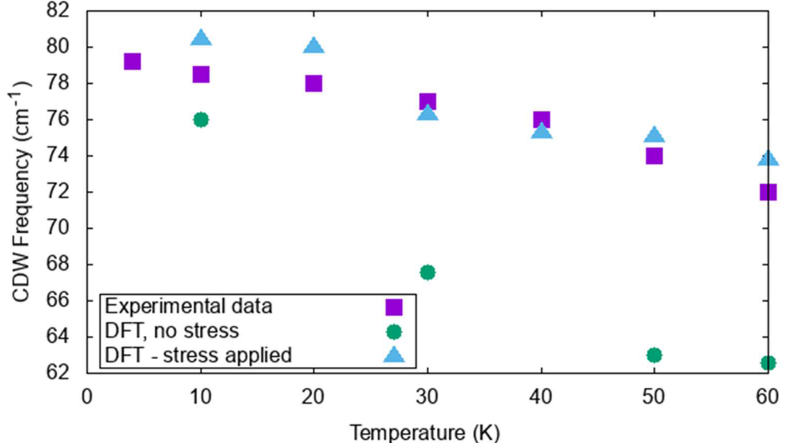
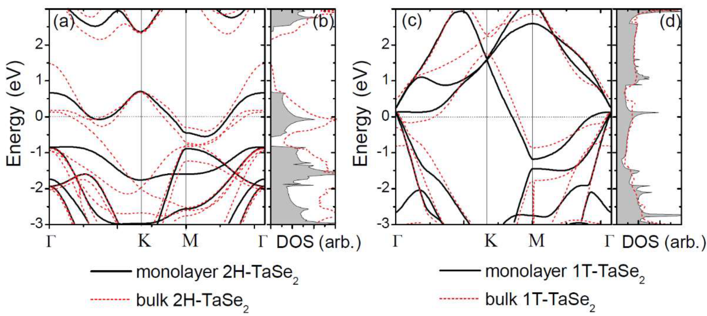
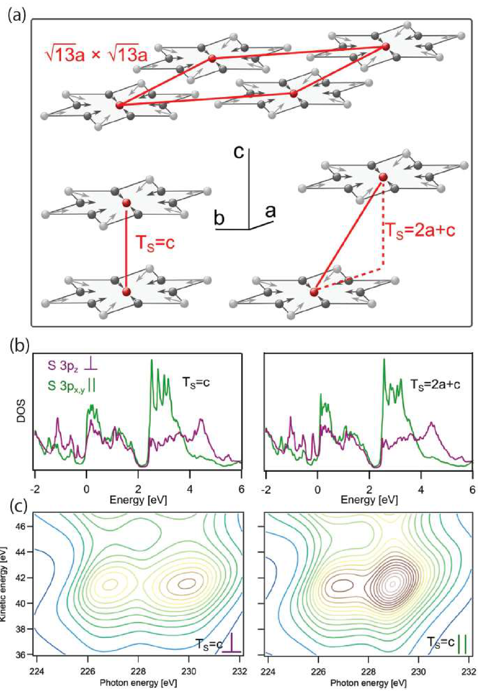
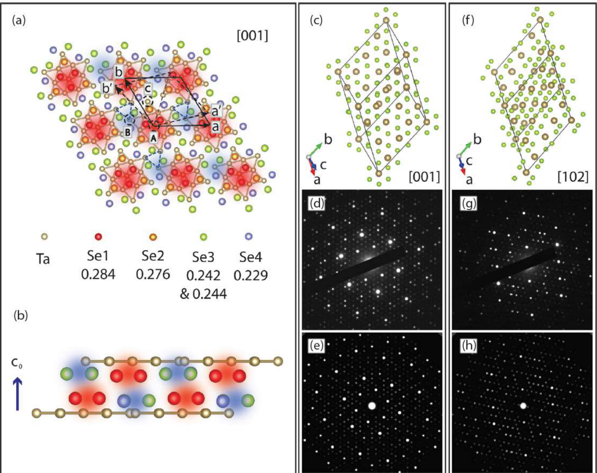
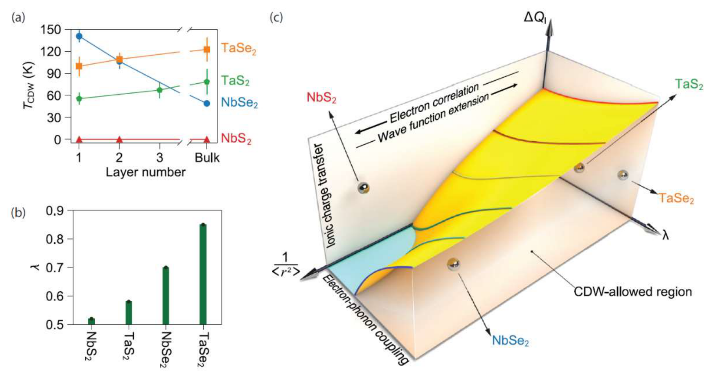
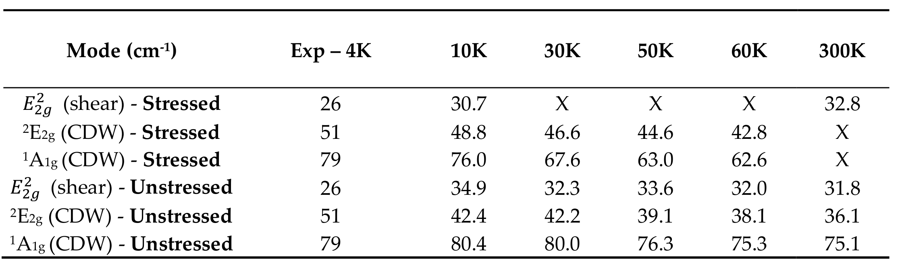
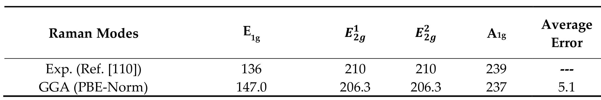

## chowdhuryReviewTheoreticalComputational — 二维电荷密度波材料的理论与计算方法综述（Review of Theoretical and Computational Methods for 2D Materials Exhibiting Charge Density Waves）

## 📄 元数据
Sugata Chowdhury、Heather M. Hill、Albert F. Rigosi、Patrick M. Vora、Angela R. Hight Walker、Francesca Tavazza 等，年份与期刊/DOI 在笔记元数据中缺失（参考文献最晚至 2021 年，据作者与标题推断应为 Nanomaterials 2021, 11, 2305，DOI 10.3390/nano11092305，需核实）
## 💡 一句话
本综述以 TaS₂ 与 TaSe₂ 为核心，系统总结了用 DFT 等第一性原理方法研究二维 TMDs 中电荷密度波（CDW）时在温度模拟、非公度结构建模、泛函/赝势选择三方面的计算策略，并整理了其在原子/电子结构、拉曼振幅模/相位模、限域与维度效应上的成果。
## 🔗 Wiki 双链
本文涉及且 wiki 中已存在的条目，用双链列出（存在才链）：
  - 概念 [[../concepts/charge-density-wave]]
  - 概念 [[../concepts/density-functional-theory]]
  - 概念 [[../concepts/2d-materials]]
  - 概念 [[../concepts/spin-orbit-coupling]]
  - 概念 [[../concepts/strain-engineering]]
  - 概念 [[../concepts/moire-superlattice]]（展望中提到转角/异质结对 CDW 的调控）
  - 概念 [[../concepts/electron-phonon-coupling]]
  - 概念 [[../concepts/amplitudon-phason]]
  - 概念 [[../concepts/commensurate-incommensurate-cdw]]
  - 概念 [[../concepts/electronic-temperature-smearing]]
  - 概念 [[../concepts/star-of-david-cluster]]
  - 实体 [[../entities/TMDs]]
  - 实体 [[../entities/VASP]]
  - 实体 [[../entities/TaS2]]
  - 实体 [[../entities/TaSe2]]
  - 实体 [[../entities/Quantum-ESPRESSO]]
  - 实体 [[../entities/SIESTA]]
  - 实体 [[../entities/Elk]]
  - 图表 [[../figures/electronic-bands]]
  - 图表 [[../figures/vibrational-spectra]]
  - 图表 [[../figures/heterostructures-stacking]]
  - 年度 [[../write/2020-2024|2022]]
  - 项目 [[../projects/project-7-cdw-charge-density-wave]]
  - 相关论文 [[../../raw/note/chowdhuryReviewTheoreticalComputational]]

## 🆕 新概念/实体建议
wiki 中没有、但值得新建的概念或材料实体，每个给 kebab-case 建议文件名 + 一句说明
  - 概念 [[../concepts/electron-phonon-coupling|electron-phonon-coupling]]：电子-声子耦合常数 λ，CDW 与超导竞争的核心参量，也是 Lin 等统一相图的三轴之一。
  - 概念 [[../concepts/kohn-anomaly|kohn-anomaly]]：科恩异常，特定波矢处声子的急剧软化，是 CDW 相变的前兆；文中指出 TaSe₂ 中位于布里渊区 M 点。
  - 概念 [[../concepts/amplitudon-phason|amplitudon-phason]]：CDW 序参量的振幅模（amplitudon，随温度软化/窄化）与相位模（phason，仅在 C-CDW 相中成为拉曼活性光学模）。
  - 概念 [[../concepts/fermi-surface-nesting|fermi-surface-nesting]]：费米面嵌套，连接费米面平行段的波矢驱动声子软化与 CDW 不稳定性。
  - 概念 [[../concepts/commensurate-incommensurate-cdw|commensurate-incommensurate-cdw]]：公度/非公度 CDW，周期与原晶格是否整数比；非公度性是 DFT 周期性边界建模的主要难点。
  - 概念 [[../concepts/electronic-temperature-smearing|electronic-temperature-smearing]]：以 Fermi–Dirac 展宽 σ 改变电子温度来近似真实晶格温度的低成本 DFT 方案。
  - 实体 [[../entities/TaS2|TaS2]]：二硫化钽，1T 相具有"大卫之星"√13×√13 重构，C-CDW 相中出现各向同性三维电荷转移，单层 2H 相超导 Tc 由亚开尔文提升至 3.4 K。
  - 实体 [[../entities/TaSe2|TaSe2]]：二硒化钽，2H/1T 两相随维度发生三角-条纹结构转变，是振幅模/相位模识别的样板体系。
  - 实体 [[../entities/Quantum-ESPRESSO|Quantum-ESPRESSO]]：文中主要使用的平面波 DFT 软件包，配合 LDA-PW 与模守恒赝势。
  - 实体 [[../entities/SIESTA|SIESTA]]：用于 1T-TaS₂ C-CDW 相电子结构与电荷转移计算的原子轨道基组 DFT 代码。
  - 实体 [[../entities/Elk|ELK]]：用于 1T-TaSe₂ 瞬态三维结构计算的全势线性缀加平面波（FP-LAPW）代码。
  - 概念 [[../concepts/star-of-david-cluster|star-of-david-cluster]]：1T-TaS₂/1T-TaSe₂ C-CDW 相中 13 个 Ta 原子构成的特征团簇，可作为独立实体或并入 TaS₂/TaSe₂ 条目。

## 📊 关键图表
  - 图1：单层与块体 2H/1T-TaSe₂ 的晶体结构与含 SOC 费米面： -> [[../figures/electronic-bands-dos-fermi|态密度与费米面]]
    - **图示描述**：(a)–(d) 为单层和块体 2H-TaSe₂、1T-TaSe₂ 在计入自旋轨道耦合（SOC）后的计算费米面；(e)(f) 分别为 2H 相（三角棱柱配位）与 1T 相（八面体配位）的晶体结构。能量单位 eV。
    - **关键特征**：单层 2H-TaSe₂ 费米面近圆形、结构简单；单层 1T-TaSe₂ 呈复杂"大卫之星"形；块体因层间耦合和 SOC 显著改变费米面拓扑。
    - **结论/意义**：直观展示晶相（2H vs. 1T）与维度（单层 vs. 块体）是调控电子结构、决定 CDW 不稳定性及其波矢的关键"旋钮"。
  - 图2：2H-TaS₂ 79 cm⁻¹ CDW 模频率随温度变化，施加微小压应变模拟非公度性后与实验吻合： -> [[../figures/electronic-bands-cdw-transport|CDW与输运性质]]
    - **图示描述**：横轴温度（K）、纵轴拉曼频移（cm⁻¹），对比 2H-TaS₂ 79 cm⁻¹ CDW 模频率随温度的变化，红点为实验、蓝三角为沿 c 轴施加 −0.3% 压缩应变以模拟 IC-CDW 的 DFT 结果。
    - **关键特征**：CDW 模随温度升高发生红移（软化）；施加微小应力的 DFT 模型在 3×3×1 超胞内近似非公度结构，近乎完美复现实验曲线；未施加应力的模型与实验偏差大。
    - **结论/意义**：验证了"以电子温度代真实温度"和"以应力代非公度性"两项近似的物理合理性，是 DFT 处理 IC-CDW 的方法论胜利。
  - 图3：单层 2H- 与 1T-TaSe₂ 的能带结构与态密度（红虚线为块体对照）： -> [[../figures/electronic-bands-dos-fermi|态密度与费米面]]
    - **图示描述**：(a)(b) 单层 2H-TaSe₂、(c)(d) 单层 1T-TaSe₂ 的能带结构与态密度（DOS），实线为单层结果、红虚线为块体对照。横轴为波矢，纵轴能量（eV），DOS 以 states/eV 为单位。
    - **关键特征**：两晶相在费米能级（E=0 eV）附近能带色散截然不同，与 Ta 5d 轨道和 Se 配位场作用相关；单层相对块体在能带劈裂和带宽上差异明显。
    - **结论/意义**：层间耦合显著影响电子结构，直观说明维度降低如何重塑能带、进而影响 CDW 与超导竞争。
  - 图4：2H-TaSe₂ 低频拉曼中的 Amp1/Amp2 振幅模与 P1/P2 相位模及其 DFT 原子振动图： -> [[../figures/vibrational-spectra|振动光谱]]
    - **图示描述**：(a) 低温（<130 K）下拉曼谱出现 Amp1、Amp2、P1、P2 四个新峰；(b) 各峰频率与半高宽随温度的变化；(c) DFT 计算的原子振动可视化（Se 原子绿色圆球，箭头表示位移）。
    - **关键特征**：Amp1/Amp2 随降温频率上升、线宽窄化、强度增大，是 CDW 序参量振幅振荡（振幅模）；P1/P2 频率和 FWHM 几乎不随温度变化、强度上升，且仅在 C-CDW 相出现（IC-CDW 中为声学支、拉曼非活性），判定为相位模。
    - **结论/意义**：将光谱学特征与原子级集体运动一一对应，"看见"CDW 态，是计算-实验协同识别振幅模/相位模的范例。
  - 图5：1T-TaS₂ C-CDW 相两种层间堆叠（Ts=c 与 Ts=2a+c）下的原子结构、S 3p PDOS 与三维电荷转移动力学： -> [[../figures/electronic-bands-dos-fermi|态密度与费米面]]
    - **图示描述**：(a) "大卫之星"团簇及 Ts=c（星心对齐）与 Ts=2a+c（含面内位移）两种层间堆叠；(b) 两种堆叠下 S 3p 轨道的投影态密度（PDOS，能量单位 eV）；(c) SIESTA/vdWDF 模拟的 S 原子散射平面，颜色由蓝到棕表示强度。
    - **关键特征**：层内结构相同，仅层间堆叠不同，即可显著改变 S 3p PDOS 和电子态空间分布；结合芯空穴时钟实验显示亚飞秒电荷转移在面内/面外各向同性。
    - **结论/意义**：证明看似二维的 1T-TaS₂ 在 C-CDW 相可表现出三维、各向同性的电荷转移动力学，层间耦合不可忽略。
  - 图6：1T-TaSe₂ C-CDW 相 13-Ta 大卫之星超结构、层间堆叠及 [001]/[102] 衍射图的实验-模拟对照： -> [[../figures/heterostructures-stacking|异质结与堆叠]]
    - **图示描述**：(a) 13 个 Ta 原子组成的"大卫之星"团簇及 Se 原子在 c 轴方向的高度起伏（红高蓝低）；(b) 层间堆叠关系；(c)–(h) 沿 [001]、[102] 等晶轴的实验与模拟电子衍射图样，c 轴坐标以 c 为单位。
    - **关键特征**：C-CDW 相中层间形成长程有序三维堆垛（蓝虚线三角标出），模拟衍射图样与实验高度吻合。
    - **结论/意义**：从衍射层面直接证实 CDW 态的三维本质，即使少数层样品也不能完全忽略层间耦合。
  - 图7：2H-MX₂ CDW 转变温度厚度依赖、单层电子-声子耦合 λ 与由 ΔQ_I、λ、1/⟨r²⟩ 构成的"深渊"统一相图： -> [[../figures/electronic-bands-cdw-transport|CDW与输运性质]]
    - **图示描述**：(a) 多种 2H-TMDs 的 CDW 转变温度随厚度（层数）变化的实验数据；(b) DFT 计算的单层 2H-MX₂ 电子-声子耦合常数 λ（无量纲）；(c) 以离子电荷转移 ΔQ_I、电子-声子耦合 λ、电子波函数空间扩展 1/⟨r²⟩ 为三轴的统一相图。
    - **关键特征**：当 ΔQ_I 与 λ 较低、而波函数空间扩展较大时，系统落入"深渊"区域允许 CDW 稳定存在；曲面之上 CDW 被禁。
    - **结论/意义**：将零散的厚度依赖和 λ 数据提升为统一的三维参数框架，为预测其他低维材料的 CDW 行为提供普适理论指导。
  - 表1：2H-TaS₂ 实验与有/无应力 DFT 拉曼模（cm⁻¹）的温度依赖对比： -> [[../figures/vibrational-spectra|振动光谱]]
    - **图示描述**：列出 2H-TaS₂ 多个 CDW 特征拉曼模式在不同温度下的实验频率，并与两种 DFT 模型（施加应力模拟 IC-CDW、未施加应力）逐一对比，单位 cm⁻¹。
    - **关键特征**：施加微小应力的模型（如 CDW 模在 51 cm⁻¹）显著优于无应力模型，整体与实验吻合良好。
    - **结论/意义**：定量证据表明，对非公度 CDW 体系仅用简单超胞不够，需要"以应变换非公度性"的建模技巧。
  - 表2：不同泛函-赝势组合下 TaSe₂ 原胞拉曼模与实验的平均误差，LDA(PW)+模守恒最优（3.2 cm⁻¹）： -> [[../figures/vibrational-spectra|振动光谱]]
    - **图示描述**：列出 GGA、LDA 等交换关联泛函与 Norm-conserving、Ultra-soft、PAW 等赝势的多种组合所计算的 TaSe₂ 单胞拉曼频率，并与实验值（cm⁻¹）对照，末行给出平均误差。
    - **关键特征**：LDA(PW)+模守恒赝势平均误差最小（3.2 cm⁻¹），优于 GGA(PBE-PAW)（10.5 cm⁻¹）、GGA(PW)（11.2 cm⁻¹）；GGA 晶格常数更准但拉曼频率反而不如 LDA，误差互补。
    - **结论/意义**：为计算研究者提供参数选择基准，强调针对特定材料和物性做基准测试、而非盲目追求"更高级"泛函的重要性。
  - **表2 2H-MoS2拉曼模式的DFT(PBE-Norm)与实验对比**
    - **图示描述**：逐模式对比实验测得的E1g、E2g¹、E2g²、A1g拉曼峰位与GGA(PBE-Norm)计算值，并给出平均误差。
    - **关键特征**：E1g实验136 cm⁻¹ vs 计算147.0（偏差最大）；E2g¹/E2g²实验210 vs 计算206.3；A1g实验239 vs 计算237；平均误差5.1 cm⁻¹，表明PBE可定量复现层内振动模但对层间/剪切模误差偏大。
     -> [[../figures/vibrational-spectra|振动光谱]]

## 🔬 项目连接
  - project-7 CDW：直接对应，是该项目的方法论综述，提供 DFT 处理温度、非公度性、拉曼模式、维度效应的全套参考，应作为项目背景与计算方法主引文。
  - project-5 SnTe 铁电模拟：方法层面弱相关——LDA/GGA/赝势基准、电子温度展宽、应变工程等 DFT 实践可借鉴，但对象体系不同。
  - 其余项目（双光子、Mn 多铁、机械发光 NN、TTF 分子计算、湿度传感器）无直接项目连接。

## 🔗 项目双链
- 项目 [[../projects/project-7-cdw-charge-density-wave|项目七：CDW电荷密度波]]

## 📝 组织与用词
文章采用"总—分—总"综述结构：先界定范围（仅 TaS₂/TaSe₂、聚焦理论计算），再以独立章节前置计算方法与三大障碍及对策，随后按材料分述原子/电子结构（§3）、拉曼与声子（§4）、限域/维度（§5），最后对比 TaS₂ 与 TaSe₂ 差异并展望。论证范式为"DFT 预测 → 拉曼/ARPES/STM 实验验证 → 反馈建模"的闭环。值得在 wiki 中复用的关键词/术语：
  - 电荷密度波 Charge Density Wave (CDW)
  - 公度/非公度电荷密度波 C-CDW / IC-CDW
  - 振幅模/相位模 Amplitudon / Phason
  - 科恩异常 Kohn anomaly
  - 费米面嵌套 Fermi surface nesting [[../concepts/fermi-surface-nesting|费米面嵌套 Fermi surface nesting]]
  - 电子-声子耦合 electron-phonon coupling (λ)
  - 电子温度展宽 electronic temperature / smearing σ
  - 大卫之星重构 Star-of-David reconstruction
  - 区折叠声子 zone-folded phonon
  - 限域与维度效应 confinement and dimensionality

## ✏️ 可写入 Wiki 的要点
  - **DFT 三大挑战与对策**：标准 DFT 在 0 K、周期性边界、参数敏感三点上与 CDW 不匹配；解决方案分别为以 Fermi–Dirac 展宽 σ 改变电子温度模拟热效应、沿 c 轴施加 −0.3% 压缩应变在 3×3×1 超胞内近似非公度性、并以基准测试选择泛函/赝势。
  - **泛函基准（表2）**：对 TaSe₂ 原胞拉曼频率，LDA(PW)+[[../concepts/norm-conserving-pseudopotential|模守恒赝势]]平均误差最小（3.2 cm⁻¹），优于 GGA(PBE-PAW)（10.5 cm⁻¹）、GGA(PW)（11.2 cm⁻¹）；GGA 虽更准地给晶格常数，但拉曼频率反而是 LDA 更优——误差互补。
  - **电子温度方法的定量验证**：TaSe₂ 晶格常数 a 的最大相对热胀变化实验为 1.5%、DFT 为 1.1%；c 实验 4.1%、DFT 2.3%，表明以电子温度代真实温度在定性与近定量层面成立。
  - **TaS₂ 维度依赖的超导-CDW 竞争**：单层 2H-TaS₂ 超导 Tc 由块体亚开尔文提升至 3.4 K，同时 CDW 输运特征消失；机制是 CDW 振幅减小使费米能级处 DOS 显著增加。
  - **振幅模与相位模判据**：在 2H-TaSe₂ 中，Amp1/Amp2 随降温频率上升、线宽收窄、强度增大（[[../concepts/order-parameter|序参量]]振幅振荡）；P1/P2 频率与 FWHM 几乎不随温度变化，但强度快速上升，且仅在 C-CDW 态出现（IC-CDW 中为声学色散、拉曼非活性），据此识别为相位模。
  - **[[../concepts/kohn-anomaly|Kohn 异常]]位置**：2H-TaSe₂ 中 Kohn 异常位于[[../concepts/brillouin-zone|布里渊区]]边界 M 点附近；通过 7 个电子温度下的原胞声子计算即可定位，无需 3×3×1 超胞。
  - **1T-TaS₂ 的三维[[../concepts/charge-transfer|电荷转移]]**：C-CDW 相中[[../concepts/interlayer-stacking|层间堆叠]]（Ts=c 与 Ts=2a+c）显著改变 S 3p PDOS；芯空穴时钟实验与 SIESTA/vdWDF 计算显示亚飞秒电荷转移在面内/面外各向同性，证明看似二维的体系可具有三维电荷转移动力学。
  - **维度依赖的结构演化**：2H-TaSe₂ 中单层/少层在 C-CDW 相形成三角形 CDW 结构（z 向无长程 vdW 有序），块体形成条纹结构；Chowdhury 等对 2L–6L 的 DFT 计算建立了从三角到条纹的逐层连续演化。
  - **统一相图（Lin 等，图7）**：2H-MX₂ 的维度依赖 CDW 由三个参量共同决定——离子电荷转移 ΔQ_I、[[../concepts/electron-phonon-coupling|电子-声子耦合]] λ、电子波函数空间扩展 1/⟨r²⟩；低 ΔQ_I、低 λ、高空间扩展的区域落入"深渊"允许 CDW，曲面之上则 CDW 被禁。
  - **[[../concepts/substrate-hybridization|衬底杂化]]抑制 CDW**：单层 1H-TaS₂/Au(111) 中电子-衬底杂化（半高宽展宽 30–90 meV、能量依赖）是电荷序的有效失稳因素；电子掺杂与杂化共同稳定晶格，晶格弛豫进一步增强该效应——这是计算指导衬底选择的范例。
  - **TaS₂ 短程 CDW 序**：Joshi 等结合拉曼、ARPES、有限温 DFT 发现 2H-TaS₂ 在转变温度以上仍存在 CDW 能隙与声子不稳定性，双声子模在 250 K 已开始软化，提示 T* 以上仍有短程 CDW 序。
  - **应变诱导[[../concepts/ferromagnetism|铁磁性]]**：Chowdhury 等预测单层 2H-TaSe₂ 在单轴应变下出现铁磁性（源于 Ta 5d 轨道内交换）及 E 声子简并解除；CDW 本身因对称性破缺和 Ta 位移反而削弱磁性。
