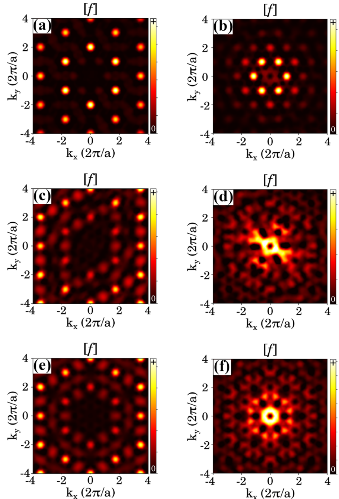

## cossuStackingChargedensityWaves2024 — 2H-NbSe₂ 双层中电荷密度波的堆叠

- **元数据**：F. Cossu, D. Nafday, K. Palotás, M. Biderang, H.-S. Kim, A. Akbari, I. Di Marco et al.，2024，Physical Review Research 6, 043111，DOI [10.1103/PhysRevResearch.6.043111](https://doi.org/10.1103/PhysRevResearch.6.043111)

- **一句话**：通过 DFT 第一性原理计算首次系统绘制 2H-NbSe₂ 双层中电荷密度波（CDW）的垂直堆叠能量景观，证明不可忽略的层间耦合导致自发对称性破缺，基态为 HC-HC_(S3)，混合堆叠 HC-CC_(S4) 等近简并激发态在模拟 STM 图像与几何结构因子中具有可分辨的"指纹"。

- **现有wiki双链**：
  - 概念 [[../concepts/charge-density-wave]]
  - 概念 [[../concepts/density-functional-theory]]
  - 概念 [[../concepts/2D-materials]]
  - 概念 [[../concepts/moire-superlattice]]（文中展望扭转双层 NbSe₂）
  - 概念 [[../concepts/strain-engineering]]（作者团队前作 strain-induced stripe phase in NbSe₂）
  - 实体 [[../entities/TMDs]]
  - 实体 [[../entities/VASP]]
  - 实体 [[../entities/Wannier90]]（无直接关联，不链）
  - 图表 [[../figures/crystal-structures]]
  - 图表 [[../figures/electronic-bands]]
  - 图表 [[../figures/heterostructures-stacking]]
  - 图表 [[../figures/vibrational-spectra]]（展望声子/拉曼）
  - 年度 [[../write/2024]]
  - 项目 [[../projects/project-7-cdw-charge-density-wave]]
  - 相关论文 [[../../raw/note/cossuStackingChargedensityWaves2024]]

- **新概念/实体建议**：
  - `entities/NbSe2.md` — 二硒化铌，典型金属性 2H 型 TMD，CDW 与超导共存的模型体系；本文研究其双层 CDW 堆叠。
  - `entities/1T-TaS2.md` — 二硫化钽 1T 相，层间 CDW（大卫之星）堆叠驱动金属-绝缘体转变，是本文立论的参照体系。
  - `concepts/interlayer-stacking.md` — 层间堆叠（stacking order），双层/多层范德华材料中各层 CDW 或晶格的相对平移与旋转，可改变整体对称性与物性。
  - `concepts/cdw-blends-displacements.md` — CDW"混合物与位移"分类法：blend 指上下层 CDW 类型组合（HC-HC、HC-CC 等），displacement（S1/S2/…）指给定 blend 下由对称性允许的非等价层间平移。
  - `concepts/geometric-structure-factor.md` — 几何结构因子 f(h,k,l)，从原子坐标或部分电荷密度的傅里叶变换得到，用于连接 XRD/TEM/FT-STM 实验与理论对称性分析。
  - `concepts/pseudogap.md` — 赝能隙，费米能级处态密度被抑制但未完全打开能隙；本文显示 CDW 构型越稳定，E_F 处态密度耗尽越显著。
  - `concepts/vdw-correction.md` — 范德华修正（D2/TS/DF/MBD@FI 等），层状材料 DFT 中层间距与层间耦合强度对修正方案高度敏感。
  - `concepts/peierls-instability.md` — Peierls 不稳定性，一维电子-声子耦合导致的 CDW 机制；本文将"E_F 态耗尽 → 能量增益"的 Peierls 逻辑推广到 2H-NbSe₂ 这一由动量依赖电声耦合主导的二维体系。

- **关键图表**：
  - 
  - 
  - 
  - 
  - 
  - 
  - 
  - 
  - 
  - 

- **项目连接**：project-7 CDW（电荷密度波）。本文直接对应 CDW 层间堆叠与维度效应，是 project-7 的核心理论参考；对 project-5 SnTe 铁电模拟中涉及的层间耦合/堆叠方法学有间接借鉴意义。

- **组织与用词**：
  文章按"引言（1T 型金属-绝缘体转变启发 → 金属性 2H 型是否同样存在堆叠效应）→ 方法（DFT/PBE+多种 vdW 修正、3×3 超胞、Tersoff-Hamann STM 模拟）→ 结果（正常相结构、CDW 能量景观、电子结构、Se 图案与 STM、电荷密度与结构因子）→ 讨论与结论（推广至薄膜/块体、展望磁性/压力/扭转/拉曼）"的经典链条展开。论证策略是：先用多种 vdW 方案标定基准结构（表 I），再系统枚举 blend × displacement 构型得到能量层级（表 II），然后分别从实空间（STM 图 5）和倒空间（结构因子图 6）给出可实验检测的指纹，最后将结论从 1T 推广到金属性 2H 型 TMDs。

  可复用术语（中英对照）：
  1. 电荷密度波（Charge-Density Wave, CDW）
  2. 周期性晶格畸变（Periodic Lattice Distortion, PLD）
  3. 混合物 / 位移（blend / displacement）
  4. 空心中心三角 / 硫族中心三角 / 六方结构（HC / CC / HX）
  5. 层间耦合（interlayer coupling）
  6. 范德华修正（van der Waals correction；D2、TS、DF、MBD@FI）
  7. 几何结构因子（geometric structure factor）
  8. 赝能隙 / 费米能级态耗尽（pseudogap / depletion of states at E_F）
  9. 恒流模式 STM 表观高度与起伏（constant-current STM apparent height / corrugation）
  10. 电子-声子耦合（electron-phonon coupling）

- **可写入wiki的要点**：
  1. 2H-NbSe₂ 双层是保持块体中心反演对称性的最小单元，两层单层彼此旋转 π；正常相空间群 P3m1，CDW 态下降为 C2/m（HC-HC 全部位移）、P3m1（HC-CC，除 S2 外）、C1（HC-CC_(S2)）、P1（CC-CC_(S2)）或 Cm（CC-CC 其他位移）。
  2. 三种最稳定的单层 CDW 模式为 HC（hollow-centered triangular）、CC（chalcogen-centered triangular）、HX（hexagonal）；其在 1H-NbSe₂ 单层中的相对能量（GGA+DF）为 HC=0、CC=1.43、HX=2.06 meV/f.u.。
  3. 双层基态为 HC-HC_(S3)（GGA 与 GGA+DF 一致），第一激发态 HC-HC_(S1)（0.06 / 0.21 meV/f.u.），第二激发态为混合堆叠 HC-CC_(S4)（0.18 / 0.39 meV/f.u.）；前三激发态能量窗口仅 0.18（GGA）/0.39（GGA+DF）meV/f.u.，小于单层 HC–CC 差，预示多种堆叠可在缺陷或热激发下共存。
  4. vdW 修正显著改变层间距：GGA 给出 d_Nb-Nb=6.926 Å、d_Se-Se=3.560 Å；GGA+TS 给出 6.053 / 2.732 Å（TS 过度束缚，混合 blend 无法收敛到正确对称性）；GGA+DF 给出 6.527 / 3.141 Å（主文采用，与块体实验值 c/2≈6.27 Å 同量级）；GGA+MBD@FI 给出 6.178 / 2.844 Å。
  5. 计算参数：VASP + PAW + PBE，平面波截断 500 eV；原胞 k 网格 45×45×1、3×3 超胞 20×20×1；结构弛豫力收敛至 10⁻³ eV/Å，电子步能量容差 10⁻⁷–10⁻⁹ eV；面内晶格常数固定为 3.45 Å，z 方向真空层 20 Å。
  6. 电子结构证据：不同堆叠整体 DOS 相似，但 HC-CC_(S4) 在 −1.8 eV 出现尖锐峰，投影 DOS 指认为层间 Se 原子的 p_z 轨道杂化，是层间耦合的直接电子指纹；CDW 能量增益与费米能级处态密度耗尽程度呈正相关，将一维 Peierls 逻辑推广到由动量依赖电声耦合驱动的二维 NbSe₂。
  7. STM 模拟（Tersoff-Hamann，−0.2 V 偏压、电流等高线最大值 5.8 Å）：无 CDW 对称双层 corrugation 13 pm，CDW 双层 29–39 pm，单层 HC 51 pm；绿斑位置构成指纹——HC-HC_(S3) 位于三叶状凸起之一、HC-HC_(S1) 位于凹陷之一、HC-CC_(S4) 位于所有尖端；绿斑表观高度差分别为 2、4–5、6 pm，现代 STM 垂直分辨率（<10 pm）足以分辨。
  8. 几何结构因子：结构数据（模拟 XRD）中 CDW 峰被强布拉格峰掩盖，但差异图（c/e）形状可区分；费米能级附近部分电荷密度（模拟 FT-STM）中 CDW 峰位于中心点到一级布拉格峰距离的 1/3 处，呈六重星状，HC-HC_(S3) 与 HC-CC_(S4) 的差异图案（d/f）显著不同，为 XRD、TEM、EELS 实验提供补充判据。
  9. Se-Se 键长斑块规律：每一 blend 中能量最低构型（HC-HC_(S3)、HC-CC_(S4)）对应上下两层 Se-Se"斑块"不重叠；作者推测层间 p_z 轨道相干性最大化是稳定机制，是对 Lin et al.（Nano Lett. 2022）轴向键合维度效应机制的推广。
  10. 热稳定性估计：与 1T-TaS₂ 块体两堆叠态能量差 0.08 meV/f.u. 对应约 60 K 锁定温度相比，2H-NbSe₂ 双层 0.18–0.39 meV/f.u. 的激发能预示在实验 CDW 临界温度（~33 K）以下堆叠应稳定；原子位移仅 ~0.2 Å 且非完全同相，振动熵修正估计 <0.04 meV/f.u.，不足以翻转表 II 能量层级；作者明确指出精确结论需声子谱计算，但不在本文范围。
