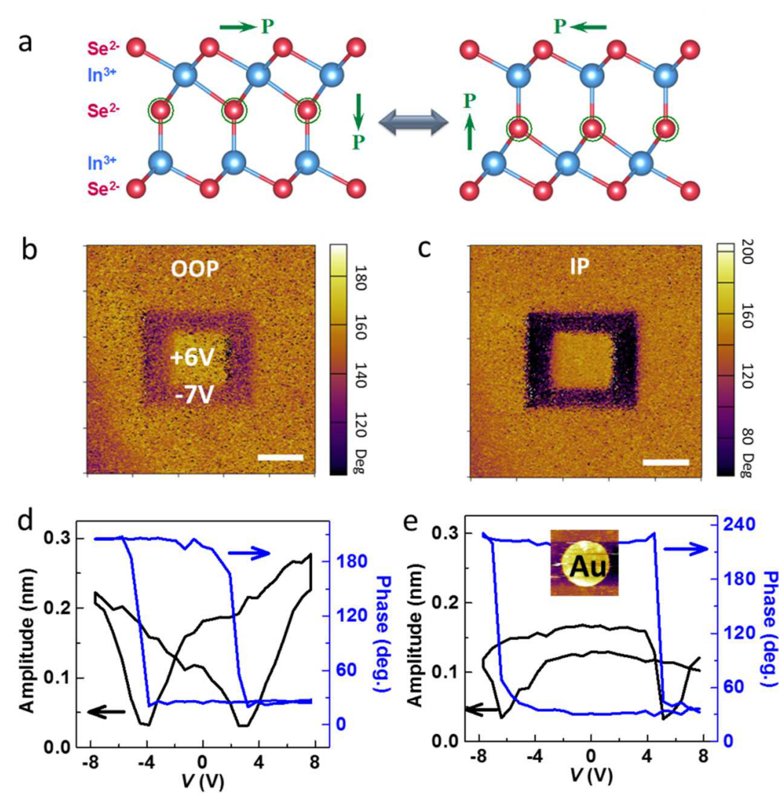
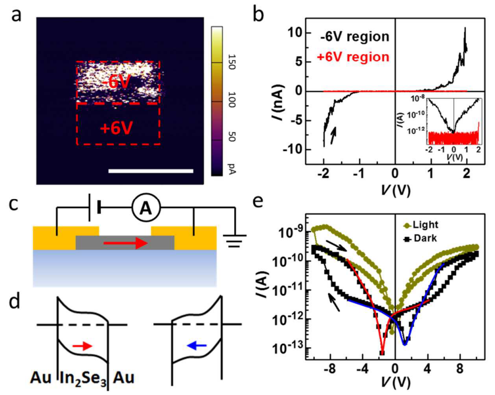

## cuiIntercorrelatedInplaneOutofplane2018a — 超薄二维层状半导体 In2Se3 中面内与面外铁电性的互相关联

## 📄 元数据
Cui, Hu, Yan, Addiego, Gao, Wang, Wang, Li, Cheng, Li, Zhang, Alshareef, Wu, Zhu, Pan, Li et al.，2018，Nano Letters 18(2), 1253–1258，DOI 10.1021/acs.nanolett.7b04852
## 💡 一句话
首次在实验上证实室温下二维范德华半导体 α-In2Se3 同时具有面内（IP）与面外（OOP）相互锁定的本征铁电极化，并展示层数奇偶效应和电场/可见光双控的多态非易失存储原型。
## 🔗 Wiki 双链
  - 概念 [[../concepts/2d-materials]]、[[../concepts/ferroelectricity|铁电性]]、[[../concepts/multiferroicity]]、[[../concepts/polarization-switching]]、[[../concepts/in-plane-out-of-plane-coupling|面内-面外极化耦合]]、[[../concepts/odd-even-effect|奇偶层数效应]]、[[../concepts/antiparallel-polarization-stacking|反平行极化堆垛]]、[[../concepts/ferroelectric-domain|铁电畴]]、[[../concepts/depolarization-field]]、[[../concepts/schottky-barrier|肖特基势垒]]、[[../concepts/switchable-diode|可切换二极管]]、[[../concepts/memristor|忆阻器]]、[[../concepts/topological-defects]]（畴壁部分相关）
  - 实体 [[../entities/In2Se3]]、[[../entities/VASP]]、[[../entities/SnTe]]、[[../entities/BaTiO3|BaTiO₃]]、[[../entities/CuInP2S6|CuInP₂S₆]]、[[../entities/PZT]]
  - 图表 [[../figures/electronic-devices]]、[[../figures/experimental-setups]]、[[../concepts/domain-wall]]
  - 年度 [[../write/2015-2019|2018]]
  - 概念 [[../concepts/domain-wall]]
  - 实体 [[../entities/Au]]、[[../entities/mica]]
  - 相关论文 [[../../raw/note/cuiIntercorrelatedInplaneOutofplane2018a]]
## 🆕 新概念/实体建议
  - [[../concepts/in-plane-out-of-plane-coupling|in-plane-out-of-plane-coupling]]（面内-面外极化互锁）：α-In2Se3 中由中心 Se 原子层横向位移同时驱动 IP/OOP 极化翻转的本征耦合机制。
  - [[../concepts/odd-even-effect|odd-even-effect]]（奇偶层数效应）：相邻层反平行堆叠导致奇/偶数层宏观极化方向相反。
  - [[../concepts/antiparallel-polarization-stacking|antiparallel-polarization-stacking]]（反平行极化堆垛）：层间极化反向排列，是奇偶效应与净极化抵消的微观起源。
  - [[../concepts/switchable-diode|switchable-diode]]（可切换二极管）：铁电极化调制两端金属-半导体肖特基势垒，使整流方向可被电场反转。
  - [[../concepts/scanning-electron-diffraction|scanning-electron-diffraction]]（扫描电子衍射, SED）：通过 CBED 图样重心位移直接成像样品内投影电场的表征技术。
  - [[../concepts/depolarization-field]]（退极化场）：铁电体表面束缚电荷产生的反向电场，其屏蔽程度决定单畴/多畴态。
## 📊 关键图表
  -  → [[../figures/experimental-setups|实验装置与测量系统]]
  - **图示描述**：图1 综合展示二维 In2Se3 的CVD生长与结构确认：(a) 以 Se 和 In2O3 为前驱体在云母衬底上生长的示意图；(b) AFM 形貌及高度剖面，薄片厚度 1.3–4.3 nm；(c) 532 nm 激发下慢冷/快冷样品与云母的 Raman 光谱；(d) 单层（α 相）与 12 nm 厚（β 相）区域的 SAED 花样；(e) 单层 α-In2Se3 的原子分辨 STEM 图像。
  - **关键特征**：厚度 >2 nm 的薄片形状规则、边缘平直，结晶性好；<1.3 nm 为形状不规则的种子层。慢冷（0.1 °C/min）样品在 ~170 cm⁻¹ 处 A1(TO) 峰显著强于快冷样品，说明 α 相比例随慢冷显著增加。单层 SAED 对应 α-In2Se3 的 [0001] 带轴；12 nm 厚区域出现额外衍射点，归属于 β 相超结构。原子分辨 STEM 结合运动学衍射模拟，确认单层为理论预测的 FE-ZB' 铁电构型。
  - **结论/意义**：通过 AFM/Raman/SAED/STEM 多手段交叉验证，证明成功生长出单层铁电 α-In2Se3，并锁定其原子构型为 FE-ZB'，为后续铁电性观测奠定材料基础。

  -  → [[../figures/experimental-setups|实验装置与测量系统]]
  - **图示描述**：图2 用 PFM 和 SED 揭示云母上 α-In2Se3 薄片的本征铁电性与层数依赖：(a) 2–6 nm 三角形薄片 AFM 形貌；(b,c) 对应的面内 PFM 振幅与相位图；(d) 1L–6L 面内相位统计；(e) 同一 2L→3L 区域的 STEM-HAADF 图像；(f) 沿 Y 方向的 HAADF 强度剖面；(g) 投影电场矢量图；(h) Ex、Ey 电场分量线剖面。
  - **关键特征**：每个台阶内自然形成单一铁电畴，存在两种相反 IP 极化方向。2 nm（约 2L）相位 ~120°，3 nm（约 3L）相位 ~−60°，4 nm（约 4L）回到 ~120°，1L–6L 呈明显奇偶振荡。SED 矢量图中电场从 2L 区的 [12̄10] 方向翻到 3L 区的 [101̄0] 方向；Ex 分量在边界处明显反转、Ey 小幅反转，直接可视化层间反平行极化。OOP 极化虽比 IP 小数十倍，但 OOP 相位也呈现同样的奇偶行为。
  - **结论/意义**：PFM 奇偶效应与 SED 电场成像相互印证，首次在二维材料中实验证实层间反平行极化堆叠，为 α-In2Se3 的层数依赖铁电性提供决定性证据。

  -  → [[../figures/domain-walls-switching-properties|极化翻转与铁电性能]]
  - **图示描述**：图3 展示转移到 Au/Si 衬底上 6 nm In2Se3 薄片的铁电翻转特性：(a) FE-ZB' 构型中中心 Se 原子层横向位移同时驱动 IP/OOP 极化耦合翻转的模型；(b,c) 用 −7 V 和 +6 V 针尖电压写入 2 μm 和 1 μm 两个方块后立即采集的 OOP 与 IP 相位图；(d,e) 分别为无顶电极和有 Au 顶电极（直径 2 μm、厚 20 nm）下的局部振幅-电压蝴蝶曲线与相位回线。
  - **关键特征**：−7 V 与 +6 V 写入方块在 OOP 和 IP 相位图中同时出现衬度反转，且反转区域完全重合，证明 OOP 翻转必然同步带动 IP 极化旋转。无顶电极时振幅呈蝴蝶形、相位发生 180° 突变；加 Au 顶电极后仍保留蝴蝶形振幅与尖锐相位回线，排除了表面静电、电荷注入或离子迁移等 PFM 伪像。有顶电极回线更不对称、矫顽场更大，归因于 Au 沉积引入的"死层"。写入畴相位衬度在空气中最长可识别约 10 h。
  - **结论/意义**：直接证明 α-In2Se3 的 IP 与 OOP 极化为本征互锁，区别于仅具 IP 的 SnTe 和仅具 OOP 的 CuInP2S6；顶电极回线确证铁电性为材料内禀属性。

  -  → [[../figures/electronic-devices-memory-transistors|存储器与晶体管]]
  - **图示描述**：图4 演示 In2Se3 的电控导电与多功能器件：(a) 6 nm 厚薄片经 +6 V/−6 V 条纹写入后的 CAFM 电流图；(b) 两写入区域的局部 I-V 曲线（插图为对数坐标）；(c) 云母上 Au/α-In2Se3/Au 平面器件结构（薄片 ~13 nm）；(d) 极化方向依赖的两侧界面能带排列示意；(e) ±10 V 扫描范围内平面器件的 I-V 回线，以及 ±4 V 区间红/蓝实线标示的相反整流段，并对比可见光照射下的电流。
  - **关键特征**：CAFM 图中 +6 V 与 −6 V 条纹对应清晰的高/低电流态；局部 I-V 显示极化翻转使电流变化超过 4 个数量级，输运由金属/铁电体/金属背对背肖特基势垒主导，势垒高度随极化方向变化。平面器件在 ±10 V 下呈明显回滞，开关比约 10；±4 V 区间正反扫描表现出相反整流方向，即"可切换二极管效应"。基于 ~1.3 eV 窄带隙，~8 mW/cm² 可见光照射下电流显著提升，与电场两态组合共实现四个阻变态；β-In2Se3 对照器件仅有光响应而无阻变。
  - **结论/意义**：将 IP/OOP 互锁铁电性和窄带隙半导体性转化为垂直阻变（>10⁴）、横向可切换二极管（~10）及电-光双控四态存储，验证了 α-In2Se3 在下一代多态非易失存储与感存算一体器件中的应用潜力。

## 🔬 项目连接
  - project-5（SnTe 铁电模拟）— **strong**：本文直接以 SnTe 单层 IP 铁电性（Chang et al., Science 2016）为对照，系统讨论二维铁电体的 IP/OOP 极化、奇偶层数效应、退极化场屏蔽、以及 DFT 预测/验证流程；其 VASP + PBE + HSE06 + optB88-vdW、550 eV 截断、12×12×1 k 网格、20 Å 真空层的计算配方可直接迁移到 SnTe 等 IV–VI 族二维铁电体的极化与堆垛计算。
  - project-2（Mn 多铁）— **medium**：α-In2Se3 本身不是多铁，但提供了二维极限下"IP 与 OOP 极化内禀互锁"这一与磁电耦合思路相近的多序参量耦合范例；其层间反平行堆叠、奇偶效应、单畴形成条件（IP 极化大于 OOP + 载流子屏蔽退极化场）可作为 Mn 基多铁/二维多铁讨论中的物理类比与对照。
  - project-4（TTF 分子计算）— **weak**：方法学层面可参考其 DFT 工作流（PBE 结构弛豫 + HSE06 带隙 + optB88-vdW 处理弱相互作用 + 力收敛 0.005 eV/Å），对含弱相互作用的分子晶体计算有间接参考价值；材料体系与物理问题差异较大。
  - project-1 / project-3 / project-6 / project-7：无直接项目连接。
## 🔗 项目双链
- 项目 [[../projects/project-2-mn-multiferroics|项目二：Mn极化结构铁电材料]]
- 项目 [[../projects/project-5-snte-ferroelectric-sim|项目五：lammps势函数SnTe铁电模拟]]

## 📝 组织与用词
文章沿"材料制备（CVD + 慢冷筛 α 相）→ 结构确认（AFM/Raman/SAED/STEM 确定 FE-ZB' 构型）→ 本征铁电性（PFM 奇偶效应 + SED 电场成像）→ 极化关联翻转（畴写入 + 带回线测真伪）→ 器件应用（CAFM 垂直阻变 + 平面可切换二极管 + 光控多态）"层层递进。论证中以 PFM 相位作为极化方向的指纹，以 SED 电场矢量图作为微观"眼见为实"，以顶电极回线排除静电/离子伪像，最后用电学输运将极化态与电阻态绑定。值得复用的术语：
  - [[../concepts/ferroelectricity|ferroelectricity / 铁电性]]
  - in-plane (IP) vs out-of-plane (OOP) polarization / 面内与面外极化
  - intercorrelated polarization / 互相关联极化
  - [[../concepts/odd-even-effect|odd–even layer effect / 奇偶层数效应]]
  - [[../concepts/interlayer-stacking|antiparallel interlayer stacking / 层间反平行堆垛]]
  - FE-ZB' configuration / FE-ZB' 构型
  - [[../concepts/switchable-diode|switchable diode effect / 可切换二极管效应]]
  - [[../concepts/depolarization-field]]
## ✏️ 可写入 Wiki 的要点
  1. α-In2Se3 为室温二维范德华铁电半导体，带隙约 1.3 eV，在双层至 6 nm 薄片中均保持[[../concepts/ferroelectricity|铁电性]]；CVD 生长后以 0.1 °C/min 慢冷可显著提高 α 相比例，快冷样品以非铁电 β 相为主。
  2. α-In2Se3 单层原子结构确认为 FE-ZB' 构型（五层 Se–In–Se–In–Se 中中心 Se 偏离中心位置），是 Ding et al. (Nat. Commun. 2017) 预测的四种 α 相构型中能量最低的铁电构型。
  3. α-In2Se3 的 IP 极化远大于 OOP 极化（OOP 小几十倍），但两者在电场下本征互锁：垂直电场翻转 OOP 极化时，中心 Se 原子层横向位移同步带动 IP 极化旋转；这区别于 SnTe（仅 IP）和 CuInP2S6（仅 OOP）。
  4. PFM 相位在 1L–6L 间呈[[../concepts/odd-even-oscillation|奇偶振荡]]：2 nm（约 2L）相位约 120°，3 nm（约 3L）约 −60°，4 nm（约 4L）回到约 120°；DFT 双层计算与 SED 电场成像一致表明层间反平行堆叠。
  5. SED 通过测量 CBED 图样强度重心（CoW）位移直接成像投影电场：在 2L/3L 边界处电场由 [12̄10] 翻到 [101̄0]，Ex 反转明显、Ey 小幅反转，为层间反平行极化提供直接微观证据。
  6. 单畴态成因：IP 极化大于 OOP 使[[../concepts/depolarization-field|退极化场]]较小，且 α-In2Se3 较高载流子浓度可中和边界极化电荷，二者协同使每个台阶内自然形成单畴；与 CuInP2S6（OOP 主导、易成畴壁）形成对比。
  7. 顶电极（Au, Φ=2 μm, 20 nm）下仍测得蝴蝶形振幅回线与 180° 相位突变，排除了表面静电、电荷注入、离子迁移等 PFM 伪像；顶电极回线更不对称、[[../concepts/coercive-field|矫顽场]]更大，归因于沉积过程引入的"死层"。
  8. 垂直 CAFM 结构中，±6 V 写入后高低阻态电流相差超过 4 个数量级，输运由金属/铁电体/金属背对背[[../concepts/schottky-barrier|肖特基势垒]]主导，势垒高度随极化方向变化。
  9. 横向 Au/α-In2Se3/Au 器件基于 IP 极化实现"[[../concepts/switchable-diode|可切换二极管]]"：极化升高一个界面肖特基势垒、降低对面界面势垒，导致整流方向随极化反转；±10 V 下开关比约 10，±4 V 区间呈现相反整流特性。
  10. 结合 ~1.3 eV 可见光响应（LED ~8 mW/cm²），平面器件实现电场写两态 + 光照叠加两态共四个阻变态的[[../concepts/multistate-memory|多态存储]]；β-In2Se3 对照器件仅有光响应而无阻变，证明阻变源于铁电极化。写入畴在空气中可识别约 10 h，是后续需解决的保持力问题。
