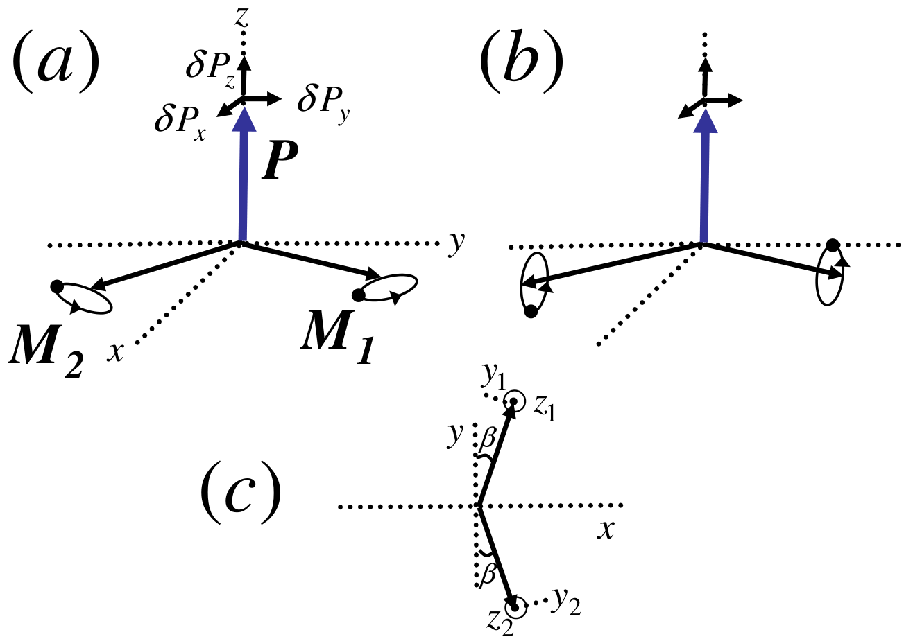
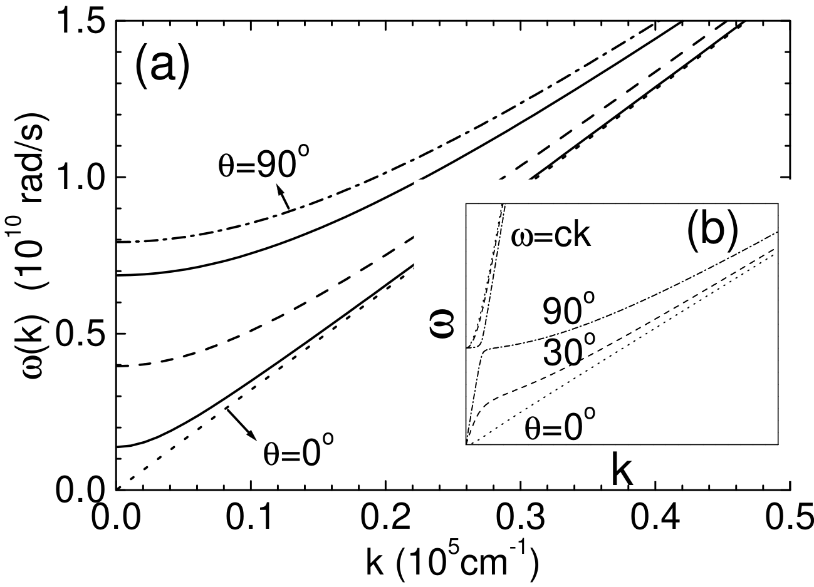
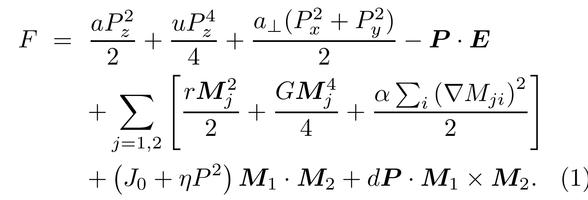
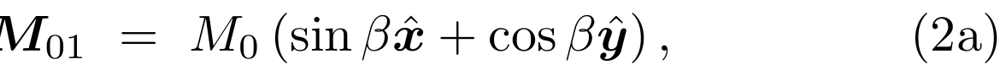
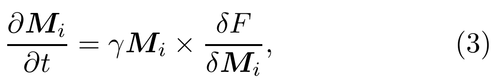
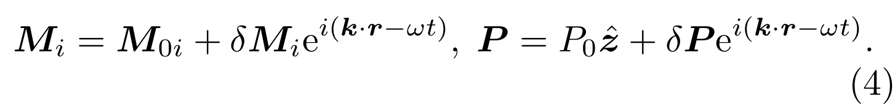
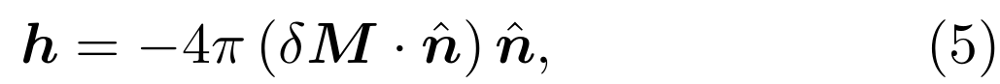
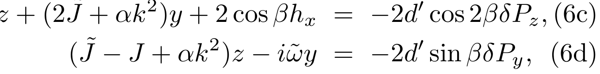
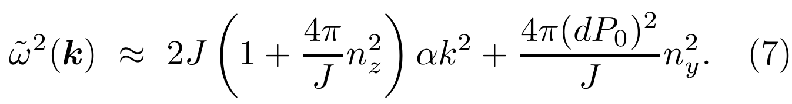

## deSousa2008electrical — 多铁性BiFeO3薄膜中磁振子传播的电学控制

- **元数据**：Rogerio de Sousa, Joel E. Moore，2008，Applied Physics Letters 92, 022514，DOI 10.1063/1.2835704
- **一句话**：基于耦合铁电/反铁磁序的金兹堡-朗道模型与磁静波近似，预测倾斜反铁磁BiFeO3薄膜中最低频磁振子色散因长程偶极相互作用而强烈依赖于传播方向与奈尔矢量的夹角，从而可借由电场翻转铁电极化来无电流地开关自旋波传播。

- **现有wiki双链**：
  - 概念 [[../concepts/multiferroicity]]、[[../concepts/magnetoelectric-coupling]]、[[../concepts/polarization-switching]]
  - 实体 [[../entities/BiFeO3]]
  - 图表 [[../figures/mathematical-models]]
  - 年度 [[../write/2008]]
  - 项目 [[../projects/project-2-mn-multiferroics]]、[[../projects/project-5-snte-ferroelectric-sim]]
  - 相关论文 [[../../raw/note/deSousa2008electrical]]

- **新概念/实体建议**：
  - `concepts/spin-wave.md`（自旋波/磁振子）：磁有序系统中局域磁矩集体进动的波激发，量子化为磁振子(magnon)，传播角动量而非电荷，是低功耗自旋电子学的信息载体。
  - `concepts/dzyaloshinskii-moriya-interaction.md`（DM相互作用）：反对称交换相互作用 D·(M₁×M₂)，在无反演中心体系中导致自旋倾斜和弱铁磁性，是BFO等多铁材料磁电耦合的关键项。
  - `concepts/canted-antiferromagnetism.md`（倾斜反铁磁/弱铁磁性）：反铁磁双子晶格磁矩因DM作用发生微小倾斜，产生微弱净磁矩的磁结构。
  - `concepts/magnetostatic-effect.md`（磁静波效应）：长波自旋波通过长程磁偶极相互作用产生动态退磁场，进而修正色散关系；当波矢 k ≫ ω/c 时可忽略推迟效应。
  - `concepts/electromagnon.md`（电磁振子）：磁振子与光子/极性声子强耦合形成的混合准粒子，可被交流电场激发，是多铁材料磁电耦合的谱学指纹。
  - `concepts/neel-vector.md`（奈尔矢量）：L = M₁ − M₂，描述反铁磁序方向的核心序参量；BFO中L受电极化P通过DM项锁定。
  - `concepts/landau-lifshitz-equation.md`（朗道-莱弗席兹方程）：描述磁矩在有效场下进动的基本动力学方程 ∂M/∂t = γ M × H_eff。
  - `concepts/spin-wave-logic.md`（自旋波逻辑）：以自旋波相位/振幅编码信息、通过干涉实现逻辑运算的器件范式，可避免电荷输运带来的焦耳热。
  - `concepts/ginzburg-landau-theory.md`（金兹堡-朗道理论）：以序参量及其梯度展开自由能的唯象相变理论，可耦合多个序参量（如P与M）描述多铁行为。

- **关键图表**：
  - 图1：倾斜多铁材料中的自旋波与极化波模式。(a)低频软模——两子晶格磁矩同相进动、倾斜角β不变；(b)高频有隙模——反相进动调制β；(c)坐标系（z沿P，y沿L）。
    
  - 图2：BiFeO3薄膜低频磁静波自旋波色散。(a)磁静近似下不同传播角θ的色散，θ=0°无能隙线性色散，θ=90°存在磁静能隙、群速度为零；(b)k<ω/c区域考虑光子-磁振子反交叉的电磁振子色散。
    
  - 公式(1)：耦合铁电序、反铁磁序、交换作用、磁致伸缩与DM相互作用的金兹堡-朗道自由能。
    
  - 公式(2)：平衡态子晶格磁化构型。
    
  - 公式(3)：朗道-莱弗席兹动力学方程。
    
  - 公式(4)：线性化后的高频与低频自旋波模方程。
    
  - 公式(5)：磁静近似下的退磁场。
    
  - 公式(6)：电场与自旋波耦合的电磁振子激发项。
    
  - 公式(7)：核心结果——低频磁振子色散 ω²(k) ≈ 2J(1+4πn_z²/J)αk² + 4π(dP₀)²n_y²/J，明确展示各向异性能隙。
    

- **项目连接**：
  - **project-2（Mn多铁）—— strong**：本文虽以BiFeO3为对象，但所建立的"DM相互作用锁定奈尔矢量与铁电极化相对取向"图像、磁电耦合自由能构造方法（(J₀+ηP²)M₁·M₂ + dP·(M₁×M₂)）、以及电控磁序翻转的物理链条，可直接类比到Mn基多铁体系（如HoMnO3、MnVO3等）的磁电耦合与自旋动力学分析；倾斜反铁磁、弱铁磁性、电磁振子选择定则等概念对理解Mn多铁中的电场调控磁性具有直接参考价值。
  - **project-5（SnTe铁电模拟）—— medium**：论文使用的朗道-德冯谢亚铁电自由能（aP²/2+uP⁴/4）以及将极化P与其他序参量耦合的金兹堡-朗道建模框架，可作为SnTe铁电相变与应变/缺陷耦合模拟的唯象模型参照；但本文核心是磁振子色散而非铁电本身，故为medium。
  - 其他项目（project-1双光子、project-3机械发光NN、project-4 TTF分子计算、project-6湿度传感器、project-7 CDW）无直接内容连接。

- **组织与用词**：文章按"器件功耗动机 → 自旋波逻辑与BFO薄膜背景 → 金兹堡-朗道自由能模型 → LL方程+磁静近似求解 → 各向异性能隙解析结果 → 电控开关机制与应用 → 电磁振子与模型判别"的紧凑理论信函结构展开，论证链条为"电场翻P → DM耦合翻L → 改变传播方向与L夹角 → 打开/关闭磁静能隙 → 开关自旋波"。值得复用的术语：
  - canted antiferromagnet（倾斜反铁磁体）
  - Néel moment / Néel vector L（奈尔矢量 L=M₁−M₂）
  - magnetostatic gap（磁静波能隙）
  - magnetostatic approximation（磁静近似，k ≫ ω/c）
  - electromagnon（电磁振子）
  - Dzyaloshinskii–Moriya vector D=dP（DM矢量正比于电极化）
  - spin-wave logic gate（自旋波逻辑门）
  - group velocity ∼ 10⁵ cm/s（沿P方向自旋波群速）

- **可写入wiki的要点**：
  1. BFO薄膜具有均匀倾斜反铁磁序（不同于块材62 nm周期摆线序），奈尔矢量L被约束在垂直于铁电极化P的平面内；Zhao et al. [7]已实验证实室温下电场翻转P可同步翻转L。
  2. 自由能中DM项 dP·(M₁×M₂) 是产生弱铁磁性和磁电锁定的根源：DM矢量D=dP线性依赖于P，因此P的电场翻转直接带动L翻转。
  3. 磁静近似下，低频（软）自旋波模的色散为 ω²(k) ≈ 2J(1+4πn_z²/J)αk² + 4π(dP₀)²n_y²/J，其中n̂为传播方向单位矢量。
  4. 当传播方向垂直于L（n_y=0，如沿P方向）时模式无能隙、线性色散、群速度约10⁵ cm/s；当传播方向平行于L（n_y=1）时打开磁静能隙 Δω ≈ √(4π/J) dP₀，k→0群速度为零，长波磁振子被有效"禁止"传播。
  5. 磁静能隙纯粹来源于长程磁偶极相互作用产生的动态退磁场（退磁场能2π(δM·n̂)²），与交换作用、各向异性无关；这是本文首次在倾斜反铁磁体中揭示的新机制。
  6. 高频自旋波模反相进动、调制倾斜角β，其能隙为ω≈dP₀（约5×10¹⁰ rad/s），且几乎各向同性。
  7. 电控开关原理：固定自旋波传播方向，用电场翻转P即翻转L，使该方向从"垂直L（传播态）"变为"平行L（截止态）"，在假设存在阻尼时可有效阻止长波磁振子，实现零电流、超低功耗的自旋波开关/相移器。
  8. 在k<ω/c的极长波区域，磁振子与光子反交叉形成电磁振子（electromagnon），能隙失去取向依赖；但该效应仅在厘米级畴中可观测，对实际纳米/微米器件主导的仍是磁静各向异性。
  9. 电磁振子的电场激发选择定则可用于实验判别BFO中DM矢量是否线性正比于P（本文模型）还是独立于P（其他微观模型），为光谱学验证提供理论依据。
  10. 本文模型仅适用于均匀倾斜反铁磁序的BFO薄膜，不能直接推广到块材BFO（块材为非均匀摆线序，虽也有P取向敏感的自旋波，但物理机制源于磁结构非均匀性而非磁静效应）。
