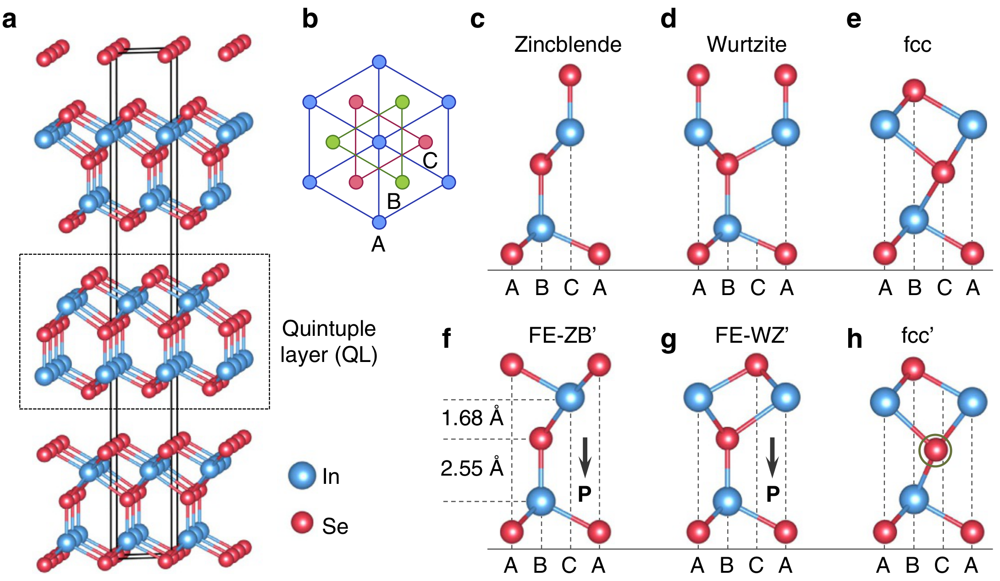
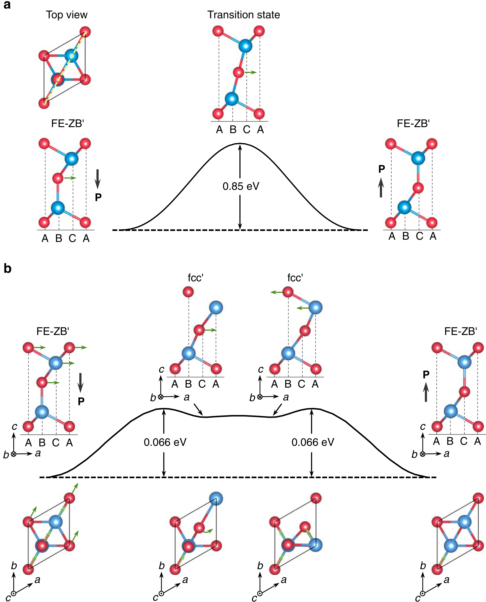
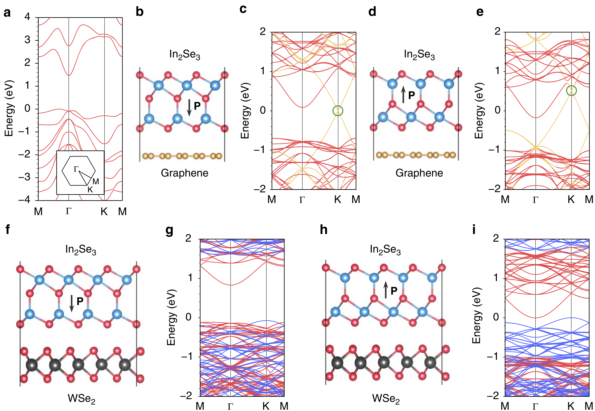

## dingPredictionIntrinsicTwodimensional2017a — In2Se3等III2-VI3范德华材料中本征二维铁电体的预测

- **元数据**：Ding, Zhu, Wang, Gao, Xiao, Gu, Zhang & Zhu，2017，Nature Communications 8:14956，DOI 10.1038/ncomms14956
- **一句话**：通过第一性原理计算预测以 In2Se3 为代表的 III2-VI3 族五元层（QL）范德华材料是本征二维铁电体，兼具可反转的面外与面内自发极化，反转能垒低至 0.066 eV，并能在单层极限下抵抗退极化场。

- **现有wiki双链**：
  - 概念 [[../concepts/2D-materials]]、[[../concepts/berry-phase]]、[[../concepts/polarization-switching]]、[[../concepts/strain-engineering]]、[[../concepts/density-functional-theory]]
  - 实体 [[../entities/In2Se3]]、[[../entities/VASP]]、[[../entities/TMDs]]、[[../entities/SnTe]]
  - 图表 [[../figures/crystal-structures]]、[[../figures/electronic-bands]]、[[../figures/domain-walls]]、[[../figures/heterostructures-stacking]]
  - 年度 [[../write/2017]]
  - 相关论文 [[../../raw/note/dingPredictionIntrinsicTwodimensional2017a]]

- **新概念/实体建议**：
  - `depolarization-field`（退极化场）：铁电薄膜中由表面未补偿极化电荷产生、方向与极化相反的内建电场，是传统铁电薄膜存在临界厚度的根源；本文证实 In2Se3 单层在短路石墨电极间仍能保持铁电相稳定。
  - `schottky-barrier`（肖特基势垒）：金属-半导体接触界面的整流势垒；本文通过翻转 In2Se3 极化方向调控 In2Se3/石墨烯界面的肖特基势垒高度。
  - `iii2-vi3-compounds`（III2-VI3族化合物）：通式 III2-VI3（III=Al/Ga/In，VI=S/Se/Te）的层状半导体家族，本文预测其 QL 形式普遍具有本征二维铁电性。
  - `quintuple-layer`（五元层，QL）：In2Se3 等材料的基本结构单元，按 Se-In-Se-In-Se 顺序堆叠的五个共价键合原子层，厚度约 6.8 Å，层间靠范德华力结合。
  - `concerted-motion`（协同运动反转机制）：本文发现的低能垒极化反转路径——上三层（Se-In-Se）整体横向滑移、中心 Se 旋转 60°、顶二层再滑移，将能垒从直接位移的 0.85 eV 降至 0.066 eV。
  - `graphene`（石墨烯）：实体，In2Se3/石墨烯异质结中作为半金属接触层，其狄拉克点位置受 In2Se3 极化方向非易失性调控。

- **关键图表**：
  - 
  - 
  - ![图3 外电场对活化势垒（黑点）与两极态能量差（灰方块）的影响：(a)面外电场0.3 V/Å产生0.056 eV能量差；(b)面内[110]电场0.03 V/Å产生0.142 eV能量差](../../raw/figures/dingPredictionIntrinsicTwodimensional2017a/fig_3_8DJADZGY.png)
  - 
  - 

- **项目连接**：
  - **project-5（SnTe铁电模拟）— strong**：本文是二维铁电性 DFT 预测的经典方法学范本，计算流程可直接复用于 SnTe 铁电模拟：(1) 用 Berry 相方法计算面内极化、用偶极矩计算面外极化；(2) 用 CI-NEB 搜索极化反转最小能量路径与活化能垒；(3) 用石墨电极短路超胞检验铁电相对退极化场的抵抗能力；(4) 用 DFT-D3 修正构建范德华异质结并计算极化翻转对能带对齐的非易失性调控。文中还引用了 Chang et al. Science 2016 在 SnTe 中发现面内铁电性的工作（参考文献11），属于同一二维铁电脉络。
  - **project-2（Mn多铁）— weak**：本文不涉及磁性或 Mn 体系，但在展望中明确提出可在 III2-VI3 材料中通过掺杂/应变/异质结引入磁性以实现二维多铁；其面内-面外极化相互锁定（反转其一必同时反转另一个）的机制，为二维多铁中磁电耦合自由度的设计提供了物理类比。仅作机制参考，无直接材料或方法复用。
  - 其余项目（project-1 双光子、project-3 机械发光NN、project-4 TTF分子计算、project-6 湿度传感器、project-7 CDW）无直接连接。

- **组织与用词**：论文按"结构搜索 → 铁电本质 → 反转动力学 → 外电场调控 → 畴壁运动 → 异质结器件 → 家族推广"的递进逻辑展开，每一步都用能量定量判据（总能差、活化能垒、声子虚频、极化值）支撑结论。值得复用的术语：
  - **quintuple layer (QL)** / 五元层
  - **out-of-plane vs in-plane polarization** / 面外极化与面内极化
  - **depolarizing field** / 退极化场
  - **concerted motion** / 协同运动（反转机制）
  - **activation barrier** / 活化能垒
  - **Schottky barrier height** / 肖特基势垒高度
  - **non-volatile tuning** / 非易失性调控
  - **band alignment** / 能带对齐

- **可写入wiki的要点**：
  1. In2Se3 五元层（QL，Se-In-Se-In-Se）最稳定的两个简并基态 FE-ZB'（ABBCA）和 FE-WZ'（ABBAC）中，中心 Se 层与两侧 In 层的间距分别为 1.68 Å 和 2.55 Å，这种不对称四面体配位打破面外中心对称，产生约 0.11 eÅ/单胞的面外自发极化（HSE06；PBE 为 0.094 eÅ）。
  2. FE-ZB' 和 FE-WZ' 同时具有面内自发极化（Berry 相计算），分别为 2.36 和 7.13 eÅ/单胞，方向沿 [110]；面外极化反转时面内极化同步反转，两者相互锁定。
  3. 中心 Se 层直接横向位移的反转能垒高达 0.85 eV/单胞；而"三步协同运动"（上三层整体滑移→中心Se绕C位旋转60°→顶二层沿旋转60°方向滑移）将最高能垒降至 0.066 eV/单胞，与 PbTiO3 相当，使室温电场反转可行。
  4. 0.3 V/Å 面外电位移场使两极态能量差达 0.056 eV/单胞（室温布居差近10倍）；0.03 V/Å 面内 [110] 电场即可产生 0.142 eV 能量差（布居差>200倍），提供"面内电场翻转面外极化"的交叉耦合控制方式。
  5. 将单层 In2Se3 夹在两个短路石墨电极之间，铁电 FE-ZB' 相仍比非极性 fcc' 相稳定，内建电场依然存在，证明其本征铁电能抵抗退极化场——这是传统钙钛矿超薄薄膜难以做到的。
  6. 畴壁辅助反转：低能畴壁构型形成能 0.22 eV/单胞，移动能垒 0.40/0.28 eV/单胞，远低于单畴直接位移的 0.85 eV，是真实器件中极化反转的另一可行机制。
  7. 单层 In2Se3 为间接带隙半导体，HSE06 带隙 1.46 eV（PBE 0.78 eV），QL 两侧真空能级差高达 1.37 eV（HSE06），源于面外极化产生的内建电场。
  8. In2Se3/石墨烯异质结中，翻转 In2Se3 极化可移动石墨烯狄拉克点相对费米能级的位置，实现肖特基势垒的非易失性调控；In2Se3/WSe2 异质结中，极化翻转导致整个体系带隙显著减小。
  9. 铁电性推广至整个 III2-VI3 家族：Al2S3、Al2Se3、Al2Te3、Ga2S3、Ga2Se3、Ga2Te3、In2S3、In2Te3 的 QL 形式均以 FE-ZB'/FE-WZ' 为基态且声子无虚频；含 In 化合物兼有亚稳 fcc' 相，含 Ga 化合物的 fcc 衍生结构不稳定。
  10. 计算方法细节：VASP + PAW + PBE 结构弛豫，HSE06 修正带隙，Berry 相算极化，CI-NEB 算能垒，DFT-D3 处理异质结层间相互作用，真空层 >15 Å 并在其中放置锯齿状自洽偶极层修正两侧真空能级错位，k 网格 12×12×1。
