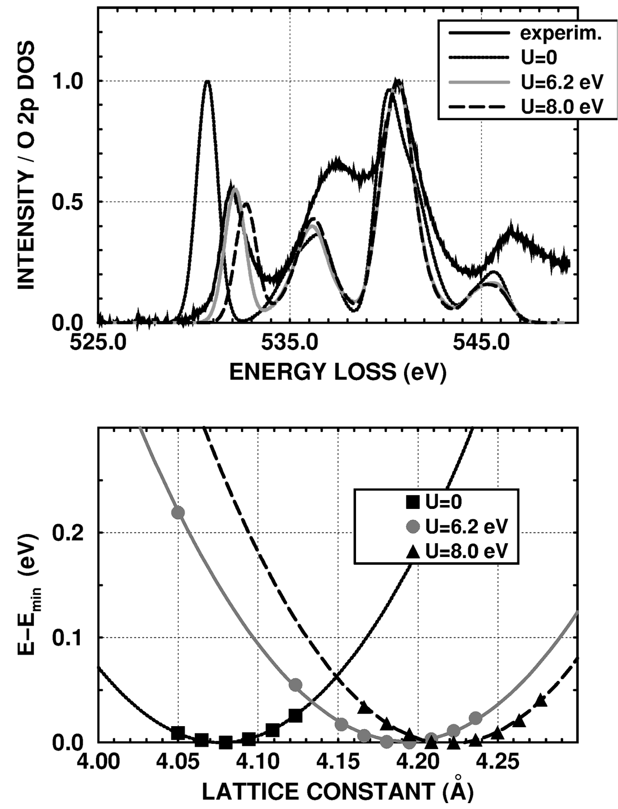
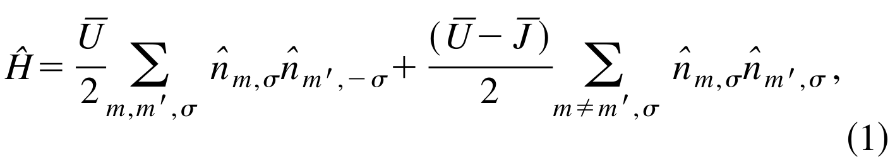
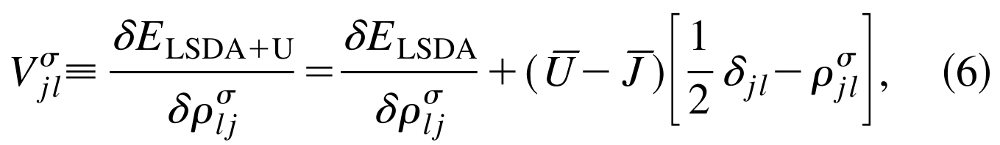
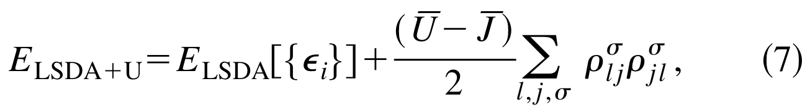

## dudarevElectronenergylossSpectraStructural1998a — 电子能量损失谱和氧化镍的结构稳定性：LSDA+U研究
## 📄 元数据
S. L. Dudarev, G. A. Botton, S. Y. Savrasov, C. J. Humphreys, A. P. Sutton et al.，1998，Physical Review B 57(3), 1505-1509，DOI: 10.1103/PhysRevB.57.1505
## 💡 一句话
用同一个有效 Hubbard U（6.2 eV）在 LSDA+U 框架下同时准确描述了 NiO 的氧 K 边 EELS 激发谱和基态结构稳定性参数（晶格常数、结合能、弹性模量），证明该方法能统一处理强关联过渡金属氧化物的光谱与结构性质。
## 🔗 Wiki 双链
本文涉及且 wiki 中已存在的条目，用双链列出（存在才链）：
  - 概念 [[../concepts/density-functional-theory]]、[[../concepts/lsda-plus-u|LSDA+U]]、[[../concepts/hubbard-u|Hubbard U]]、[[../concepts/mott-insulator|莫特绝缘体]]、[[../concepts/double-counting-correction|双计数修正]]、[[../concepts/electron-energy-loss-spectroscopy|电子能量损失谱（EELS）]]、[[../concepts/NiO|氧化镍（NiO）]]
  - 年度 [[../write/1998]]
  - 相关论文 **dudarevElectronenergylossSpectraStructural1998a**
## 📊 关键图表
列出本文关键图
  -  -> [[../figures/mathematical-models|数学模型与物理公式]]
  -  -> [[../figures/crystal-structures|晶体结构与原子排布]]
  -  -> [[../figures/mathematical-models|数学模型与物理公式]]
  -  -> [[../figures/mathematical-models|数学模型与物理公式]]
  - 公式(5) 旋转不变的LSDA+U泛函 E_LSDA+(Ū-J̄)/2 Σ_σ[Trρ^σ-Tr(ρ^σρ^σ)]（笔记未附该公式图片）
  -  -> [[../figures/mathematical-models|数学模型与物理公式]]
  -  -> [[../figures/mathematical-models|数学模型与物理公式]]
## 🔬 项目连接
无直接项目连接。本文是 LSDA+U 方法学奠基性 work，所验证的 DFT+U 方案是计算过渡金属氧化物（含 project-2 Mn 多铁体系）电子结构的通用工具，但本文研究对象为 NiO，与七个项目均无直接数据或材料连接。
## 🔗 项目双链
- 项目 [[../projects/project-2-mn-multiferroics|项目二：Mn极化结构铁电材料]]

## 📝 组织与用词
文章按"问题提出（LSDA 对过渡金属氧化物失效）→ 方法构建（推导旋转不变 LSDA+U 泛函与单电子势）→ 双重验证（EELS 谱对比 + 总能量/结构参数计算）→ 机制解释（电荷密度差揭示共价键减弱）→ 结论"组织，论证链条清晰，光谱与结构两条证据线在同一 U 值下汇合。值得复用的术语：
  - **LSDA+U / DFT+U**（局域自旋密度近似加 U）
  - **Hubbard U / on-site Coulomb repulsion**（[[../concepts/hubbard-u|Hubbard U]] / 在位库仑排斥）
  - **EELS ([[../concepts/electron-energy-loss-spectroscopy|Electron Energy-Loss Spectroscopy]])**（电子能量损失谱）
  - [[../concepts/mott-insulator|**Mott insulator**]]（莫特绝缘体）
  - **rotational invariance**（旋转不变性）
  - [[../concepts/double-counting-correction|**double counting correction**]]（双计数修正）
  - **covalent bonding / hybridization**（共价键合 / 杂化）
  - **cohesive energy**（内聚能/结合能）
  - [[../concepts/cohesive-energy|cohesive-energy]]
## ✏️ 可写入 Wiki 的要点
  1. **LSDA 对 NiO 的系统性失效**：LSDA 预测晶格常数 4.08 Å（实验 4.17 Å）、带隙仅 0.6 eV（实验 4.2 eV）、[[../concepts/cohesive-energy|内聚能]] 13.74 eV（实验 8.26 eV）；即使计入反铁磁序得到绝缘态，带隙仍比实验小一个数量级。Hartree-Fock 则走向另一极端（带隙 14.2 eV、晶格常数 4.26 Å、内聚能 6.2 eV）。
  2. **LSDA+U 统一参数（Ū=6.2 eV, J̄=0.95 eV）的结果**：晶格常数 4.19 Å、带隙 3.0 eV、内聚能 11.60 eV、体弹模量 B=182 GPa、剪切模量 C'=161 GPa、C44=86 GPa，均介于 LSDA 与 HF 之间，整体最接近实验值（4.17 Å、4.2 eV、8.26 eV）。
  3. **U 值的确定**：约束 LSDA 给出 Ū=8.0 eV（未计 d 电子自屏蔽，偏高）；通过匹配 EELS 两主峰间距选定 Ū=6.2 eV，与经验值 6.7 eV 接近；同一 U 值同时预测出合理的结构参数。
  4. **旋转不变 LSDA+U 泛函**：E_LSDA+U = E_LSDA + (Ū−J̄)/2 · Σ_σ [Tr(ρ^σ) − Tr(ρ^σρ^σ)]，该式桥接了 Anisimov 等的轨道依赖形式与 Liechtenstein 等的旋转不变泛函；单电子势为 V_jl^σ = δE_LSDA/δρ_jl^σ + (Ū−J̄)(δ_jl/2 − ρ_jl^σ)。
  5. **整数占据极限的消去性质**：在整数占据数极限下，非整数占据的 UHF 表达式与整数占据的密度泛函表达式精确抵消，使式(5)右侧修正项为零，因此该泛函可正确计算固体的内聚能（避免原子参考态与固体间的不一致）。
  6. **EELS 验证的物理细节**：氧 K 边对应 O 1s→空 2p 偶极跃迁，近边结构直接反映氧位 p 对称空态 DOS；将计算的 O 2p DOS 与高斯函数卷积以模拟[[../concepts/excited-state-lifetime|激发态寿命]]和仪器展宽（能量分辨率 0.4–0.5 eV，冷场发射枪 + Gatan GIF 678）。LSDA 两主峰间距比实验大约 2 eV 且低能峰（O 2p–Ni 3d 杂化峰）权重过高；LSDA+U 将该峰推向高能并压低其强度。
  7. **U 修正结构的微观机制**：[[../concepts/charge-density|电荷密度]]差 Δρ=ρ(LSDA+U)−ρ(LSDA) 显示 Ni–O 间隙区电荷密度减少，表明在位库仑排斥使 Ni 3d 电子更局域、减弱 Ni–O 共价键合，从而使晶格膨胀、平衡晶格常数增大；EELS 低能峰减弱与该图像自洽。U 对 O 2p–Ni 4s/4p 杂化的高能峰几乎无影响，体现轨道选择性。
  8. **失效根源与方法定位**：d 电子有效在位库仑作用强度与价带宽度相当，导致电子转移引起大幅能量涨落、载流子局域化与带隙形成；LSDA+U 本质是 LSDA（平均场、偏离域）与 UHF（精确交换、偏局域）的折衷，适用于轨道有序明显的[[../concepts/mott-insulator|莫特绝缘体]]，但仍为基态理论，带隙（3.0 eV）低于实验（4.2 eV），未含动态关联与激子效应。
  9. **计算实现细节**：全势 LMTO（FP-LMTO）程序，Moruzzi-Janak-Williams 交换关联势，三个能量面板、[[../concepts/brillouin-zone|布里渊区]] 343 个 k 点；NiO 取反铁磁基态（磁面平行于 (111) 面）。
  10. **方法学意义**：首次表明光谱特征（EELS 峰间距/峰强）可作为校准 Hubbard U 的独立实验探针，且校准所得 U 可迁移用于预测同一材料的基态结构性质，为过渡金属氧化物表面、缺陷及 STM 图像的从头算研究提供了可靠方案。