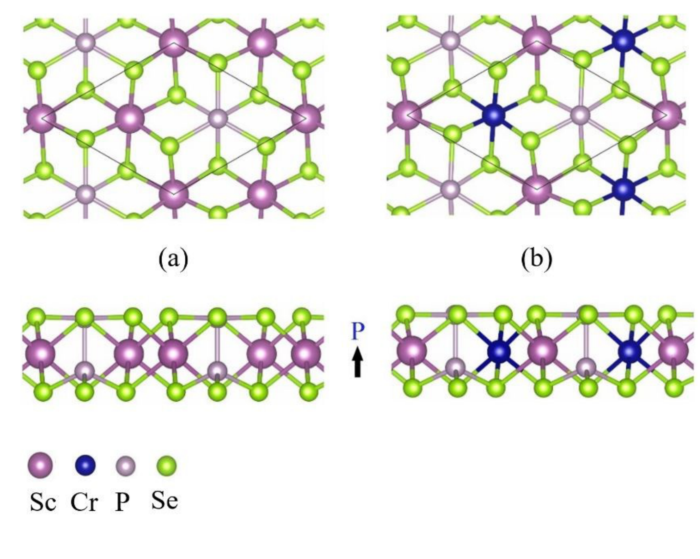
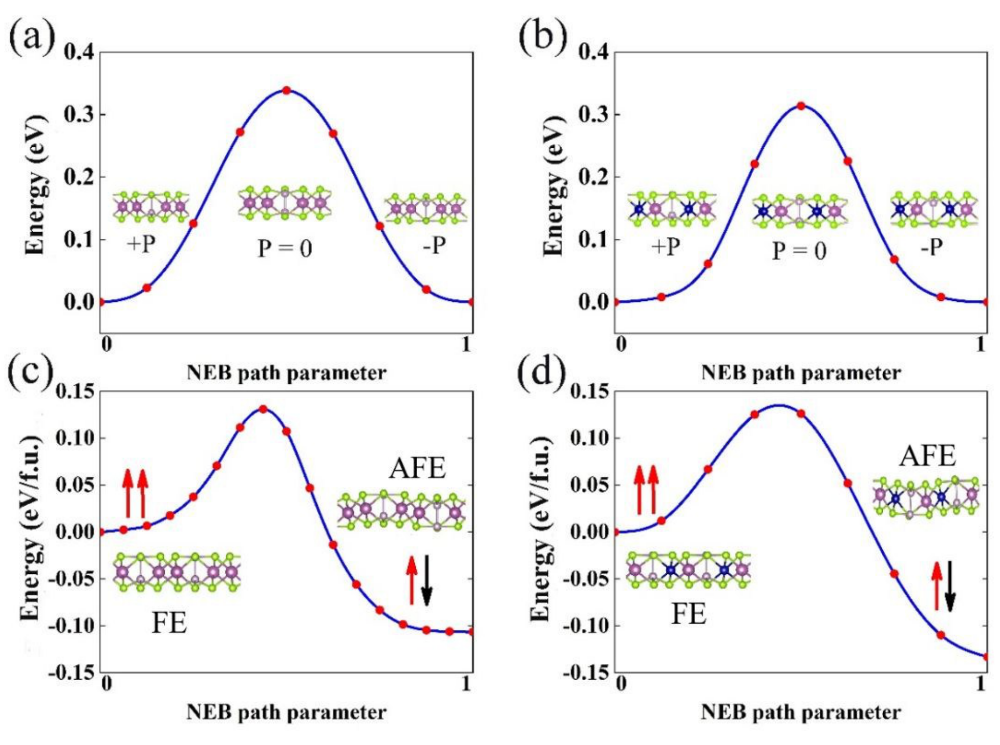
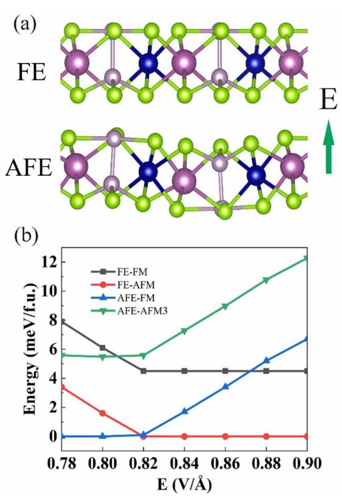
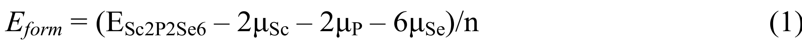
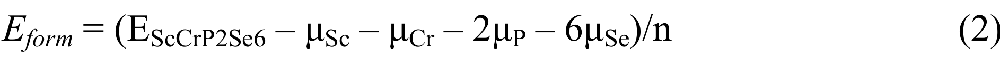
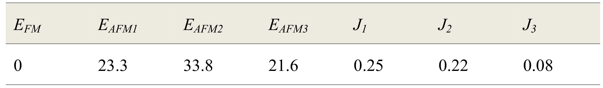
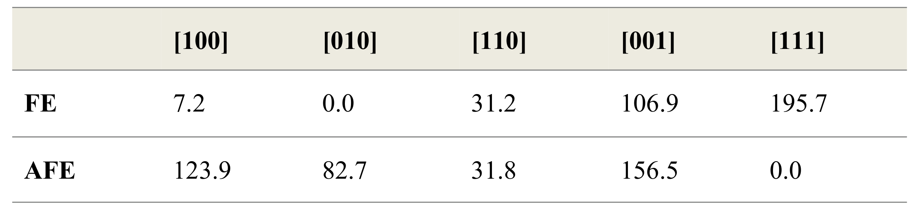

## fengFerroelectricityMultiferroicityTwodimensional2020 — 二维 Sc₂P₂Se₆ 与 ScCrP₂Se₆ 单层中的铁电性与多铁性

## 📄 元数据
Xukun Feng、Jian Liu、Xikui Ma、Mingwen Zhao（山东大学），2020，*Physical Chemistry Chemical Physics* 22(14): 7489–7496，DOI [10.1039/C9CP06966F](https://doi.org/10.1039/C9CP06966F)

## 💡 一句话
从 C2DB 筛选并以 DFT 预测 Sc₂P₂Se₆ 单层为面外铁电体，将一半 Sc 替换为 Cr 得到多铁 ScCrP₂Se₆，其 FE 相为 AFM、AFE 相为 FM，临界电场约 0.82 V/Å 可在两态间可逆切换，从而实现电控磁。

## 🔗 Wiki 双链
  - 概念 [[../concepts/2D-materials]]、[[../concepts/multiferroicity]]、[[../concepts/magnetoelectric-coupling]]、[[../concepts/berry-phase]]、[[../concepts/density-functional-theory]]、[[../concepts/ferroelasticity]]、[[../concepts/spin-orbit-coupling]]、[[../concepts/polarization-switching]]、[[../concepts/d0-rule|d⁰ 规则]]、[[../concepts/out-of-plane-ferroelectricity|面外铁电性]]、[[../concepts/antiferroelectricity|反铁电性]]、[[../concepts/superexchange-goodenough-kanamori|Goodenough–Kanamori 超交换规则]]、[[../concepts/magnetic-anisotropy-energy|磁各向异性能]]、[[../concepts/spin-lattice-charge-coupling|自旋-晶格-电荷耦合]]、[[../concepts/transition-metal-phosphorus-trichalcogenides|过渡金属磷三硫/硒化物]]、[[../concepts/C2DB]]、[[../concepts/CINEB|CINEB 爬坡弹性带]]、[[../concepts/Sc2P2Se6|Sc₂P₂Se₆]]、[[../concepts/ScCrP2Se6|ScCrP₂Se₆]]
  - 实体 [[../entities/VASP]]、[[../entities/Fe3GeTe2]]、[[../entities/In2Se3]]、[[../entities/TMDs]]、[[../entities/SnTe]]、[[../entities/h-BN]]
  - 图表 [[../figures/crystal-structures]]、[[../figures/electronic-bands]]、[[../figures/mathematical-models]]、[[../figures/heterostructures-stacking-multiferroic|多铁与磁电异质结]]
  - 年度 [[../write/2020]]
  - 项目 [[../projects/project-2-mn-multiferroics]]、[[../projects/project-5-snte-ferroelectric-sim]]
  - 相关论文 **fengFerroelectricityMultiferroicityTwodimensional2020**

## 🆕 新概念/实体建议
  - （本页建议项均已提升为现有 wiki 双链）

## 📊 关键图表
  -  → [[../figures/heterostructures-stacking-multiferroic|多铁与磁电异质结]]
  -  → [[../figures/heterostructures-stacking-multiferroic|多铁与磁电异质结]]
  - 
  -  → [[../figures/heterostructures-stacking-multiferroic|多铁与磁电异质结]]
  - 
  - 公式 (1) 形成能：
  - 公式 (2) 形成能：
  - 表 I AFE 相四磁序相对能量（meV）与 J1/J2/J3 交换常数（meV）：；EFM=0，EAFM1=23.3、EAFM2=33.8、EAFM3=21.6；J1=0.25、J2=0.22、J3=0.08
  - 表 II 磁各向异性能（μeV）：；FE 易轴 [010]，AFE 易轴 [111]
  - 图 5（PDOS、交换路径示意、MC 磁矩-温度曲线，TC≈46 K）原笔记未附独立图片文件，见原文 Fig. 5 描述

## 🔬 项目连接
  - **project-2（Mn 多铁）**：直接相关。(1) 本文系统讨论的过渡金属磷三硫/硒化物家族 MPX₃ 包含 MnPSe₃（参考文献 51，载流子掺杂后半金属）和 FePSe₃，与 Mn 基多铁材料同族同结构，可作为 Mn 多铁体系的结构-机制参照；(2) d⁰ 规则及其突破策略——用非磁性 Sc 承担铁电畸变、用磁性 Cr 承担磁矩，"功能离子各司其职"——为在 Mn 体系中设计铁电-磁共存提供了可迁移的化学设计思路（Mn 本身具 d 电子，需寻找不依赖 d⁰ 阳离子位移的极化起源，如本文 P 原子翘曲或阴离子位移）；(3) FE/AFE 相变通过晶格畸变调制 Cr–Se–Se–Cr 超交换路径从而切换 FM/AFM 的自旋-晶格-电荷耦合机制，可类比用于 Mn–O/Se 路径的磁电耦合分析；(4) 方法链可复用：Berry 相位算极化、CINEB 算翻转势垒、GGA+U（U−J=3 eV）处理 3d 强关联、四磁序能量对比定 J、海森堡哈密顿量 + MC 50×25 超胞（2500 磁位）10⁹ 步估居里温度。
  - **project-5（SnTe 铁电模拟）**：直接相关。(1) 引言明确将 SnTe 单层（Chang et al., *Science* 2016, ref. 19）列为已实验实现的二维面内铁电体，与本文面外铁电体形成对照，可写入 SnTe 条目的"二维铁电体家族"语境；(2) 本文给出二维铁电体的标准 DFT 计算流程与参数（PAW-PBE、500 eV 截断、10⁻⁵ eV 收敛、力 < 0.01 eV/Å、7×7×1 k 网格、20 Å 真空、Grimme D2、Berry 相位极化、CINEB 势垒），这些对 SnTe 铁电翻转模拟的计算设置有直接参考价值；(3) FE 与 AFE 能量竞争由"原子位移应变能 vs 极化电场能（去极化场）"决定的物理图像，以及 FE 作为亚稳态被势垒锁定的判据（势垒需高于室温 kBT≈0.026 eV），适用于评估 SnTe 薄层铁电稳定性；(4) 外电场下四态能量二次关系、临界电场判据可迁移到 SnTe 电场调控模拟。
  - **project-1（双光子）**：无直接项目连接。本文为电学/磁学第一性原理研究，未涉及双光子吸收或非线性光学。
  - **project-3（机械发光 NN）**：无直接项目连接。
  - **project-4（TTF 分子计算）**：弱方法学参考。本文 VASP+PAW+PBE+D2 的标准流程与形成能公式可作分子/低维体系能量评估参照，但材料体系与物理问题差异大。
  - **project-6（湿度传感器）**：无直接项目连接。
  - **project-7（CDW）**：无直接项目连接。本文未涉及电荷密度波；虽 AFE 相 P1 对称性畸变与 CDW 有形式上的晶格畸变相似性，但机制不同，不构成可迁移参考。

## 📝 组织与用词
文章按"数据库筛选原型 → 半取代设计多铁体 → 声子/形成能验证稳定性 → Berry 相位定量极化 → CINEB 给出 FE↔PE↔FE 与 FE↔AFE 势垒 → 四磁序对比锁定 FE-AFM/AFE-FM → PDOS 与 J 常数揭示超交换机制 → MAE 保障二维长程磁序 → MC 估 TC≈46 K → 外电场演示 0.82 V/Å 临界切换"的递进链条组织；引言以 d⁰ 规则立靶，结论以自旋-晶格-电荷耦合回应。值得复用的术语：
  - d⁰ rule / d⁰ 规则
  - [[../concepts/out-of-plane-polarization|out-of-plane ferroelectric polarization / 面外铁电极化]]
  - antiferroelectric ([[../concepts/antiferroelectricity|AFE]]) / 反铁电
  - [[../concepts/spin-lattice-charge-coupling|spin–lattice–charge coupling / 自旋-晶格-电荷耦合]]
  - superexchange ([[../concepts/superexchange-goodenough-kanamori|Goodenough–Kanamori]]) / 超交换
  - magnetic anisotropy energy ([[../concepts/magnetic-anisotropy-energy|MAE]]) / 磁各向异性能
  - [[../concepts/nudged-elastic-band|climbing-image nudged elastic band]] (CINEB) / 爬坡图像微动弹性带
  - [[../concepts/depolarization-field|depolarization field / 去极化场]]

  - [[../concepts/d0-rule|d0-rule]]
## ✏️ 可写入 Wiki 的要点
  1. Sc₂P₂Se₆ 单层（P31m，a=6.683 Å）面外铁电极化源于 P 原子垂直翘曲（半数 P 凸出 Se 面），而非 CuInP₂S₆ 中 Cu 离子位移机制；Sc³⁺ 大离子半径导致 P 无法稳定在平面内，破缺反演对称性。
  2. 极化值：Sc₂P₂Se₆ 为 12.36 pC/m（取厚度 4.0 Å 等效 3.09 μC/cm²），ScCrP₂Se₆ 为 6.11 pC/m（1.53 μC/cm²）；与 Sc₂CO₂（1.60 μC/cm²）相当，比 CuInP₂Se₆（0.322 μC/cm²）、AgBiP₂Se₆（0.2 μC/cm²）大约一个数量级。
  3. FE-PE-FE 翻转势垒为 0.34 eV/f.u.（Sc₂P₂Se₆）和 0.31 eV/f.u.（ScCrP₂Se₆），远高于 α-In₂Se₃ 的 0.057 eV/f.u.；FE-AFE 势垒为 0.13/0.12 eV/f.u.，AFE 比 FE 低 0.1–0.14 eV/f.u.，FE 是稳健亚稳态，室温下不会自发转为 AFE。
  4. 形成能分别为 −0.922 和 −0.587 eV/atom，声子谱无虚频；ScCrP₂Se₆ 多种 Cr 分布构型能量差 < 0.01 eV/atom，均存在面外极化与自旋极化共存。
  5. ScCrP₂Se₆（P3，a=6.535 Å；AFE 相 P1，a=6.303 Å，b=11.651 Å）每个 Cr³⁺ 携 3 μB 局域磁矩；FE 相间接带隙 0.27 eV，AFE 相 0.54 eV，PE 态金属性且不稳定。
  6. 磁电耦合核心：FE 相 Cr–Se–Se–Cr 路径上 Se p 与 Cr d 在 EF 附近重叠弱，间接交换弱，直接交换主导 → AFM（EAFM−EFM=−4.3 meV/f.u.）；AFE 相晶格畸变缩短/改变 Cr–Se 距离，p-d 杂化增强，超交换（J1=0.25、J2=0.22、J3=0.08 meV，均为正即 FM）主导 → FM。
  7. MAE 为 7.2–195.7 μeV/Cr，大于立方 Fe/Ni（0.4–5 μeV），足以支撑二维长程磁序；FE-AFM 易轴沿 [010]（垂直于极化方向），AFE-FM 易轴沿 [111]。
  8. 海森堡哈密顿量 H = H₀ − J₁ΣMᵢMⱼ − J₂ΣMₖMₗ − J₃ΣMₘMₙ；MC 用 50×25 超胞（2500 磁位）、每温度 10⁹ 步，得 AFE-FM 相居里温度约 46 K，与 CrI₃ 单层（45 K）相当。
  9. 外电场沿极化方向时 FE 与 AFE 能量均呈二次关系，FE 相能量随电场变化更显著；E=0.82 V/Å 时最低能态由 FE-AFM 切换为 AFE-FM，静态下磁交换能本身几乎不随电场变化，切换由静电能驱动。
  10. 计算设置：VASP、PAW、PBE、GGA+U（U−J=3 eV）、500 eV 截断、10⁻⁵ eV 收敛、力 < 0.01 eV/Å、7×7×1 k 网格、>20 Å 真空、Grimme D2、Phonopy 有限位移、Berry 相位、CINEB；可作为二维铁电/多铁 DFT 研究的标准模板。
