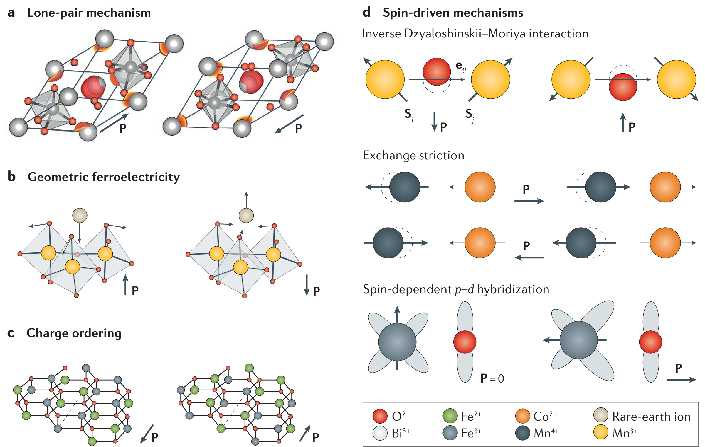
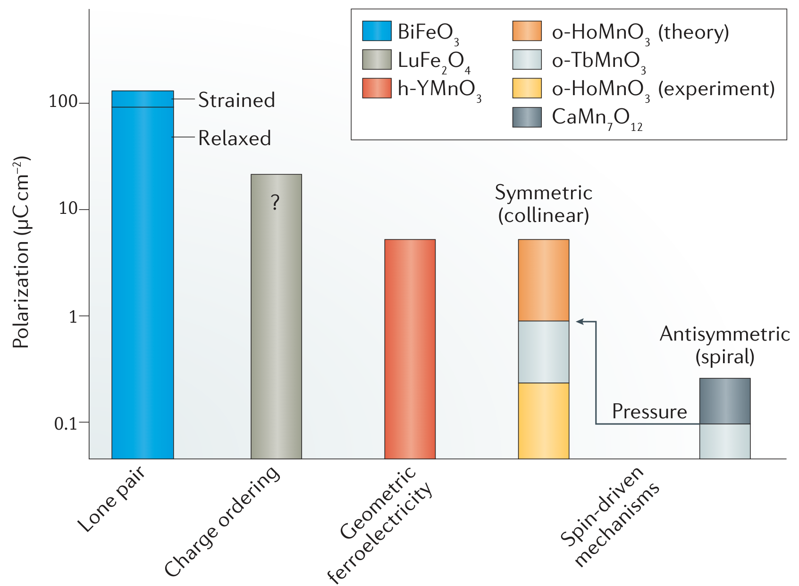
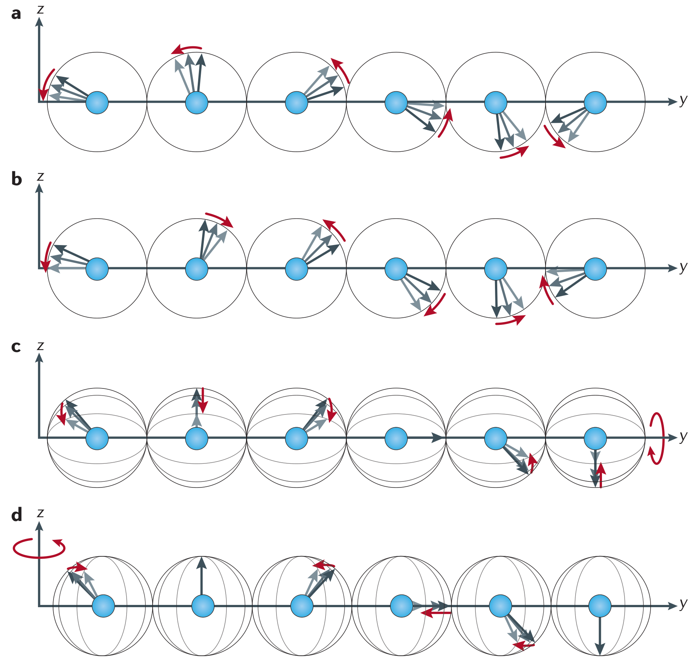

## fiebigEvolutionMultiferroics2016 — 多铁性的演化（The evolution of multiferroics）
## 📄 元数据
Manfred Fiebig、Thomas Lottermoser、Dennis Meier、Morgan Trassin（ETH Zürich），2016，*Nature Reviews Materials* 1(8), 16046，DOI: 10.1038/natrevmats.2016.46
## 💡 一句话
以"I类/II类"分类与四大机制（孤对电子、几何、电荷有序、自旋驱动）为主线，系统综述多铁性材料从钙钛矿"磁电互斥"认识到薄膜异质结、畴壁、非平衡动力学与对称性破缺新物理的半个世纪演进。
## 🔗 Wiki 双链
本文涉及且 wiki 中已存在的条目：
  - 概念 [[../concepts/multiferroicity]]
  - 概念 [[../concepts/magnetoelectric-coupling]]
  - 概念 [[../concepts/strain-engineering]]
  - 概念 [[../concepts/topological-defects]]
  - 概念 [[../concepts/ferroelasticity]]
  - 概念 [[../concepts/polarization-switching]]
  - 概念 [[../concepts/spin-orbit-coupling]]
  - 概念 [[../concepts/improper-ferroelectricity|非本征铁电性]]
  - 概念 [[../concepts/lone-pair-mechanism|孤对电子机制]]
  - 概念 [[../concepts/geometric-ferroelectricity|几何铁电性]]
  - 概念 [[../concepts/charge-order|电荷有序]]
  - 概念 [[../concepts/spin-driven-ferroelectricity|自旋驱动铁电性]]
  - 概念 [[../concepts/inverse-dzyaloshinskii-moriya|逆DM相互作用]]
  - 概念 [[../concepts/exchange-striction|交换伸缩]]
  - 概念 [[../concepts/ferrotoroidicity|铁涡旋性]]
  - 概念 [[../concepts/electromagnon|电磁振子]]
  - 概念 [[../concepts/nonreciprocal-directional-dichroism|非互易定向二向色性]]
  - 概念 [[../concepts/exchange-bias|交换偏置]]
  - 概念 [[../concepts/magnetic-monopole-quasiparticle|磁单极准粒子]]
  - 概念 [[../concepts/domain-wall-engineering|畴壁工程]]
  - 概念 [[../concepts/type-i-type-ii-multiferroics|I类/II类多铁性分类]]
  - 概念 [[../entities/BaTiO3|BaTiO₃]]
  - 概念 [[../concepts/TbMnO3|TbMnO₃]]
  - 实体 [[../entities/BiFeO3]]
  - 实体 [[../entities/HoMnO3]]
  - 实体 [[../concepts/domain-wall]]
  - 实体 [[../entities/BaTiO3|BaTiO₃]]
  - 实体 [[../entities/LuFe2O4|LuFe₂O₄]]
  - 实体 [[../entities/SrMnO3|SrMnO₃]]
  - 图表 [[../concepts/domain-wall]]
  - 图表 [[../figures/mathematical-models]]
  - 年度 [[../write/2015-2019]]
  - 项目 [[../projects/project-2-mn-multiferroics]]
  - 主题 [[多铁性材料]]
  - 相关论文 [[../../raw/note/fiebigEvolutionMultiferroics2016]]
  - 实体 [[../entities/h-YMnO3]]
  - 实体 [[../entities/Cr2O3]]
  - 实体 [[../entities/CaMn7O12]]

## 🆕 新概念/实体建议
wiki 中没有、但值得新建的概念或材料实体：
  - 实体 [[../entities/h-YMnO3|h-YMnO3]]（六方锰酸钇）：几何铁电代表，Ps=5.6 μC/cm²，Tc≥1200 K，TN≤120 K；SHG首次揭示畴壁磁电耦合。
  - 实体 [[../entities/Cr2O3|Cr2O3]]：非多铁但具时空反演双破缺，展示线性磁电效应、铁涡旋性、磁准单极子与最早NDD。
  - 实体 [[../entities/CaMn7O12|CaMn7O12]]：铁轴磁体，逆DM机制下极化最高之一（0.3 μC/cm²）。
## 📊 关键图表
  -  -> [[../figures/mathematical-models-magnetoelectric|磁电耦合与多铁理论]]
    - **图示描述**：以四个子图示意磁序与铁电长程序共存的四种微观机制：(a) BiFeO₃中Bi³⁺ 6s²孤对电子不对称分布形成局域偶极；(b) h-RMnO₃中MnO₅双锥倾斜挤压R³⁺位移；(c) LuFe₂O₄中Fe²⁺/Fe³⁺电荷有序；(d) 自旋驱动的三条路径（逆DM、交换伸缩、自旋依赖p-d杂化）。
    - **关键特征**：孤对电子机制给出Ps≈100 μC/cm²（应变下达150），Tc=1103 K、TN=643 K，是唯一室温单相多铁；几何机制Ps=5.6 μC/cm²、Tc≥1200 K但TN≤120 K；电荷有序声称约25 μC/cm²但铁电性至今存争议；自旋驱动由P∝eij×(Si×Sj)、P∝Rij(Si·Sj)、P∝(Si·eij)²eij三个公式统一描述。
    - **结论/意义**：该图是全文的"家族谱系图"，确立了I类（a-c独立起源）与II类（d磁致铁电）分类，是理解各材料体系物理根源的基石。
  -  -> [[../figures/electronic-bands-cdw-transport|CDW与输运性质]]
    - **图示描述**：纵轴为最大自发极化值Ps（对数刻度，单位μC/cm²），按四大机制分组比较代表性单相多铁材料的极化强度。
    - **关键特征**：孤对电子BiFeO₃约100 μC/cm²居首；电荷有序LuFe₂O₄约25 μC/cm²但标注争议；几何h-YMnO₃约5.6 μC/cm²；自旋驱动类普遍<1 μC/cm²，其中共线交换伸缩约1 μC/cm²、CaMn₇O₁₂约0.3 μC/cm²、逆DM螺旋相约0.1 μC/cm²。
    - **结论/意义**：量化揭示I类"强铁电弱耦合"与II类"强耦合弱极化"的张力，指出提高自旋驱动体系极化与有序温度是材料设计核心挑战。
  -  -> [[../figures/domain-walls-structures|畴结构与畴壁]]
    - **图示描述**：四种薄膜/异质结策略示意：(a) 交换耦合（FE/AFM多铁层/FM通过界面J传递）；(b) 应变耦合（压电↔磁致伸缩，应力σ传递）；(c) 多铁性仅存在于ε/μ两材料的二维界面；(d) 多铁性仅存在于单晶内部A⁺/A⁻畴之间的畴壁。
    - **关键特征**：(a)(b)属3D传递型，多铁性来自体相复合，BiFeO₃-CoFe已演示室温可重复电场翻转磁化；(c)(d)属2D受限型，多铁性由对称性破缺"凭空"出现在界面或畴壁；衬底外延应窗口约±0.1%可调。
    - **结论/意义**：标志研究从三维块材走向原子级界面，指明从"发现多铁材料"到"设计多铁功能"的范式转变。
  -  -> [[../figures/domain-walls-structures|畴结构与畴壁]]
    - **图示描述**：红线为铁电畴壁、蓝线为磁畴壁，对比I类（磁电独立）与II类（电由磁生）中两类畴壁的重合关系。
    - **关键特征**：I类中P畴与M畴图案可互不重合，畴壁各自独立；只有部分区域巧合重合才形成多铁畴壁（橙线）。II类中由于铁电由磁序诱导，对称性强制每一个铁电畴壁同时是磁畴壁，所有畴壁"天生"多铁。
    - **结论/意义**：从微观畴结构解释了为何II类磁电耦合远强于I类，并为h-YMnO₃中SHG观测到的畴壁磁电耦合提供模型，是畴壁工程学的理论依据。
  -  -> [[../figures/domain-walls-structures|畴结构与畴壁]]
    - **图示描述**：三个子图展示时空反演双破缺衍生的高阶自旋织构：(a) 晶胞内六自旋首尾相接形成涡旋，定义环矩T=Σᵢ rᵢ×Sᵢ；(b) 相反环矩取向构成铁涡旋畴结构；(c) 自旋由一点向外辐射或向内汇聚，呈磁单极准粒子排列。
    - **关键特征**：磁环矩同时破坏空间反演与时间反演，被提为继铁电、铁磁、铁弹之后第四种初级铁性序；LiCoPO₄中可用正交电磁场组合的环向场翻转畴；Cr₂O₃等体系最早展示相关NDD与磁电响应。
    - **结论/意义**：说明多铁性研究的深层物理是对称性双破缺，并将其延伸到铁涡旋性、磁单极准粒子等基础新物态，已外溢到高能物理与宇宙学。
  -  -> [[../figures/electronic-bands-cdw-transport|CDW与输运性质]]
    - **图示描述**：灰色箭头为易平面内的回旋自旋静态结构（由逆DM产生z方向极化P），四个子图分别展示不同磁振子激发模式：(a) 平面内摆动但P不变；(b) 同时调制对称与反对称交换导致P振幅空间调制；(c)(d) 易平面绕y或z轴旋转引起P方向或振幅变化。
    - **关键特征**：仅(b)(d)类激发伴随电极化振荡，才是真正的电磁振子；最早在o-TbMnO₃/o-GdMnO₃中报道，且o-GdMnO₃中可在多铁相之外出现；GaFeO₃中相关NDD达Δα/α≈1.6×10⁻³，Ba₂CoGe₂O₇太赫兹段达Δα/α≈1。
    - **结论/意义**：揭示磁电耦合的动力学一面，证明电磁振子与NDD是对称性产物而非多铁性专属，为太赫兹磁光器件与皮秒级全光控磁奠定基础。
## 🔬 项目连接
project-2 Mn多铁 直接相关——本综述系统讨论了 h-RMnO₃、o-TbMnO₃、TbMn₂O₅、Ca₃Mn₂O₇、SrMnO₃、LuMnO₃、MnWO₄、CaMn₇O₁₂ 等 Mn 基多铁体系的机制、畴壁与应变调控，可作为该项目的框架性参考。project-1 双光子 间接受益（二次谐波产生 SHG 是多铁畴成像的关键手段）。其余项目无直接连接。
## 🔗 项目双链

## 📝 组织与用词
全文按"历史播种（1950s–2000）→ 四大共存机制与I/II类分类 → 薄膜/异质结（交换耦合、应变、界面）→ 畴与畴壁 → 非平衡动力学 → 反演对称破缺（铁涡旋、磁单极、电磁振子、NDD）→ 对其他领域的影响 → 趋势与挑战"的链条展开，以"磁电互斥禁忌"为逻辑起点，以"对称性双破缺"贯穿深层物理，以"室温可重复电控磁化翻转"为应用圣杯。Box 1 集中定义 ferroic / magnetoelectric / multiferroic / magnetodielectric / domain 等术语。值得复用的关键词：
  - multiferroics 多铁性（材料）
  - magnetoelectric coupling 磁电耦合
  - type I / type II multiferroics I类/II类多铁性
  - improper ferroelectricity 非本征铁电性
  - inverse Dzyaloshinskii–Moriya interaction 逆DM相互作用
  - exchange striction 交换伸缩
  - ferrotoroidicity 铁涡旋性（铁磁环矩性）
  - electromagnon 电磁振子
  - nonreciprocal directional dichroism (NDD) 非互易定向二向色性
  - exchange bias 交换偏置
  - domain-wall engineering 畴壁工程
  - spin-driven ferroelectricity 自旋驱动铁电性
## ✏️ 可写入 Wiki 的要点
  1. **钙钛矿"磁电互斥"的里程碑**：Spaldin（Hill, 2000）指出位移型[[../concepts/ferroelectricity|铁电性]]需要空的 3d 壳层以利于离子偏离中心与电子云杂化，而磁性过渡金属有序需要部分填充 3d 壳层，这一矛盾解释了钙钛矿中多铁材料的稀缺，迫使领域转向非位移型机制。
  2. **I类与II类分类**：I类多铁中磁序与铁电序独立起源（[[../concepts/lone-pair-electrons|孤对电子]]、几何、[[../concepts/charge-order|电荷有序]]），通常铁电性强但[[../concepts/magnetoelectric-coupling|磁电耦合]]弱；II类多铁中铁电由特定磁序诱导（共生相变），磁电耦合强但极化小、有序温度低。
  3. **[[../concepts/lone-pair-mechanism|孤对电子机制]]与 BiFeO₃**：Bi³⁺ 的 6s² 电子对不参与 sp 杂化，形成局域偶极子；BiFeO₃ Ps≈100 μC/cm²（应变下可达约 150），Tc=1103 K，TN=643 K，是目前唯一已知的室温单相多铁材料，也是器件研究的核心。
  4. **[[../concepts/geometric-ferroelectricity|几何铁电性]]**：h-RMnO₃（R=Sc,Y,In,Dy–Lu）中晶胞三倍化驱动 MnO₅ 双锥倾斜，挤压 R³⁺ 位移产生 Ps=5.6 μC/cm²，Tc≥1200 K 但 TN≤120 K；其他例子包括 BaNiF₄（~0.01 μC/cm² 但可翻转弱铁磁矩）与Ca₃Mn₂O₇（混合非极性模驱动的[[../concepts/hybrid-improper-ferroelectricity|杂化非本征铁电]]）。
  5. **电荷有序的争议**：LuFe₂O₄ 中 Fe²⁺/Fe³⁺ 交替[[../concepts/superlattice|超晶格]]曾被认为可产生约 25 μC/cm² 极化，但经十年研究其铁电性仍受质疑；电荷有序驱动的[[../concepts/multiferroicity|多铁性]]"基本仍停留在有趣概念阶段"。
  6. **自旋驱动三路径与极化公式**：①[[../concepts/inverse-dzyaloshinskii-moriya|逆DM相互作用]]（非共线螺旋，P∝eij×(Si×Sj)，o-TbMnO₃，~0.1 μC/cm²）；②[[../concepts/exchange-striction|交换伸缩]]（共线↑↑↓↓，P∝Rij(Si·Sj)，TbMn₂O₅，极化可比逆DM大约一个数量级）；③自旋依赖 p–d 杂化（螺旋自旋调控金属-配体杂化，P∝(Si·eij)²eij，CuFeO₂/CuMO₂，P≤0.03 μC/cm²）。o-TbMnO₃ 加压下回旋序→共线反铁磁序时极化提升约一个数量级，验证了 |Si·Sj|>|Si×Sj|。
  7. **BiFeO₃–CoFe 室温电控磁化翻转**：经[[../concepts/exchange-bias|交换偏置]]（h-YMnO₃–坡莫合金低温验证）、BiFeO₃–CoFe 室温不可逆交换偏置修改，到 Heron 等（Nature 2014）在微观 BiFeO₃–CoFe 点中演示可重复的室温电场驱动磁化翻转，被誉为磁电多铁研究的"圣杯"；微观机制可追溯到畴的形成与一一对齐。
  8. **[[../concepts/strain-engineering|应变工程]]的多重作用**：[[../concepts/epitaxial-strain|外延应变]]可诱导非铁性化合物出现[[../concepts/ferroic-order|铁性序]]——SrTiO₃ 中诱导极性序、EuTiO₃ 与 SrMnO₃ 中诱导极性与磁序共存、LuMnO₃ 中诱导[[../concepts/ferromagnetism|铁磁性]]；Ba 合金化块体 SrMnO₃ 通过 Ba²⁺ 大尺寸化学施压获得多铁性；铁电衬底还可在外加电压下于 ±0.1% 窗口内可逆调控应变。
  9. **畴壁作为功能单元**：BiFeO₃ 畴壁电导高于块体（Seidel 等，Nat. Mater. 2009）开启[[../concepts/domain-wall-engineering|畴壁工程]]；h-YMnO₃ 中 SHG 揭示铁电-反铁磁畴的耦合源于畴壁而非畴内；II类多铁中每个[[../concepts/ferroelectric-domain|铁电畴]]壁因对称性必然也是磁畴壁；但"非多铁单晶内部畴壁处出现多铁性"（图3d）尚未被观测到。
  10. **非平衡动力学被严重低估**：GaFeO₃ 中极性与磁序时间演化根本不同；CuO 光学激发皮秒内共格→非共格磁序转变；o-TbMnO₃ 太赫兹实验仅获约 4% 自旋偏转（远低于 180° 翻转）；BiFeO₃ 电场脉冲超快翻转存在争议；MnWO₄ 等磁致铁电体翻转可能固有缓慢；存储应用要求[[../concepts/order-parameter|序参量]]翻转进入皮秒量级，全光控制被视为有前途方向。
  11. **对称性双破缺与新铁性序**：多铁性的许多奇特性质源于同时破坏空间反演与[[../concepts/time-reversal-symmetry|时间[[../concepts/inversion-symmetry|反演对称性]]]]；[[../concepts/ferrotoroidicity|铁涡旋性]]以[[../concepts/toroidal-moment|环形矩]] T=Σri×Si 为序参量，被提议为继铁电、铁磁、铁弹之后第四种初级铁性序，LiCoPO₄ 中实现了畴与环形场极化（环形场由互相垂直的电、磁场组合产生），LiFeSi₂O₆ 中证明环形矩可作为本征驱动序参量。
  12. **[[../concepts/electromagnon|电磁振子]]与NDD是对称性而非多铁性本身的产物**：电磁振子是打破反演对称的磁共振并伴随极化振荡，最早在 o-TbMnO₃/o-GdMnO₃ 中报道，且在 o-GdMnO₃ 中中可出现在多铁相之外；NDD（相反方向光透射不同）在 GaFeO₃ 中 Δα/α 达 1.6×10⁻³，Ba₂CoGe₂O₇ 太赫兹波段达 Δα/α=1 的巨NDD，Cr₂O₃ 中反铁磁克尔/法拉第类似效应是最早NDD实例；两者在非多铁材料中也可出现。
  13. **对邻近领域的影响**：恢复了对位移型之外多种铁电机制（尤其是非本征铁电）的重视；推动氧化物薄膜外延生长与氧化物电子学；改进表征技术至飞米级 XRD、0.1 nC/cm² 热释电、SHG 磁电畴成像、太赫兹电磁振子谱；并进入高能物理（EuTiO₃ 中 Ba 取代抑制磁序以探测电子永久电偶极矩）与宇宙学（h-RMnO₃ 铁电畴交汇线分布与宇宙弦形成标度律类比）。
  14. **未来趋势与竞争**：薄膜异质结最具应用潜力，方向包括磁电[[../concepts/memristor|忆阻器]]、[[../concepts/layer-selective-switching|层选择性翻转]]构造"整体对称性可调"多层膜（如 PZT–LSMO–PZT）、电场控制赛道内存中的畴壁、多铁绝缘体中[[../concepts/skyrmion|斯格明子]]的电场（而非电流）操控；多铁器件需与自旋转移矩（STT）与自旋轨道矩（SOT）等电流控磁技术在速度、功耗、可靠性、集成密度上竞争。
