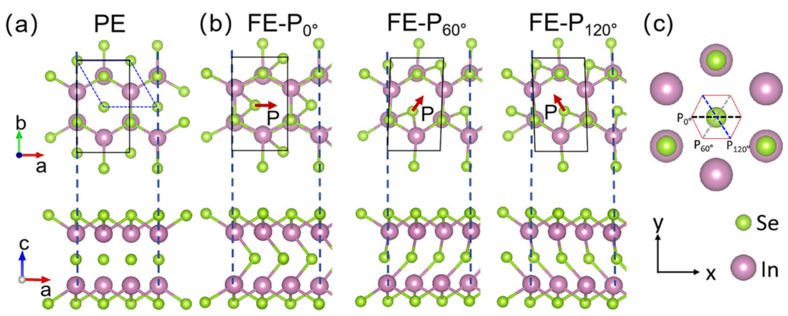
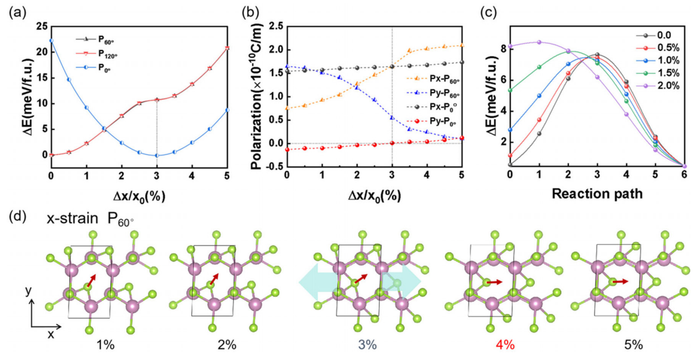
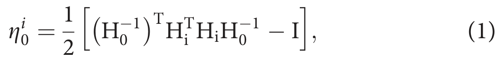
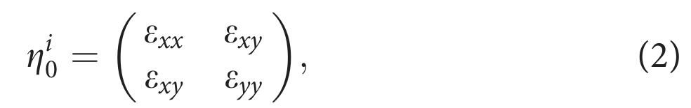
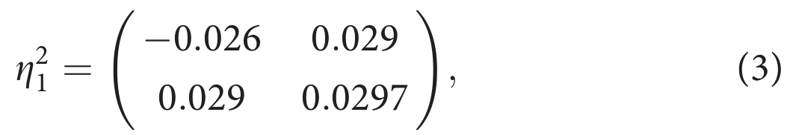
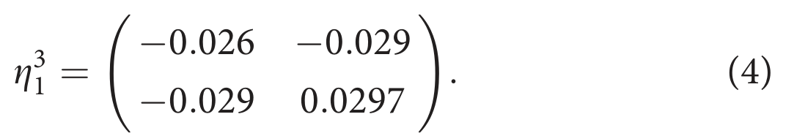

## gaoStrainEngineeringFerroelectric2024 — 二维多铁半导体中铁电极化和畴的应变工程

## 📄 元数据
Gao, Chen, Qi et al.，2024，Applied Physics Letters 125, 212903，DOI 10.1063/5.0239890
## 💡 一句话
基于第一性原理计算，提出利用 β'-In₂Se₃ 中铁弹性与铁电性的内禀耦合，通过单轴/剪切应变而非外电场来旋转极化方向、降低相变势垒并可逆切换 60°/180° 畴壁，实现铁电畴的"应变编程"。

## 🔗 Wiki 双链
  - 概念 [[../concepts/ferroelasticity]]、[[../concepts/multiferroicity]]、[[../concepts/strain-engineering]]、[[../concepts/2D-materials]]、[[../concepts/berry-phase]]、[[../concepts/density-functional-theory]]、[[../concepts/polarization-switching]]、[[../concepts/ferroelastic-ferroelectric-coupling]]、[[../concepts/transformation-strain]]、[[../concepts/domain-wall-electronics]]
  - 实体 [[../entities/In2Se3]]、[[../entities/VASP]]、[[../entities/WTe2]]、[[../entities/SnTe]]、[[../entities/domain-wall]]、[[../entities/HgBr2]]、[[../entities/CuInP2S6]]
  - 图表 [[../figures/crystal-structures]]、[[../figures/domain-walls]]、[[../figures/mathematical-models]]
  - 年度 [[../write/2024]]
  - 话题 [[多铁性材料]]、[[材料模拟计算设计]]
  - 相关论文 [[../../raw/note/gaoStrainEngineeringFerroelectric2024]]

## 📊 关键图表
  - 图1 β-In₂Se₃（顺电相）与 β'-In₂Se₃（铁电相）的晶体结构及 P₀/P₆₀/P₁₂₀ 三个对称等效极化取向
    - **图示描述**：展示顺电相 β-In₂Se₃ 的俯视图/侧视图（中心 Se 位于反演对称中心）和铁电相 β'-In₂Se₃ 三个取向变体 FE-P₀、FE-P₆₀、FE-P₁₂₀ 的原子排布，红色箭头标出面内极化方向（与中心 Se 位移方向相反）。
    - **关键特征**：PE 相 a=b=4.014 Å，具空间反演对称；FE 相比 PE 相低 0.083 eV/f.u.，FE-P₀ 中 a=4.127 Å、b=6.876 Å，沿极化方向自发伸长、垂直方向收缩；六方三重对称给出 0°、60°、120° 三个等效极化方向（加反向共六态）。
    - **结论/意义**：铁电极化与铁弹晶格畸变同源，奠定了应变调控极化的结构基础。
     -> [[../figures/crystal-structures-bulk|体相晶体结构]]
  - 图2 x方向单轴应变下的能量差、极化分量、FE-P₆₀→FE-P₀ 相变势垒及结构演化
    - **图示描述**：四个子图分别为 (a) 三种取向变体能量差随 x 方向单轴拉伸应变的变化，(b) FE-P₀ 与 FE-P₆₀ 的极化分量 Px、Py 随应变的变化，(c) 不同应变下 FE-P₆₀→FE-P₀ 的 CI-NEB 势垒曲线，(d) FE-P₆₀ 原子结构随应变演化的快照。
    - **关键特征**：约 3% 拉伸时 P₆₀/P₁₂₀ 能量曲线突然变平（其 a 已等于 P₀ 平衡晶格常数），FE-P₆₀ 的 Px 增至最大、Py 降至零，极化矢量转向 x 方向；无应变时 FE-P₆₀→FE-P₀ 势垒约 7.5 meV/f.u.，2% 拉伸下势垒趋近于零；撤去应变 fully relax 后仍停在 FE-P₀。
    - **结论/意义**：单轴应变不仅改变变体相对稳定性，更通过压低相变势垒触发自发铁弹-铁电相变，这与 WTe₂、HgBr₂ 中应变只改变相对稳定性的行为形成鲜明对比。
     -> [[../figures/crystal-structures-bulk|体相晶体结构]]
  - 图4 60°/180° 畴壁在不同方向拉伸应变下的构型演化（120°畴壁弛豫后自发转为180°畴壁）
    - **图示描述**：用 16×1 超胞（16 个单胞、80 个原子）模拟 60° 与 180° 畴壁，四个子图分别展示应变方向 (a) 垂直/平行于 60° 畴壁、(b) 与 60° 畴壁成 60°、(c) 垂直于 180° 畴壁、(d) 与 180° 畴壁成 60° 时畴壁构型的演化，红/蓝箭头表示两侧极化方向。
    - **关键特征**：120° 畴壁弛豫后自发转为 180° 畴壁（法向极化分量不连续积累束缚电荷、静电能较高）；60° 畴壁在应变垂直时 5% 内保持，平行时 3% 应变转为 180° 畴壁，成 60° 时 4% 应变近似单畴；180° 畴壁在平行时保持，垂直时 4% 转为 60° 畴壁，成 60° 时先 4% 转 60° 再 5% 转近似单畴。
    - **结论/意义**：拉伸方向与畴壁走向的夹角是调控畴壁类型的决定性参数，为通过"应变图案"编程畴壁构型、发展畴壁电子学提供了操作准则。
     -> [[../figures/domain-walls-structures|畴结构与畴壁]]
  - 公式(1) Green-Lagrange 转变应变张量定义
    - **图示描述**：以 PE 相未畸变晶格矩阵 H₀ 为参考，定义 FE 变体 H_i 相对其的 Green-Lagrange 应变张量 η_i0 = ½[H₀^(−T) H_i^T H_i H₀^(−1) − I]，上标 T 为矩阵转置、I 为 2×2 单位阵。
    - **关键特征**：将 PE→FE 相变伴随的有限晶格畸变统一为一个 2×2 面内张量，是定量判断"哪种应变驱动哪种变体转换"的理论起点。
    - **结论/意义**：为后续单轴/剪切应变的数值模拟提供解析预测，实现"理论先指路、DFT 再验证"的论证逻辑。
     -> [[../figures/crystal-structures-bulk|体相晶体结构]]
  - 公式(2) 2D 转变应变矩阵形式（轴向+剪切分量）
    - **图示描述**：写出 η_i0 的 2×2 对称矩阵形式，对角元 e_xx、e_yy 为轴向应变，非对角元 e_xy 为剪切应变，x、y 轴分别沿 FE-P₀ 的 a、b 方向。
    - **关键特征**：明确把变体间转换拆成"单轴 + 剪切"两类力学分量，从而可以分别施加、独立考察其贡献。
    - **结论/意义**：把几何分析转化为可在 DFT 中直接实现的应变加载协议。
     -> [[../figures/mathematical-models-elasticity-strain|应变、弹性与力学模型]]
  - 公式(3) FE-P₀→FE-P₆₀ 的转变应变张量 η₂₁
    - **图示描述**：给出 FE-P₀ 到 FE-P₆₀ 转换所需的具体应变张量数值 η₂₁ = [[−0.026, −0.029], [−0.029, 0.0297]]。
    - **关键特征**：对角元 e_xx=−0.026、e_yy=0.0297 表明需要在 x 方向压缩约 2.6%、y 方向伸长约 2.97%；非对角元 e_xy=−0.029 表示还需负向剪切应变 2.9%。
    - **结论/意义**：定量说明对 P₆₀ 施加 x 方向拉伸（抵消 e_xx=−0.026）即可驱动其转向 P₀，直接预言了图 2 的单轴应变相变。
     -> [[../figures/mathematical-models-elasticity-strain|应变、弹性与力学模型]]
  - 公式(4) FE-P₀→FE-P₁₂₀ 的转变应变张量 η₃₁
    - **图示描述**：给出 FE-P₀ 到 FE-P₁₂₀ 转换所需的具体应变张量数值 η₃₁ = [[−0.026, 0.029], [0.029, 0.0297]]。
    - **关键特征**：对角元与 η₂₁ 相同（e_xx=−0.026、e_yy=0.0297），但剪切元 e_xy=+0.029 取正号，与 η₂₁ 符号相反——正是这一剪切符号区分了 P₆₀ 与 P₁₂₀ 两个变体。
    - **结论/意义**：解释了为何 +3.5% 剪切稳定 FE-P₆₀、−3.5% 剪切稳定 FE-P₁₂₀，并与单轴应变组合覆盖全部六个极化方向。
     -> [[../figures/mathematical-models-elasticity-strain|应变、弹性与力学模型]]
  - 图3：剪切应变下的能量/极化曲线及六态应变调控网络图（raw/figures 中未附图3，仅以文字描述）
    - **图示描述**：三部分内容——(a) FE-P₀ 与 FE-P₆₀ 能量随剪切应变的变化，(b) FE-P₆₀ 极化分量 Px、Py 随剪切应变的变化，(c) 三个基本变体 P₀/P₆₀/P₁₂₀（及其反向）通过单轴/剪切应变相互转换的调控网络示意图。
    - **关键特征**：约 +2% 剪切后 FE-P₆₀ 能量开始低于 FE-P₀，约 +3.5% 处 FE-P₆₀ 成为基态，约 −3.5% 处 FE-P₁₂₀ 成为基态；FE-P₆₀→FE-P₁₂₀ 路径最高能量点为沿 y 方向极化的结构（而非 β 相），势垒同为 7.5 meV/f.u.；Py 基本不变而 Px 由负变正，证明剪切应变驱动 P₆₀→P₁₂₀ 翻转。
    - **结论/意义**：结合三重旋转对称，单轴 + 剪切应变可覆盖全部六个面内极化方向，构成"应变编程极化"的完整操作图。

## 🔬 项目连接
  - **project-5（SnTe 铁电模拟）— strong**：论文引言明确将 SnTe 列为已被实验证实的二维面内铁电体之一；其方法链条（VASP + PBE-GGA + PAW + Berry phase 算极化 + CI-NEB 算翻转势垒 + 1×√3 矩形胞/16×1 超胞模拟畴壁）正是 SnTe 铁电模拟可直接复用的计算流程。单轴/剪切应变下极化旋转、势垒降低至零、畴壁类型随应变方向切换的结论，可为 SnTe 薄膜在衬底失配应变下的极化与畴结构演化提供直接物理图像与对照数据。
  - **project-2（Mn 多铁）— medium**：本工作系统展示了"铁弹性-铁电性耦合 → 应力调控极化"这一多铁性核心机制，虽材料为二维 In₂Se₃ 而非 Mn 基多铁，但铁弹/铁电同源耦合、应变降低相变势垒、畴壁夹角决定畴壁类型等物理图像，可为 Mn 基多铁中应变/应力调控磁电耦合、畴壁行为提供可类比的机制参考；其转变应变张量分析方法也可迁移到多铁相变的定量描述。
  - **project-7（CDW）/project-4（TTF 分子计算）/project-1/3/6**：无直接项目连接。应变工程 DFT 流程在全球形式上可为其他计算项目提供方法学参考，但论文机制与材料均不直接对应，不打连接标签。

## 🔗 项目双链
- 项目 [[../projects/project-2-mn-multiferroics|项目二：Mn极化结构铁电材料]]
- 项目 [[../projects/project-5-snte-ferroelectric-sim|项目五：lammps势函数SnTe铁电模拟]]

## 📝 组织与用词
文章遵循"提出问题（电场调控在 2D 极限失效）→ 建立模型（β'-In₂Se₃ 三相变体 + 转变应变张量）→ 单轴应变验证 → 剪切应变验证 → 畴壁拓展 → 结论与检测方案"的经典理论计算范式。论证以 Green-Lagrange 应变张量解析预测指导 DFT 数值验证，再用 CI-NEB 揭示势垒机制，最后推广到畴壁超胞，层层递进。值得复用的术语：
  - [[../concepts/ferroelastic-ferroelectric-coupling|ferroelastic–ferroelectric coupling]]（铁弹-铁电耦合）
  - [[../concepts/transformation-strain|transformation strain tensor]]（转变应变张量）
  - orientation variant（取向变体，P₀/P₆₀/P₁₂₀）
  - spontaneous ferroelastic phase transition（自发铁弹相变）
  - transition potential barrier（跃迁/相变势垒）
  - uniaxial / shear strain（单轴应变/剪切应变）
  - [[../entities/domain-wall|domain wall angle / DW configuration]]（畴壁夹角/畴壁构型，60°/120°/180° DW）
  - [[../concepts/domain-wall-electronics|domain wall electronics]]（畴壁电子学）
  - strain-programmable FE domain（应变可编程铁电畴）

  - [[../concepts/orientation-variants|orientation-variants]]
## ✏️ 可写入 Wiki 的要点
  1. β'-In₂Se₃ 由顺电相 β-In₂Se₃（中心 Se 原子位于反演对称中心，a=b=4.014 Å）经中心 Se 偏移得到，FE 相比 PE 相低 0.083 eV/f.u.；FE-P₀ 晶格 a=4.127 Å、b=6.876 Å，表现为沿极化方向 a 自发伸长、垂直方向 b 收缩，即铁电极化与铁弹应变同源。
  2. 因六方晶格三重旋转对称，β'-In₂Se₃ 存在三个对称等效的面内极化取向 P₀、P₆₀、P₁₂₀，加反向共六个可切换极化方向。
  3. [[../concepts/transformation-strain|转变应变]]张量用 Green-Lagrange 形式 η_i0 = 1/2[H_0^{−T} H_i^T H_i H_0^{−1} − I] 计算；FE-P₀→FE-P₆₀ 的 η₂₁ 与 FE-P₀→FE-P₁₂₀ 的 η₃₁ 对角元均为 e_xx=−0.026、e_yy=0.0297，非对角剪切元 e_xy=∓0.029，说明变体间转换同时需要单轴和剪切应变。
  4. x 方向单轴拉伸应变约 3% 时，FE-P₆₀/FE-P₁₂₀ 能量曲线突然变平（其晶格 a 已等于 FE-P₀ 平衡值），极化分量 P_x 增至最大、P_y 降至零，极化矢量转向应变方向并自发转变为 FE-P₀；撤去应变 fully relax 后仍停在 FE-P₀。
  5. 应变不仅改变变体相对能量，更关键是降低相变势垒：无应变时 FE-P₆₀→FE-P₀ 势垒约 7.5 meV/f.u.，2% 拉伸应变下势垒趋近于零，从而在零温即可发生自发铁弹-铁电相变。这与 WTe₂、HgBr₂ 等二维铁弹材料形成对比——后者应变只能改变相对稳定性，因势垒过大无法自发相变。
  6. 剪切应变同样有效：约 +2% 处 FE-P₆₀ 能量开始低于 FE-P₀，约 +3.5% 处 FE-P₆₀ 成为基态；约 −3.5% 处 FE-P₁₂₀ 成为基态。FE-P₆₀→FE-P₁₂₀ 路径中最高能量点不是 β 相而是沿 y 方向极化的结构，势垒同样为 7.5 meV/f.u.，剪切应变可克服该势垒。配合三重对称性，单轴+剪切应变可覆盖六个极化方向。
  7. 用 16×1 超胞（16 个单胞、80 个原子）构建 60°/120°/180° 畴壁：120° 畴壁不稳定，弛豫后自发转变为 180° 畴壁（因法向极化分量不连续会在畴壁处积累束缚电荷、静电能较高）。
  8. 畴壁对应变的响应由"拉伸方向与畴壁夹角"决定：应变垂直于 60° 畴壁时畴壁在 5% 应变内保持；平行于 60° 畴壁时 3% 应变即转为 180° 畴壁；与 60° 畴壁成 60° 时 4% 应变转为近似单畴。对 180° 畴壁：平行时保持，垂直时 4% 应变转为 60° 畴壁，成 60° 时先在 4% 转 60° 畴壁、再在 5% 转近似单畴。
  9. 计算细节：VASP + PBE-GGA + PAW，平面波截断 500 eV，单层含真空层；Monkhorst-Pack [[../concepts/k-point-sampling|k 点采样]]密度 <0.05 Å⁻¹；能量收敛 10⁻⁶ eV、力收敛 0.001 eV Å⁻¹；CI-NEB 算势垒，Berry phase 算极化。
  10. 实验验证建议：利用光学二次谐波（SHG，对结构不对称性敏感）和应变下[[../concepts/migdal-eliashberg-theory|各向异性]]电导测量来检测/区分极化方向；最近实验已观察到 β'-In₂Se₃ 中 180° 并排反平行纳米条纹（本征面内[[../concepts/antiferroelectricity|反铁电性]]可稳定至单层），其宽度可用光学方法调控，为应变编程畴壁提供实验基础。