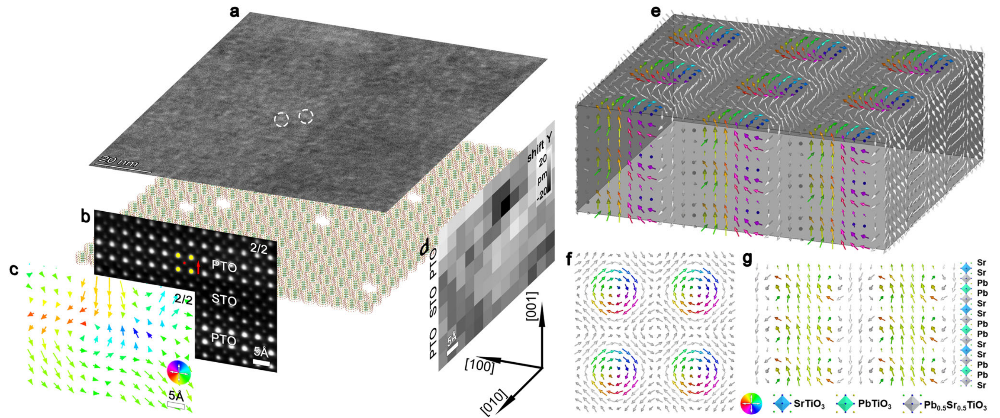
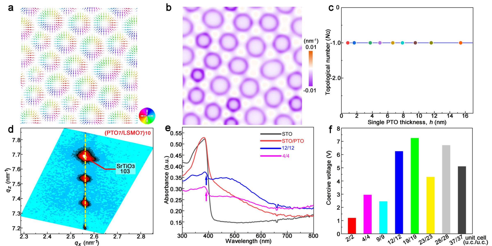

## gongAbsenceCriticalThickness2023 — 违反 Kittel 定律的极性斯格明子临界厚度缺失

## 📄 元数据
Feng-Hui Gong, Yun-Long Tang, Yu-Jia Wang, Yu-Ting Chen, Bo Wu, Li-Xin Yang, Yin-Lian Zhu, Xiu-Liang Ma et al.，2023，*Nature Communications* 14, 3376，DOI [10.1038/s41467-023-39169-y](https://doi.org/10.1038/s41467-023-39169-y)

## 💡 一句话
在 (PbTiO₃)ₙ/(SrTiO₃)ₙ 超晶格中首次实验证实极性斯格明子的周期-厚度关系在 h<4 nm 时违反经典 Kittel 定律（d∝√h），改用双曲函数 d=Ah+B/h+C 描述，且斯格明子可在仅 2 个晶胞（约 0.8 nm）厚的 PTO 层中稳定存在，即"临界厚度缺失"。

## 🔗 Wiki 双链
  - 概念 [[../concepts/topological-defects|拓扑缺陷]]
  - 概念 [[../concepts/density-functional-theory|密度泛函理论]]
  - 概念 [[../concepts/polarization-switching|极化翻转]]
  - 概念 [[../concepts/strain-engineering|应变工程]]
  - 概念 [[../concepts/kittels-law|Kittel 定律]]
  - 概念 [[../concepts/polar-skyrmion|极性斯格明子]]
  - 概念 [[../concepts/depolarization-field|去极化场]]
  - 概念 [[../concepts/critical-thickness-ferroelectric|铁电临界厚度]]
  - 概念 [[../concepts/phase-field-simulation|相场模拟]]
  - 概念 [[../concepts/hyperbolic-scaling|双曲标度]]
  - 概念 [[../concepts/topological-charge|拓扑数]]
  - 概念 [[../concepts/polar-vortex|极性涡旋]]
  - 概念 [[../concepts/LSMO|LSMO]]
  - 实体 [[../entities/VASP|VASP]]
  - 实体 [[../entities/PbTiO3|PbTiO3 (PTO)]]
  - 实体 [[../entities/SrTiO3|SrTiO3 (STO)]]
  - 图表 [[../figures/crystal-structures]]
  - 图表 [[../figures/heterostructures-stacking]]
  - 图表 [[../figures/domain-walls]]
  - 图表 [[../figures/experimental-setups]]
  - 图表 [[../figures/optical-spectra]]
  - 图表 [[../figures/heterostructures-stacking-domains-devices|铁弹畴、畴壁、In₂Se₃ 与器件应用]]
  - 年度 [[../write/2023]]
  - 主题 [[../topics/Z01-材料模拟计算设计]]
  - 相关论文 **gongAbsenceCriticalThickness2023**

## 📊 关键图表
  - 
  - 
  -  → [[../figures/heterostructures-stacking-domains-devices|铁弹畴、畴壁、In₂Se₃ 与器件应用]]
  - （raw/figures 中另有 eq_1~eq_9 共 9 张公式图片，对应周期公式 d=1/Δq_x、双曲拟合、TDGL 方程、自由能泛函、拓扑数、PFM 矫顽电压等；原图3 的图片文件未附）

## 🔬 项目连接
  - **project-5 SnTe 铁电模拟（强相关）**：本文是铁电超薄膜尺寸效应的方法学与物理图像范本。(1) 去极化场在膜厚减小时由界面集中变为贯穿全膜，是 Kittel 定律失效和临界厚度行为的核心，对 SnTe 超薄/低维铁电稳定性 analysis 直接可借鉴；(2) DFT 流程（VASP、PBEsol、PAW、500 eV 截断、力收敛 10 meV/Å、用 Born 有效电荷张量计算逐胞极化矢量）可直接对照 SnTe 极化计算；(3) 相场模型用体/梯度/弹性/静电四项自由能 + 失配应变（PTO -1.3%、STO 0%）+ 短路电边界条件扫描厚度，给出能量密度-周期曲线定最优周期，是研究 SnTe 畴周期/拓扑结构可复用的计算框架；(4) d=Ah+B/h+C 双曲标度替代 √h，提示在低维铁电体中标度律需重新检验。
  - **project-2 Mn 多铁（中等相关）**：极性斯格明子/涡旋等拓扑极性结构的表征与拓扑数计算、静电边界条件（绝缘 STO vs 导电 LSMO）对拓扑态成核的决定性作用、以及"DFT 原子弛豫 + 相场能量分解 + 原位温度演化"的工作流，可为 Mn 基多铁中畴/拓扑缺陷与磁电耦合的研究提供可类比的物理图像和分析手段。
  - **project-1 双光子 / project-3 机械发光 NN / project-4 TTF 分子计算 / project-6 湿度传感器 / project-7 CDW**：无直接项目连接（project-4 虽用 DFT，但体系为分子晶体，本文钙钛矿超晶格的去极化场/临界厚度/相场方法不具直接参考价值；project-7 的周期调制与斯格明子晶格仅有形式上的相似，机制不同）。

## 📝 组织与用词
  - 论证沿"现象发现 → 规律提取 → 机制解释 → 极限验证 → 拓扑与功能"五步推进：先用 DF-TEM/SAED/RSM 对 n=37→2 的厚度系列给出周期统计，观察到 h<4 nm 偏离 Kittel 定律；再用双曲函数拟合实验与两条相场曲线；随后通过能量分项单调性变化和去极化场剖面解释失效根源；再以 HAADF-STEM 实空间极化图 + 10×10×4 超胞 DFT 证实 2 u.c. 极限下斯格明子存在；最后给出拓扑数、边界条件敏感性、光学吸收和 PFM 矫顽电压。
  - 值得复用的术语：Kittel's law 基特尔定律；polar skyrmion 极性斯格明子；critical thickness 临界厚度；depolarization field 去极化场；phase-field simulation 相场模拟；topological number (NQ) 拓扑数；hyperbolic scaling 双曲标度；Born effective charge 玻恩有效电荷；reciprocal space map (RSM) 倒易空间图；coercive voltage 矫顽电压。

## ✏️ 可写入 Wiki 的要点
  1. (PTOₙ/STOₙ)₁₀ 超晶格中，n=37, 28, 23, 19, 12, 9, 4, 2 u.c. 对应的斯格明子面内周期分别为 13.8, 11.1, 10.0, 9.5, 6.8, 6.7, 5.2, 6.8 nm；n=19–37 遵循 Kittel 定律，n=2–12 周期趋于约 5–6 nm 常数甚至反增（n=2 时 6.8 nm > n=4 时 5.2 nm）。
  2. 实验周期-厚度关系拟合为 d = 0.68h + 2.17/h + 3.24（h 单位 nm）；两种相场方法分别给出 d = 0.72h + 3.73/h + 4.48（统计法，d=√(S/N)），以及 d = 1.32h + 4.10/h + 2.48（能量最低法），均复现"先减后增"。
  3. Kittel 定律在该体系的下限为 h≈4 nm：h≥4 nm 时体、静电、梯度、弹性能量密度在最优周期附近均单调；h<4 nm 时体自由能出现极小值、梯度能出现极大值，单调性破坏，√h 推导前提失效。
  4. 机制：20 nm 厚膜中去极化场集中于 PTO/STO 界面附近、膜中几乎为零；随膜厚减薄，去极化场在 PTO 层中部逐渐增大并贯穿全膜，成为主导能量项；以导电 LSMO 替换绝缘 STO 后斯格明子卫星峰消失（涡旋不受影响），证明静电边界条件/电荷屏蔽的决定性作用。
  5. 极性斯格明子可在 PTO 层仅 2 u.c.（约 0.8 nm）的 (PTO₂/STO₂)₁₀ 超晶格和 (PTO₂/STO₂)₁ 双层膜中稳定存在，薄于单层 PTO 薄膜维持铁电性的约 3 u.c. 临界厚度，故称"临界厚度缺失"。
  6. 极限厚度的实验证据：HAADF-STEM 原子像 + 位移矢量图显示闭合环状极化，面外离子位移约 0–20 pm；DFT（VASP, PBEsol, PAW, 500 eV, Γ 点, 力<10 meV/Å）对 10×10×4 u.c.（2000 原子）模型弛豫后得到圆形斯格明子，PTO 层中 Bloch 组分增强、界面 Néel 组分减弱。
  7. 拓扑数 N_Q=(1/4π)∫∫u·(∂_x u×∂_y u)dxdy 在所有模拟厚度下恒为 -1（中心极化沿 -z），拓扑密度集中于斯格明子外围；该值不随厚度变化。
  8. 功能特性：随 PTO 层减薄矫顽电压单调下降，(PTO₂/STO₂)₁₀ 约 1.2 V（U=(|U⁺|+|U⁻|)/2），PFM 蝴蝶形振幅回线和 180° 相位反转证明可翻转铁电性；含斯格明子超晶格在可见光区吸收强于纯 PTO/STO，吸收边下降区间减小。
  9. 温度演化：原位 TEM 加热 (PTO₁₂/STO₁₂)₁₀ 的斯格明子-顺电相变温度（居里温度）约 623 K，473–573 K 间逐层消失，体现同层内集体协同行为；相场预测 4 nm PTO 的 Tc 约 710 K（437 °C），越薄 Tc 越低。
  10. 相场模型细节：基底面积 40×40 nm²，单层 PTO 夹于两层等厚 STO 中模拟超晶格，单层厚度 1.6–14 nm；PTO/STO 失配应变分别取 -1.3%/0.0%（零应变晶格常数 3.957 Å/3.905 Å），顶面自由、底面固定于衬底应变，顶/底面加短路电边界条件；能量-周期曲线用三次多项式拟合取极小值定最优周期。
