## guanRecentProgressTwoDimensional2020 — 二维铁电材料的研究进展

- **元数据**：Zhao Guan, He Hu, Xinwei Shen, Pinghua Xiang, Ni Zhong, Junhao Chu, Chungang Duan（华东师范大学极化材料与器件教育部重点实验室），2020，*Advanced Electronic Materials* 6(1): 1900818，DOI [10.1002/aelm.201900818](https://doi.org/10.1002/aelm.201900818)。
- **一句话**：这是一篇系统综述，将二维铁电材料从理论预测、实验证实、表征方法、内在机制（层内键合 vs 层间平移）到器件应用做了完整梳理，并把已被实验证实的二维铁电体锁定为 CuInP₂S₆、α-In₂Se₃、SnTe、WTe₂、d1T-MoTe₂、BA₂PbCl₄ 等六种少数体系。

- **现有wiki双链**：
  - 概念 [[../concepts/2D-materials]]、[[../concepts/polarization-switching]]、[[../concepts/multiferroicity]]、[[../concepts/magnetoelectric-coupling]]、[[../concepts/berry-phase]]、[[../concepts/spin-orbit-coupling]]、[[../concepts/sliding-ferroelectricity]]、[[../concepts/strain-engineering]]、[[../concepts/ferroelasticity]]、[[../concepts/ferroelectric-tunnel-junction]]、[[../concepts/charge-density-wave]]、[[../concepts/topological-defects]]、[[../concepts/moire-superlattice]]
  - 实体 [[../entities/In2Se3]]、[[../entities/WTe2]]、[[../entities/SnTe]]、[[../entities/h-BN]]、[[../entities/TMDs]]、[[../entities/BiFeO3]]、[[../entities/VASP]]、[[../entities/domain-wall]]
  - 图表 [[../figures/crystal-structures]]、[[../figures/electronic-bands]]、[[../figures/domain-walls]]、[[../figures/heterostructures-stacking]]、[[../figures/electronic-devices]]、[[../figures/optical-spectra]]、[[../figures/vibrational-spectra]]、[[../figures/experimental-setups]]
  - 年度 [[../write/2020]]
  - 项目 [[../projects/project-2-mn-multiferroics]]、[[../projects/project-4-ttf-molecular-calc]]、[[../projects/project-5-snte-ferroelectric-sim]]、[[../projects/project-7-cdw-charge-density-wave]]
  - 相关论文 [[../../raw/note/guanRecentProgressTwoDimensional2020]]

- **新概念/实体建议**：
  - `dipole-locking`（偶极锁定）：α-In₂Se₃ 中面内与面外极化通过共价键断裂/重构相互锁定、其一翻转必带动另一旋转 90° 的机制，是二维铁电中独有的强耦合图像。
  - `electronic-polarization`（电子极化）：由不对称自旋交换相互作用或电子-空穴空间分离（而非离子位移）诱导的极化，是 WTe₂“铁电金属”和磷烯纳米带铁电性的解释。
  - `depolarization-field`（退极化场）：与自发极化反向、在超薄铁电体中显著增强并抑制极化的内部电场，是理解二维铁电为何能突破尺寸效应的核心概念。
  - `finite-size-effect`（有限尺寸效应）：传统铁电薄膜厚度低于临界值时自发极化消失、Tc 下降的现象。
  - `intralayer-bonding` / `interlayer-translation`（层内键合 / 层间平移）：本文提出的二维铁电机制一级分类框架，前者含结构畸变、偶极锁定、电子极化，后者以层间滑移改变电荷转移产生 OOP 极化。
  - `trimerization`（三聚化）：d1T-MoTe₂ 中三个 Mo/Te 原子抱团形成三聚体、打破反演对称的结构畸变，属 CDW-like 电子-声子耦合物理。
  - `ferroelectric-metal`（铁电金属/极性金属）：Anderson-Blount 1965 年提出、由 WTe₂（2018）和 LiOsO₃（2013）实验证实的金属中共存可翻转极性结构的物态。
  - `improper-ferroelectricity`（不正铁电性）：d1T-MoS₂ 中由费米面简并与强电子-声子耦合（类 CDW 机制）间接诱导的铁电性，极化是结构相变的副产物。
  - `flexoelectricity`（挠曲电性）：由应变梯度诱导极化，可不要求非中心对称，为从中心对称二维材料制造铁电性提供路径。
  - `ferrovalley`（铁谷）：自发谷极化与铁电/铁磁有序耦合的新铁性家族成员。
  - 实体 `CuInP2S6`：过渡金属硫代磷酸盐（TMTP, ABP₂X₆）代表，Cu⁺ 在八面体空洞中偏心位移产生 OOP 铁电，4 nm 仍室温铁电（Tc≈320 K）。
  - 实体 `MoTe2`：TMD 家族成员，d1T 相因 Mo 三聚化呈现室温面内铁电（Yuan et al. Nat. Commun. 2019），Te 原子向 Mo 面位移约 0.6 Å、Te-Te 距 3.4 Å。
  - 实体 `BA2PbCl4`：Ruddlesden-Popper 家族有机-无机杂化钙钛矿，有机阳离子偏心与 Pb²⁺ 位移协同产生 IP 铁电，可柔性应用。
  - 实体 `PZT` / `BTO`：经典钙钛矿铁电 Pb(Zr,Ti)O₃ 与 BaTiO₃，作为二维/三维铁电器件参照体系出现（graphene/BTO FTJ、MoS₂/PZT FeFET）。

- **关键图表**（共 18 幅图 + 2 个表格，全部来自 manifest）：

  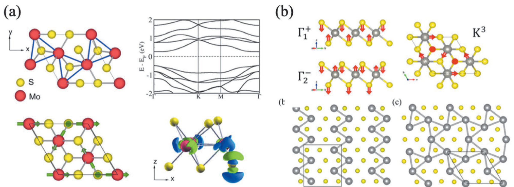

  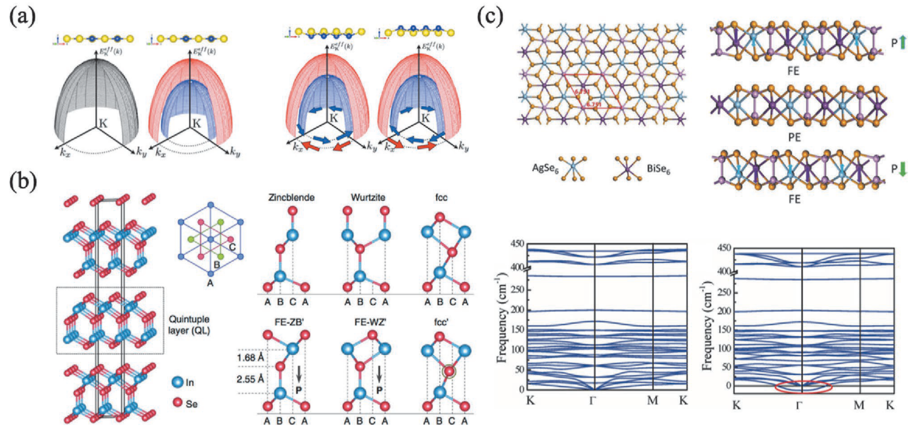

  

  

  

  

  

  

  

  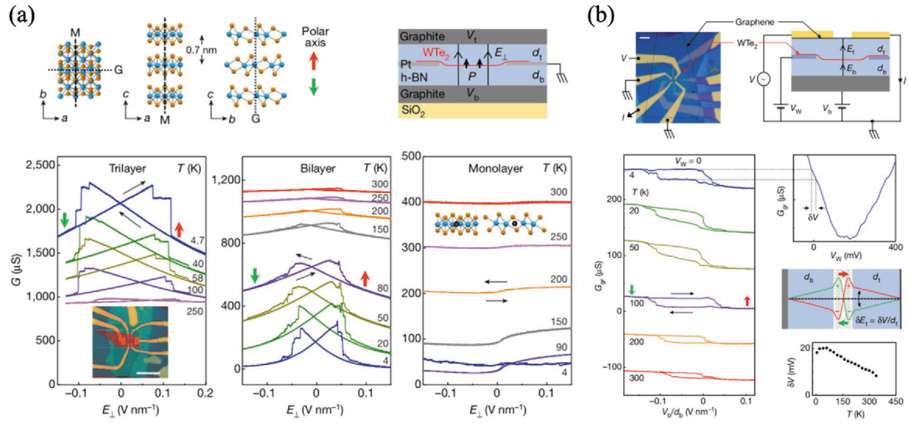

  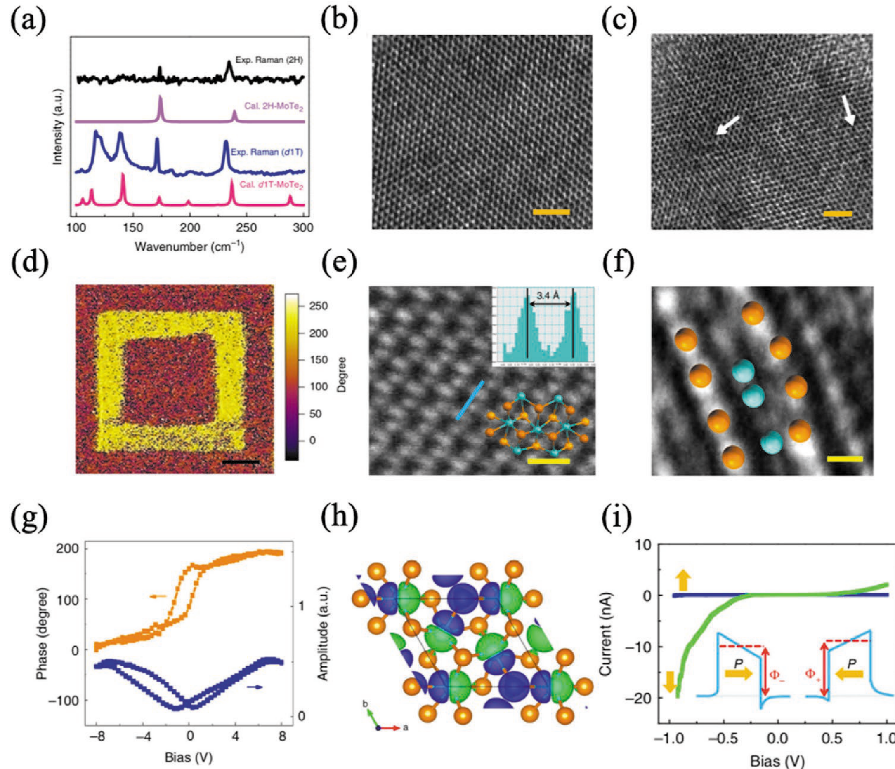

  

  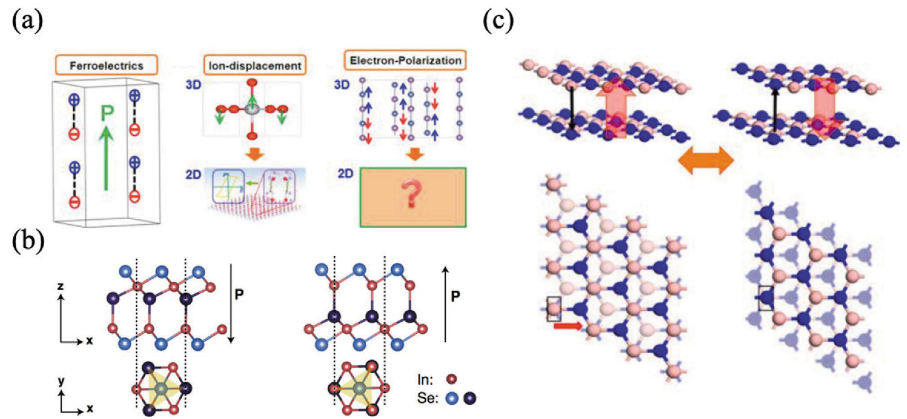

  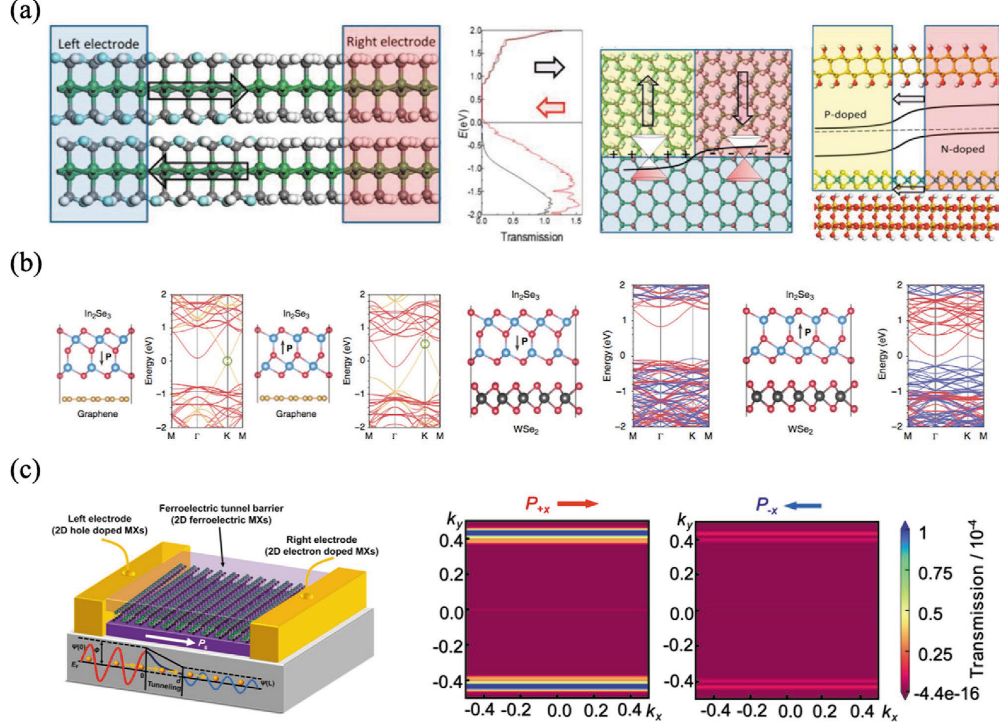

  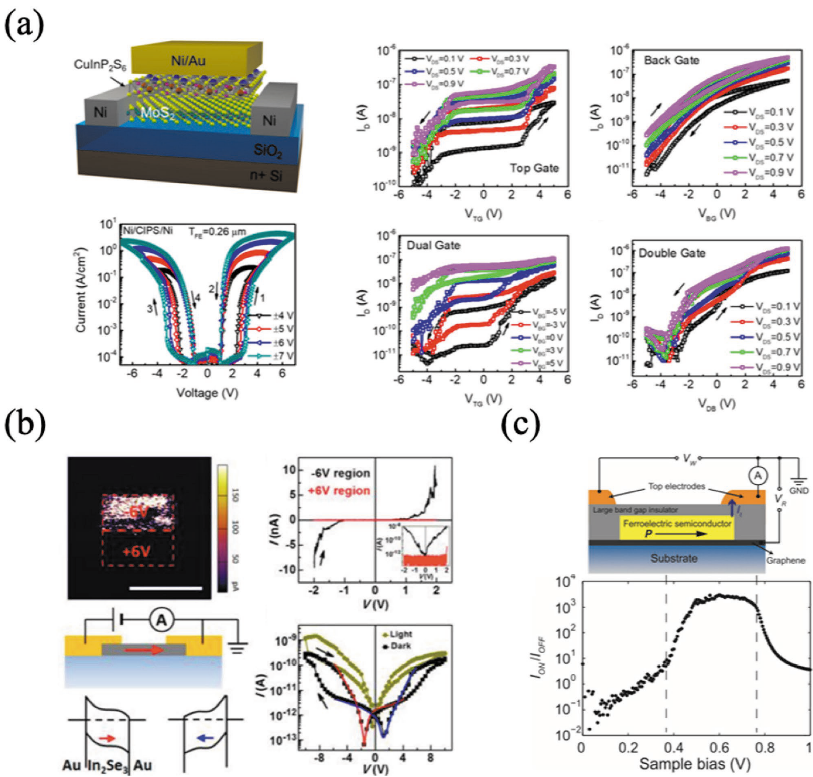

  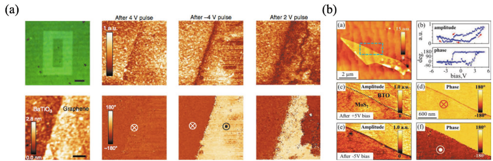

  

  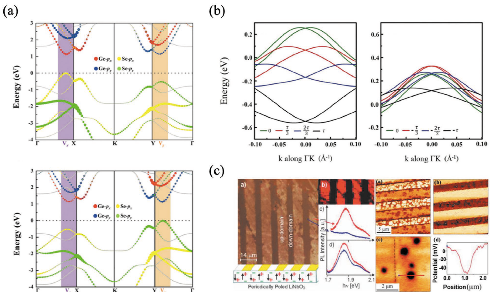

  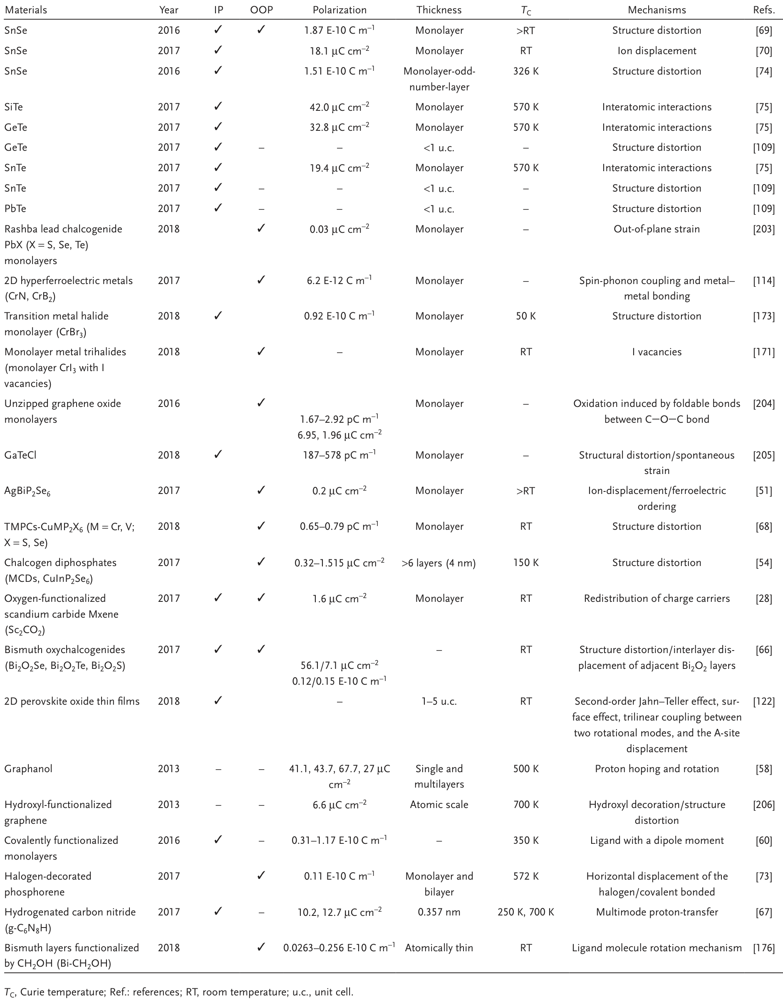

  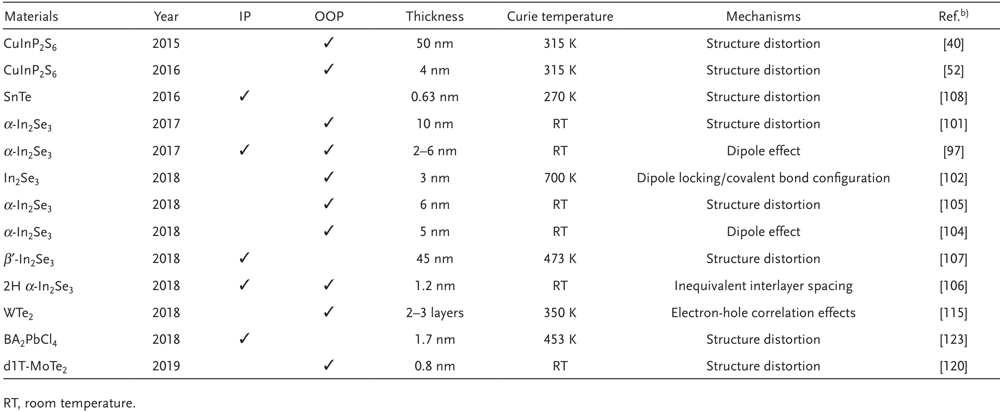

- **项目连接**：
  - **project-5 SnTe铁电模拟 — core**：SnTe 是本文六大已证实二维铁电体之一（§2.2.3），详述了 Chang et al. *Science* 2016 的关键结果：1 u.c.（0.63 nm）SnTe 在液氦温度下的稳定 IP 自发极化，源于从正方形到平行四边形的轻微晶格畸变（沿 [110] 对角线伸长），相邻畴的伸长对角线互相垂直；STM 条纹畴、跨畴边界傅里叶变换双峰、STS 能带弯曲构成完整证据链；2–4 u.c. SnTe 在室温下仍具鲁棒铁电性；基于此设计的 FeRAM 原型器件 ON/OFF 比高达 3000。综述还把 IV 族碲化物（XTe, X=Si, Ge, Sn）作为整体讨论，指出其相对 IV 族硫族化物的优势是不受奇偶层数限制，并引用了更多 group-IV tellurides 铁电相的理论预测（文献 75, 109）。这对 project-5 的 SnTe 第一性原理模拟直接提供了实验锚点（畸变方向、极化沿 [110]、1 u.c. 仍稳定）、可比材料族（GeTe、SiTe、GeSe、SnS）、以及标准计算流程（DFT+Berry phase 算极化、NEB 算翻转势垒、HSE 算带隙）。
  - **project-2 Mn多铁 — medium**：本文专设 §2.1.2“2D Multiferroic Materials”，系统讨论了铁电-铁磁耦合的几种机制——孤对电子机制、自旋驱动机制、电荷有序机制；以卤素插层双层 graphene/silicene/germanene/MoS₂ 为例，说明 OOP 铁电与铁磁通过卤素吸附原子层间跳跃耦合，可实现“电写入-磁读取”；还讨论了共价键重构（偶极锁定）作为铁电-铁磁耦合的新通道（Yang et al. JACS 2017, CrBr₃ 带电纳米结构中的电荷+轨道有序多铁性），以及铁谷材料（ferrovalley）。对 Mn 基多铁项目而言，这些机制讨论与电写磁读范式提供了清晰的物理类比与机理词汇，但综述本身并未涉及 Mn 氧化物体系，故评 medium。
  - **project-7 CDW — medium**：d1T-MoS₂ 的铁电性被明确归因于“费米面简并 + 强电子-声子耦合 + 带隙打开”（§2.1.1，引 Shirodkar & Waghmare PRL 2014），这正是 CDW 物理的标准语言；d1T-MoTe₂ 的三聚化（trimerization）畸变、Te 原子垂直位移 0.6 Å、Te-Te 距 3.4 Å，也是典型的周期性晶格畸变/电子-声子耦合图像。综述把电子-声子耦合驱动的“不正铁电性”（improper ferroelectricity）与离子位移型正经铁电性区分开，为 CDW-铁电耦合/共存提供了可迁移的物理图像。WTe₂ 作为电子-空穴关联诱导极化的半金属、以及电荷有序作为多铁机制之一（CrBr₃ 纳米结构），也与 CDW 邻近。但本文不以 CDW 为主题，故评 medium。
  - **project-4 TTF分子计算 — weak**：§3.1 详细给出了二维铁电第一性原理计算的标准 recipe（VASP、PAW 赝势、PBE-GGA/LDA、HSE06 算带隙、Monkhorst-Pack k 网格、约 20 Å 真空层、NEB 算翻转势垒、Berry phase 算极化、DFT+U 处理强关联、Lennard-Jones 处理范德华作用），这是一套可直接复用于 TTF 分子晶体极化/相变计算的方法学模板；§4 还讨论了有机二维铁电体中的多模式质子转移和分子旋转机制（参考文献 67, 176），与分子晶体物理相关。但未涉及 TTF 本身，故评 weak。
  - **project-1 双光子**：无直接项目连接（SHG 是二阶非线性光学过程，但与双光子荧光是完全不同的物理过程，不构成项目参考价值）。
  - **project-3 机械发光NN**：无直接项目连接。
  - **project-6 湿度传感器**：无直接项目连接。

- **组织与用词**：
  文章采用“总—分—总”经典综述结构：引言（尺寸效应痛点）→ 第 2 节材料（先理论预测池再实验证实，凸显“理论多、实验少”的反差）→ 第 3 节方法（计算 recipe + STM/PFM/SHG/TEM 四种实验探针）→ 第 4 节机制（层内键合 vs 层间平移一级分类）→ 第 5 节应用与挑战（FeFET/FTJ/2D-3D 集成/铁电诱导新物理）→ 第 6 节展望。论证主线是“破缺反演对称是二维铁电的必要条件，PFM 是必要但不充分证据，多技术联用才是黄金标准”。

  可在 wiki 叙述中复用的中英术语：
  - *finite-size effect* / *depolarization field* — 有限尺寸效应 / 退极化场
  - *in-plane (IP) / out-of-plane (OOP) polarization* — 面内 / 面外极化
  - *intralayer bonding vs interlayer translation* — 层内键合 / 层间平移
  - *dipole locking (covalent bond reconstruction)* — 偶极锁定（共价键重构）
  - *electronic polarization (spin-exchange / electron-hole correlation)* — 电子极化（自旋交换/电子-空穴关联）
  - *trimerization / zigzag chain* — 三聚化 / 锯齿链
  - *ferroelectric metal (Anderson-Blount)* — 铁电金属/极性金属
  - *piezoresponse force microscopy (PFM) butterfly loop / phase hysteresis* — PFM 蝴蝶曲线 / 相位迟滞
  - *second harmonic generation (SHG)* — 二次谐波（反演对称破缺探针）
  - *tunneling electroresistance (TER)* — 隧道电致电阻

- **可写入wiki的要点**：
  1. **二维铁电突破尺寸效应的物理根源**：传统钙钛矿铁电薄膜厚度低于几到几十纳米时，因长程库仑耦合减弱、退极化场增强、表面重构等失去极化；二维范德华材料层内强共价键、层间弱范德华力、表面无悬挂键，使铁电性可在 1 u.c.（SnTe 0.63 nm、In₂Se₃ 1.2 nm、CuInP₂S₆ 4 nm）下稳定。
  2. **SnTe 的铁电畸变定量化**：1 u.c. SnTe 由正方形畸变为平行四边形，伸长对角线沿 [110] 及其等价方向；相邻畴的对角线相互垂直；极化是面内的；STS 上的能带弯曲方向直接读取极化指向；2–4 u.c. 室温仍稳定；FeRAM 器件 ON/OFF ≈ 3000。
  3. **α-In₂Se₃ 的偶极锁定**：单层 In₂Se₃ 由 Se-In-Se-In-Se 五原子层构成；中心 Se 层与上下两个 In 层间距不等，同时产生 IP 和 OOP 极化；垂直电场翻转 OOP 极化时，中心 Se 原子横向移动、In-Se 共价键断裂并重建，带动 IP 极化旋转 90°；薄至 3 nm（Xiao PRL 2018）乃至 1.2 nm（Xue AFEM 2018）仍具室温铁电；SHG 与 PFM 联用证实极化锁定；但 In₂Se₃ 的机制在文献中仍存争议（Ding 的极性位移图像 vs Xiao/Cui 的偶极锁定图像）。
  4. **CuInP₂S₆ 是离子位移型铁电**：ABP₂X₆ 型 TMTP 家族，Cu⁺ 在硫八面体空洞中两偏心位置间有序化；反平行偶极排列大幅降低内部退极化场，使其在超薄厚度下稳定；Tc≈315–320 K（室温附近）；4 nm 厚仍可被 PFM 翻转；但 Cu 离子迁移也会产生形貌变化和电化学假信号，是 PFM 判读的警示案例。
  5. **WTe₂ 是首个实验证实的二维铁电金属**：双层/三层 1T′-WTe₂ 在 350 K 以下呈现电导双稳态，对应两种 OOP 极化；机制被归因于电子-空穴关联而非离子位移（4 K 单层电导对垂直电场几乎无响应；极化在超过自发极化电势与电子-空穴密度补偿点时翻转）；这挑战了“铁电必为绝缘体”的传统认知，上承 Anderson-Blount 1965 年的极性金属设想与 LiOsO₃（2013, 140 K Li 离子沿 [111] 位移）。
  6. **d1T-MoTe₂ 的三聚化机制**：单层 d1T-MoTe₂ 室温下因 Mo 三聚化（Te 原子向 Mo 面位移约 0.6 Å，Te-Te 距 3.4 Å）打破反演对称而具 IP 铁电；2H 相无 PFM 信号作对照；HRTEM+SHG+PFM 三技术联用确认；是“不正铁电性”的 TMD 代表。
  7. **机制一级分类框架**：二维铁电机制可按三种方式分类——(i) 按偶极形成位置分为层内键合（结构畸变/离子位移、偶极锁定/共价键重构、电子极化/自旋交换）与层间相互作用（层间平移、BN 类滑移铁电、莫尔超晶格）；(ii) 按载流子分为离子位移与电子极化；(iii) 按键合构型分为离子位移型与共价键型；反演对称破缺是统一必要条件。
  8. **标准第一性原理计算 recipe**：VASP + PAW + PBE-GGA（或 LDA），带隙用 HSE06；k 点 Monkhorst-Pack；z 方向真空层约 20 Å 消除层间相互作用；NEB 算铁电/铁弹相变翻转势垒；Berry phase（King-Smith & Vanderbilt）算自发极化；强关联体系用 DFT+U；范德华作用用 Lennard-Jones 势。
  9. **PFM 是必要但不充分证据**：PFM 检测电致机械应变，任何引起形变的现象（静电吸引、离子迁移/电化学膨胀、电荷注入、环境影响）都可能产生类铁电相位对比度和蝴蝶曲线；在 CuInP₂S₆ 等离子导体上尤需警惕；必须联合 SHG（验证反演对称破缺）、STEM（直接观察原子位移）、变温/变频对照、非铁电相对照（如 β-In₂Se₃、2H-MoTe₂ 无信号）形成完整证据链。
  10. **器件与新物理**：已演示的原型包括 SnTe FeRAM（ON/OFF≈3000）、MoS₂/CuInP₂S₆ FeFET（>4 个数量级开关比）、In₂Se₃ 平面二极管、In:SnSe/SnSe/Sb:SnSe 同质结 2D-FTJ（TER≈1460%）、1 u.c. BTO FTJ（TER 370%）、2 u.c. BTO FTJ（TER 2700%）、MoS₂-PZT 光电 FeFET、MoSe₂ FeFET；铁电还能诱导谷极化（GeSe）、Rashba 自旋纹理翻转（GeTe/InP 超晶格）、控制 MoS₂ 在 LiNbO₃ 衬底上的择优生长。BA₂PbCl₄ 等 Ruddlesden-Popper 杂化钙钛矿和 BiFeO₃ 1 u.c. 超薄膜说明传统钙钛矿也能逼近二维极限。
