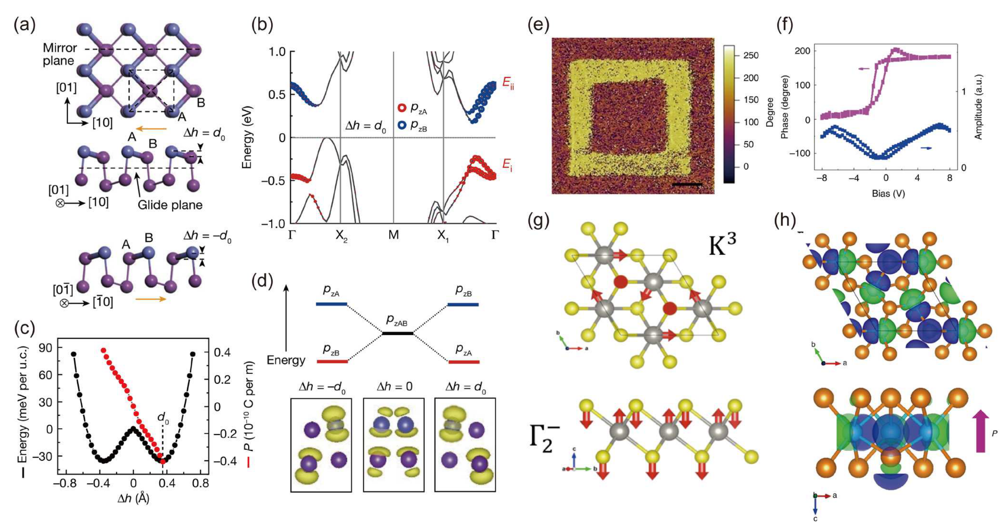
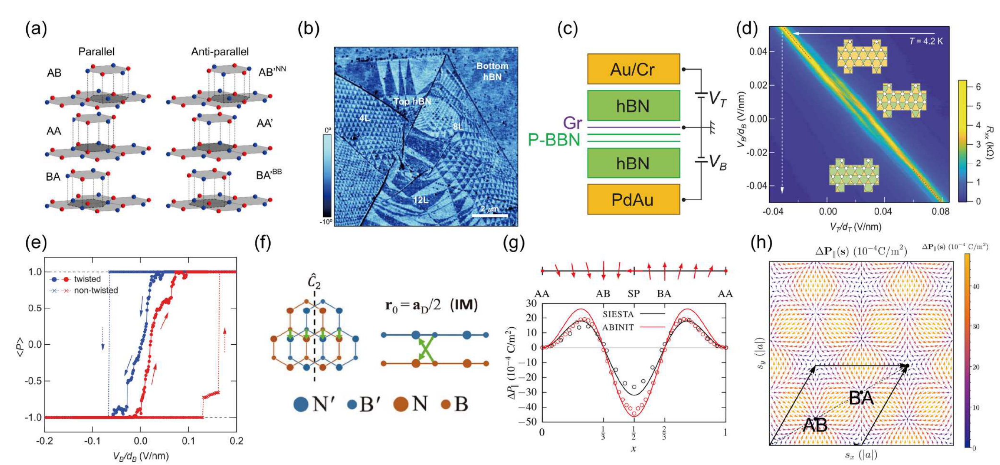

## guoAdvancesTwodimensionalFerroelectric2025 — 二维铁电材料的研究进展

## 📄 元数据
Zi-Han Guo（郭子涵）、Lin He（何林，通讯作者，北京师范大学物理与天文学院高等量子研究中心/多尺度自旋物理教育部重点实验室），2025，《Chinese Science Bulletin》（科学通报），Vol. 70, No. 22, pp. 3704–3721，DOI: 10.1360/TB-2025-0214。国家杰出青年科学基金(12425405)与国家自然科学基金(12141401)资助。评述/综述文章（Review）。
## 💡 一句话
系统综述二维铁电材料两大路径——基于离子位移的自发极化铁电体与基于范德华层间滑移/电荷重分布的滑移铁电体，重点确立"滑移铁电"新范式并总结其在非易失存储、光电异异质结、自发光伏及铁电拓扑绝缘体中的应用进展。
## 🔗 Wiki 双链
本文涉及且 wiki 中已存在的条目，用双链列出（存在才链）：
  - 概念 [[../concepts/2D-materials]]、[[../concepts/sliding-ferroelectricity]]、[[../concepts/polarization-switching]]、[[../concepts/berry-phase]]、[[../concepts/density-functional-theory]]、[[../concepts/moire-superlattice]]、[[../concepts/strain-engineering]]、[[../concepts/topological-defects]]、[[../concepts/multiferroicity]]、[[../concepts/ferroelectric-tunnel-junction]]、[[../concepts/spin-orbit-coupling]]、[[../concepts/depolarization-field|退极化场]]、[[../concepts/domain-engineering|畴工程]]、[[../concepts/ferroelectric-topological-insulator|铁电拓扑绝缘体 (FETI)]]、[[../concepts/fractional-quantum-ferroelectricity|分数量子铁电性]]、[[../concepts/bulk-photovoltaic-effect|体光伏效应 (BPVE)]]、[[../concepts/dipole-locking|偶极锁定]]
  - 实体 [[../entities/h-BN]]、[[../entities/TMDs]]、[[../entities/In2Se3]]、[[../entities/WTe2]]、[[../entities/SnTe]]、[[../entities/BiFeO3]]、[[../entities/domain-wall]]、[[../entities/CuInP2S6|CuInP₂S₆ (CIPS)]]、[[../entities/bp-bi-bismuth|BP-Bi（类黑磷铋）]]、[[../entities/d1t-mote2|d1T-MoTe₂]]、[[../entities/3r-tmds|3R 相 TMDs]]、[[../entities/rbn-rhombohedral-bn|rBN（菱方BN）]]、[[../entities/mn-bi2-te4-mbt|MnBi₂Te₄ (MBT)]]
  - 图表 [[../figures/crystal-structures]]、[[../figures/electronic-bands]]、[[../figures/electronic-devices]]、[[../figures/optical-spectra]]、[[../figures/vibrational-spectra]]、[[../figures/heterostructures-stacking]]、[[../figures/mathematical-models]]、[[../figures/domain-walls]]、[[../figures/experimental-setups]]、[[../figures/heterostructures-stacking-domains-devices|铁弹畴、畴壁、In₂Se₃ 与器件应用]]
  - 年度 [[../write/2025]]
  - 主题 [[../topics/D02-多铁性材料]]、[[../topics/Z01-材料模拟计算设计]]
  - 相关论文 [[../../raw/note/guoAdvancesTwodimensionalFerroelectric2025]]
## 📊 关键图表
  -  -> [[../figures/electronic-devices|电子与突触器件]]
  -  → [[../figures/crystal-structures|晶体结构与原子排布]]
  -  -> [[../figures/crystal-structures|晶体结构与原子排布]]
  -  -> [[../figures/vibrational-spectra|振动能谱与声子谱]]
  -  -> [[../figures/crystal-structures|晶体结构与原子排布]]
  -  → [[../figures/heterostructures-stacking-domains-devices|铁弹畴、畴壁、In₂Se₃ 与器件应用]]
  -  -> [[../figures/mathematical-models|数学模型与物理公式]]
  -  -> [[../figures/optical-spectra|光学与吸收光谱]]
  -  -> [[../figures/mathematical-models|数学模型与物理公式]]
  -  -> [[../figures/mathematical-models|数学模型与物理公式]]
## 🔬 项目连接
  - project-5 SnTe铁电模拟：直接相关。本文在 §1.3 BP-Bi 部分明确引用 Chang 等人 2016 年 Science 工作（参考文献 51–53），指出 SnTe 作为与 BP-Bi 结构类似的第 IV–VI 主族化合物，具有面内铁电性（原子级厚度 SnTe 中 robust in-plane ferroelectricity），是滑移/本征二维铁电图景的重要参照体系。
  - project-2 Mn多铁：弱相关。§3.6 讨论 MnBi₂Te₄ 作为铁电-反铁磁-拓扑三重耦合体系，涉及铁电极化对磁序和 QAHE 的非易失调控，但 Mn 本身并非本文核心材料。
  - 其余项目（project-1 双光子、project-3 机械发光 NN、project-4 TTF 分子计算、project-6 湿度传感器、project-7 CDW）无直接项目连接。
## 🔗 项目双链
- 项目 [[../projects/project-1-two-photon|项目一：双光固化和双光发光]]
- 项目 [[../projects/project-2-mn-multiferroics|项目二：Mn极化结构铁电材料]]
- 项目 [[../projects/project-3-mechanoluminescence-nn|项目三：应力发光神经网络]]
- 项目 [[../projects/project-4-ttf-molecular-calc|项目四：lsl老师的ttf分子计算]]
- 项目 [[../projects/project-5-snte-ferroelectric-sim|项目五：lammps势函数SnTe铁电模拟]]
- 项目 [[../projects/project-6-humidity-sensor|项目六：小花闻的电压湿度传感器]]
- 项目 [[../projects/project-7-cdw-charge-density-wave|项目七：CDW电荷密度波]]

## 📝 组织与用词
文章采用经典"总-分-总"综述结构，论证链条为：[传统铁电微型化困境：退极化场] → [路径一：本征自发极化铁电体（CIPS/In₂Se₃/BP-Bi/d1T-MoTe₂，离子位移机制）] → [路径二：vdW 滑移铁电（理论方法→hBN→TMDs→石墨烯，层间电荷重分布机制）] → [调控与应用（畴工程→非易失存储→光电异质结→自发光伏→规模化生长→FETI）] → [挑战与展望]。叙事上以"范式对比"贯穿全文：离子位移 vs. 层间滑移、本征极性 vs. 非极性母体、陡峭单畴回线 vs. 渐进多畴回线、实验室剥离 vs. 晶圆级外延。值得在 wiki 叙述中复用的关键词/术语：
  - 滑移铁电性 [[../concepts/sliding-ferroelectricity|滑移铁电性]] / Sliding ferroelectricity
  - 退极化场 [[../concepts/depolarization-field|退极化场]] / Depolarization field
  - 层间电荷重分布 / Interlayer charge redistribution
  - 偶极锁定 [[../concepts/dipole-locking|偶极锁定]] / Dipole locking
  - 分数量子铁电性 [[../concepts/fractional-quantum-ferroelectricity|分数量子铁电性]] / Fractional quantum ferroelectricity
  - 莫尔铁电畴 / Moiré ferroelectric domains（AB/BA 三角畴）
  - 畴工程 [[../concepts/domain-engineering|畴工程]] / Domain engineering（孤立单畴壁/周期三角畴/交联/完全位错）
  - 铁电拓扑绝缘体 / Ferroelectric topological insulator (FETI)
## ✏️ 可写入 Wiki 的要点
  1. **滑移铁电范式的确立**：概念由 Li & Wu 于 2017 年提出（ACS Nano 11, 6382）。核心机制是在非极性 vdW 材料中通过层间滑移打破空间[[../concepts/inversion-symmetry|反演对称性]]，由界面电荷重分布产生垂直偶极阵列形成宏观面外极化；母体无须本征极性，[[../concepts/polarization-switching|极化翻转]]仅需层间滑移一个键长距离，能垒远低于离子位移机制。三大优势：母体可选范围覆盖导体/半导体/绝缘体；堆叠转角、层数、异质结等多自由度可调；干法转移/直接生长与硅基工艺兼容。
  2. **理论计算三件套**：(i) Berry phase 法计算宏观极化强度 P = (e/(2π)³) Σ_n^occ ∫_BZ dk A_n(k)（King-Smith & Vanderbilt 1993），用 Wilson 环或累积相位差量化电荷中心位移；(ii) NEB/CI-NEB 搜索极化翻转最小能量路径（MEP）和能垒；(iii) 差分[[../concepts/charge-density|电荷密度]] Δρ_interlayer(r) = ρ_total(r) − Σ_i ρ_isolated^i(r) 可视化[[../concepts/interlayer-charge-transfer|层间[[../concepts/charge-transfer|电荷转移]]]]方向与聚集区。
  3. **hBN 滑移铁电**：hBN 带隙~5.97 eV，本征 AA' 堆叠偶极反平行抵消总极化为零；滑移至 AB/BA 平行构型即产生面外铁电极化，而 AA、AA'、AB'、BA' 因对称性仍非极性。t-hBN（<1° 转角）因晶格弛豫自发形成 AB/BA 纳米[[../concepts/ferroelectric-domain|铁电畴]]，EFM/KPFM 测得 AB/BA 畴间电势差约 200 mV，与理论预测相符。p-hBN 呈陡峭矩形电滞回线（高[[../concepts/coercive-field|矫顽场]]，适合非易失存储），t-hBN 呈渐进式双峰回线（畴壁迁移主导，低驱动场连续调谐，适合低功耗可编程器件）。AB/BA 畴过渡区（SP）还存在周期性面内偶极子，第一性原理预测并被实验证实，可形成 meron/antimeron 等[[../concepts/topological-polarization|拓扑极化]]网络。
  4. **WTe₂ 滑移铁电**：Td-WTe₂ 是首个实验证实的滑移铁电体（Fei et al., Nature 2018, 560, 336）。双层/三层出现显著电滞回线（相变温度~350 K），单层无回线，直接证明[[../concepts/ferroelectricity|铁电性]]来自[[../concepts/interfacial-charge-rearrangement|层间电荷重排]]而非本征极化。Hirshfeld 电荷分析量化层间 4 个近邻 Te 原子电荷转移：双层面外极化反转对应沿 b 轴 0.72 Å（能垒 0.6 meV/cell，Li 2018）或 0.493 Å（0.3 meV/cell，Ren 2019）的层间滑移。奇数层需中间偶数层滑移导致极化减弱；块体因电子屏蔽抑制铁电性。Xiao 等通过 SHG 蝴蝶型滞后曲线和拉曼剪切模消失证实极化反转伴随 Td→1T′→Td 相变。但 Sharma 等 2019 年在块体 WTe₂ 观测到 20–50 nm 铁电畴，归因于 c 轴离子位移与价带[[../concepts/migdal-eliashberg-theory|各向异性]]协同（能垒 0.29 eV/f.u.，与 BiFeO₃ ~0.43 eV/f.u. 可比），提示块体可能存在不同机制。
  5. **2H/3R-TMDs 滑移铁电**：本征 2H 相为反平行 AA' 堆叠；同向 R 堆叠（AB/BA 菱方构型）诱导面外铁电。转角 H-TMDs 形成与 t-hBN 类似的周期性三角形极化畴。实验测得极化对[[../entitys/graphene|石墨烯]]的势场调制幅度 2ΔV_P ≈ 110 meV，约为 hBN 体系的一半（与原子电负性、层间距、对称破缺程度有关）。3R-MoS₂ 的极化态数与层数正相关：n 层对应 n 种能量简并态和 2n−1 种原子构型，相邻态切换能垒恒为 ~15.4 meV/cell（与层数无关），是多态/类脑存储的物理基础。
  6. **石墨烯非常规铁电及起源争议**：2020 年 Zheng 等在 BN 封装 Bernal [[../entities/bilayer-graphene|双层石墨烯]]（BLG）4 K 下发现非常规铁电性及 LSAS（层特异性异常屏蔽）现象；垂直电场诱导层间势差，莫尔势平带+[[../concepts/electron-correlation|电子关联]]驱动价带电子跃迁至导带，电荷转移量超过莫尔平带容量时极化态冻结引发 LSAS。2022 年 Lu 组测得层间电荷转移密度高达 10¹³ cm⁻²，对应极化~5 pC/m，远超单一莫尔带容量；100 K 内保持电滞，300 K 基本消失。2023 年 Klein 等在魔角双层石墨烯（<100 mK）观测到类铁电双稳态可与超导/关联绝缘态共存。2025 年两项关键工作动摇了"石墨烯本征铁电"的归因：Lu 组用 WSe₂ 屏蔽 BN/石墨烯莫尔势后石墨烯仍有铁电回滞；Liu 组发现上下层 BN 与单层石墨烯形成 ABC 堆垛时室温极化达~1.76 μC/cm²，可扩展至多层 Bernal 石墨烯——均提示铁电极化可能来自封装 BN 的非中心对称堆叠层而非石墨烯本身。
  7. **[[../concepts/domain-engineering|畴工程]]四类畴结构**（Gao et al., Nat Commun 2024, 15, 4449）：(i) 孤立单畴壁——外电场驱动畴壁整体移动触发全域反转，显著双极电滞回线，高性能非易失存储器理想架构；(ii) 周期三角莫尔畴——C3 对称性钉扎畴壁节点，极化切换仅通过畴面积弹性缩放实现，弱迟滞+线性多态响应，适合多阻态/模拟型器件；(iii) 多畴壁交联——生长缺陷/污染引入额外钉扎点，仅局部有限响应，极化反转效率极低；(iv) 完全位错畴——位错网络锁死极化方向，翻转需 >1 V/nm（远超常规实验条件），无电滞响应，可用于极化固定的永久存储。莫尔铁电体中非极性 AA 区被晶格钉扎，三角畴壁随偏压可逆扩张/收缩；局部应变积累区相邻畴壁可合并为完全螺旋错位结构。
  8. **器件性能指标**：3R-MoS₂ 器件抗疲劳机制源于硫空位迁移能垒（层内 2.6 eV，层间 4.6 eV）远高于极化切换能垒（~136 meV），单个硫空位无法钉扎畴壁，[[../concepts/molecular-dynamics|分子动力学]]模拟保障 10⁶ 次循环后性能无衰减（Bian et al., Science 2024, 385, 57）；可稳定响应 53 ns 超短脉冲。p-hBN 器件极化切换速度达 1 ns，在 100 ns 脉冲下实现 10¹¹ 次循环后保持稳定（Yasuda et al., Science 2024, 385, 53）。
  9. **自发光伏与规模化生长**：石墨烯屏蔽层抑制 3R-MoS₂ [[../concepts/depolarization-field|退极化场]]后，10 层 3R-MoS₂ 器件外部量子效率（EQE）高达 16%（Yang et al., Nat Photon 2022）；石墨烯/3R-MoS₂ 界面光电流电荷转移速度快至 2 ps（Wu et al., Sci Adv 2022）。材料制备方面，Liu 团队在倾斜 FeNi(111) 单晶基底上利用原子台阶引导 BN 晶粒单轴定向，实现厘米级 ABC 堆垛 rBN 单晶薄膜生长（Qi et al., Adv Mater 2024）；开发 Ni-M（M=Mo,W）界面外延法，通过硫族源扩散合成晶圆级 3R-TMDs 单晶薄膜（层数 1~15000 层精准可控），3R-MoS₂ 双层/三层室温载流子迁移率达 155/190 cm² V⁻¹ s⁻¹，远超传统 2H 相（Qin et al., Science 2024, 385, 99）。
  10. **本征自发极化铁电体关键数据**：(a) CIPS——Cu⁺ 在 S 八面体笼中有 4 个能量极小值（四重势阱），Tc~315 K；高温随机占据 Cu1/Cu1′ 呈低极化态，低温电场驱动迁入非等效 Cu3 位并触发 In³⁺ 反向位移呈高极化态；4 nm 薄膜仍保持~320 K 室温铁电；Cu 不足区形成顺电 IPS/铁电 CIPS 共存；存在反常[[../concepts/bulk-photovoltaic-effect|体光伏效应]]，光电流密度超传统钙钛矿两个量级。(b) α-In₂Se₃——Se-In-Se-In-Se 五层结构，中央 Se 层双稳态移动同步翻转面内/面外极化（[[../concepts/dipole-locking|偶极锁定]]）；单层极限仍有强铁电性；但该模型与晶格 C3v 对称性矛盾（诺伊曼原理应抑制面内铁电），2023 年 Ji 等提出"[[../concepts/fractional-quantum-ferroelectricity|分数量子铁电性]]"用中间 Se 原子分数化位移解释；面内极化受层数奇偶性影响，2H 堆垛偶数层因相邻层极化反向而抵消，3R 堆垛保持一致。(c) BP-Bi——首个单元素二维铁电体，sp²-sp³ 杂化诱导亚晶格翘曲 Δh 打破空间反演对称，极化强度随 Δh 线性增大，A/B 子格 pz 轨道不对称占据是微观起源，Tc~210 K。(d) d1T-MoTe₂——K3 模式 Mo [[../concepts/trimerization|三聚化]]（三个 Mo 横向形成等边三角形）与 Γ₂⁻ 模式 Te 面外弛豫协同使面内偶极抵消、面外电荷不对称产生净极化，Tc~338 K；Wan 等提出正交子空间耦合理论（将 K3 模式位移投影至 {α,β} 正交基矢，高阶能量耦合主导双稳态切换）解释极化翻转路径争议。
  11. **FETI（[[../concepts/ferroelectric-topological-insulator|铁电拓扑绝缘体]]）**：铁电性（极化反转）与拓扑性（能带反转）无本质排斥，共存即 FETI。理论预测 MnBi₂Te₄ 展现三重[[../concepts/order-parameter|序参量]]耦合——层间滑动铁电性、可调反铁磁序、量子反常霍尔态；可在单相中可逆切换拓扑绝缘态（C=1）与平庸绝缘态（C=0），并通过极化翻转直接调控金属-绝缘体转变及 AHE/QAHE 开关。WSe₂/铁电 WTe₂ 异质结（矩形[[../concepts/moire-superlattice|莫尔[[../concepts/superlattice|超晶格]]]]）已实验观测到铁电切换的莫尔绝缘态和非线性[[../concepts/anomalous-hall-effect|反常[[../concepts/hall-effect|霍尔效应]]]]（Kang et al., Nat Nanotechnol 2023），但强关联体系中 Hubbard 带 Berry 曲率偶极子分布仍需深入研究。
