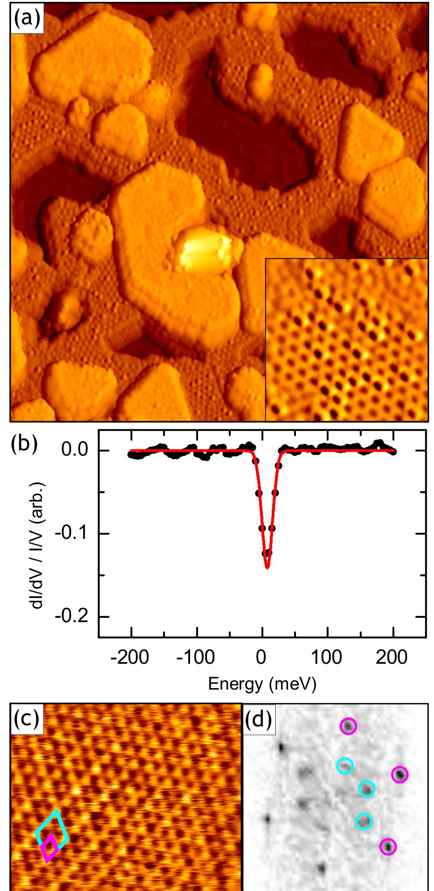

## hallEnvironmentalControlCharge — 单层 2H-TaS₂ 中电荷密度波序的环境控制

## 📄 元数据
Joshua Hall, Niels Ehlen, Jan Berges, Erik van Loon, Camiel van Efferen, Clifford Murray, Malte Rösner, Jun Li, Boris V. Senkovskiy, Martin Hell, Matthias Rolf, Tristan Heider, María C. Asensio, José Avila, Lukasz Plucinski, Tim Wehling, Alexander Grüneis, Thomas Michely，2019，*ACS Nano* 13(9), 10210–10220，DOI: 10.1021/acsnano.9b03419

## 💡 一句话
在 Gr/Ir(111) 上制备出准自由站立的单层 2H-TaS₂，实验上确认其本征 CDW 为近 3×3（部分能隙 2Δ=32±9 meV），Li 掺杂与双层化均将 CDW 转为 2×2（2Δ≈18 meV）；理论上用 DFT+DFPT+多体微扰的声子自能计算建立"掺杂–杂化"相图，阐明掺杂移动失稳波矢、杂化直接淬灭 CDW 这两条独立路径。

## 🔗 Wiki 双链
  - 概念 [[../concepts/charge-density-wave]]
  - 概念 [[../concepts/2D-materials]]
  - 概念 [[../concepts/moire-superlattice]]
  - 概念 [[../concepts/spin-orbit-coupling]]
  - 概念 [[../concepts/density-functional-theory]]
  - 概念 [[../concepts/TaS2|TaS₂]]
  - 概念 [[../concepts/constrained-dfpt|约束 DFPT]]
  - 概念 [[../concepts/interlayer-bias|层间偏压]]
  - 概念 [[../concepts/kohn-anomaly|Kohn 异常]]
  - 概念 [[../concepts/phonon-self-energy|声子自能]]
  - 概念 [[../concepts/quasi-freestanding-monolayer|准自由站立单层]]
  - 概念 [[../concepts/substrate-hybridization|衬底杂化]]
  - 实体 [[../entities/TMDs]]
  - 实体 [[../entities/Wannier90]]
  - 实体 [[../entities/h-BN]]
  - 实体 [[../entities/TaS2|TaS₂]]
  - 图表 [[../figures/crystal-structures]]
  - 图表 [[../figures/electronic-bands]]
  - 图表 [[../figures/vibrational-spectra]]
  - 图表 [[../figures/experimental-setups]]
  - 图表 [[../figures/heterostructures-stacking-spintronics-strain|自旋电子学与应变工程 (Spintronics & Strain Engineering)]]
  - 年度 [[../write/2019]]
  - 项目 [[../projects/project-7-cdw-charge-density-wave]]
    - 相关论文 **hallEnvironmentalControlCharge**
    - 关键图表 [[hallEnvironmentalControlCharge#关键图表]]
    - Wiki 要点 [[hallEnvironmentalControlCharge#可写入wiki的要点]]

## 📊 关键图表
  - 
  - 
  - 
  - 
  - 
  -  → [[../figures/heterostructures-stacking-spintronics-strain|自旋电子学与应变工程]]
  - 
  - 

## 🔬 项目连接
  - **project-7（CDW）**：直接核心参考。(1) 提供了单层 TMDC CDW 研究的"准自由站立 + STM/STS + ARPES/TB"定量范式，可直接用于判断 CDW 周期、能隙与掺杂水平；(2) 给出可复用的理论流程：Quantum ESPRESSO（PBE、SOC、DFT-D3、70 Ry 截断）+ 约束 DFPT 取裸动力学矩阵 D + Wannier90/EPW 插值到 216×216 k 点 + 公式(2)声子自能 Π 得到重整化声子 D̃=D+Π，用虚频位置预测 CDW 波矢；(3) 建立了以电子掺杂 −x 与杂化展宽 Γ 为轴的 CDW 相图，明确区分两条量子相变路径：掺杂使 q_c 从 2/3 ΓM（3×3）移到 M（2×2），>0.27 e/Ta 时晶格稳定；杂化通过 f(ε)=1/2−(1/π)arctan(ε/Γ) 削弱 Π 直接抑制 CDW 而不改变 q_c；(4) 解释了 TaS₂/Au(111) 上无 CDW 是强 S–Au 杂化（Γ=30–90 meV）叠加赝掺杂所致，而非真实电荷转移——这一"赝掺杂 vs 杂化"的辨析对解读任何衬底上 CDW 实验都有警示意义；(5) 双层中用层间偏压 Δε₀ 解释 2×2 CDW，为少层/异质结 CDW 调控提供了层间势这一新旋钮。
  - **project-2（Mn 多铁）**：弱间接参考。本文展示的"环境参数（掺杂/杂化/层间势）独立调控电子序"思路，以及用声子虚频判断晶格失稳波矢的方法，可为 Mn 基多铁中电荷/轨道序与铁电/磁序耦合的界面调控、应变或栅压实验提供物理图像上的类比；但材料体系（TaS₂ vs Mn 氧化物）与主导相互作用差异大，不具直接数据复用价值。
  - **project-1（双光子）、project-3（机械发光 NN）、project-4（TTF 分子计算）、project-5（SnTe 铁电模拟）、project-6（湿度传感器）**：无直接项目连接。其中 project-5 若关注铁电软模/虚频判据，约束 DFPT + 声子自能的方法论有微弱方法学借鉴，但本文聚焦金属 CDW 体系，与 SnTe 铁电位移相变的物理不同，不列为正式连接。

## 📝 组织与用词
论文按"实验发现（原始单层 3×3 → 双层 2×2 → Li 掺杂 2×2）→ 理论建模（声子色散与掺杂–杂化相图）→ 双层理论考量（层间偏压）→ 结论"的经典实验–理论闭环组织；每一步实验都在相图中找到对应坐标，从而把既往 TaS₂/Au(111)、TaS₂/Gr/SiC、h-BN 封装等矛盾结果统一到同一框架。值得复用的术语：
  - 电荷密度波（[[../concepts/charge-density-wave|charge density wave]], CDW）
  - 准自由站立（[[../concepts/quasi-freestanding-monolayer|quasi-freestanding]]）
  - 衬底杂化 / 电子展宽（[[../concepts/substrate-hybridization|substrate hybridization]], Γ as HWHM）
  - 赝掺杂（pseudo-doping，杂化导致费米面非线性畸变被误判为电荷转移）
  - 声子自能与虚频（[[../concepts/phonon-self-energy|phonon self-energy Π]], imaginary phonon frequency）
  - Kohn 异常 / 费米面嵌套（[[../concepts/kohn-anomaly|Kohn anomaly]], Fermi-surface nesting）
  - 主导失稳波矢（leading instability wave vector q_c）
  - 层间偏压（[[../concepts/interlayer-bias|interlayer bias Δε₀]]）
  - 部分能隙（partial CDW gap，STS 中归一化 dI/dV÷I/V 测定）

## ✏️ 可写入 Wiki 的要点
  1. 准自由站立单层 2H-TaS₂（MBE 生长于 Gr/Ir(111)，5 K 表征）的本征 CDW 周期为近 3×3（线轮廓显示相位偏移，非公度），STS 归一化谱（dI/dV÷I/V，按 Ref. 33 方法）测得部分能隙 2Δ=32±9 meV；占据态/空态恒高 STM 像呈对比度反转，是 CDW 的实空间指纹。
  2. ARPES+TB 紧束缚拟合（L-BFGS，改编自单层 MoS₂ 模型）给出 Ta d 带自旋–轨道劈裂结构（Γ 周围六边形空穴口袋 + K 点自旋劈裂空穴口袋），由费米面面积算得 n_e=1.10±0.02 e/单胞，即 x=−0.10 的轻微电子掺杂；ARPES 未见 TaS₂–衬底带杂化，证实"准自由站立"。
  3. 双层 TaS₂ 中莫尔条纹消失、两层严格外延（无旋转失配），CDW 变为短程有序的 2×2，2Δ=18±9 meV；驻波图案在 BL 中几乎消失，佐证层间耦合强于 TaS₂–Gr 耦合。
  4. Li 蒸气（500 K 暴露）在单层表面形成 (√7×√7)R19.1° 吸附超结构， DFT 估计掺杂增加约 0.25 e（x≈−0.25）；30 K 下用 STM 针尖移除 Li 后露出 2×2 CDW，2Δ=19±9 meV，直接证明电子掺杂驱动 3×3→2×2 转变。Li 还会插层到 Gr 与 TaS₂ 之间并使莫尔消失。
  5. 理论框架：裸声子/动力学矩阵 D 来自约束 DFPT（排除低能电子子空间屏蔽），实验声子由 D̃=D+Π 给出；Π 用公式(2)在 Wannier 基中计算，k 点插值至 216×216。掺杂用刚性能带移动模拟；杂化用 Lorentz 展宽 Γ 与 T=0 占据函数 f(ε)=1/2−(1/π)arctan(ε/Γ) 模拟（arctan 多项式衰减使远离 E_F 的态也参与，故 Γ 比热展宽更有效淬灭 Π）。
  6. 掺杂–杂化相图（图5b）：低掺杂弱杂化区为 3×3 CDW（q_c≈2/3 ΓM），高掺杂弱杂化区为 2×2 CDW（q_c=M），电子掺杂 >0.27 e/Ta 时晶格动力学稳定、CDW 消失；杂化增加只减弱 Kohn 异常而基本不改变 q_c，掺杂则移动 q_c——两条量子相变路径临界波矢不同。
  7. TaS₂/Au(111) 无 CDW 的再解释：Shao 等指出由费米面变化估出的"掺杂"实为杂化导致的非线性带扭曲（赝掺杂）；本文用 Γ=30–90 meV、x=−0.326 至 −0.430 的范围把该体系置入相图无 CDW 区，说明主因是强 S–Au 杂化而非电荷转移；晶格弛豫可进一步稳定。
  8. 双层理论（图6）：自由未掺杂 BL 声子与 ML 几乎相同，仍倾向 3×3；仅 x=−0.1 掺杂不足以使 M 失稳超过 2/3 ΓM；再引入层间偏压 Δε₀=0.1 eV（一层在位能 +Δε₀/2、另一层 −Δε₀/2）可拉平失稳区并将 q_c 推向 M，从而解释 BL 中观测到的 2×2 CDW；自插层 Ta 原子（块体 TaS₂ 中已知）也可能提供额外电荷，两者谁主谁次仍属推测。
  9. 计算参数：Quantum ESPRESSO，PBE-GGA，PseudoDojo 模守恒 Vanderbilt 赝势，平面波截断 70 Ry，18×18 k / 6×6 q 网格，10 mRy Gaussian 展宽，SOC 与 DFT-D3 vdW 修正；ML/BL 真空层 15/25 Å，优化后 a=3.34/3.33 Å，BL 层间距 6.10 Å。
  10. 更宏观的结论：vdW 异质结由于"全表面"特性，其电子相图是高维的——每个界面（2D 层之间、2D 层与 3D 衬底之间）都引入新的控制参数（掺杂、杂化、层间势），可作为异质结器件的调控旋钮；本文未触及 CDW–超导竞争、有限温度相图、栅压连续调控等问题，作者将其列为后续方向。
