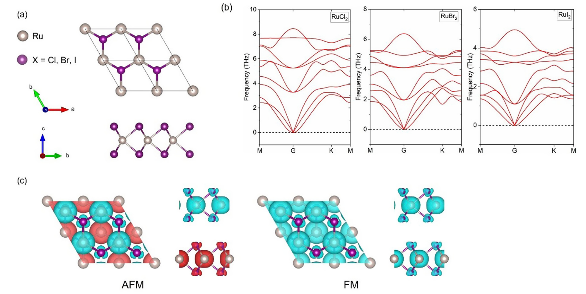
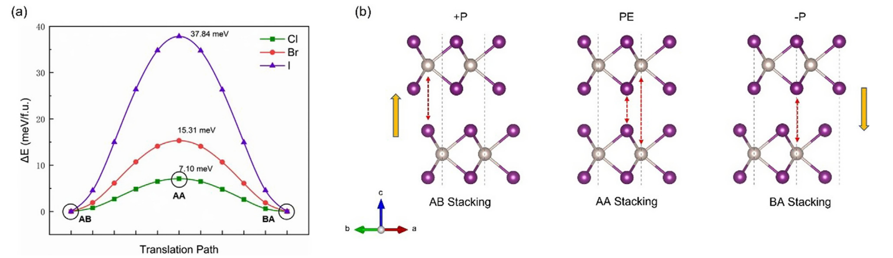
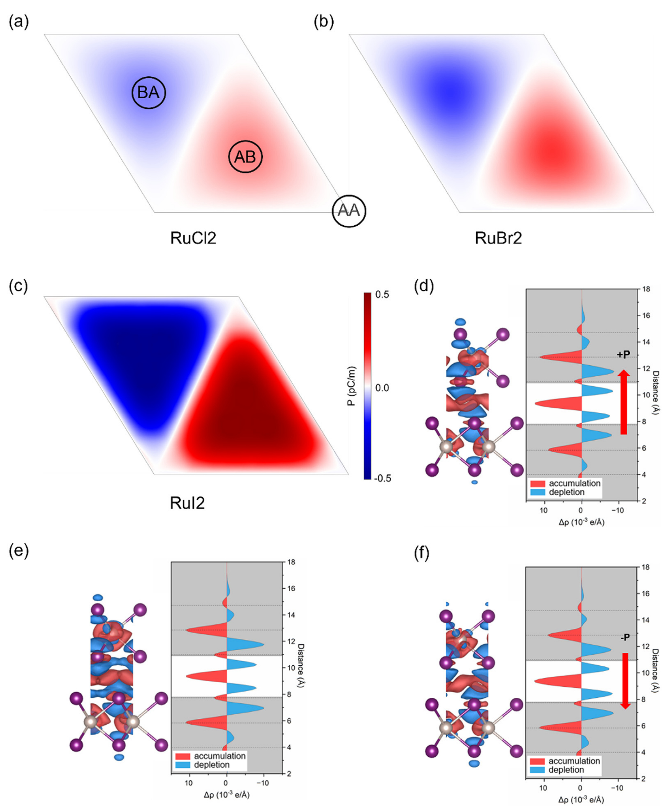
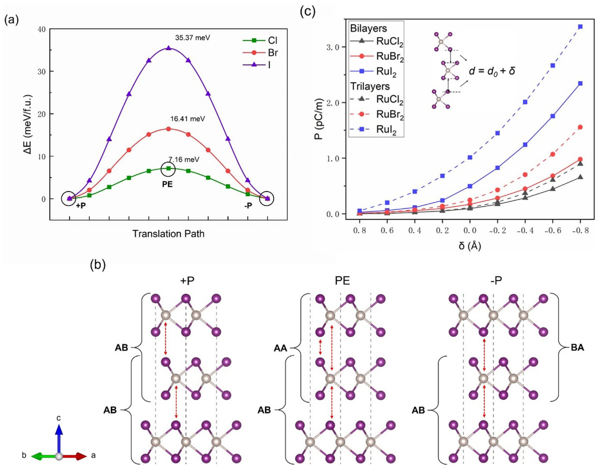
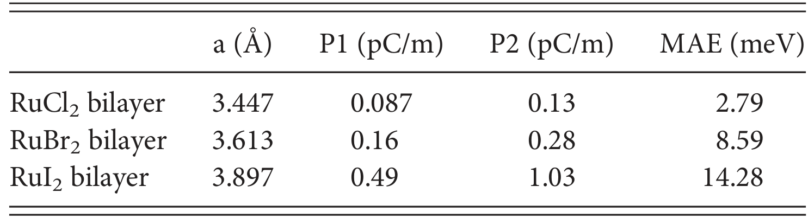

## hanTunableSlidingFerroelectricity2025 — 二维范德华 RuX₂（X = Cl, Br, I）多铁层中的可调谐滑动铁电性

## 📄 元数据
Peng Han, Jingtong Zhang, Xumin Chen, Jie Wang（浙江大学、大连理工大学、杭州电子科技大学），2025，*Applied Physics Letters* 126, 082901，DOI: 10.1063/5.0249647。

## 💡 一句话
基于第一性原理预测二维磁性 RuX₂（X = Cl, Br, I）双层/多层是一类新型多铁滑动铁电体——同向堆叠打破反演对称产生纯电子起源的垂直极化，层间微小滑移即可翻转，且极化可随层数增加与压缩应变显著增强，其中 RuI₂ 综合性能最优。

## 🔗 Wiki 双链
  - 概念 [[../concepts/sliding-ferroelectricity]]、[[../concepts/multiferroicity]]、[[../concepts/2d-materials]]、[[../concepts/berry-phase]]、[[../concepts/density-functional-theory]]、[[../concepts/magnetoelectric-coupling]]、[[../concepts/strain-engineering]]、[[../concepts/polarization-switching]]、[[../concepts/spin-orbit-coupling]]、[[../concepts/moire-superlattice]]、[[../concepts/magnetic-anisotropy]]、[[../concepts/stack-engineering|堆叠工程]]、[[../concepts/ferrovalley|铁谷]]、[[../concepts/vdW-heterostructure]]
  - 实体 [[../entities/VASP]]、[[../entities/h-BN]]、[[../entities/WTe2]]、[[../entities/In2Se3]]、[[../entities/TMDs]]
  - 图表 [[../figures/crystal-structures]]、[[../figures/heterostructures-stacking]]、[[../figures/heterostructures-stacking|层间滑移铁电：机制、翻转与动力学]]、[[../figures/electronic-bands]]
  - 年度 [[../write/2025-2029|2025]]
  - 项目 [[../projects/project-2-mn-multiferroics]]、[[../projects/project-5-snte-ferroelectric-sim]]
  - 概念 [[../concepts/magnetic-anisotropy]]
  - 实体 [[../entities/RuBr2]]、[[../entities/RuI2]]、[[../entities/RuCl2]]
  - 相关论文 [[../../raw/note/hanTunableSlidingFerroelectricity2025]]
  - 实体 [[../entities/RuX2]]

## 🆕 新概念/实体建议
  - [[../concepts/magnetic-anisotropy|magnetic-anisotropy]]（磁各向异性能，MAE）：抵抗 Mermin–Wagner 热涨落、稳定二维长程磁序的关键能量尺度；本文 from d 轨道耦合层面解析其来源。
  - [[../concepts/stack-engineering|stack-engineering]]（堆叠工程）：通过选择层间堆叠方式/滑移来设计对称性破缺与极化的通用策略，与转角、应变并列的二维材料调控手段。
  - [[../concepts/ferrovalley|ferrovalley]]（铁谷）：单层 RuCl₂ 曾报道的自发谷极化性质；本文指出双层 RuX₂ 谷极化基本消失（RuCl₂ 仅 0.7 meV，RuBr₂/RuI₂ 能带穿费米能级）。
  - 实体 [[../entities/RuCl2|RuCl2]] / [[../entities/RuBr2|RuBr2]] / [[../entities/RuI2|RuI2]]（可合并为 [[../entities/RuX2|RuX2]]）：六角 P-6m2 单层、三棱柱配位的 Ru-4d 磁性范德华卤化物，本文核心材料体系，值得新建实体条目记录其结构、磁性与滑动铁电参数。
  - 方法 [[../concepts/aimd|aimd]]（从头算分子动力学）、[[../concepts/nudged-elastic-band]]（微动弹性带法）、[[../concepts/dft-d2|dft-d2]]（Grimme 范德华修正）：本文使用且 wiki 方法标签中可固化的计算流程。

## 📊 关键图表
  - 图1：单层 RuX₂ 原子结构（六方 P-6m2，三棱柱配位）、三声子谱（无虚频）、双层 RuCl₂ 的 AFM/FM 自旋极化电荷密度。
     -> [[../figures/crystal-structures-bulk|体相晶体结构]]
    - **图示描述**：(a) 单层 RuX₂ 的俯/侧视原子结构，每个 Ru 由六个 X（Cl/Br/I）以三棱柱配位，六方晶格、空间群 P-6m2（No.187）；(b) RuCl₂、RuBr₂、RuI₂ 三种单层沿布里渊区高对称路径的声子色散；(c) 双层 RuCl₂ 在层间 AFM 与 FM 构型下的自旋极化电荷密度等值面（青/红分别为自旋上/下）。
    - **关键特征**：三条声子谱均无虚频，证明三种单层动力学稳定；配合 5×5×1 超胞 300 K、3 ps AIMD 无重构断键确立热力学稳定；AFM/FM 对比给出层内 FM、层间 AFM 的磁基态；Ru/X 磁矩分别为 RuCl₂ 3.33/0.26 μ_B、RuBr₂ 3.26/0.28 μ_B、RuI₂ 3.06/0.26 μ_B。
    - **结论/意义**：为后续双层堆叠和极化计算提供了稳定的结构与磁性基准，确认 RuX₂ 是可承载多铁性的二维磁性母体。
  - 图2：RuX₂ 双层 ±P 态间极化翻转的 NEB 路径与能垒（RuCl₂/RuBr₂/RuI₂ 分别为 7.10/15.31/37.84 meV/f.u.），以及 AB/AA/BA 三种高对称堆叠示意。
     -> [[../figures/heterostructures-stacking|异质结与堆叠]]
    - **图示描述**：(a) 横轴为沿 [110] 方向从 AB 经 AA 滑至 BA 的层间滑移坐标，纵轴为相对能量（meV/f.u.），三条曲线分别对应 RuCl₂/RuBr₂/RuI₂ 双层；(b) AB、AA、BA 三种高对称堆叠的原子示意，红色虚线标滑移路径，黄色箭头标极化方向。
    - **关键特征**：AB 与 BA 是两个简并的 ±P 能量极小值，AA 为镜面对称的顺电过渡态（能量最高）；翻转势垒 RuCl₂ 7.10、RuBr₂ 15.31、RuI₂ 37.84 meV/f.u.，远低于 In₂Se₃（~66 meV）、PbTiO₃（~240 meV）、双层 CrI₃（57.42 meV）和 NiI₂（~50 meV）；AA 保持 P-6m2 镜面对称无极化，AB/BA 降至 P-3m1 并产生反向垂直极化。
    - **结论/意义**：直接证明极化可由微小层间滑移在两个简并态间低功耗翻转，是滑动铁电性的核心证据。
  - 图3：双层 RuCl₂/RuBr₂/RuI₂ 的极化纹理图，以及 RuI₂ 在 AB/AA/BA 堆叠下层间差分电荷密度与沿 z 轴平面积分，揭示极化的纯电子起源。
     -> [[../figures/electronic-bands-dos-fermi|态密度与费米面]]
    - **图示描述**：(a-c) 上层在 6×6 网格内相对下层任意平移时整个二维平面的极化纹理图（颜色表极化强度、箭头表方向，圆圈标 AB/AA/BA 位点）；(d-f) RuI₂ 双层 AB/AA/BA 堆叠的层间差分电荷密度 3D 等值面（红积蓝耗，等值面 7.7×10⁻⁵ e/ų）及沿 z 轴的平面平均 Δρ(z) 曲线，虚线标原子层位置。
    - **关键特征**：极化纹理最大值出现在 AB/BA 位点、AA 位点为零，与 NEB 双势阱吻合；AB/BA 差分电荷在层间一侧累积、另一侧耗尽，形成 z 方向偶极；AA 堆叠电荷分布对称、净极化为零；补充表 S1 显示离子贡献为零，极化全部来自电子。
    - **结论/意义**：把极化从"对称性推论"落到"层间电子云不对称重排"的微观图像，确立纯电子起源的滑动铁电机制。
  - 图4：三层 RuX₂ 的翻转路径（势垒与双层相近）、三层堆叠示意，以及 RuI₂ 极化随层间距 d/d₀ 的变化（压缩应变增强、拉伸应变削弱极化）。
     -> [[../figures/heterostructures-stacking|异质结与堆叠]]
    - **图示描述**：(a) 三层 RuX₂ 顶层沿长对角线滑移时的 NEB 能量路径；(b) 下两层固定为 AB、顶层滑移构成三层 AB/AA/BA 堆叠的示意图；(c) RuI₂ 双层与三层极化 P 随归一化层间距 d/d₀ 的变化（d₀ 为平衡间距，d<d₀ 为压缩、d>d₀ 为拉伸）。
    - **关键特征**：三层翻转势垒 RuCl₂/RuBr₂/RuI₂ 为 7.16/16.41/35.37 meV/f.u.，与双层几乎相同；三层极化升至 0.13/0.28/1.03 pC/m，其中 RuI₂ 约为双层 0.49 pC/m 的 2.1 倍；P 随 d/d₀ 单调变化，压缩应变显著增强、拉伸应变削弱极化，双层与三层趋势一致。
    - **结论/意义**：证明"立体堆叠"可在不增加翻转代价的前提下倍增极化，并给出衬底应力调控极化的可行手段。
  - 表I：面内晶格常数 a、双层极化 P₁、三层极化 P₂ 与 MAE 汇总（RuCl₂: 3.447 Å/0.087/0.13 pC/m/2.79 meV；RuBr₂: 3.613 Å/0.16/0.28/8.59；RuI₂: 3.897 Å/0.49/1.03/14.28）。
     -> [[../figures/heterostructures-stacking|异质结与堆叠]]
    - **图示描述**：论文唯一的主文表格，按 RuCl₂/RuBr₂/RuI₂ 三行汇总 AB 堆叠下的面内晶格常数 a、双层 SFE 极化 P₁、三层 SFE 极化 P₂ 与磁各向异性能 MAE。
    - **关键特征**：a 由 3.447→3.613→3.897 Å 随卤素半径递增；P₁ 由 0.087→0.16→0.49 pC/m、P₂ 由 0.13→0.28→1.03 pC/m，三层约为双层 1.5–2.1 倍；MAE 由 2.79→8.59→14.28 meV 单调增大；RuI₂ 在极化、磁稳定性两项均居首。
    - **结论/意义**：用一张表把"卤素越重、极化越强、MAE 越大"的演化趋势量化，支撑 RuI₂ 为最优多铁候选的筛选结论。
  - 图5：RuX₂ 双层 AB 堆叠顶/底层 Ru 原子 d 轨道耦合对 MAE 的贡献（a-f），以及 RuI₂ 双层 AA 堆叠对应贡献（g-h）；raw/figures 中未附图片。
    - **图示描述**：分面柱状图比较不同 d 轨道耦合对（d_{x²-y²}–d_xy、d_{x²-y²}–d_xz、d_{x²-y²}–d_yz 等）对总 MAE 的贡献，覆盖 RuCl₂/RuBr₂/RuI₂ 的 AB 堆叠与 RuI₂ 的 AA 堆叠。
    - **关键特征**：从 RuCl₂/RuBr₂ 到 RuI₂，d_{x²-y²} 与 d_xy、d_xz、d_yz 之间的强耦合由负贡献转为正贡献，是 MAE 从 2.79 增至 14.28 meV 的主因；RuI₂ 中 AA 堆叠 MAE 为 11.67 meV，AB 堆叠更高（14.28 meV），同样源于上述耦合项的增强。
    - **结论/意义**：从轨道层面解释了 RuI₂ 大 MAE 与堆叠依赖的来源，为化学组分与堆叠方式调控二维磁序稳定性提供依据。

## 🔬 项目连接
  - **project-2（Mn 多铁）— strong**：本文是二维多铁材料的理论范例，直接展示"铁电极化 + 磁性共存 + 磁电耦合"的计算论证流程：用 Berry 相算极化、用 NEB 算翻转势垒、比较 FM/AFM 能量差来量化铁电相对磁性的调控（RuI₂ 中 AB 铁电相 FM–AFM 能量差 46.1 meV，AA 顺电相 44.0 meV，对应不同临界磁场）。这一"以堆叠/极化态调磁态能量差"的弱磁电耦合图像，以及 DFT+U（U_eff=2.0 eV，HSE 校验）处理过渡金属 d 电子的方案，对 Mn 基多铁体系的计算建模有直接方法学参考。
  - **project-5（SnTe 铁电模拟）— strong**：本文系统演示了二维/层状铁电体的标准计算流程：Berry 相极化、NEB 翻转路径与势垒、层间滑移坐标系、应变–极化响应曲线、层数效应，并给出与 In₂Se₃、PbTiO₃、CrI₃、NiI₂ 等体系的势垒对比数据。虽然 SnTe 是本征离子位移铁电而非滑动铁电，但"压缩应变增强极化"的响应规律、低势垒翻转的评估方法、pC/m 二维极化单位的处理，均可直接迁移到 SnTe 薄膜/异质结的铁电模拟中。
  - 其余项目（project-1 双光子、project-3 机械发光 NN、project-4 TTF 分子计算、project-6 湿度传感、project-7 CDW）无直接项目连接；DFT-D2 范德华修正对 project-4 分子晶体仅有边缘方法学关联，不单列。

## 🔗 项目双链
- 项目 [[../projects/project-2-mn-multiferroics|项目二：Mn极化结构铁电材料]]
- 项目 [[../projects/project-5-snte-ferroelectric-sim|项目五：lammps势函数SnTe铁电模拟]]

## 📝 组织与用词
文章按"稳定性验证 → 堆叠对称性破缺 → 极化与翻转 → 电荷起源 → 层数/应变调控 → 磁性与 MAE → 多铁耦合"的递进结构组织，是一篇范式清晰的第一性原理材料预测快报。值得复用的术语：
  - [[../concepts/sliding-ferroelectricity|sliding ferroelectricity / 滑动]]（滑移）铁电性
  - [[../concepts/stack-engineering|stack engineering / 堆叠工程]]
  - [[../concepts/out-of-plane-polarization|out-of-plane polarization / 面外]]（垂直）极化
  - [[../concepts/berry-phase|Berry-phase method / Berry 相位法]]
  - [[../concepts/switching-barrier|switching barrier / 翻转势垒]]
  - [[../concepts/charge-density|charge density difference / 电荷密度差]]
  - magnetic anisotropy energy ([[../concepts/magnetic-anisotropy]]) / 磁各向异性能
  - compressive (tensile) strain / 压缩（拉伸）应变

## ✏️ 可写入 Wiki 的要点
  1. 单层 RuX₂（X=Cl, Br, I）为六方晶格，空间群 P-6m2（No.187），每个 Ru 与六个 X 形成三棱柱配位；声子谱无虚频，5×5×1 超胞 300 K、3 ps AIMD 无重构/断键，动力学与热力学稳定。
  2. 两个无旋转同向单层沿 [110] 方向堆叠：AA 堆叠保持 P-6m2 镜面对称为顺电相；AB/BA 堆叠降至 P-3m1，镜面对称破缺，产生方向相反的垂直极化 ±P。
  3. 双层 RuX₂ 的 Berry 相垂直极化为 RuCl₂ 0.087、RuBr₂ 0.16、RuI₂ 0.49 pC/m；RuI₂ 可与双层 MoS₂、InSe 相比，但[[../concepts/switching-barrier|翻转势垒]]更低。
  4. NEB 翻转势垒：双层 RuCl₂/RuBr₂/RuI₂ 为 7.10/15.31/37.84 meV/f.u.，远低于 In₂Se₃（~66 meV）、PbTiO₃（~240 meV）、双层 CrI₃（57.42 meV）、NiI₂（~50 meV）；三层势垒（7.16/16.41/35.37 meV）与双层几乎相同。
  5. 极化全部来自电子贡献（附表 S1 离子贡献为零）：面内滑移不破坏层内离子对称，差分[[../concepts/charge-density|电荷密度]]显示 AB/BA 堆叠在层间一侧电子积累、另一侧耗尽，形成面外偶极矩。
  6. 层数效应：三层 RuI₂ 极化升至 1.03 pC/m（约为双层的 2.1 倍），RuCl₂/RuBr₂ 也分别升至 0.13/0.28 pC/m；层间电荷密度明显增大，而翻转势垒基本不增加。
  7. 应变效应：固定 AB 堆叠改变层间距 d（d₀ 为平衡值），拉伸应变降低极化，压缩应变显著增大极化（双层、三层均如此），为衬底应力调控提供手段。
  8. 磁性：双层 RuX₂ 均为层内 FM、层间 AFM 基态；Ru 磁矩约 3.06–3.33 μ_B，X 约 0.26–0.28 μ_B。MAE 从 RuCl₂ 2.79、RuBr₂ 8.59 增至 RuI₂ 14.28 meV；RuI₂ 中 AA 堆叠 MAE 为 11.67 meV，AB 更高。
  9. MAE 增强机制：轨道分辨分析表明，从 RuCl₂/RuBr₂ 到 RuI₂，d_{x²-y²} 与 d_xy、d_xz、d_yz 之间的[[../concepts/strong-coupling|强耦合]]由负贡献转为正贡献，是 MAE 增大的主因；大 MAE 有助于稳定二维长程磁序。
  10. [[../concepts/magnetoelectric-coupling|磁电耦合]]：RuI₂ 中铁电相（AB）与顺电相（AA）的 FM–AFM 能量差分别为 46.1 和 44.0 meV，意味着两态发生 AFM→FM 转变所需临界磁场不同，从而可通过铁电堆叠态（电场）间接调控磁性；但双层体系基本无铁谷性质（RuCl₂ 谷极化仅 0.7 meV，RuBr₂/RuI₂ 能带穿费米能级）。
