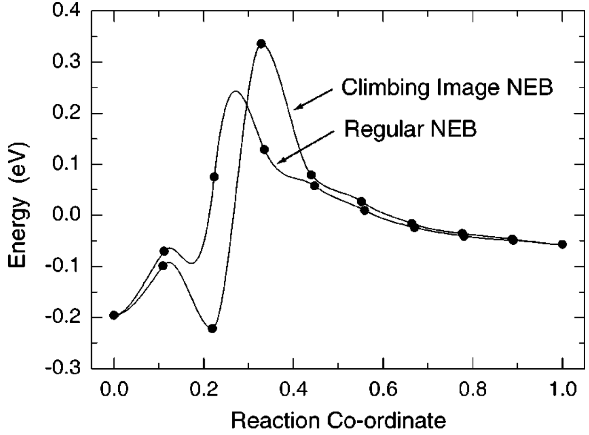
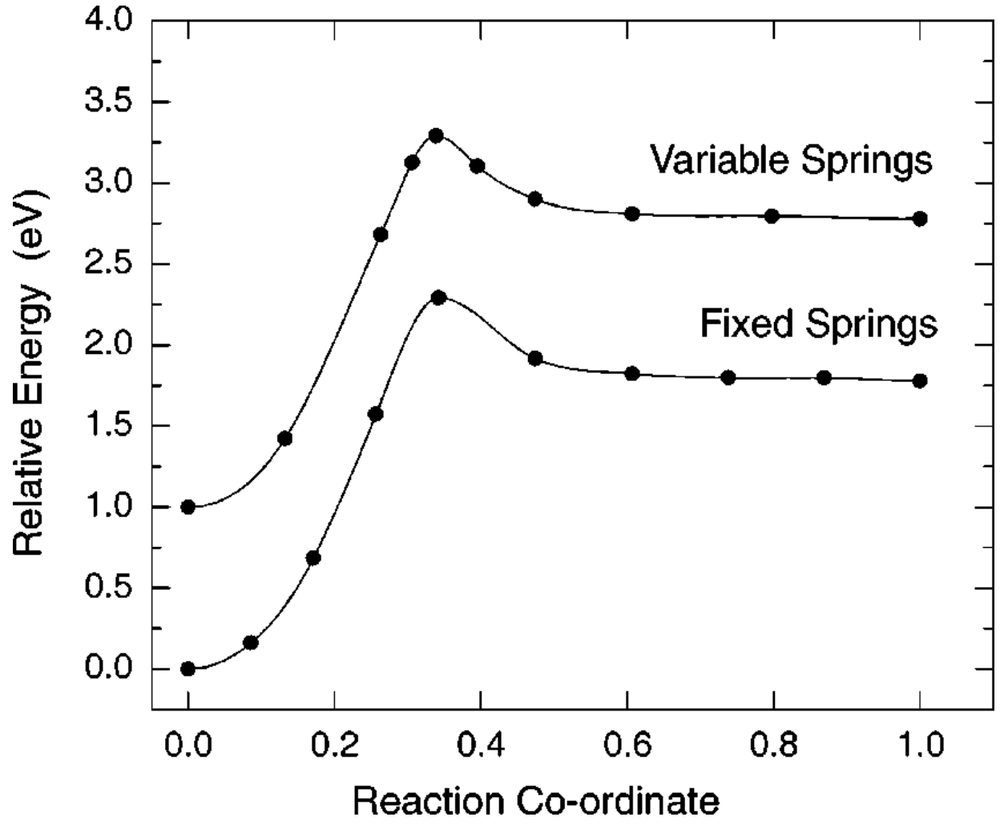

## henkelmanClimbingImageNudged2000c — 爬升图像微动弹性带法（CI-NEB）求解鞍点与最小能量路径

- **元数据**：Graeme Henkelman, Blas P. Uberuaga, Hannes Jónsson，2000，The Journal of Chemical Physics 113(22), 9901–9904，DOI 10.1063/1.1329672。
- **一句话**：在常规 NEB 基础上，将能量最高图像的势能力沿弹性带切线方向的分量反转，使该图像自动"攀登"至一阶鞍点，并辅以随能量线性变化的可变弹簧常数加密鞍点附近图像，从而以几乎零额外成本精确给出活化能。
- **现有wiki双链**：
  - 概念 [[../concepts/density-functional-theory]]
  - 实体 [[../entities/VASP]]
  - 图表 [[../figures/mathematical-models]]
  - 年度 [[../write/2000]]
  - 项目 [[../projects/project-2-mn-multiferroics]]、[[../projects/project-4-ttf-molecular-calc]]、[[../projects/project-5-snte-ferroelectric-sim]]、[[../projects/project-7-cdw-charge-density-wave]]
  - 相关论文 [[../../raw/note/henkelmanClimbingImageNudged2000c]]
- **新概念/实体建议**：
  - `nudged-elastic-band`（NEB，微动弹性带法）：通过在初末态间放置一串图像并用弹簧连接、将真实力与弹簧力分别投影到路径垂直/平行方向来求 MEP 的经典链状方法。
  - `climbing-image-neb`（CI-NEB，爬升图像 NEB）：本文核心方法，将最高能图像沿切线方向的力反转以严格收敛到鞍点。
  - `minimum-energy-path`（MEP，最小能量路径）：连接初末态、任意点垂直方向受力为零的最概然反应路径，其上极大值即鞍点。
  - `saddle-point`（鞍点/过渡态）：势能面上沿反应坐标为极大、其余方向为极小的一阶驻点，决定 hTST 速率的活化能。
  - `transition-state-theory`（TST/hTST，过渡态理论及谐波近似）：把速率常数归结为鞍点与初态能量差及简正模频率之比的统计力学框架。
  - `potential-energy-surface`（PES，势能面）：体系能量作为所有原子坐标函数的高维超曲面。
  - `rare-events`（稀有事件）：原子振动时标远短于跃迁时标、直接 MD 不可行的扩散/反应问题。
  - `force-projection-nudging`（力投影/"微动"）：NEB 区别于其他弹性带法的核心，只取真实力垂直分量与弹簧力平行分量，同时解决"切角"与"下滑"问题。
  - `variable-spring-constants`（可变弹簧常数）：随图像能量线性增强弹簧，使图像在高能鞍点区加密。
  - 实体建议：`Ir-111`、`Si-100`（本文两个验证表面体系，可作为表面催化/半导体表面实体）。
- **关键图表**：
  - 
  - 
  - 笔记另附公式 1–6 的图片（eq_1 至 eq_6），分别对应 hTST 速率公式、NEB 合力、真实力垂直投影、弹簧力平行投影、CI 修正力、可变弹簧常数分段公式。
- **项目连接**：
  - **project-5（SnTe 铁电 LAMMPS 势函数模拟，strong）**：CI-NEB 是用 DFT 或经验势/MLIP 计算铁电极化翻转路径、相变势垒与最小能量路径的标准工具；论文明确指出 NEB/CI-NEB 可与经验势结合并扩展到百万原子体系，且在 VASP 中实现，直接对应 SnTe 极化翻转、相变动力学所需的势垒计算流程。可变弹簧常数对处理 SnTe 中长而平坦的翻转路径特别有用。
  - **project-2（Mn 多铁 DFT 计算，medium）**：项目涉及 DFT/VASP 计算（MoS2 应变、黑磷极化、高通量筛选），CI-NEB 可用于计算离子迁移、极化翻转或磁电耦合路径上的过渡态势垒，是 VASP 工作流中可直接复用的方法学组件。
  - **project-4（TTF 分子晶体 MD/MLIP，medium）**：论文明确提到 NEB/CI-NEB 已与经验势结合用于大分子体系（含百万原子算例），可与 DeepMD/MACE 等 MLIP 联用计算 TTF 分子晶体中层间滑动、相变或电荷转移相关的过渡态与势垒，为 MLIP 训练集补充过渡态构型。
  - **project-7（CDW 电荷密度波，medium）**：项目图表规划中包含 NM/FM CDW 态之间的能量景观与相变势垒（Figure 2），CI-NEB 可直接用于计算 1T/1T' 相或 NM/FM-CDW 相之间的相变 MEP 与势垒，为机电驱动应变与滞后回线提供能量路径数据。
  - project-1（双光子）、project-3（机械发光 NN）、project-6（湿度传感器）：无直接项目连接。
- **组织与用词**：文章是典型的"问题—方法—验证"通讯体：第 I 节由稀有事件/TST 引出鞍点搜索问题并回顾 NEB 及切线改进；第 II 节给出 DFT 计算设置（PW91、超软赝势、VASP、平面波截断 350/200 eV）；第 III 节用公式 (2)–(4) 重述常规 NEB 的力投影；第 IV 节给出 CI 修改公式 (5) 并用 CH4/Ir(111) 验证；第 V 节给出可变弹簧常数公式 (6) 并用 H2/Si(100) 验证，最后以收敛步数（179/190/178 次力评估）证明无额外成本。值得复用的术语：Climbing Image（爬升图像）、Nudging/Force Projection（微动/力投影）、Minimum Energy Path（最小能量路径）、Saddle Point（鞍点）、Corner-cutting（切角问题）、Sliding-down（下滑问题）、Dividing Surface（分界面）、Harmonic TST（谐波过渡态理论）、Variable Spring Constants（可变弹簧常数）、Reaction Coordinate（反应坐标）。
- **可写入wiki的要点**：
  1. CI-NEB 的核心修正是公式 (5)：$F_{i_\max}=-\nabla E(R_{i_\max})+2\,\nabla E(R_{i_\max})|_{\parallel}$，即把最高能图像所受势能力沿弹性带切线方向的分量反转、垂直分量保持不变，使其沿带"爬升"而垂直方向仍向 MEP 驰豫，最高能图像完全不受弹簧力作用。
  2. 该修改是纯代数操作，不增加任何力评估次数；所有图像同时弛豫，CI-NEB 与常规 NEB 的计算量之差在 10% 以内（CH4/Ir(111) 算例中 CI-NEB 甚至不一定更慢）。
  3. NEB 的"微动"力投影（公式 2–4）只保留真实力的垂直分量 $-\nabla E|_\perp$ 和弹簧力的平行分量 $F^s|_\parallel=k(|\mathbf R_{i+1}-\mathbf R_i|-|\mathbf R_i-\mathbf R_{i-1}|)\hat\tau_i$，从而同时消除"切角"（弹簧力拉直弯曲路径）和"下滑"（真实力把图像拉向端点极小值）两个问题。
  4. 可变弹簧常数公式 (6)：$k'_i=k_{\max}-\Delta k\,(E_{\max}-E_i)/(E_{\max}-E_{\rm ref})$（$E_i>E_{\rm ref}$ 时），否则取 $k_{\max}-\Delta k$；$E_i$ 取弹簧所连两图像中能量较高者，$E_{\rm ref}$ 取 MEP 两端点中能量较高者，从而保证两端图像密度大致均衡并将图像拉向鞍点区。
  5. hTST 速率公式 (1)：$k^{\rm hTST}=(\prod_i^{3N}\nu_i^{\rm init}/\prod_i^{3N-1}\nu_i^\ddagger)\exp[-(E^\ddagger-E^{\rm init})/k_BT]$，鞍点缺失一个（虚频）模方向，频率乘积比包含熵效应。
  6. CH4/Ir(111) 算例：DFT/PW91 预测活化能约 0.4 eV（实验 0.28 eV，尚需零点能、色散、有限尺寸修正）；过渡态时最近邻 Ir 原子被拉出表面 0.5 Å，说明 MEP 显著偏离端点直线插值，简单线性插值路径会失败；MEP 上存在一个比 0.0 端点化学吸附态更深的中间极小值（H 处于桥位）。
  7. H2/Si(100) 算例：反应坐标 0.0 为 Si 二聚体上的解离态，1.0 为距表面 3.8 Å 的 H2 分子；等弹簧 CI-NEB 需 190 次力评估，可变弹簧 CI-NEB 仅 178 次（常规 NEB 179 次），在不增加计算量的前提下显著提高鞍点附近分辨率。
  8. 可指定两个或更多爬升图像以处理 MEP 上存在多个能量相近高点（多个鞍点/中间体）的情形；爬升图像附近需要足够图像来准确估计切线（即爬升方向）。
  9. CI-NEB 是局部方法，依赖初末态和初始弹性带质量；切线估计精度直接决定爬升方向是否正确（本文使用了 Henkelman & Jónsson 同期提出的改进切线估计，JCP 113, 9978）。
  10. 方法天然适合并行：每个图像可分配到一个节点，节点间只需常规以太网传输数据；已被证明可与经验势结合用于超过一百万原子的体系（文中引文献 22），因此可直接迁移到 LAMMPS/MLIP 大尺度模拟。
