## hillWhyAreThere2000a — 为什么磁性铁电体这么少？

## 📄 元数据
Nicola A. Hill，2000，*The Journal of Physical Chemistry B* 104(29), 6694-6709，DOI: 10.1021/jp000114x
## 💡 一句话
通过第一性原理计算提出制约铁磁/铁电共存的"d0规则"——B位过渡金属离子的d电子占据会抑制偏心铁电畸变，并以BiMnO3和YMnO3为例阐明化学（孤对电子）与结构（六方配位）两条破局路径。
## 🔗 Wiki 双链
  - 概念 [[../concepts/multiferroicity]]
  - 概念 [[../concepts/magnetoelectric-coupling]]
  - 概念 [[../concepts/density-functional-theory]]
  - 概念 [[../concepts/ferroelasticity]]
  - 概念 [[../concepts/berry-phase]]
  - 概念 [[../concepts/d0-rule]]
  - 概念 [[../concepts/electronic-ferroelectricity]]
  - 概念 [[../concepts/geometric-ferroelectricity]]
  - 概念 [[../concepts/jahn-teller-distortion]]
  - 概念 [[../concepts/soft-mode-theory]]
  - 概念 [[../concepts/stereochemically-active-lone-pair]]
  - 实体 [[../entities/BiFeO3]]
  - 实体 [[../entities/HoMnO3]]
  - 实体 [[../entities/BiMnO3]]
  - 实体 [[../entities/LaMnO3]]
  - 实体 [[../entities/YMnO3]]
  - 图表 [[../figures/crystal-structures]]
  - 图表 [[../figures/electronic-bands]]
  - 年度 [[../write/2000]]
  - 项目 [[../projects/project-2-mn-multiferroics]]
  - 相关论文 [[../../raw/note/hillWhyAreThere2000a]]
## 📊 关键图表
  - 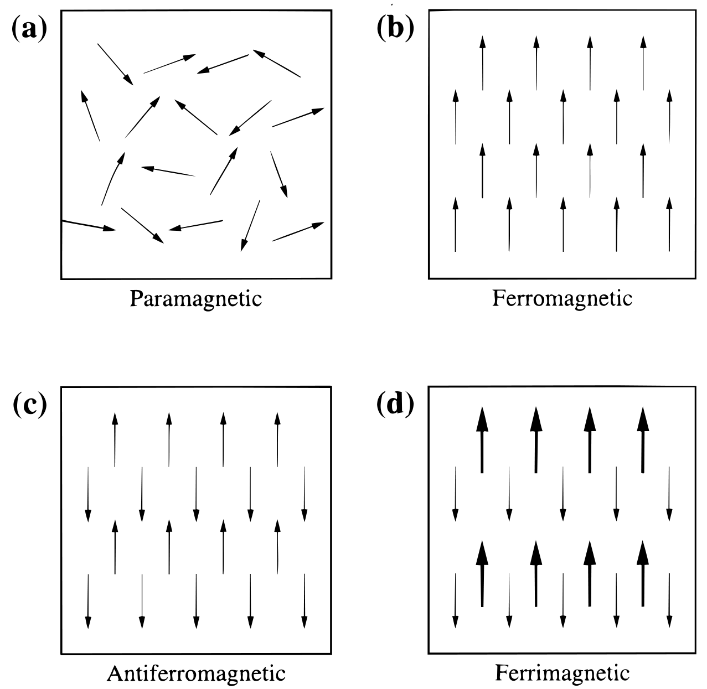 -> [[../figures/electronic-bands-cdw-transport|CDW与输运性质]]
  - **图示描述**：示意三种基本磁结构中原子磁偶极矩（小箭头）的排列方式，(a) 顺磁态方向随机，(b) 铁磁态全部平行排列，(c) 反铁磁态相邻偶极矩反向平行。
  - **关键特征**：顺磁态高温下热运动主导，宏观磁矩为零；铁磁态产生非零净磁化并可被外场翻转；反铁磁态虽微观有序但宏观磁矩相消。该图为讨论"磁性要求部分填充 d 轨道并发生自旋有序"提供直观定义。
  - 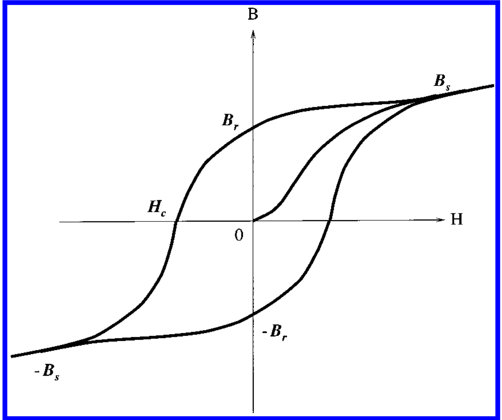 -> [[../figures/electronic-devices-memory-transistors|存储器与晶体管]]
  - **图示描述**：横轴为外加磁场 H，纵轴为磁感应强度 B（或磁化强度 M），描绘铁磁/亚铁磁体在循环外场下的闭合磁滞回线，并标出饱和磁感应 Bs、剩余磁感应 Br 和矫顽力 Hc。
  - **关键特征**：撤去外场后保留剩磁 Br 是磁存储的物理基础；反向矫顽场 Hc 决定数据保持的稳定性；近方形回线适合存储，窄回线适合变压器铁芯。作者以此说明多铁材料若同时具备电极化与磁滞回线，将可承载多态存储等新功能。
  - 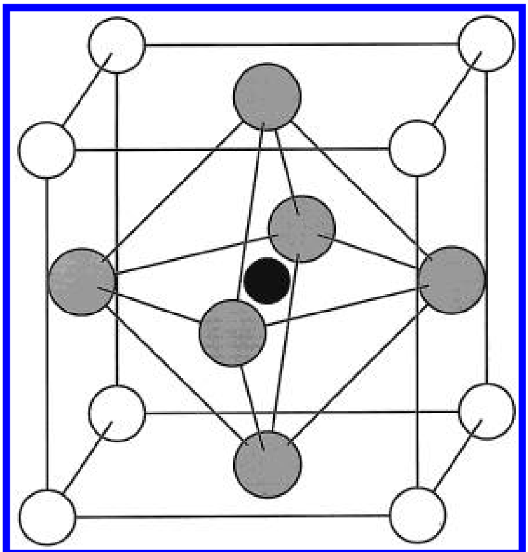 -> [[../figures/crystal-structures-bulk|体相晶体结构]]
  - **图示描述**：ABO3 立方钙钛矿晶胞的球棍模型，大 A 阳离子占据立方体八个顶角，小 B 阳离子位于体心，被六个灰色氧阴离子构成的正八面体包围。
  - **关键特征**：B 位离子处于氧八面体中心，居里温度以下沿 <111> 或 <100> 方向偏心位移即可产生自发极化；A 位离子半径与 A–O 共价性会通过晶格应变远程影响铁电稳定性。此结构是讨论 d0 规则与 BiMnO3、YMnO3 两个反例的共同结构起点。
  -  -> [[../figures/mathematical-models-computational|计算方法与泛函]]
  - **图示描述**：横轴为 B 位阳离子相对氧八面体中心的位移，纵轴为势能，绘出钙钛矿铁电体典型的"W"形双势阱曲线，左右两个极小值对应两种相反方向的偏心位置。
  - **关键特征**：高温顺电相离子在中心附近振动，越过势垒在两阱间往返；低温铁电相离子"冻结"于某一势阱，产生可被电场翻转的自发极化；软模理论中该势垒对应铁电声子频率在 Tc 处软化至零。它把位移型铁电相变浓缩为一个唯象图像，也是后文判断"d 电子占据是否填平双势阱"的判据。
  - 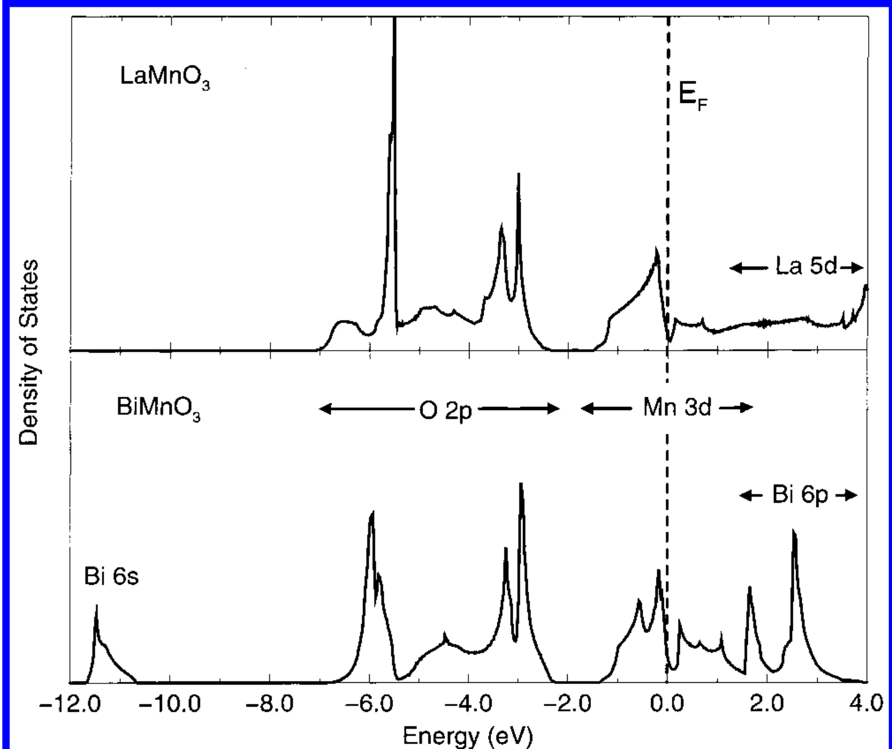 -> [[../figures/electronic-bands-dos-fermi|态密度与费米面]]
  - **图示描述**：左右并列两幅 DFT 态密度图，分别为立方顺磁相 LaMnO3 和 BiMnO3，能量范围约 -12 eV 到 4 eV，费米能级置零，宽峰 -7~-2 eV 为 O 2p，其上为经晶体场劈裂的 Mn 3d t2g/eg 子带。
  - **关键特征**：两图中费米能级均切入 Mn 3d t2g 高态密度区，预示立方相应发生自旋极化或结构畸变；BiMnO3 在 -12~-10 eV 多出一条孤立的 Bi 6s 占据带，LaMnO3 无对应峰；Bi 6p 与 O 2p 形态显著不同，为 Bi–O 共价杂化提供第一手证据。
  - 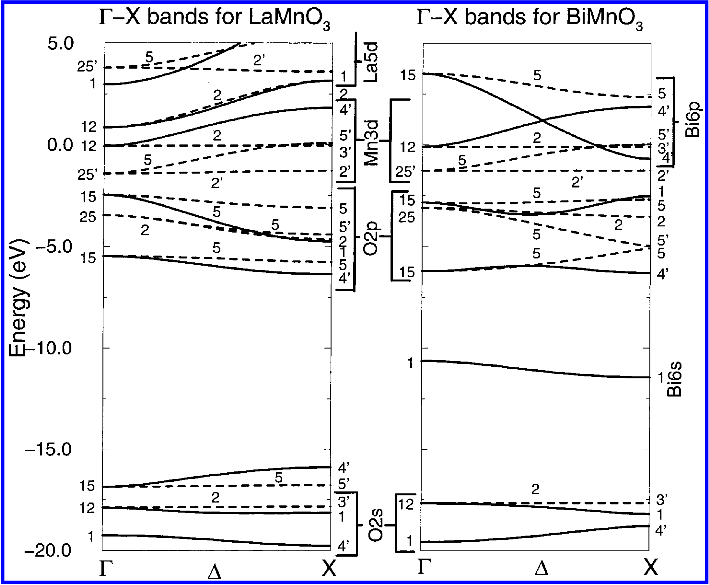 -> [[../figures/electronic-bands-band-structures|能带结构与带隙]]
  - **图示描述**：沿简单立方布里渊区 Γ→X 方向的能带放大图，以实线标出 Δ1 对称性能带、虚线为其余能带，并在 Γ、X 点旁标注 X1、X'4 等不可约表示，能量轴向下延伸以纳入低能 O 2s 与 La 5p 半芯态。
  - **关键特征**：LaMnO3 中两条 O 2p Δ1 带从 Γ 到 X 单调下降、Mn 3d Δ1 带单调上升，可用仅含 Mn 3d/O 2p 的基组良好拟合；BiMnO3 中强色散的 Bi 6p Δ1 带穿越 Mn 3d Δ1 带并在 X 附近落入费米能级以下，使 X 点电荷密度出现明显 Bi 分量，正是紧束缚拟合必须引入 Bi 6s/6p 轨道的原因。
  - 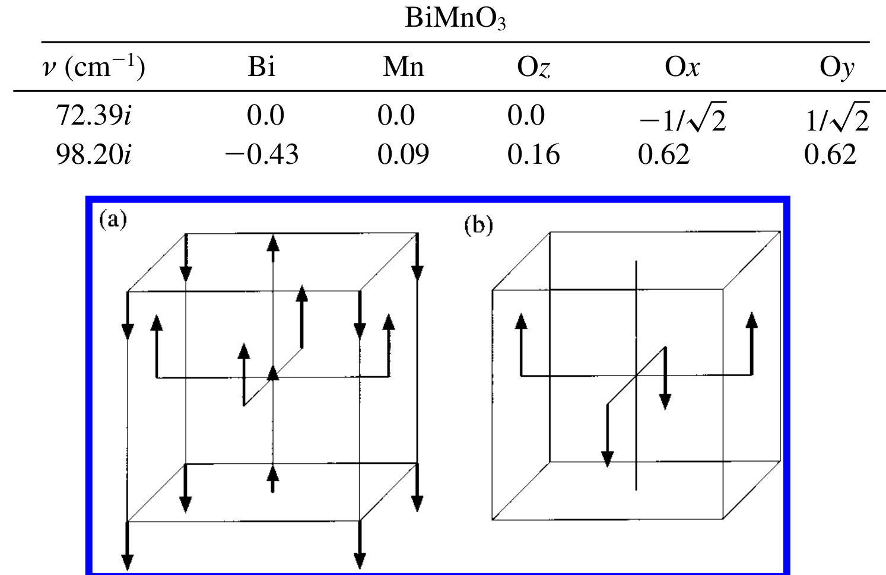 -> [[../figures/vibrational-spectra|振动光谱]]
  - **图示描述**：两幅晶胞示意图以箭头表示 Γ 点不稳定光学声子的原子位移方向与相对振幅，(a) 为铁电型不稳定模，大的 A 位（Bi/La）阳离子与氧笼反向运动；(b) 为非铁电模，主要由赤道面氧原子转动构成。
  - **关键特征**：BiMnO3 铁电模虚频约 82.30i cm⁻¹，约为 LaMnO3（21.1i cm⁻¹）的两倍，不稳定性显著更强；本征矢中 Mn 与氧同向移动、几乎不主导位移，与 BaTiO3 中 Ti 驱动的图像相反；这说明 BiMnO3 的铁电性由 A 位 Bi–O 共价性驱动，绕开了对 B 位 d0 的要求。
  - 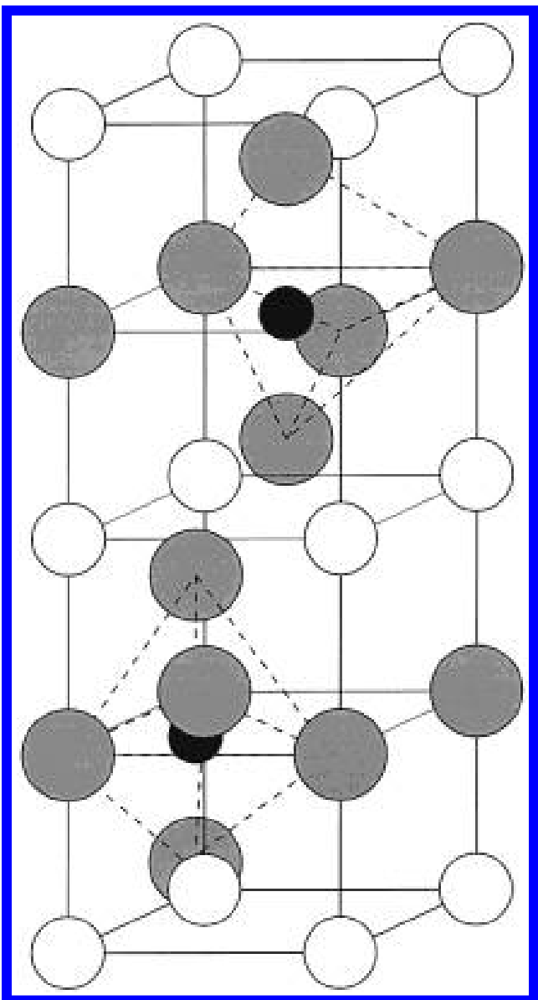 -> [[../figures/crystal-structures-bulk|体相晶体结构]]
  - **图示描述**：YMnO3 六方钙钛矿（P63cm）高温顺电结构，展示密排氧层的 ABC–ACB 堆垛，Mn 位于五配位三角双锥位置，Y/稀土占据七配位空隙。
  - **关键特征**：Mn 由立方相的 6 配位八面体变为 5 配位三角双锥（dsp3 杂化），配位多面体本身缺乏反演中心，为铁电偶极提供"结构双阱"；Y3+ 半径过小无法稳定立方钙钛矿，转而稳定该六方相；铁电居里温度约 914 K，奈尔温度约 80 K，是结构驱动绕开 d0 规则的代表。
  - 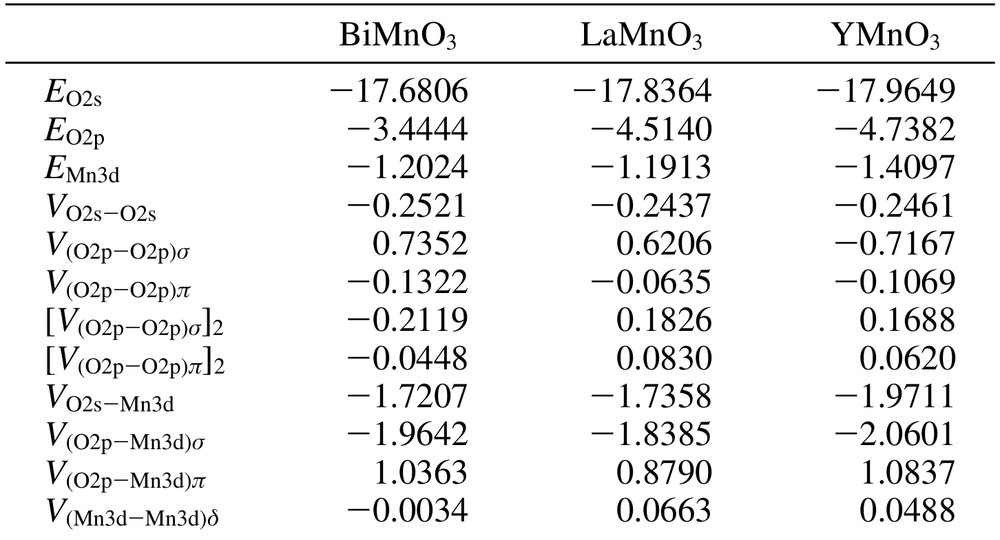 -> [[../figures/electronic-bands-band-structures|能带结构与带隙]]
  - **图示描述**：表格列出对 Γ→X 方向从头算能带做非线性最小二乘拟合得到的紧束缚参数，E 为轨道能、V 为最近邻（下标 2 为次近邻）原子间转移积分，单位 eV，对照 BiMnO3、LaMnO3、YMnO3 三种体系。
  - **关键特征**：仅用 Mn 3d + O 2s/2p 基组即可拟合 LaMnO3 与 YMnO3，RMS 偏差均约 0.20 eV，说明其物理由 Mn–O 杂化主导；BiMnO3 须加入 Bi 6s/6p 轨道才能把 RMS 从 0.25 eV 降到 0.12 eV，其中 σ 型 Bi 6p–O 2p 转移积分比 Bi 6s–O 2p 还大约 30%；YMnO3 因晶格常数 3.84 Å 小于 LaMnO3 的 3.95 Å，Mn–O 重叠增大约 10%，除此之外与 LaMnO3 几乎一致。
  - 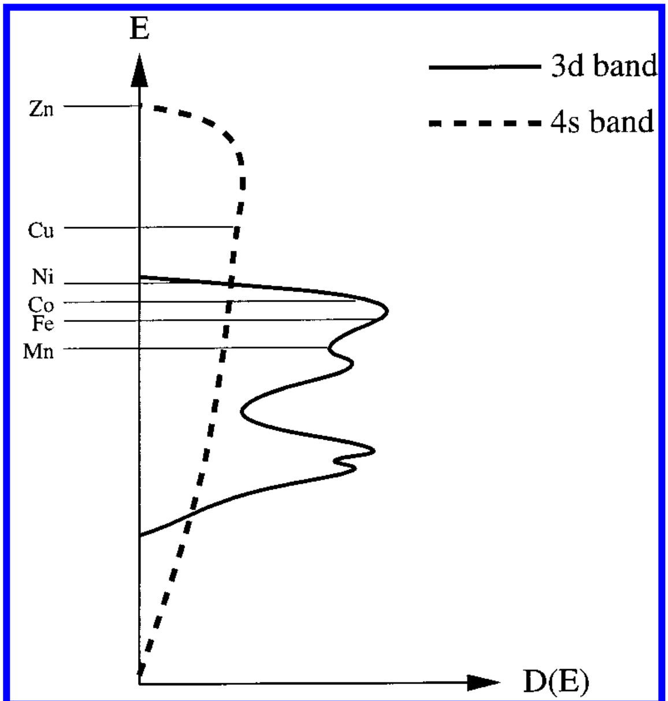 -> [[../figures/electronic-bands-dos-fermi|态密度与费米面]]
  - **图示描述**：纵轴为能量E，横轴为态密度D(E)，示意第一过渡系金属（Mn—Zn）的3d（实线）与4s（虚线）能带相对位置及费米能级；3d带窄而态密度高，4s带宽而态密度低。
  - **关键特征**：Fe、Co、Ni的费米能级落在高态密度的3d带中，满足Stoner铁磁性条件；Cu、Zn的3d带填满或接近填满而无磁性，说明磁性需要费米面处未填满的d电子。
  - 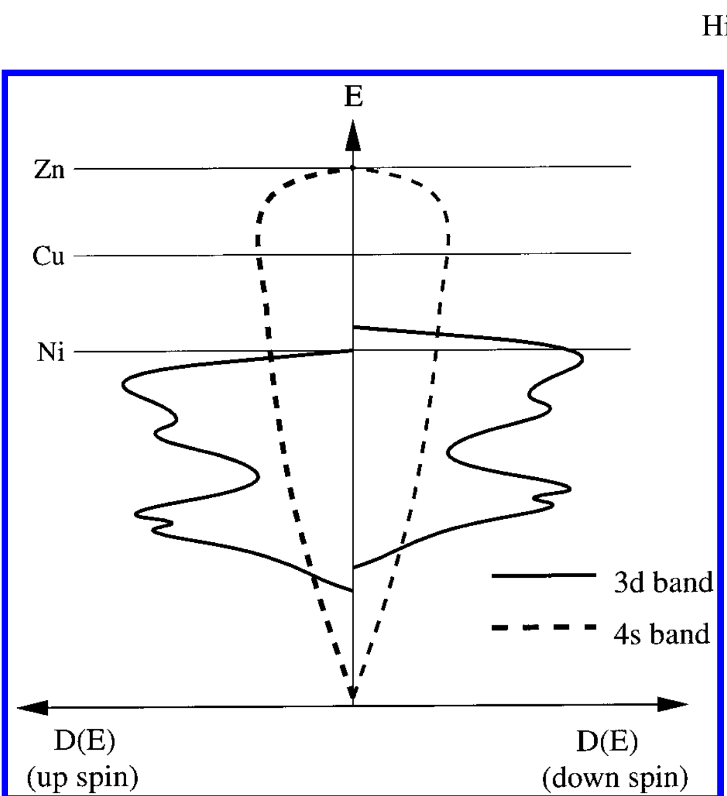 -> [[../figures/electronic-bands-cdw-transport|CDW与输运性质]]
  - **图示描述**：纵轴为能量，左右横轴分别为自旋向上与自旋向下的态密度，展示引入交换作用后3d带与4s带的自旋劈裂；多数自旋与少数自旋能带发生相对刚性位移。
  - **关键特征**：交换劈裂使上下自旋能带占据数不等，从而产生净磁矩；Ni处多数自旋3d带填满而少数自旋未填满，解释了非整数原子磁矩，也表明磁性要求d轨道部分占据。
  - 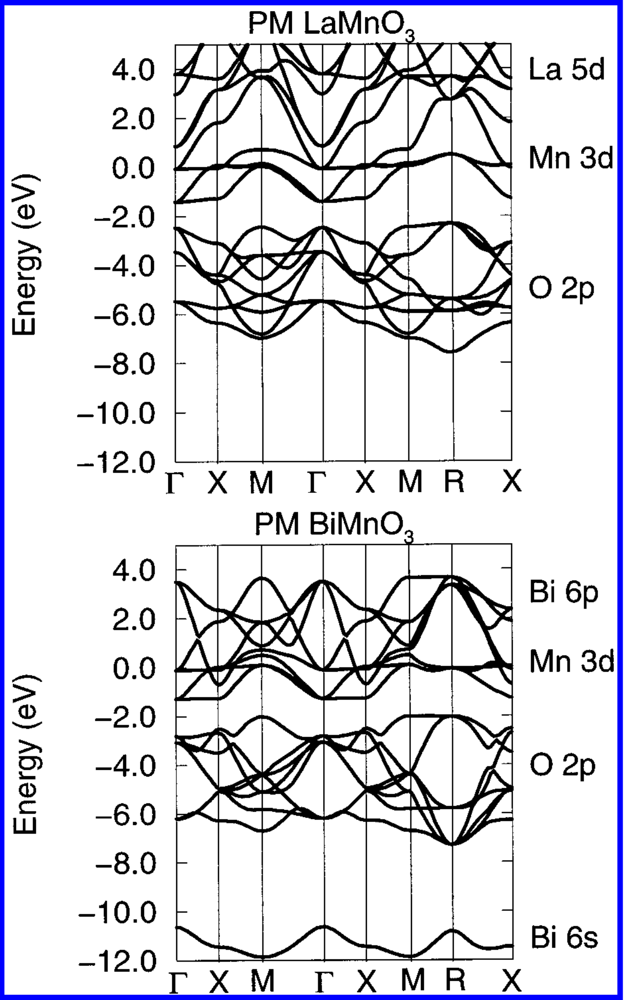 -> [[../figures/electronic-bands-band-structures|能带结构与带隙]]
  - **图示描述**：上下两幅能带图分别为立方顺磁相LaMnO3和BiMnO3，能量范围约-12~4 eV，高对称路径为Γ-X-M-Γ-X-M-R-X；右侧标注主要轨道成分La 5d/Mn 3d/O 2p与Bi 6p/Mn 3d/O 2p/Bi 6s。
  - **关键特征**：BiMnO3在-12~-10 eV出现孤立的Bi 6s占据带，Bi 6p带位于O 2p之上并与Mn 3d存在较强杂化，为A位孤对电子驱动铁电性提供了电子结构证据。
  - 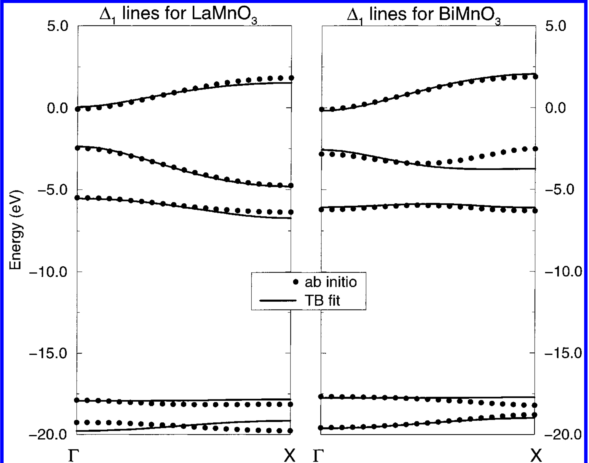 -> [[../figures/electronic-bands-band-structures|能带结构与带隙]]
  - **图示描述**：左右两幅Δ1对称性能带图对比LaMnO3与BiMnO3，黑色圆点为从头算结果，实线为紧束缚拟合；拟合基组仅含Mn 3d与O 2s/2p。
  - **关键特征**：LaMnO3的Δ1能带可被Mn-O基组较好复现，RMS约0.20 eV；BiMnO3的拟合明显偏离，RMS约0.25 eV，说明仅用Mn-O杂化无法描述其能带，必须引入Bi轨道。
  - 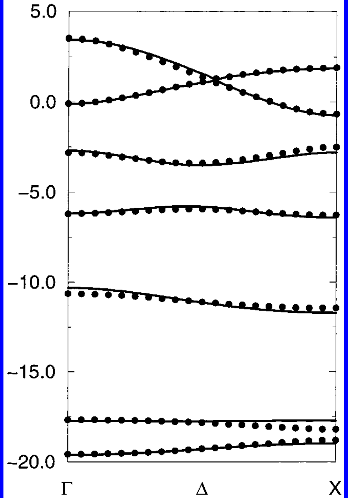 -> [[../figures/electronic-bands-band-structures|能带结构与带隙]]
  - **图示描述**：BiMnO3沿Γ-Δ-X的Δ1对称性能带，黑点为从头算结果，实线为加入Bi 6s/6p轨道后的紧束缚拟合。
  - **关键特征**：引入Bi轨道后拟合质量显著提高，RMS降至约0.12 eV；Bi 6p Δ1带被压低并与Mn 3d带交叉，显示Bi-O强共价杂化是BiMnO3电子结构的关键。
  - 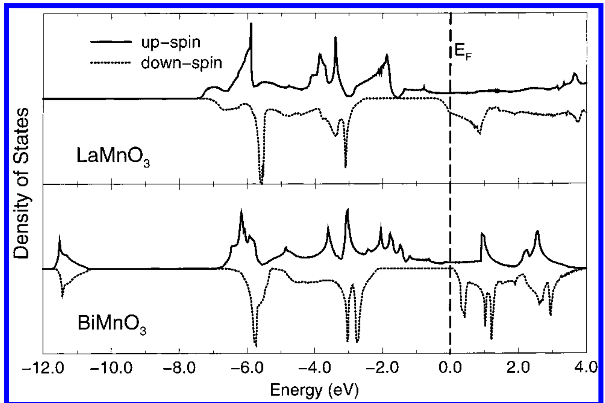 -> [[../figures/electronic-bands-dos-fermi|态密度与费米面]]
  - **图示描述**：上下两幅自旋极化总态密度图分别为立方铁磁LaMnO3和BiMnO3；实线代表自旋向上（正轴），虚线代表自旋向下（负轴），费米能级置零。
  - **关键特征**：BiMnO3低能区出现Bi 6s峰，Mn 3d自旋劈裂导致上下自旋占据不对称；顺磁态中观察到的Bi-O共价特征在铁磁相中依然保留，说明Bi驱动机制不依赖于磁序。
  - 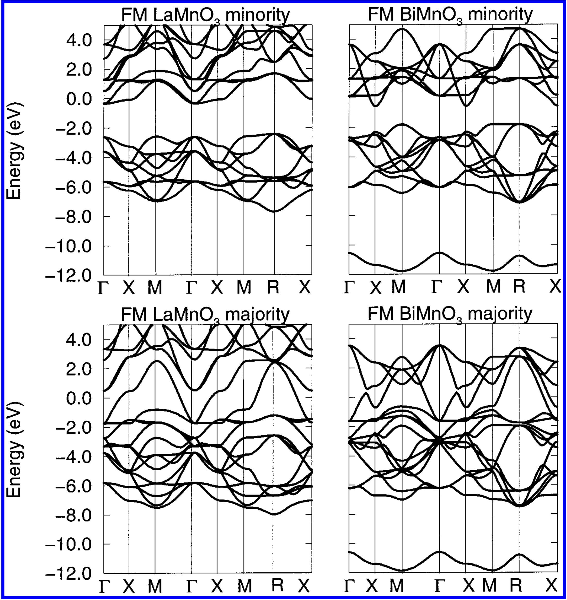 -> [[../figures/electronic-bands-band-structures|能带结构与带隙]]
  - **图示描述**：四幅能带图展示立方铁磁LaMnO3与BiMnO3的少数自旋（上排）和多数自旋（下排）能带沿Γ-X-M-Γ-X-M-R-X的色散。
  - **关键特征**：自旋极化后两种材料仍保持与顺磁计算类似的差异；BiMnO3少数自旋导带具有Bi 6p成分，为文中讨论的电子铁电性可能提供了能带结构线索。
  - 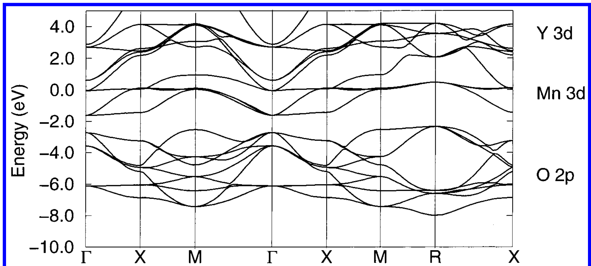 -> [[../figures/electronic-bands-band-structures|能带结构与带隙]]
  - **图示描述**：立方顺磁YMnO3的能带结构，能量范围约-10~4 eV，高对称路径为Γ-X-M-Γ-X-M-R-X；右侧标注Y 3d、Mn 3d、O 2p主要成分。
  - **关键特征**：与LaMnO3类似，费米能级切入Mn 3d带，Y 3d位于高能区且与O 2p杂化弱，表明Y-O键以离子性为主；其电子结构与LaMnO3高度相似，预示铁电性并非来自电子机制。
  - 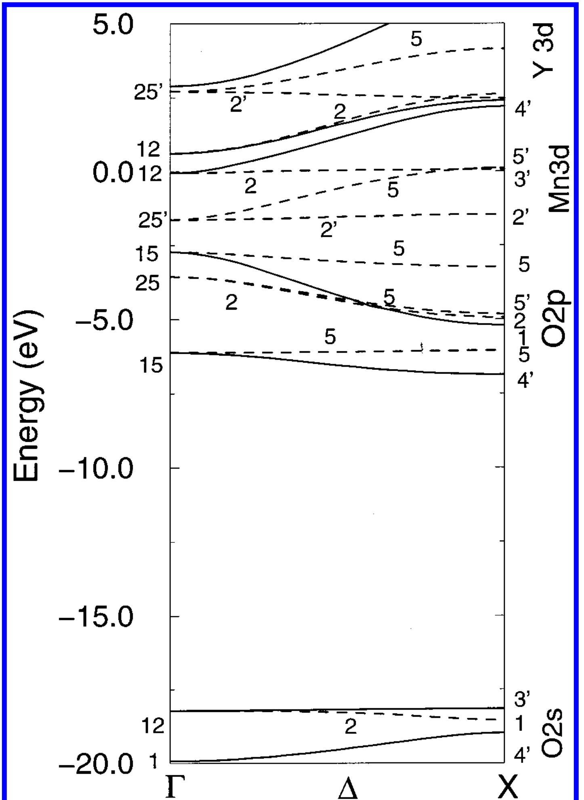 -> [[../figures/electronic-bands-band-structures|能带结构与带隙]]
  - **图示描述**：YMnO3沿Γ-Δ-X的Δ1对称性能带，包含从头算数据与紧束缚拟合曲线；图中标注了各能带的对称性编号与轨道成分。
  - **关键特征**：紧束缚参数与LaMnO3接近，仅因晶格常数较小导致Mn-O重叠增大约10%；该图说明立方相YMnO3的成键由Mn-O杂化主导，支持其铁电性源自六方结构而非A位共价性。
  - 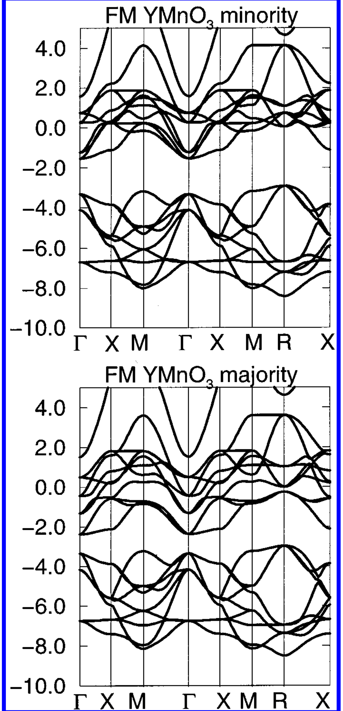 -> [[../figures/electronic-bands-band-structures|能带结构与带隙]]
  - **图示描述**：两幅能带图展示立方铁磁YMnO3的少数自旋与多数自旋能带沿Γ-X-M-Γ-X-M-R-X的色散。
  - **关键特征**：自旋极化后YMnO3能带与LaMnO3铁磁能带类似，无Bi 6s/6p导致的额外低能带；进一步证明Y³⁺离子半径效应通过稳定六方相而非改变电子结构来实现多铁性。
  - 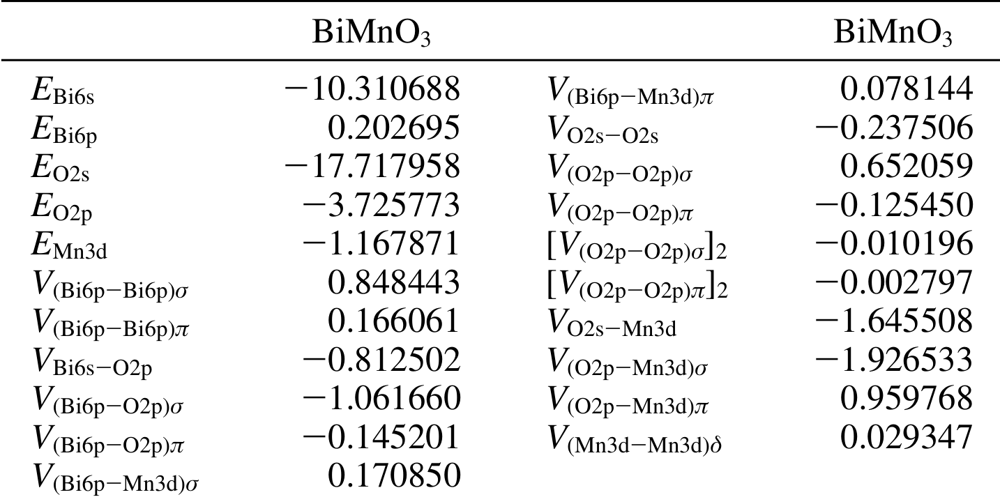 -> [[../figures/electronic-bands-cdw-transport|CDW与输运性质]]
  - **图示描述**：表2列出对BiMnO3含Bi 6s/6p基组的紧束缚拟合参数，包括轨道能量E（如E_Bi6s≈-10.31 eV）与原子间转移积分V（如Bi 6p-O 2p σ≈-1.06 eV），单位eV。
  - **关键特征**：Bi 6p-O 2p σ转移积分强度比Bi 6s-O 2p大约30%，Bi 6p-Bi 6p σ作用也很大；这些参数将Δ1能带拟合RMS降至0.12 eV，量化了Bi-O共价杂化对BiMnO3能带的决定性作用。

## 🔬 项目连接
project-2 Mn多铁。本文系统研究BiMnO3、YMnO3、LaMnO3等锰基钙钛矿中磁性与铁电性的共存机制，提出d0规则及孤对电子/几何结构两条破局路径，是Mn基多铁材料设计的经典理论基石。
## 🔗 项目双链
- 项目 [[../projects/project-2-mn-multiferroics|项目二：Mn极化结构铁电材料]]

## 📝 组织与用词
文章按"提出问题→分别回顾铁磁/铁电微观理论→逐一排除对称性、绝缘性、离子尺寸等因素→锁定d电子占据为关键→两个第一性原理案例（BiMnO3化学驱动 vs YMnO3结构驱动）→总结d0规则并展望"的侦探式逻辑展开。论证方法上以LaMnO3为共同对照，通过人为关闭自旋极化、固定立方结构等"计算理想实验"分离变量。值得复用的术语：
  - d0规则 ([[../concepts/d0-rule|d0 rule]] / d0-ness)
  - 立体化学活性孤对电子 ([[../concepts/stereochemically-active-lone-pair|stereochemically active lone pair]])
  - 姜-泰勒畸变 ([[../concepts/jahn-teller-distortion|Jahn-Teller distortion]])
  - 软模 ([[../concepts/soft-mode|soft mode]])
  - 双势阱 ([[../concepts/double-well-potential|double-well potential]])
  - 超交换 ([[../concepts/superexchange|superexchange]])
  - 共价杂化 (covalent hybridization)
  - 几何/结构铁电性 ([[../concepts/geometric-ferroelectricity|geometric ferroelectricity]])
## ✏️ 可写入 Wiki 的要点
  1. **d0规则**：在标准钙钛矿氧化物中，B位位移型[[../concepts/ferroelectricity|铁电性]]要求B阳离子形式上为d0构型（如Ti4+、Zr4+、Nb5+）；而磁性（铁磁/反铁磁/亚铁磁）要求d轨道部分填充。同一离子无法同时满足，是磁电多铁材料稀少的根本化学矛盾。
  2. **抑制铁电的是d电子占据本身而非磁序**：通过人为令自旋向上/向下密度相等来"关闭磁性"，LaMnO3的铁电虚频并未显著恢复（顺磁→铁磁仅使铁电模从较弱进一步减弱至21.1i cm⁻¹），说明 d 轨道占据才是压制偏心位移的主因，自旋极化是次要因素。
  3. **BiMnO3的化学破局**：[[../concepts/tight-binding|紧束缚]]拟合表明，仅用Mn 3d-O 2p基组即可拟合LaMnO3能带（RMS=0.20 eV），但BiMnO3必须加入Bi 6s/6p轨道（RMS从0.25降至0.12 eV）；Bi 6p-O 2p σ转移积分比Bi 6s-O 2p还大约30%。Bi-O共价性削弱Mn-O反铁磁[[../concepts/superexchange|超交换]]，解释了其异常[[../concepts/ferromagnetism|铁磁性]]；铁电软模虚频（82.30i cm⁻¹）约为LaMnO3两倍，本征矢显示Bi与氧笼反向运动而Mn几乎不动，即A位驱动的铁电性。
  4. **YMnO3的结构破局**：立方相YMnO3的电子结构和紧束缚参数与LaMnO3高度相似（Y 4d-O 2p为离子性，无显著共价杂化），仅Mn-O重叠因晶格常数小（3.84 Å vs 3.95 Å）增大约10%。其铁电性源于Y3+半径过小无法稳定立方钙钛矿，转而形成六方P63cm结构，Mn处于5配位三角双锥（dsp3杂化），配位几何本身非中心对称，从而绕过d0规则。
  5. **对称性并非瓶颈**：122个Shubnikov点群中有13个（1, 2, 2′, m, m′, 3, 3m′, 4, 4m′m′, m′m2′, m′m′2′, 6, 6m′m′）同时允许自发极化P和磁化M，数量不可忽略，故对称性限制不是多铁稀少的主因。
  6. **绝缘性也非主因**：铁电体须为绝缘体以维持可翻转极化；虽然元素铁磁体多为金属，但反铁磁体、亚铁磁体和弱铁磁体通常是绝缘体，而反铁磁铁电体同样稀少，说明不能简单归咎于磁性绝缘体短缺。
  7. **[[../concepts/jahn-teller-distortion|Jahn-Teller畸变]]是竞争性畸变**：Mn3+(d4)、Ti3+(d1)等离子的d型Jahn-Teller畸变使氧八面体沿c轴协同拉长并伴随轨道有序，"冻结"了另一条结构失稳通道，压制偏心铁电位移；因此Fe3+(d5)、Cr3+(d3)等非Jahn-Teller离子更适合作为多铁材料的磁性源。
  8. **BiFeO3的预示**：文中指出BiFeO3在1110 K以下铁电、奈尔温度约670 K（反铁磁），并表现出线性磁电效应（磁场诱导[[../concepts/weak-ferromagnetism|弱铁磁性]]及极化大幅增加）；Fe3+为d5非Jahn-Teller离子，Bi-O[[../concepts/lone-pair-electrons|孤对电子]]驱动铁电，是d0规则例外的典型代表，后被证实为室温多铁标杆。
  9. **电子铁电性猜想**：在立方相BiMnO3中观察到同对称性Bi 6p与Mn 3d能带交叉（杂化为零）及Mn 3d→Bi 6p[[../concepts/charge-transfer|电荷转移]]，可能满足Portengen等提出的d-f（此处为d-p）[[../concepts/exciton-condensation|激子凝聚]]条件，预言约10 μC/cm²的内建极化，提供一种不依赖离子位移的铁电机制。
  10. **方法学**：采用平面波赝势(CASTEP 2.1)+LSDA，平面波截断60 Ry，6×6×6 Monkhorst-Pack k网格，对Mn使用部分非线性芯态修正的优化赝势；通过Hellmann-Feynman力（位移0.1 Å）构建Γ点力常数矩阵并由声学求和规则提取声子频率，以虚频判定铁电不稳定性。
