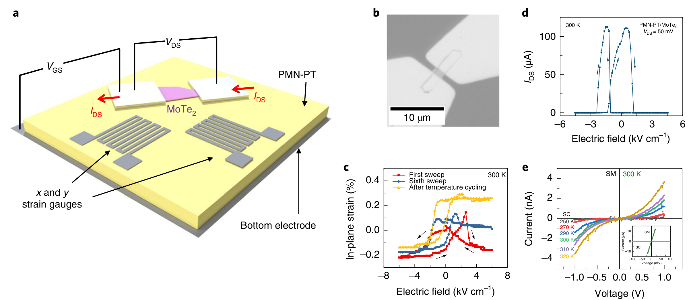
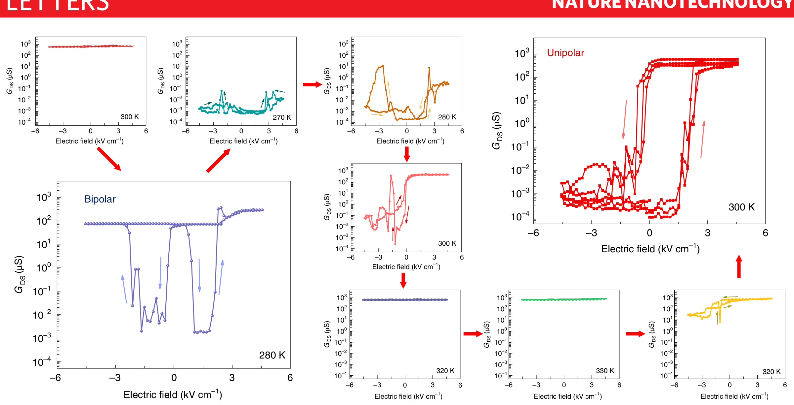
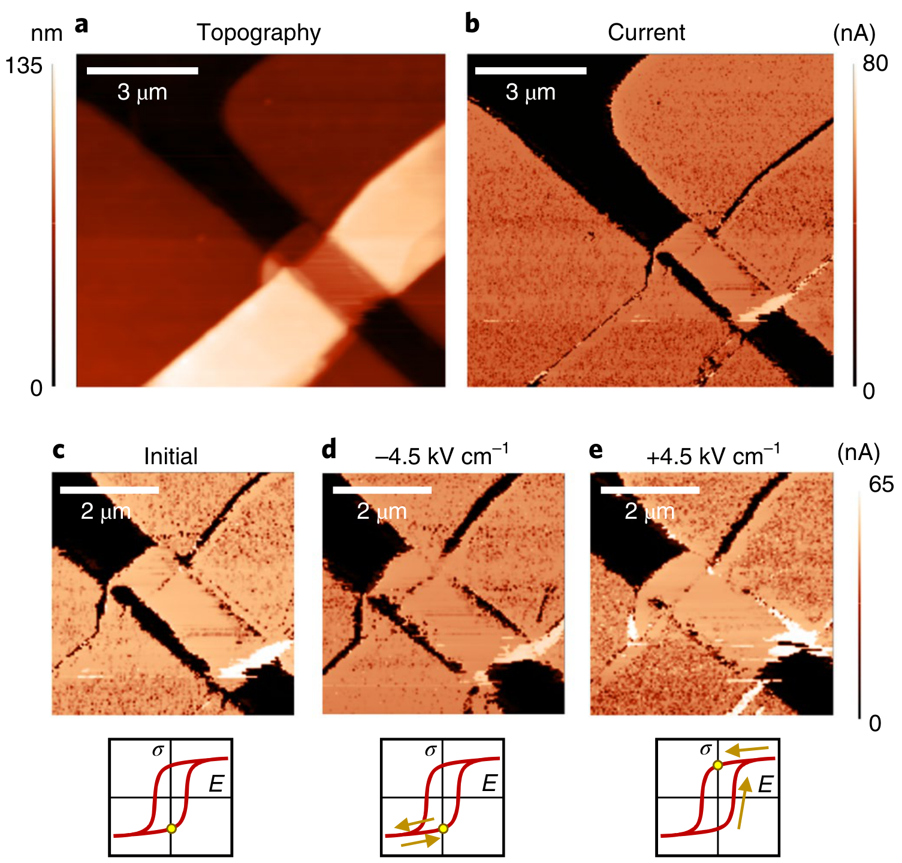
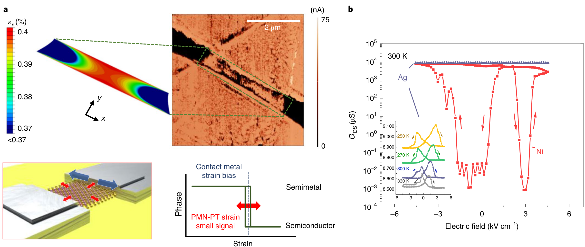

## houStrainbasedRoomtemperatureNonvolatile2019 — 应变型室温非挥发MoTe2铁电相变晶体管

## 📄 元数据
Wenhui Hou, Ahmad Azizimanesh, Arfan Sewaket, Tara Peña, Carla Watson, Ming Liu, Hesam Askari, Stephen M. Wu 等，2019，*Nature Nanotechnology* 14(7), 668–673，DOI: 10.1038/s41565-019-0466-2

## 💡 一句话
首次在三端FET结构中，用铁电体PMN-PT产生的电场诱导应变（而非电场本身）驱动1T′-MoTe2在半金属相与半导体相之间室温可逆、非易失地切换，实现 G_on/G_off ≈ 10^7 的开关比，开辟"应变电子学（straintronics）"新范式。

## 🔗 Wiki 双链
  - 概念 [[../concepts/strain-engineering]]
  - 概念 [[../concepts/2D-materials]]
  - 概念 [[../concepts/ferroelasticity]]
  - 概念 [[../concepts/polarization-switching]]
  - 实体 [[../entities/TMDs]]
  - 图表 [[../figures/heterostructures-stacking]]
  - 图表 [[../figures/electronic-devices]]
  - 图表 [[../figures/experimental-setups]]
  - 图表 [[../figures/vibrational-spectra]]
  - 年度 [[../write/2019]]
  - 相关论文 **houStrainbasedRoomtemperatureNonvolatile2019**

## 🆕 新概念/实体建议
  - `mo-te2`（实体）：二碲化钼，TMD中1T′（半金属）与2H（半导体）相能量差最小，~0.3%拉伸应变即可诱导相变，是应变相变器件的核心沟道材料；本文发现的应变诱导半导体相并非标准2H相。
  - `pmn-pt`（实体）：Pb(Mg1/3Nb2/3)0.71Ti0.29O3 弛豫铁电单晶，居里温度135 °C，逆压电应变量级~0.4%，常用作电场可控应变源；本文以0.25–0.3 mm厚单晶作为栅介质/衬底。
  - `straintronics`（概念）：应变电子学，以电场诱导的机械应变（而非电场直接调控载流子）作为开关控制量，结合二维材料与铁电体，规避传统FET亚阈值摆幅60 mV/dec极限和静态功耗问题。
  - `phase-change-transistor`（概念）：相变晶体管，通过材料半金属-半导体（或其他电子相）可逆相变实现沟道开关，开态金属性、关态由背靠背肖特基结限流。
  - `contact-stress-bias`（概念）：接触应力偏置，利用沉积金属（如Ni，0.58 GPa拉应力）的薄膜内应力对沟道施加静态拉伸应变，将其预置在相变临界点附近，再由铁电体小信号应变跨过相界——"机械直流偏置"设计范式。
  - `schottky-junction`（概念）：金属-半导体接触形成的整流势垒；本文关态由Ni/相变MoTe2构成的两个背靠背肖特基二极管实现低漏电。

## 📊 关键图表
  -  -> [[../figures/electronic-devices|电子与突触器件]]
    - **图示描述**：图1展示器件结构与基本操作。(a) 为PMN-PT/1T′-MoTe2/Ni三端叠层示意，含同材料Ni薄膜应变计；(b) 为PMN-PT(011)上MoTe2薄片的光学照片（比例尺10 μm）；(c) 为Ni应变计测得的面内应变–电场（kV cm⁻¹ vs %）蝴蝶曲线，对比第1次、第6次扫描及温度循环后由双极演变为单极的回线；(d) 为13 nm MoTe2器件的IDS–EGS转移特性（W/L=2）；(e) 为半金属态（SM，线性欧姆）与半导体态（SC，非线性整流）的I–V对比，插图放大SM态。
    - **关键特征**：(c) 中应变峰峰约0.4%，是铁电体逆压电应变量化值；(d) 转移曲线与(c) 应变蝴蝶曲线形状高度同步，直接证明沟道电导由应变驱动而非电场直接耗尽载流子；13 nm器件室温下可逆开关超过一个数量级；(e) 半导体态在低偏压下表现为两个背靠背肖特基二极管，是相变后出现带隙的"电学指纹"，而制备态只有1T′相（无带隙），肖特基行为仅在低导态出现。
    - **结论/意义**：建立"电场→PMN-PT应变→MoTe2相变→电导开关"的因果链，并从I–V指纹确证低导态为半导体相，是整篇论文的核心机制证据。

  -  -> [[../figures/electronic-devices|电子与突触器件]]
    - **图示描述**：图2为9个子图组成的对数坐标GDS–EGS曲线阵列，展示70 nm（约100层）MoTe2器件在300 K→270 K→330 K→回到300 K温度循环下，栅电场扫描过程中沟道电导（μS）的演化。
    - **关键特征**：低温（270 K、280 K）有利于半导体相（低电导），高温（330 K）有利于半金属相（高电导），与2H-MoTe2低温更稳定的既有结论一致；随电场反复扫描，曲线由初始对称双极蝴蝶型逐渐演变为不对称单极回线，零场下保留两个稳定应变状态，即非易失性来源；最终300 K态实现Gon/Goff ≈ 6.2×10⁶（摘要给出约10⁷），并在后续3个循环中保持鲁棒；对70 nm厚沟道而言，传统FET因电场屏蔽只能实现<1个数量级的调制。
    - **结论/意义**：证明通过"温度+电场"训练可获得稳定的非易失单极开关，且巨大开关比不受沟道厚度屏蔽限制，从性能上超越传统2H-MoTe2 FET。

  -  -> [[../figures/electronic-devices|电子与突触器件]]
    - **图示描述**：图3为图2器件在低电导态下的导电原子力显微镜（CAFM）结果。(a) 表面形貌图；(b) 对应电流图，显示接触边缘附近大面积低电流（深色）非导电区；(c–e) 为三种栅压脉冲设置下的电流图，分别对应初始态、同向脉冲后和反向脉冲后，图中以滞回环示意脉冲方向。
    - **关键特征**：低导态下非导电区局域在接触电极边缘，对应应变集中诱发的MoTe2半导体相；同向脉冲使非导电区在源/漏两侧对称出现并保留，反向脉冲后两侧非导电区"闭合"、沟道恢复高电导，证明相变可被栅压电脉冲可逆写入/擦除；所有器件的CAFM均未在距接触边缘250–500 nm以外观察到电导变化，表明相变主要发生在接触下方而沟道中部仍由1T′金属相连接。
    - **结论/意义**：在实空间直接"看到"接触边缘的应变诱导相变及其脉冲可逆性，将宏观电学开关与局域结构相变联系起来，是接触应变偏置机制最直观的可视化证据。

  -  -> [[../figures/electronic-devices|电子与突触器件]]
    - **图示描述**：图4验证接触应力的作用。(a) 左侧为PMN-PT(111)上50 nm MoTe2（W/L=6.3）Ni接触器件的CAFM电流图，中间为给定边缘夹持拉伸应变时沟道εx分布的有限元（FEA）模拟，下方为"接触静态应变（蓝）+PMN-PT电场可控动态应变（红）"协同越过相界的机理示意；(b) 为Ag接触（−0.2 GPa低压应力）与Ni接触（0.58 GPa拉应力）器件GDS–EGS对比，插图为Ag器件的变温演化。
    - **关键特征**：FEA应变分布与CAFM电流图像形状高度吻合，(111)取向衬底上仍出现相变表明该机制对铁电取向不敏感；由接触应力计算得接触处施加约0.4%拉伸应变，结合CAFM测得的半导体区延伸长度提取相变应变量化阈值约0.33%，与MoTe2相变的实验和理论预测一致；Ag接触13个器件所有温度下仅约4%电导调制，Ni器件达约10⁹%调制（量级差异）；高拉应力绝缘MgF2封装低应力Ag接触后可恢复大开关，形成"拉伸应力源必需"的闭环对照。
    - **结论/意义**：通过Ni/Ag/MgF2对照与FEA模拟确证"静态接触拉伸应变偏置+铁电动态应变调制"是相变开关的必要设计范式，并定量给出相变阈值应变。

## 🔬 项目连接
无直接项目连接。概念上与 project-5（SnTe铁电模拟）共享"铁电+二维材料"主题，但本文为实验性应变相变器件，研究对象（MoTe2 vs SnTe）和方法（器件输运/CAFM vs 模拟）均不同，不构成直接项目连接。

## 🔗 项目双链
- 项目 [[../projects/project-5-snte-ferroelectric-sim|项目五：lammps势函数SnTe铁电模拟]]

## 📝 组织与用词
文章按"问题（FET纳米尺度漏电与玻尔兹曼暴政）→方案（应变替代电场的相变开关）→器件设计（静态接触应力偏置+铁电动态应变调制）→多维实验验证（宏观电学-应变计关联、I-V肖特基指纹、CAFM实空间成像、Ag/Ni/MgF2对照、变温、FEA模拟、拉曼）→性能与局限→展望"组织，证据链层层递进、正反对照严密。值得在wiki叙述中复用的关键词/术语：
  - Strain engineering / 应变工程 [[../concepts/strain-engineering|应变工程]]
  - Straintronics / 应变电子学
  - Phase-change transistor / 相变晶体管
  - Non-volatile strain switching / 非易失应变开关
  - Relaxor ferroelectric / 弛豫铁电体（PMN-PT）
  - Contact (thin-film) stress bias / 接触（薄膜）应力偏置
  - Butterfly curve / 蝴蝶曲线（应变-电场回线）
  - Back-to-back Schottky junction / 背靠背肖特基结
  - Elastic dipole / 弹性偶极子（内建偏置场来源）
  - Conductive atomic force microscopy (CAFM) / 导电原子力显微镜

## ✏️ 可写入 Wiki 的要点
  1. **核心机制**：以电场诱导铁电体PMN-PT的逆压电应变作为控制量，驱动1T′-MoTe2在[[../concepts/half-metal|半金属]]相与半导体相之间可逆相变，完全绕过传统FET用电场耗尽载流子的机制，从而不受60 mV/dec亚阈值摆幅限制，从根本上消除静态功耗。
  2. **器件架构**：PMN-PT(011)或(111)弛豫铁电单晶（0.25–0.3 mm厚，Au/Ti底电极）同时作为栅介质和应变源；机械剥离的1T′-MoTe2薄片（13–70 nm，低湿度<10% RH或手套箱中剥离以增强粘附）为沟道；35 nm电子束蒸发 Ni为源漏接触。制备温度严格控制在80 °C以下（远低于135 °C[[../concepts/curie-temperature|居里温度]]），避免[[../concepts/ferroelectric-domain|铁电畴]]被淬火细化到纳米尺度。
  3. **"静态偏置+动态调制"设计范式**：Ni接触沉积时在接触处施加0.58 GPa面内拉应力（对应~0.4%应变），将MoTe2预置在接近相界的"工作点"；PMN-PT施加~0.4%峰峰值的可逆电场可控应变作为"小信号"。由CAFM测得半导体区延伸长度结合FEA（MoTe2杨氏模量/泊松比取文献值）提取出相变应变量化阈值约0.33%。
  4. **性能数据**：13 nm器件首次观察到与应变蝴蝶曲线完全同步的室温可逆开关（>1个数量级）；70 nm（~100层）器件经温度循环训练后在300 K实现 G_on/G_off ≈ 6.2×10^6（摘要称~10^7），远优于任何接触方案、任何厚度的2H-MoTe2 FET（70 nm厚沟道在传统FET中因电场屏蔽只能实现<1个数量级调制）。开态为完全金属性（欧姆I-V），关态为两个背靠背肖特基二极管（低偏压下低电流）。
  5. **非易失性来源**：初始应变随电场呈对称双极"蝴蝶"回线；经反复电场循环后，Ni薄膜应力使PMN-PT内弹性偶极子定向排列，产生内建电场偏置，应变曲线由双极演变为单极，零场下保留两个稳定应变状态，即非易失性。该不对称性与铁电晶体取向、应变计方向无关。部分器件需多次栅压扫描"训练"后才出现稳定开关（可能与循环中MoTe2/铁电体粘附增强有关）。
  6. **CAFM实空间证据**：低电导态下在接触边缘观察到大面积非导电区（半导体相）；沿已设定方向加同向脉冲，非导电区在两侧接触边缘对称出现；反向脉冲后非导电区消失、沟道恢复导电。所有器件CAFM均未在距接触边缘250–500 nm以外观察到电导变化，表明相变主要发生在接触下方，沟道中部始终由1T′金属相连接。
  7. **对照实验确证拉应力必要性**：50 nm Ag接触（−0.2 GPa低压缩应力）13个器件在所有温度下仅~4%电导调制；Ni接触（0.58 GPa拉应力）达~10^9%调制；将Ag接触用高拉应力绝缘MgF2层封装后，大电导开关恢复，形成"应力源必需"的闭环验证。28个Ni器件中约8个低调制（(111)上1/3、(011)上1/4），归因于薄片落在单畴/多畴、畴极化方向、铁电应变相对接触方向、MoTe2晶向等不可控因素。以2H-MoTe2为起始材料加Ni接触未观察到相变。
  8. **温度依赖性**：270 K低温利于半导体相，330 K高温利于半金属相，与2H-MoTe2低温更稳定的既有结论一致；相界对应变高度敏感，温度循环可用于训练单极非易失行为。其他次要因素包括差异热收缩、薄膜应力随温度弛豫、PMN-PT压电系数温度依赖。
  9. **拉曼辨析新相**：通过透明双面抛光MgO衬底做背面拉曼（532 nm，2 mW）检测Ni接触下方相变材料，发现应变诱导半导体相并非标准2H-MoTe2，其额外拉曼峰与文献中应变或激光加热诱导的相变MoTe2特征相似，精确结构待定。
  10. **局限与展望**：耐久仅40–70次（归因于范德华层间滑移导致应变无法完全传递，建议减薄至单层以消除该变量）；速度受限于0.25–0.3 mm块体单晶需150 V/10 ms脉冲，薄膜铁电体（如HfO2基）有望达到亚纳秒至皮秒、阿焦/比特；该"铁电+[[../concepts/2D-materials|二维材料]]"平台可推广至电场调控磁性、拓扑、超导等量子相变。
