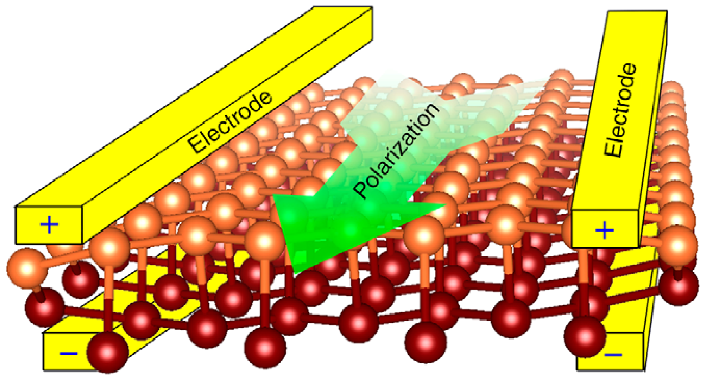
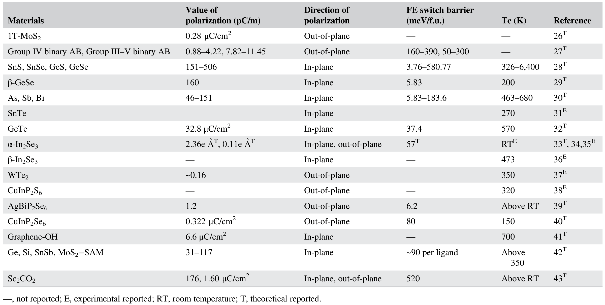

## huProgressProspectsLowdimensional2019 — 低维多铁性材料的研究进展与展望（Progress and prospects in low-dimensional multiferroic materials）

## 📄 元数据
Ting Hu、Erjun Kan（阚二军，南京理工大学应用物理系）et al.，2019，WIREs Computational Molecular Science，9(5): e1409，DOI: 10.1002/wcms.1409
## 💡 一句话
系统综述近十余年二维范德华铁电/多铁材料的理论预测与实验突破，将低维铁电性归纳为"本征—诱导—钙钛矿反常"三条路径，并把低维多铁性归纳为化学功能化、异质结堆叠、超铁电金属、Jahn-Teller 畸变、第二类磁致多铁等设计策略。

## 🔗 Wiki 双链
  - 概念 [[../concepts/multiferroicity]]
  - 概念 [[../concepts/2D-materials]]
  - 概念 [[../concepts/ferroelasticity]]
  - 概念 [[../concepts/magnetoelectric-coupling]]
  - 概念 [[../concepts/strain-engineering]]
  - 概念 [[../concepts/sliding-ferroelectricity]]
  - 概念 [[../concepts/ferroelectric-tunnel-junction]]
  - 概念 [[../concepts/polarization-switching]]
  - 概念 [[../concepts/density-functional-theory]]
  - 概念 [[../concepts/berry-phase]]
  - 概念 [[../concepts/spin-orbit-coupling]]
  - 概念 [[../concepts/topological-defects]]
  - 概念 [[../concepts/moire-superlattice]]（展望中提及）
  - 概念 [[../concepts/ferrielectricity|亚铁电性]]（AgBiP₂Se₆、CIPS 补偿型亚铁电序）
  - 概念 [[../concepts/hybrid-improper-ferroelectricity|杂化非本征铁电]]（FE 110-IP 三线性耦合）
  - 概念 [[../concepts/hyper-ferroelectric-metal|超铁电金属]]（CrN、CrB₂）
  - 概念 [[../concepts/type-ii-multiferroics|第二类多铁]]（磁序打破反演对称）
  - 概念 [[../concepts/jahn-teller-distortion|Jahn-Teller畸变]]（二阶JT图像、CrBr₃）
  - 概念 [[../concepts/tolerance-factor|容忍因子]]（分类FE 100-S/110-IP/110-P）
  - 概念 [[../concepts/group-v-elemental-ferroelectrics|V族单质铁电体]]（As/Sb/Bi单层）
  - 概念 [[../concepts/bulk-photovoltaic-effect|体光伏效应]]（IV族单硫族化物、AgBiP₂Se₆）
  - 概念 [[../concepts/transition-metal-thiophosphate|过渡金属硫代磷酸盐]]（CIPS、AgBiP₂Se₆家族）
  - 概念 [[../entities/hf2vc2f2|Hf₂VC₂F₂多铁MXene]]（120° Y型自旋序诱导面外极化）
  - 实体 [[../entities/TMDs]]（1T-MoS₂、MoS₂-SAM）
  - 实体 [[../entities/h-BN]]
  - 实体 [[../entities/In2Se3]]（α/β'-In₂Se₃）
  - 实体 [[../entities/WTe2]]（双层/三层拓扑半金属铁电）
  - 实体 [[../entities/SnTe]]（1-UC SnTe 薄膜 Tc 跃升至 270 K）
  - 实体 [[../entities/PbTe]]（双轴拉伸下由非铁电转为铁电）
  - 实体 [[../entities/BiFeO3]]（1-UC 四方相 FTJ，TER ~370%）
  - 实体 [[../entities/MXenes]]（Sc₂CO₂、Hf₂VC₂F₂）
  - 实体 [[../entities/SrMnO3]]（应变诱导多铁）
  - 实体 [[../entities/domain-wall]]
  - 实体 [[../entities/VASP]]
  - 实体 [[../entities/group-iv-monochalcogenides|IV族单硫族化物]]（GeS/GeSe/SnS/SnSe褶皱单层）
  - 实体 [[../entities/crbr3|CrBr₃]]（带电CrBr₃单层JT畸变FE+FM）
  - 实体 [[../entities/hf2vc2f2|Hf₂VC₂F₂]]（MXene，120° Y型自旋序诱导Type-II多铁）
  - 实体 [[../entities/c6n8h-organic-multiferroic|C₆N₈H有机多铁]]（无金属有机二维网络）
  - 图表 [[../figures/crystal-structures]]
  - 图表 [[../figures/electronic-bands]]
  - 图表 [[../figures/heterostructures-stacking]]
  - 图表 [[../figures/heterostructures-stacking-polar-cdw|极性金属、拓扑相、CDW与相变]]
  - 图表 [[../figures/electronic-devices]]
  - 图表 [[../figures/mathematical-models]]
  - 图表 [[../figures/optical-spectra]]
  - 图表 [[../figures/vibrational-spectra]]
  - 图表 [[../figures/experimental-setups]]
  - 图表 [[../figures/domain-walls]]
  - 年度 [[../write/2019]]
  - 主题 [[../topics/D02-多铁性材料]]
  - 项目 [[../projects/project-2-mn-multiferroics]]（SrMnO₃ 应变多铁及 Mn 基多铁综述脉络）
  - 项目 [[../projects/project-5-snte-ferroelectric-sim]]（1-UC SnTe 铁电增强、Tc 提升机理）
  - 相关论文 [[../../raw/note/huProgressProspectsLowdimensional2019]]

## 🆕 新概念/实体建议
（暂无）

## 📊 关键图表
  -  → [[../figures/heterostructures-stacking-polar-cdw|极性金属、拓扑相、CDW 与相变]]
  -  → [[../figures/heterostructures-stacking-polar-cdw|极性金属、拓扑相、CDW 与相变]]
  - 
  -  -> [[../figures/crystal-structures|晶体结构与原子排布]]
  -  → [[../figures/heterostructures-stacking-polar-cdw|极性金属、拓扑相、CDW 与相变]]
  -  -> [[../figures/crystal-structures|晶体结构与原子排布]]
  -  -> [[../figures/crystal-structures|晶体结构与原子排布]]
  -  -> [[../figures/mathematical-models|数学模型与物理公式]]
  -  -> [[../figures/heterostructures-stacking-multiferroic|多铁与磁电异质结]]

## 🔬 项目连接
  - project-2 Mn多铁：本文综述 SrMnO₃ 薄膜应变诱导的高温铁电+反铁磁多铁（Tc > 420 K，磁序出现后极化被自旋序诱导离子位移增强），可作为 Mn 基多铁脉络的对照与机制度量。
  - project-5 SnTe铁电模拟：本文详细引述 Chang 等 1-UC SnTe 面内铁电实验（Tc 由块体 98 K 升至 270 K，2–4 UC 室温铁电），以及 Liu 等关于 SnTe 超薄薄膜 FE 翻转势垒与 Tc 随厚度（<5 UC 上升、>5 UC 下降）非单调演化的第一性原理/有效哈密顿量分析，归因于杂化相互作用与 Pauli 排斥的竞争，直接对应 SnTe 铁电模拟主题。
  - project-7 CDW：无直接项目连接（1T-MoS₂ 的 c1T→d1T 三聚化属于电荷密度波/畸变讨论，但不是项目主题）。

## 🔗 项目双链
- 项目 [[../projects/project-2-mn-multiferroics|项目二：Mn极化结构铁电材料]]
- 项目 [[../projects/project-5-snte-ferroelectric-sim|项目五：lammps势函数SnTe铁电模拟]]
- 项目 [[../projects/project-7-cdw-charge-density-wave|项目七：CDW电荷密度波]]

## 📝 组织与用词
  - 论证结构遵循"挑战 → 平台 → 探索 → 设计 → 应用"链条：先指出三维铁电/铁磁在纳米尺度的尺寸效应、退极化场 [[../concepts/depolarization-field|退极化场]]、Mermin-Wagner 限制与 d⁰ 规则互斥；再以二维 vdW 材料无悬挂键、维度降低诱导对称破缺、比表面积大易调控为新平台；主体分为"低维铁电探索"（本征 vdW / 诱导 / 钙钛矿薄膜三小节）与"低维多铁探索"（Type-I 化学功能化、异质结、超铁电金属、JT 畸变；Type-II 磁序驱动）；最后落到 FTJ、体光伏、压电纳米发电机三类器件。
  - 表格用 T/E 标注理论与实验，明确该领域"理论先行、实验跟进"的发展节奏（表2 多铁材料几乎全为 T，提示领域早期阶段）。
  - 值得复用的关键词/术语：
    - 低维多铁性材料（low-dimensional multiferroic materials）
    - 范德华铁电体（van der Waals ferroelectrics）
    - 本征/诱导铁电性（intrinsic / induced ferroelectricity）
    - 亚铁电序（ferrielectric ordering）
    - 杂化非本征铁电 [[../concepts/hybrid-improper-ferroelectricity|杂化非本征铁电]]（hybrid improper ferroelectricity）
    - 三线性耦合（trilinear coupling）
    - 超铁电金属 [[../concepts/hyper-ferroelectric-metal|超铁电金属]]（hyper-ferroelectric metal）
    - 第二类多铁性 [[../concepts/type-ii-multiferroicity|第二类多铁性]]（Type-II multiferroics）
    - 120° Y 型自旋序（120° Y-type spin order）
    - 二阶 Jahn-Teller 图像（second-order Jahn-Teller picture）
    - 容忍因子 [[../concepts/tolerance-factor|容忍因子]]（tolerance factor）
    - 退极化场 [[../concepts/depolarization-field|退极化场]]（depolarizing field）
    - 电写磁读 [[../concepts/electric-write-magnetic-read|电写磁读]]（electrical writing / magnetic reading）
    - 隧道电阻效应（tunneling electroresistance, TER）
    - 体光伏效应 [[../concepts/bulk-photovoltaic-effect|体光伏效应]]（bulk photovoltaic effect, BPVE）

## ✏️ 可写入 Wiki 的要点
  1. 1T-MoS₂ 单层中不稳定的 K₃ 光学模驱动 Mo 原子[[../concepts/trimerization|三聚化]]，使中心对称 c[[../concepts/1t-phase|1T 相]]转变为低对称 d1T 相并打开带隙；K₃ 模与极性模的非线性耦合产生约 0.28 μC/cm² 的可翻转面外极化，是"金属-半导体转变伴随铁电序"的早期理论范例（Shirodkar & Waghmare, PRL 2014）。
  2. IV 族单硫族化物 MX（M=Ge,Sn；X=S,Se）因离子势非谐性产生巨大面内自发极化 151–506 pC/m，[[../concepts/curie-temperature|居里温度]] 326–6400 K（均高于室温），同时具有室温热力学稳定的自发铁弹应变；FE-FA [[../concepts/strong-coupling|强耦合]]使得施加共轭外场即可同时切换极化、应变以及[[../concepts/migdal-eliashberg-theory|各向异性]]电/热/光/力学性质。
  3. 实验上 Chang 等用 MBE 制备的 1-UC SnTe 薄膜即呈现稳定面内自发极化，Tc 由块体 98 K 跃升至 270 K，2–4 UC 薄膜在室温仍保持鲁棒铁电；增强归因于 Sn [[../concepts/vacancy-formation-energy|空位[[../concepts/formation-energy|形成能]]]]升高导致缺陷/自由载流子密度下降、量子限域增大带隙、以及面内晶格膨胀稳定 FE 畸变。Liu 等进一步指出自由站立无缺陷 SnTe 薄膜中 FE [[../concepts/switching-barrier|翻转势垒]]与 Tc 在 <5 UC 随厚度增加而上升、>5 UC 后下降，源于偏好 FE 的杂化作用与偏好中心对称的 Pauli 排斥之间的竞争。
  4. α-In₂Se₃ 单层同时具备面内与面外铁电且两者本征互相关联，翻转由中间 Se 原子层的横向移动驱动；1L–6L 薄片表现出明显奇偶效应（IP/OP 极化均偏好反平行堆垛）；β'-In₂Se₃ [[../concepts/polymorphism|多晶型]]的面内 Tc 可达 200 °C。In₂Se₃/[[../entitys/graphene|石墨烯]]异质结可通过翻转偶极调控[[../concepts/schottky-barrier|肖特基势垒]]。
  5. Fei 等在 2–3 层拓扑[[../concepts/half-metal|半金属]] WTe₂ 中实验观测到自发面外极化与室温[[../concepts/polarization-switching|极化翻转]]（极化消失温度 >350 K），夹在石墨烯之间仍保持翻转能力——这是首次在原子级薄金属中实现铁电翻转，颠覆"铁电体必须是绝缘体"的传统认知，机制在于足够薄时垂直电场可穿透金属屏蔽。
  6. TMTP 家族中单层 AgBiP₂Se₆ 的面外极化源于 Ag⁺ 与 Bi³⁺ 沿相反方向的偏心位移，形成[[../concepts/ferrielectricity|亚铁电]]序（P=1.2 pC/m，翻转势垒 6.2 meV，Tc 高于室温）；这种补偿型亚铁电序产生低[[../concepts/depolarization-field|退极化场]]，利于面外铁电在超薄极限稳定，并因其强可见光吸收与合适带边被提议作可见光解水光催化剂。CuInP₂Se₆ 单层中开路（D=0）为反铁电、闭路（E=0）以铁电为基态，凸显垂直边界条件对超薄极化序的决定作用。
  7. 诱导[[../concepts/ferroelectricity|铁电性]]的三条路径：(a) 化学功能化——羟基化石墨烯面内极化达 6.6 μC/cm²、Tc~700 K；自组装单分子层（-OH/-SH/-CH₃/-CF₃/-NH₂ 等）可在硅烯、锗烯、锡烯、MoS₂ 乃至 Si(111)/SiO₂ 表面普适诱导面内铁电；氧功能化 MXene Sc₂CO₂ 同时有 1.76×10⁻¹⁰ C/m² 面内与 1.60 μC/cm² 面外极化，可经中间反铁电态实现三态存储。(b) 应变——依二阶 JT 图像，双轴拉伸降低库仑排斥使共价项占优，PbTe 在等双轴张力 >0.80 N/m 时由 P4/nmm 转为 Pmn2₁ 产生面内铁电。(c) 外电场——扶手椅型 n-PNR（n 为奇）在垂直电场下因电子不对称重新分布产生沿纳米带的面内极化，双层 PNR 极化可与传统钙钛矿铁电体相当。
  8. 钙钛矿氧化物薄膜中按[[../concepts/tolerance-factor|容忍因子]]分类存在三种面内 FE 态：FE 110-P（传统本征，Ti 3d–O 2p 杂化驱动，随厚度减小而减弱）；FE 100-S（表面效应驱动，沿 [100]，随厚度减小而增强，在无空 d 轨道的 SrSiO₃ 中亦可存在）；FE 110-IP（小容忍因子体系如 CaSnO₃ 中两旋转模与 A 位位移三线性耦合的[[../concepts/hybrid-improper-ferroelectricity|杂化非本征铁电]]，奇数 CaO 层时获净极化，单位体极化随厚度减小而增大）。后两者不依赖 B 位 d 轨道占据，因而二维铁电性可与磁性共存。Wang 等在 1-UC 四方相 BiFeO₃ 中直接观测到室温面外铁电及翻转，对应 FTJ 实现 ~370% TER。
  9. Type-I 低维多铁设计范例：卤素插层磷烯双层（垂直极化 ~11 pC/m、每卤素 1.0 μB、Tc~572 K，极化翻转经卤素在双层间跳跃并控制自旋选择通道开关，实现[[../concepts/electric-write-magnetic-read|电写磁读]]）；CH₂OCH₃ 功能化锗烯（配体旋转翻转面内极化，势垒 ~0.1 eV，未功能化 Ge 的 pz 轨道提供 1 μB/原子）；C₆N₈H 有机网络（H 悬挂键室温铁磁 1 μB/H，多模式质子转移产生 10.2 μC/cm² 面内极化，氧分子辅助长程质子转移并实现 FE-FM 耦合）；带电 CrBr₃^{0.5−}（CrBr₆ 八面体不对称 [[../concepts/jahn-teller-distortion|Jahn-Teller 畸变]]驱动电荷/轨道序，面内 FE 与 FM 易轴平行共线）；应变 SrMnO₃ 薄膜（高温 FE+AFM，磁转变温度以下 AFM 序经自旋序诱导离子位移显著增强极化）。
  10. 二维 Type-II 多铁范例 Hf₂VC₂F₂ MXene：非共线 120° Y 型自旋序打破空间反演，产生垂直于[[../concepts/spin-spiral|自旋螺旋]]平面的极化（P=2.9×10⁻⁷ μC/m，极弱但本征强[[../concepts/magnetoelectric-coupling|磁电耦合]]），预计奈尔温度高于室温（~313 K）。二维[[../concepts/hyper-ferroelectric-metal|超铁电金属]]概念另辟蹊径：电子被限制在原子平板内使面外极化可被垂直电场翻转，CrN 表现自旋-声子耦合诱导的面外极化与 P²M² 型 FM-FE 耦合，CrB₂ 则可在大/小面外电场间实现 AFM 平面态与 FE-FM 态的不对称切换。
  11. 器件层面：二维铁电/多铁材料已在[[../entitys/FTJ|铁电隧道结]]（FTJ）中展现大 TER 与超高开关比（理论与 1-UC BiFeO₃ 实验 ~370%）；IV 族单硫族化物单层具备强可见光吸收与大面内位移电流的[[../concepts/bulk-photovoltaic-effect|体光伏效应]]（光电压不受带隙限制）；AgBiP₂Se₆ 面外极化促进电子-空穴分离，可用作可见光解水光催化剂；AB 堆垛二元化合物双层利用层间平移-电位机电耦合可构建铁电纳米发电机。
