## huangTwodimensionalIn2Se3Rising2022 — 二维 In2Se3：一种用于铁电数据存储的新兴先进材料

## 📄 元数据
Yu-Ting Huang, Nian-Ke Chen, Zhen-Ze Li, Xue-Peng Wang, Hong-Bo Sun, Shengbai Zhang, Xian-Bin Li（黄玉婷、陈念科、李贤斌等，吉林大学/清华/RPI），2022，InfoMat 4(8):e12341，DOI 10.1002/inf2.12341。
## 💡 一句话
系统综述二维 In2Se3 的 α/β 相原子结构、"再成键"铁电翻转机制（含墨西哥帽势能面、IP-OOP 偶极锁定、剪切声子模式与熵垒），以及 FeFET/FeS-FET/FSJ/FeCT 等原型存储与神经形态器件的最新进展。
## 🔗 Wiki 双链
  - 概念 [[../concepts/2D-materials]]、[[../concepts/polarization-switching]]、[[../concepts/multiferroicity]]、[[../concepts/magnetoelectric-coupling]]、[[../concepts/ferroelectric-tunnel-junction]]、[[../concepts/machine-learning-potential]]、[[../concepts/strain-engineering]]、[[../concepts/ferroelectricity|铁电性]]、[[../concepts/depolarization-field|退极化场]]、[[../concepts/phase-change-type-ferroelectrics|相变型铁电体]]、[[../concepts/re-bonding-mechanism|再成键机制]]、[[../concepts/mexican-hat-pes|墨西哥帽势能面]]、[[../concepts/dipole-locking|偶极锁定]]、[[../concepts/entropy-barrier|熵垒]]、[[../concepts/shear-phonon-mode|剪切声子模式]]、[[../concepts/in-memory-computing|存内计算]]、[[../concepts/neuromorphic-computing|神经形态计算]]、[[../concepts/schottky-barrier|肖特基势垒]]、[[../concepts/domain-wall-motion|畴壁运动]]
  - 实体 [[../entities/In2Se3]]、[[../entities/BiFeO3]]、[[../entities/h-BN]]、[[../entities/TMDs]]、[[../entities/SnTe]]、[[../entities/domain-wall]]、[[../entities/graphene|石墨烯]]、[[../entities/HfO2|HfO₂]]、[[../entities/PVDF-TrFE]]、[[../entities/CuInP2S6|CuInP₂S₆]]、[[../entities/FeFET]]
  - 图表 [[../figures/crystal-structures]]、[[../figures/mathematical-models]]、[[../figures/domain-walls]]、[[../figures/electronic-devices]]、[[../figures/vibrational-spectra]]、[[../figures/experimental-setups]]、[[../figures/heterostructures-stacking-domains-devices|铁弹畴、畴壁、In₂Se₃ 与器件应用]]
  - 年度 [[../write/2022]]、[[../write/2017]]、[[../write/2018]]、[[../write/2019]]、[[../write/2021]]
  - 项目 [[../projects/project-5-snte-ferroelectric-sim]]、[[../projects/project-2-mn-multiferroics]]
  - 相关论文 **huangTwodimensionalIn2Se3Rising2022**
## 🆕 新概念/实体建议
  - `depolarization-field`（退极化场）：表面束缚电荷产生的与极化反向的电场，是传统铁电体纳米尺寸失效的根源。
  - `phase-change-type-ferroelectrics`（相变型铁电体）：作者提出的新分类，铁电翻转伴随化学键断裂重构和有序-有序结构相变，区别于 BaTiO3 式位移型铁电体。
  - `re-bonding-mechanism`（再成键机制）：α-In2Se3 中 Se(m) 原子翻转需打破并重建 In–Se 共价键、横向位移约 100 pm，是抗退极化场的本征来源。
  - `mexican-hat-pes`（墨西哥帽势能面）：β-In2Se3 中间层 Se 原子的环状能量剖面，中心为能量极大值、环上有 12 个等价极小值，统一解释 β、β0、βpc 相多样性。
  - `dipole-locking`（偶极锁定）：α-In2Se3 面内（IP）与面外（OOP）极化方向相互锁定，翻转其一必翻转另一个，IP 偶极比 OOP 大约一个数量级。
  - `entropy-barrier`（熵垒）：βpc 相中 Se(m) 原子在 12 个极小值间随机分布造成的构型熵，阻碍 β→α 的协同反向翻转，是器件速度受限的关键。
  - `shear-phonon-mode`（剪切声子模式）：α 相高温下被激活的面内剪切光学声子，驱动上两层/下三层原子反向集体运动，触发 1.5 ps 量级的 α→β 超快相变。
  - `III2-VI3-compounds`（III2–VI3 族二维铁电体）：In2Se3、Ga2Se3、In2S3 等共享墨西哥帽 PES 与再成键机制的材料家族。
  - 器件实体 `FeFET`、`FeS-FET`（亦称 FeCT）、`FSJ`、`ferroelectric-memristor`：可在实体目录下各建一条器件结构条目，或合并为 `ferroelectric-semiconductor-devices`。
  - `beta0-phase`（β0 相）与 `beta-pc-phase`（βpc 赝中心对称相）：可考虑作为 In2Se3 实体下的子节而非独立条目。
## 📊 关键图表
  - 图1 铁电翻转原理、FeRAM 商业化产品与退极化场示意 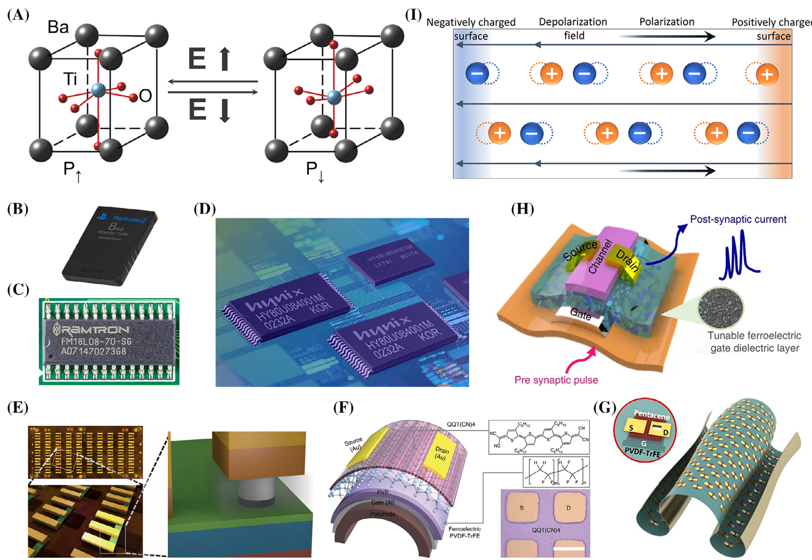
  - 图2 2D In2Se3 论文/引用增长曲线与 2017–2021 里程碑时间线 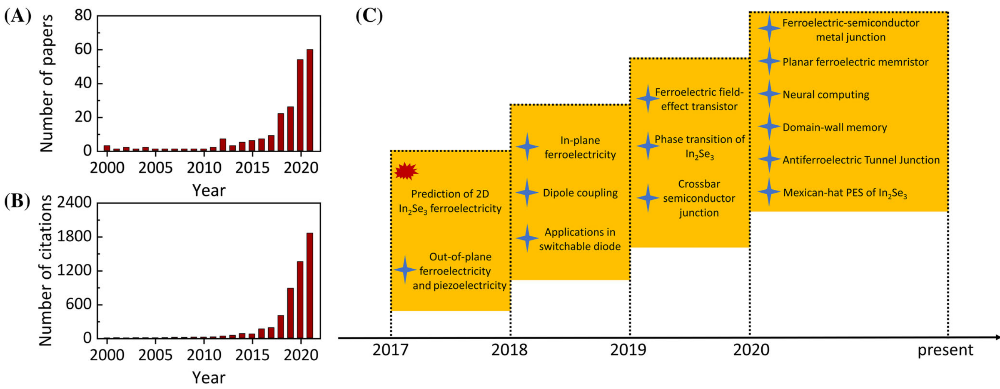
  - 图3 单层 In2Se3 五层原子结构及 α（铁电）、β（顺电）、β0 畸变相 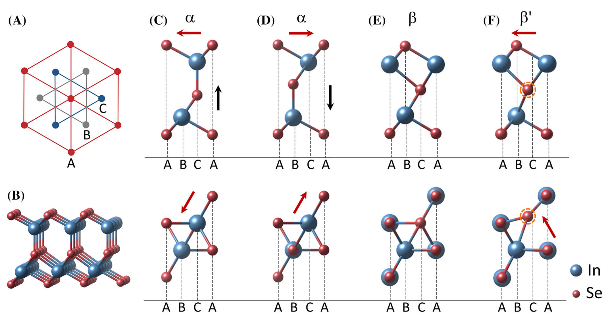 -> [[../figures/heterostructures-stacking-domains-devices|铁弹畴、畴壁、In₂Se₃ 与器件应用]]
  - 图4 β 相 Se(m) 的墨西哥帽 PES、750 K MD 快照与 Se 原子分布概率 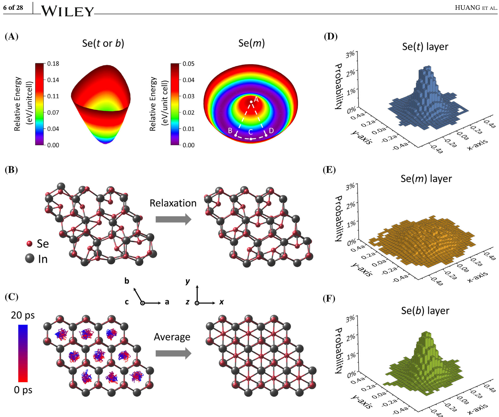
  - 图5 α-In2Se3 面外铁电性的 PFM 相位/振幅成像、蝴蝶回线与电写畴图案 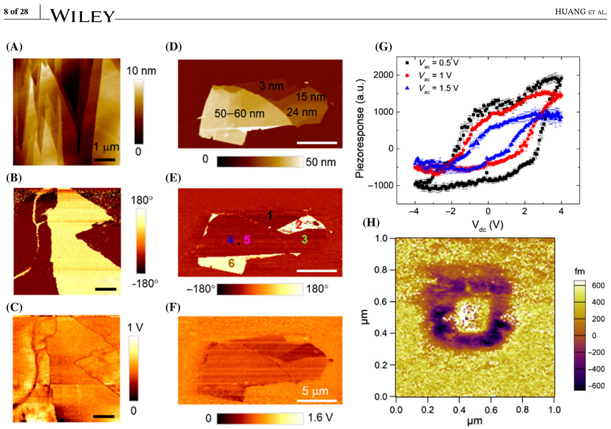
  - 图6 α-In2Se3 面内 PFM、奇偶层相位差、SHG 成像及 OOP-IP 偶极锁定证据 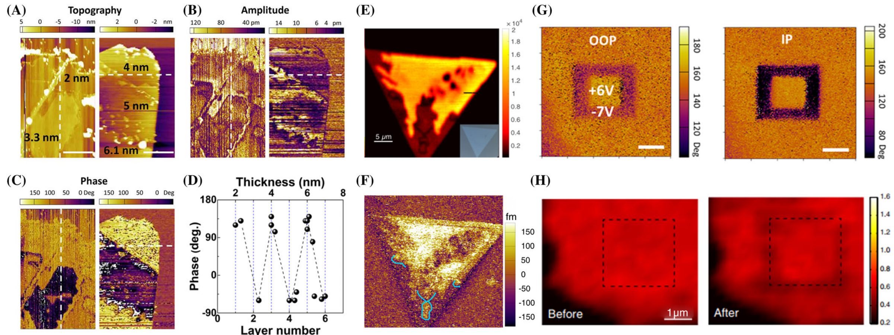
  - 图7 β0-In2Se3 的 LEEM/μ-LEED 表征及升温时 IP 铁电畴的"熔化"与记忆效应 
  - 图8 极化反转的单步路径（0.85 eV/u.c.）与三步协同路径（0.066 eV/u.c.） 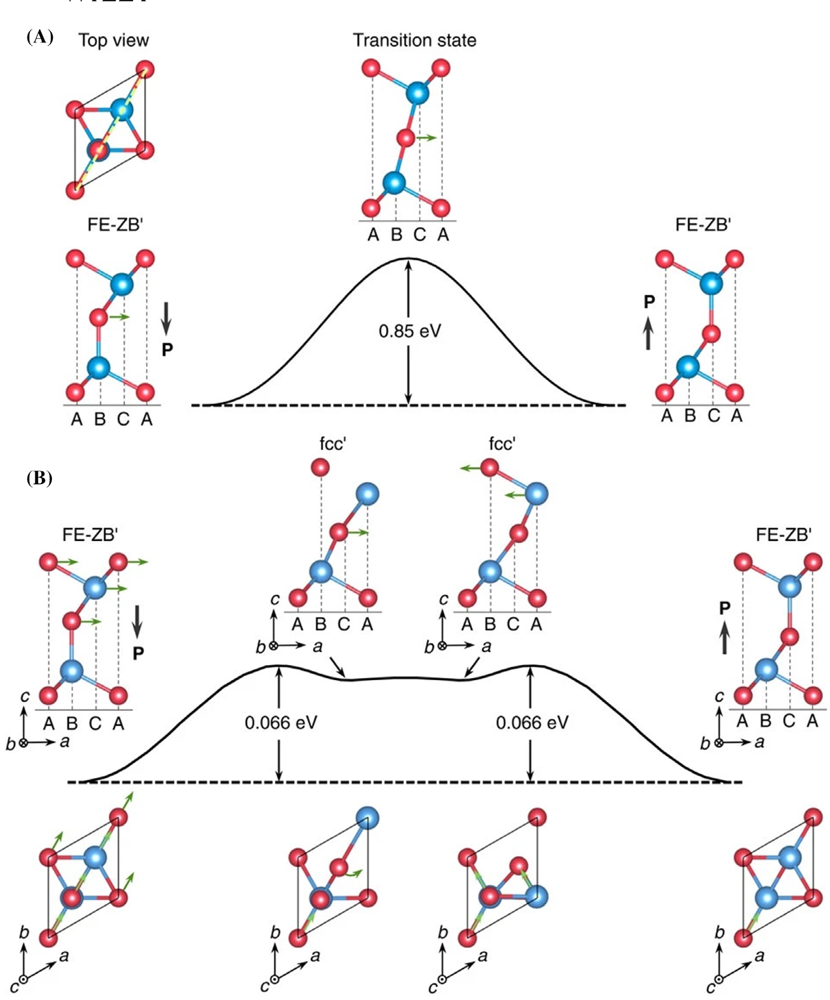
  - 图9 750 K MD 中剪切声子模式驱动 α→β 相变的原子位移与声子投影 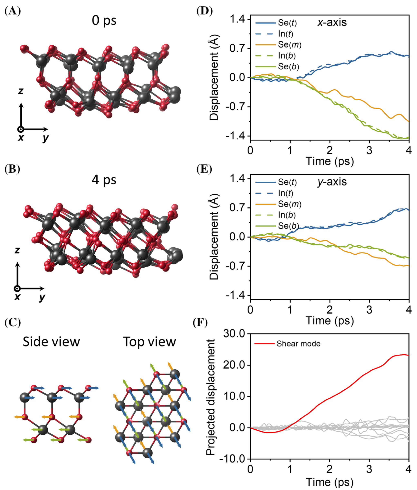 -> [[../figures/heterostructures-stacking-domains-devices|铁弹畴、畴壁、In₂Se₃ 与器件应用]]
  - 图10 α-In2Se3/h-BN/石墨烯 FeFET 结构、蝴蝶形转移曲线与 p 掺杂后 ΔR/R 达 58.5% 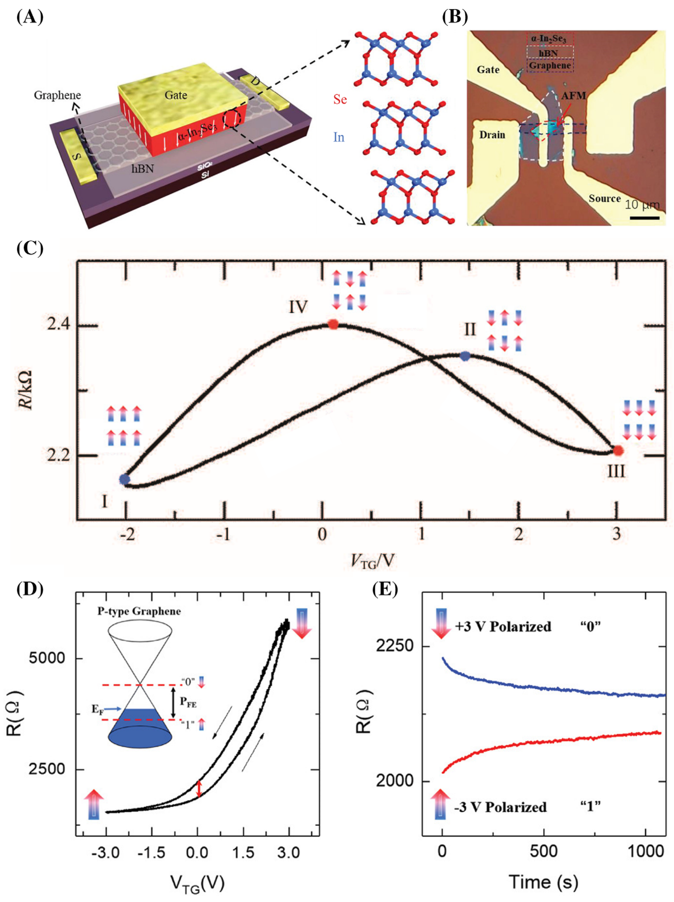
  - 图11 FeS-FET 结构及 90 nm SiO2（顺时针回滞）与 15 nm HfO2（逆时针，开关比 >10^8）对比 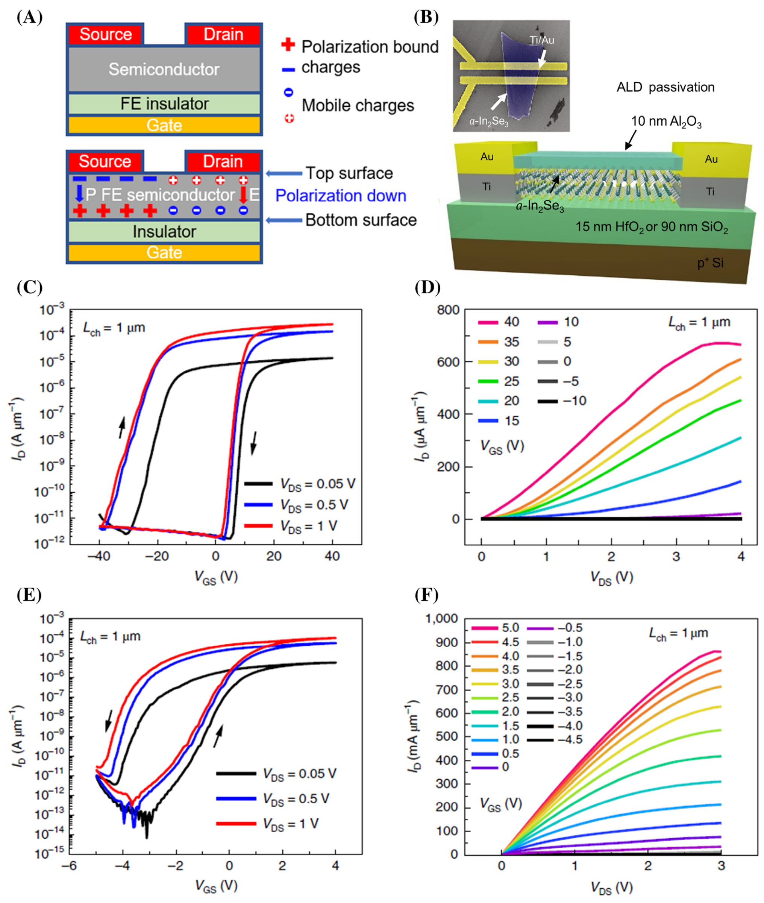
  - 图12 平面型（p-）与交叉杆型（c-）FSJ 结构、I-V 曲线及 80–150 ns 突触增强/抑制 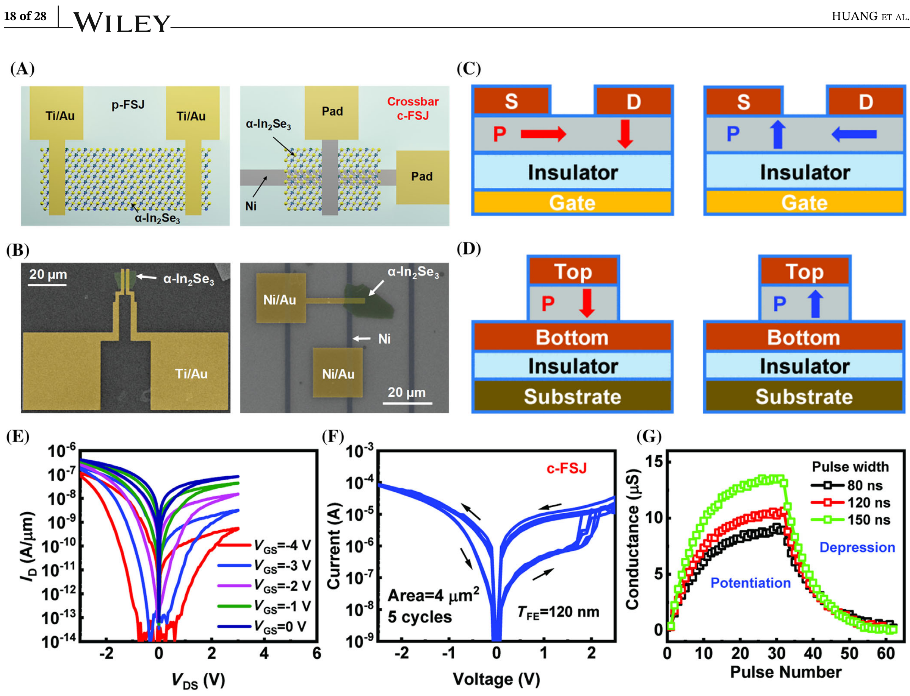
  - 图13 p-FSJ 铁电忆阻器的 PFM/KPFM 表征与四种电极功函数/屏蔽情形的能带图 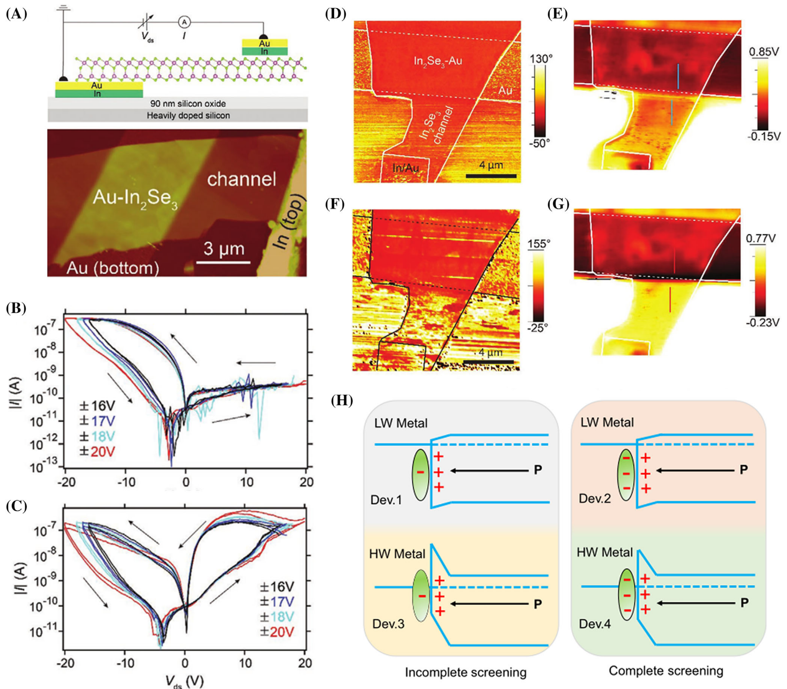
  - 图14 集成超快存储（40 ns、6 V 窗口）与神经计算（234/40 fJ 每脉冲）的 FeCT 及异突触忆阻器 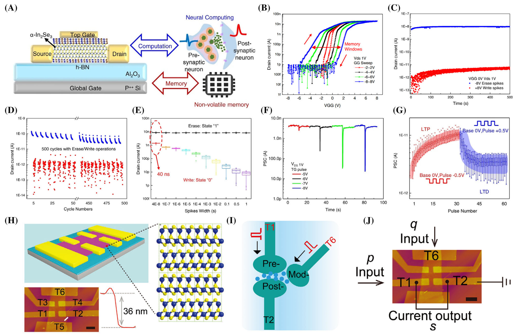
## 🔬 项目连接
  - **project-5 SnTe 铁电模拟（strong）**：本文是二维铁电机理与器件的核心综述。(1) 文献 44（Chang et al., Science 2016）正是 SnTe 单层极限下 IP 铁电性的发现工作，被作者作为二维铁电兴起的里程碑之一引用，与项目研究对象直接对应；(2) 系统阐述的"位移型 vs 相变型"铁电分类、再成键机制、墨西哥帽 PES、IP/OOP 偶极锁定、剪切声子驱动相变、NEB 翻转路径（0.066 vs 0.85 eV/u.c.）等，为 SnTe 等二维 IV-VI 族铁电体的 DFT/MD 模拟提供了直接可对比的物理图像和计算范式；(3) FeFET/FeS-FET/FeCT 器件结构与电学行为（蝴蝶曲线、回滞方向、肖特基势垒调控）可作为 SnTe 铁电器件模拟的参照系；(4) 作者明确建议用机器学习原子势（MLIP）大尺度模拟畴壁动力学，与项目可能采用的计算方法高度契合。
  - **project-2 Mn 多铁（medium）**：(1) In2Se3 是构建范德华多铁异质结的明星铁电组分（如磁性层/In2Se3 垂直异质结中的磁电耦合、电场调控磁性），其 IP/OOP 双稳态极化为多铁耦合提供了本征自由度；(2) 综述引用多铁/磁电耦合文献（refs 78–80：Eerenstein、Nan 等），并将 In2Se3 置于多铁性研究的大背景中；(3) "偶极锁定"和"再成键"机制对设计 CrInTe2/In2Se3 等磁-铁电异质结、理解界面电荷-自旋耦合有参考价值。但本文本身不直接研究 Mn 基多铁或磁电耦合实验，故判为 medium。
  - project-1 双光子、project-3 机械发光 NN、project-4 TTF 分子计算、project-6 湿度传感器、project-7 CDW：无直接项目连接。
## 🔗 项目双链
- 项目 [[../projects/project-2-mn-multiferroics|项目二：Mn极化结构铁电材料]]
- 项目 [[../projects/project-5-snte-ferroelectric-sim|项目五：lammps势函数SnTe铁电模拟]]

## 📝 组织与用词
  - 文章按"器件微型化需求 → 传统铁电体失效 → 2D In2Se3 再成键机制 → α/β 相结构 → 实验验证（PFM/SHG/LEEM）→ 翻转动力学（NEB 路径+MD 声子投影）→ 器件（FeFET→FeS-FET→FSJ→FeCT）→ 生长 → 七大挑战"的线性逻辑展开，并反复以"结构—性质—器件性能"三元关联收束各节。
  - 值得复用的关键术语：
    - depolarization field [[../concepts/depolarization-field|depolarization field]] / 退极化场
    - re-bonding mechanism / 再成键机制 [[../concepts/re-bonding-mechanism|再成键机制]]
    - phase-change-type vs displacement-type ferroelectrics / 相变型 vs 位移型铁电体
    - Mexican-hat potential energy surface / 墨西哥帽势能面 [[../concepts/mexican-hat-pes|墨西哥帽势能面]]
    - dipole locking (IP–OOP interlocking) / 偶极锁定 [[../concepts/dipole-locking|偶极锁定]]
    - entropy barrier / 熵垒 [[../concepts/entropy-barrier|熵垒]]
    - shear phonon mode / 剪切声子模式 [[../concepts/shear-phonon-mode|剪切声子模式]]
    - FeS-FET / FeCT (ferroelectric semiconductor channel transistor) / 铁电半导体沟道晶体管
    - in-memory / neuromorphic computing / 存内/神经形态计算 [[../concepts/neuromorphic-computing|神经形态计算]]
    - pseudo-centrosymmetric βpc phase / 赝中心对称相
## ✏️ 可写入 Wiki 的要点
  1. 单层 α-In2Se3 由 Se–In–Se–In–Se 五个亚层构成；两个 In 亚层分别为四面体和八面体配位，这种非对称构型同时产生 OOP 和 IP 自发极化，且两者相互锁定；晶格常数 a=b≈4.11 Å（R3m），[[../concepts/curie-temperature|居里温度]] Tc≈700 K。
  2. α-In2Se3 的铁电翻转需要 Se(m) 原子横向移动约 100 pm 并断裂/重建 In–Se 共价键，区别于 BaTiO3 中约 10 pm 的离子位移；作者据此将 III2–VI3 族二维铁电体命名为"[[../concepts/phase-change-type-ferroelectrics|相变型铁电体]]"，以区别于传统"位移型铁电体"，这是其在单层极限下抵抗[[../concepts/depolarization-field|退极化场]]的根本原因。
  3. NEB 计算给出两条翻转路径：单步法势垒 0.85 eV/u.c.；三步协同法（上三层滑动→β0→Se(m) 旋转 60°→上两层再滑动）势垒仅 0.066 eV/u.c.，低一个数量级，是更可能的物理路径。
  4. β 相中间层 Se 原子具有墨西哥帽形 PES：中心为能量极大值，环上分布 12 个等价极小值；由此衍生出 β0（Se(m) 同向畸变，有 IP 极化，比 α 高 0.064 eV/u.c.）、β(2√3) 重构相、以及 βpc 赝中心对称相（有限温度下 Se(m) 随机分布的时间平均效应）。
  5. ab initio MD（750 K）显示 α→β 相变可在约 1.5 ps 内完成，由 α 相的面内剪切光学声子模式驱动，表现为上两层（In(t)、Se(t)）与下三层（Se(m)、In(b)、Se(b)）的反向集体运动；声子投影分析中仅该剪切模式位移随时间单调增长。
  6. β→α 反向翻转因 βpc 相的熵垒而显著变慢：以 β0 为起点在 OOP 电场下数十 ps 内可转回 α，而以 βpc 为起点在同等时间尺度下保持稳定——这解释了实验器件速度（ns–μs）远慢于本征 α→β 过程（ps）的矛盾。
  7. 实验上 IP 极化比 OOP 极化强约一个数量级；2H 堆垛的少层 α-In2Se3 表现出奇偶层效应：奇数层 IP 电偶极矩约 2.18 eÅ，偶数层几乎抵消；3R 堆垛则相邻层 IP 极化同向，总极化不随层数抵消。
  8. 器件性能：FeFET（In2Se3 顶栅+[[../entitys/graphene|石墨烯]]沟道，ΔR/R 从 1% 提升至 58.5%，~50 ms）；FeS-FET（In2Se3 同时作沟道，15 nm HfO2 下开关比 >10^8、5 V 工作）；c-FSJ（±2.5 V 铁电阻变，80 ns 脉冲、在线学习准确率 ~92%、RON≈390 MΩ）；FeCT（40 ns 编程、6 V 存储窗口、234/40 fJ 每脉冲的长时程增强/抑制）。
  9. 非对称 metal/α-In2Se3/p+-Si c-FSJ 利用 p+-Si 耗尽区极化调制[[../concepts/schottky-barrier|肖特基势垒]]，0.2 V 下开关比达 10^4，140 °C 仍保持 10^3，展现极端环境应用潜力；KPFM 研究表明平面[[../concepts/memristor|忆阻器]]的电阻切换并非源于金属-铁电界面势垒反转，而是沟道内[[../concepts/polarization-switching|极化翻转]]导致的能带偏移。
  10. 作者提出相变型二维铁电体的三条设计准则：范德华层状结构、单层内[[../concepts/inversion-symmetry|反演对称性]]破缺、相对柔性的化学键（共价-离子竞争键、metavalent bonding、hyperbonding 或 resonant bonding）；并指出七大挑战（翻转原子图像、速度/熵垒、FeCT 机理、IP 极化应用、晶圆级生长、单层器件验证、高通量新材料筛选），其中机器学习原子势被明确推荐用于畴壁大尺度模拟。
