## kaurRecentAdvancesTheoretical2025a — 层状和范德华二维材料中滑动铁电性的理论研究进展

## 📄 元数据
Arneet Kaur, Abir De Sarkar，2025，*Journal of Physics: Condensed Matter* 37, 253001，DOI [10.1088/1361-648X/addf05](https://doi.org/10.1088/1361-648X/addf05)
## 💡 一句话
系统综述二维/层状范德华材料中"滑动铁电性"的第一性原理理论框架——从电荷转移/轨道畸变起源、DFT+Berry-phase+NEB 计算流程、应变/电场/激光/层数调控，到与磁性、拓扑、交变磁性、铁弹性的耦合及连续介质热力学一级相变图像。
## 🔗 Wiki 双链
  - 概念 [[../concepts/sliding-ferroelectricity]]、[[../concepts/multiferroicity]]、[[../concepts/magnetoelectric-coupling]]、[[../concepts/berry-phase]]、[[../concepts/spin-orbit-coupling]]、[[../concepts/2D-materials]]、[[../concepts/density-functional-theory]]、[[../concepts/polarization-switching]]、[[../concepts/moire-superlattice]]、[[../concepts/strain-engineering]]、[[../concepts/ferroelasticity]]、[[../concepts/machine-learning-potential]]、[[../concepts/topological-defects]]、[[../concepts/charge-density-wave]]、[[../concepts/across-layer-sliding-ferroelectricity|跨层滑动铁电性]]、[[../concepts/altermagnetism|交变磁性]]、[[../concepts/born-effective-charge|Born 有效电荷]]、[[../concepts/charge-transfer|电荷转移]]、[[../concepts/dynamical-multiferroicity|动态多铁性]]、[[../concepts/first-order-ferroelectric-transition|一级铁电相变]]、[[../concepts/layer-polarized-spin-hall-effect|层极化自旋霍尔效应]]、[[../concepts/polarization-registry-index|极化登记指数]]、[[../concepts/quantum-anomalous-hall-effect|量子反常霍尔效应]]、[[../concepts/rashba-effect|Rashba 效应]]、[[../concepts/rashba-spin-texture|Rashba 自旋织构]]、[[../concepts/spin-hall-effect|自旋霍尔效应]]
  - 实体 [[../entities/h-BN]]、[[../entities/TMDs]]、[[../entities/WTe2]]、[[../entities/VASP]]、[[../entities/Wannier90]]、[[../entities/Fe3GeTe2]]、[[../entities/CrTe2]]、[[../entities/SnTe]]、[[../entities/In2Se3]]、[[../entities/MXenes]]、[[../entities/deep-potential]]、[[../entities/domain-wall]]、[[../entities/BaTiO3|BaTiO3]]、[[../entities/Cr2Ge2Te6|Cr2Ge2Te6]]、[[../entities/CrI3|CrI3]]、[[../entities/CuInP2S6|CuInP2S6]]、[[../entities/HgI2|HgI2]]、[[../entities/MnBi2Te4|MnBi2Te4]]、[[../entities/MnSe|MnSe]]、[[../entities/MoSi2N4|MoSi2N4]]、[[../entities/MoTe2|MoTe2]]、[[../entities/NbI4|NbI4]]、[[../entities/PtBr3|PtBr3]]、[[../entities/ReS2|ReS2]]、[[../entities/SnS|SnS]]、[[../entities/VS2|VS2]]、[[../entities/ZrI2|ZrI2]]、[[../entities/graphene|石墨烯]]、[[../entities/graphene-tetralayer|四层石墨烯]]
  - 图表 [[../figures/crystal-structures]]、[[../figures/electronic-bands]]、[[../figures/heterostructures-stacking]]、[[../figures/heterostructures-stacking-moire|莫尔超晶格、扭转角与层间堆积]]、[[../figures/domain-walls]]
  - 年度 [[../write/2025]]
  - 项目 [[../projects/project-5-snte-ferroelectric-sim]]、[[../projects/project-2-mn-multiferroics]]、[[../projects/project-7-cdw-charge-density-wave]]、[[../projects/project-4-ttf-molecular-calc]]、[[../projects/project-1-two-photon]]
  - 相关论文 [[../../raw/note/kaurRecentAdvancesTheoretical2025a]]
## 📊 关键图表
  - **图1** h-BN 双层滑动铁电原理、GPRI/LPRI 与 DFT 势降对比、莫尔畴壁
    - **图示描述**：(a)(b) 双层 BN 与 C/BN 异质双层的上/下垂直极化示意；(c) h-BN 双层 AB/AA/BA 等堆垛构型；(d) 沿扶手椅方向位移时 DFT 势降（蓝圈）与全局极化登记指数 GPRI（红线）的一维对比；(e)(f) GPRI 与 DFT 势降的二维平面图；(g)(h) 0.5° 转角 h-BN 的局部极化登记指数 LPRI 图及跨畴壁剖面。
    - **关键特征**：σ_BN=σ_NB=0.22b（b=a/√3，a=2.51 Å）时 GPRI 与 DFT 势降吻合最佳；LPRI 再现 KPFM 电势景观，畴壁宽约 10 nm；证明滑动极化可用原子横向高斯重叠度定量描述并推广至转角莫尔体系。
     -> [[../figures/heterostructures-stacking|异质结与堆叠]]
  - **图2** 层间距/应变对 h-BN 极化、负泊松比与负压电性的影响
    - **图示描述**：(a) 面外极化与电偶极矩随层间距的变化；(b) 电偶极矩对层间距与面内双轴应变的相图；(c)(d) 沿 x、y 方向单轴应变下的层间距变化 ΔZ。
    - **关键特征**：极化与层间距成反比；面内双轴应变经弛豫反而增大层间距（负面外泊松比）；AB 构型同时呈现负纵向压电系数 d33，揭示负压电性与负泊松比共存这一罕见组合。
    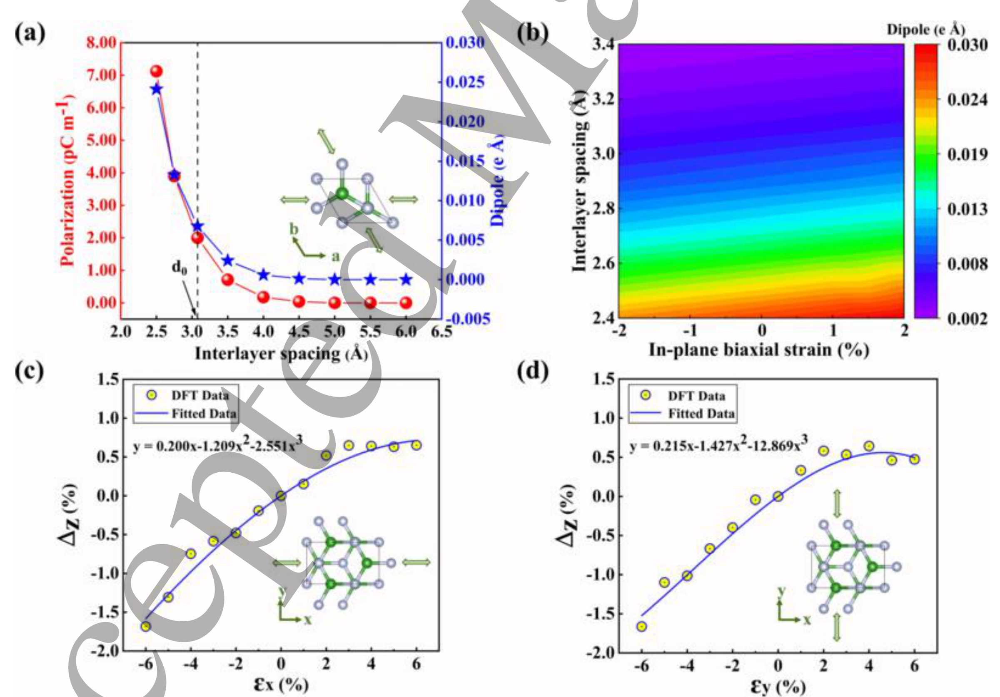 -> [[../figures/domain-walls-switching-properties|极化翻转与铁电性能]]
  - **图3** N-pz 轨道畸变、电场调化极化与 NEB 能垒、三态翻转
    - **图示描述**：(a) BN 双层 AB 堆垛中 N-pz 轨道畸变示意；(b) 投影能带；(c) 能带中点 1、2 对应的部分电荷密度；(d) −0.05～0.05 V/Å 电场下的极化变化；(e) AB→AA→BA→AP→AB 路径上不同电场的 NEB 曲线及势垒-电场插图；(f) 加压（层间距变化）下的 NEB 势垒。
    - **关键特征**：N1 比 N2 的 pz 畸变更强，N-pz–B-pz 排斥与 N-pz–B³⁺ 吸引共同偏移电荷中心，补充了纯电荷转移图像；垂直电场可定向翻转极化；压力同时抬升 P 和能垒。
    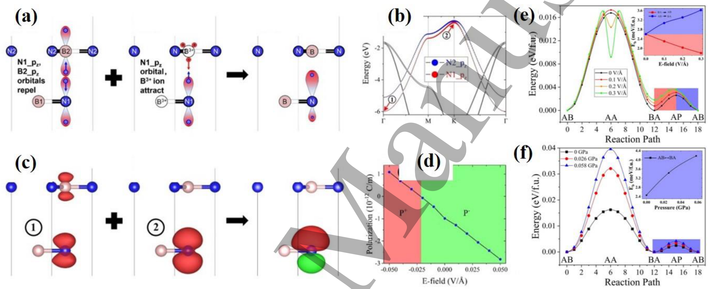 -> [[../figures/electronic-bands-dos-fermi|态密度与费米面]]
  - **图4** DREAM/Allegro MLIP 预测 Tc≈1500 K、倾斜电场降低矫顽场、恒定 24° 倾角
    - **图示描述**：(a) 复序参量 ψ=e^{iG·t} 的虚部随温度变化；(b) 矫顽场 E⊥,c 随温度变化（橙线）及加 0.2 V/Å 平行电场后（紫叉）；(c) E⊥,c–E∥ 关系的解析、数值与 0.1 K MD 对比；(d) 总临界场 Et,c 及其与水平面夹角（倾角）随温度的变化。
    - **关键特征**：MLIP 能量差 MAE=0.053 meV/atom，900 原子 MD 给出 h-BN Tc≈1500 K（修正此前 1.58×10⁴ K 高估）；E⊥,c 从 100 K 的 1.99 V/Å 降至 200 K 的 1.39 V/Å；加 E∥ 打破三重对称，Et,c 与水平面夹角恒定 24°，利于实验设计。
    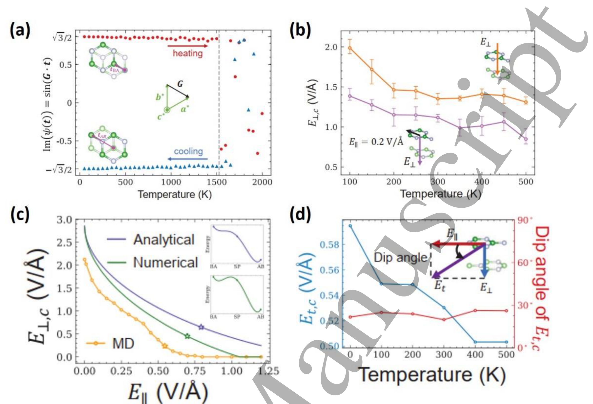 -> [[../figures/mathematical-models-magnetoelectric|磁电耦合与多铁理论]]
  - **图5** THz 激光 3–4 ps 超快翻转、动态多铁性感生磁场 12 nT
    - **图示描述**：(a) 全部堆垛构型的能量面；(b)(c) 能量和极化随 E(4) 模振幅 Q[E(4)] 的变化；(d) AB↔BA 间极化矢量摆线式旋转示意；(e) 高斯包络太赫兹电场脉冲；(f)(g) 脉冲下极化分量 Px,Py,Pz 与感生磁矩分量 Mx,My,Mz 的时间演化。
    - **关键特征**：目标声子模 E(4)/E(5) 位于 1.08 THz；AB 堆垛 Q[E(4)]=0，另一态为 5.1 Å (amu)^(−1/2)；y 偏振脉冲在 5 K 下 3–4 ps 完成翻转；感生 Mx≈2.7×10⁻⁸ μB、B≈12 nT，属动态多铁性 P×∂tP 机制。
    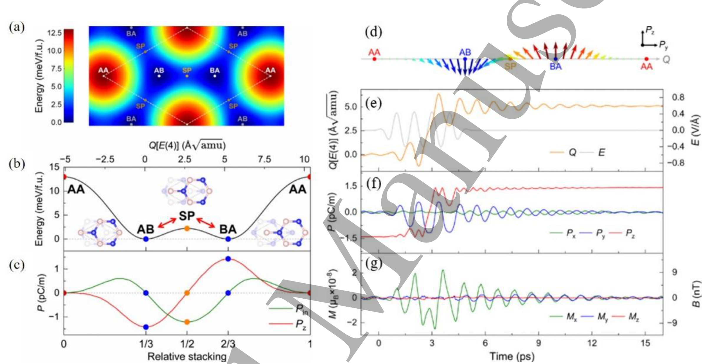 -> [[../figures/domain-walls-switching-properties|极化翻转与铁电性能]]
  - **图6** Td-WTe2 双层 0.6 meV 能垒、双阱势、自旋织构反转、自旋 FET 设计
    - **图示描述**：(a) 两相反极化态与中间态几何；(b) WTe2 双层 NEB 平移路径；(c)(d) 沿 −x 和 −y 拖动上层时的能量与垂直极化；(e) 层间距压缩下的垂直极化；(f) DFT 势降与 GPRI 对比；(g) 2° 转角 WTe2 的 LPRI 图；(h)(i) PBE-SOC 能带与布里渊区；(j) 状态 I/II 在费米能级附近的自旋织构；(k) 自旋场效应管设计示意。
    - **关键特征**：NEB 势垒仅 0.6 meV，P_max=0.37 pC/m（实验 0.23），AFE 比 FE 高 0.39 eV/f.u.，Tc≈350 K；GPRI 需引入 f(h)=e^{−α(h−h0)} 修正不等价层间距（α=0.77 Å⁻¹，a=6.26 Å）；极化翻转反转 Rashba 自旋织构，可用 ≥3 层 WTe2 作电极解决自旋 FET 阻抗匹配。
    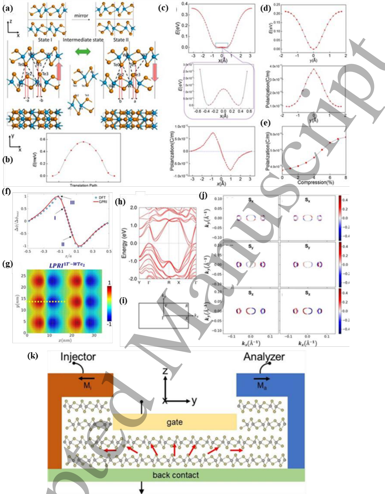 -> [[../figures/electronic-bands-dos-fermi|态密度与费米面]]
  - **图7** III–V/IV 族二元双层 (BP, GaN, GeC)：极化与电负性比/有效距离关系、GeC 为唯一全局极性基态
    - **图示描述**：(a) AC 堆垛下 BP、GaN、GeC 双层侧视图；(b) AC→AB 的 NEB 能垒与极化；(c) 最佳层间距与阴/阳离子电负性比 Ea/Ec 的相关；(d) 极化对有效距离 deff 的依赖；(e) 极化与电负性比/deff 的关系；(f) AA′（BP/BAs 为 AC′）相对 AC 的能量差。
    - **关键特征**：仅 AB 与 AC 为能量简并的反极性态；BSb、InN 为褶皱结构且极化与势垒更大；点电荷模型表明层间距越小极化越高；除 GeC 外其余材料全局极小为中心对称 AA′/AC′，故 GeC 的滑动铁电在实验上最可行。
    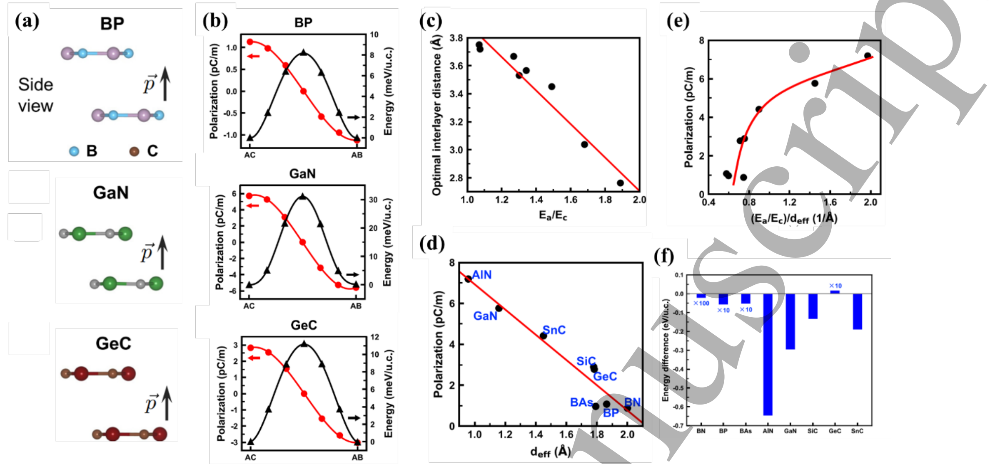 -> [[../figures/heterostructures-stacking|异质结与堆叠]]
  - **图8** Janus TMD (SeMoS/TeMoS)：内建电场比压缩层间距更能提升极化而不显著升能垒；MoS2/WS2 异质双层
    - **图示描述**：(a) SeMoS AB/AC 两极性态俯/侧视图；(b) 沿 z 方向面平均电势；(c) AB→AC 的能垒与极化；(d)(e) XMoY、XWY 双层极化随最佳层间距的变化；(f) 极化-有效距离负线性关系；(g)(h) 层间距对极化和能垒的调制；(i) 内建电场（红点）与改变层间距（蓝点）对极化-能垒的调制对比（紫点为 MoS2）；(j)(k) 外电场下能垒变化与 AB/AC 能量差对极化的线性关系；(l–p) 2H-MoS2、类 2H/类 3R MoS2/WS2 的结构与差分电荷密度。
    - **关键特征**：内建电场操控电子极化而非离子极化，故 TeMoS 极化较 MoS2 提升 65% 而能垒不显著升高；极化越大，单位电场诱导的 AB/AC 能量差越大，越易电控翻转；MoS2/WS2 异质双层（C3v 点群）上/下态横向相差 1.83 Å，AA-up 比 AA-down 稳定 1.9 meV/f.u.，2.4 V/nm 电场即可翻转相对稳定性。
     -> [[../figures/heterostructures-stacking|异质结与堆叠]]
  - **图9** 层极化自旋霍尔效应 (LP-SHE)、Berry 曲率、MoTe2/MoS2 应变调控
    - **图示描述**：(a) 空穴/电子掺杂极性双层的层极化自旋霍尔效应示意；(b)(c) AB/BA 堆垛 MoTe2 的层分辨能带；(d) MoTe2 VBM 附近沿高对称线的 Berry 曲率；(f) E1 能量处自旋 Berry 曲率投影能带与 k 分辨自旋 Berry 曲率；(g)(h) 自旋霍尔电导随费米能变化及 VBM 附近放大；(i) MoS2 在外加应变下的能带变化；(j) −3% 应变下 MoS2 的 SHC。
    - **关键特征**：层间极化的内建场使上下层能带相对偏移，自旋霍尔效应仅在一层发生，翻转极化即切换发生层；−3% 应变使 MoS2 的 VBM 从 Γ 谷移至 K 谷，从而在面内电场下实现 LP-SHE，提供"层"自由度的电写磁读机制。
    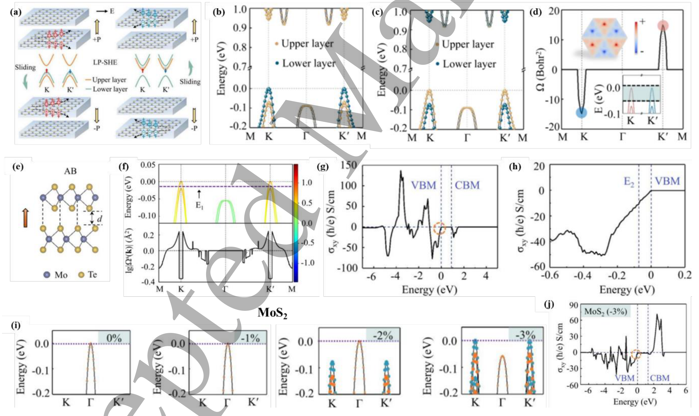 -> [[../figures/electronic-bands-cdw-transport|CDW与输运性质]]
  - **图10** 1T′-ReS2 多层：A/A′ 双稳态、电荷转移、极化/能垒随层数上升
    - **图示描述**：(a) ReSe2 单层；(b) ReS2 双层铁电双稳态 A、A′ 与非极性中间态 B；(c) 以滑动距离 (la,lb) 为坐标的能量等高线；(d) A↔A′ 的 NEB 能垒；(e) 差分电荷密度（黄积蓝耗）；(f)(g) 三层/四层翻转示意；(h) 极化与能垒随层数的变化。
    - **关键特征**：Berry 相给出双层 P=0.07 pC/m、势垒 17.1 meV；顶→底层电荷转移仅 0.0003e 即产生面外极化；三层中间层滑 (1 Å, 3.6 Å)、四层第二/四层滑 (1 Å, 3.6 Å) 翻转；层数由 2 增至 7，极化升至 0.07–0.68 pC/m，能垒由 17 meV 升至 100 meV。
    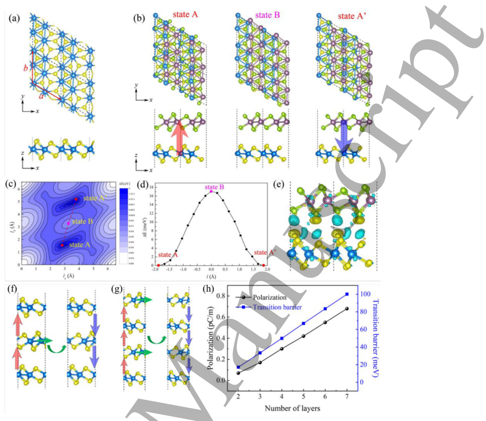 -> [[../figures/electronic-bands-dos-fermi|态密度与费米面]]
  - **图11** MoSi2N4/MoGe2N4 双层：层分辨 VBM/CBM、莫尔 II 型量子点阵列
    - **图示描述**：(a) MoSi2N4/MoGe2N4 两相反极化等效结构；(b) NEB 翻转路径；(c)(d) MoSi2N4 双层的 VBM/CBM 层分布与 PDOS；(e) 转角莫尔超晶格中不同堆垛区的能带对齐示意。
    - **关键特征**：MoSi2N4、MoGe2N4 双面外极化分别为 3.36、3.05 pC/m（同构 CrSi2N4、WSi2N4 为 2.49、3.44 pC/m）；面电荷密度 1.31 μC/cm²，电子迁移率达 7990 cm²·V⁻¹·s⁻¹；一层贡献 VBM、另一层贡献 CBM，翻转 FE 即交换两层；小角扭转形成 II 型异质结量子点阵列，莫尔势源于垂直极化而非层间杂化，可用于激子捕获。
    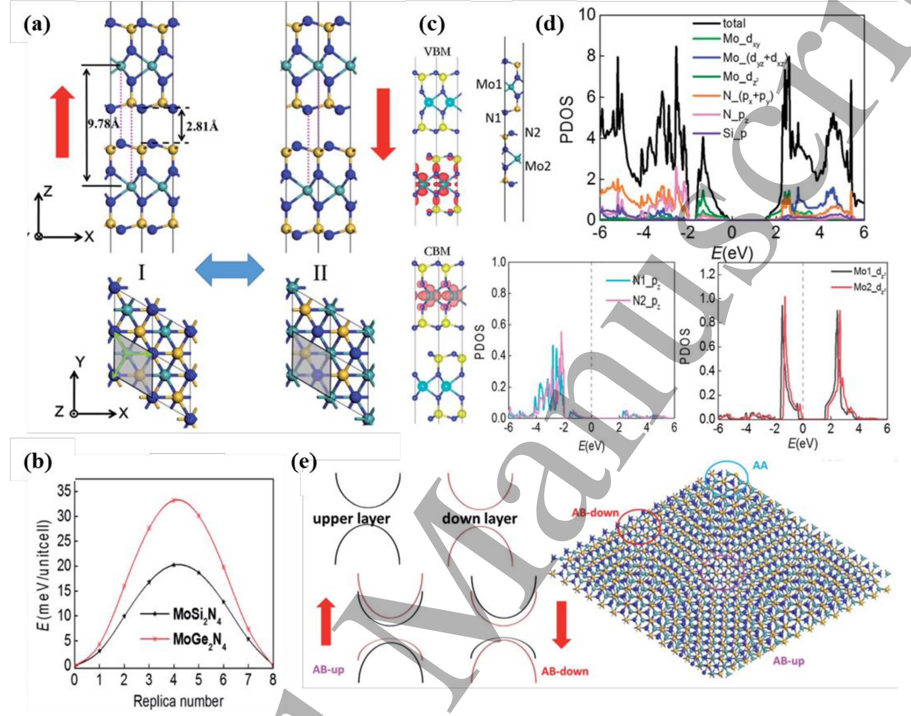 -> [[../figures/heterostructures-stacking|异质结与堆叠]]
  - **图12** HgI2 双层：双阱、屏蔽电荷积分求极化、Rashba 自旋织构、室温稳定
    - **图示描述**：(a) 极性 ±P 与非极性 PE 块体 HgX2 晶体结构；(b)(c) 块体与双层的能量双阱及极化曲线；(d) 三至六层 HgI2 的面平均屏蔽电荷；(e)(f) 总层间极化与平均层间极化随层数变化；(g) FE-HgI2 双层 +P 态在 kx–ky 面 VBM/CBM 的自旋织构。
    - **关键特征**：双层极化由 FE 与 PE 相面平均屏蔽电荷密度差积分 P=m/d 求得；HgI2 双层呈现 Rashba 自旋织构并具有室温稳定性，为低成本自旋电子学提供候选。
    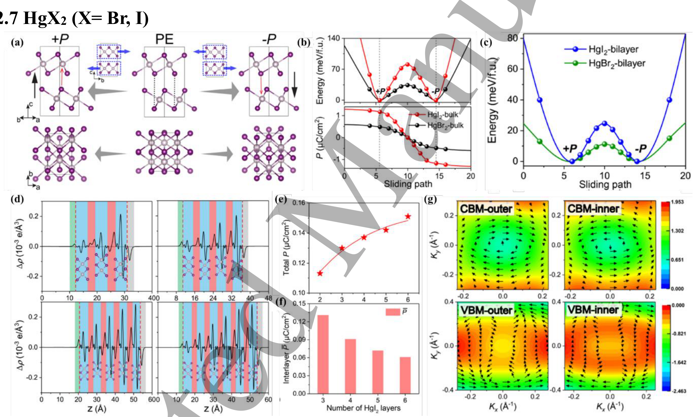 -> [[../figures/crystal-structures-bulk|体相晶体结构]]
  - **图13** GeS2/CuInP2S6：位移铁电+滑动铁电四/六态耦合、莫尔极化织构、0.7 TB/cm² 存储密度
    - **图示描述**：(a) GeS2/CIPS 异质结中"层滑动+Cu 离子位移"双机制翻转路径；(b) HP+→HP− 的极化与能垒；(c)(d) 沿 z 的差分电荷密度、电荷转移量及 Cu 离子位移能垒；(e)(f) 三层异质结莫尔超晶格示意及 R0/R1/R2 三个高对称区；(g)(h) P+/P− 态极化织构与跨 R2 的周期极化；(i) 各区 Cu 位移距离上的转变势垒。
    - **关键特征**：GeS2/CIPS 有四个极化态；GeS2/CIPS/GeS2 因两个可滑 GeS2 层出现 HP±、LP1±、LP2± 六态，HP± 极化对称值 ±11.77 pC/m；Cu 位移改变内建场并与滑动铁电强耦合，使莫尔阵列中原本不可能的翻转成为可能；转变势垒 286 meV 在各区近似相同；5° 转角下存储密度 0.7 TB/cm²。
    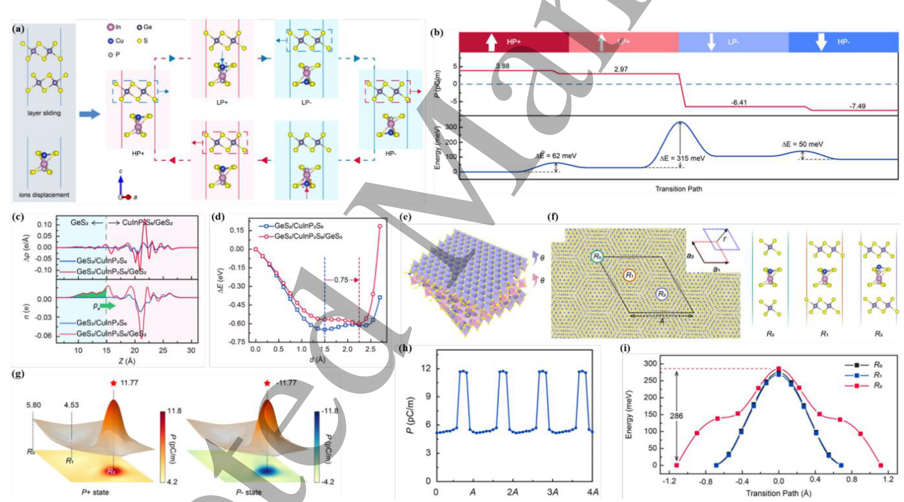 -> [[../figures/heterostructures-stacking|异质结与堆叠]]
  - **图14** 跨层滑动铁电：h-BN/石墨烯/h-BN；苯分子层/石墨烯/h-BN 达 10⁴ Tbit/in²
    - **图示描述**：(a) 两平行 h-BN 间插石墨烯形成的两种 FE 态几何；(b) 翻转能垒；(c) 两双极态的差分电荷密度；(d) 苯分子层/石墨烯/h-BN 中分子独立存储比特、实现超高密度滑动存储的示意。
    - **关键特征**：两态中 C 始终对 B，但等价性由 (AA,AB) 变为 (AB,AA)；P=0.48 pC/m，NEB 势垒 3 meV/u.c.，h-BN 加厚后 P 略升至 0.51 pC/m；用苯分子取代上层石墨烯后，每分子独立存 1 bit，预测面密度达 10⁴ Tbit/in²，是跨层滑动铁电 (ALSF) 的原型。
    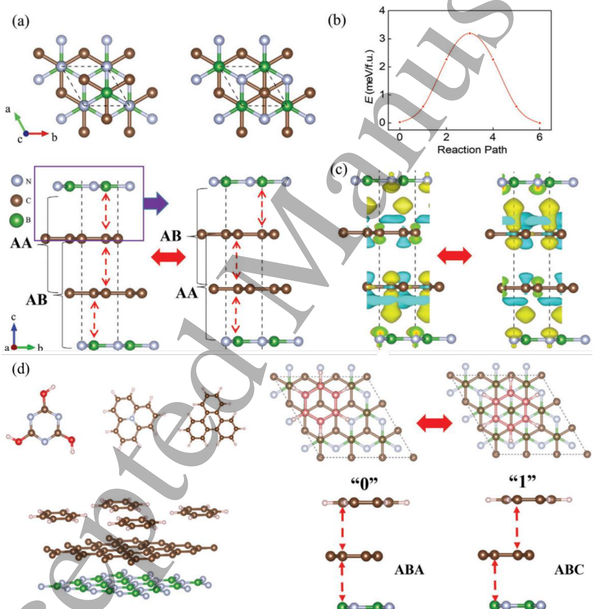 -> [[../figures/domain-walls-switching-properties|极化翻转与铁电性能]]
  - **图15** 四层/多层石墨烯极性堆垛 (ABAC, CABA, CBAB)、滑动莫尔铁电性、平带
    - **图示描述**：(a) 四层石墨烯 ABAC↔CABA↔CBAB 极性态翻转；(b) NEB 路径；(c) 极性态差分电荷密度与 Hirschfeld 电荷分析；(d) 2+2 与 1+3 转角四层石墨烯的堆垛畴图（NP 为非极性畴，X 为不利畴）；(e)(f) 未转角与 1.08° 转角四层石墨烯能带。
    - **关键特征**：ABAB、ABCB 非极性，ABAC、CABA、CBAB 为镜像相关极性态；P⊥=0.21 pC/m、P∥=57.49 pC/m，势垒 <5 meV；五层 ABABC/ABACB 为 0.17/0.32 pC/m，六层有 5 个极性态 0.05–1.0 pC/m；1+3 转角可电场切换极性畴/非极性畴，称"滑动莫尔铁电性"；极性 CABC 近费米能级具平带，ABAC 同时有线性色散带与平带。
    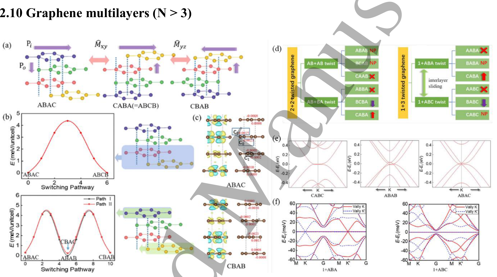 -> [[../figures/heterostructures-stacking|异质结与堆叠]]
  - **图16** 1-uc BaTiO3/SnS：二维/三维杂化稳定超薄铁电，Néel 点、Bloch 涡旋、联合扭转-滑动
    - **图示描述**：(a)(b) BaO/TiO2 终止面的 1-uc 自支撑 BTO 与 SnS 单层；(c–f) BaO/TiO2 终止面 BTO/SnS 的极性结构、能垒与翻转路径，红/绿箭头分别表示 SnS/BTO 中的极化方向；(g–o) SnS 单/双/三层下能量景观与极性态分布；(p–s) 异质双/三层的联合扭转-滑动过程及转角 BTO 在单/双层 SnS 上的可调莫尔图案。
    - **关键特征**：BaO 终止面有四个极性态、TiO2 终止面有三个极性态；界面各向异性应变使极化在 x、y 间切换并伴随铁弹转变；类 Landau-Ising 模型给出大且正的层内 J；极性分布汇聚于绕数为 1 的 Néel 点，并出现顺/逆时针 Bloch 涡旋，随 BTO 滑动和 SnS 厚度可调。
     -> [[../figures/domain-walls-switching-properties|极化翻转与铁电性能]]
  - **图17** 3R-VS2 多铁：四种 P-M 构型、Berry 曲率随电场、AFM↔FM、线性/二阶磁电系数、四态控制
    - **图示描述**：(a)(b) AB/BA 极性态 VS2 双层俯视图；(c–e) AB、BA、AA 的差分电荷密度；(f) 顺磁 VSe2 双阱曲线；(g–j) 四种 P-M 构型 (P↑M↑↓、P↓M↓↑、P↓M↑↓、P↑M↓↑) 的 SOC 能带与 Berry 曲率；(k–n) K⁻、K⁺ 点 Berry 曲率对电场的依赖；(o–r) 层间距 d 模型及 δd=0.6、0.8 Å 时磁矩随电场的变化；(s) 多态控制示意。
    - **关键特征**：3R 堆垛 AB/BA 属 P3m1，NEB 势垒 19 meV（另一工作 4.88 meV），VSe2 顺磁双阱势垒 9.9 meV；四构型能量简并，其中 P↑M↑↓、P↓M↓↑ 为 FE 双稳；δd=0.6 Å 呈线性磁电 αS≈−9.8×10⁻¹⁴ G·cm²/V（−1.48×10⁻⁷ s/m），δd=0.8 Å 出现二阶 βS≈−4.5×10⁻²² G·cm³/V²；层间距压缩驱动 AFM↔FM 及半导体-金属转变，电+磁场可四态控制。
     -> [[../figures/electronic-bands-dos-fermi|态密度与费米面]]
  - **图18** ZrI2：T0/1T′/Td 相、声子虚频、双阱、六逻辑态多铁、头对头畴壁金属性与 0.24 eV 势差
    - **图示描述**：(a) 1T′(α)、T0、Td(β) 三相晶体结构（M/P 为顺/逆时针 ZrI6 八面体，±为 I-I 键位移方向）；(b) T0 相声子谱；(c)(d) Td 相经 T0 的 FE 极化、双阱能量与极化；(e)(f) β-ZrI2 双层 FE 态与 NEB 能垒；(g) 1×1×8 超胞内 Td/Td 头对头 (HH) 与尾对尾 (TT) 畴壁；(h)(i) VBM/CBM 能带、电荷密度及跨超胞电势与平面平均电荷密度。
    - **关键特征**：T0 相有 Γ2⁻ 光学模和 Γ4⁺ 线性声子模两个虚频，分别驱动至 Td/1T′ 相；块体 Td 相 P=0.24 μC/m²、势垒 5 meV；β-ZrI2 双层同时有面外 (2.1×10⁻⁴ C/m²) 与面内 (9.4×10⁻⁴ C/m²) 极化，面外翻转势垒 1.6 meV/f.u.、孤立势垒 0.06 meV/f.u.，对应 Tc≈476 K；三态铁弹×双态铁电给出六逻辑态多铁；HH 畴壁束缚电荷使价带/导带抵达费米能级，电势差 0.24 eV，形成能 E_DW≈1 mJ/m²。
    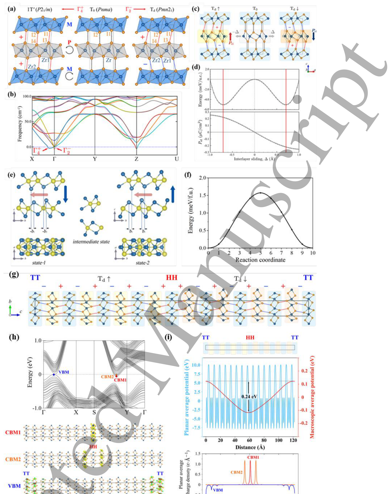 -> [[../figures/electronic-bands-band-structures|能带结构与带隙]]
  - **图19** 2H-MnBi2Te4 双层：滑动切换磁序与拓扑（陈数），层间 Te-pz 耦合
    - **图示描述**：(a) 3R/2H 堆垛双层 MBT 侧视图；(b) AB 堆垛俯视图，绿箭头为滑动路径（红/蓝球为上/下层 Mn，黄/紫球为 Te/Bi）；(c) 2H 堆垛翻转路径（插图为最小/最大能量点差分电荷密度）；(d)(e) 沿滑动路径的总能量与层间交换能；(f) 面外 FM 序下不同堆垛的投影能带（插图突出边缘态）。
    - **关键特征**：仅 2H 堆垛因反演破缺允许极化；亚稳 AB′、AC′ 能量相近且低于 AA、AC，NEB 势垒 30 meV/u.c.；除 AA 外各构型均为 AFM，磁相可由层间滑动切换；AB、AB′、AC′ 在 FM 序下 Γ 点附近能带反转，出现自旋极化边缘态与非零陈数，预示 QAH 效应；平庸绝缘体层间距更大、Te-pz 层间耦合更弱。
    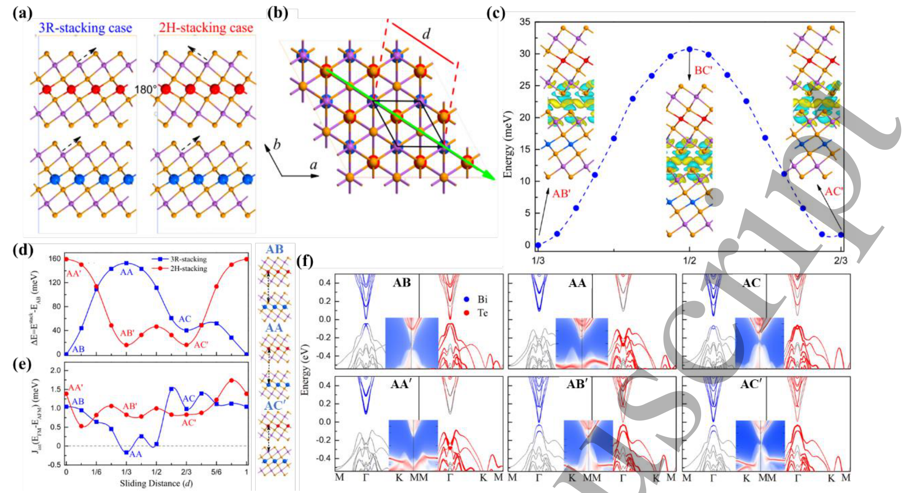 -> [[../figures/heterostructures-stacking|异质结与堆叠]]
  - **图20** 四层 MnBi2Te4：破 P 对称的铁电 QAH 绝缘体，σxy=±e²/h，陈数随层间距变化
    - **图示描述**：(a) 块体 MBT 晶体结构；(b) 破 P 对称后四层 MBT (FL-MBT) 的 P1/P1′ 原子结构与 FE 翻转；(c) P1-FLMBT 的 NEB 势垒；(d) SOC 能带；(e) P1/P1′ 的反常霍尔电导；(f) 原始 FLMBT 陈数随表面单层与三层间层间距增量 δd 的变化。
    - **关键特征**：原始 FLMBT 因 P 对称无极化；顶层与底层反向轻微滑动（或滑动 P 对称中心双层）得到 P1/P1′ 极性态，P⊥=6.82×10⁻¹³ C/m；铁电 QAH 绝缘体 σxy=±e²/h，极化翻转逆转 AFM 自旋分布、Berry 曲率与手性边缘态；陈数对表面层间距敏感，小角扭转可获更稳定的大畴。
    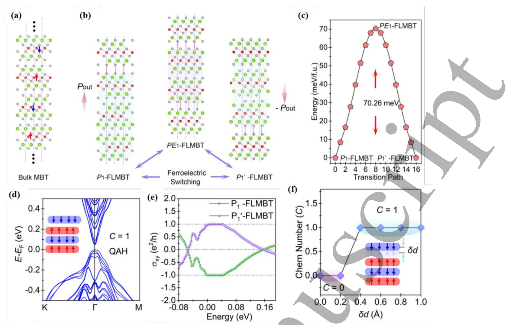 -> [[../figures/crystal-structures-bulk|体相晶体结构]]
  - **图21** CrI3、Cr2Ge2Te6、Fe3GeTe2 双层反平行/平行堆垛的滑动铁电与"压电多铁效应"
    - **图示描述**：(a) 反平行 CrI3 双层、(b) 反平行 Cr2Ge2Te6 双层、(c) 平行 Fe3GeTe2 双层的双稳态 I/II 几何（红箭头为反向极化）；(d) 三种材料 FE 翻转的能垒对比。
    - **关键特征**：CrI3 为 FM，Cr2Ge2Te6、Fe3GeTe2 基态为 AFM；CrI3、Cr2Ge2Te6 仅反平行堆垛非中心对称，而 Fe3GeTe2 即使平行堆垛也非中心对称；PBE+U 显示 CrI3、Cr2Ge2Te6 为间接带隙、Fe3GeTe2 为金属；Fe3GeTe2 每胞净磁矩 0.01 μB 并随 FE 翻转；约 10% 压缩应变使极化与净磁化近乎翻倍，称为"压电多铁效应"。
    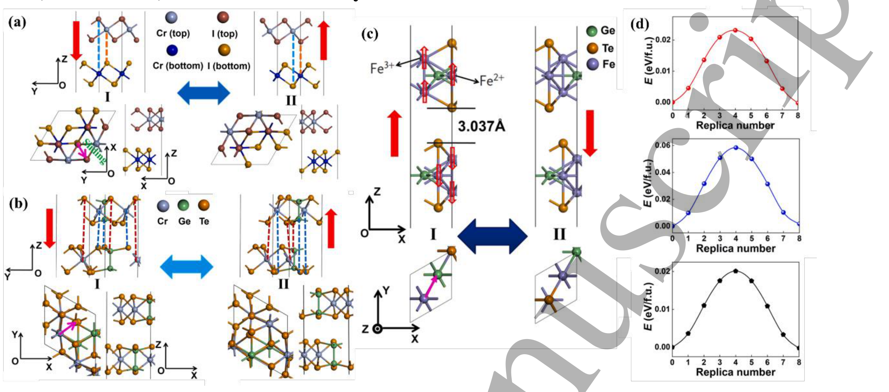 -> [[../figures/domain-walls-switching-properties|极化翻转与铁电性能]]
  - **图22** MnSe 双层：2.7 pC/m 极化、电控塞曼劈裂、8 mμB/胞净磁矩、应变与空穴掺杂协同
    - **图示描述**：(a)(b) MnSe 双层 AB→BA 滑动能量剖面与翻转势垒；(c) AB、BA 双稳态与中间态 IS 几何；(d) 沿路径的极化与磁矩；(e) 双稳态差分电荷密度；(f)(g) 压缩面外应变与双轴面内应变下电势差和磁矩的响应；(h) 空穴掺杂对 AB/BA 磁矩的影响；(i) 拉伸双轴应变与空穴掺杂的协同效应。
    - **关键特征**：AB/BA 属 P3m1，P=2.7 pC/m、势垒 8.4 meV、层间电势差 0.23 V，高极化源于 Mn-dz² 与 Se-pz 强杂化；电极化打破自旋简并产生电控塞曼劈裂，净磁矩 8 mμB/胞；磁电效应随层数线性增长（三层 16、四层 24 mμB）；压缩面外应变增强 P 与磁矩，压缩面内应变反之；空穴浓度 1.39×10¹⁵ cm⁻² 时磁矩极大 0.3 μB，拉伸应变可在更低掺杂浓度下达到更大磁矩；同构 FeS 为 4.1 pC/m、6.4 meV。
    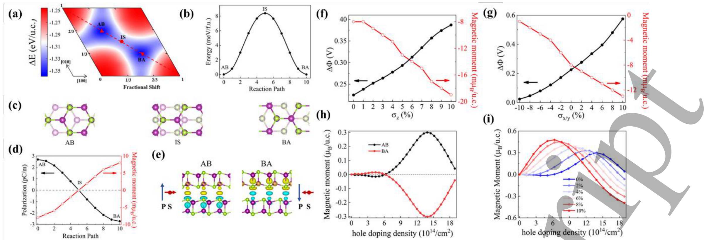 -> [[../figures/electronic-bands-dos-fermi|态密度与费米面]]
  - **图23** VI2：自旋螺旋序诱导的非位移铁电、滑动-螺旋手性锁定、SOC 依赖
    - **图示描述**：(a) VI2 单层俯/侧视图；(b)(c) 正/负自旋螺旋手性的非共线 120° Y-AFM 序；(d) 自旋螺旋序诱导电极化示意；(e) 单层中 ΔE_D→U 随外面电场变化；(f)(g) VI2 双层能量分布及 AB→AB′ 路径上极化与 ΔE_DD→UU；(h) 极化对 SOC 强度的依赖；(i) 极化与 ΔE_DD→UU 随层间距变化；(j–l) 三层能量分布与 ABB→AAB′ 路径上的极化和 ΔE_DDD→UUU。
    - **关键特征**：自旋螺旋序经反对称机制 P=M∑(S_i×S_j) 诱导非位移铁电，单层 P⊥=0.12 pC/m；AB/AB′ 为简并反极性态，P=1.33 pC/m；经 AC 翻转势垒 21.06 meV，显著低于经 AA 的 77.52 meV；AB/AB′ 在 Y-AFM 基态中螺旋手性沿内建场排列（ΔE_DD→UU=0.14 meV/胞），即"螺旋手性-滑动铁电锁定"；极化和 ΔE 均随 λSOC 线性增长，三层 ΔE_DDD→UUU=0.22 meV/胞。
    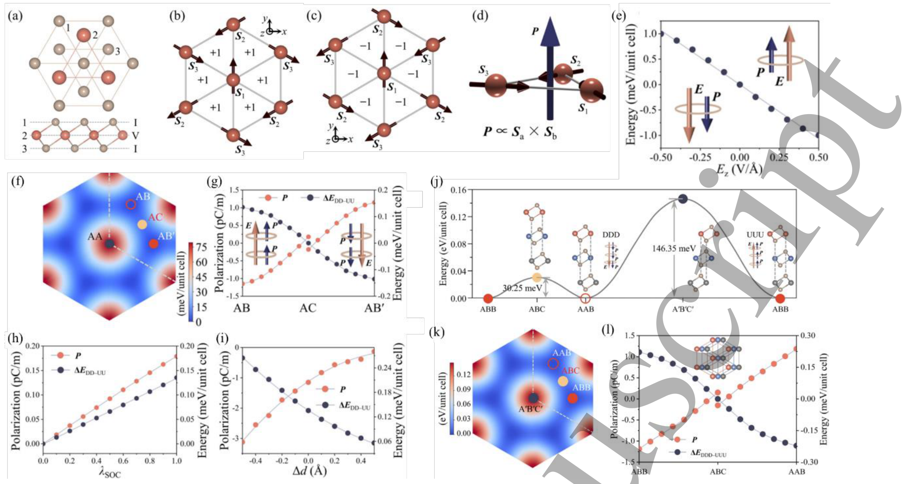 -> [[../figures/domain-walls-switching-properties|极化翻转与铁电性能]]
  - **图24** CrI3/MnSe2 异质双层：紧束缚+DFT 揭示磁序可反转层间电子极化，非易失磁电耦合
    - **图示描述**：(a) CrI3 与 (b) MnSe2 单层原子结构俯视图；(c) CrI3/MnSe2 异质双层能量随层间滑动的剖面，标出 S1（FM 全局最小）、S2（AFM 局域最小）、S3（全局最大）；(d)(e) 双离子与四离子团簇模型中 P_ex=P_AFM−P_FM 随磁性离子在位能差 Δdd 与跳跃强度 t、tpp 的变化。
    - **关键特征**：S1 结构中 P_i^FM=−0.0073 e·Å/u.c.（电荷由 MnSe2 转向 CrI3），P_i^AFM=0.0202 e·Å/u.c.；固定离子位置时极化值相近，表明电子极化主导；层间滑动可非易失切换磁序并反转电极化，证实 vdW 磁性异质结中非易失磁电耦合的存在。
    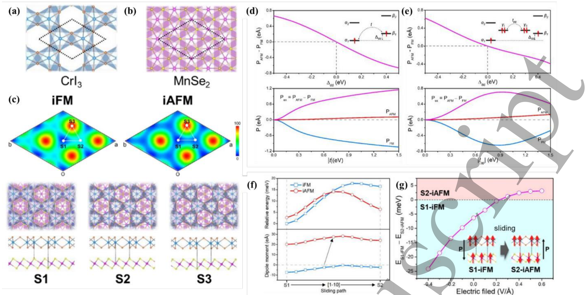 -> [[../figures/heterostructures-stacking|异质结与堆叠]]
  - **图25** SnS2/MnPSe3/SnS2：滑动打破 PT 对称诱导交变磁性，两条翻转路径与能垒
    - **图示描述**：SnS2/MnPSe3/SnS2 三明治结构的堆垛滑动示意、能量景观与两条铁电翻转路径；差分电荷密度显示 Mn 周围电荷耗尽。
    - **关键特征**：层间滑移引入极化并破坏 PT 对称性，将普通 AFM 体材料诱导为交变磁体；图中给出两条翻转路径及其能垒；该图与图26共同支持"滑动铁电可在 AFM 中诱导交变磁性"的论断。（raw/note 未给出该图更细分子图的数值，仅作定性描述。）
    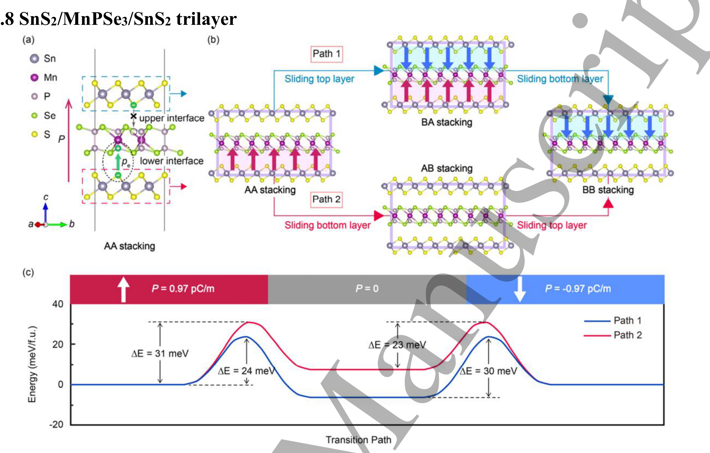 -> [[../figures/domain-walls-switching-properties|极化翻转与铁电性能]]
  - **图26** SnS2/MnPSe3/SnS2：Mn 周围电荷耗尽、交变磁体能带劈裂
    - **图示描述**：SnS2/MnPSe3/SnS2 极性态的电荷密度差与能带结构，重点展示 Mn 位周围电荷耗尽以及交变磁相的自旋劈裂能带。
    - **关键特征**：能带结构呈现交变磁性特有的自旋劈裂特征（无净磁矩但能带自旋分裂）；与图25共同构成 PT 破缺诱导交变磁性的完整证据，可由晶体霍尔效应等信号非易失读取。（raw/note 未给出更细分子图数值，仅作定性描述。）
    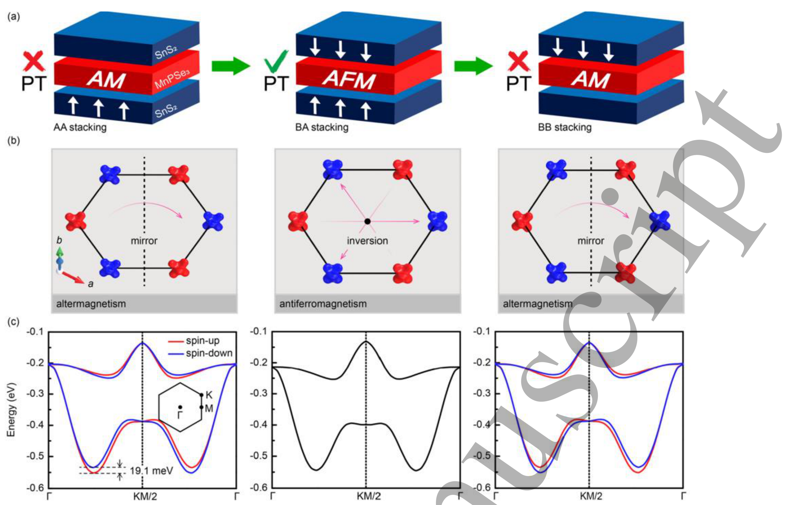 -> [[../figures/electronic-bands-band-structures|能带结构与带隙]]
  - **图27** PtBr3：AA′/AB′/AC′ 堆垛、晶体霍尔效应、MOKE 克尔角与椭偏率随 ±P 反转
    - **图示描述**：PtBr3 双层 AA′、AB′、AC′ 等堆垛构型、极化翻转路径，以及晶体霍尔效应、磁光克尔角与椭偏率随 ±P 极化反转的曲线。
    - **关键特征**：滑动破坏 PT 对称后出现交变磁相，伴随晶体霍尔效应与磁光克尔效应 (MOKE)；克尔角与椭偏率在 ±P 间反号，可作为非易失电学读取信号。（raw/note 未给出该图定量数值，仅作定性描述。）
    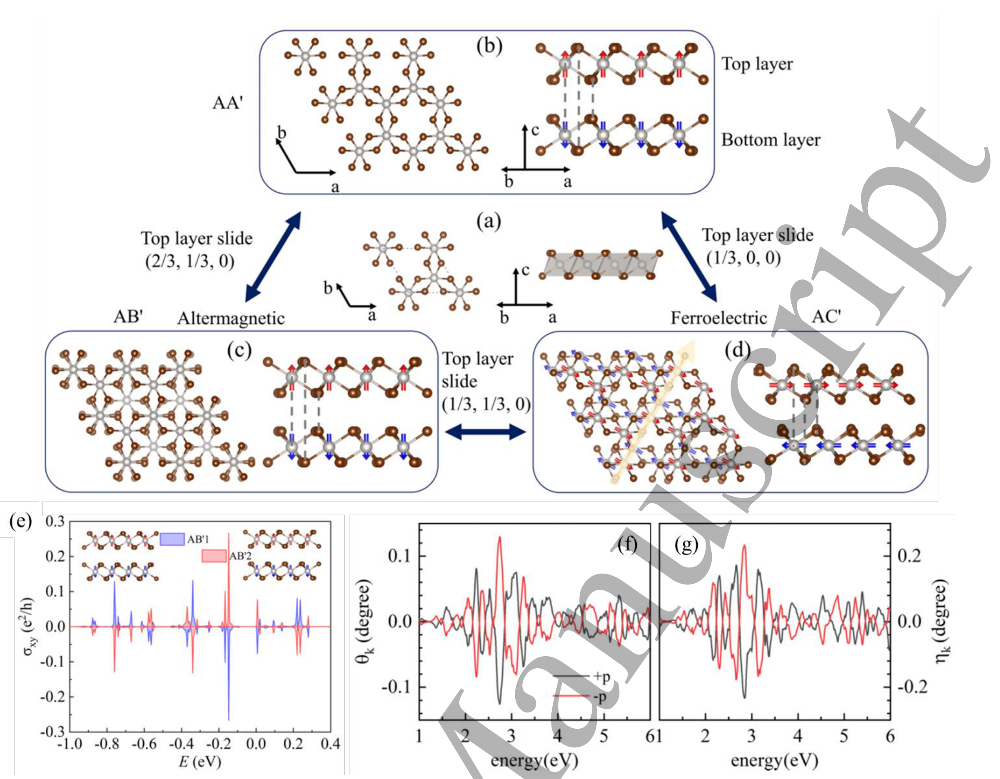 -> [[../figures/heterostructures-stacking|异质结与堆叠]]
  - **图28** 全部滑动铁电双层的"极化–能垒"性能地图（理想区：右下，高极化低能垒），绿色为多铁材料
    - **图示描述**：横轴为极化大小 (pC/m)，纵轴为翻转能垒 (meV)，每个点代表一种滑动铁电材料，绿色点标记多铁材料。
    - **关键特征**：理想存储材料位于图的右下角（高极化信号强、低能垒低功耗高速）；图中可见极化与能垒总体正相关，构成材料设计的核心权衡；该图是本综述的材料筛选"性能地图"，与表1、表2互为参照。
    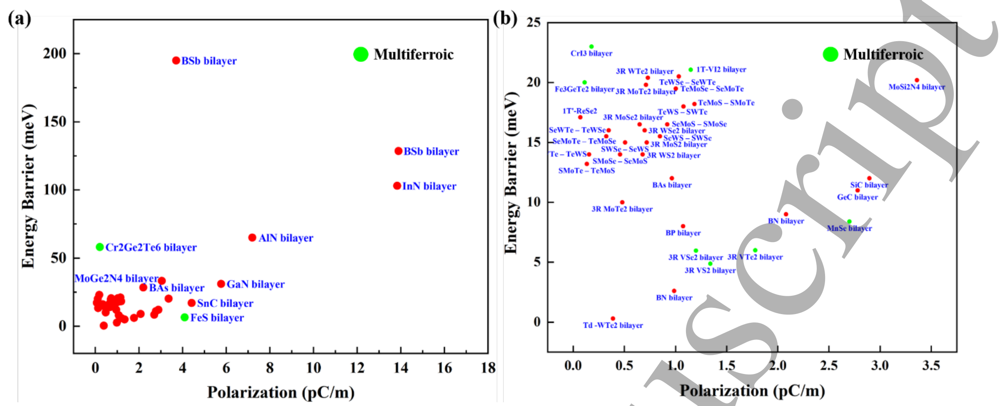 -> [[../figures/domain-walls-switching-properties|极化翻转与铁电性能]]
  - **图29** 连续介质模型：P(T) 一级相变、临界场、电卡熵变 Δs(E)
    - **图示描述**：(a) 极化 P 随温度 T 的变化显示 FE→PE 一级相变（P 在 Tc 不连续跳变）；(b) 临界翻转场随温度变化；(c) 电卡熵变 Δs 随电场 E 的变化。
    - **关键特征**：连续介质（横场 Ising 类）模型证实滑动铁电体为一级 FE–PE 相变，区别于常规二级铁电体；尽管翻转势垒极低，二维材料高面内刚度产生的弹性能代价抑制热涨落，保护长程铁电序，使其与 Mermin–Wagner 约束相容；电卡熵变预示固态制冷潜力。
    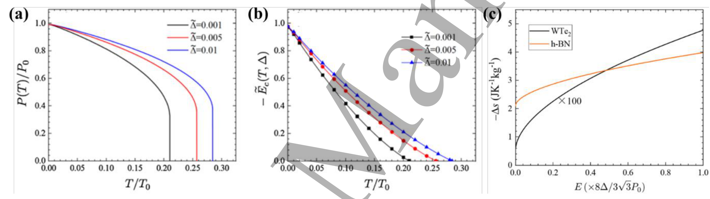
  - **表1** 各材料带隙、面外/面内极化 (pC/m)、翻转能垒 (meV) 汇总
    - **图示描述**：汇总本综述讨论的各滑动铁电材料的带隙、面外与面内极化 (pC/m) 及翻转能垒 (meV)，是图28性能地图的数值来源。
    - **关键特征**：可直接横向比较 h-BN（P≈2.08 pC/m）、WTe2（0.37 pC/m，0.6 meV）、MoSi2N4（3.36 pC/m）、GeS2/CIPS（HP± 11.77 pC/m）、MnSe（2.7 pC/m）等代表性体系的性能；表中同时列出 Janus TMD、III–V/IV 族二元、磁性多铁材料的关键参数。
    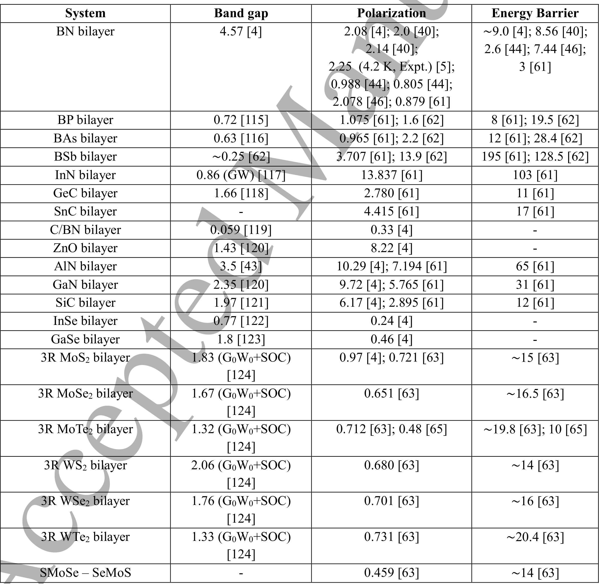
  - **表2** 各滑动铁电材料居里温度 (K) 汇总
    - **图示描述**：列出各滑动铁电/多铁体系的居里温度 Tc (K)，并说明 Tc 应与"孤立势垒 Δ"按 Tc≈2Δ/3kB 关联，而非与集体翻转势垒关联。
    - **关键特征**：例如 h-BN 经 MLIP MD 修正后 Tc≈1500 K、WTe2 Tc≈350 K、β-ZrI2 Tc≈476 K；为评价材料在室温下铁电序稳健性提供参考。
    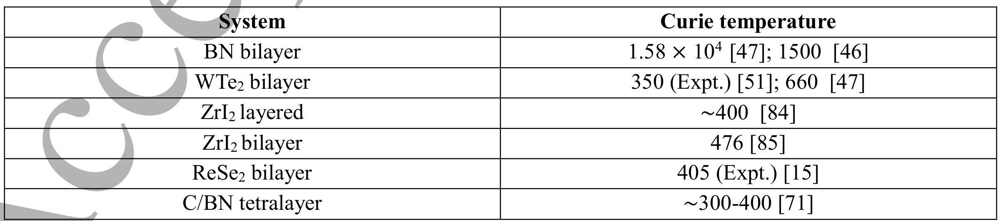
  - **公式图像（笔记中按原文顺序抽取的关键公式）**：
    - **图示描述**：从原文抽取的关键公式图像，涵盖 GPRI 定义、层间高斯重叠 s_in、电偶极矩点电荷模型、倾斜电场势能、动态多铁性感生磁矩、自旋螺旋诱导极化、磁电系数关系及连续介质相变模型等，是正文中 Berry 相/NEB、MLIP、激光翻转、多铁耦合与热力学分析的数学骨架。
    - **关键特征**：eq.2/4 为 GPRI 与原子高斯重叠；eq.7 为含平行+垂直电场的势能 ε(t)=ε0(t)−E∥·p∥−E⊥·p⊥；eq.13 引入 f(h) 修正不等价层间距；eq.14 为点电荷偶极模型；eq.15 为 P=m/d；eq.17 为 P=M∑(S_i×S_j) 自旋螺旋极化；eq.19/20 为磁电关系 μ0ΔM=βS E²+αS E 等。具体编号以图片为准。
    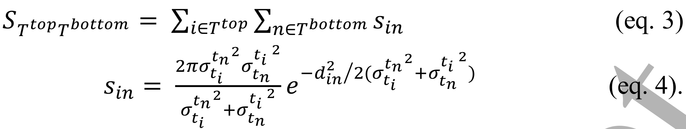 -> [[../figures/mathematical-models-magnetoelectric|磁电耦合与多铁理论]] 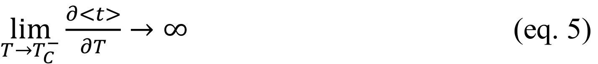 -> [[../figures/mathematical-models-magnetoelectric|磁电耦合与多铁理论]] 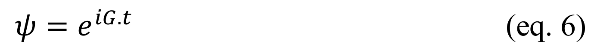 -> [[../figures/mathematical-models-magnetoelectric|磁电耦合与多铁理论]] 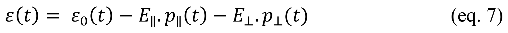 -> [[../figures/mathematical-models-magnetoelectric|磁电耦合与多铁理论]] 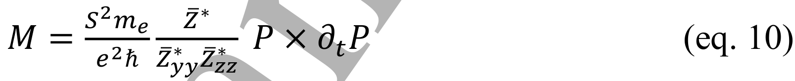 -> [[../figures/mathematical-models-magnetoelectric|磁电耦合与多铁理论]] 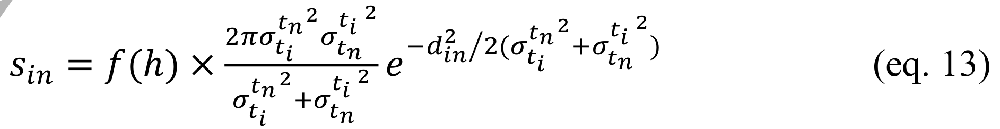 -> [[../figures/mathematical-models-magnetoelectric|磁电耦合与多铁理论]] 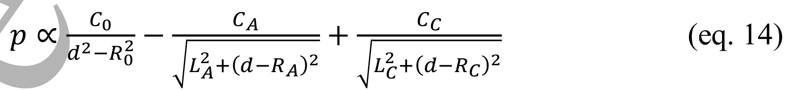 -> [[../figures/mathematical-models-magnetoelectric|磁电耦合与多铁理论]] 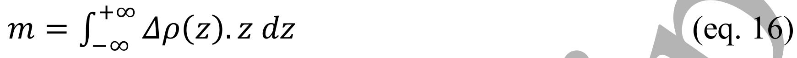 -> [[../figures/mathematical-models-magnetoelectric|磁电耦合与多铁理论]] 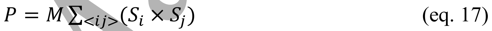 -> [[../figures/mathematical-models-magnetoelectric|磁电耦合与多铁理论]] 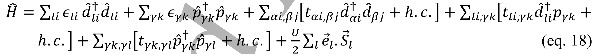 -> [[../figures/mathematical-models-magnetoelectric|磁电耦合与多铁理论]] 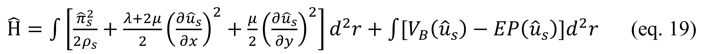 -> [[../figures/mathematical-models-magnetoelectric|磁电耦合与多铁理论]] 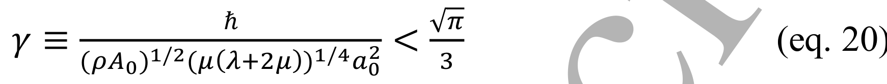 -> [[../figures/mathematical-models-magnetoelectric|磁电耦合与多铁理论]] 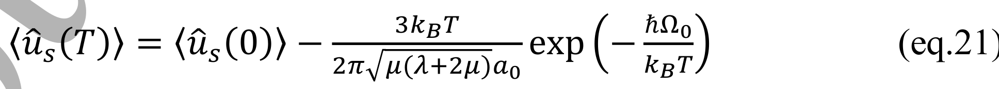 -> [[../figures/mathematical-models-magnetoelectric|磁电耦合与多铁理论]] 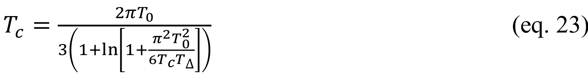 -> [[../figures/mathematical-models-magnetoelectric|磁电耦合与多铁理论]] 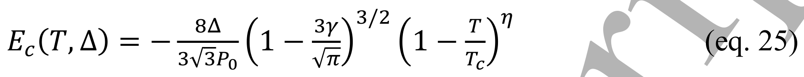 -> [[../figures/mathematical-models-magnetoelectric|磁电耦合与多铁理论]] 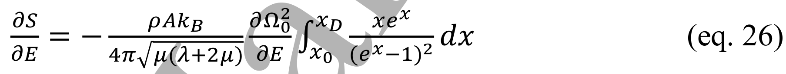 -> [[../figures/mathematical-models-magnetoelectric|磁电耦合与多铁理论]] 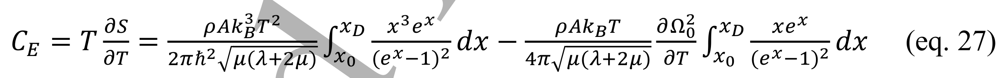 -> [[../figures/mathematical-models-magnetoelectric|磁电耦合与多铁理论]]
## 🔬 项目连接
  - **project-5 SnTe 铁电模拟 —— strong**。本文是滑动铁电 DFT 方法论的"全集"：现代极化理论/Berry 相（King-Smith & Vanderbilt）计算 P、Wannier 电荷中心、NEB/CI-NEB 计算翻转路径与能垒、差分电荷密度与平面平均屏蔽电荷积分求 P、PBE/PBE+U/SOC、DFPT 声子、AIMD 室温稳定性、电偶极矩随层间距/应变/电场的扫描流程——均可直接迁移到 SnTe（以及本项目中任何铁电体）的 DFT 模拟。文中还给出了关键"陷阱"：(i) 应使用"孤立势垒 Δ"而非集体翻转势垒与 Tc 关联（Tc≈2Δ/3kB）；(ii) 二维材料高面内刚度使低能垒下极化仍稳健；(iii) 倾斜电场可降低矫顽场；(iv) Janus/内建电场比压缩层间距更能提升极化而不抬能垒；(v) 表1/表2/图28 的极化-能垒地图可作为 SnTe 计算结果的横向参照系。SnTe 在文中虽未直接出现（讨论了 SnS 与 1-uc BTO/SnS），但同属 IV–VI 铁电半导体方法论范畴。
  - **project-2 Mn 多铁 —— strong**。综述第 3 节几乎是"Mn 基二维多铁手册"：MnBi2Te4（滑动切换磁序与 QAH/轴子拓扑）、MnSe（AFM 滑动铁电、电控塞曼劈裂、磁电系数 αS≈−9.8×10⁻¹⁴ G·cm²/V）、SnS2/MnPSe3/SnS2（PT 破缺诱导交变磁性）、CrI3/MnSe2 异质结（磁序反转电子极化）。磁电耦合的微观机制（层间 dz²–pz 杂化、Berry 曲率随电场、μ0ΔM=βE²+αE）对 Mn 基多铁项目的物理图像与计算设计有直接参考价值；altermagnetism、dynamical multiferroicity 等新概念也可作为 wiki 多铁条目扩充。
  - **project-7 CDW —— medium**。WTe2 是 CDW 与铁电共存的明星体系，本文 §2.2 详述 Td-WTe2 双层的 0.6 meV 滑动能垒、Pmn21 对称性、PRI 模型、层间 Te-pz 耦合、自旋纹理；§3.3 中 MnBi2Te4 也涉及 Te-pz 层间耦合驱动的拓扑相变。NbI4 的 Peierls 二聚化与滑动极化（§2.12）则是 CDW/二聚化与铁电耦合的直接案例。CDW 本身不是综述主线，但上述体系的结构失稳、声子虚频（如 ZrI2 T0 相 Γ2⁻/Γ4⁺ 模）、层间耦合分析方法可迁移。
  - **project-4 TTF 分子计算 —— weak**。文中提出"用分子层（苯）替代原子层实现 10⁴ Tbit/in² 超高密度滑动存储"（§2.9，苯/石墨烯/h-BN），以及分子独立存储比特的图像，与分子晶体计算有形式类比；DFT+vdW+NEB 的层间滑移流程也适用于 TTF 类分子晶体。但 TTF 本身未出现，连接强度为弱。
  - **project-1 双光子 —— weak**。§2.1.4 讨论 THz 激光（1.08 THz，高斯包络电场脉冲）共振激发 E(4)/E(5) 红外软模、3–4 ps 内实现层间滑动翻转，并通过 TD-DFT 给出电子激发→电声能量转移→层间滑动三步机制，且动态多铁性感生磁场。这对光-铁电耦合、光控磁有参考价值，但与双光子荧光/吸收无直接关系。
  - **project-3 机械发光 NN**：无直接项目连接。
  - **project-6 湿度传感器**：无直接项目连接。
## 🔗 项目双链
- 项目 [[../projects/project-2-mn-multiferroics|项目二：Mn极化结构铁电材料]]
- 项目 [[../projects/project-4-ttf-molecular-calc|项目四：lsl老师的ttf分子计算]]
- 项目 [[../projects/project-5-snte-ferroelectric-sim|项目五：lammps势函数SnTe铁电模拟]]
- 项目 [[../projects/project-7-cdw-charge-density-wave|项目七：CDW电荷密度波]]

## 📝 组织与用词
文章按"原型 h-BN → 单质/二元/TMD/Janus/多层/异质结/分子层 → 多铁与拓扑耦合 → 群论与热力学一般理论 → 隧道结应用 → 总结"递进；每材料小节统一给出对称性破缺、极化值、NEB 能垒、应变/电场/层数响应、新奇物性，是非常规范的理论综述范式。值得在 wiki 中复用的术语：
  - sliding ferroelectricity [[../concepts/sliding-ferroelectricity|sliding ferroelectricity]] / 滑动铁电性
  - out-of-plane (interlayer) polarization / 面外（层间）极化
  - across-layer sliding ferroelectricity (ALSF) / 跨层滑动铁电性 [[../concepts/across-layer-sliding-ferroelectricity|跨层滑动铁电性]]
  - Global/Local Polarization Registry Index (GPRI/LPRI) / 全局/局部极化登记指数
  - orbital distortion (N-pz) / 轨道畸变
  - dynamical multiferroicity (P×∂tP) / 动态多铁性 [[../concepts/dynamical-multiferroicity|动态多铁性]]
  - altermagnetic phase / 交变磁性相
  - layer-polarized spin Hall effect (LP-SHE) / 层极化自旋霍尔效应 [[../concepts/layer-polarized-spin-hall-effect|层极化自旋霍尔效应]]
  - inclined/tilted electric field / 倾斜电场
  - isolated barrier Δ vs. collective switching barrier / 孤立势垒与集体翻转势垒
## ✏️ 可写入 Wiki 的要点
  1. 滑动[[../concepts/ferroelectricity|铁电性]]是电子效应：Jiang 等在 h-BN 中证实滑动不产生面外离子位移，极化来自[[../concepts/interlayer-charge-transfer|层间[[../concepts/charge-transfer|电荷转移]]]]；Liu 等进一步指出 N-pz MLWF 瓣在双层中不对称（N1 比 N2 畸变更强），N-pz–B-pz 排斥与 N-pz–B³⁺ 吸引共同导致电荷中心偏移。
  2. 定量参考值：h-BN 双层 P=2.08 pC/m（Wannier 法 2.14，实验 2.25 pC/m @4.2 K），NEB 能垒 9 meV（BA→AP→AB 路径仅 2.6 meV）；层间电压 U=qd/εS 约 0.23 V (BN)、0.17 V (C/BN)。
  3. GPRI=(S_BN−S_NB)/(S_BN^max−S_NB^max)，以二维高斯原子投影重叠定义，σ_BN=σ_NB=0.22b (b=a/√3, a=2.51 Å) 时与 DFT 势降最佳吻合；可推广到 WTe2、MoS2（引入指数 f(h)=e^{−α(h−h0)} 修正不等价层间距）与转角莫尔体系（LPRI 给出 ~10 nm 畴壁宽度，与 KPFM 实验一致）。
  4. 应变/压力规律：P 与层间距成反比；面内双轴应变经弛豫反而增大层间距（负面外泊松比），h-BN AB 构型同时具有负纵向压电 d33；压力与应变使 P 和能垒同时升高。Janus TMD 中内建电场（而非压缩层间距）可在不显著抬能垒下将 TeMoS 极化较 MoS2 提升 65%——P 越大，电场下 AB/AC 能量差越大，越易电控翻转。
  5. MLIP 精度：DREAM/Allegro 框架同时预测能量、力与 [[../concepts/born-effective-charge|Born 有效电荷]]张量，结构能量差 MAE=0.053 meV/atom；用复[[../concepts/order-parameter|序参量]] ψ=e^{iG·t} 的 MD（900 原子，1–2000 K，50 ps/点）给出 h-BN Tc≈1500 K（此前高估为 1.58×10⁴ K），并证实倾斜 24° 电场 (E∥=0.2 V/Å) 将 E⊥,c 从 ~2 V/Å 显著降低。
  6. 激光超快翻转：h-BN 的 E(4)/E(5) 简并光学模在 1.08 THz，沿 y 偏振的高斯脉冲在 5 K 下 3–4 ps 内克服势垒完成翻转；P 矢量做摆线型旋转并按 M=(S/2me)(e²/ħ)(Z̄*/Z̄*_yy Z̄*_zz) P×∂tP 感生 Mx≈2.7×10⁻⁸ μB、B≈12 nT（[[../concepts/dynamical-multiferroicity|动态[[../concepts/multiferroicity|多铁性]]]]）。TD-DFT 给出"电子 pz 激发→电声能量转移→层间滑动→弛豫反向极化"三步机制。
  7. WTe2 原型：Pmn21 正交结构，NEB 势垒 0.6 meV，P_max=0.37 pC/m（实验 0.23）；AFE 态比 FE 高 0.39 eV/f.u.，Tc≈350 K；Tc 应与"孤立势垒 Δ"关联 (Tc≈2Δ/3kB) 而非集体[[../concepts/switching-barrier|翻转势垒]]。[[../concepts/polarization-switching|极化翻转]]时 Rashba [[../concepts/spin-texture|自旋纹理]]反转，可设计自旋 FET（n≥3 层 WTe2 做电极解决阻抗失配）。
  8. 跨层滑动铁电 (ALSF)：单质双层任何滑动都不破反演，但[[../entities/graphene-tetralayer|四层[[../entities/graphene|石墨烯]]]]的 ABAC/CABA/CBAB 等堆垛通过次近邻不对称耦合产生 0.21 pC/m 面外 + 57.49 pC/m 面内极化，能垒 <5 meV；h-BN/插层石墨烯/h-BN 为 0.48 pC/m、3 meV。1+3 转角四层石墨烯的极性畴可被电场平移底层切换——"滑动莫尔铁电性"。苯分子层/石墨烯/h-BN 预测 10⁴ Tbit/in²。
  9. 多铁耦合定量：3R-VS2 中 δd=0.6 Å 时线性磁电 αS≈−9.8×10⁻¹⁴ G·cm²/V (−1.48×10⁻⁷ s/m)，δd=0.8 Å 时出现二阶 βS≈−4.5×10⁻²² G·cm³/V²；AFM↔FM 转变伴随半导体-金属转变。MnSe 双层 P=2.7 pC/m、层间电势差 0.23 V、电控净磁矩 8 mμB/胞，磁电效应随层数线性增长（三层 16、四层 24 mμB）；空穴掺杂 1.39×10¹⁵ cm⁻² 时磁矩极大 0.3 μB。
  10. 拓扑与[[../concepts/altermagnetism|交变磁性]]：2H-MnBi2Te4 双层 AB′↔AC′ 翻转能垒 30 meV，可在 AFM/FM 与平庸/陈绝缘体态间切换；四层 P1-FLMBT 为铁电 QAH 绝缘体，σxy=±e²/h，P 翻转逆转 AFM 自旋分布、Berry 曲率与手性边缘态。SnS2/MnPSe3/SnS2 与 PtBr3 中滑动破坏 PT 对称后出现交变磁相，伴随晶体[[../concepts/hall-effect|霍尔效应]]与 MOKE，可用于非易失读取。ZrI2 头对头带电畴壁因束缚电荷使价/导带抵达[[../concepts/fermi-surfaces|费米面]]（0.24 eV 势差）而金属化，[[../concepts/formation-energy|形成能]] E_DW=2P_el E_g/e≈1 mJ/m²。
  11. 一般理论判据：双层要有面外极化必须打破反演、z 镜面、二次旋转轴等对称性；两个中心对称单层也可堆出极性双层。连续介质机电（横场 Ising 类）模型给出一级 FE–PE 相变（P(T) 在 Tc 不连续、临界场随温度变化、伴随电卡熵变 Δs(E)）；尽管翻转势垒极低，[[../concepts/2D-materials|二维材料]]的高面内刚度使弹性能代价抑制热涨落，从而保护长程铁电序（与 Mermin–Wagner 约束相容）。
  12. 应用：滑动[[../entities/FTJ|铁电隧道结]]预测巨大 TER；压电纳米发电机（WTe2 沿 x/y 拖动产生振荡电信号）；滑移可调制载流子迁移率（ZrI2 金属畴壁）；MoSi2N4 [[../concepts/moire-superlattice|莫尔[[../concepts/superlattice|超晶格]]]]中垂直极化（非层间杂化）产生 II 型量子点阵列用于激子捕获；GeS2/CIPS 莫尔阵列 5° 转角下 0.7 TB/cm² 存储密度。
