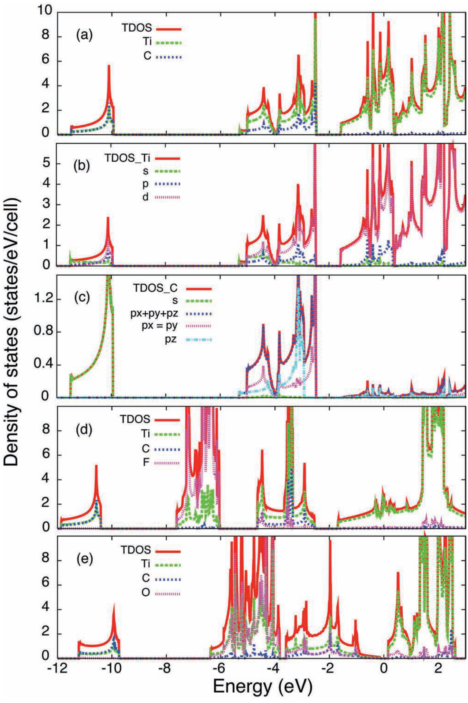
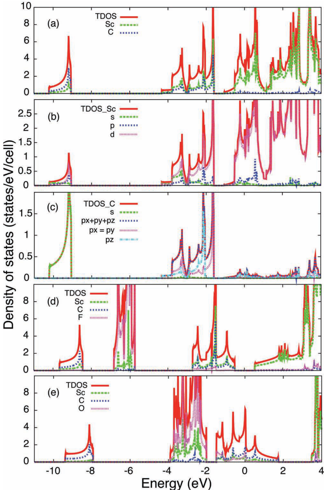
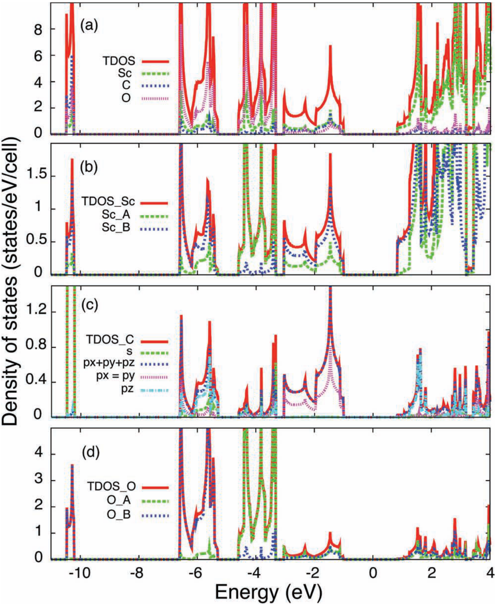
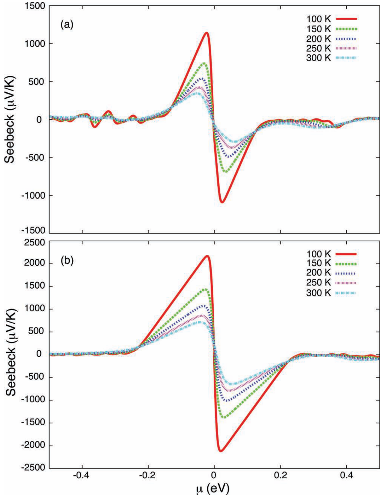

## khazaeiNovelElectronicMagnetic2013 — 二维过渡金属碳化物和氮化物的新型电子和磁性

## 📄 元数据
Khazaei, Arai, Sasaki, Chung, Venkataramanan, Estili, Sakka, Kawazoe et al.，2013，Advanced Functional Materials 23(17): 2185–2192，DOI 10.1002/adfm.201202502

## 💡 一句话
本文用第一性原理系统计算了 F/OH/O 表面功能化的 M₂C/M₂N 型 MXene，提出"电子计数规则"解释金属-半导体转变，预测了 Sc/Ti/Zr/Hf 基半导体 MXene、Cr 基铁磁 MXene 以及低温下 >1000 μV/K 的巨塞贝克系数。

## 🔗 Wiki 双链
  - 概念 [[../concepts/2D-materials]]、[[../concepts/density-functional-theory]]、[[../concepts/electron-counting-rule]]、[[../concepts/strain-engineering]]、[[../concepts/surface-functionalization|表面功能化]]、[[../concepts/ferromagnetism|铁磁性]]、[[../concepts/thermoelectricity|热电效应]]、[[../concepts/boltzmann-transport|玻尔兹曼输运]]、[[../concepts/max-phase|MAX相]]、[[../concepts/phonon-stability|声子稳定性]]
  - 实体 [[../entities/MXenes]]、[[../entities/VASP]]、[[../entities/MAX-phases|MAX相家族]]、[[../entities/Sc2CO2|Sc₂CO₂]]
  - 图表 [[../figures/crystal-structures]]、[[../figures/electronic-bands]]、[[../figures/vibrational-spectra]]、[[../figures/mathematical-models]]
  - 年度 [[../write/2013]]
  - 相关论文 [[../../raw/note/khazaeiNovelElectronicMagnetic2013]]

## 🆕 新概念/实体建议
  - `BoltzTrap`：基于玻尔兹曼输运方程计算热电系数的开源代码。
  - `Ti2CO2` / `Sc2CF2` / `Cr2C` / `Cr2N`：本文具体预测的功能化 MXene 实体，可作为 MXene 子条目或在 MXenes 条目中详述。

## 📊 关键图表
  - 
  - 
  - 
  - 
  - 
  - 
  - 

## 🔬 项目连接
  - **project-2（Mn多铁）— weak**：本文用自旋极化 GGA/PBE 预测 Cr 基 MXene 的铁磁基态，并明确提出应变可诱导/调控二维磁性（类比 VS₂、VSe₂）。这套"磁性二维体系的 DFT 稳定性 + 磁矩 + FM/非磁能量差"计算流程，对 Mn 基多铁体系中磁序判定与应变调控有方法学参考价值；材料体系本身不重叠。
  - **project-4（TTF分子计算）— weak**：本文以离子价态/电子供求关系解释结构稳定性与金属-半导体转变（电子计数规则），并以电荷转移 + 轨道杂化分析成键；这种"价电子计数 + DFT 验证"的思路可类比迁移到 TTF 类电荷转移分子晶体的计算分析。
  - **project-5（SnTe铁电模拟）— weak**：同属二维/层状材料的 DFT 电子结构计算，表面终止（F/OH/O）显著改变带隙与能带对齐的物理图像，对 SnTe 表面/界面工程与能带调控有物理类比意义；但本文不涉及铁电或拓扑。
  - project-1（双光子）、project-3（机械发光NN）、project-6（湿度传感器）、project-7（CDW）：无直接项目连接。（MXene 虽可用于湿度传感，但本文未涉及传感机制。）

## 📝 组织与用词
  文章按"背景 → 计算细节 → 四种表面吸附构型模型 → 稳定性筛选（总能/形成能/化学势/声子谱）→ 电子结构（DOS/能带）→ 磁性 → 热电 → 结论"的经典计算材料范式展开。核心论证是把复杂的 DFT 结果归结为一个直观的"电子计数"图像：过渡金属 M 的价电子数与 X（C/N）+ T（F/OH/O）的吸电子需求是否匹配，决定费米能级落入 M-d 带还是落入 d-p 间隙。
  值得复用的术语：
  - MXenes / MXene（过渡金属碳/氮化物二维材料）
  - MAX phases / MAX 相
  - [[../concepts/surface-functionalization|surface functionalization / termination]]（表面功能化/终止）
  - [[../concepts/electron-counting-rule|electron counting rule]]（电子计数规则）
  - hollow sites A / B（A/B 型空心位）
  - [[../concepts/formation-energy|formation energy]]（形成能）
  - Seebeck coefficient（塞贝克系数）
  - figure of merit ZT（热电优值）

  - [[../concepts/MAX-phases|MAX-phases]]
## ✏️ 可写入 Wiki 的要点
  1. 原始（未功能化）M₂X MXene 全部为金属，费米能级落在过渡金属 d 带；C/N 的 p 带位于 d 带下方，二者间存在约 0.5–1.0 eV 的天然间隙。
  2. 功能基团作为电子受体从 M 抽走电子：F/OH 各接受 1 个电子，O 接受 2 个电子；当 M 的价电子恰好满足 X 和 T 的需求时，费米能级落入 d-p 间隙，体系变为半导体——即"电子计数规则"。
  3. 预测的半导体 MXene 及 PBE 带隙：Sc₂CF₂ 1.03 eV、Sc₂C(OH)₂ 0.45 eV（直接带隙）、Sc₂CO₂ 1.8 eV、Ti₂CO₂ 0.24 eV、Zr₂CO₂ 0.88 eV、Hf₂CO₂ 1.0 eV；除 Sc₂C(OH)₂ 外均为间接带隙。
  4. Ti(+4)、Zr(+4)、Hf(+4) 能同时满足 C(-4) 和两个 O(-2)，故 O 功能化后为半导体；Sc(+3) 只需 F/OH(-1) 即可饱和，故 Sc₂CF₂、Sc₂C(OH)₂ 为半导体。
  5. Sc₂CO₂ 因 Sc 无法提供两个 O 所需的 4 个电子，稳定构型为模型 3：一个 O 移至 B 型空心位直接与下方 C 成键（O_B–C 距离 1.65 Å），O_B pz 与 C pz 杂化，反键态位于 1.0–1.5 eV，使体系成为绝缘体。
  6. 表面吸附构型选择规律：若 M 能提供足够电子，模型 2（基团在 A 型空心位）最稳定；电子不足时模型 3 或 4（基团在 B 型空心位，可与 X 杂化获电子）更稳定；顶位吸附（模型 1）通常最不稳定。
  7. 形成能公式 Hf = Etot(M₂XYₙ) − Etot(M₂X) − (n/2)Etot(Y₂) − nΔμ；所有体系形成能均为约 −7 至 −12 eV 的大负值，证明完全功能化热力学高度有利；Ti₂C 在 −4.0–0.0 eV 氧化学势范围内完全氧覆盖（Ti₂CO₂）最稳定。
  8. Ti₂CO₂ 声子谱全正（无虚频），证明完全功能化 MXene 动力学/机械稳定；多层 MXene 层间距约 3.0 Å，主要靠范德华作用结合，费米能级附近电子结构与单层差异不大。
  9. Cr₂CF₂、Cr₂C(OH)₂、Cr₂NF₂、Cr₂N(OH)₂、Cr₂NO₂ 基态为铁磁性，磁矩 2.24–3.23 μB/Cr，FM 与非磁态能量差 −0.08 至 −0.49 eV/Cr，预示磁性可能维持到近室温；磁性源于 Cr 的 d 轨道。
  10. 基于 BoltzTrap 的热电计算：Ti₂CO₂ 在 ~100 K 塞贝克系数峰值约 1140 μV/K，可与 SrTiO₃ 的巨塞贝克系数（~850 μV/K @90 K）相比；带隙更大的 Sc₂C(OH)₂ 峰值更高，源于带边附近态密度的剧烈反差。作者指出完整 ZT 评估还需电导率 σ 与晶格/电子热导率 κl、κe。
