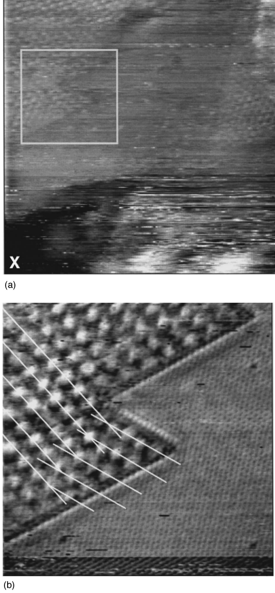
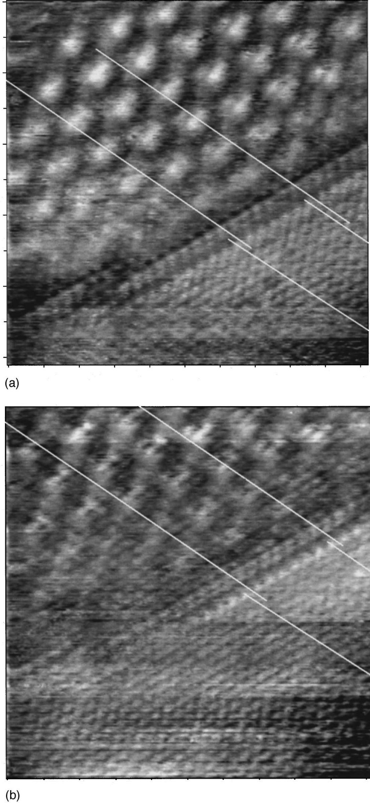
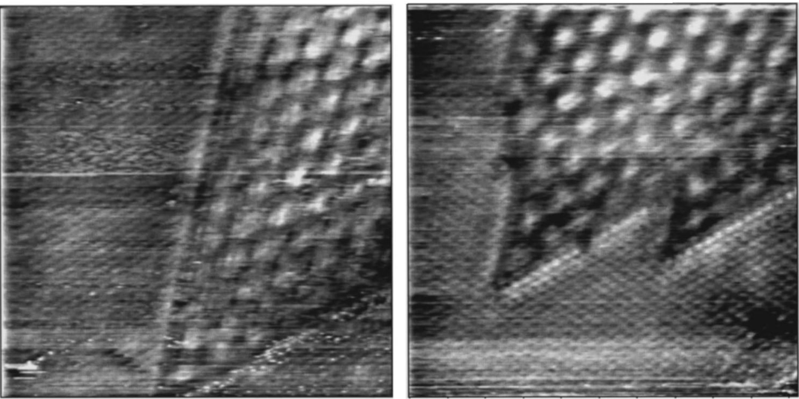

## kimObservationPhaseTransition1997 — STM 针尖诱导 1T-TaS₂ 中 T→H 相变的观察

- **元数据**：Ju-Jin Kim, Chan Park, W. Yamaguchi, O. Shiino, K. Kitazawa, T. Hasegawa，1997，*Physical Review B* **56**(24), R15573–R15576，DOI: 10.1103/PhysRevB.56.R15573
- **一句话**：室温下用 STM 针尖施加 −10 V 短脉冲，在 1T-TaS₂ 表面诱导出 T→H 的晶-晶相变，并通过相界处原子行的分数倍错位证明其机制是表层 S 原子层沿 [112̄0] 方向整体相干滑移 (√3/3)a₀。

- **现有wiki双链**：
  - 概念 [[../concepts/charge-density-wave]]、[[../concepts/2D-materials]]、[[../concepts/sliding-ferroelectricity]]、[[../concepts/topological-defects]]
  - 实体 [[../entities/TMDs]]
  - 图表 [[../figures/crystal-structures]]
  - 年度 [[../write/1997]]
  - 项目 [[../projects/project-7-cdw-charge-density-wave]]、[[../projects/project-5-snte-ferroelectric-sim]]
  - 相关论文 [[../../raw/note/kimObservationPhaseTransition1997]]

- **新概念/实体建议**：
  - `1T-TaS2.md`（实体）：经典 TMD CDW/Mott 体系，室温 NCCDW 相具 √13×√13 超结构，是 STM 诱导多型相变的原型材料，应单独立条。
  - `2H-TaSe2.md`（实体）：Zhang 等 1996 年首次报道 STM 诱导 H→T 反向晶-晶相变的体系，本文的直接前驱工作对象。
  - `polytypism.md`（概念）：多型性，TMD 中 T（八面体配位）与 H（三棱柱配位）等多型体由层内配位/堆垛决定，相同元素不同结构性质迥异。
  - `tip-induced-phase-transition.md`（概念）：STM 针尖电压脉冲诱导的晶体-晶体相变，区别于场蒸发、机械接触、焦耳热等传统单原子操控机制。
  - `coherent-layer-sliding.md`（概念）：共格原子层滑移，整个表面硫族原子层作为整体沿特定晶向位移分数个晶格常数，实现多型体转换而不破坏层内共价键。
  - `stm-topography.md`（图表类型）：STM 恒流形貌/原子分辨图，建议在 wiki/figures 下新建以归类本文 4 张实验图。

- **关键图表**：
  - 
  - 
  - ![图3 T-H 相界原子模型：(a) 沿 [112̄0] 截面，表层 S 原子层共格滑移；(b) 俯视 S 原子构型，滑移 (√3/3)a₀ 致界面 (√3/6)a₀≈1 Å 错位](../../raw/figures/kimObservationPhaseTransition1997/fig_3_4YVA892K.png)
  - 

- **项目连接**：
  - **project-7（CDW，strong）**：本文是 TMD CDW 体系 STM 研究的经典实验文献。核心观测对象即 1T-TaS₂ 室温近公度相（NCCDW）的 √13×√13 超结构（周期 ~13 Å，畴周期 80–85 Å）；CDW 在三角形相界角部发生 13°–15° 旋转并形成 CDW 孪晶、被界面钉扎，是理解 CDW 弹性、公度性-非公度性、畴与缺陷相互作用的直接实验素材。新生 H 相上观测到的微弱 √13×√13 CDW 信号被归因于下方第二层 T 相的"透视"信号，可作为 STM 深度敏感性/层间耦合的参考案例。
  - **project-5（SnTe 铁电模拟，weak）**：方法/物理类比层面有参考价值。本文提出的"表面原子层沿特定晶向整体相干滑移、在相界处产生分数倍错位、相界沿高对称方向（60°）择优形成"的图像，与层状/低维材料中滑动铁电性、铁弹/铁电畴壁的原子级结构、拓扑相界的形成能与取向有形式上的类比；其"最小能量路径沿 [112̄0]"的滑移势垒图像也可启发对 SnTe 中位移型相变路径、畴壁能各向异性的思考。但本文不涉及铁电物理，故仅 weak。
  - **project-1/2/3/4/6**：无直接项目连接（不涉及双光子、Mn 多铁、机械发光 NN、TTF 分子计算或湿度传感）。

- **组织与用词**：
  文章按"现象观察 → 结构表征 → 机制解释"的快速通讯逻辑展开：先给出大范围形貌证明 H 相生成（图1），再用多偏压高分辨像在原子尺度证明两相晶格连续而 S 原子行存在分数倍错位（图2），随后提出并定量验证 S 层共格滑移模型（图3），最后以 60° 特征相界（图4）和"H 相上弱 CDW 来自下层"作为旁证。关键术语：
  - T phase / H phase — T 相（八面体配位 1T）/ H 相（三棱柱配位 2H）
  - charge-density-wave (CDW) — 电荷密度波
  - nearly commensurate CDW (NCCDW) — 近公度电荷密度波
  - √13×√13 superstructure — √13×√13 超结构
  - coherent shift / collective motion — 共格滑移 / 集体运动
  - phase boundary — 相界
  - trigonal prismatic / octahedral coordination — 三棱柱 / 八面体配位
  - CDW twin — CDW 孪晶

- **可写入wiki的要点**：
  1. 1T-TaS₂ 在室温处于 NCCDW 相，表面形成周期 ~13 Å 的 √13×√13 CDW 超结构，畴周期 80–85 Å；该 CDW 超晶格相对底层原子晶格（a₀≈3.3 Å）旋转约 14°。
  2. STM 针尖电压脉冲（−8 至 −9 V 阈值，典型 −10 V × 0.5–1 ms）可在室温、UHV（~1×10⁻¹⁰ Torr）恒流模式下，在 1T-TaS₂ 表面诱导出直径 100–500 Å 的 H 相（2H-TaS₂）区域，跨界无台阶，截面分析确认高度连续。
  3. T→H 相变机制为表层 S 原子层沿 [112̄0] 方向集体相干滑移 (√3/3)a₀（~1.9 Å），将 Ta 由八面体配位转为三棱柱配位；最小能量路径沿该方向。
  4. 模型预测并经图2(b)证实：T/H 相界处 S 原子行存在 (√3/6)a₀≈1 Å 的分数倍错位，两行沿相界平行但位移非晶格常数整数倍，充当"缓冲行"。
  5. 相界沿三角晶格高对称方向延伸，特征夹角 60°（或 270°），由六方晶格对称性决定能量择优取向。
  6. 相界角部 CDW 发生 13°–15° 旋转并沿相界排列，源于 CDW 超晶格相对原子晶格可顺/逆时针取向的孪晶结构；NCCDW 的非公度性使其易被界面间断钉扎、以较低能量代价重排。
  7. 新生 H 相表面偶见极弱 √13×√13 CDW 调制，被归因于 STM 探测到下方未转变的第二层 T 相（与 Han 等在 4Hb-TaS₂ 上的观测一致），证明相变仅发生在最表层 TaS₂。
  8. 脉冲中心点存在因电子轰击升华导致的整层移除暗坑，H 相区围绕该坑生成；相变在暴露区域周围可重复出现。
  9. 该工作将 STM 诱导晶-晶相变从 Zhang 等 1996 年在 2H-TaSe₂ 上液氦温度的 H→T 结果，扩展到 1T-TaS₂ 室温下的反向 T→H，证明此类集体滑移相变在 TMD 中具普适性。
  10. 驱动力被定性归因于高场（~10⁹ V/m 量级）极化力与非弹性电子隧穿注入激发的共同作用，论文未定量区分电场效应、焦耳热与载流子注入的各自贡献（留待 STS/正偏压对照实验）。
