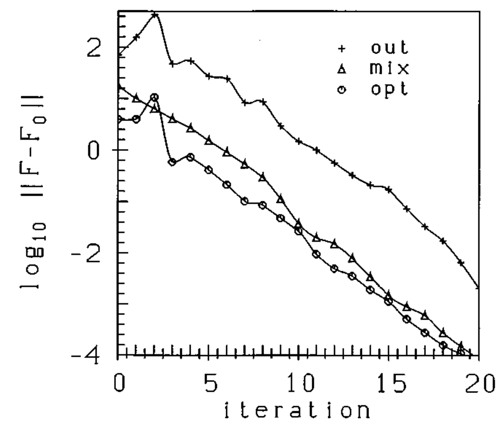
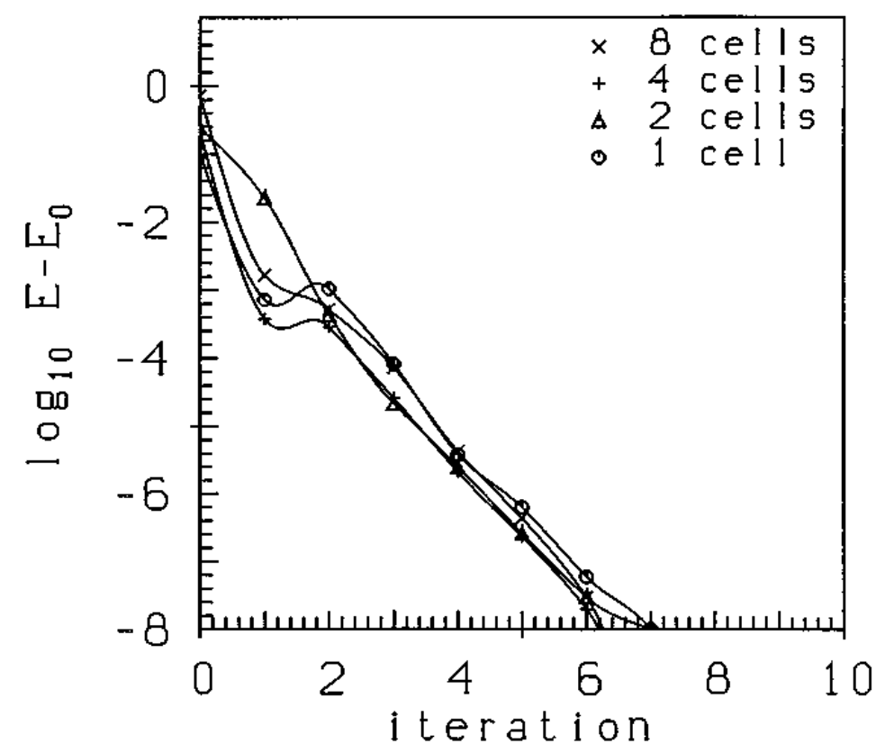
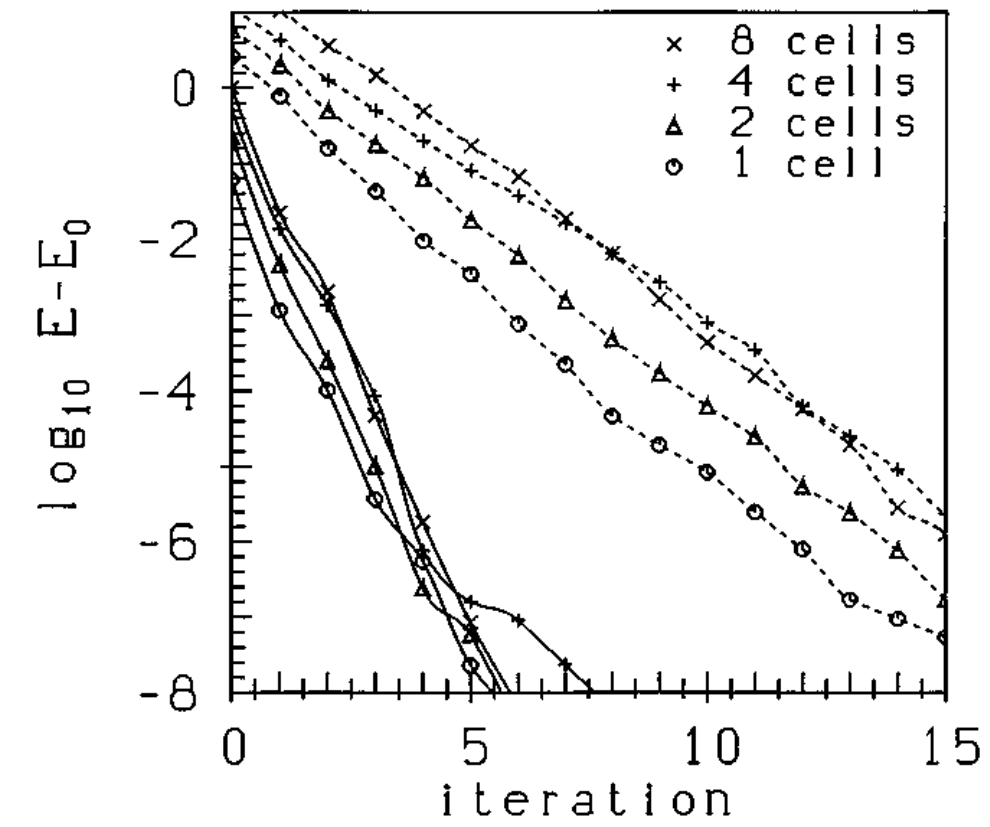
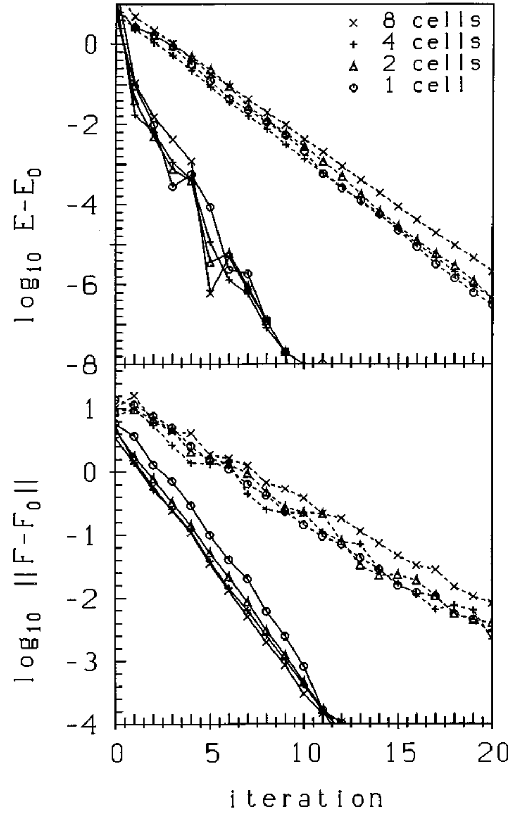
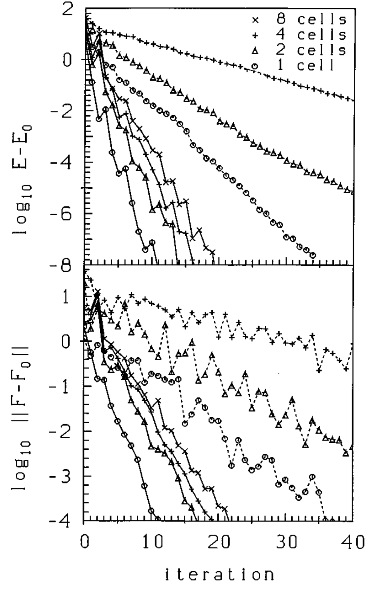
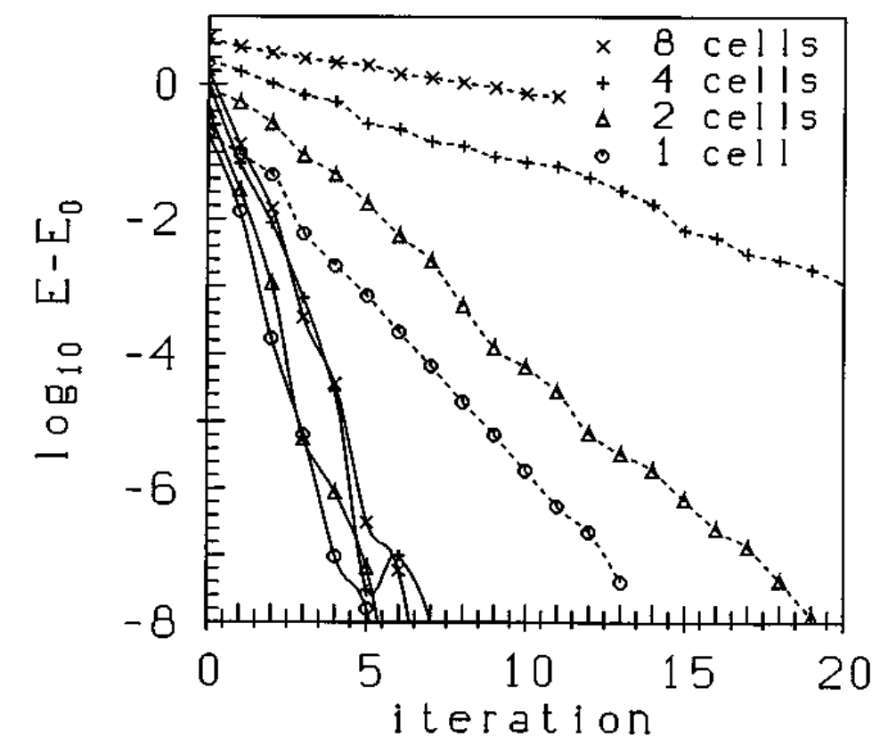
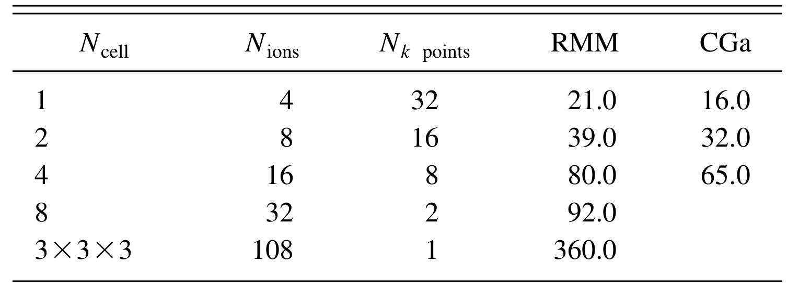

## kresseEfficientIterativeSchemes1996d — 基于平面波基集的从头算总能量计算的高效迭代格式

- **元数据**：G. Kresse、J. Furthmüller，1996，Physical Review B 54(16), 11169–11186，DOI 10.1103/PhysRevB.54.11169。
- **一句话**：本文提出 RMM-DIIS 迭代对角化与基于 Kerker 预条件的 Pulay 电荷密度混合两大算法，将平面波赝势 DFT 的标度从 O(N³) 降至 O(N²)、使金属体系自洽迭代次数几乎不随系统尺寸增长，奠定了 VASP 的核心算法框架。
- **现有wiki双链**：
  - 概念 [[../concepts/density-functional-theory]]
  - 实体 [[../entities/VASP]]
  - 年度 [[../write/1996]]
  - 项目 [[../projects/project-2-mn-multiferroics]]、[[../projects/project-4-ttf-molecular-calc]]、[[../projects/project-5-snte-ferroelectric-sim]]、[[../projects/project-7-cdw-charge-density-wave]]
  - 相关论文 [[../../raw/note/kresseEfficientIterativeSchemes1996d]]
- **新概念/实体建议**：
  - `concepts/rmm-diis.md` — 残差最小化-迭代子空间直接求逆法，通过最小化残差向量范数 ||(H−εS)|φ⟩|| 而非 Rayleigh 商来规避显式正交化，是 VASP 电子步默认对角化器。
  - `concepts/pulay-mixing.md` — Pulay/DIIS 电荷密度混合，将历史输入密度线性组合并在电子数守恒约束下最小化残差范数，等价于准牛顿法逼近介电矩阵逆。
  - `concepts/kerker-preconditioning.md` — Kerker 预条件矩阵 G_q = A·q²/(q²+q₀²)，在小波矢处阻尼电荷密度更新以压制金属中的电荷晃动。
  - `concepts/charge-sloshing.md` — 电荷晃动，金属中介电矩阵随 1/q² 发散导致长波电荷密度在自洽迭代中剧烈振荡、收敛失败的现象。
  - `concepts/subspace-rotation.md` — 子空间旋转/Rayleigh-Ritz 步骤，在试探波函数子空间内对角化 H 以消除能带间耦合、抑制近简并能级间的不稳定搜索方向。
  - `concepts/methfessel-paxton-smearing.md` — Methfessel-Paxton 展宽，用厄米多项式展开阶跃占据函数以平滑金属费米面、改善 k 点收敛，并可解析外推至 σ→0。
- **关键图表**：
  - 图1：fcc-Fe（4 晶胞）自洽循环中不同方案下原子受力的收敛性，opt（式25 修正）较 out 快约 100 倍，证明 Pulay 型力修正对离子弛豫/MD 的关键作用。
  
  - 图2：RMM-DIIS 在不同尺寸立方金刚石超胞（1×–8×）中的非自洽总自由能收敛，各曲线几乎重合，证明对角化迭代次数与系统尺寸无关。
  
  - 图3：RMM-DIIS（实）与 CGa（虚）对不同尺寸 fcc-Fe 超胞的非自洽能量收敛，逐带 RMM-DIIS 比全自由度 CGa 振荡更小、步数更少。
  
  - 图4：自洽计算中 RMM-DIIS 与 CGa 对金刚石的总能量（上）和力（下）收敛，RMM-DIIS 约 10–12 步、力达三位小数精度，比 CGa 快 2–3 倍。
  
  - 图5：fcc-Fe 自洽能量（上）与力（下）收敛，Kerker+Pulay 混合使迭代次数从最小到最大晶胞仅增约一倍，而 CGa 对大晶胞几乎不收敛。
  
  - 图6：近自由电子金属 fcc-Al 的自洽能量收敛，RMM-DIIS 仅需约 8 步且与尺寸无关，CGa 随尺寸增大性能急剧下降。
  
  - 表 I（C 体系）：IBM RS/6000 Model 590 上单步耗时（秒）：8 原子 RMM=1.0/CG=1.0/CGa=1.2；216 原子 RMM=410/CG=800，RMM 对大体系快约一倍。
  
- **项目连接**：
  - **project-2 Mn 多铁（strong）**：项目中的 MnVO3、SrMnO3、LaCuO3 等钙钛矿多铁计算全部依赖 VASP 平面波 DFT。本文是 VASP 电子最小化与电荷混合的算法源头：理解 RMM-DIIS 为何对过渡金属（开壳层、d 带、近简并）稳定、为何必须包含空带、以及 Kerker 混合如何压制磁性金属体系的电荷晃动，直接指导 INCAR 中 ALGO、IMIX/AMIX/BMIX、SIGMA/ISMEAR 的选择与收敛排错。
  - **project-4 TTF 分子计算（strong）**：TTF 分子晶体的 DFT 总能/结构优化同样跑在 VASP 上。本文的力修正公式（式 25）使自洽早期即可获得高精度原子力，对分子晶体的离子弛豫、声子与弱相互作用结构优化尤为重要；Methfessel-Paxton 展宽与 k 点收敛讨论也适用于分子晶体（绝缘体/窄带隙）参数设置。
  - **project-5 SnTe 铁电模拟（strong）**：SnTe 铁电模拟涉及大超胞、Berry 相极化、应变与拓扑缺陷，全部用 VASP。本文证明自洽迭代次数对多达 200+ 原子、1000 电子体系几乎不随尺寸增长（O(N²) 单步标度），这正是大超胞铁电/缺陷计算可行的算法基础；Kerker 混合对金属化或窄带隙 SnTe 表面/缺陷体系的收敛至关重要。
  - **project-7 CDW（strong）**：CDW 体系通常是金属或窄带隙、需要大超胞与密集 k 点，电荷晃动问题突出。本文直接给出金属体系自洽收敛的机理（介电矩阵 1/q² 发散）与解决方案（Kerker 预条件 + 定制度量 + Pulay/Broyden 二次收敛），是 CDW 大超胞结构优化和声子/电声计算能够收敛的方法学保障；空带与展宽的讨论也适用于费米面附近的 CDW 计算。
  - **project-1 双光子**：以实验双光子荧光为主，不涉及平面波 DFT 电子步，无直接项目连接。
  - **project-3 机械发光 NN**：以神经网络/实验为主，无直接项目连接。
  - **project-6 湿度传感器**：以器件/实验为主，无直接项目连接。
- **组织与用词**：全文按"问题分解 → 两大引擎 → 数值验证"组织：第二节建立含部分占据的 KS 自由能泛函与自洽循环、并推导力修正；第三节推导 RMM-DIIS 对角化（对比顺序 CG、子空间旋转、计算量与迭代次数标度）；第四节推导 Pulay 混合与 Kerker 预条件/度量；第五节在绝缘体（金刚石）、开壳层过渡金属（fcc-Fe）、简单金属（fcc-Al）上系统测试非自洽与自洽收敛、单步耗时与尺寸标度；第六节结论。论证的核心手法是把一个病态耦合问题（KS 基态）拆成两个可分别预条件的子问题（对角化 + 电荷混合），再用收敛曲线和计时表证明"总耗时=单步时间×迭代次数"才是公平判据。值得在 wiki 中复用的术语：
  - RMM-DIIS（残差最小化-迭代子空间直接求逆，residual minimization method–direct inversion in the iterative subspace）
  - charge sloshing（电荷晃动）
  - Kerker preconditioner（Kerker 预条件器）
  - Pulay mixing / DIIS（Pulay 混合/直接迭代子空间求逆）
  - subspace rotation（子空间旋转，Rayleigh-Ritz）
  - partial occupancies / smearing（部分占据数/展宽，Methfessel-Paxton）
  - self-consistency cycle vs. direct minimization（自洽循环 vs. 直接最小化，CGa）
  - Harris-Foulkes functional（Harris-Foulkes 泛函，HF 鞍点而非极小）
- **可写入wiki的要点**：
  1. RMM-DIIS 不最小化 Rayleigh 商 ⟨φ|H|φ⟩/⟨φ|S|φ⟩，而最小化残差范数 ||(H−ε_app S)|φ⟩||；残差范数在每个本征态处都是正定的局部极小值，因此原则上无需显式正交化即可收敛到离初值最近的本征态，把 O(N³) 正交化降至最低。
  2. RMM-DIIS 每步沿预条件残差 K|R⟩ 做 Jacobi 试探步 |φ₁⟩=|φ₀⟩+λK|R₀⟩（λ 限 0.1–1，通常 0.3–1），再用 DIIS 在试探向量张成的子空间中最小化残差范数（式 35–39，等价于一个小维度广义本征问题）；试探步廉价故总以试探步收尾。
  3. 必须保留子空间旋转（Rayleigh-Ritz，式 32–34）和 Gram-Schmidt 重新正交化：相邻本征值 ε 与 ε+δε 之间的残差范数势垒仅为 δε 量级，无旋转时 RMM-DIIS 会越过浅丘收敛到错误能带；旋转还使首步残差等于精确正交梯度、保证初始最速下降稳定。
  4. 金属必须包含费米能级以上空带（文中 fcc-Fe 用 1.5 Nions 个空带）：只算占据带时最高占据带与最低空带间隙随系统尺寸缩小，γ_min∝1/N，收敛随 √N 变慢；空带把"问题区域"上移到对总能/力不重要的未占据态，使所有占据带迭代次数与尺寸无关。
  5. Pulay 混合把输入密度写成历史值的线性组合 ρ_in^opt=Σa_i ρ_in^i，在 Σa_i=1（电子数守恒）下最小化残差范数；作者证明这等价于准牛顿法，其逆雅可比（即介电矩阵逆）满足 G_m|ΔR_i⟩=−|Δρ_i⟩（式 57–60），具有二次收敛性——这是对 Annett 认为 Broyden 类方法不改善标度的直接反驳。
  6. Kerker 预条件 G_q=A·q²/(q²+q₀²)（式 61）针对金属中介电矩阵 J≈1−χU、U(q)∝1/q² 的长波发散：小 q 时 G→0、几乎不混合以阻尼电荷晃动，大 q 时 G→A 退化为高效线性混合；默认 A=0.8、体材料 q₀≈1.0–1.5 Å⁻¹（fcc-Fe 最优 q₀≈4.0 Å⁻¹），磁性体系/表面可用 A=0.2。
  7. 定制度量 f_q=(q²+q₁²)/q²（式 64）给小波矢残差更高权重（最短波矢权重约为最长波矢的 20 倍），强制算法优先收敛长波（最危险的电荷晃动）分量；引入度量比调 G₁ 更重要，且二者独立改善收敛。
  8. 力的式(25)修正 ∫d³r {∂[V_H(r_atom)+V_xc(r_atom)]/∂R_N}[ρ_out−ρ_in] 用原子电荷叠加近似输入密度随离子位置的变化，把自洽早期力的精度提高近两个数量级（图1），使自洽循环可提前停止、大幅加速离子弛豫与 MD。
  9. 部分占据采用 Methfessel-Paxton 展宽：自由能 F=E−Σ_n σ S_N[(ε_n−μ)/σ]，高阶（N=1,2）熵项极小、F(σ)=E_{σ=0}+O(σ^{2N+1})，并用 E_{σ=0}≈[(N+1)F(σ)+E(σ)]/(N+2)（式15）解析外推到零温；熵项本身就是 F 与 E_{σ=0} 之差的误差估计（σ 可调到该误差<1 meV）。
  10. 标度结论：在最多 1000 电子（约 200 简单原子或 100 过渡金属原子）体系上单步计算近 O(N²)（Hamiltonian 作用 N_b N_plw ln N_plw、实空间非局域投影线性于 N），Gram-Schmidt 用 Choleski 分块实现（附录，式 A1–A3）比顺序正交化快 2–4 倍；k 点数随超胞线性减少时总标度可接近 O(N)；256 MB 工作站即可处理上述规模。
