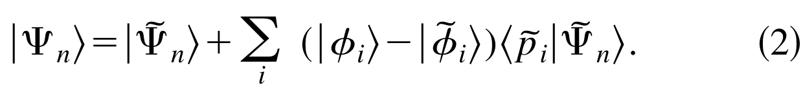
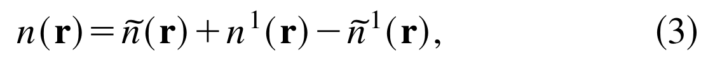
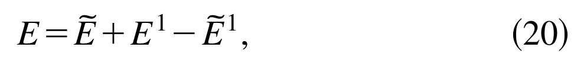
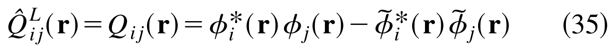
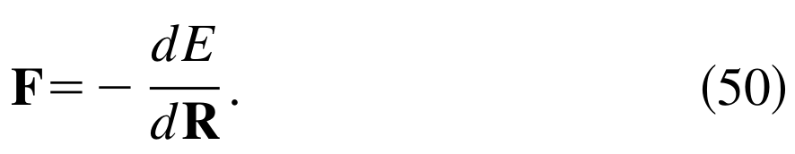
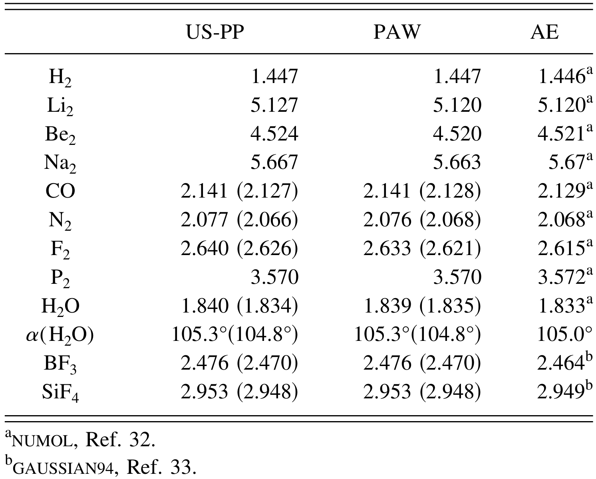
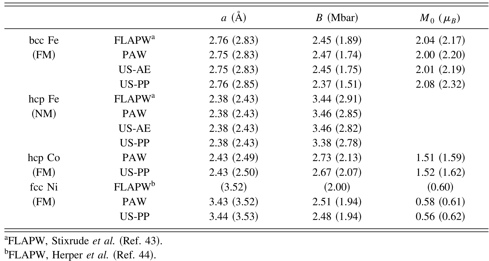
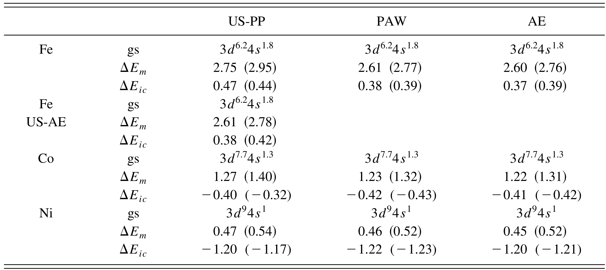

## kresseUltrasoftPseudopotentialsProjector1999c — 从超软赝势到投影增强波方法

## 📄 元数据
G. Kresse、D. Joubert，1999，Physical Review B 59(3), 1758–1775，DOI: 10.1103/PhysRevB.59.1758

## 💡 一句话
严格推导出 Vanderbilt 超软赝势（US-PP）的总能量泛函可由稍作修改的 Blöchl 投影增强波（PAW）泛函对两个原子中心项作一阶线性化得到，从而证明 US-PP 是 PAW 的线性化近似，并给出在现有 US-PP 平面波程序中实现 PAW 的最简路径与系统基准。

## 🔗 Wiki 双链
  - 概念 [[../concepts/density-functional-theory|密度泛函理论]] [[../concepts/ultrasoft-pseudopotential|超软赝势（US-PP）]] [[../concepts/projector-augmented-wave|投影增强波（PAW）]] [[../concepts/norm-conserving-pseudopotential|模守恒赝势]] [[../concepts/augmentation-charge|增强电荷]] [[../concepts/compensation-charge|补偿电荷]] [[../concepts/nonlinear-core-correction|非线性核心修正]] [[../concepts/frozen-core-approximation|冻结核心近似]] [[../concepts/ghost-states|鬼态]] [[../concepts/flapw|FLAPW]]
  - 实体 [[../entities/VASP]]
  - 图表 [[../figures/mathematical-models]] [[../figures/electronic-bands|电子能带与电子态 (Electronic Band Structures & DOS)]]
  - 年度 [[../write/1999]]
  - 相关论文 [[../../raw/note/kresseUltrasoftPseudopotentialsProjector1999c]]

## 📊 关键图表
  -  -> [[../figures/mathematical-models|数学模型与物理公式]]
  -  -> [[../figures/mathematical-models|数学模型与物理公式]]
  -  -> [[../figures/mathematical-models|数学模型与物理公式]]
  -  -> [[../figures/mathematical-models|数学模型与物理公式]]
  -  -> [[../figures/mathematical-models|数学模型与物理公式]]
  -  -> [[../figures/experimental-setups|实验测试与测量装置]]
  -  -> [[../figures/crystal-structures|晶体结构与原子排布]]
  -  -> [[../figures/crystal-structures|晶体结构与原子排布]]

## 🔬 项目连接
无直接项目连接；但作为 VASP/PAW 方法学奠基文献，间接支撑所有基于 DFT 平面波赝势的模拟项目（project-4 TTF 分子计算、project-5 SnTe 铁电模拟、project-2 Mn 多铁、project-7 CDW），尤其在涉及磁性 Fe/Co/Ni、半芯态或强电负性差体系时直接指导赝势选择。

## 🔗 项目双链
- 项目 [[../projects/project-2-mn-multiferroics|项目二：Mn极化结构铁电材料]]
- 项目 [[../projects/project-4-ttf-molecular-calc|项目四：lsl老师的ttf分子计算]]
- 项目 [[../projects/project-5-snte-ferroelectric-sim|项目五：lammps势函数SnTe铁电模拟]]
- 项目 [[../projects/project-7-cdw-charge-density-wave|项目七：CDW电荷密度波]]

## 📝 组织与用词
  - 论证组织：从精确 Kohn–Sham 泛函出发 → 重构 PAW 总能量泛函（Hartree/交换关联的“网格平滑项 + 原子球修正项”补丁式分解，引入补偿电荷与部分核心电荷）→ 在原子参考占据数附近线性化 E¹、Ẽ¹ 直接导出 US-PP 泛函（Eq.34–35）→ 推导重叠算符、哈密顿量、双计数修正 [[../concepts/double-counting-correction|双计数修正]]、力与应力（Eq.39–61）→ PAW 数据集构造（部分波/投影/核心电荷/补偿函数/双网格）→ 小分子、块体、磁性 Fe/Co/Ni 三级数值基准 → 讨论。
  - 值得复用的关键词：
    - 超软赝势（ultrasoft pseudopotential, US-PP）
    - 投影增强波方法（projector augmented-wave method, PAW）
    - 模守恒赝势 [[../concepts/norm-conserving-pseudopotential|模守恒赝势]]（norm-conserving pseudopotential, NCPP）
    - 增强电荷 [[../concepts/augmentation-charge|增强电荷]] / 补偿电荷（augmentation charge / compensation charge n̂）
    - 非线性核心修正 [[../concepts/nonlinear-core-correction|非线性核心修正]]（nonlinear core correction, NLCC, ñ_c）
    - 冻结核心近似 [[../concepts/frozen-core-approximation|冻结核心近似]]（frozen-core approximation）
    - 径向支持网格 / 双网格技术（radial support grid / double grid technique）
    - 鬼态 [[../concepts/ghost-states|鬼态]]（ghost states）
    - 重叠算符 S（overlap operator）
    - 原子参考态线性化（linearization around atomic reference occupancies ρ^a_ij）

## ✏️ 可写入 Wiki 的要点
  1. 形式关系：US-PP 总能量泛函等于把修改后 PAW 泛函中的两个原子中心项 E¹、Ẽ¹ 在原子参考占据数 ρ^a_ij 附近作一阶泰勒展开；展开导数构成 US-PP 的非局域赝势强度 G^US_ij（Eq.35），因此 US-PP 严格是 PAW 的一阶近似。只有当增强函数取全电子形式 Q̂=φ_i*φ_j−φ̃_i*φ̃_j（Eq.36）时二者在[[../concepts/frozen-core-approximation|冻结核心近似]]下严格等价。
  2. PAW 总能量采用“平滑网格 + 球内修正”补丁结构：E = Ẽ + E¹ − Ẽ¹（Eq.20）。Ẽ 在平面波网格上计算，E¹ 与 Ẽ¹ 分别在各原子的径向支持网格上用全电子与赝分波计算；径向网格与平面波网格之间无交叉项，便于高效实现。
  3. [[../concepts/compensation-charge|补偿电荷]] n̂ 仅需使 ñ¹+n̂ 在每个增强球内与全电子价电荷 n¹ 具有相同多极矩（Eq.24），因此 PAW 中的补偿电荷可以很“软”；而 US-PP 为弥补伪化近似，[[../concepts/augmentation-charge|增强电荷]]必须很“硬”、很局域（3d 元素需在 r≈1 a.u. 内描述，平面波代价高）。
  4. 本文相对 Blöchl 原始 PAW 的两项关键修改：(i) Hartree 能按赝势代码传统拆分，核-核作用用 Ewald 求和 U(R,Z_ion) 显式处理；(ii) 在平面波网格的交换[[../concepts/correlation-energy|关联能]]中加入部分电子核心电荷 ñ_c（[[../concepts/nonlinear-core-correction|非线性核心修正]]），使 Ẽ_xc 作用于 ñ+n̂+ñ_c 而非仅 ñ，显著降低部分波不完备带来的误差，并改善 GGA 在核心附近的数值稳定性。
  5. 哈密顿量形式简洁：H = −½Δ + ṽ_eff + Σ_{ij} |p̃_i⟩(D̂_ij + D¹_ij − D̃¹_ij)⟨p̃_j|（Eq.50）。PAW 中 D¹_ij、D̃¹_ij 在电子基态迭代中自洽更新；US-PP 中它们被原子参考势固定、只在赝势生成时计算一次——这正是二者实现上的唯一实质差别。
  6. [[../concepts/overlap-operator|重叠算符]] S = 1 + Σ_ij |p̃_i⟩ q_ij ⟨p̃_j|（Eq.40），q_ij = ⟨φ_i|φ_j⟩−⟨φ̃_i|φ̃_j⟩；广义本征方程 H|Ψ̃_n⟩ = ε_n S|Ψ̃_n⟩。力由 Goedecker–Maschke 力定理导出，分 F1（局域势移动）、F2（补偿电荷移动）、F3（[[../concepts/projector-functions|投影函数]]移动）及 NLCC 项 F_nlcc（Eq.58–61）；PAW 与 US-PP 的力表达式几乎相同，差别仅在 D¹_ij−D̃¹_ij 是否随迭代变化。
  7. 小分子基准（表I，LDA/CA-PZ）：PAW 与弛豫核心全电子结果键长误差普遍 <0.1%（N₂：PAW 2.076 Å vs AE 2.068 Å；F₂：2.633 vs 2.615 Å），硬 PAW（r_c=1.1 a.u., E_cut≈700 eV）进一步逼近 AE；BF₃、SiF₄ 等大电负性差体系误差仍 <0.5%。US-PP 与 PAW 差异约 0.1%，但 Li、Na 等含强局域半芯态元素的 US-PP 构建困难，Li 的 1s 甚至无法解冻。
  8. 块体基准（表III）：PAW 与 Holzwarth 等的 PAW/FLAPW 结果高度一致，晶格常数、体模量、结合能偏差分别 <0.5%、5%、1%；CaF₂ 必须解冻 3p 半芯态才可靠。bcc Li 的对照实验证明非线性核心修正的价值：无 NLCC 且仅 s 分波时结合能错至 −1.711 eV（AE −2.03 eV），加入 NLCC 后恢复为 −2.026 eV。
  9. 磁性 Fe/Co/Ni 是 US-PP 的“试金石”（表IV–VI）：原子磁化能 ΔE_m，PAW 与 AE 相差 ≤10 meV（Fe: 2.61 vs 2.60 eV），US-PP 高估至 2.75 eV；bcc FM Fe 在 GGA 下，US-PP 给出磁矩 2.32 μ_B、体模量 1.51 Mbar，而 PAW/FLAPW 为 2.20 μ_B、1.74 Mbar；以 NM hcp Fe 为零点，bcc FM Fe 相对能量 PAW=FLAPW=−273 meV，US-PP 仅 −191 meV（偏差 80–120 meV，约 60 meV/μ_B）。把 US-PP 增强电荷截断半径收紧到 0.5 a.u.（US-AE）可复现 PAW，证明误差完全来自增强电荷的伪化近似，且 GGA 比 LDA 对波函数形状更敏感。
  10. 数据集与实现要点：s/p 轨道各用两个分波（RRKJ 球形贝塞尔展开，两次连续可微），过渡金属加两个 d 分波；投影函数用 Blöchl Gram–Schmidt 方案数值更稳；补偿函数 g_l 取两个球贝塞尔并要求 g_l 及其前两阶导数在 r_comp 处为零；双网格技术在比波函数 FFT 网格密 2–3 倍的实空间网格上加入补偿电荷（O(N) 代价），可使 d 金属误差 <0.5 meV/atom。对 K–Mn、Rb–Ru、Cs–Os 等共价半径大、离子半径小的元素，若将 3p/4p/5p 半芯态留作核心会出现鬼态，必须将其作为价态处理。
