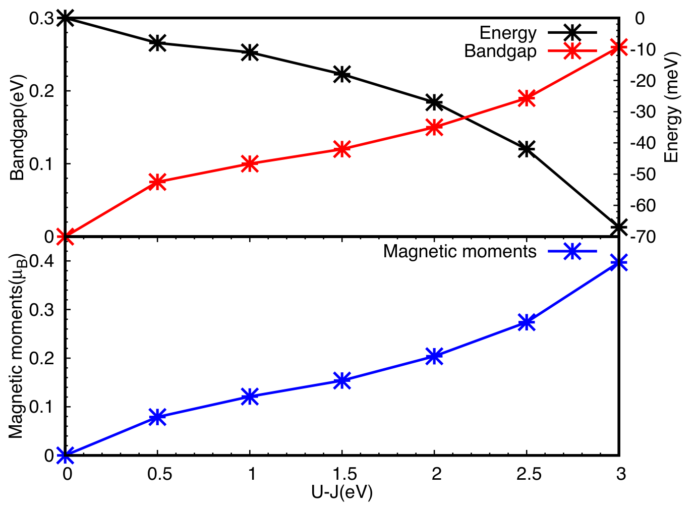

## krishnamurthiSpinChargeDensity2020 — 过渡金属硫族化物边界处的自旋/电荷密度波（The Sign of Three）

## 📄 元数据
Sridevi Krishnamurthi、Geert Brocks，2020，Physical Review B 102, 161106，DOI: 10.1103/PhysRevB.102.161106（arXiv:2005.02519）
## 💡 一句话
通过 DFT+U 计算证明 TMDC 镜像孪晶界（MTB）的金属性源于 D₃ₕ 晶格极化这一 Z₃ 拓扑不变量在边界处的反转，导致边界态 1/3 分数占据，并自发形成无需原子位移的纯电子型三重周期自旋密度波/电荷密度波（SDW/CDW），打开约 0.1 eV 能隙，预言携带 ±1/3 e 分数电荷的孤子激发。

## 🔗 Wiki 双链
  - 概念 [[../concepts/charge-density-wave]]
  - 概念 [[../concepts/density-functional-theory]]
  - 概念 [[../concepts/2D-materials]]
  - 概念 [[../concepts/topological-defects]]
  - 概念 [[../concepts/magnetoelectric-coupling]]
  - 概念 [[../concepts/berry-phase]]
  - 概念 [[../concepts/spin-density-wave|自旋密度波（SDW）]]
  - 概念 [[../concepts/mirror-twin-boundary|镜像孪晶界（MTB）]]
  - 概念 [[../concepts/topological-polarization|拓扑极化]]
  - 概念 [[../concepts/fractional-charge-soliton|分数电荷孤子]]
  - 概念 [[../concepts/peierls-distortion|派尔斯畸变]]
  - 概念 [[../concepts/tomonaga-luttinger-liquid|朝永-拉亭格液体（TLL）]]
  - 概念 [[../concepts/dft-plus-u|DFT+U]]
  - 概念 [[../entities/MoSe2|二硒化钼（MoSe₂）]]
  - 实体 [[../entities/TMDs]]
  - 实体 [[../entities/VASP]]
  - 实体 [[../entities/domain-wall]]
  - 图表 [[../figures/electronic-bands]]
  - 图表 [[../figures/crystal-structures]]
  - 图表 [[../figures/mathematical-models]]
  - 年度 [[../write/2020]]
  - 项目 [[../projects/project-7-cdw-charge-density-wave]]
  - 项目 [[../projects/project-2-mn-multiferroics]]
  - 相关论文 [[../../raw/note/krishnamurthiSpinChargeDensity2020]]

## 📊 关键图表
  -  -> [[../figures/crystal-structures|晶体结构与原子排布]]
  - **图示描述**：三联图。(a) 为 MoSe₂ 单层中 4|4P 型镜像孪晶界（MTB）的俯视图原子结构，蓝/绿/红球分别表示 Mo、Se 及边缘钝化用的 O 原子，红虚线标出 MTB 的镜像对称面，黑色虚线标出沿 MTB 方向的计算周期，箭头标注面内极化 **P** 的方向，在跨过 MTB 时发生 P↔−P 反转。(b) 为沿 MTB 方向（Γ→X）的 DFT 能带色散，纵轴为相对于费米能级的能量（eV），灰色阴影为体相带隙，其中红色能带以 Mo dxz 轨道为主、绿色能带以 Mo dxy/dz² 轨道为主，红色能带穿过 E_F 而绿色能带全空。(c) 为与之对应的投影态密度（PDoS）。
  - **关键特征**：两条隙内能带即拓扑极化反转所产生的一维边界态；红色 dxz 能带恰好 1/3 填充、绿色 dxy/dz² 能带全空，对应由补偿电荷 λ=2e/(3a) 锁定的占据数；PDoS 在 E_F 附近出现尖锐的一维范霍夫奇点，证实这些态严格局域于 MTB 并具有一维属性。
  - **结论/意义**：此图确立"拓扑极化突变 → 1/3 分数填充金属边界态"这一全文论证的物理起点，也是后续讨论电子关联失稳的基础。
  -  -> [[../figures/crystal-structures|晶体结构与原子排布]]
  - **图示描述**：三联图展示引入电子关联前后的能带对比。(a) 将图1(b) 的能带折叠到沿 MTB 方向三倍化（3×）的超胞中，原 1/3 填充的红色 dxz 能带被折成三条子带，最低支填满、上面两支全空；绿色 dxy/dz² 能带折成三支且全部位于 E_F 之上，此时体系仍为金属。(b) 为在 Dudarev DFT+U（U−J=3 eV）下重新自洽优化电子结构后的能带，未做任何原子位移。(c) 为与(b) 对应的态密度。
  - **关键特征**：电子关联在红色 dxz 带内打开约 0.47 eV 的直接带隙；X 点占据的 dxz 态与 Γ 点未占据的 dxy/dz² 态之间形成约 0.26 eV 的整体间接带隙；DoS 在 E_F 处出现清晰能隙，两侧仍由尖锐的一维范霍夫奇点标记；每个 3× 超胞总能量降低约 67 meV（MoS₂ 对应间接带隙 0.10 eV、能损 27 meV/3×胞）。
  - **结论/意义**：这是全文的核心证据——仅靠电子关联即可使 1/3 填充的金属 MTB 发生金属-绝缘体转变，形成 SDW/CDW，而无需 Peierls 型原子畸变。
  -  -> [[../figures/electronic-bands|电子能带与电子态]]
  - **图示描述**：四联图给出 SDW/CDW 基态的实空间图像。(a) 为 MTB 附近的自旋密度等值面，红色表示自旋向上、绿色表示自旋向下；(b) 为相对于理想 1× 金属结构的电荷密度差，棕色表示电荷积累、绿色表示电荷耗尽；(c)、(d) 分别为 SDW/CDW 态和理想 1× 态的模拟 STM 图像，均由 −0.5 eV 至费米能级的局域态密度（LDoS）积分得到。
  - **关键特征**：沿 MTB 一侧三个 Mo 原子的磁矩依次为 0.40、−0.20、−0.21 μB，呈"大-小-小"排布，构成周期三倍的 SDW；电荷密度差显示幅度较微妙但同样三倍周期的 CDW；图(c) STM 模拟沿 MTB 出现亮-暗-暗的 3× 条纹，完美复现 Barja et al. (Nat. Phys. 2016) 的实验图案，而图(d) 中 1× 结构亮度均匀无调制；自由弛豫后所有键长、键角均未变化。
  - **结论/意义**：从自旋、电荷、STM 三个层面同时证实 SDW/CDW 为纯电子效应，并直接与实验 3× CDW 观测对应；作者据此预言 SDW 可由自旋极化 STM 直接观测。
  -  -> [[../figures/electronic-bands|电子能带与电子态]]
  - **图示描述**：以 Hubbard U−J（横轴，0–3 eV）为自变量的参数扫描结果，分为上下两个子图。上图红色曲线对应左轴带隙（eV），黑色曲线对应右轴每个 3× 超胞的总能量（meV/3× cell）；下图蓝色曲线为 MTB 上 Mo 原子的最大磁矩（μB）。
  - **关键特征**：带隙与最大磁矩均随 U−J 单调增加，在 U−J=3 eV 时分别约为 0.26–0.27 eV 和 0.4 μB；每 3× 胞总能量随 U−J 单调下降，在 U−J=3 eV 时得益约 67–70 meV；只有当 U−J≲0.5 eV 时 SDW/CDW 才不能形成；以实验观测的 ~0.1 eV 能隙反推，有效 U−J 落在约 1–1.5 eV 区间，对 Mo 4d 电子属合理值。
  - **结论/意义**：证明 SDW/CDW 是电子关联驱动的鲁棒基态而非特定 U 值下的巧合，为理论结果与实验能隙的定量对应以及 MoS₂/MoSe₂ 中的普适性提供了参数依据。

## 🔬 项目连接
  - **project-7（CDW）——核心参考价值**：本文直接研究 TMDC 晶界上的 CDW，但提出了一个区别于经典 Peierls 机制的新范式：(1) CDW 的周期由拓扑极化决定的 1/3 分数填充锁定为三倍，而非费米面嵌套的偶然结果；(2) CDW 由电子关联（Hubbard U）驱动，是纯电子效应，不伴随原子位移，颠覆了"CDW 必有结构畸变"的传统认知；(3) SDW 与 CDW 共存，SDW 主导、CDW 微弱，磁矩呈"大-小-小"排列；(4) 提供了 DFT+U 研究低维关联电子态的完整计算流程（VASP + PAW + Dudarev U−J + 三倍超胞 + 几何自由弛豫检验）；(5) 给出了具体数值（MoSe₂ 间接带隙 0.26 eV、能损 67 meV/3×胞；MoS₂ 带隙 0.10 eV、能损 27 meV/3×胞；U−J 阈值 0.5 eV）；(6) 引入分数电荷孤子这一 CDW 拓扑激发视角。对 project-7 理解 CDW 的多样性（电子型 vs 声子型）、拓扑起源、以及维度效应有直接参考意义。
  - **project-2（Mn多铁）——磁序物理图像参考**：本文虽不研究 Mn 材料，但其 SDW 物理对 project-2 有两点参考：(1) 展示了过渡金属 d 轨道上自旋有序与电荷调制的耦合（即磁电耦合的微观雏形）——自旋密度波的形成同时诱导微弱电荷密度波，这一"自旋序驱动电荷重排"的机制可为 Mn 基多铁中磁序与铁电/电荷有序耦合提供类比图像；(2) DFT+U 处理部分填充 d 轨道磁有序的方法学（U−J 参数选取、磁矩收敛、不同 U 值下能隙-磁矩-能量的单调关系检验）可直接迁移到 Mn 氧化物体系的计算。但需注意本文是 4d Mo 体系（U≈3 eV 较温和），Mn 3d 关联更强。
  - **project-5（SnTe铁电模拟）——极化理论方法学间接参考**：本文运用现代极化理论（King-Smith & Vanderbilt）将面内极化作为拓扑不变量处理，并讨论了极化反转（P↔−P）在边界/畴壁处产生的极化电荷与补偿机制（极化灾难、LaAlO₃/SrTiO₃ 类比）。这一"极化跃变→界面电荷→边界态"的分析框架，对 SnTe 铁电体中畴壁、表面、界面的极化计算与物理理解有方法学借鉴价值；但 SnTe 是岩盐结构铁电体，与 D₃ₕ/Z₃ 拓扑分类无直接对应，连接较弱。
  - **project-1（双光子）**：无直接项目连接。
  - **project-3（机械发光NN）**：无直接项目连接。
  - **project-4（TTF分子计算）**：无直接项目连接。DFT+U 虽为通用关联方法，但 TTF 分子晶体的计算通常不涉及在位 Hubbard U，本文方法学参考价值有限。
  - **project-6（湿度传感器）**：无直接项目连接。

## 🔗 项目双链
- 项目 [[../projects/project-1-two-photon|项目一：双光固化和双光发光]]
- 项目 [[../projects/project-2-mn-multiferroics|项目二：Mn极化结构铁电材料]]
- 项目 [[../projects/project-3-mechanoluminescence-nn|项目三：应力发光神经网络]]
- 项目 [[../projects/project-4-ttf-molecular-calc|项目四：lsl老师的ttf分子计算]]
- 项目 [[../projects/project-5-snte-ferroelectric-sim|项目五：lammps势函数SnTe铁电模拟]]
- 项目 [[../projects/project-6-humidity-sensor|项目六：小花闻的电压湿度传感器]]
- 项目 [[../projects/project-7-cdw-charge-density-wave|项目七：CDW电荷密度波]]

## 📝 组织与用词
  - 论证结构遵循"实验矛盾（TLL vs CDW）→ 拓扑根源（Z₃ 极化反转）→ 电子数锁定（1/3 填充）→ 关联失稳（DFT+U 纯电子 SDW/CDW）→ 实验验证（STM 模拟）→ 拓扑激发预言（分数电荷孤子）"的递进链条，标题"The Sign of Three"以 Z₃ 不变量、1/3 填充、三倍周期、±1/3 e 电荷四个"三"贯穿全文。
  - 关键词：
    - 自旋密度波 [[../concepts/spin-density-wave|自旋密度波]] / spin density wave (SDW)
    - 电荷密度波 [[../concepts/charge-density-wave|电荷密度波]] / charge density wave (CDW)
    - 镜像孪晶界 / mirror twin boundary (MTB)
    - 拓扑极化 [[../concepts/topological-polarization|拓扑极化]] / topological polarization（Z₃ 不变量）
    - 分数填充 / fractional filling（1/3 occupancy）
    - 派尔斯畸变 [[../concepts/peierls-distortion|派尔斯畸变]] / Peierls distortion
    - 朝永-拉亭格液体 / Tomonaga-Luttinger liquid (TLL)
    - 分数电荷孤子 [[../concepts/fractional-charge-soliton|分数电荷孤子]] / fractional-charge soliton

## ✏️ 可写入 Wiki 的要点
  1. TMDC 单层因缺乏[[../concepts/inversion-symmetry|反演对称性]]而具有面内电极化；D₃ₕ 对称下极化 P 是 Z₃ 拓扑不变量，只取 (2/3,1/3)、(1/3,2/3)、(0,0) 三类，所有 MX₂（M=Mo,W; X=S,Se）DFT 计算均属 (2/3,1/3) 类。
  2. 在 4|4P 型 MTB 处极化反转 P↔−P，产生极化线电荷 λ=2P·n̂=2e/(3a)（a 为沿 MTB 的晶格常数）；为避免极化灾难，隙内一维边界态必须携带[[../concepts/compensation-charge|补偿电荷]] −λ，使下能带（主要为 Mo dxz 轨道）恰好 1/3 填充，上能带（Mo dxy/dz²）全空。
  3. 标准 DFT（U−J=0）预测 MTB 为金属态但找不到自发 Peierls 结构畸变，这是先前理论与低温 STM 实验（3× 周期、~0.1 eV 能隙）矛盾的根源。
  4. 引入 DFT+U（Dudarev 泛函，U−J=3 eV）后，体系在**无任何原子位移**的条件下自发形成三重周期 SDW/CDW：MoSe₂ 中 MTB 一侧三个 Mo 原子磁矩为 0.40、−0.20、−0.21 μB，键长键角不变；这证明该转变是纯[[../concepts/electron-correlation|电子关联]]效应而非 [[../concepts/peierls-distortion|Peierls 畸变]]。
  5. MoSe₂ 的 SDW/CDW 打开约 0.47 eV 的 dxz 带内直接带隙，整体间接带隙约 0.26 eV（X 点占据 dxz 至 Γ 点空 dxy/dz²），每 3× 超胞能量降低 67 meV；MoS₂ 类似，磁矩 0.25、−0.21、−0.05 μB，间接带隙 0.10 eV，能损 27 meV/3×胞。
  6. 参数鲁棒性：带隙、磁矩随 U−J 单调增加，总能量单调降低；只要 U−J ≳ 0.5 eV 即可形成 SDW/CDW。实验观测到的 ~0.1 eV 能隙反推有效 U−J 约 1–1.5 eV，对 Mo 4d 电子是合理值。
  7. 模拟 STM 图像（LDoS 从 −0.5 eV 积分至费米能级）完美复现 Barja et al. (Nat. Phys. 2016) 观测到的 3× 周期条纹；作者预言 SDW 可由自旋极化 STM 直接观测。
  8. 三重周期基态允许拓扑孤子激发，携带分数电荷 ±1/3 e 或 ±2/3 e，自旋可为 1/2、0 甚至无理数（Su-Schrieffer、Horovitz 理论）；长度非 3a 整数倍的 MTB 因两端边界条件阻挫而自然存在孤子，可在弱耦合衬底上用 STM 库仑阻塞实验探测。
  9. 本文调和了 TLL 与 CDW 的实验争议：SDW/CDW 是低温基态，而 TLL 可能对应高温相 or 不同 MTB 结构；温度驱动的相变尚待研究。
  10. 方法论要点：用有限宽度纳米带超胞（12 个 MX₂ 单元宽 + 真空层 + O 钝化边缘）模拟孤立 MTB；为抑制带边缘与 MTB 间人为[[../concepts/charge-transfer|电荷转移]]，在三倍超胞中强制边缘绝缘；计算使用 VASP、PAW 赝势、Dudarev DFT+U，并参考文献 [14–20] 的交换关联设置。
