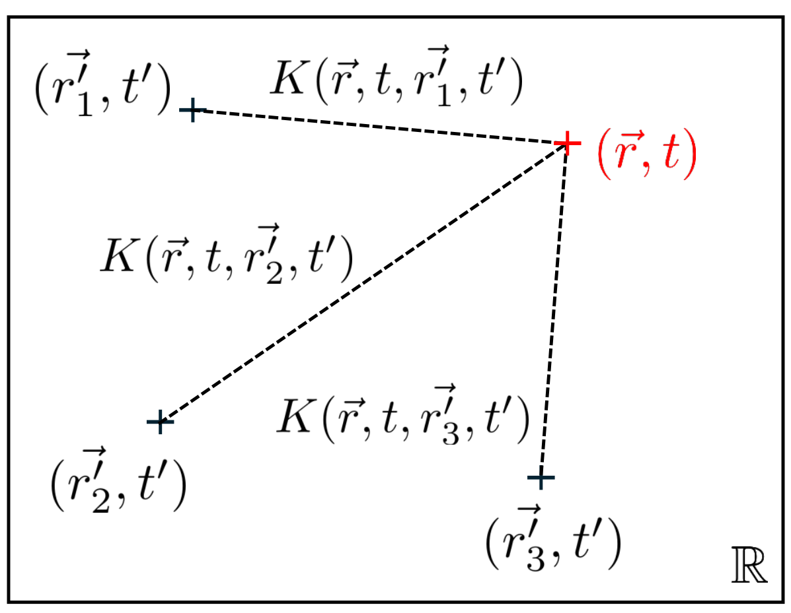
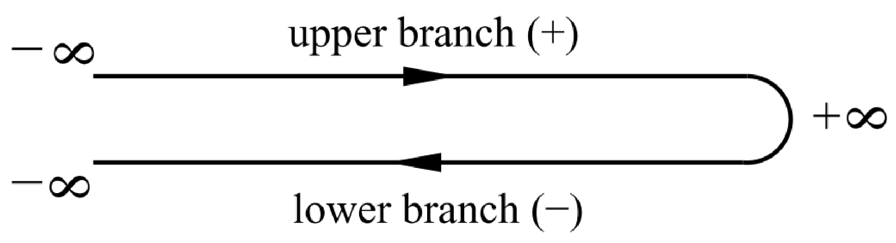
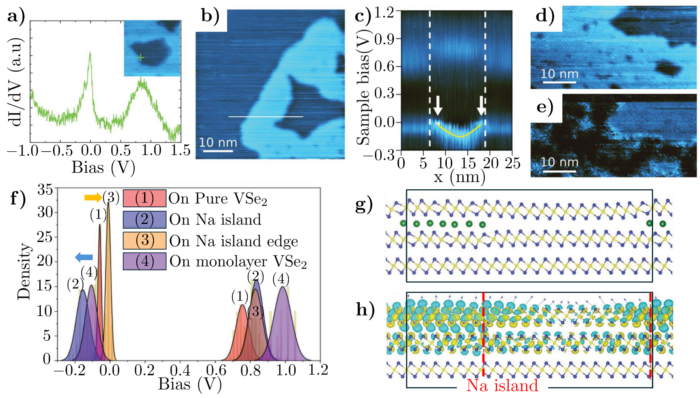
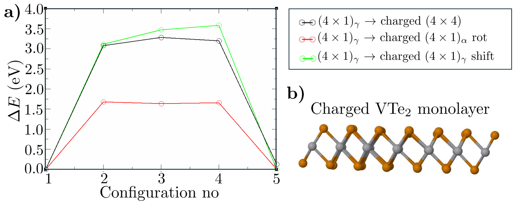
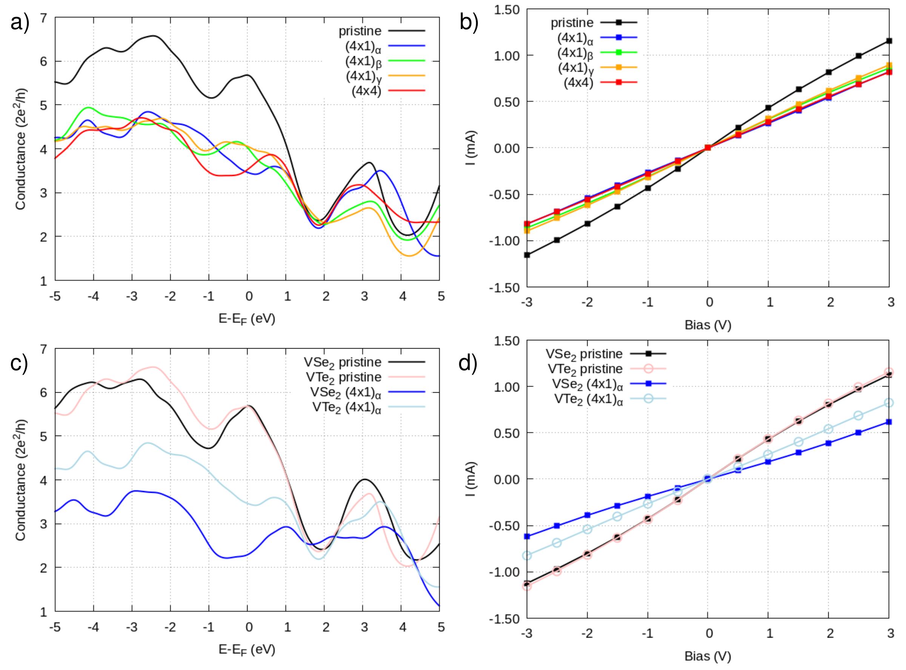

## lezoualchStudyChargeDensity — 过渡金属二硫族化物中电荷密度波的研究

## 📄 元数据
Mahé Lezoualc'H，2025，Université Paris-Saclay 博士论文（NNT 2025UPASP016，导师 Yannick Dappe、Alexander Smogunov，2025-03-14 答辩），无 DOI
## 💡 一句话
建立了一套基于 DFPT 声子软模的系统 CDW 建模流程，并以第一性原理计算揭示了 1T-VSe₂/1T-VTe₂ 中化学掺杂（N、Na）、STM 针尖物理操控及相变对 CDW 相稳定性、取向和电子输运的调控规律，提出"CDW-tronics"概念。
## 🔗 Wiki 双链
  - 概念 [[../concepts/charge-density-wave]]
  - 概念 [[../concepts/2d-materials]]
  - 概念 [[../concepts/density-functional-theory]]
  - 概念 [[../concepts/strain-engineering]]
  - 概念 [[../concepts/electron-phonon-coupling|电子-声子耦合]]
  - 概念 [[../concepts/fermi-surface-nesting|费米面嵌套]]
  - 概念 [[../concepts/intercalation|插层]]
  - 概念 [[../concepts/peierls-instability]]
  - 概念 [[../concepts/soft-mode|声子软模]]
  - 实体 [[../entities/TMDs]]
  - 实体 [[../entities/VSe2|二硒化钒 VSe₂]]
  - 实体 [[../entities/VTe2|二碲化钒 VTe₂]]
  - 图表 [[../figures/crystal-structures]]
  - 图表 [[../figures/electronic-bands]]
  - 图表 [[../figures/vibrational-spectra]]
  - 图表 [[../figures/electronic-devices]]
  - 图表 [[../figures/heterostructures-stacking|自旋电子学与应变工程]]
  - 年度 [[../write/2025-2029|2025]]
  - 项目 [[../projects/project-7-cdw-charge-density-wave]]
  - 概念 [[../concepts/phonon-soft-mode]]、[[../concepts/cew-tronics]]
  - 实体 [[../entities/Fireball]]、[[../entities/Quantum-ESPRESSO]]、[[../entities/STM]]
  - 相关论文 [[../../raw/note/lezoualchStudyChargeDensity]]
## 🆕 新概念/实体建议
  - [[../concepts/cdw-tronics|cdw-tronics]]（CDW 电子学）：仿照 spintronics/valleytronics，以 CDW 相/取向为信息载体
  - [[../concepts/dfpt|dfpt]]（密度泛函微扰理论）：可建为方法实体或概念条目
  - [[../concepts/negf-transport|negf-transport]]（非平衡格林函数输运）：Fireball 中 STM/I-V 模拟方法
  - [[../concepts/nudged-elastic-band|nudged-elastic-band]]（NEB 微动弹性带）：相变能垒计算方法
  - [[../entities/Quantum-Espresso|Quantum-Espresso]] / [[../entities/Fireball|Fireball]]：两套 DFT 代码，可建软件实体（QE 在 wiki 中尚无）
  - [[../concepts/sscha|sscha]]（随机自洽简谐近似）：论文展望中提到的超越简谐近似方法
## 📊 关键图表
  - 
    - **图示描述**：论文引言/理论部分的概览示意图，展示电荷密度波（CDW）的基本图像——电子密度在晶格中的周期性调制以及与之伴随的原子位置周期性畸变。
    - **关键特征**：用于说明 Peierls 失稳、电子-声子耦合如何把均匀金属态驱入具有新周期超结构的 CDW 态；为后续 1T-VSe₂/1T-VTe₂ 的具体计算提供概念框架。
    - **结论/意义**：建立全文讨论的物理图像，即 CDW 是电子与晶格协同的集体有序态，而非单纯的费米面嵌套效应。
  - 
    - **图示描述**：方法学章节的流程示意图，串联 DFT 基态计算、DFPT 声子谱/电声耦合、NEGF 电子输运以及 NEB 相变能垒等本论文使用的多尺度第一性原理计算框架。
    - **关键特征**：展示从 1×1 单胞的电子结构与声子谱出发，提取虚频软模的波矢 q 与本征矢，在超胞中按 Δu = Σ Re[U·exp(iq·R)] 叠加原子位移并弛豫得到 CDW 相，再用于 STM 模拟与输运计算的完整链条。
    - **结论/意义**：体现论文的方法论贡献——以 DFPT 软模为入口系统构建 CDW 原子构型，可推广至其他 TMD 及类似晶格失稳体系。
  -  → [[../figures/crystal-structures-bulk|体相晶体结构]]
    - **图示描述**：1T-VSe₂/1T-VTe₂ 单层的晶体结构、布里渊区高对称路径以及相关 CDW 超结构（如 4×4、√7×√3、4×1 等）的几何关系示意。
    - **关键特征**：标示出 1T 相八面体配位、V 原子 dz² 轨道主导的费米面以及不同软模波矢（1/2 Γ-M、3/5 Γ-K、1/2 Γ-K、1/3 Γ-K）在布里渊区中的位置，把 CDW 周期与动量空间失稳点一一对应。
    - **结论/意义**：为理解后续声子谱、NEB 与输运计算中的几何与方向约定提供参考底图。
  -  -> [[../figures/vibrational-spectra|振动光谱]]
    - **图示描述**：用 DFPT 在 1×1 单胞中计算的 1T-VSe₂ 与 1T-VTe₂ 单层沿 Γ-M-K-Γ 高对称路径的声子色散曲线；虚频（不稳定声子模式）以负值绘制。
    - **关键特征**：1T-VSe₂ 在 1/2 Γ-M（对应 4×1 畸变）和 3/5 Γ-K（对应 √7×√3 畸变）出现两个虚频软模；1T-VTe₂ 则在 1/2 Γ-M、1/2 Γ-K、1/3 Γ-K 处出现三个虚频，分别对应 4×1、3×√3、√21×√3 畸变，解释 VTe₂ 比 VSe₂ 更丰富的 CDW 多形态性。
    - **结论/意义**：从第一性原理证明 CDW 主要由电子-声子耦合驱动的晶格动力学失稳所致，多个共存软模直接对应实验上相互竞争的多种 CDW 相，是全文 CDW 建模流程的起点。
  - 
    - **图示描述**：1T-VSe₂ 在氮吸附/钠插层等外部化学调控下的原子结构与 STM 图像对比，展示缺陷类型识别以及 Na 插层诱导的 CDW 相变。
    - **关键特征**：N 等离子体处理引入 I 型（N 桥位吸附）、III 型（N 替代底层 Se）等缺陷，但 (4×4) CDW 整体保持稳健；Na 插入层间后顶层 VSe₂ 由体相 (4×4) 转变为单层本征的 (√7×√3) CDW，同时在 Na 岛边缘出现反常"p 型掺杂"特征。
    - **结论/意义**：揭示 Na 插层通过电子掺杂（V dz² 轨道下移）与层间解耦协同把"体相 CDW"切换为"单层 CDW"，确立化学手段对 CDW 相的可调控性。
  -  → [[../figures/crystal-structures-xrd-phases|XRD与相变]]
    - **图示描述**：(a–d) 为 1T-VTe₂ 单层中 (4×1)γ、(4×1)α、(4×4) 以及 π/2 相移后的 (4×1)γ 滑移等不同 CDW 相的 DFT 模拟 STM 图像；(e) 为用 NEB 计算的从 (4×1)γ 出发转向其余各相的最小能量路径。
    - **关键特征**：模拟 STM 衬度与实验高度吻合，验证了所建原子模型；(4×1)γ → (4×1)α 旋转能垒最低，约 1.7 eV/(4×4) 单胞；(4×1)γ → (4×4) 相变及 → (4×1)γ 滑移相的能垒较高，约 3.0–3.3 eV/(4×4) 单胞；旋转只需改变单轴畸变方向而相变需引入多方向原子协同位移，故能垒差异显著。
    - **结论/意义**：首次定量给出 1T-VTe₂ 中 CDW 旋转、相变与相位滑移的动力学难度，解释实验上 STM 脉冲触发旋转比相变更容易，并为"单电子触发约 50 个单胞纳米畴集体切换"的多米诺/相干声子模型提供能垒基准。
  -  → [[../figures/electronic-devices-memory-transistors|存储器与晶体管]]
    - **图示描述**：(a、c) 为单相（4×4、4×1α 等）和异相界面（如 4×4/4×1α）纳米带在零偏压下的电子透射谱/电导；(b、d) 为对应的 NEGF 计算电流-电压（I-V）曲线，并与未畸变原始相做对比。
    - **关键特征**：所有 CDW 相的电导均显著低于原始金属相，因为晶格畸变改变原子间距、降低电子跃迁概率并增加界面散射；但不同 CDW 相之间以及不同取向之间的电导/I-V 差异很小，异相界面对输运的额外调制也有限。
    - **结论/意义**：表明 CDW 可作为电导"开/关"开关，但靠取向切换实现多值存储在弹道输运下并不现实，为"CDW-tronics"指明应转向畴壁散射、CDW 集体滑动的非线性输运及界面重构等方向。

## 🔬 项目连接
  - **project-7 CDW — core**：本论文即 CDW 主题，系统研究 1T-VSe₂/1T-VTe₂ 中 CDW 的 DFPT 建模、掺杂/插层/STM 调控、相变能垒与输运，是 project-7 的核心机理与方法文献。其"DFPT 声子软模 → 提取 q 与本征矢 → 超胞位移叠加 Δu=Σ Re[U·exp(iq·R)] → 弛豫"流程可直接复用于其他 CDW 材料。
  - **project-5 SnTe 铁电模拟 — strong**：方法学高度可迁移。SnTe 铁电失稳同样由声子软模（横光学模）驱动，论文的 DFPT 软模识别、超胞畸变构建、NEB 相变能垒计算流程可直接用于 SnTe 铁电相变路径与势垒研究；层间耦合/掺杂对结构相的调控思路也可类比于 SnTe 中应变/掺杂对铁电相的调控。
  - **project-4 TTF 分子计算 — medium**：NEGF+DFT 电子输运计算框架（Fireball）及电子-声子耦合导致输运降低的物理图像，对 TTF 分子晶体电荷输运模拟有方法参考价值；CDW 中晶格畸变降低电子跃迁概率与 TTF 中电子-晶格耦合输运问题可类比。
  - **project-2 Mn 多铁 — weak**：论文讨论了 DFT 预测磁性基态而实验未见磁序、CDW 与磁性相互竞争的问题，并在批判性分析中建议用 DFT+U/DMFT 处理 V 3d 关联效应；这与 Mn 多铁中磁序/铁电序竞争及 DFT+U 方法学主题有边缘关联，但材料体系不同。
  - project-1 双光子、project-3 机械发光 NN、project-6 湿度传感器：无内容参考价值，不列入。
## 🔗 项目双链
- 项目 [[../projects/project-7-cdw-charge-density-wave|项目七：CDW电荷密度波]]
- 项目 [[../projects/project-5-snte-ferroelectric-sim|项目五：lammps势函数SnTe铁电模拟]]
- 项目 [[../projects/project-4-ttf-molecular-calc|项目四：lsl老师的ttf分子计算]]
- 项目 [[../projects/project-2-mn-multiferroics|项目二：Mn极化结构铁电材料]]

## 📝 组织与用词
论文按"理论方法（DFT/DFPT/NEGF）→ CDW 经典与现代理论 → DFPT 软模构建 CDW 基态模型 → 化学调控（N 吸附、Na 插层）→ 物理操控（STM 脉冲 + NEB 能垒）→ 电子输运评估 CDW-tronics → 结论"的递进逻辑组织，理论计算与 MPQ/台湾大学实验组紧密对照。值得复用的术语：电荷密度波 (charge density wave, CDW)；软模/虚频 (soft mode / imaginary frequency)；电子-声子耦合 (electron-phonon coupling)；费米面嵌套 (Fermi surface nesting)；插层 (intercalation)；CDW 电子学 (CDW-tronics)；微动弹性带 (nudged elastic band, NEB)；非平衡格林函数 (NEGF)；层间解耦 (interlayer decoupling)；多米诺/相干声子切换 (domino / coherent phonon switching)。
## ✏️ 可写入 Wiki 的要点
  1. **CDW 建模方法论**：在原始 1×1 单胞中用 DFPT 算声子谱，虚频软模给出失稳波矢 q 与本征矢；在超胞中按 Δu = Σ Re[U_{ν,q}·exp(iq·R)] 叠加原子位移，再弛豫得到 CDW 相。该流程成功复现 1T-VSe₂ 的 (4×4)、(√7×√3) 及 1T-VTe₂ 的 (4×1)、(3×√3)、(√21×√3) 等多相。
  2. **1T-VSe₂ 软模**：声子谱在 1/2 Γ-M（对应 4×1 畸变）和 3/5 Γ-K（对应 √7×√3 畸变）处有两个虚频；多软模共存解释实验中多 CDW 相竞争。
  3. **1T-VTe₂ 软模**：在 1/2 Γ-M、1/2 Γ-K、1/3 Γ-K 处有三个虚频，分别对应 4×1、3×√3、√21×√3，故 VTe₂ 比 VSe₂ CDW 多形态性更丰富。
  4. **驱动力认识**：CDW 主要由[[../concepts/electron-phonon-coupling|电子-声子耦合]]导致的晶格动力学失稳驱动，而非单纯[[../concepts/fermi-surface-nesting|费米面嵌套]]；费米面附近 V dz² 轨道尖峰提供电子不稳定性。
  5. **N 掺杂**：氮等离子体处理在 1T-VSe₂ 表面引入三类缺陷（I 型 N 桥位吸附、III 型 N 替代底层 Se、II 型未完全确认），但 (4×4) CDW 整体稳健不被破坏。
  6. **Na 插层双重机制**：Na 向顶层 VSe₂ 转移电子（n 型掺杂）使 V dz² 轨道下移，同时作为"楔子"减弱层间范德华耦合，使顶层表现如孤立单层，从而把体相 (4×4) CDW 转变为单层本征的 (√7×√3) CDW；Na 岛边缘观测到反常"p 型掺杂"，归因于局域静电场斯塔克栅极效应。
  7. **STM 针尖可逆切换**：1T-VTe₂ 单层中 STM 脉冲可在 (4×4) 与 (4×1) 相间及 (4×1) 不同取向（α/β/γ）间可逆切换；电报噪声分析显示切换产额在 ±1 V 附近有阈值且与电流大小无关，表明是单电子非弹性隧穿过程而非电场效应。
  8. **NEB 相变能垒**：(4×1)γ → (4×1)α 旋转能垒最低，约 1.7 eV/(4×4) 单胞；(4×1)γ → (4×4) 相变及 (4×1)γ → 滑移相能垒约 3.0–3.3 eV/(4×4) 单胞；旋转只需改单轴畸变方向故更易，与实验定性一致。单电子（~1 eV）触发约 50 个单胞纳米畴集体切换的能量鸿沟由"多米诺骨牌"/相干声子级联模型解释。
  9. **输运与 CDW-tronics 局限**：NEGF 弹道输运计算显示所有 CDW 相电导均显著低于未畸变原始相（原子位移降低电子跃迁概率），但不同 CDW 相（4×1α vs 4×4）及异相界面（4×4/4×1α）之间电导/I-V 差异很小；说明 CDW 可作开/关开关，但靠取向切换实现多值存储困难，未来应关注畴壁散射、CDW 滑动非线性输运及界面重构。
  10. **方法局限与展望**：[[../concepts/PBE-functional]]对范德华力和 V 3d 强关联处理不足，建议引入 vdW-DF、DFT+U、SSCHA（[[../concepts/anharmonic-effects|非谐效应]]可改变 CDW 转变温度）、DMFT、TDDFT/[[../concepts/molecular-dynamics|分子动力学]]模拟能量耗散；磁性与 CDW 竞争（DFT 预铁磁序但实验未见）是开放问题。
