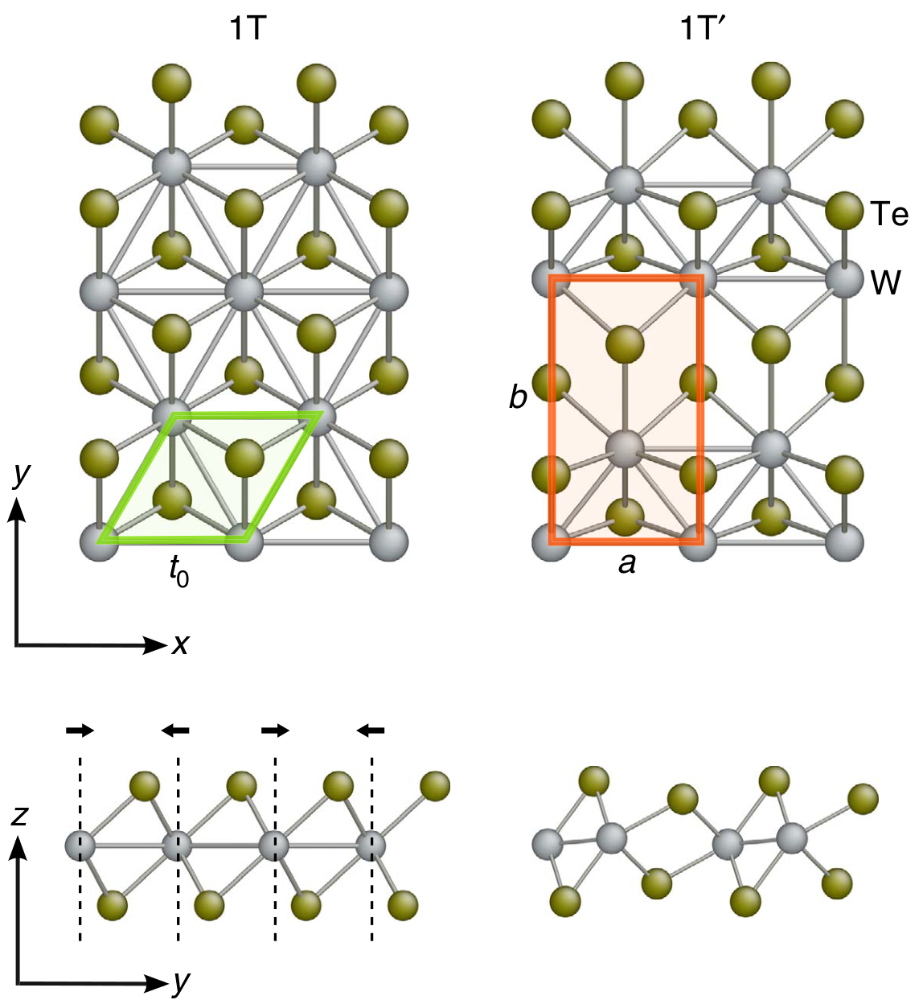
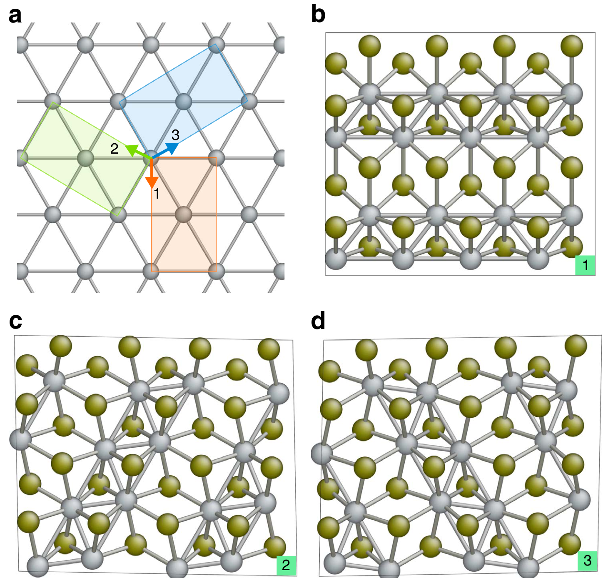
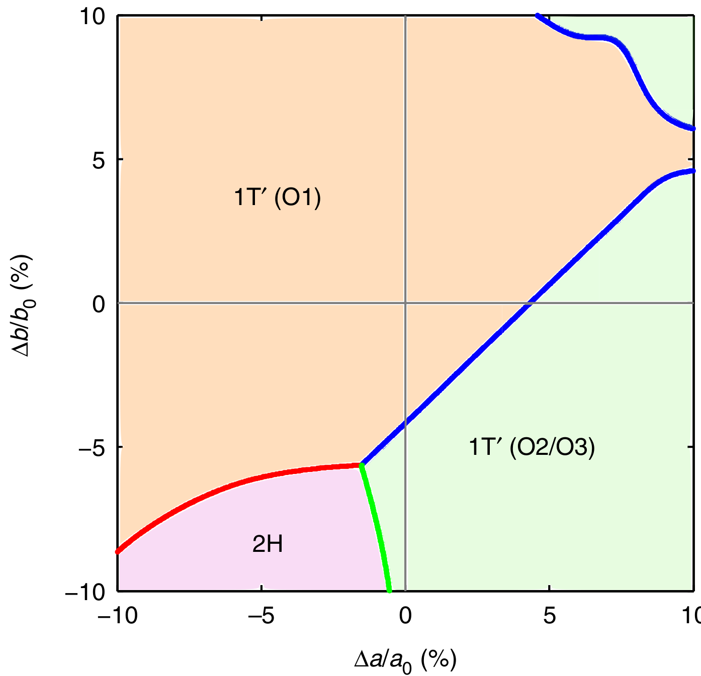
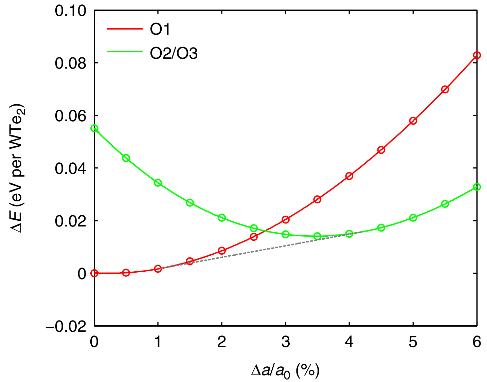
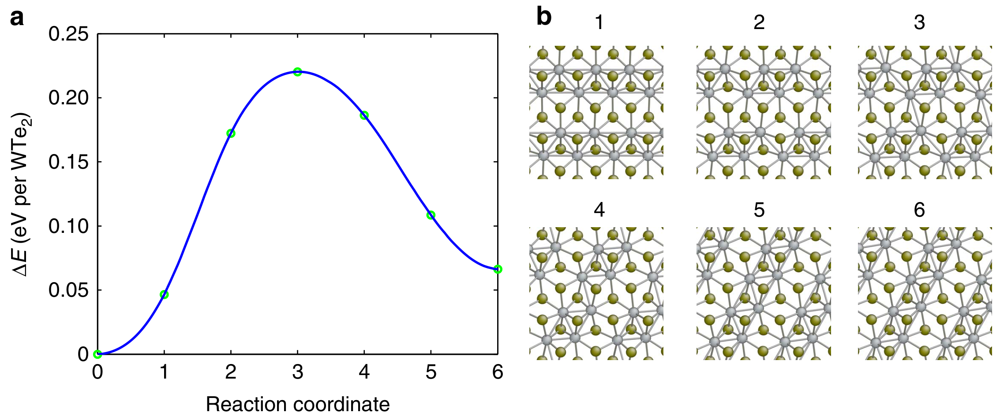
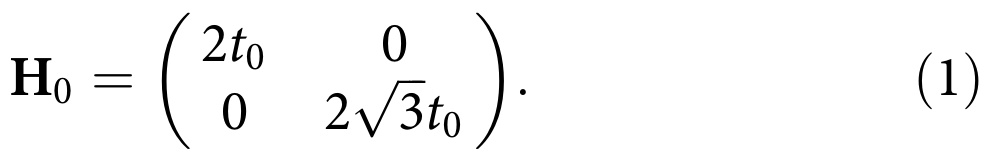
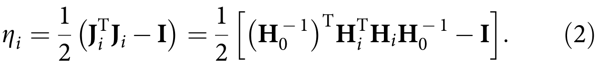
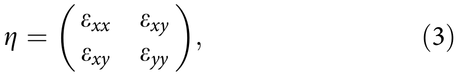
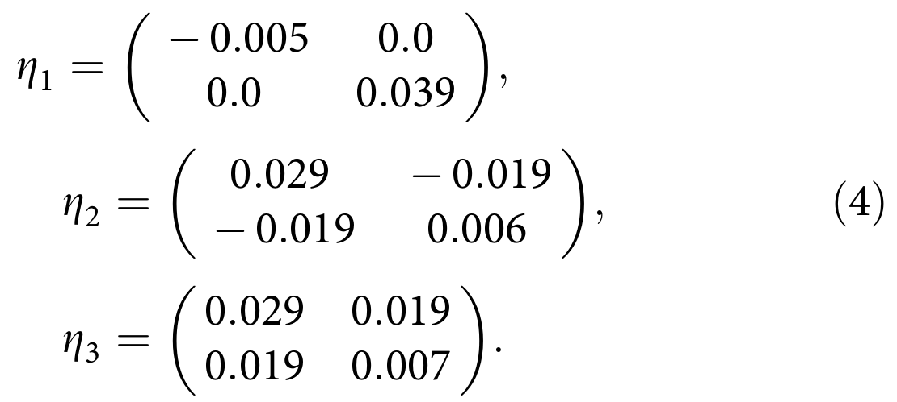
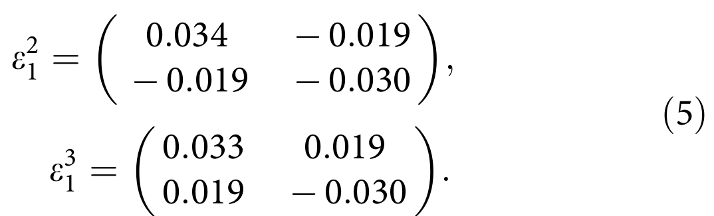

## liFerroelasticityDomainPhysics2016 — 二维过渡金属二硫族化合物单层中的铁弹性与畴物理

- **元数据**：Wenbin Li & Ju Li，2016，Nature Communications 7:10843，DOI [10.1038/ncomms10843](https://doi.org/10.1038/ncomms10843)
- **一句话**：通过第一性原理计算首次预测 1T′ 相 TMD 单层具有三个由 Peierls 畸变产生的取向变体（O1/O2/O3），仅需百分之几弹性应变即可在变体间实现铁弹性切换，切换势垒 <0.2 eV/f.u.，并形成低能准一维铁弹畴壁，从而提出"二维铁弹性/二维形状记忆材料"概念。

- **现有wiki双链**：
  - 概念 [[../concepts/ferroelasticity]]
  - 概念 [[../concepts/strain-engineering]]
  - 概念 [[../concepts/2D-materials]]
  - 概念 [[../concepts/topological-defects]]
  - 概念 [[../concepts/density-functional-theory]]
  - 概念 [[../concepts/multiferroicity]]
  - 实体 [[../entities/TMDs]]
  - 实体 [[../entities/WTe2]]
  - 实体 [[../entities/domain-wall]]
  - 实体 [[../entities/VASP]]
  - 图表 [[../figures/domain-walls]]
  - 图表 [[../figures/crystal-structures]]
  - 图表 [[../figures/mathematical-models]]
  - 年度 [[../write/2016]]
  - 项目 [[../projects/project-2-mn-multiferroics]]
  - 项目 [[../projects/project-5-snte-ferroelectric-sim]]
  - 项目 [[../projects/project-7-cdw-charge-density-wave]]
  - 相关论文 [[../../raw/note/liFerroelasticityDomainPhysics2016]]

- **新概念/实体建议**：
  - `peierls-distortion.md` — Peierls 畸变：1T 金属相中费米面嵌套导致金属原子沿高对称方向二聚化成链、对称性降低为 1T′ 的结构失稳机制；是本文取向变体的物理起源，也与 CDW 密切相关。
  - `orientation-variants.md` — 取向变体（O1/O2/O3）：同一低对称相对称性破缺后产生的能量简并、晶格取向不同的畴态，是铁弹性的序参量载体；可与铁电畴、磁畴并列。
  - `shape-memory-effect.md` — 形状记忆效应：铁弹材料通过马氏体式无扩散相变及变体切换实现大变形、在外场刺激下恢复原形的效应；本文将其类比推广到二维。
  - `spontaneous-strain.md` — 自发应变：铁弹相单胞相对原型相的畸变张量，是铁弹性的序参量（对应铁电的自发极化）；本文用 Green-Lagrange 应变张量定量描述。
  - `nudged-elastic-band.md` — NEB 微动弹性带方法：计算固-固相变/变体切换最小能量路径与势垒的标准方法（本文得到 0.19–0.22 eV/f.u.）；可作为方法学概念复用。

- **关键图表**：
  - 
  - 
  - 
  - 
  - 
  - 
  - 
  - 
  - 
  - 
  - 
  - 

- **项目连接**：
  - **project-1 双光子**：无直接项目连接。
  - **project-2 Mn多铁**：有参考价值。(1) 项目含"二硫化钼应变能带"子课题，本文系统给出了 1T′-MX₂（MoS₂、MoSe₂、MoTe₂、WS₂、WSe₂、WTe₂）在 (a,b) 双轴应变空间中的能量-相图方法（11×11 网格 + 二维样条插值），可直接借鉴用于应变下 TMD 能带/相稳定性计算；(2) 本文将铁弹性作为与铁电性、铁磁性平行的"铁性序"讨论，并在结尾明确展望铁弹-铁电-铁磁多铁耦合，为 Mn 基多铁材料中铁弹畴与极化/磁序耦合提供物理图像参照；(3) 所用 VASP+PAW-PBE+NEB 计算流程（截断 350 eV、k 点间距 <0.1 Å⁻¹、力收敛 <5 meV/Å）可作为同类 DFT 工作的参数基准。
  - **project-3 机械发光NN**：无直接项目连接。
  - **project-4 TTF分子计算**：无直接项目连接（同为 DFT 但体系与机制差异大）。
  - **project-5 SnTe铁电模拟**：有重要物理图像与方法参考价值。(1) SnTe 作为铁电材料同时具有铁弹畸变（立方→菱方相变伴生自发应变），其铁电-铁弹耦合畴壁与本文 1T′-TMD 的 O1/O2/O3 变体及三种共格孪晶界在对称性破缺、畴壁拓扑上可类比；(2) 本文"势能面扫描→公切线确定两相共存区→NEB 势垒→畴壁形成能"的完整计算流程，可直接迁移到 SnTe 极化翻转/相变动力学的 LAMMPS/DeepMD 研究中作为验证与对标；(3) 给出了具体的畴壁能量量级（22–52 meV/Å）和变体切换势垒（0.19–0.22 eV/f.u.，对应 ~0.2 ns 时间尺度），可作为 SnTe 模拟结果合理性的参照系；(4) Green-Lagrange 应变张量与变换矩阵 Jᵢ 的公式化处理，为描述 SnTe 铁电相变中的晶格畸变提供了现成数学框架。
  - **project-6 湿度传感器**：无直接项目连接。
  - **project-7 CDW**：有物理机制参考价值。本文 1T→1T′ 转变明确归因于"费米面嵌套诱导的 Peierls 畸变"（Fermi surface nesting induced Peierls distortion），金属原子二聚化成链正是 CDW 有序化的经典实空间图像；文中引用的 Peierls 畸变与二聚化机制可为 CDW 项目中电荷密度波-晶格耦合的物理描述提供原型案例。

- **组织与用词**：文章采用"对称性分析揭示变体 → 应变张量定量转换应变 → DFT 势能面扫描建立应变-相图 → 公切线论证共存 → NEB 评估动力学势垒 → 畴壁原子结构与形成能 → 实验验证路径与形状记忆类比"的递进式论证结构，每一步都为铁弹性判据（能量简并变体、应力可切换、低势垒、可动畴壁）补足一环证据。值得复用的关键词：
  - 铁弹性 / Ferroelasticity
  - 取向变体 / Orientation variants
  - 派尔斯畸变 / Peierls distortion
  - 自发应变 / Spontaneous strain
  - 孪晶界（畴壁）/ Twin boundary (domain wall)
  - 形状记忆效应 / Shape memory effect
  - 势能面 / Potential energy surface
  - 公切线构造 / Common tangent construction

- **可写入wiki的要点**：
  1. 1T′ 相 TMD 单层起源于 1T 金属相的费米面嵌套-Peierls 畸变：相邻 W/Mo 原子沿 [100]、[010] 或 [110] 三个等效方向二聚化成平行"之"字形链，使 P3m2 三重对称破缺为矩形（1×√3 超胞）低对称相，从而产生 O1、O2、O3 三个能量简并的取向变体。
  2. 用 Green-Lagrange 应变张量 ηᵢ = ½(JᵢᵀJᵢ − I) 定量描述变体间转换应变；WTe₂ 中 O1→O2 的转换应变张量为 e²₁ = [0.034, −0.019; −0.019, −0.030]，即只需约 +3.4% 拉伸配 −3% 压缩即可在变体间切换，完全在 TMD 单层可承受的 ~10% 弹性应变范围内。
  3. 在 (Δa/a₀, Δb/b₀) 双轴应变空间中扫描 11×11 网格并二维样条插值得到势能面，O1 与 O2/O3 的能量等值线在百分之几应变处交叉；双轴应变不破坏 y 方向镜像对称，故 O2/O3 能量简并，而 ±3.5% 剪切应变 ε_xy 可打破简并、选择性稳定 O3 或 O2。
  4. 沿二聚化金属链方向（a 轴）单轴拉伸、b 轴零应力弛豫条件下，O1 与 O2/O3 能量曲线的公切线切点位于 1% 和 4% 应变处，表明应变低至 1% 时即进入变体共存区，比双轴交叉点更易实验实现；这对应力-应变曲线上的"力平台"。
  5. NEB（含 generalized solid-state NEB）计算给出 O1↔O2 切换势垒仅 0.19–0.22 eV/f.u.，远低于 1T′↔2H 相变势垒（~0.8 eV/f.u.）；按 10 THz 尝试频率估算，0.2 eV 势垒对应 ~0.2 ns 时间尺度，室温下可快速发生。势垒低的几何原因是变体切换只扭曲八面体配位，而 1T′→2H 需把配位从八面体彻底改为三角棱柱。
  6. 三种铁弹畴壁（O1–O2、O1–O3、O2–O3）由 120° 旋转对称相互联系、能量简并；在二维材料中它们是准一维线缺陷而非三维中的二维界面。DFT 计算的畴壁形成能为 MoS₂ 27、MoSe₂ 46、MoTe₂ 40、WS₂ 22、WSe₂ 51、WTe₂ 52 meV·Å⁻¹，远低于三维位错形成能（数百 meV/Å），保证畴壁在外力下可滑移。
  7. 应变诱导变体切换在 MoS₂、MoSe₂、MoTe₂、WS₂、WSe₂、WTe₂ 中均成立（补充图1、图4），是 1T′ 相 TMD 家族的普适特性；对基态为 2H 的材料，可通过碱金属（Li）插层电荷转移、Re 替位掺杂、激光烧蚀、CVD 等相工程手段稳定 1T′ 相。
  8. 实验验证靶标：应力-应变曲线的滞后回线与力平台；暗场 TEM 原位观测畴壁迁移；SAED 衍射花样旋转（变体切换伴随布拉维晶格旋转）；偏振拉曼/吸收映射畴结构。WTe₂ 与 MoTe₂ 因体相单晶易得而成为首选验证体系。
  9. 应用展望：若 1T′ 相能在外场（热、电、化学、光）下与 1T/2H 可逆相变，则 MX₂ 单层可成为二维形状记忆材料，原理类比三维形状记忆合金（奥氏体-马氏体相变+变体切换），用于 NEMS 超薄致动器；1T′ 相的量子自旋霍尔绝缘性使其铁弹畴壁作为一维拓扑缺陷可能承载新奇拓扑电子态，开启"畴壁工程"。
  10. 计算方法细节：VASP + PAW + PBE，平面波截断 350 eV，z 方向真空 20 Å，Gamma 中心 Monkhorst-Pack 网格（k 点间距 <0.1 Å⁻¹），Gaussian 展宽 50 meV，电子/离子收敛阈 10⁻⁶/10⁻⁵ eV，残余力 <5×10⁻³ eV·Å⁻¹；补充材料以 POSCAR 格式提供六种 MX₂ 三变体的弛豫结构。
