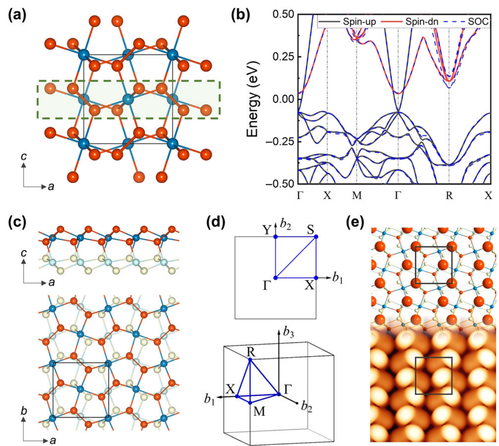
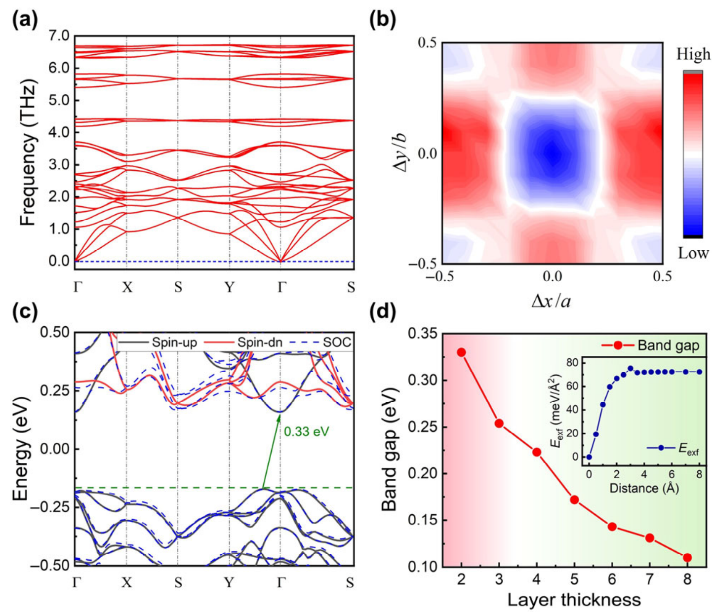
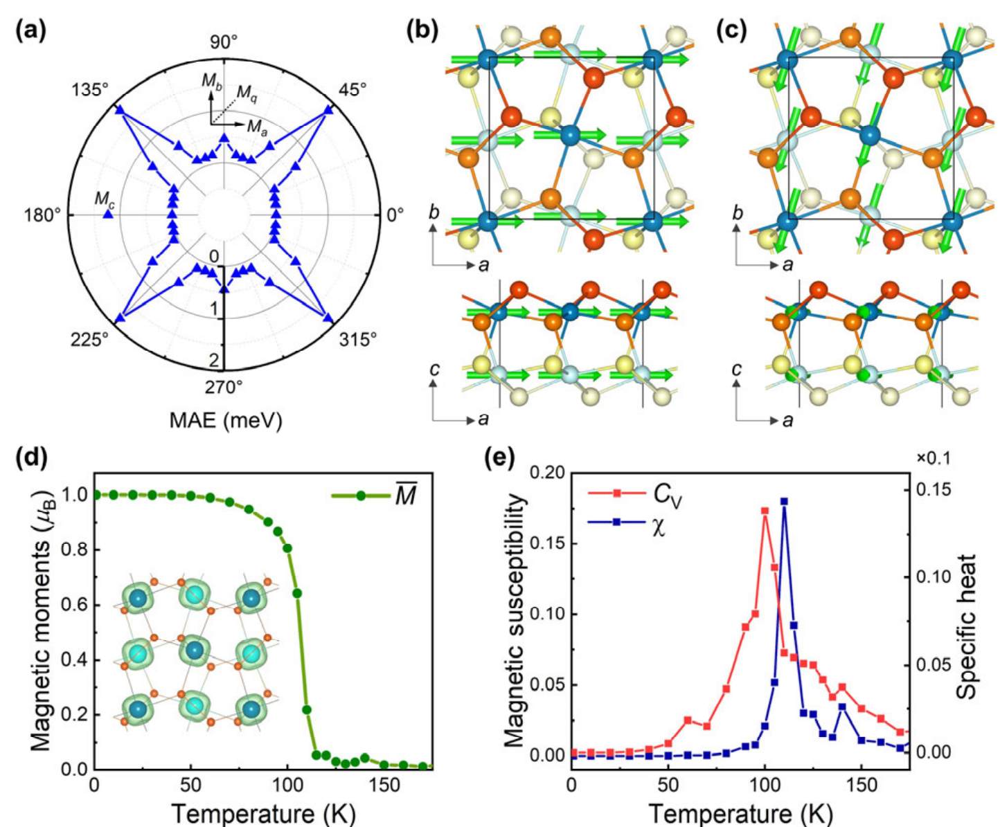
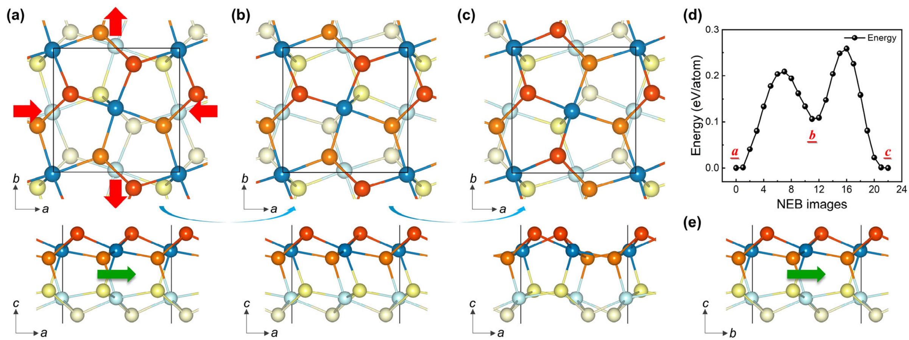
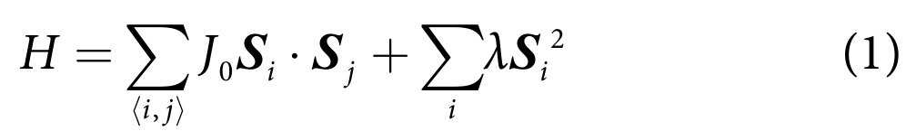

## liMonolayerPuckeredPentagonal2022 — 单层褶皱五边形VTe2：一种具有多铁性耦合的二维铁磁半导体

## 📄 元数据
Xuanyi Li, Zhili Zhu, Qing Yang, Zexian Cao, Yeliang Wang, Sheng Meng, Jiatao Sun, Hongjun Gao et al.，2022，Nano Research 15(2): 1486-1491，DOI: 10.1007/s12274-021-3692-5

## 💡 一句话
通过第一性原理计算预测了一种全新的单层褶皱五边形相VTe2（PP-VTe2），它是带隙0.33 eV、居里温度约110 K的本征铁磁半导体，且其二维铁弹性翻转可驱动面内易磁化轴旋转90°，实现铁弹-铁磁直接多铁耦合。

## 🔗 Wiki 双链
  - 概念 [[../concepts/2D-materials]]
  - 概念 [[../concepts/multiferroicity]]
  - 概念 [[../concepts/ferroelasticity]]
  - 概念 [[../concepts/magnetoelectric-coupling]]
  - 概念 [[../concepts/strain-engineering]]
  - 概念 [[../concepts/spin-orbit-coupling]]
  - 概念 [[../concepts/density-functional-theory]]
  - 概念 [[../concepts/charge-density-wave]]
  - 实体 [[../entities/TMDs]]
  - 实体 [[../entities/VASP]]
  - 实体 [[../entities/Fe3GeTe2]]
  - 实体 [[../entities/CrTe2]]
  - 图表 [[../figures/crystal-structures]]
  - 图表 [[../figures/electronic-bands]]
  - 图表 [[../figures/vibrational-spectra]]
  - 图表 [[../figures/mathematical-models]]
  - 图表 [[../figures/heterostructures-stacking-mechanics-misc|力学性质、剥离能与杂项]]
  - 年度 [[../write/2022]]
  - 相关论文 [[../../raw/note/liMonolayerPuckeredPentagonal2022]]

## 🆕 新概念/实体建议
  - `puckered-pentagonal-structure`（褶皱五边形结构）：TMD材料中除T-、H相之外的一类由五边形元胞构成、层内有褶皱起伏的结构相，可视为黄铁矿结构减薄至二维极限的产物（以PdSe2、PP-VTe2为代表）。
  - `PP-VTe2`（单层褶皱五边形VTe2实体）：空间群Pca21、矩形晶胞(a=6.774 Å, b=6.655 Å)、由两个化学键合子层构成的VTe2新相，本征铁磁半导体。
  - `ferromagnetic-semiconductor`（铁磁半导体）：同时具有铁磁有序和半导体带隙的二维材料类别，区别于半金属（如BP-VTe2）。
  - `magnetic-anisotropy-energy`（磁各向异性能，MAE）：磁矩沿不同晶向取向时的能量差，决定易磁化轴方向；本文用其确定面内[100]易轴。
  - `electrical-control-of-magnetism`（电控磁性）：利用栅压调控费米能级附近自旋极化态的占据，从而改变净磁矩的机制；本文中空穴浓度4.5×10^14 cm^-2下可使每单胞磁矩在12-10 μB间调节。
  - `exfoliation-energy`（剥离能）：从块体相剥离出单层所需能量；PP-VTe2为72.46 meV/Ų，支持外延生长制备。
  - `PdSe2`（实体）：层状五边形二维材料原型，是PP-VTe2结构与强层间键合的类比对象。

## 📊 关键图表
  - 
  -  → [[../figures/heterostructures-stacking-mechanics-misc|力学性质、剥离能与杂项]]
  - 
  - 
  - 

## 🔬 项目连接
无直接项目连接（主题上与project-2 Mn多铁同属多铁性材料体系，但本文材料为VTe2而非Mn基氧化物，方法为纯DFT预测，不直接归属任何既有项目）。

## 📝 组织与用词
文章按"背景动机→块体参照相→单层结构建模→稳定性验证→电子结构→磁性基态→铁弹性与多铁耦合→电控磁性展望→结论"的递进逻辑展开。先以BP-VTe2（半金属）为对照，凸显单层PP相（半导体）的物性突变；稳定性从动力学（声子谱无虚频）、力学（Born-Huang判据）、可制备性（剥离能72.46 meV/Ų）三重论证；磁性部分用DFT+U确定FM基态、MAE确定面内易轴[100]、海森堡模型+MC模拟桥接出Tc≈110 K；最后以NEB计算给出铁弹翻转能垒并指出易轴90°旋转这一核心耦合证据。值得复用的关键词/术语：
  - puckered pentagonal（褶皱五边形）
  - ferromagnetic semiconductor（铁磁半导体）
  - half-metallic（半金属）
  - multiferroic coupling（多铁耦合）
  - ferroelastic switching（铁弹性翻转）
  - magnetic anisotropy energy, MAE（磁各向异性能）
  - Curie temperature（居里温度）
  - nudged elastic band, NEB（微动弹性带方法）
  - exfoliation energy（剥离能）
  - electrical control of magnetism（电控磁性）

## ✏️ 可写入 Wiki 的要点
  1. PP-VTe2是VTe2的全新二维相，空间群Pca21，矩形晶胞a=6.774 Å、b=6.655 Å，由两个以五边形为基元、化学键合的子层构成（单个子层不能独立稳定），面内各向异性约1.8%；其结构灵感来自块体黄铁矿相BP-VTe2（空间群Pa-3，晶格常数6.746 Å）的(100)面。
  2. BP-VTe2为半金属：自旋向上通道金属性，自旋向下通道带隙1.088 eV；每个V原子在八面体晶体场中3个未配对电子占据t2g能级，磁矩约3 μB；化学形成能−0.265 eV/atom，仅略高于1T-VTe2（−0.307 eV/atom），提示实验可合成性。
  3. 单层PP-VTe2为间接带隙0.33 eV的铁磁半导体，显著区别于BP-VTe2的半金属性；带隙随子层数由2增至8而从0.33 eV降至0.11 eV，并发生间接→直接带隙转变；该窄带隙远小于CrI3(1.07 eV)、CrBr3(1.34 eV)、Cr2Ge2Te6(0.88 eV)，面向红外光电子应用。
  4. 稳定性三重证据：弹性常数C11=49.66、C22=72.92、C12=6.976、C44=24.59 N/m满足Born-Huang判据（C11C22−C12²>0, C44>0）；声子谱全布里渊区无虚频；子层相对滑移能量计算表明无位移构型为全局能量最低；剥离能72.46 meV/Ų，有望类似PdSe2通过外延生长制备。
  5. 磁性基态：DFT+U（Ueff=0/3/5 eV，Dudarev方法）计算表明在所有Ueff下FM态能量均低于NM和三种AFM态，为本征铁磁半导体；最近邻交换耦合J0=3.68 meV；每个V有8个最近邻磁性原子（同子层4个、另一子层4个）。
  6. 磁各向异性：易磁化轴沿面内[100]方向（与PP-VTe2唯一螺旋轴重合），与面内[010]、[110]方向能量差分别为0.45、1.83 meV/单胞，与面外[001]方向差1.23 meV/单胞；沿V-Te键方向存在倾斜FM亚稳态，能量比面内FM态高0.15 meV。
  7. 居里温度：基于准二维海森堡模型（含最近邻交换J0和单离子各向异性λ）在100×100网格上进行5,000,000步MC模拟（温度步长5 K），由磁矩、磁化率χ和比热CV峰值共同确定Tc≈110 K，高于CrI3(45 K)、CrBr3(27 K)、Cr2Ge2Te6(30 K)等实验二维磁体。
  8. 多铁耦合机制：NEB计算表明，沿x轴加压、y轴拉伸（仅1.8%应变）使矩形晶胞转为正方形后再旋转90°，可实现铁弹翻转；下层亚层Te原子水平移动保持五边形基元完整；翻转能垒 258 meV/atom，与黑磷烯等二维铁弹材料相当；翻转后易磁化轴同步旋转90°，构成应变可控的直接铁弹-铁磁多铁耦合。
  9. 电控磁性：投影DOS显示总磁矩完全来自−1至−0.1 eV能量区间的自旋极化态，且几乎全部由V 3d电子贡献；通过栅压调节化学势，在空穴浓度4.5×10^14 cm^-2下可使每单胞净磁矩在12-10 μB间调节，适合在高介电衬底上实现电控磁；PP-VSe2与PP-VS2因费米能级附近能带结构相似，同样有望实现电控磁性。
  10. 计算方法细节：VASP软件包，PAW赝势，PBE-GGA泛函，9×9×1 Monkhorst-Pack k点网格，平面波截断能500 eV，真空层20 Å，总能收敛至10^-8 eV、力收敛至10^-6 eV/Å（对消除虚频声子至关重要），声子用DFPT，弹性常数用有限畸变法，MAE自洽计算中包含SOC。
