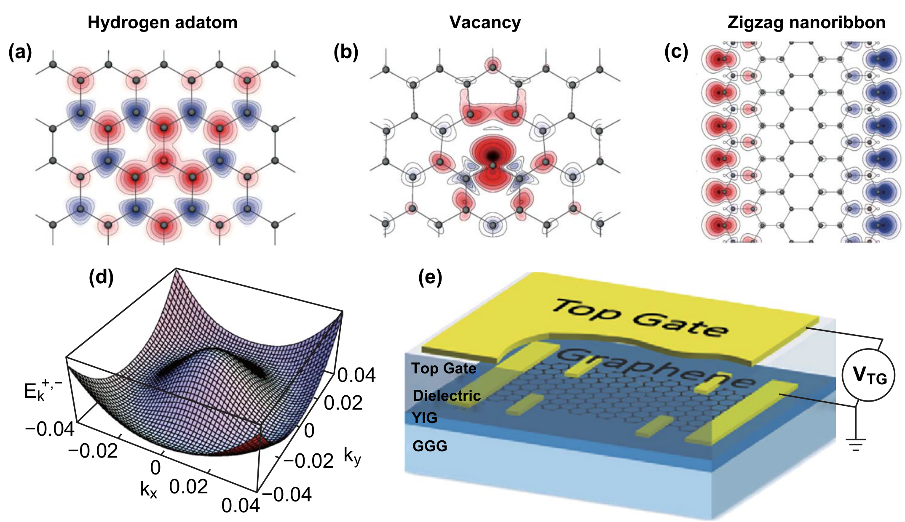
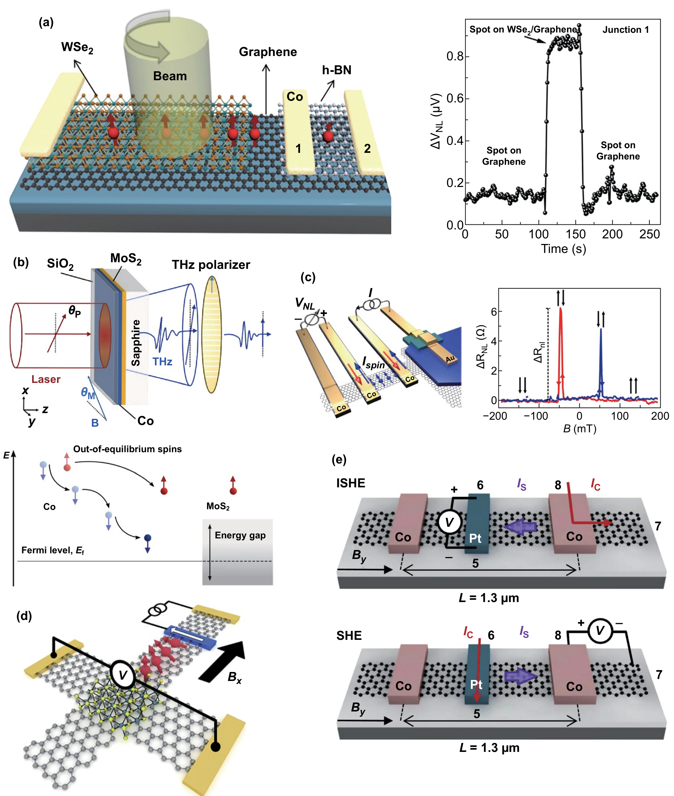
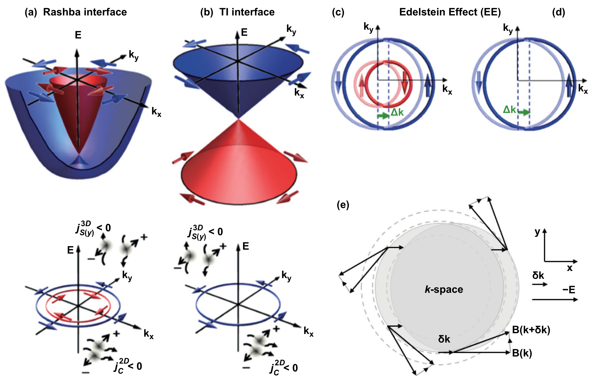
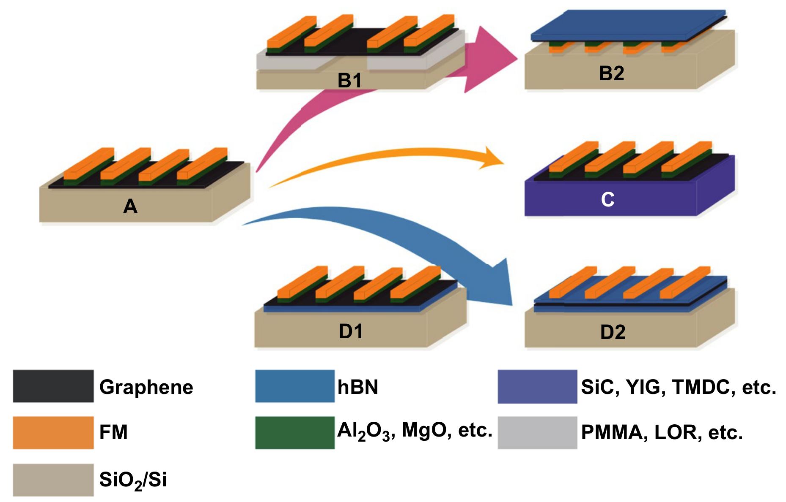
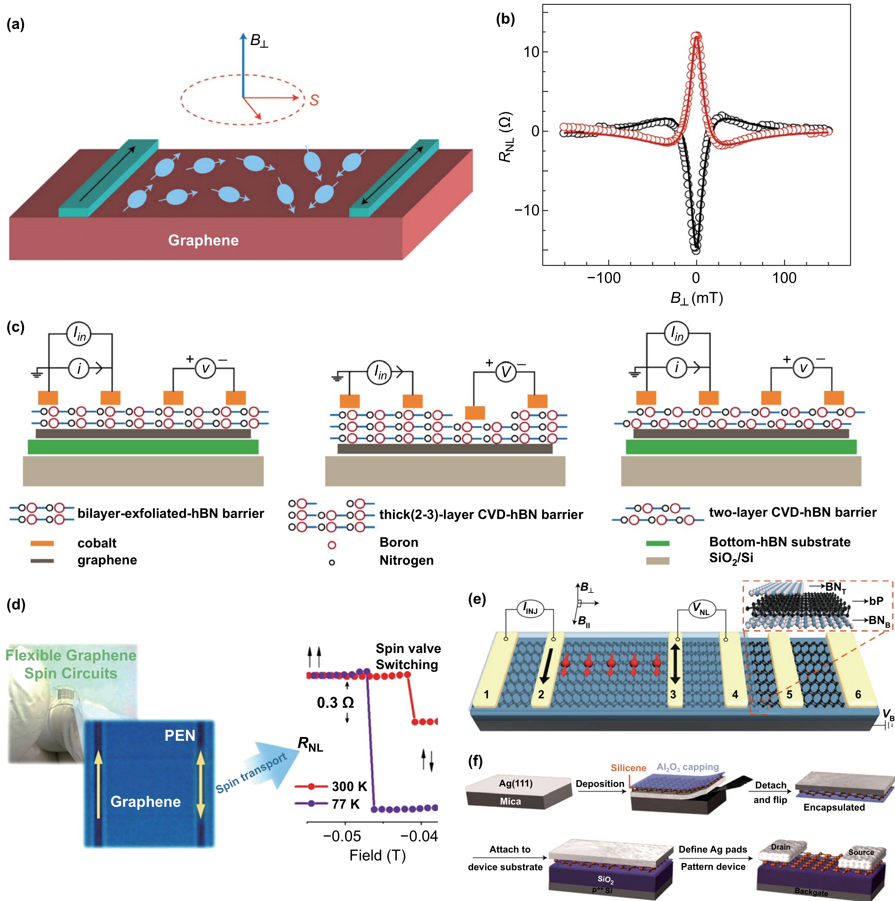
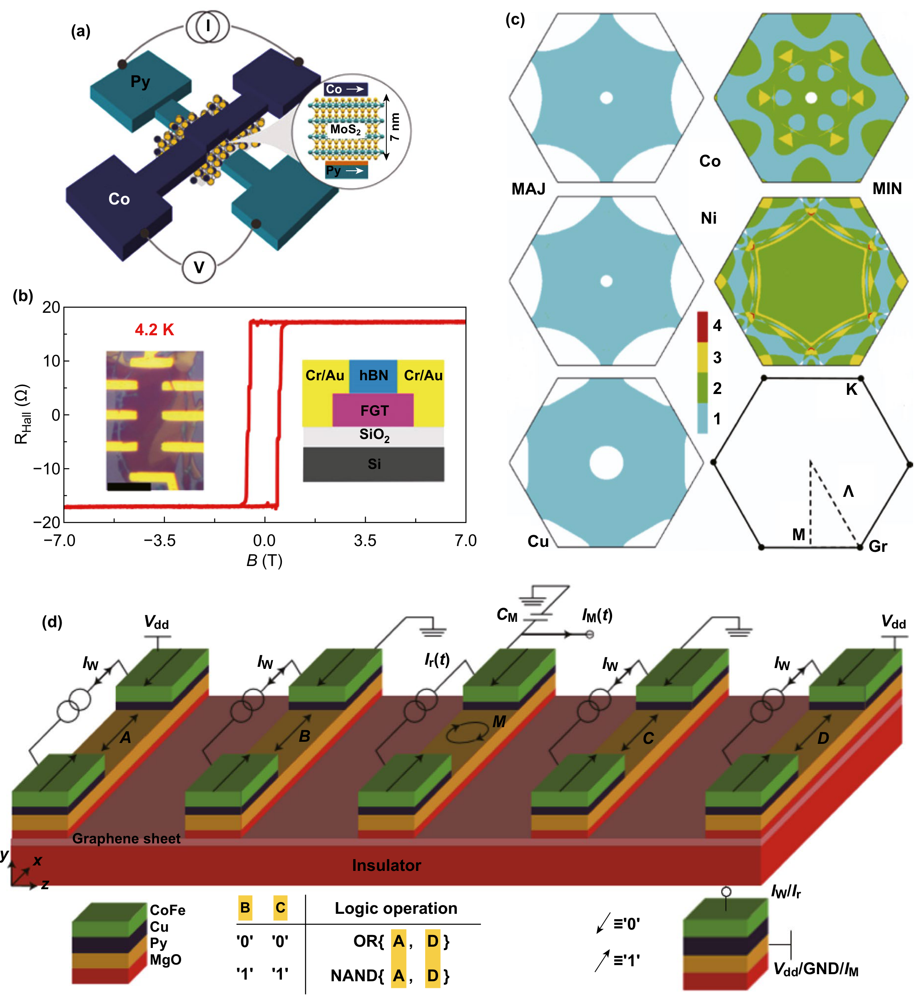
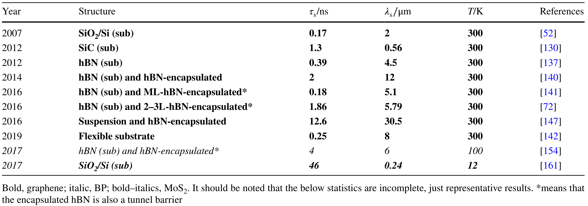
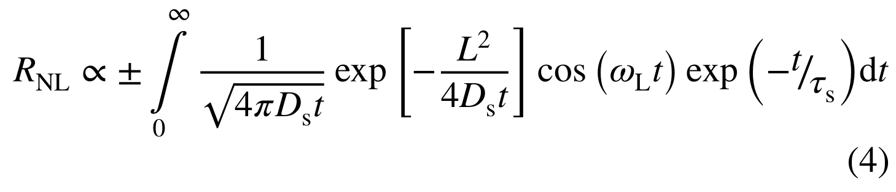

## liuSpintronicsTwoDimensionalMaterials2020b — 二维材料中的自旋电子学

- **元数据**：Yanping Liu, Cheng Zeng, Jiahong Zhong, Junnan Ding, Zhiming M. Wang, Zongwen Liu，2020，Nano-Micro Letters 12:93，DOI 10.1007/s40820-020-00424-2。
- **一句话**：以"自旋注入—输运—操控—应用"为主线，系统综述石墨烯/TMDCs/黑磷/硅烯等二维材料及其 vdW 异质结中的自旋电子学进展，确立 hBN 隧穿注入、hBN 封装/悬浮输运、邻近效应操控三条主流技术路线。

- **现有wiki双链**：
  - 概念 [[../concepts/2D-materials]]、[[../concepts/spin-orbit-coupling]]、[[../concepts/magnetoelectric-coupling]]、[[../concepts/strain-engineering]]、[[../concepts/berry-phase]]
  - 实体 [[../entities/h-BN]]、[[../entities/TMDs]]、[[../entities/Fe3GeTe2]]
  - 图表 [[../figures/heterostructures-stacking]]、[[../figures/electronic-devices]]、[[../figures/electronic-bands]]、[[../figures/crystal-structures]]、[[../figures/experimental-setups]]、[[../figures/mathematical-models]]
  - 年度 [[../write/2020]]
  - 项目 [[../projects/project-2-mn-multiferroics]]、[[../projects/project-5-snte-ferroelectric-sim]]、[[../projects/project-7-cdw-charge-density-wave]]
  - 相关论文 [[../../raw/note/liuSpintronicsTwoDimensionalMaterials2020b]]

- **新概念/实体建议**：
  - `proximity-effect`（邻近效应）：两种材料紧密接触时一种材料"借取"另一种材料磁性/SOC 等性质的界面效应，是本综述操控章节的核心。
  - `spin-injection`（自旋注入）：从铁磁电极或其他自旋流向非磁通道注入自旋极化载流子，受电导率失配制约。
  - `spin-relaxation`（自旋弛豫）：Elliott–Yafet 与 Dyakonov–Perel 机制之争，决定 τs 与 λs 的上限。
  - `spin-hall-effect`（自旋霍尔效应）：强 SOC 材料中纵向电荷流产生横向纯自旋流，是无磁注入/电荷-自旋转换的关键。
  - `rashba-effect`（Rashba 自旋-轨道耦合）：结构反演不对称导致的自旋分裂，哈密顿量 H_R = v0 ẑ·(k×σ)。
  - `edelstein-effect`（Edelstein 效应）：Rashba 界面或拓扑绝缘体表面态中电荷流直接转化为自旋积累。
  - `magnetic-tunnel-junction`（磁隧道结, MTJ）：FM/势垒/FM 结构，TMR 取决于两层磁化相对取向。
  - `stt-mram`（自旋转移矩磁随机存储器）：用自旋极化电流翻转自由层磁化的非易失存储。
  - `spin-valve`（自旋阀）：非局域四电极结构，自旋输运研究的基本器件。
  - `valleytronics`（谷电子学）：利用 TMDCs 中 K/K′ 谷作为信息载体，与自旋-谷锁定结合。
  - `two-dimensional-magnetism`（二维磁性）：Fe3GeTe2、CrI3、Cr2Ge2Te6 等原子级磁体及其电控/应力/层间耦合调控。
  - `van-der-waals-heterostructure`（vdW 异质结）：层间无悬挂键堆叠，是邻近工程的结构基础。
  - `graphene`（石墨烯）：弱 SOC、高迁移率的明星自旋通道，应建实体条目。
  - `CrI3`：层间反铁磁/铁磁可由堆叠与静电掺杂切换的二维铁磁绝缘体。
  - `Cr2Ge2Te6`：双层 Tc≈30 K 的二维铁磁绝缘体，常与 CrI3 并列讨论。
  - `black-phosphorus`（黑磷, BP）：具有直接带隙、弱 SOC 的新型自旋通道。
  - `silicene`（硅烯）：空气敏感、需原位 Al2O3 封装转移的硅基二维材料。
  - `Bi2Te2Se`：三维拓扑绝缘体，表面态 Dirac 费米子可向石墨烯注入自旋。
  - `YIG`（钇铁石榴石）：铁磁绝缘体，通过邻近效应在石墨烯中诱导交换场。

- **关键图表**：
  - 图1 非磁二维材料磁性工程策略：氢化/空位/纳米带、双层石墨烯墨西哥帽能带、石墨烯/YIG 邻近效应器件。
    
  - 图2 不同隧道势垒（Al2O3/MgO/hBN）下石墨烯自旋注入极化率随年份的发展。
    
  - 图3 快速拾取转移技术、FM/双层 hBN/石墨烯中偏压诱导的 ±100% 注入/检测极化率、氟化石墨烯隧穿势垒。
    
  - 图4 光学注入（WSe2/石墨烯、Co/MoS2 飞秒激光）、Bi2Te2Se 拓扑绝缘体注入、MoS2 邻近诱导自旋霍尔效应、石墨烯/Pt 自旋-电荷转换。
    
  - 图5 Rashba 界面与 TI 表面态的能带/费米轮廓及 Edelstein 效应：电荷流→自旋积累的微观图像。
    
  - 图6 石墨烯自旋器件结构演进：氧化物势垒→悬浮→不同衬底→hBN 衬底/封装。
    
  - 图7 Hanle 测量原理、不同堆叠 hBN 势垒比较、柔性石墨烯自旋电路、hBN/BP/hBN 自旋阀、硅烯 FET 合成-转移-制备流程。
    
  - 图8 自旋操控：离子栅调控 Fe3GeTe2 至室温以上、双层 CrI3 静电掺杂 AFM↔FM、轨道依赖层间超-超交换、MoS2/石墨烯室温栅控自旋阀、Y 形自旋流解复用器。
    
  - 图9 应用：多层 MoS2 MTJ、Fe3GeTe2/hBN/Fe3GeTe2 全二维 MTJ（TMR 160%）、石墨烯自旋滤波、五铁磁电极石墨烯磁逻辑门（OR/NAND）。
    
  - 图10 全文总结示意：电/光注入→二维材料自旋流→异质结界面操控→逻辑信号。
    
  - 表1 部分二维磁性材料的 Tc、电学性质与磁学性质（Cr2Ge2Te6、Cr2Si2Te6、Fe3GeTe2、VSe2、VS2、MnSe2、CrI3、CrBr3、ReI3、ReBr3）。
    
  - 表2 2007–2019 年石墨烯/BP/MoS2 自旋输运 τs、λs、温度随器件结构的发展。
    
  - 公式(4) Hanle 拟合公式：R_NL ∝ ±∫[1/√(4πDs t)] exp(−L²/4Ds t) cos(ω_L t) exp(−t/τs) dt。
    

- **项目连接**：
  - **project-2 Mn多铁（strong）**：本综述是二维磁性与磁电耦合的核心参考。Fe3GeTe2 离子液体栅将 Tc 调至室温以上、双层 CrI3 静电掺杂实现层间 AFM↔FM 切换、Cr2Ge2Te6/Cr2Si2Te6 的应力-自旋-晶格耦合、CrI3 层间堆叠决定磁耦合（轨道依赖超-超交换）等，与 Mn 基多铁项目关注的"电场/应力调控磁序""层状磁体磁电耦合""二维 vdW 磁体"直接对应；表1 提供的二维磁体 Tc 数据库可直接复用；磁电多铁性被作者明确点名作为提升电调控效率的途径（但理论信息尚少），与项目主题高度契合。
  - **project-5 SnTe铁电模拟（medium）**：SnTe 作为拓扑晶态绝缘体/铁电半导体，其 Rashba SOC、自旋-电荷转换、界面邻近效应是本综述第2.4节和第4.2节的核心物理。Rashba 哈密顿量 H_R = v0 ẑ·(k×σ)、Edelstein 效应、自旋霍尔/逆自旋霍尔效应、TI 表面态向石墨烯注入自旋（Bi2Te2Se）、石墨烯/MoS2 与石墨烯/WS2 邻近诱导 SOC 的第一性原理结果，均可为 SnTe 异质结中 SOC 与铁电耦合的模拟提供物理图像和计算参照（例如界面质量对邻近效应强度的决定性作用）。
  - **project-7 CDW（weak）**：本综述未直接讨论电荷密度波或 WTe2，仅在"二维金属/半金属"和"新型二维材料"层面有形式上的交集（如 VSe2、1T-VS2 等 1T 相过渡金属二硫化物被列为室温铁磁候选，与 CDW 相竞争/共存的 1T 相材料同源）。可作为 1T-TMD 相图与层状金属物性的背景文献，但无直接机制或数据可复用。
  - project-1 双光子、project-3 机械发光NN、project-4 TTF分子计算、project-6 湿度传感器：无直接项目连接。

- **组织与用词**：
  全文按"注入→输运→操控→应用"四幕递进组织，每幕先列物理障碍、再给技术路线、后以代表性实验数据收束；表1（二维磁体 Tc 数据库）与表2（自旋输运编年史）承担定量骨架，图10 回扣全局。论证反复回到同一组核心矛盾：石墨烯弱 SOC 利于长距离输运却不利于电控，强 SOC（邻近 TMDCs）利于操控却缩短 τs；室温二维铁磁体稀缺；外在散射（衬底、残留物、接触）vs 本征弛豫机制之争。值得在 wiki 叙述中复用的术语：
  - conductivity mismatch / 电导率失配
  - tunnel barrier / 隧道势垒（hBN、MgO、Al2O3、氟化石墨烯）
  - proximity engineering / 邻近工程
  - spin relaxation time τs & spin diffusion length λs = √(τs Ds) / 自旋弛豫时间与自旋扩散长度
  - non-local spin valve / 非局域自旋阀
  - Hanle precession / Hanle 进动
  - Edelstein effect / inverse Edelstein effect / Edelstein 效应及其逆效应
  - spin–charge interconversion / 自旋-电荷相互转换
  - gate-tunable magnetism / 栅极可调磁性
  - interlayer superexchange / super-superexchange / 层间超交换与超-超交换
  - all-2D MTJ / 全二维材料磁隧道结
  - spin-transfer torque (STT) / 自旋转移矩

- **可写入wiki的要点**：
  1. 电导率失配公式 P = (r_F P_F + r_C P_C)/r_FN（r_FN = r_F + r_N + r_C）定量说明铁磁金属直接接触二维材料时自旋注入效率极低；插入隧道势垒使 r_C ≠ 0 是标准解法，hBN 因原子级平整、与石墨烯晶格失配仅约 1.8% 成为最佳势垒。
  2. Gurram et al. 在 FM/双层 hBN/石墨烯/hBN 异质结中通过直流偏压将差分注入/检测极化率推至接近 ±100%（Nat. Commun. 8, 248, 2017）；Kamalakar et al. 用 Co/CVD-hBN/石墨烯实现约 65% 极化率并首次观测到信号反转。
  3. 自旋注入除电注入外尚有三条路径：(i) 磁工程（氢化石墨烯每个 H 贡献约 1 μB；空位、锯齿纳米带；偏压双层石墨烯墨西哥帽能带 Stoner 失稳）；(ii) 光注入（WSe2 圆偏光谷极化扩散至石墨烯；飞秒激光在 Co 中产生远平衡自旋注入 MoS2，自旋电流密度达 10^6–10^8 A cm^-2）；(iii) SOC 注入（Rashba/TI 表面态 Edelstein 效应、重金属/Pt 自旋霍尔效应）。
  4. Rashba 哈密顿量 H_R = v0 ẑ·(k×σ)，对应有效 k 依赖磁场 B(k) = 2α ẑ×k；Edelstein 效应使面内电荷流 j_C 偏移费米轮廓 Δk，在横向产生自旋积累并可扩散为纯三维自旋流。
  5. 石墨烯自旋输运性能编年史：SiO2/Si 衬底 τs≈170 ps、λs≈2 μm（2007/300 K）；SiC 衬底 1.3 ns；hBN 衬底 0.39 ns/4.5 μm；hBN 部分封装 2 ns/12 μm；悬浮 + hBN 封装 12.6 ns/30.5 μm（迄今剥离石墨烯最高，2016）；hBN 封装 2–3 层势垒可达 1.86 ns。自旋弛豫时间与迁移率无强相关，电荷散射不是主因，溶剂残留和接触诱导退相更为关键。
  6. Hanle 拟合公式 R_NL ∝ ±∫₀^∞ [1/√(4πDs t)] exp(−L²/4Ds t) cos(ω_L t) exp(−t/τs) dt，ω_L = gμ_B B⊥/ℏ，是提取 τs、λs 的标准方法；λs = √(τs Ds)。
  7. 其他通道：黑磷 hBN/BP/hBN 在 100 K 下 τs 达 4 ns、λs > 6 μm；硅烯通过 Ag(111) 外延 + 原位 Al2O3 封装 + 剥离转移实现室温 FET；多层 MoS2 导带中自旋扩散长度约 235 nm。
  8. 二维磁体电控：离子液体栅将三层 Fe3GeTe2 的 Tc 调至室温以上（Deng et al., Nature 563, 94, 2018）；双栅双层 CrI3 通过静电掺杂实现层间 AFM↔FM 完全可逆切换（Jiang et al.）；CrI3 层间磁耦合由堆叠方式决定，机制为轨道依赖的超-超交换（Sivadas et al.）。
  9. 应力/层间 vdW 调控：Cr2Si2Te6、Cr2Ge2Te6、Fe3GeTe2 中均存在自旋-晶格耦合；Cr2Si2Te6 在应力下 Tc 可至 290 K；设计高温二维铁磁体的经验法则是"增强交换相互作用 + 单轴磁各向异性"。
  10. 器件：Fe3GeTe2/hBN/Fe3GeTe2 全二维 MTJ 低温 TMR 达 160%；CrI3 作势垒的磁 vdW 异质结 TMR 可达 10^6%（磁振子辅助隧穿）；石墨烯因与 Co/Ni 晶格匹配产生自旋滤波，低温 MR 12%、室温 5%；五铁磁电极石墨烯磁逻辑门通过 I_w/I_r 自旋扭矩管理电极磁化，可实现 OR{ A,D } 与 NAND{ A,D }；基于石墨烯/TMDCs 的 Spin-FET 式精确自旋进动（Datta–Das, 1990）尚未真正实现。
