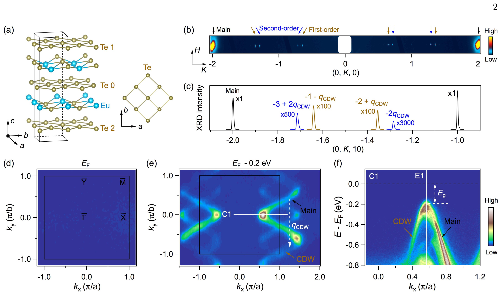
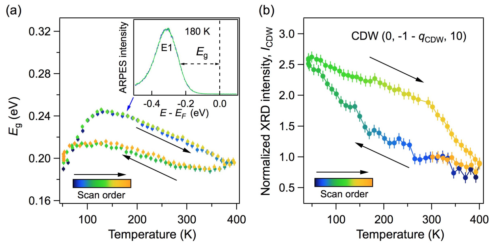

## lvUnconventionalHystereticTransition2022 — 电荷密度波的非常规滞回转变

## 📄 元数据
B. Q. Lv, Alfred Zong, D. Wu, A. V. Rozhkov, Boris V. Fine, Su-Di Chen, et al.，2022年，Physical Review Letters 128, 036401，DOI: 10.1103/PhysRevLett.128.036401

## 💡 一句话
在准二维CDW材料EuTe₄中发现温度跨度超过400 K的创纪录巨热滞回，该滞回完全发生在非公度CDW相内部、仅表现为序参量振幅变化而波矢不变，被归因于Te单层与Te双层之间CDW相对相位（0或π）的迟滞切换。

## 🔗 Wiki 双链
  - 概念 [[../concepts/charge-density-wave]]
  - 概念 [[../concepts/2D-materials]]
  - 概念 [[../concepts/hysteresis|滞后（Hysteresis）]]
  - 概念 [[../concepts/incommensurate-cdw|非公度电荷密度波]]
  - 概念 [[../concepts/interlayer-phase-coupling|层间相位耦合]]
  - 概念 [[../concepts/metastability|亚稳态]]
  - 实体 [[../entities/RTe3|RTe₃ 稀土三碲化物]]
  - 图表 [[../figures/crystal-structures]]
  - 图表 [[../figures/electronic-bands]]
  - 图表 [[../figures/mathematical-models]]
  - 图表 [[../figures/heterostructures-stacking-domains-devices|铁弹畴、畴壁、In₂Se₃ 与器件应用]]
  - 年度 [[../write/2022]]
  - 项目 [[../projects/project-7-cdw-charge-density-wave]]
  - 相关论文 [[../../raw/note/lvUnconventionalHystereticTransition2022]]

## 🆕 新概念/实体建议
  - `EuTe4`（entity）— 四碲化铕，准二维层状CDW材料，原胞含Te单层（Te0）和Te双层（Te1/Te2），CDW波矢q_CDW=0.643(3)b*，能隙196 meV。

## 📊 关键图表
  -  → [[../figures/heterostructures-stacking-domains-devices|铁弹畴、畴壁、In₂Se₃ 与器件应用]]
  -  -> [[../figures/electronic-bands|电子能带与电子态]]
  -  -> [[../figures/mathematical-models|数学模型与物理公式]]
  -  -> [[../figures/mathematical-models|数学模型与物理公式]]

## 🔬 项目连接
  - **project-7（CDW）— core**：本文是CDW领域的核心实验文献。直接研究准二维CDW材料EuTe₄中的非常规滞回转变，涉及CDW序参量振幅、非公度波矢、层间耦合、亚稳态等CDW核心物理。所提出的"层间CDW相对相位切换"机制是对CDW亚稳态理论的重要拓展，对理解CDW体系中面外自由度的作用有直接参考价值。多探针联合方法（输运+ARPES+XRD+XANES）也为CDW实验研究提供了方法论参考。
  - **project-5（SnTe铁电模拟）— weak**：本文的唯象自由能模型 F = F₀ + a(T)cos φ + b cos²φ 是典型的双势阱模型，两个近简并极小值（φ=0和φ=π）之间的势垒穿越导致滞回，这与铁电体中极化翻转的Landau-Ginzburg双势阱图像在物理上可类比。Ising型简并导致超宽温区双稳态的思路，对理解铁电存储中的滞回与保持特性有概念参考价值。但本文为纯实验工作，不含DFT计算流程，材料体系也非铁电体，故连接强度为weak。
  - 其余项目无直接连接。

## 🔗 项目双链
- 项目 [[../projects/project-7-cdw-charge-density-wave|项目七：CDW电荷密度波]]
- 项目 [[../projects/project-5-snte-ferroelectric-sim|项目五：lammps势函数SnTe铁电模拟]]

## 📝 组织与用词
  文章采用"现象观测 → 机理排除 → 模型提出 → 深化理解"的经典论证结构：
  1. 首先用XRD和ARPES表征CDW基态（非公度、长程、大能隙）；
  2. 通过电阻率测量揭示>400 K巨热滞回，确认其完全在CDW相内部；
  3. 用ARPES能隙与CDW衍射峰强度证明滞回仅涉及序参量振幅而非波矢；
  4. 系统排除三种已知机制（非公度-公度转变、Eu价态转变、强玻璃态转变）；
  5. 通过与RTe₃的结构对比锁定Te单层/双层相互作用，提出层间相位切换模型与自由能表达式；
  6. 分析两个微观因素（Te层电中性、载流子耗尽导致弱屏蔽）并给出材料设计指导原则。

  值得复用的关键词/术语：
  - 滞回/滞后（hysteresis）
  - 电荷密度波 [[../concepts/charge-density-wave|电荷密度波]]（charge density wave, CDW）
  - 非公度（incommensurate）
  - 序参量振幅（order parameter amplitude）
  - 层间相对相位（interlayer relative phase）
  - 亚稳态 [[../concepts/metastability|亚稳态]]（metastable state）
  - 准二维（quasi-2D）
  - 能量势垒（energy barrier）

## ✏️ 可写入 Wiki 的要点
  - EuTe₄为层状准二维CDW材料，CDW源自近正方形Te原子层；原胞含两种Te层——双层（Te1+Te2）与单层（Te0），两种层共享同一CDW波矢 but Te畸变方式不同。
  - CDW为非公度，q_CDW = 0.643(3) b*（接近2/3 but 非简单分数）；高分辨XRD显示一次与二次谐波卫星峰劈裂，关联长度面内≥77 nm、面外≥107 nm，为长程有序。
  - CDW在整个[[../concepts/fermi-surfaces|费米面]]打开能隙，55 K时最大能隙Eg = 196(7) meV（Γ̄–X̄方向），对应平均场T_c下限646 K；实际CDW转变温度>500 K。
  - 电阻率在80–400 K范围内呈现巨热滞回，温度宽度>400 K，为已知晶体固体中最大；该滞回完全位于CDW相内部（电子衍射卫星峰在30 K与300 K均存在），是主回线（major loop）内部的次回线（minor loop）。
  - 滞回过程中q_CDW在实验误差内不变，电子能带除热展宽与刚性能量移动外无重整化，排除非公度-公度转变；CDW能隙Eg与一级衍射峰积分强度I_CDW（∝Δ²）均表现出与电阻率一致的滞回，证明滞回源于CDW[[../concepts/order-parameter|序参量]]振幅变化而非[[../concepts/chemical-potential|化学势]]变化。
  - XANES显示43–325 K范围内Eu始终为Eu²+，排除价态转变；老化实验中电阻率在3000 min内准对数衰减<10%，由τ~3000 min与ν₀~1 THz估算势垒w ~ k_BT ln(ν₀τ) > 1 eV（远大于k_BT~26 meV）；温度扫速从0.15变到10 K/min时滞回线几乎不变，排除强玻璃态转变。
  - 关键对比：RTe₃仅含Te双层、Te层从R-Te层获得电子（非电中性）、CDW态存在残余费米面（屏蔽较强），无巨滞回；EuTe₄中Eu²+使Te层保持电中性，且CDW完全打开能隙使载流子耗尽，层间库仑屏蔽弱，[[../concepts/interlayer-phase-coupling|层间相位耦合]]能尺度微妙，导致φ=0与φ=π近简并。
  - 提出的自由能模型为 F = F₀ + a(T)cos φ + b cos²φ，其中φ ≡ φ₁ − φ₀为双层与单层CDW的相对相位；当a足够小时，F在φ=0与φ=π处有两个近简并极小值。两种理论情景：(a) a(T)在某温度变号导致[[../concepts/first-order-phase-transition|一级相变]]；(b) 3D CDW排列对称性强制a=0，产生Ising型简并，后者更自然地解释>400 K的超宽滞回。
  - 预测类似滞回应存在于满足以下条件的准二维CDW体系：两个非等效的电中性层、共享同一调制波矢、自由载流子浓度低。这为材料搜索提供了明确判据。
  - 直接验证需高分辨率截面透射电子显微镜在40–400 K宽温区内实空间观测层间CDW相位构型， but 热不稳定性使该实验极具挑战；未来可通过DFT定量计算层间耦合系数a(T)与b，或利用超快光/电脉冲主动操控相位切换。
