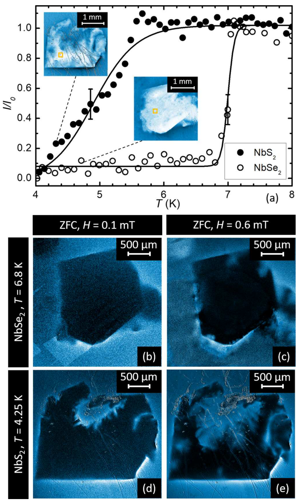
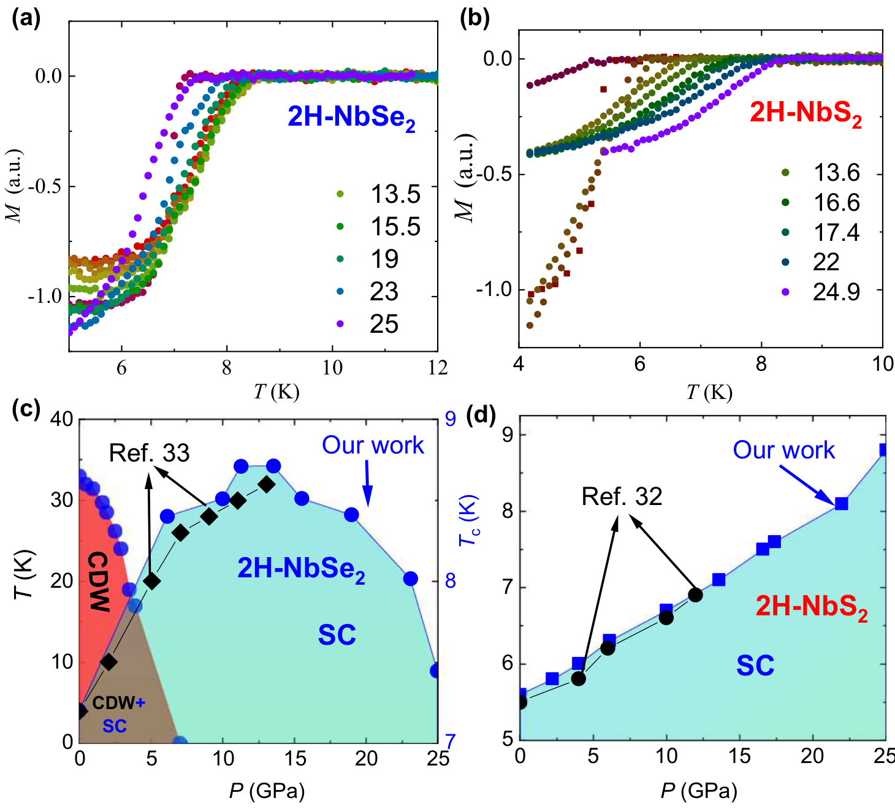
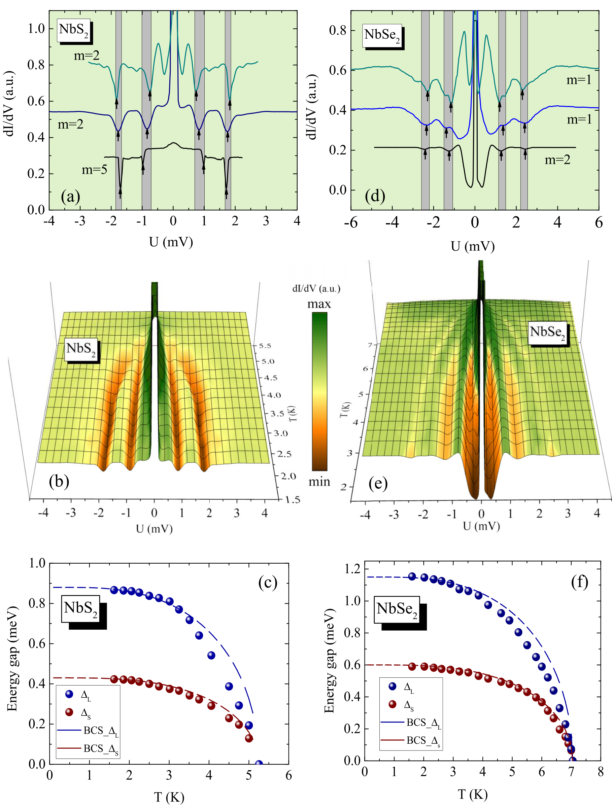
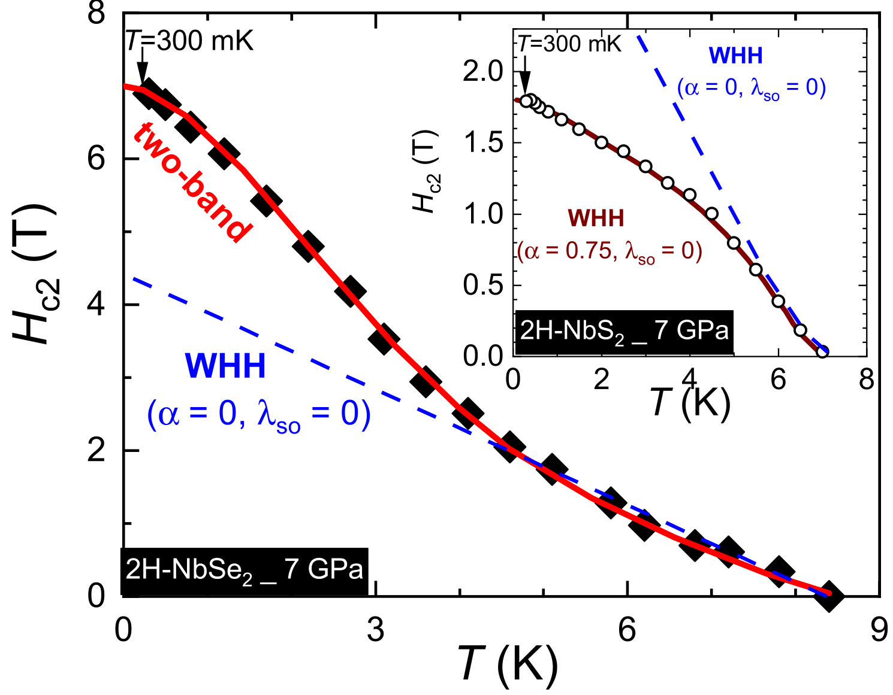
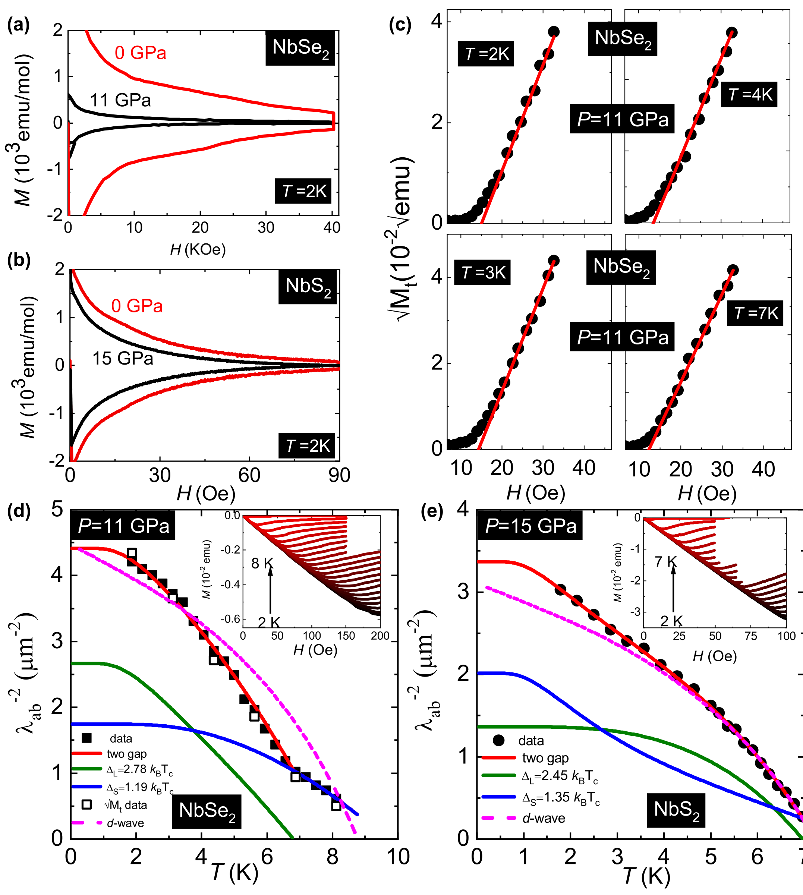
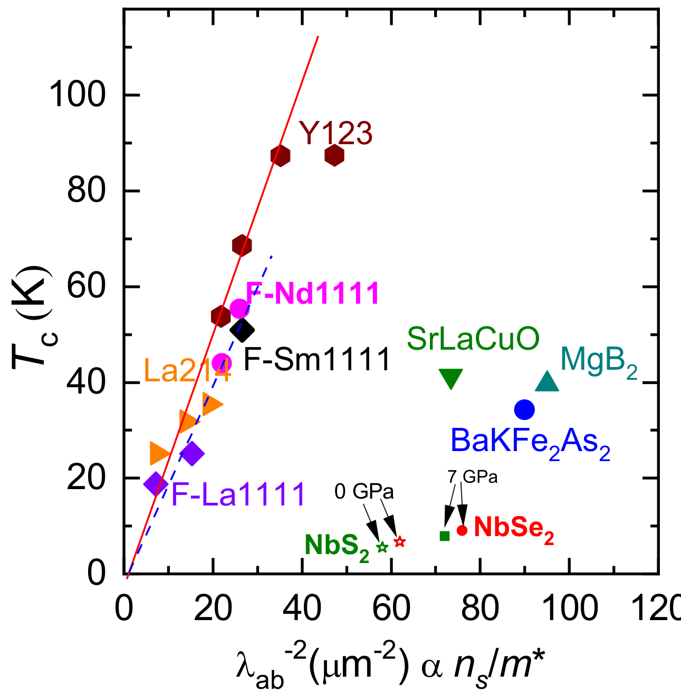

## majumdarInterplayChargeDensity2020 — 层状准二维材料中电荷密度波与多带超导电性的相互作用：以 2H-NbS₂ 和 2H-NbSe₂ 为例

## 📄 元数据
Arnab Majumdar, Derrick VanGennep, Jérémy Brisbois, Dmitriy Chareev, Andrey V. Sadakov, A. S. Usoltsev, Masaki Mito, Alejandro V. Silhanek, Tapati Sarkar, Abdelwahab Hassan, Olof Karis, Rajeev Ahuja, Mahmoud Abdel-Hafiez et al.，2020，Physical Review Materials 4, 084005，DOI: 10.1103/PhysRevMaterials.4.084005

## 💡 一句话
通过磁光成像、比热、高压输运/磁化、Andreev 反射谱、伦敦穿透深度与第一性原理计算的互补测量，证明 2H-NbSe₂ 中电荷密度波（CDW）与超导电性是竞争关系，而 2H-NbSe₂ 与 2H-NbS₂ 均为双 s 波能隙超导体，二者均偏离 Uemura 关系。

## 🔗 Wiki 双链
  - 概念 [[../concepts/charge-density-wave|电荷密度波]]
  - 概念 [[../concepts/2D-materials|二维材料]]
  - 概念 [[../concepts/multiband-superconductivity|多带超导电性]]
  - 概念 [[../concepts/pauli-paramagnetic-effect|泡利顺磁效应]]
  - 概念 [[../concepts/uemura-relation|Uemura 关系]]
  - 概念 [[../concepts/andreev-reflection|Andreev 反射]]
  - 概念 [[../concepts/electron-phonon-coupling|电子-声子耦合]]
  - 概念 [[../concepts/london-penetration-depth|伦敦穿透深度]]
  - 概念 [[../concepts/pressure-tuning|压力调控]]
  - 概念 [[../concepts/werthamer-helfand-hohenberg-model|WHH 模型]]
  - 实体 [[../entities/TMDs]]
  - 实体 [[../entities/NbSe2|NbSe₂]]
  - 实体 [[../entities/NbS2|NbS₂]]
  - 图表 [[../figures/electronic-bands]]
  - 图表 [[../figures/electronic-devices]]
  - 图表 [[../figures/crystal-structures]]
  - 图表 [[../figures/mathematical-models]]
  - 年度 [[../write/2020]]
  - 项目 [[../projects/project-7-cdw-charge-density-wave]]
  - 相关论文 [[../../raw/note/majumdarInterplayChargeDensity2020]]

## 📊 关键图表
  - **图1**：磁光成像（MOI）标定 Tc 与磁通穿透形貌
  -  -> [[../figures/experimental-setups|实验测试与测量装置]]
  - **图示描述**：(a) 以 1 mT 场冷后归一化光强 I/I₀ 随温度的变化确定 Tc，NbSe₂ 约 7.0 K、NbS₂ 约 5.6 K；(b)–(e) 零场冷后分别在 μ₀H=0.1 mT 和 0.6 mT 下成像磁通分布，上排 NbSe₂（T=6.8 K），下排 NbS₂（T=4.25 K）。
  - **关键特征**：低场下样品中心完全屏蔽（暗区），磁通仅堆积在边缘，呈现完美迈斯纳态；高场下磁通主要沿裂纹和缺陷进入，形成树枝状/指状图案；说明钉扎由宏观缺陷主导而非体钉扎，Bean 模型估算 Jc 会失真。
  - **结论/意义**：作为质量控制图，确认两个单晶均为高质量体超导体，同时警示后续磁化分析需谨慎处理缺陷引导穿透。

  - **图2**：电阻率与霍尔效应展示 CDW 驱动的载流子重构
  -  -> [[../figures/electronic-bands|电子能带与电子态]]
  - **图示描述**：(a) 0.4–300 K 面内电阻率 ρ(T)，插图放大低温区；(b) 霍尔迁移率 μ(T)；(c) 载流子浓度 n,p(T)，对比 NbSe₂ 与 NbS₂。
  - **关键特征**：NbSe₂ 在 ~33 K 出现 CDW 鼓包，NbS₂ 无此异常；NbSe₂ 于 27.9 K 发生霍尔系数符号反转（p→n），空穴浓度先升至 p=1.71×10²³ cm⁻³，反转后电子浓度 n=2.4×10²³ cm⁻³；电子迁移率在 ~10 K 达 30 cm²V⁻¹s⁻¹；NbS₂ 始终 p 型，6.3 K 时空穴迁移率仅 9.9 cm²V⁻¹s⁻¹。
  - **结论/意义**：直接证明 CDW 打开赝能隙并剧烈重构费米面，是两体系最本质的电子输运差异。

  - **图3**：常压比热与高压电阻率——压力单调抑制 CDW
  -  -> [[../figures/electronic-bands|电子能带与电子态]]
  - **图示描述**：(a) 常压比热 Cp(T)，插图为 0–6 T 平行 c 轴磁场下的超导跳变；(b) 不同压力下 CDW 转变附近的 ρ(T)；(c)(d) 常压和 7 GPa 下、不同磁场中的 ρ(T)（低至 300 mK）。
  - **关键特征**：33 K 处 CDW 鼓包与 Tc=7.2 K 的尖锐超导跳变并存；压力至 7.0 GPa 时 CDW 电阻异常单调消失；Tc 由 7.2 K 升至 ~8.5 K；常压磁场曲线出现 kink（疑为涡旋物质有序-无序相变），7 GPa 下 CDW 被抑制后 kink 完全消失。
  - **结论/意义**：在同一样品上建立 CDW 与 SC 的反相关，并首次提示 CDW 序与涡旋物质相之间存在耦合。

  - **图4**：温度-压力相图确立 CDW-SC 竞争关系
  -  -> [[../figures/crystal-structures|晶体结构与原子排布]]
  - **图示描述**：(a)(b) 不同压力下交流磁化率（3.86 Oe）随温度的变化；(c)(d) 由此构建的 NbSe₂ 与 NbS₂ 的 P-T 相图，(c) 左轴 T_CDW（黑）、右轴 Tc（蓝）。
  - **关键特征**：NbSe₂ 中 T_CDW 随压力单调下降，约 4.8–5 GPa 完全消失；0–7 GPa 区间 Tc 由 7.2 K 急剧升至 ~8.5 K，CDW 消失后上升变缓并在 ~10 GPa 后呈穹顶状；NbS₂ 无 CDW，Tc 随压力至 25 GPa 仅缓慢线性增长；两体系在 25 GPa 仍保持超导。
  - **结论/意义**：该图是全文核心证据，定量确立 NbSe₂ 中 CDW 与 SC 的竞争关系。

  - **图5**：Andreev 反射谱（IMARE）直接观测双 s 波能隙
  -  -> [[../figures/electronic-bands|电子能带与电子态]]
  - **图示描述**：(a)(d) NbS₂ 与 NbSe₂ 的 S-c-S 断裂结归一化动态电导 dI/dV vs V/m，灰色条带标注次谐波能隙结构（SGS）；(b)(e) 不同温度下谱的演化；(c)(f) 提取的 Δ(T) 与 BCS 拟合。
  - **关键特征**：两体系均出现两组等间距凹陷峰，NbS₂ 位于 ±1.70–1.85 mV 与 ±0.75–0.96 mV，NbSe₂ 位于 ±2.28–2.44 mV 与 ±1.15–1.40 mV；随升温峰位向低偏压移动并在 Tc 附近消失；BCS 比值 Δ_L/k_BTc 分别为 2.01±0.23（NbS₂）和 2.1±0.2（NbSe₂），均超过弱耦合 1.76；小能隙比值 1.15±0.24、1.25±0.2 低于弱耦合值；凹陷对称形状指示 s 波。
  - **结论/意义**：微观上直接证实两体系均为双 s 波能隙超导体，大能隙带内强耦合、两凝聚体间存在非零相互作用。

  - **图6**：第一性原理费米面——压力下拓扑不变，排除嵌套
  -  -> [[../figures/electronic-bands|电子能带与电子态]]
  - **图示描述**：(a)–(d) 与 (f)–(i) 为 QUANTUM ESPRESSO（PAW-PBE，15×15×4 k 网格，150 Ry 截断）计算的 NbSe₂ 与 NbS₂ 在 1、2、6、10 GPa 下的费米面；(e) 为六方第一布里渊区。
  - **关键特征**：1–10 GPa 内两材料费米面整体尺寸略有变化但拓扑几乎不变，未出现新的嵌套矢量；NbSe₂ 在 2 GPa 于 Γ 点出现 Se 衍生的薄饼状电子口袋（推测为 CDW 抑制前兆）；大能隙对应 Nb 衍生的四个准二维管状费米面，小能隙对应 Se/S 衍生口袋。
  - **结论/意义**：从理论上反驳费米面嵌套作为 CDW 主因的传统图像，支持动量依赖电子-声子矩阵机制。

  - **图7**：高压上临界场——NbS₂ 泡利极限 vs NbSe₂ 多带上翘
  -  -> [[../figures/electronic-bands|电子能带与电子态]]
  - **图示描述**：主图为 NbSe₂、插图为 NbS₂ 在 7 GPa 下 μ₀Hc₂(T) 曲线（低至 300 mK），数据点叠加 WHH 与 Gurevich 双带模型拟合。
  - **关键特征**：NbS₂ 的 Hc₂ 在低温趋于饱和，WHH 模型取自旋顺磁项 α=0.75、自旋轨道散射 λ_so≈0 时拟合得 μ₀Hc₂(0)=1.8 T，无顺磁项的传统 WHH 失效；NbSe₂ 的 Hc₂ 无上饱和地向上弯曲，Gurevich 双带模型（D₁=4.73、η=0.34）描述得 μ₀Hc₂(0)=7.2 T。
  - **结论/意义**：尽管两体系能隙结构相似，高压下配对破坏机制却截然不同——NbS₂ 由泡利顺磁主导，NbSe₂ 由多带效应主导。

  - **图8**：伦敦穿透深度——宏观验证双 s 波、排除 d 波
  -  -> [[../figures/electronic-bands|电子能带与电子态]]
  - **图示描述**：(a)(b) NbSe₂ 与 NbS₂ 在 2 K 的等温 M(H) 曲线；(c) 以捕获磁矩平方根 √M_t 对最大外加场 H_m 线性外推确定 Hc1；(d)(e) 由此推出的 λ_ab⁻²(T)，散点为实验，虚线为 d 波拟合、实线为双 s 波拟合（NbSe₂ 11 GPa、NbS₂ 15 GPa）。
  - **关键特征**：M(H) 关于 M=0 对称，表强体钉扎；双 s 波参数 NbSe₂：Δ_L/k_BTc=2.78±0.3、Δ_S/k_BTc=1.19±0.3、权重 r=0.25±0.08；NbS₂：Δ_L/k_BTc=2.45±0.15、Δ_S/k_BTc=1.35±0.2、r=0.22±0.2；d 波 g(φ)=|cos2φ| 系统偏离数据。
  - **结论/意义**：宏观穿透深度独立印证 Andreev 谱结果，证实无节点 s 波双能隙序参量。

  - **图9**：Uemura 图——偏离普适 Tc–n_s/m* 线性关系
  -  -> [[../figures/electronic-bands|电子能带与电子态]]
  - **图示描述**：以 Tc 为纵轴、λ_ab⁻²(0)（正比于 n_s/m*）为横轴的 Uemura 图，数据点含 NbSe₂/NbS₂ 的常压与高压数据，并叠加铜氧化物、铁基（1111/122）、MgB₂ 等参照体系。
  - **关键特征**：NbSe₂ 与 NbS₂ 的数据点显著落在由非常规超导体定义的普适直线之外；常压与高压数据一致偏离，并非压力诱导；说明 Tc 主要由大能隙带内强耦合决定，而非超流密度。
  - **结论/意义**：将这两个 TMD 超导体排除在 Uemura 分类之外，为其独特的（近强耦合多带 BCS）机理定位提供关键约束。

## 🔬 项目连接
project-7 CDW（电荷密度波）直接相关——本文是 CDW 与超导竞争、CDW 起源（费米面嵌套 vs 电子-声子耦合）、高压调控 CDW 的核心实验文献。

## 🔗 项目双链
- 项目 [[../projects/project-7-cdw-charge-density-wave|项目七：CDW电荷密度波]]

## 📝 组织与用词
  文章采用"现象→调控→微观机制→宏观验证"的递进论证：(A) 磁光成像确认样品质量与磁通钉扎特征；(B) 电阻率/霍尔效应展示 CDW 引起的载流子符号反转；(C-D) 高压比热/输运/磁化构建 T-P 相图，确立 CDW-SC 竞争；(E) Andreev 谱微观探测双能隙；(F) DFT 费米面计算排除嵌套机制；(G) 高压 H_c2 区分泡利顺磁（NbS₂）与多带效应（NbSe₂）；(H-I) 伦敦穿透深度宏观证实 s 波双能隙；最后以 Uemura 图收尾，指出机理独特性。多手段互证是全文方法论核心。
  值得复用的关键词/术语：
  - 电荷密度波 [[../concepts/charge-density-wave|电荷密度波]] / Charge density wave (CDW)
  - 多带超导电性 [[../concepts/multiband-superconductivity|多带超导电性]] / Multiband superconductivity
  - 双 s 波能隙 / Two-gap s-wave
  - 安德列夫反射次谐波能隙结构 / Subharmonic gap structure (SGS) of Andreev reflection
  - 伦敦穿透深度 [[../concepts/london-penetration-depth|伦敦穿透深度]] / London penetration depth λ_ab
  - 泡利顺磁效应 [[../concepts/pauli-paramagnetic-effect|泡利顺磁效应]] / Pauli paramagnetic effect (Clogston-Chandrasekhar limit)
  - 费米面嵌套 [[../concepts/fermi-surface-nesting|费米面嵌套]] / Fermi surface nesting
  - Uemura 关系 [[../concepts/uemura-relation|Uemura 关系]]（上村图）/ Uemura plot (T_c vs n_s/m*)
  - 动量依赖电子-声子耦合 / q-dependent electron-phonon coupling
  - 上临界场 / Upper critical field H_c2
  - 压力调控 [[../concepts/pressure-tuning|压力调控]] / Pressure tuning (diamond anvil cell)
  - 磁通钉扎 / Flux pinning

## ✏️ 可写入 Wiki 的要点
  1. **材料基本参数**：2H-NbSe₂ 常压下 T_CDW≈33 K、T_c≈7.2 K；2H-NbS₂ 无 CDW、T_c≈5.7 K。两者同构（六方 2H 相，层状 TMD），是剥离 CDW 对超导影响的理想对比体系。
  2. **CDW-SC 竞争相图**：在 NbSe₂ 中，压力 0–7 GPa 内 T_CDW 单调下降并于约 4.8–5 GPa 完全消失，同时 T_c 从 7.2 K 急剧升至约 8.5 K；CDW 消失后 T_c 上升变缓，在约 10 GPa 形成穹顶后略降，呈现典型竞争关系。NbS₂ 无 CDW，T_c 随压力至 25 GPa 仅缓慢线性增长。
  3. **CDW 引起的载流子重构**：NbSe₂ 在 T≈27.9 K（低于 T_CDW≈33 K）发生霍尔系数符号反转（p 型→n 型）；空穴浓度先升至 p=1.71×10²³ cm⁻³，反转后电子浓度达 n=2.4×10²³ cm⁻³；电子迁移率在 ~10 K 达 30 cm²V⁻¹s⁻¹。NbS₂ 始终为 p 型，6.3 K 时空穴迁移率仅 9.9 cm²V⁻¹s⁻¹。
  4. **双 s 波能隙（Andreev 谱）**：S-c-S 断裂结本征多重 [[../concepts/andreev-reflection|Andreev 反射]]（IMARE）观测到两组独立次谐波能隙结构。NbS₂：Δ_L/k_BT_c=2.01±0.23、Δ_S/k_BT_c=1.15±0.24；NbSe₂：Δ_L/k_BT_c=2.1±0.2、Δ_S/k_BT_c=1.25±0.2。大能隙超过弱耦合 BCS 值（1.76），表明强带内耦合；小能隙低于 BCS 值，表明两凝聚体间存在非零相互作用。凹陷对称形状指示 s 波[[../concepts/order-parameter|序参量]]。
  5. **双 s 波能隙（[[../concepts/penetration-depth|穿透深度]]独立验证）**：由捕获磁矩法（√M_t→0 外推）确定 H_c1，再经 GL 关系得到 λ_ab(T)。双 s 波模型拟合参数：NbSe₂（11 GPa）Δ_L/k_BT_c=2.78±0.3、Δ_S/k_BT_c=1.19±0.3、权重 r=0.25±0.08；NbS₂（15 GPa）Δ_L/k_BT_c=2.45±0.15、Δ_S/k_BT_c=1.35±0.2、r=0.22±0.2。d 波模型（g(φ)=|cos2φ|）明显偏离数据，排除节点能隙。
  6. **[[../concepts/fermi-surfaces|费米面]]拓扑与 CDW 起源**：QUANTUM ESPRESSO（PAW-PBE，15×15×4 k 网格，150 Ry 截断）计算显示 1–10 GPa 内两材料 FS 拓扑几乎不变，无新嵌套矢量；NbSe₂ 在 2 GPa 于 Γ 点出现 Se 衍生的薄饼状电子口袋（推测为 CDW 抑制的前兆），大能隙对应 Nb 衍生的四个准二维管状费米面，小能隙对应 Se/S 衍生口袋。结果支持 CDW 源于动量依赖电子-声子矩阵而非[[../concepts/fermi-surface-nesting|费米面嵌套]]（与 Johannes & Mazin 2008、Whangbo & Canadell 一致）。
  7. **高压 H_c2 的不同主导机制**（7 GPa，低至 300 mK）：NbS₂ 的 H_c2(T) 低温饱和，[[../concepts/werthamer-helfand-hohenberg-model|WHH 模型]]含自旋顺磁项 α=0.75、可忽略自旋轨道散射 λ_so=0，拟合得 μ_0H_c2(0)=1.8 T；NbSe₂ 的 H_c2(T) 无上饱和地向上弯曲，需用 Gurevich 双带模型（D_1=4.73、η=0.34）拟合，得 μ_0H_c2(0)=7.2 T。
  8. **GL [[../concepts/coherence-length|相干长度]]与退磁因子**：由 H_c2 得 ξ_ab=27.2(2) nm（NbSe₂）和 22.4(2) nm（NbS₂）；退磁因子 N≈0.96（NbSe₂）、0.95（NbS₂），因薄片状几何导致强退磁效应。
  9. **偏离 [[../concepts/uemura-relation|Uemura 关系]]**：λ_ab⁻²(0)（即 n_s/m*）与 T_c 的数据点在 Uemura 图上显著远离铜氧化物、铁基（1111/122）、MgB₂ 所遵循的普适线性关系，且常压与高压数据均偏离，表明 NbSe₂/NbS₂ 不属于 Uemura 分类中的非常规超导，其 T_c 主要由大能隙带内[[../concepts/strong-coupling|强耦合]]决定而非[[../concepts/superfluid-density|超流密度]]。
  10. **CDW-涡旋态关联**：常压下 NbSe₂ 电阻转变曲线在磁场中出现 kink，被归因于涡旋物质的有序-无序（固-固）相变；当 CDW 在 7 GPa 被完全抑制后该 kink 消失，首次在实验上提示 CDW 序与涡旋物质相之间存在耦合，值得用 STM 等微观手段进一步研究。
