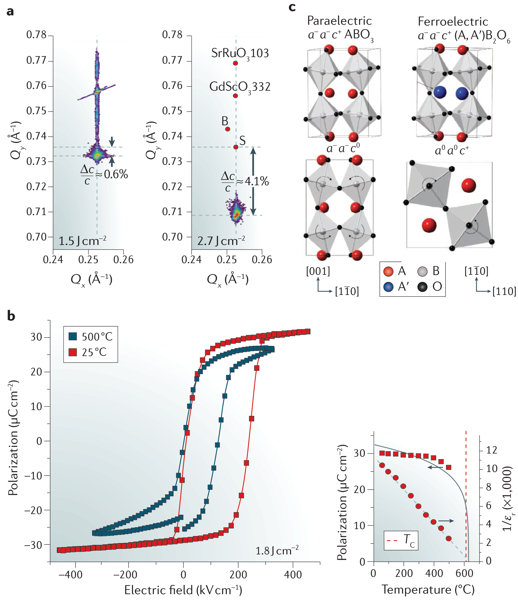
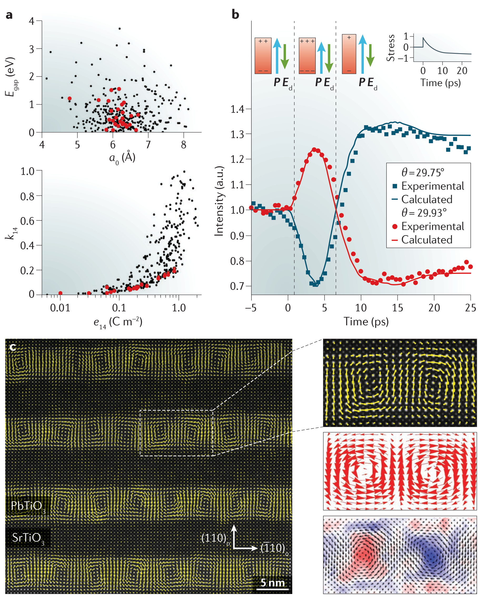

## martinThinfilmFerroelectricMaterials2016 — 铁电薄膜材料及其应用（Thin-film ferroelectric materials and their applications）

## 📄 元数据
Lane W. Martin & Andrew M. Rappe，2016，*Nature Reviews Materials* 2, 16087，DOI: 10.1038/natrevmats.2016.87（综述）
## 💡 一句话
以"应变工程"为主线，系统综述过去十年铁电薄膜在常规/非传统应变调控、热学效应（热释电/电卡）、畴壁电子学、负电容、铁电-二维材料异质结和体光伏效应等方向的革命性进展，并指明材料基因组、非传统铁电体、原位表征、拓扑铁电、能源催化等未来方向。

## 🔗 Wiki 双链
  - 概念 [[../concepts/strain-engineering]]、[[../concepts/polarization-switching]]、[[../concepts/multiferroicity]]、[[../concepts/magnetoelectric-coupling]]、[[../concepts/ferroelectric-tunnel-junction]]、[[../concepts/2D-materials]]、[[../concepts/topological-defects]]、[[../concepts/berry-phase]]、[[../concepts/density-functional-theory]]、[[../concepts/sliding-ferroelectricity]]、[[../concepts/flexoelectric-effect|挠曲电效应]]、[[../concepts/hybrid-improper-ferroelectricity|杂化非本征铁电性]]、[[../concepts/negative-capacitance|负电容]]、[[../concepts/bulk-photovoltaic-effect|体光伏效应]]、[[../concepts/electrocaloric-effect|电卡效应]]、[[../concepts/pyroelectric-effect|热释电效应]]、[[../concepts/octahedral-rotation|氧八面体旋转]]、[[../concepts/morphotropic-phase-boundary|准同型相界]]
  - 实体 [[../entities/BiFeO3]]、[[../concepts/domain-wall]]、[[../entities/VASP]]、[[../entities/SnTe]]、[[../entities/TMDs]]、[[../entities/h-BN]]、[[../entities/BaTiO3|钛酸钡 BaTiO₃]]、[[../entities/PbTiO3|钛酸铅 PbTiO₃]]、[[../entities/PZT|PZT 锆钛酸铅]]、[[../entities/LiNbO3|铌酸锂 LiNbO₃]]、[[../entities/SrTiO3|钛酸锶 SrTiO₃]]、[[../entities/HfO2|二氧化铪 HfO₂]]
  - 图表 [[../figures/crystal-structures]]、[[../concepts/domain-wall]]、[[../figures/heterostructures-stacking|铁弹畴、畴壁、In₂Se₃ 与器件应用]]
  - 年度 [[../write/2015-2019]]
  - 项目 [[../projects/project-2-mn-multiferroics]]、[[../projects/project-5-snte-ferroelectric-sim]]、[[../projects/project-4-ttf-molecular-calc]]、[[../projects/project-7-cdw-charge-density-wave]]
  - 主题 [[多铁性材料]]、[[材料模拟计算设计]]
  - 相关论文 [[../../raw/note/martinThinfilmFerroelectricMaterials2016]]

## 🆕 新概念/实体建议
（本页所有建议项均已建页并提升至上方双链）

## 📊 关键图表
  - **图1：薄膜应变效应**
  -  → [[../figures/crystal-structures-surfaces-defects|表面、缺陷与形貌]]
  - **图示描述**：由 a–d 四个子图组成，集中展示外延应变对铁电薄膜晶体结构与畴结构的调控。a 图为三色 BaTiO₃/SrTiO₃/CaTiO₃ 超晶格的 Z-衬度 STEM 像（左）与宽角 XRD 扫描（右，衍射角 2θ 单位为度，强度为任意单位）；b 图为高应变 BiFeO₃ 混合相薄膜的 AFM 表面形貌及 2–3 nm 周期性高度起伏；c 图为高分辨 TEM 下类四方相与类菱方相之间共格、无缺陷的相界；d 图为 DyScO₃ 衬底上 La 掺杂 BiFeO₃ 薄膜的垂直（左）与水平（右）PFM 像。
  - **关键特征**：a 图 XRD 除 SrTiO₃ 衬底峰外出现一系列 ±1、±2 级卫星峰，证明超晶格具有原子级平整界面与长程周期，相干应变加界面耦合使 BaTiO₃ 层极化增强约 50%；b–c 图中约 −4.5% 压应变稳定了 P4mm 超四方相（c=4.655 Å、a=3.665 Å，c/a≈1.26），并与菱方相形成条纹状混合相，两相界面共格且可在电场下运动，给出 4–5% 的巨电致应变；d 图显示通过平衡弹性能与静电能获得一维纳米尺度的周期性 109° 畴阵列。
  - **结论/意义**：该图奠定了全文"应变工程"主线——外延应变既能在原子尺度"搭建"超晶格新结构，也能稳定自然界不存在的新相并确定性控制畴图案。

  - **图2：非传统应变**
  -  -> [[../figures/crystal-structures-bulk|体相晶体结构]]
  - **图示描述**：a、b 子图为 PLD 激光能量分别取 1.5 与 2.7 J/cm² 时生长的 BaTiO₃ 薄膜的 X 射线倒易空间图（Qx、Qy 单位为 Å⁻¹）及其铁电性能曲线（电滞回线电场轴 kV/cm、极化轴 μC/cm²；温度曲线含 1/εr × 1000）；c 子图为钙钛矿 (A,A')B₂O₆ 中氧八面体 a⁻a⁻c⁺ 旋转模式打破反演对称、诱导杂化非本征铁电性的示意图。
  - **关键特征**：激光能量从 1.5 提至 2.7 J/cm² 时，薄膜由近共格应变态转为显著弛豫，面外晶格参数 Δc/c ≈ 4.1% 的各向异性膨胀，源于取向缺陷偶极子同时具有电偶极矩与弹性偶极矩并与极化、应变耦合；该缺陷工程把 BaTiO₃ 的居里温度 Tc 从块体约 120 °C 推高至 600 °C 以上（正文部分提及 >1000 °C），室温和 500 °C 下仍测得饱满电滞回线；c 图所示的 a⁻a⁻c⁺ 旋转模式由两种不同对称性的非极性光学模组合而成，可诱导可翻转的自发极化，是一条不依赖衬底失配的全新铁电生成路径。
  - **结论/意义**：图2 把"应变"从单一晶格失配扩展为缺陷工程、取向工程与界面八面体旋转耦合的多元工具箱，为不用受限衬底即可剪裁铁电物性指明方向。

  - **图3：热学性质**
  -  -> [[../figures/domain-walls-structures|畴结构与畴壁]]
  - **图示描述**：由 a–e 五个子图构成铁电薄膜热学响应的测量与机制分解。a 图为 PbZr₀.₉₅Ti₀.₀₅O₃ 薄膜的电卡温变 ΔT（K）随温度曲线，插图为不同电场下 P(T)（μC/cm² vs °C）；b、c 图为锁相法测得的热释电电流（pA）对调制温度（K）信号，并将热释电系数（μC·m⁻²·K⁻¹）分解为本征、外禀（畴壁）与次级贡献；d 图为 BaTiO₃ 单晶直接测量（左）与由 Maxwell 关系间接推算（右）的电卡 ΔT 对比；e 图为 PbZr₀.₃Ti₀.₇O₃ 热导率 κ（W·m⁻¹·K⁻¹）随直流电场 E_on（kV/cm）的变化。
  - **关键特征**：a 图中居里点附近 ΔT > 12 K，是固态制冷的代表性巨电卡响应；c 图定量区分了畴内本征极化、畴壁运动（外禀）和热膨胀经逆压电贡献（次级）三项，说明在薄膜中不能只计本征；d 图揭示直接与间接测量在块体中相近，但在受夹持薄膜中差异显著，间接法须谨慎处理弹性边界条件否则易高估；e 图中加电场移动畴壁使热导率可逆下降约 11%，源于畴壁作为声子散射中心的 Kapitza 热阻。
  - **结论/意义**：该图系统支撑了铁电体在电卡制冷、热释电红外探测与电控热管理方面的潜力，并强调测量方法学与多机制解耦的重要性。

  - **图4：器件应用**
  -  -> [[../figures/domain-walls-structures|畴结构与畴壁]]
  - **图示描述**：a 图并列 BiFeO₃ 的垂直 PFM 振幅、相位像与同一视场的导电 AFM（c-AFM）电流图；b 图为铁电自由能 U(Q) 双阱曲线，标出势垒顶部 C = d²U/dQ² < 0 的负电容区间及与常规介电层串联的稳定方案；c 图为石墨烯置于 LiNbO₃ 两种极化表面（P↑、P↓）上的 DFT 原子结构与电子结构计算；d 图为石墨烯/周期性极化 LiNbO₃ 异质结的拉曼 G 峰频率（cm⁻¹）空间扫描图。
  - **关键特征**：a 图中 c-AFM 电流严格沿 109° 畴壁分布而畴内绝缘，证明畴壁导电源于静电势台阶抬升载流子密度并使畴壁内带隙减小，且畴壁曲率可致电导率变化约 500%、多铁中导电畴壁磁电阻约 60%；b 图说明把铁电体接入 FET 栅极可在内部放大栅压，有望突破室温 60 mV/decade 的亚阈值摆幅极限，PbZr₀.₂Ti₀.₈O₃/SrTiO₃ 双层中复合电容大于 SrTiO₃ 电容及时域翻转分析已给出瞬态负电容证据；c、d 图中 P↑ 表面诱导石墨烯 n 型掺杂、P↓ 诱导 p 型掺杂，180° 畴壁处写入空间势台阶，在空气中实现周期性 p–i（可调 p–n）结阵列，铁电隧道结隧穿电阻变化 > 6×10⁵%。
  - **结论/意义**：该图汇总了"拓扑缺陷（畴壁）→ 反常物理态（负电容）→ 内建场（二维材料异质结）"三条后摩尔器件范式。

  - **图5：未来方向**
  -  -> [[../figures/mathematical-models-elasticity-strain|应变、弹性与力学模型]]
  - **图示描述**：a 图为 ABC 型化合物的高通量第一性原理筛选散点图，左图为计算晶格常数 a₀（Å）对带隙 Eg（eV），右图为机电耦合系数 k₁₄ 对压电常数 e₁₄（C·m⁻²），红点为已知化合物、其余为预测候选；b 图为飞秒泵浦-探测示意与时域曲线，横轴为时间（ps），纵轴为 PbTiO₃ 薄膜 c 轴晶格参数变化；c 图为 PbTiO₃/SrTiO₃ 超晶格中极化涡旋-反涡旋对的 STEM 像，叠加极化矢量并辅以相场模拟。
  - **关键特征**：a 图体现"材料基因组"工作流——用可快速计算的描述符在数千种候选材料中筛选目标铁电、压电与带隙性质；b 图中飞秒激光通过体光伏效应产生瞬态电流改变退极化场，经逆压电引起 c 轴应变，在约 5 ps 时达到极小值，载流子屏蔽后约 10 ps 恢复，揭示光-电-力耦合的皮秒时间尺度；c 图直接观察到极化连续旋转形成的涡旋-反涡旋拓扑结构，与相场模拟一致，是铁电拓扑学的实验证据；文中还指出压力下 CsPbI₃ 可同时进入拓扑绝缘相与可翻转铁电相并增强体光伏效应。
  - **结论/意义**：该图指明铁电学未来的三大前沿——计算驱动的新材料发现、皮秒尺度原位动力学、以及拓扑物态在铁电体系中的实现。

## 🔬 项目连接
  - **project-1 双光子**：无直接项目连接。本文聚焦铁电薄膜物性与器件，未涉及双光子吸收/非线性光学过程。
  - **project-2 Mn 多铁**：**高参考价值**。(1) 大段讨论多铁明星 BiFeO₃ 在 −4.5% 压应变下稳定 P4mm 超四方相（c/a≈1.26，P≈150 μC/cm²）、与菱方相共存的混合相及 4–5% 巨电致应变；(2) 稀土合金化 BiFeO₃ 的 MPB 与 R→O 相变由平均 A 位离子半径主控；(3) 畴壁导电、磁电阻 ~60%、磁电耦合 La₀.₇Ca₀.₃MnO₃/BaTiO₃ 等案例，为 Mn 基多铁的畴工程与界面磁电耦合提供物理图像与可类比机制；(4) 杂化非本征铁电提供"旋转序参量→极化→磁性耦合"的设计范式。
  - **project-3 机械发光 NN**：无直接项目连接。未涉及机械发光或神经网络方法。
  - **project-4 TTF 分子计算**：**中等方法学参考价值**。(1) 综述系统介绍第一性原理/现代极化理论（Berry 相）、多尺度建模（从 Å/fs 到宏观唯象）、分子动力学模拟大超胞研究弛豫铁电，对 TTF 等分子晶体的极化/介电计算流程有方法论参考；(2) 高通量"材料基因组"工作流（描述符→筛选→实验验证）可迁移到分子铁电体筛选；(3) 文中提到小分子铁电晶体、杂化钙钛矿、聚合物铁电体等非传统体系，与分子铁电主题直接呼应。
  - **project-5 SnTe 铁电模拟**：**高参考价值**。(1) 铁电物理基础：双阱势能、Ti 3d–O 2p 杂化、退极化场与临界厚度（BaTiO₃ ~6 uc、PbTiO₃ ~3 uc）、死层、界面屏蔽，直接关系 SnTe 超薄薄膜铁电稳定性的计算判据；(2) Berry 相现代极化理论是 SnTe 极化计算的理论基础；(3) 外延应变调控相变温度、极化与畴结构的范式可直接类比 SnTe 在不同衬底上的应变调控；(4) 铁电拓扑结构（涡旋-反涡旋、斯格明子）与拓扑绝缘体-铁电协同（CsPbI₃ 压力下铁电+拓扑绝缘相、增强 BPVE）对 SnTe 这类拓扑铁电材料尤其有参考价值；(5) 挠曲电效应、成分梯度内置场、负电容等概念可用于解释 SnTe 薄膜/器件行为。
  - **project-6 湿度传感器**：无直接项目连接。铁电-石墨烯异质结中提到吸附水的缓慢解离/复合动力学导致反常滞后，可作为环境湿度影响二维器件的旁证，但非本文主题，参考价值有限。
  - **project-7 CDW**：**弱-中等参考价值**。(1) 铁电畴壁作为声子散射中心降低热导率（BiFeO₃ 畴壁 Kapitza 热阻高于多数晶界）、电场移动畴壁可逆调控热导率 ~11%，与 CDW 体系中畴/波畴对电声输运的散射有可类比的物理图像；(2) 氧八面体旋转、结构失稳、Spinodal 失稳、应变调制相变等机制与 CDW 的晶格失稳/应变调控存在概念相通；(3) 超快泵浦-探测（PbTiO₃ 5 ps 退极化场响应）方法学对 CDW 动力学研究有参考价值。但本文未直接讨论 CDW，故为间接参考。

## 🔗 项目双链
- 项目 [[../projects/project-2-mn-multiferroics|项目二：Mn极化结构铁电材料]]
- 项目 [[../projects/project-5-snte-ferroelectric-sim|项目五：lammps势函数SnTe铁电模拟]]

## 📝 组织与用词
  - 文章采用"总-分-总"综述结构，叙事主线为"方法进步（理论/合成/表征三支柱）→ 应变调控（常规晶格失配 + 非传统：缺陷/取向/八面体/挠曲电）→ 热学应用（热释电/电卡/热电/热导）→ 先进器件（畴壁电子学/压电晶体管/负电容/铁电隧道结/二维异质结/体光伏）→ 未来方向（材料基因组/动态应变/非传统铁电/原位实时/能源催化/拓扑）"。逻辑链条为"可控的力 → 多样的电/热/光 → 全新器件 → 广阔未知"，把应变从单一旋钮扩展为多自由度工具箱。
  - 值得复用的关键词/术语：
    1. Strain engineering / 应变工程
    2. Hybrid improper ferroelectricity / 杂化非本征铁电性
    3. Flexoelectricity / 挠曲电效应（极化–应变梯度耦合）
    4. Depolarization field & dead layer / 退极化场与死层
    5. Domain-wall conductivity / 畴壁导电
    6. Negative capacitance / 负电容
    7. Bulk photovoltaic effect (shift current) / 体光伏效应（位移电流）
    8. Electrocaloric effect / 电卡效应
    9. Morphotropic phase boundary (MPB) / 准同型相界
    10. Octahedral rotation (Glazer notation) / 氧八面体旋转（Glazer 记号）

## ✏️ 可写入 Wiki 的要点
  1. [[../concepts/epitaxial-strain|外延应变]] 1% 晶格失配 ≈ 1–10 GPa 等效压力（相当于地下 30–40 km）；铁电氧化物块体仅能承受 ~0.1% 应变即断裂，而薄膜可承受 ±3% 双轴应变，最高记录为 BiFeO₃/YAlO₃(110) 中 6% 压缩应变。
  2. [[../concepts/critical-thickness-ferroelectric|铁电临界厚度]]：第一性原理预测 BaTiO₃ 约 6 个单胞；同步辐射 XRD 实测 PbTiO₃/SrTiO₃(001) 中铁电序可稳定至 3 个单胞；[[../concepts/depolarization-field|退极化场]]的不完全屏蔽是尺寸极限的关键，界面化学钝化/吸附物对超薄极化稳定至关重要。
  3. BiFeO₃ 在约 −4.5% 压应变下稳定 P4mm 超四方相：c=4.655 Å、a=3.665 Å、c/a≈1.26，自发极化约 150 μC/cm²；厚度增加时形成类四方-类菱方混合相条纹，共格界面、4–5% 巨电致应变由相界运动贡献；中间单斜相桥接两相使电场调控成为可能。
  4. 三色 BaTiO₃/SrTiO₃/CaTiO₃ [[../concepts/superlattice|超晶格]]通过相干应变+界面耦合使 BaTiO₃ 层极化增强 50%；PbTiO₃/SrTiO₃ 超晶格中氧八面体反铁畸变旋转的不对称性可产生极化（界面耦合新机制）。
  5. [[../concepts/defect-engineering|缺陷工程]]：调控 PLD 激光能量（1.5→2.7 J/cm²）在 BaTiO₃ 中产生取向缺陷偶极子，Δc/c≈4.1% [[../concepts/migdal-eliashberg-theory|各向异性]]晶格膨胀，把 Tc 从 ~120 °C 推高至 >1000 °C（文中有处称 >800 °C）。
  6. (111) 取向 PbZr₀.₂Ti₀.₈O₃ 形成全 90° 畴壁的纳米孪晶结构，畴壁内部"冻结"介电贡献达块体 80 倍；该取向使能量上原本不利的 90° 翻转成为可能，实现更快、低场翻转。
  7. [[../concepts/flexoelectric-effect|挠曲电效应]]由四阶张量控制、存在于所有材料；铁电薄膜中应变梯度 >10⁵ m⁻¹ 时可机械诱导翻转、使电滞回线水平偏移；成分梯度 PZT（衬底处 PZT20/80 四方→表面 PZ80/20 三方，梯度 ~4×10⁵ m⁻¹）呈现类四方结构但回线偏移、仅一极态稳定。
  8. [[../concepts/hybrid-improper-ferroelectricity|杂化非本征铁电]]：2011 年第一性原理工作表明钙钛矿中氧八面体静态旋转（如 a⁻a⁻c⁺）可视为两个不同对称性的非极性光学模组合，进而诱导可翻转极化；BiFeO₃/La₀.₇Sr₀.₃MnO₃ 中仅改变 LSMO 终止面（La₀.₇Sr₀.₃O vs MnO₂）即可设定面外极化方向，源于界面价态失配导致的静电势台阶。
  9. 热释电响应可定量分解为本征（畴内极化随 T 变化）、外禀（畴结构随 T 变化，[[../concepts/domain-wall-motion|畴壁运动]]）和次级（热膨胀经逆压电贡献）三项；成分梯度 PZT 因内置静电势降低介电常数同时保持高热释电系数，优值较 LiNbO₃ 提升 >4 倍。
  10. [[../concepts/electrocaloric-effect|电卡效应]]：PbZr₀.₉₅Ti₀.₀₅O₃ 在居里点附近 ΔT>12 K；薄膜中直接测量（热电偶/量热）与间接测量（由 Maxwell 关系 (∂P/∂T)_E 推算）在受夹持薄膜中常显著不一致，需谨慎处理弹性边界条件。
  11. [[../concepts/domain-wall-conduction|畴壁导电]]：BiFeO₃ 中 109°、180°、71° 畴壁均有电子导电报道，源于静电势台阶抬升载流子密度+畴壁内带隙减小；畴壁曲率可致电导率变化 ~500%，多铁中导电畴壁磁电阻 ~60%；畴壁可被微纳加工确定性产生/移动，用于[[../concepts/memristor|忆阻器]]、二极管。
  12. [[../concepts/negative-capacitance|负电容]]：铁电 U(Q) 双阱势垒顶部 C=d²U/dQ²<0；与常规介电层串联可稳定该态并放大电压；PbZr₀.₂Ti₀.₈O₃/SrTiO₃ 双层中复合电容大于 SrTiO₃ 电容，时域翻转分析给出瞬态负电容的稳健证据，目标是突破室温 60 mV/decade 亚阈值摆幅。
  13. 铁电-[[../concepts/2D-materials|二维材料]]异质结：[[../entitys/graphene|石墨烯]]/LiNbO₃ 中极化面分别诱导 n/p 型掺杂；周期性极化畴在 180° 畴壁处写入空间势台阶，空气中实现 p–i（可调 p–n）结周期阵列；[[../entitys/FTJ|铁电隧道结]]隧穿电阻 >6×10⁵%；界面处极化、化学、缺陷结构的复杂相互作用（而非单纯静电）决定[[../concepts/charge-transfer|电荷转移]]。
  14. [[../concepts/bulk-photovoltaic-effect|体光伏效应]]（BPVE）：非中心对称材料中位移电流使光电压可远超带隙；机制为带间激发耦合实空间位移（非对称量子散射），弹道贡献来自声子/缺陷非对称散射；畴壁可作电荷分离器；低带隙极性材料 [KNbO₃]₁₋ₓ[BaNi₁/₂Nb₁/₂O₃₋δ]ₓ（带隙 1.1–3.8 eV 可调，x=0.1 时 Eg=1.39 eV）光电流密度约为经典铁电光伏材料的 50 倍。
  15. 铁电拓扑：PbTiO₃/SrTiO₃ 超晶格中实验观察到极化[[../concepts/vortex-antivortex-pair|涡旋-[[../concepts/antivortex|反涡旋]]对]]（STEM + [[../concepts/phase-field-modeling|相场模拟]]）；理论预言涡旋、波、[[../concepts/skyrmion|斯格明子]]等拓扑态；CsPbI₃ 在压力下可同时进入拓扑绝缘相与可翻转铁电相，并展现增强 BPVE——拓扑绝缘体表面态可补偿铁电束缚电荷、降低退极化场。
  16. 超快动力学：PbTiO₃ 薄膜飞秒泵浦下 BPVE 产生瞬时电流改变退极化场，经逆压电引起 c 轴应变；5 ps 时 c 轴达极小值，载流子屏蔽后 10 ps 恢复——展示了光-电-力耦合的皮秒时间尺度。
