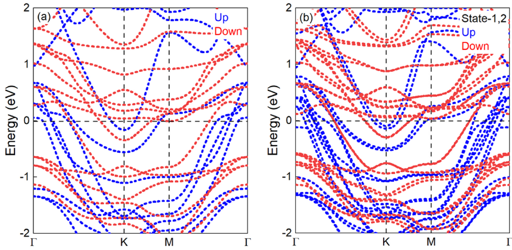
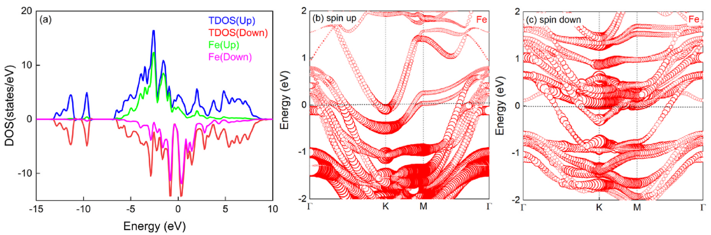

## miaoMagneticFerroelectricMetal2024 — 层间滑动作用下双层Fe3GeTe2中的磁性铁电金属

## 📄 元数据
Xiaoyan Miao, Milorad Milošević, Chunmei Zhang，2024，Physica B: Condensed Matter 694, 416427，DOI [10.1016/j.physb.2024.416427](https://doi.org/10.1016/j.physb.2024.416427)
## 💡 一句话
基于第一性原理计算预测双层 Fe₃GeTe₂ 通过 (±1/3, ±1/3) 层间滑移可同时拥有可翻转的垂直铁电极化、巡游铁磁性和金属导电性，构成罕见的磁性铁电金属相，且中等双轴压缩应变即可反转极化方向。
## 🔗 Wiki 双链
  - 概念 [[../concepts/multiferroicity]]、[[../concepts/magnetoelectric-coupling]]、[[../concepts/sliding-ferroelectricity]]、[[../concepts/strain-engineering]]、[[../concepts/2d-materials]]、[[../concepts/polarization-switching]]、[[../concepts/density-functional-theory]]、[[../concepts/ferroelectric-metal|铁电金属]]、[[../concepts/interlayer-charge-transfer|层间电荷转移]]、[[../concepts/itinerant-ferromagnetism|巡游铁磁性]]、[[../concepts/magnetic-polar-metal|磁性极性金属]]
  - 实体 [[../entities/Fe3GeTe2]]、[[../entities/VASP]]、[[../entities/WTe2]]、[[../entities/In2Se3]]、[[../entities/h-BN]]、[[../entities/TMDs]]
  - 图表 [[../figures/crystal-structures]]、[[../figures/electronic-bands]]、[[../figures/heterostructures-stacking|多铁与磁电异质结]]
  - 年度 [[../write/2020-2024|2024]]
  - 项目 [[../projects/project-2-mn-multiferroics]]、[[../projects/project-5-snte-ferroelectric-sim]]
  - 相关论文 [[../../raw/note/miaoMagneticFerroelectricMetal2024]]
## 📊 关键图表
  -  → [[../figures/heterostructures-stacking|异质结与堆叠]]
  - **图示描述**：(a–c) 为双层 FGT 的三种堆垛侧视图——AA 对齐的非极性中间态 IM、顶层相对底层滑移 (1/3, 1/3) 的 State-1 (P↑)、滑移 (−1/3, −1/3) 的 State-2 (P↓)，橙色箭头标极化方向、Fe 上的红箭头标自旋方向；(d) 为垂直极化随层间滑移方向与距离变化的二维等高线图，黑色虚线标出 P↑↔P↓ 最低能量翻转路径；(e) 为沿该路径的 NEB 能量曲线。
  - **关键特征**：State-1 与 State-2 极化大小相等、方向相反，约 ±8.3×10⁻⁴ eÅ/unit cell；Bader 电荷分析显示两层间有 ~0.03 e 的未补偿垂直电荷转移，是极化的微观起源；CI-NEB 给出的翻转势垒约 13 meV/unit cell，低于 In₂Se₃ (~60 meV/unit cell) 而高于 WTe₂ (~0.6 meV/unit cell)，因只需克服弱层间 vdW 作用，室温下可翻转。
  - **结论/意义**：该图一次性给出了滑移铁电的结构、极化景观和可翻转性证据，是全文"磁性铁电金属"论断的核心支撑。
  -  → [[../figures/electronic-bands-dos-fermi|态密度与费米面]]
  - **图示描述**：自旋极化能带对比图，(a) 为 FGT 单层，(b) 为 State-1/State-2 双层，红/蓝分别代表自旋向上/向下通道，横轴为高对称 k 点路径、纵轴为能量（费米能级置零）。
  - **关键特征**：单层与双层均有自旋向上、向下能带明显不对称且多条能带穿过费米能级，证实体系保持巡游铁磁金属性；双层相对单层出现更多子带且 State-1 与 State-2 的能带形状有可辨差异，原因是层间滑移打破了 Mz 垂直镜面对称，使顶、底层不再等价。
  - **结论/意义**：说明滑移在诱导极化的同时并未打开带隙或破坏磁极化，是"铁电+铁磁+金属"三性共存的电子结构证据。
  -  → [[../figures/electronic-bands-dos-fermi|态密度与费米面]]
  - **图示描述**：(a) 为 State-1 双层 FGT 的 Fe 3d 轨道投影态密度，横轴为相对于费米能级 (0 eV) 的能量；(b, c) 分别为 State-1、State-2 的自旋分辨 Fe-d 轨道投影能带，颜色深浅表示该 k 点上 Fe-d 轨道权重。
  - **关键特征**：费米能级附近的态密度和能带主要由 Fe 3d 轨道贡献，且自旋向上/向下通道显著不对称；费米面穿越的 Fe-d 权重高，说明导电电子被限制在二维面内运动，与沿面外方向的层间电荷转移偶极在空间上解耦。
  - **结论/意义**：从轨道层面解释了为何自由电子不屏蔽垂直极化——导电通道面内化、极化面外化，类比 WTe₂ 双层的滑移铁电机制。
  -  → [[../figures/crystal-structures-bulk|体相晶体结构]]
  - **图示描述**：(a, b) 分别为 State-1 和 State-2 的面外极化值随双轴面内压缩应变 ε（横轴从 0 到约 −4%）变化的柱状/折线图，纵轴单位为 eÅ/unit cell。
  - **关键特征**：零应变时 State-1 为 P↑、State-2 为 P↓；约 −1% 压缩应变即令两者极化方向同时反转；随应变量级增大，极化绝对值单调上升，State-1 在 ε = −1%, −2%, −3%, −4% 时分别约 −1.3×10⁻⁴、−1.8×10⁻⁴、−3.6×10⁻⁴、−3.1×10⁻³ eÅ/unit cell；机制是应变让层内 FeII 与 Ge 原子偏离 z 方向镜面位置、产生反向离子极化，当其超过电子极化贡献时总极化反转。
  - **结论/意义**：证明中等双轴压缩应变为该体系提供了除电场外的第二条极化翻转/调控路径，增强了器件可调性。
  -  -> [[../figures/heterostructures-stacking|异质结与堆叠]]
  - **图示描述**：以 (1/3, 1/3) 与 (−1/3, −1/3) 两种滑移（即 State-1、State-2）的能量为零点，列出 8 种代表性层间平移操作的体系相对能量（meV）。
  - **关键特征**：State-1 与 State-2 能量简并为 0 meV，是全局能量最低点；其余 (±1/3, 0)、(0, ±1/3)、(±1/3, ∓1/3) 等构型能量均高出约 19.6–21.4 meV/unit cell，热力学上明显不利；该能量排序与图 1(d) 的极化/能量景观相互印证，说明 IM 态会自发弛豫到 State-1 或 State-2。
  - **结论/意义**：从能量上锁定 State-1/State-2 为实验可实现的目标构型，是后续所有极化、磁性、应变分析选择这两个态的依据。
## 🔬 项目连接
  - **project-2（Mn多铁）— strong**：本文核心问题正是磁性与铁电极化在金属体系中的共存，直接提供"磁性铁电金属"这一多铁性新范式；其"垂直极化—面内导电解耦""层间电荷转移生极化""滑移不破坏 FM 基态"等机制，以及 FM/AFM 能量对比、U* 处理 Fe 3d 的流程，对 Mn 基多铁（尤其是金属/半金属多铁）的磁电共存机理分析有直接参考价值。
  - **project-5（SnTe铁电模拟）— medium**：方法学可直接复用——经典电动力学 ∫ρz dz 计算面外极化、CI-NEB 算翻转势垒、双轴应变调控极化方向、DFT-D3 描述层间相互作用、Bader 电荷分析追踪极化起源，均是 SnTe 铁电模拟中常用的计算组合；其"电子极化与离子极化竞争导致应变下极化反转"的分析框架也可迁移到 SnTe 应变工程讨论。材料本身（FGT vs SnTe）和维度不同，故定为 medium。
  - 其他项目（project-1/3/4/6/7）：无直接连接。
## 🔗 项目双链
- 项目 [[../projects/project-2-mn-multiferroics|项目二：Mn极化结构铁电材料]]
- 项目 [[../projects/project-5-snte-ferroelectric-sim|项目五：lammps势函数SnTe铁电模拟]]

## 📝 组织与用词
文章按"提出悖论（铁电vs金属vs磁三者互斥）→选材（二维vdW巡游铁磁金属FGT）→方法（DFT-D3+U*+NEB）→能量筛选最稳滑移态→逐项验证铁电/磁/金属三性→应变调控"的递进链组织；先用表1能量比较锁定 State-1/2，再用 Bader 电荷解释极化起源、FM/AFM 能量对比确认磁基态、能带/DOS 确认金属性，最后加应变旋钮，逻辑闭环完整。值得复用的术语：铁电金属（ferroelectric metal）、磁性极性金属（magnetic polar metal）、滑移铁电性（sliding ferroelectricity）、未补偿层间电荷转移（uncompensated interlayer charge transfer）、面内-面外解耦（in-plane/out-of-plane decoupling）、巡游铁磁性（itinerant ferromagnetism）、极化翻转势垒（polarization switching barrier）、双轴应变调控（biaxial strain engineering）。
## ✏️ 可写入 Wiki 的要点
  - 双层 FGT 通过相对滑移 (1/3,1/3) 和 (−1/3,−1/3) 得到两个能量简并的最稳态 State-1/State-2，分别具 P↑/P↓ 垂直极化，大小均为 ±8.3×10⁻⁴ eÅ/unit cell；其他滑移构型能量高 19.6–21.4 meV。
  - CI-NEB 计算的 P↑↔P↓ [[../concepts/switching-barrier|翻转势垒]]约 13 meV/unit cell，低于 In₂Se₃（~60 meV/unit cell）而高于 WTe₂（~0.6 meV/unit cell），因只需克服弱层间 vdW 相互作用，室温下可翻转。
  - 极化微观起源：Bader 电荷分析显示 State-1 中顶层与底层电荷得失约 0.03 e，未补偿的垂直[[../concepts/interlayer-charge-transfer|层间[[../concepts/charge-transfer|电荷转移]]]]形成面外偶极矩；State-2 电荷转移方向相反，极化随之翻转。
  - 磁基态：层内为 FM，层间 FM 构型比 AFM 能量更低；滑移不改变 FGT 的铁磁基态。双层相比块体层数减少使 Pauli 势降低，反而增强 FM 型层间交换耦合。Fe 3d 轨道通过[[../concepts/linear-response|线性响应]]法获取 U* 值进行在位库仑修正。
  - 金属性：费米能级附近[[../concepts/density-of-states|态密度]]和能带主要由 Fe 3d 轨道贡献；面内传导电子在垂直方向受限，与面外极化空间解耦（类比 WTe₂ 双层），故自由电子不屏蔽垂直偶极矩，使金属性与[[../concepts/ferroelectricity|铁电性]]共存。
  - 应变调控：约 −1% 双轴压缩应变即使 State-1/State-2 极化方向反转；机制是应变让层内 FeII 与 Ge 原子偏离 z 方向镜面位置、产生反向离子极化，当离子极化贡献超过[[../concepts/electronic-polarization|电子极化]]贡献时总极化反转。ε=−1%,−2%,−3%,−4% 时 State-1 极化约 −1.3,−1.8,−3.6×10⁻⁴ 和 −3.1×10⁻³ eÅ/unit cell，绝对值随应变增大。
  - 计算参数：VASP + PAW + GGA-PBE + DFT-D3，平面波截断 500 eV，Γ 中心 8×8×1 k 网格，真空层 ≥30 Å，力收敛 0.001 eV/Å、能量收敛 10⁻⁶ eV；极化由经典电动力学 ∫ρz dz 在整个超胞积分得到并加偶极校正。
  - 结构背景：FGT 单层为 P6₃/mmc 六方中心对称结构，五层原子次序 Te–Fe–(FeII,Ge)–Fe–Te，Fe 占两个不等价 Wyckoff 位（FeI, FeII）；块体 AB 堆叠具反演对称，AA 堆叠双层有 Mz 镜像但直接叠出的 IM 态不稳定，会自发滑移到 State-1/2。
