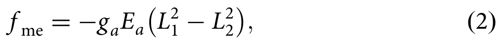
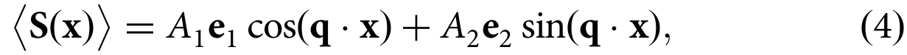
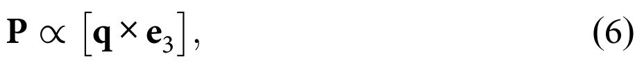
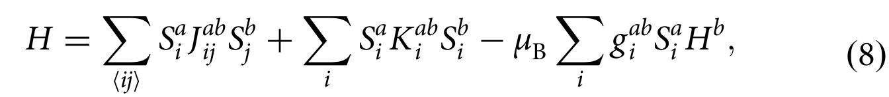
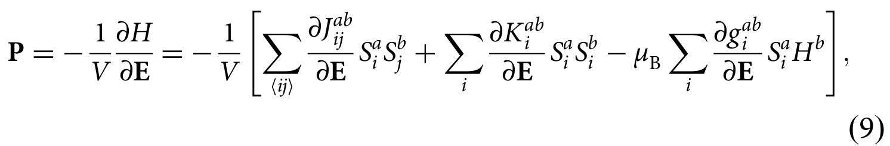
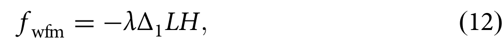

## mostovoyMultiferroicsDifferentRoutes2024 — 多铁性：通往磁电耦合的不同路径

## 📄 元数据
Maxim Mostovoy，2024，npj Spintronics 2, 18，DOI [10.1038/s44306-024-00021-8](https://doi.org/10.1038/s44306-024-00021-8)
## 💡 一句话
以理论家视角从对称性、磁阻挫和自旋哈密顿量三个层面统一梳理了第 I/II 类多铁性中磁电耦合的物理路径，并把复合畴壁、电磁振子、电控磁振子与斯格明子纳入同一框架。
## 🔗 Wiki 双链
  - 概念 [[../concepts/multiferroicity]]、[[../concepts/magnetoelectric-coupling]]、[[../concepts/spin-orbit-coupling]]、[[../concepts/topological-defects]]、[[../concepts/polarization-switching]]、[[../concepts/strain-engineering]]、[[../concepts/2D-materials]]、[[../concepts/ferroelasticity]]、[[../concepts/charge-density-wave]]、[[../concepts/berry-phase]]
  - 实体 [[../entities/BiFeO3]]、[[../entities/HoMnO3]]、[[../concepts/domain-wall]]、[[../entities/TMDs]]
  - 图表 [[../figures/mathematical-models]]、[[../figures/crystal-structures]]
  - 年度 [[../write/2020-2024]]
  - 项目 [[../projects/project-2-mn-multiferroics]]、[[../projects/project-4-ttf-molecular-calc]]、[[../projects/project-5-snte-ferroelectric-sim]]、[[../projects/project-7-cdw-charge-density-wave]]
  - 主题 [[多铁性材料]]
  - 相关论文 [[../../raw/note/mostovoyMultiferroicsDifferentRoutes2024]]
  - 实体 [[../entities/Ca3Mn2O7]]
  - 实体 [[../entities/hexaferrites]]
  - 实体 [[../entities/RMnO3-orthorhombic]]
  - 实体 [[../entities/Cu2OSeO3]]
  - 实体 [[../entities/TTF-BA]]

## 🆕 新概念/实体建议
  - [[../concepts/inverse-dzyaloshinskii-moriya]]（逆 Dzyaloshinskii–Moriya 相互作用）：非共线自旋 S_i×S_j 通过 SOC 驱动配体位移产生键偶极 d_ij ∝ r̂_ij × (S_i×S_j)，是螺旋磁体铁电性的核心机制。
  - [[../concepts/magnetic-frustration|magnetic-frustration]]（磁阻挫）：竞争交换或几何阻挫产生近简并磁构型流形，既稳定反演破缺磁序，又使磁态对外场极"软"，是巨磁电响应的关键。
  - [[../concepts/hybrid-improper-ferroelectricity|hybrid-improper-ferroelectricity]]（杂化非本征铁电性）：两个有限波矢晶格畸变（如氧八面体倾斜 Δ₁ 与旋转 Δ₂）的乘积 Δ₁Δ₂ 耦合到均匀电场产生极化，并可同时控制弱铁磁矩。
  - [[../concepts/exchange-striction|exchange-striction]]（交换伸缩）：海森堡交换常数对键长/电场敏感，d_ij ∝ (∂J/∂E)(S_i·S_j)，在共线非等价键上产生极化，强度可达 ∼1–2 μC/cm²，是所有机制中最强的。
  - [[../concepts/spin-spiral]]（螺旋磁性）：cycloidal/helical 自旋调制，cos(q·x) 偶、sin(q·x) 奇地混合宇称；P ∝ q×e₃（摆线型）或 P ∥ q（螺旋型，低对称晶体）。
  - [[../concepts/electromagnon|electromagnon]]（电磁振子）：被光电场分量激发的磁振子；非共线自旋中对称交换伸缩使 d_ij(t) ∝ ⟨S_i⟩·δS_j+δS_i·⟨S_j⟩ 非零，导致非互易定向二向色性。
  - [[../concepts/skyrmion|skyrmion]]（磁斯格明子）：拓扑保护的弦状自旋缺陷；多铁绝缘体中逆 DM 机制赋予其面外电偶极矩，电场可稳定/产生/驱动斯格明子并激发螺旋度模式。
  - [[../concepts/spin-peierls|spin-peierls]]（自旋-派尔斯有序）：准一维自旋链中二聚化与自旋单态形成，配合在位电荷交替可打破反演并诱导极化（TTF-BA 案例）。
  - [[../concepts/weak-ferromagnetism|weak-ferromagnetism]]（弱铁磁性）：DM 相互作用使反铁磁子晶格倾斜产生净磁矩 M = λΔ₁L，可被晶格/铁电序参量翻转。
  - 实体 [[../entities/Ca3Mn2O7|Ca3Mn2O7]]（双层钙钛矿杂化非本征铁电原型）、[[../entities/hexaferrites|hexaferrites]]（六角铁氧体，室温锥形螺旋巨磁电响应）、[[../entities/RMnO3-orthorhombic|RMnO3-orthorhombic]]（正交稀土锰氧化物，E 相 ↑↑↓↓ 与螺旋相）、[[../entities/Cu2OSeO3|Cu2OSeO3]]（手性立方莫特绝缘体，电控斯格明子原型）、[[../entities/TTF-BA|TTF-BA]]（有机电荷转移复合物，自旋-派尔斯诱导铁电体）。
## 📊 关键图表
原文为纯文本综述，raw/figures 下仅有公式渲染图（无 Fig.1 数据图），关键公式如下：
  - **式 (2) — E 相 ↑↑↓↓ 的磁电耦合自由能**
  - 
    - **图示描述**：正交 RMnO₃ 的 E 相 Mn 自旋有 ↑↑↓↓ 与 ↓↑↑↓ 两种等价态，由二维序参量 (L₁,L₂) 描述；该式给出电场 E_a 与 L₁²−L₂² 的耦合项。
    - **关键特征**：反演下 L₁↔L₂，因此 L₁²−L₂² 为反演奇函数而时间反演下为偶，允许磁电耦合；沿 a 轴诱导电极化 P_a = g_a(L₁²−L₂²)；属于非本征铁电体的典型形式；代表材料如 HoMnO₃ 等正交稀土锰氧化物。
    - **结论/意义**：说明共线多分量磁序也能打破反演并产生铁电极化，是第 II 类多铁中对称交换伸缩路径的唯象起点。
  - **式 (3) — 两个独立反宇称磁序的乘积耦合**
  -  -> [[../figures/mathematical-models-magnetoelectric|磁电耦合与多铁理论]]
    - **图示描述**：L₊ 与 L₋ 是分别在反演下为偶、奇的两个独立磁序参量，其乘积 L₊L₋ 同时为反演奇、时间反演偶，可与均匀电场线性耦合。
    - **关键特征**：两个磁序因破坏不同对称性而在不同温度出现；GdFeO₃ 中 Fe 序 T_Fe=661 K（不破反演、弱铁磁），Gd 序 T_Gd=2.5 K（破反演），后者出现后材料成为多铁；P_i = g_i L₊L₋。
    - **结论/意义**：这是稀土正铁氧体中电控磁翻转的对称性基础——电场翻转 L₊ 即可翻转与之成正比的弱铁磁矩。
  - **式 (4) — 螺旋磁序的自旋构型**
  -  -> [[../figures/electronic-bands-cdw-transport|CDW与输运性质]]
    - **图示描述**：自旋矢量沿波矢 q 方向在 e₁–e₂ 平面内周期旋转，cos(q·x) 项在空间反演下为偶、sin(q·x) 项为奇，自然混合宇称。
    - **关键特征**：低温下 A₁≈A₂≈S，所有格点有序自旋长度近似相等；e₃=e₁×e₂ 为螺旋面法向；摆线型（e₃⊥q）在任意对称性晶体中可诱导极化；螺旋型（e₃∥q）仅在低对称晶体中允许 P∥q。
    - **结论/意义**：螺旋序的内在宇称混合是逆 DM 机制产生宏观极化的几何前提，解释了螺旋多铁材料为何如此普遍。
  - **式 (5) — Lifshitz 不变量形式的逆 DM 磁电项**
  -  -> [[../figures/mathematical-models-magnetoelectric|磁电耦合与多铁理论]]
    - **图示描述**：自由能中电场 E_i 与磁化梯度组合 M_i ∂_j M_j（Lifshitz 不变量）耦合；两个轴矢量乘积 M_iM_j 在所有对称操作下与极矢量梯度组合变换方式相同。
    - **关键特征**：在中心对称磁体中 Lifshitz 不变量本身因反演变号而被禁戒，但与同样反演奇的电场耦合后成为允许项；对反铁磁体将 M 替换为 Néel 矢量 L 仍然成立（亚晶格符号对 L_iL_j 整体相同）。
    - **结论/意义**：这是逆 DM 机制的唯象表达，把螺旋调制的不均匀性直接转化为电极化来源。
  - **式 (6) — 螺旋诱导电极化方向 P ∝ q × e₃**
  -  -> [[../figures/domain-walls-switching-properties|极化翻转与铁电性能]]
    - **图示描述**：将式 (4) 螺旋构型代入式 (5) 后得到的宏观极化方向，由螺旋波矢 q 与螺旋面法向 e₃ 的叉乘决定。
    - **关键特征**：摆线型螺旋（e₃⊥q）给出垂直于 q 与 e₃ 的极化，适用于任何晶体对称性；DyMnO₃、TbMnO₃ 等螺旋反铁磁体中测得的螺旋诱导极化最大值约 0.3 μC/cm²；低对称晶体中螺旋型（e₃∥q）可由额外耦合给出 P∥q。
    - **结论/意义**：该式以极简形式锁定了螺旋手性与极化方向的对应关系，是螺旋多铁的标志性公式。
  - **式 (7) — CuFeO₂ 中低对称性额外磁电耦合**
  - 
    - **图示描述**：铜铁矿 CuFeO₂（空间群 R3̄m）除标准 Lifshitz 项外，允许含 M_z ∂_x M_y、M_z ∂_y M_x 等组合的附加耦合，用于描述螺旋型螺旋（e₃∥q）诱导的极化。
    - **关键特征**：q∥x（二重轴）时极化 P∥q；q∥y 时 P 仍平行二重轴且垂直于 q；MnI₂、CoI₂（P3̄m1）中磁场在 ab 面旋转时极化以两倍角速度反向旋转。
    - **结论/意义**：说明低对称三角晶格磁体可突破摆线型螺旋的限制，产生更丰富的波矢-极化几何关系，对二维范德华多铁（NiI₂、MnI₂）尤为关键。
  - **式 (8) — 通用自旋哈密顿量**
  -  -> [[../figures/mathematical-models-formulas|光学、输运与其他解析公式]]
    - **图示描述**：包含三项的微观自旋哈密顿量：最近邻交换 J_{ij}^{ab}、单离子各向异性 K_i^{ab}、以及 g 张量介导的塞曼相互作用。
    - **关键特征**：交换项含各向同性 Heisenberg 与反对称 DM 部分（D_{ij}^a = ½ ε_{abc} J_{ij}^{bc}）；耦合常数若对局域电场有线性依赖即可产生磁致电偶极。
    - **结论/意义**：是后续式 (9) 统一微观极化公式的出发点，把宏观磁电效应锚定在自旋-自旋耦合对电场的敏感度上。
  - **式 (9) — 磁致电极化的微观统一公式**
  -  -> [[../figures/mathematical-models-formulas|光学、输运与其他解析公式]]
    - **图示描述**：P = −(1/V)⟨∂H/∂E⟩，将磁有序态下的电极化分解为交换项、单离子各向异性项与 g 张量项三部分对电场的导数。
    - **关键特征**：对称交换伸缩 d_ij = (∂J_ij/∂E)(S_i·S_j) 来自 Heisenberg 交换，在共线非等价键上最强，YMnO₃ 薄膜与加压 TbMnO₃ 中达 P=1–2 μC/cm²；逆 DM 项 d_ij^a = (∂D_ij/∂E_a)[S_i×S_j] 来自 SOC；单离子/g 张量项在 Fe₂Mo₃O₈、LiFePO₄ 中贡献显著。
    - **结论/意义**：该式是整篇综述微观机制的核心，将第 II 类多铁所有极化来源统一在同一个热力学导数框架内。
  - **式 (10) — 逆 DM 微观键偶极**
  -  -> [[../figures/mathematical-models-magnetoelectric|磁电耦合与多铁理论]]
    - **图示描述**：单配体介导的 DM 矢量满足 D_ij ∝ r̂_ij×u，对电场一阶展开后得到键偶极 d_ij ∝ r̂_ij×[S_i×S_j]，其中 r̂_ij 为连接两磁位点方向的单位矢量。
    - **关键特征**：非共线自旋 S_i×S_j≠0 通过 SOC 驱动配体位移产生偶极；可等价表述为自旋流理论 P_a ∝ ε_{ab} j_i^b；螺旋态下 j_i^a ∝ q_i e₃^a，从而回到式 (6)。
    - **结论/意义**：给出逆 DM 机制从键尺度到宏观极化的完整推导链，是螺旋磁体铁电性的微观图像。
  - **式 (11) — 杂化非本征铁电的晶格序参量乘积耦合**
  -  -> [[../figures/crystal-structures-bulk|体相晶体结构]]
    - **图示描述**：双层钙钛矿 Ca₃Mn₂O₇ 中两个共存的周期晶格畸变（氧八面体倾斜 Δ₁ 与旋转 Δ₂，波矢 Q=(½,½,0)）的乘积与均匀电场耦合。
    - **关键特征**：Δ₁ 单独破反演但因波矢非零不能直接耦合均匀 E，必须通过 Δ₁Δ₂ 乘积；两个畸变的共同出现诱导宏观极化；是第 I 类多铁中将磁性与强极化绑定的关键路径。
    - **结论/意义**：为"用晶格畸变做中介耦合铁电与磁性"提供了对称性模板，启发了杂化非本征铁电材料的设计。
  - **式 (12) — 弱铁磁矩的晶格-磁耦合项**
  -  -> [[../figures/electronic-bands-cdw-transport|CDW与输运性质]]
    - **图示描述**：倾斜序参量 Δ₁、G 型反铁磁 Néel 矢量 L 与磁场 H 耦合，自由能项 f_wfm = λ Δ₁ L H。
    - **关键特征**：铁电态中金属-配体-金属键畸变改变 DM 相互作用使自旋倾斜，产生弱铁磁矩 M = λ Δ₁ L；外加电场翻转 Δ₁ 即同时翻转 P 与 M；Ca₃Mn₂O₇ 等材料主要受高电导率困扰而难以电翻转。
    - **结论/意义**：在第 I 类多铁中实现电控磁的核心机制，展示了晶格畸变作为电-磁双向开关的可行性。
  - **式 (13) — 动态磁电响应的 Onsager 倒易关系**
  -  -> [[../figures/mathematical-models-magnetoelectric|磁电耦合与多铁理论]]
    - **图示描述**：两个动态磁电张量 α^em（电极化对振荡磁场的响应）与 α^me（磁化对振荡电场的响应）通过 Onsager 关系互相约束，时间反演序参量 L 在转置时变号。
    - **关键特征**：ω 为光频，H 为静磁场；螺旋态中所有自旋经时间反演反转后可由沿 q 平移半个螺旋周期抵消，给出附加对称性。
    - **结论/意义**：是讨论电磁振子吸收与非互易定向二向色性的热力学基础，把静态磁电对称性推广到光学频段。
  - **式 (14) — 无场螺旋态的电磁张量自对偶**
  -  -> [[../figures/mathematical-models-magnetoelectric|磁电耦合与多铁理论]]
    - **图示描述**：在无外加磁场的非公度螺旋态中，式 (13) 中时间反演加半周期平移的组合对称性使 α^em_ij(ω) = α^me_ji(ω)。
    - **关键特征**：同时加电场与磁场光分量可产生非互易定向二向色性，强度 ∝ Im(α^em_ij + α^me_ji)；该二向色性需同时破反演与时间反演，在螺旋态中只有加外磁场才能观测到。
    - **结论/意义**：解释了为何电磁振子在零场下存在、但二向色性等非互易光学现象必须加磁场，为 THz/微波二极管效应提供对称性依据。
  - **式 (15) — 电磁振子的动态偶极替代规则**
  -  -> [[../figures/electronic-bands-cdw-transport|CDW与输运性质]]
    - **图示描述**：将式 (9) 中静态自旋乘积 S_i^a S_j^b 替换为平均自旋与振荡分量的交叉项 ⟨S_i^a⟩δS_j^b(t) + δS_i^a(t)⟨S_j^b⟩，描述以光频 ω 振荡的磁振子诱导的电偶极。
    - **关键特征**：因 δS_i(t)⊥⟨S_i⟩，对称交换伸缩机制仅在非共线自旋态下非零（共线时两内积抵消）；最低能电磁振子是螺旋面集体旋转（逆 DM）；更强峰来自光学磁振子通过对称交换伸缩振荡偶极；RMn₂O₅ 中其谱重经 Kramers–Kronig 导致螺旋转变处静态介电常数台阶式巨增；THz 脉冲可在 TbMnO₃ 中驱动螺旋面小角度旋转。
    - **结论/意义**：从微观上说明了电磁振子为何偏爱非共线磁体，并把磁振子谱、介电响应与光控自旋统一起来。
## 🔬 项目连接
  - **project-1 双光子**：无直接项目连接。文中讨论电磁振子的光电场激发与 THz 脉冲操控（TbMnO₃ 中螺旋面小角度旋转），但不涉及双光子吸收或非线性光学过程。
  - **project-2 Mn多铁（核心连接）**：本文是 Mn 基多铁物理图像的核心参考文献。(1) 正交 RMnO₃ 的 E 相 ↑↑↓↓（L₁、L₂ 二维表示）由对称交换伸缩产生 P ∥ a，TbMnO₃ 加压下测得 P = 1–2 μC/cm²；(2) 螺旋相（DyMnO₃、TbMnO₃）中逆 DM 给出 P ∝ q×e₃，DyMnO₃ 磁场下 P ∼ 0.3 μC/cm²；(3) 几何阻挫 RMn₂O₅ 中两条之字形反铁磁链 L₁·L₂ 耦合 E_b 产生 4 态极化滞后；(4) 双层钙钛矿 Ca₃Mn₂O₇ 是杂化非本征铁电原型，Δ₁Δ₂ 产生极化、Δ₁L 产生弱铁磁矩，电场翻转 Δ₁ 可同时翻转 P 与 M；(5) Sr₁₋ₓBaₓMnO₃ 通过应变/化学取代抑制竞争晶格失稳，使磁性 Mn 离子偏心位移产生与反铁磁强耦合的铁电性；(6) 六方 h-RMnO₃ 中三聚化（trimerization）诱导极化并伴随畴壁附近 Mn 自旋旋转与涡旋图案；(7) CaMn₇O₁₂ 铁轴螺旋磁体中 P ∼ 0.3 μC/cm²。这些机制、对称性判据与序参量乘积形式可直接用于 Mn 极化结构论文的物理讨论与第一性原理结果解释。
  - **project-3 机械发光NN**：无直接项目连接。
  - **project-4 TTF分子计算（直接但小众的连接）**：文中明确讨论有机电荷转移复合物 **TTF-BA**：自旋-派尔斯有序（自旋-1/2 链每隔一键形成自旋单态）与沿链在位电荷交替（供体/受体分子交替）共同打破反演对称性，从而诱导电极化。这是 TTF 家族中少有的多铁性实例，为 TTF 分子晶体的自旋-电荷-晶格耦合提供了物理图像：(a) 二聚化/单态形成可与电荷序协同破缺反演；(b) 分子位移 u 与电荷转移共同决定局域偶极；(c) 对 DeepMD/MACE 势训练提示需显式描述不同电荷态与二聚畸变下的势能面。可作为 TTF 体系极化与电荷局域化讨论的类比与参考文献。
  - **project-5 SnTe铁电模拟（方法/物理图像参考）**：SnTe 本身不在文中，但以下物理具有可迁移价值：(1) 复合畴壁动力学——电控磁/电控极化的器件操作本质是同时携带两种序的畴壁在电场下传播，文中以 GdFeO₃ 中 Fe-DW（复合壁，需动）与 R-DW（纯铁电壁，需钉扎）的速度竞赛说明如何用 Ising 型 Tb/Dy 替换各向同性 Gd 来选择可动壁；这一"选择性钉扎复合畴壁"思路对 SnTe 铁电畴壁翻转的势函数设计与缺陷工程有启发；(2) 杂化非本征铁电中"有限波矢畸变不能直接耦合均匀电场，但两个畸变的乘积可以"的对称性原理，可用于理解 SnTe 中可能的模耦合；(3) BiFeO₃ 中电极化、Néel 矢量与磁化通过两步畴翻转协同旋转的案例，是多序耦合翻转的范例；(4) 极化翻转受高电导率阻碍（Ca₃Mn₂O₇）的提示对铁电模拟中漏电流/载流子处理有参考意义。属于机制类比而非材料直接对应。
  - **project-6 湿度传感器**：无直接项目连接。
  - **project-7 CDW（中等强度的物理类比）**：(1) TTF-BA 中自旋-派尔斯二聚化本质上是一维 Peierls/CDW 型晶格失稳，与 CDW 共享"波矢 q 的周期调制打破反演→诱导极化"的对称性逻辑；(2) 文中对螺旋磁序 S(x)=e₁cos(q·x)+e₂sin(q·x) 的傅里叶分量宇称分析（cos 偶、sin 奇）与 CDW 中 cos(q·r)/sin(q·r) 分量的相位/手性分析方法一致；(3) 杂化非本征铁电中"周期晶格畸变（PLD）作为极化副产物"的图像与 CDW 中 PLD 伴随电荷调制高度相似，Δ₁Δ₂ 乘积耦合可类比 CDW 中多模耦合；(4) YBaCuFeO₅ 中 Cu/Fe 化学无序通过杂质键周围自旋结构形变的长程相互作用把螺旋（非公度调制）稳定区扩展到 ∼400 K，这对理解无序/缺陷如何稳定 CDW 调制态有方法论启发；(5) 逆 DM 与对称交换伸缩把调制波矢 q 与宏观极化方向绑定（P ∝ q×e₃），可为 CDW 材料中电极化/铁电与 CDW 耦合（如 1T'-TMD 中 FM-CDW）提供对称性判据参考。但文中不直接讨论 TMD CDW 或费米面嵌套，属于跨体系机制借鉴。
## 🔗 项目双链
- 项目 [[../projects/project-2-mn-multiferroics|项目二：Mn极化结构铁电材料]]
- 项目 [[../projects/project-4-ttf-molecular-calc|项目四：lsl老师的ttf分子计算]]
- 项目 [[../projects/project-5-snte-ferroelectric-sim|项目五：lammps势函数SnTe铁电模拟]]
- 项目 [[../projects/project-7-cdw-charge-density-wave|项目七：CDW电荷密度波]]

## 📝 组织与用词
文章按"对称性原理 → 磁阻挫 → 微观机制 → 第 I 类多铁 → 畴壁 → 电磁振子 → 磁振子控制 → 斯格明子控制 → 总结"的递进逻辑展开，每一节都以自由能唯象项切入，再落到具体材料与实验数值，形成"宏观法则—微观构件—材料实现—器件/拓扑前沿"的闭环。关键术语：
  - 磁电耦合 / magnetoelectric coupling
  - 逆 DM 相互作用 / inverse Dzyaloshinskii–Moriya interaction
  - 对称交换伸缩 / symmetric exchange striction
  - 磁阻挫 [[../concepts/magnetic-frustration|磁阻挫]] / magnetic frustration
  - 杂化非本征铁电性 [[../concepts/hybrid-improper-ferroelectricity|杂化非本征铁电性]] / hybrid improper ferroelectricity
  - 螺旋磁序 [[../concepts/spin-spiral]]（摆线型/螺旋型）/ spiral magnetic order (cycloidal / helical)
  - 复合畴壁 / composite (ferroelectric–ferromagnetic) domain wall
  - 电磁振子 [[../concepts/electromagnon|电磁振子]] / electromagnon
  - 斯格明子螺旋度 / skyrmion helicity
  - Lifshitz 不变量 / Lifshitz invariant
## ✏️ 可写入 Wiki 的要点
  1. [[../concepts/multiferroicity|多铁性]]同时打破空间反演 I 与时间反演 T。线性磁电效应（LME）要求磁[[../concepts/order-parameter|序参量]] L 同时是 I、T 的奇函数且平移不变（q=0），自由能项 f_me = g_ij L_i E_i H_j，给出 P_i = α_ij H_j、M_i = α_ji E_j（Cr₂O₃ 为代表）。
  2. 第 II 类多铁（磁致铁电）要求多分量磁序或多个独立磁序：E 相 ↑↑↓↓ 用二维表示 (L₁,L₂)，耦合 f_me = g_a E_a(L₁²−L₂²)；两个独立反宇称磁序 L₊L₋ 给出 P_i = g_i L₊L₋（GdFeO₃ 中 Fe 序 661 K、Gd 序 2.5 K）。
  3. [[../concepts/spin-spiral]] S(x)=A₁e₁cos(q·x)+A₂e₂sin(q·x) 中 cos 项偶、sin 项奇，自然混合宇称；逆 DM 机制（Lifshitz 不变量 M_i∂_jM_j 耦合 E）给出 P ∝ q×e₃。摆线型螺旋（e₃⊥q）可在任意对称性晶体中诱导极化，解释了螺旋多铁的普遍性；低对称晶体中螺旋型（e₃∥q）也可诱导 P ∥ q（CuFeO₂、MnI₂）。
  4. 微观统一公式 P = −(1/V)⟨∂H/∂E⟩ 把磁致电偶极分解为三部分：(a) 对称[[../concepts/exchange-striction|交换伸缩]] d_ij = (∂J/∂E)(S_i·S_j)，源于海森堡交换（最强），共线 E 相中可达 1–2 μC/cm²（YMnO₃ 薄膜、加压 TbMnO₃）；(b) 逆 DM d_ij ∝ r̂_ij×(S_i×S_j)，源于 SOC，螺旋磁体中主导，最大约 0.3 μC/cm²（DyMnO₃、CaMn₇O₁₂）；(c) 单离子[[../concepts/migdal-eliashberg-theory|各向异性]]/g 张量机制 d_i ∝ (∂K/∂E)⟨S_i²⟩，在 Fe₂Mo₃O₈、LiFePO₄ 中贡献大。
  5. [[../concepts/magnetic-frustration|磁阻挫]]有双重作用：既稳定反演破缺的螺旋/↑↑↓↓/之字形磁序，又产生近简并低能磁构型流形使磁态极"软"。Y 型六角铁氧体锥形螺旋态仅需 ∼200 Oe 即可旋转 M∥e₃ 与 P，产生创纪录磁电响应并实现电压控磁；YBaCuFeO₅ 中 Cu/Fe 无序把螺旋态稳定到 ∼400 K。
  6. 第 I 类多铁突破"d⁰ vs 未满 d"互斥的途径：(a) 应变/化学取代抑制竞争失稳使磁性 Mn 离子偏心位移（Sr₁₋ₓBaₓMnO₃）；(b) 磁性与非磁性过渡金属共存（BiFeO₃，P ∼ 100 μC/cm²）；(c) 非本征铁电（h-RMnO₃ [[../concepts/trimerization|三聚化]]）；(d) [[../concepts/hybrid-improper-ferroelectricity|杂化非本征铁电]]（Ca₃Mn₂O₇）：f_int = gΔ₁Δ₂E 产生极化，f_wfm = λΔ₁LH 产生弱铁磁矩 M = λΔ₁L，电场翻转 Δ₁ 可同时翻转 P 与 M。挑战是这些材料电导率偏高导致难以电翻转。
  7. 电控磁的器件关键是复合畴壁动力学。稀土正铁氧体中存在 Fe-DW（L₊ 变号，既是铁电壁又是铁磁壁）与 R-DW（L₋ 变号，纯铁电壁）；只有 Fe-DW 动而 R-DW 被钉扎时才能电控磁. GdFeO₃ 中各向同性 Gd 使 R-DW 能量低、反而易动，用 Ising 型 Tb/Dy 混合替换 Gd 后减慢 R-DW，实现电控磁翻转。 BiFeO₃ 则通过特殊两步畴翻转使沉积铁磁层的磁化被电反转。
  8. [[../concepts/electromagnon|电磁振子]]是被光电场激发的磁振子，首见于 GdMnO₃/TbMnO₃ 螺旋态。Onsager 关系 α^em_ij(ω,L,H) = α^me_ji(ω,-L,H)；非公度螺旋态在无磁场下 α^em = α^me。电+磁分量同时激发可产生[[../concepts/nonreciprocal-directional-dichroism|非互易定向二向色性]] ∝ Im(α^em_ij + α^me_ji)。最低能电磁振子是螺旋面集体旋转（逆 DM），更强峰来自光学磁振子通过对称交换伸缩振荡偶极；后者要求非共线自旋（共线时 ⟨S_i⟩·δS_j + δS_i·⟨S_j⟩ = 0）。RMn₂O₅ 中电磁振子谱重通过 Kramers–Kronig 导致螺旋转变处静态介电常数台阶式巨增。THz 脉冲可在 TbMnO₃ 中驱动螺旋面小角度旋转。
  9. 电控磁振子：BiFeO₃ 反铁磁螺旋态中磁振子频率随电场移动；Fe 离子各向异性强电场依赖使频率可调达 30%；SmFe₃(BO₃)₄ 中电场改变六种 Néel 取向态的相对权重；Cr₂O₃ 薄膜在[[../concepts/spin-flop|自旋翻转]]附近用电压控制 Néel 方向可开关自旋塞贝克信号。
  10. [[../concepts/skyrmion|斯格明子]]控制：Cu₂OSeO₃（手性立方[[../concepts/mott-insulator|莫特绝缘体]]）中逆 DM 机制使斯格明子晶格携带电极化，沿 P 加电场使斯格明子晶格相比锥形螺旋态更稳定并产生大角度晶格旋转；电场脉冲可产生斯格明子。中心对称阻挫磁体中螺旋度是低能集体模式，振荡电场可激发螺旋度进动、斯格明子相对旋转及斯格明子-反斯格明子对的单向运动；SrFeO₃ 中观测到三维磁性刺猬-反刺猬晶格。注意 Cu₂OSeO₃ 的压电性使磁电效应与应变介导效应难以区分。
