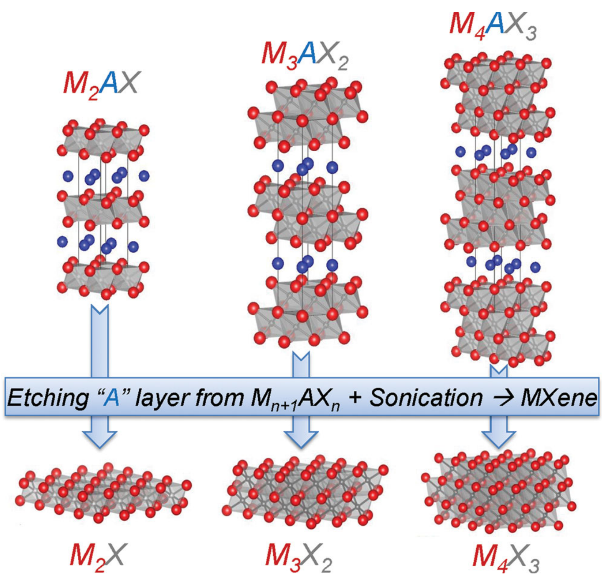
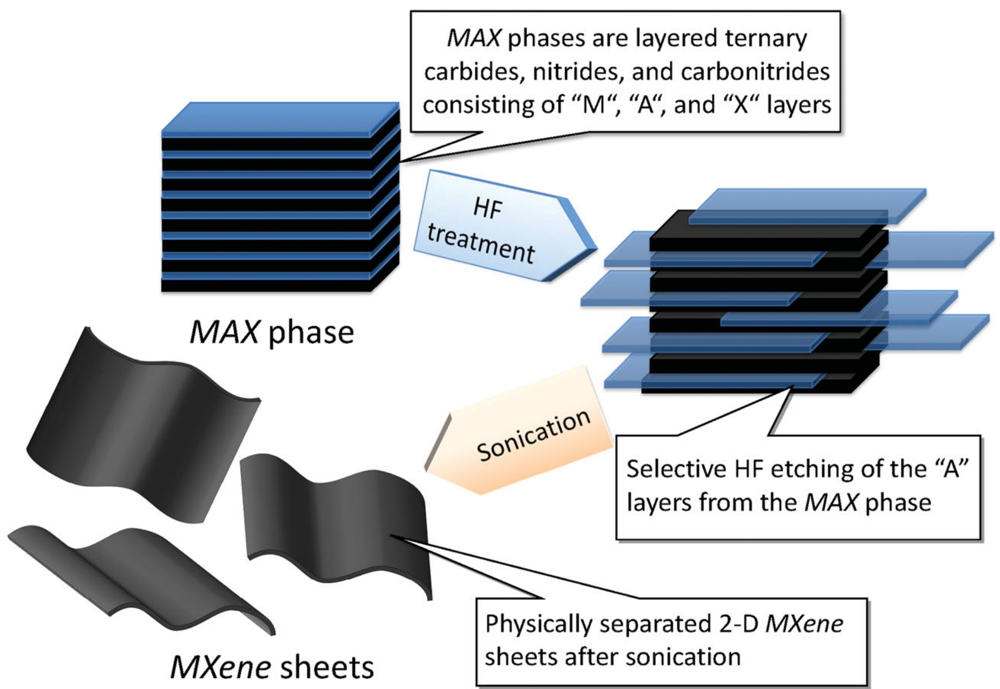
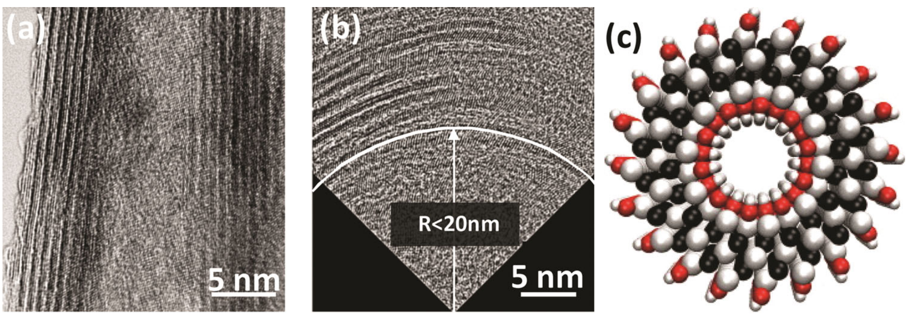
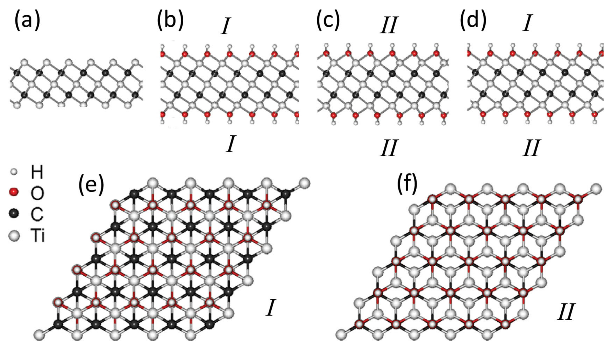
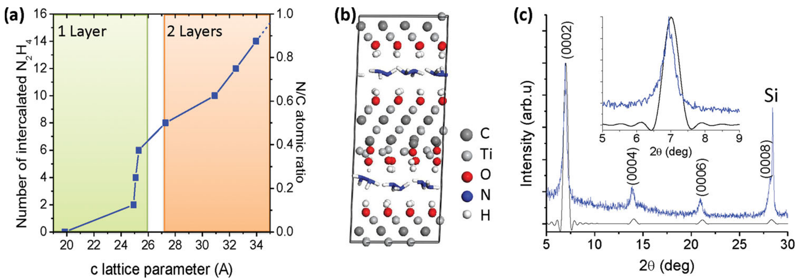
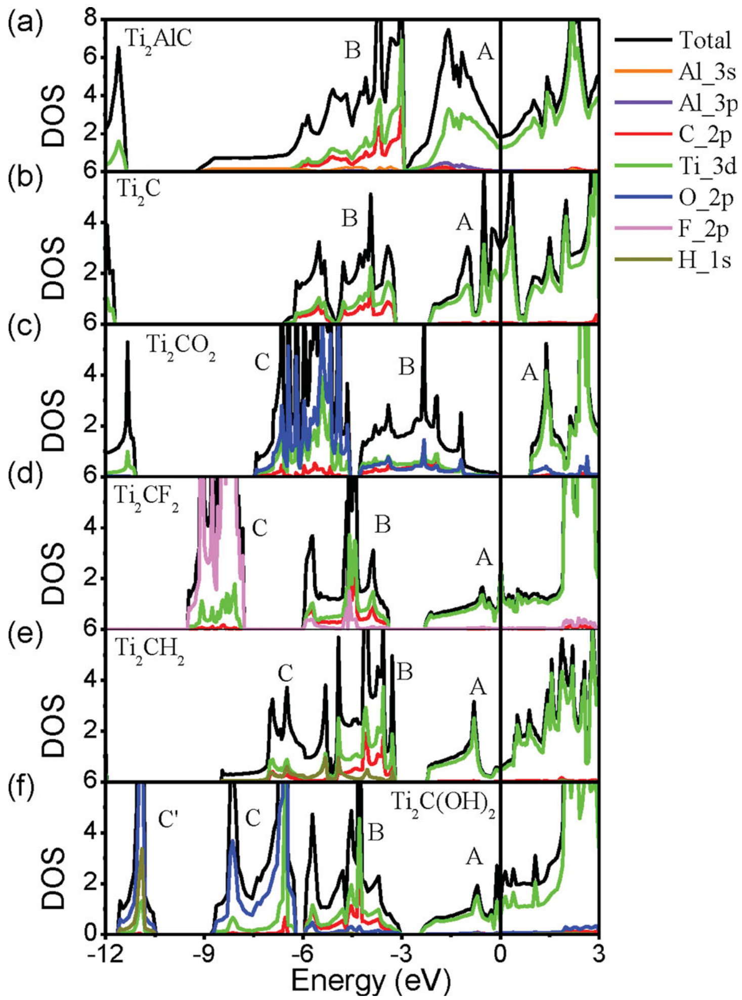
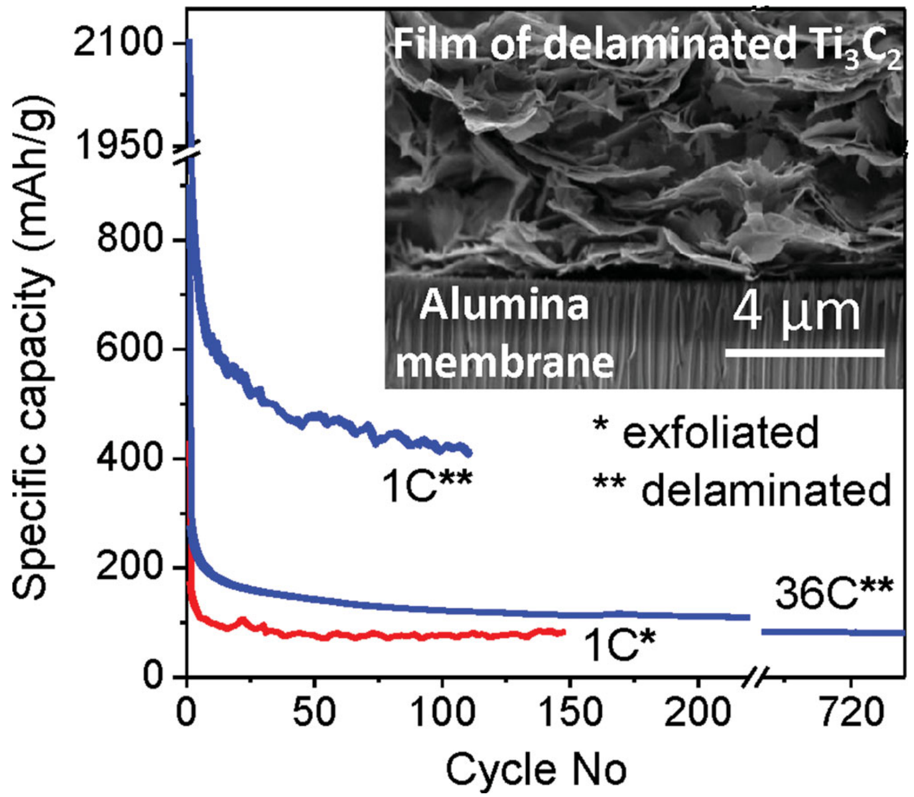
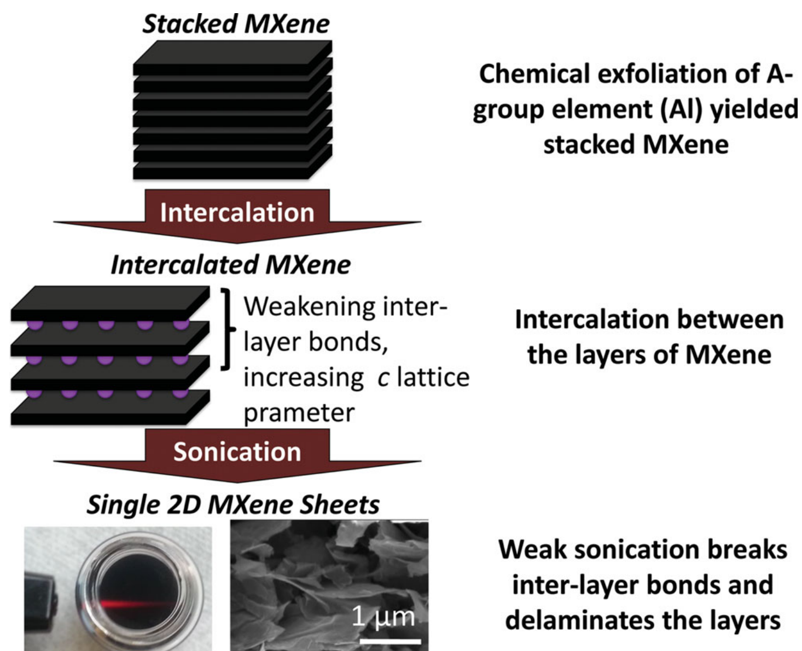
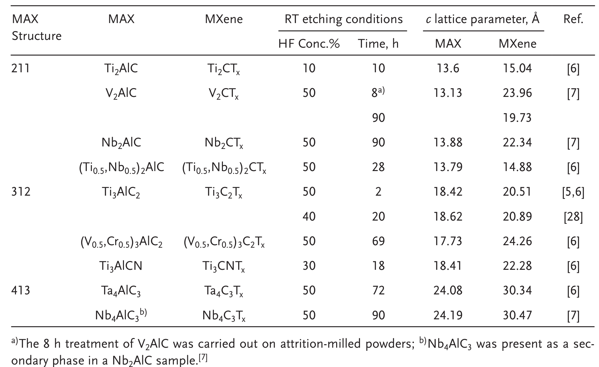
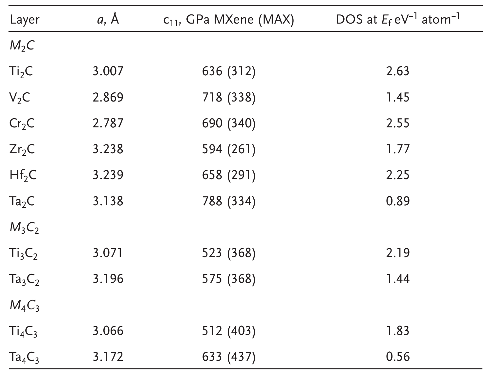

## naguib25thAnniversaryArticle2013a — 25周年文章：MXenes：一个新兴的二维材料家族

## 📄 元数据
Michael Naguib, Vadym N. Mochalin, Michel W. Barsoum, Yury Gogotsi et al.，2014（Adv. Mater. 2014, 26, 992–1005；在线 2013），Advanced Materials，DOI: 10.1002/adma.201304138

## 💡 一句话
本文系统宣告并综述了通过室温 HF 水溶液从 MAX 相中选择性刻蚀 A 层（主要是 Al）而制备出的全新二维过渡金属碳化物/碳氮化物家族——MXenes，并将其确立为兼具金属导电性与亲水性的"导电粘土"。

## 🔗 Wiki 双链
  - 概念 [[../concepts/2d-materials]]
  - 概念 [[../concepts/density-functional-theory]]
  - 实体 [[../entities/MXenes]]
  - 实体 [[../entities/TMDs]]（文中作为对比的层状材料被反复提及）
  - 图表 [[../figures/crystal-structures]]（MAX/MXene 原子结构、表面官能团三种构型）
  - 图表 [[../figures/electronic-bands]]（DOS/PDOS、金属-半导体转变、带隙预测）
  - 图表 [[../figures/experimental-setups]]（HF 刻蚀—洗涤—插层—超声分层的合成流程）
  - 图表 [[../figures/heterostructures-stacking|铁弹畴、畴壁、In₂Se₃ 与器件应用 (Domains, Domain Walls, In₂Se₃ & Devices)]]
  - 年度 [[../write/2010-2014|2013]]（DOI 年份 / 在线发表）
  - 年度 [[../write/2010-2014|2014]]（正式卷期）
  - 相关论文 [[../../raw/note/naguib25thAnniversaryArticle2013a]]
  - 实体 [[../entities/Ti3C2]]
  - 实体 [[../entities/Nb2CTx]]
  - 实体 [[../entities/Ti2CTx]]
  - 实体 [[../entities/V2CTx]]
  - 实体 [[../entities/Ta4C3Tx]]

## 🆕 新概念/实体建议
  - [[../entities/max-phases|max-phases]]（MAX 相）：通式 M_{n+1}AX_n 的六方层状三元碳化物/氮化物（P6₃/mmc），M 为早期过渡金属、A 主要为 IIIA/IVA 族元素、X 为 C/N，n=1–3；是 MXenes 的母体材料，文中列举 60 余种纯相及大量固溶体，应独立建条目。
  - [[../concepts/selective-etching|selective-etching]]（选择性刻蚀）：利用 M–A 金属键弱于 M–X 共价/金属/离子混合键的化学活性差异，用含水 HF 在室温下溶出 A 层而保留 M_{n+1}X_n 骨架的二维化合成范式；可作为普适合成概念条目。
  - [[../concepts/surface-termination]]（表面终端基团 Tₓ）：刻蚀后自发吸附在 MXene 表面的 O、OH、F（乃至 H、甲氧基）混合官能团，决定构型（I/II/III）、亲水性、电子结构（金属↔半导体）、磁性与储能性能，是 MXene 区别于"裸"金属碳化物片的核心。
  - [[../concepts/intercalation-delamination|intercalation-delamination]]（插层与分层）：以 DMSO、肼、无机盐阳离子等插入多层 MXene 层间、撑大 c 轴、再经温和超声获得单层/少层胶体溶液的关键工艺；可与二维材料制备方法学并列。
  - [[../concepts/conductive-clays|conductive-clays]]（导电粘土）：MXenes 兼具过渡金属碳化物的金属导电性与羟基/氧终端表面的亲水性，作者提出的标志性定位比喻。
  - 实体 [[../entities/Ti3C2|Ti3C2]]（Ti₃C₂Tₓ）：首个被发现、也是唯一被大规模分层的 MXene，LIB 纸电极 410 mAh g⁻¹@1C、超级电容器 >330 F cm⁻³，可作为 MXenes 条目下的典型代表或独立实体。
  - 实体 [[../entities/Ti2CTx|Ti2CTx]] / [[../entities/Nb2CTx|Nb2CTx]] / [[../entities/V2CTx|V2CTx]] / [[../entities/Ta4C3Tx|Ta4C3Tx]]：已合成的其他 MXene 成员，各自具有不同容量/电压窗口，可在 MXenes 条目中以列表呈现，暂不必单独建文件。

## 📊 关键图表
  - **图1**：MAX 相及其对应 MXene 的原子结构对比
  -  -> [[../figures/crystal-structures-bulk|体相晶体结构]]
  - **图示描述**：左侧为六方层状 MAX 相（P6₃/mmc，以 Ti₃AlC₂ 为代表），M（早期过渡金属）与 X（C/N）构成的 Mn+1Xn 八面体层被 A 层（主要为 Al）"胶合"交替堆叠；右侧为刻蚀掉 A 层、表面被 O/OH/F 等 T 基团封端后的二维 MXene 片层（Ti₃C₂Tₓ）。
  - **关键特征**：① M–X 层内为共价/金属/离子混合强键，M–A 为较弱金属键，这一键性差异是选择性刻蚀可行的结构根源；② 移除 A 层后 Mn+1Xn 骨架的面内原子排列完整保留，呈现"拓扑化学转化"而非非晶化；③ M₂X、M₃X₂、M₄X₃ 单层分别由 3、5、7 个原子层构成，厚度均 <1 nm；④ 该图定义了全文从 3D MAX 到 2D MXene 的结构叙事起点。
  - **图2**：从 MAX 相粉末经 HF 刻蚀、洗涤到手风琴状多层 MXene 的合成流程
  -  -> [[../figures/heterostructures-stacking|异质结与堆叠]]
  - **图示描述**：流程示意——MAX 相粉末在室温 HF 水溶液中搅拌，A 层被选择性溶出并由 O/OH/F 终端取代，再经离心/过滤、去离子水洗涤至 pH≈4–6，最终得到松散堆叠、形似手风琴的多层 MXene 颗粒。
  - **关键特征**：① HF 浓度与时间必须按材料精细调控（如 Ti₂AlC 用 10% HF/10 h，Ta₄AlC₃ 需 50% HF/72 h），过浓或过久会过度刻蚀甚至完全溶解；② 洗涤目的在于去除 AlF₃ 等副产物并终止反应；③ 所得多层 MXene 层间已由氢键/范德华作用连接，为后续插层—分层奠定基础；④ 该流程确立了"从强化学键合 3D 前驱体化学刻蚀制备 2D 材料"的普适新范式。
  - **图3**：多种 MXene 的 SEM/XRD/TEM/HRTEM/SAED/光学显微形貌表征
  -  -> [[../figures/experimental-setups|实验装置与测量系统]]
  - **图示描述**：八面板子图组合：(a) Ti₃AlC₂ HF 处理后的 SEM；(b) Nb₂AlC 刻蚀前后 XRD；(c) Ta₄AlC₃ 长时间 HF 后的 TEM；(d,e) Ti₃C₂ 的低倍与截面 HRTEM；(f) OH 封端 Ti₃C₂ 原子模型；(g) (Ti₀.₅,Nb₀.₅)₂C 的 HRTEM 及 SAED 插图；(h) Ti₃CNTₓ 的光学透射显微图。
  - **关键特征**：① SEM 中颗粒呈典型"手风琴状"张开分层；② XRD 刻蚀后非 (000l) 峰消失，(000l) 峰宽化并向低 2θ 角偏移，定量表明 c 轴增大、长程有序减弱；③ Ta₄AlC₃ 长时间刻蚀出现孔洞，警示过度刻蚀；④ SAED 沿 [0001] 保持母体六方对称斑点，证实面内晶格遗传；⑤ Ti₃CNTₓ 薄片对可见光透明，证明已达少层厚度。
  - **图4**：Ti₃C₂Tₓ 纳米卷轴与 OH 封端 Ti₃C₂ 纳米管原子模型
  -  -> [[../figures/crystal-structures-bulk|体相晶体结构]]
  - **图示描述**：(a) 外径约 20 nm 的 Ti₃C₂Tₓ 纳米卷轴 TEM；(b) 卷轴截面 TEM，内径 <20 nm；(c) OH 封端 Ti₃C₂ 无缝纳米管的原子结构模型。
  - **关键特征**：① 超声处理可使分层 MXene 薄片像石墨烯一样自发卷曲成卷轴；② DFT 预测无缝 MXene 纳米管热力学稳定且保持金属性；③ 卷轴/管状形态为调控 MXene 的一维电子、力学与储质性质提供了新思路，是二维片之外的重要衍生结构。
  - **图5**：功能化 MXene 表面 T 基团的三种构型 I/II/III（侧视与顶视）
  -  -> [[../figures/electronic-bands-band-structures|能带结构与带隙]]
  - **图示描述**：以 Ti₃C₂(OH)₂ 为代表，给出裸 Ti₃C₂ 及三种表面官能团构型的侧视/顶视：构型 I 中 T 位于三个相邻 C 原子之间的空心位上方并正对 Ti(2)，构型 II 中 T 位于 C 原子正上方，构型 III 上下两侧分别为 I 与 II 的混合。
  - **关键特征**：① DFT 能量稳定性顺序为 I > III > II，F 和 OH 都倾向构型 I；② 构型 II 因 T 与底层 C 的空间位阻排斥最不稳定；③ T 的位置决定 M–T 键杂化方式，进而调控带隙、磁性与表面反应性；④ 该图是后续电子结构（图8）与表面化学讨论的结构基础。
  - **图6**：肼插层 OH–Ti₃C₂ 的分子动力学模拟——c 轴阶梯增大、单层排列、模拟与实验 XRD 吻合
  -  → [[../figures/crystal-structures-bulk|体相晶体结构]]
  - **图示描述**：(a) OH–Ti₃C₂ 的 c 晶格常数随插层 N₂H₄ 分子数（以 N/C 比表示）的变化曲线；(b) N/C≈0.375（4×2×1 超胞中 6 个 N₂H₄）时的 MD 快照；(c) 模拟（黑）与实验（蓝）XRD 图谱对比，插图为 (002) 峰区放大。
  - **关键特征**：① N/C≈0.4 时肼在层间形成平行于基面的完整单层，c 轴稳定在约 25–26 Å；② N/C 继续增大至约 0.875 时开始出现第二层但尚未完整，c 轴呈阶梯式增大；③ 模拟 XRD 的 (002) 峰位与实验吻合，验证了插层结构模型；④ 该图从原子尺度解释了插层致层间距增大的微观机制，为 DMSO 等大规模分层工艺提供理论支撑。
  - **图7（原文图7）**：Ti₃C₂Tₓ 经 DMSO 插层—水分层—丁达尔效应胶体—过滤成纸的全过程
  -  -> [[../figures/heterostructures-stacking|异质结与堆叠]]
  - **图示描述**：示意多层 Ti₃C₂Tₓ 经 DMSO 插层显著撑大层间距，再在去离子水中温和超声获得少层/单层 MXene 水相悬浮液；激光笔照射呈现丁达尔散射光路，证明胶体性质；过滤后得到柔性、无粘结剂的 MXene"纸"。
  - **关键特征**：① DMSO 插层 Δc 可达约 15.4 Å（环境水共插层），空气中放置 3 周后 c 轴可翻倍；② 水中温和超声约 6 h 即可大规模分层，无需表面活性剂；③ 丁达尔效应证实胶体稳定分散；④ 这是当时唯一能大规模分层的 MXene 体系（Ti₃C₂Tₓ），把材料从多层粉末推向可加工的二维胶体与自支撑膜。
  - **图8（原文图8）**：Ti₂AlC / Ti₂C / Ti₂CO₂ / Ti₂C(OH)₂ 的总态密度与分态密度对比
  -  -> [[../figures/electronic-bands-dos-fermi|态密度与费米面]]
  - **图示描述**：四个面板依次给出 Ti₂AlC、裸 Ti₂C、Ti₂CO₂、Ti₂C(OH)₂ 的总态密度（TDOS）与 Ti–3d、C–2p、O–2p 等分态密度（PDOS），费米能级 E_f 置零。
  - **关键特征**：① 移除 Al 后原 Ti–Al 悬挂键重排为离域 Ti–Ti 金属键，N(E_f) 显著升高，裸 MXene 比母体 MAX 相高约 1.9–4.8 倍；② O/OH 封端在 E_f 以下约 –5 至 0 eV 形成 Ti–T 键的新亚带，p–d 杂化耗尽 E_f 附近态密度，使金属性转向窄带隙半导体；③ 终端种类与构型共同决定带隙大小（如 Ti₂CO₂ 在 PBE 下约 0.24 eV、HSE06 下约 0.88 eV）；④ 该图是连接表面结构（图5）与导电/磁性/储能性质的电子结构"指纹"。
  - **图9（原文图9）**：多层 Ti₃C₂Tₓ 粉末电极与少层 MXene 纸电极在锂离子电池中的性能对比
  -  -> [[../figures/electronic-devices-memory-transistors|存储器与晶体管]]
  - **图示描述**：对比传统剥离多层 Ti₃C₂Tₓ 粉末膜电极（含添加剂）与 DMSO 分层少层 Ti₃C₂Tₓ 无添加剂"纸"电极作为锂离子电池负极的充放电曲线/倍率性能；插图为多孔阳极氧化铝膜上自支撑 MXene 纸的截面 SEM。
  - **关键特征**：① 分层纸电极在 1C 下可逆容量约 410 mAh g⁻¹，约为多层粉末电极的 4 倍；② DFT 预测裸 Ti₃C₂ 上 Li 扩散势垒仅约 0.07 eV，远低于石墨（≈0.3 eV）和锐钛矿 TiO₂（0.35–0.65 eV），解释高倍率来源；③ 36C 循环 700 次后仍有约 110 mAh g⁻¹；④ 少层结构增大活性面积、缩短离子路径并免去粘结剂/导电剂，直观证明"形貌工程"对储能性能的决定性作用；⑤ 所有 MXene 仍存在首圈不可逆容量问题。
  - **表1**：不同 MAX 相合成 MXene 的 HF 浓度、时间、c 晶格参数及产率
  -  -> [[../figures/crystal-structures-bulk|体相晶体结构]]
  - **图示描述**：汇总 Ti₂AlC、Ti₃AlC₂、Ti₃AlCN、Nb₂AlC、V₂AlC、Ta₄AlC₃、Nb₄AlC₃ 等 MAX 相合成对应 MXene 所需的 HF 浓度（约 10%–50%）、刻蚀时间（约 2–90 h）、刻蚀前后的 c 晶格参数及备注（如 V₂AlC 经研磨细化后由 90 h 缩至 8 h）。
  - **关键特征**：① 刻蚀条件随 M–Al 键能系统变化（Ti–Al 约 0.98 eV、Nb–Al 约 1.21 eV）；② n 越小越易被过度刻蚀（50% HF 会完全溶解 Ti₂AlC）；③ 刻蚀后 c 轴普遍增大，V₂CTₓ、Nb₂CTₓ 因层间水共插层 c 值异常大（约 23.96 Å、22.34 Å）；④ 该表是 MXene 合成条件"材料依赖性"的核心实验数据。
  - **表2**：多种裸 MXene 单层的面内弹性常数 c₁₁、a 晶格参数与费米能级 DOS（含对应 MAX 相 c₁₁ 对照）
  -  -> [[../figures/electronic-bands-dos-fermi|态密度与费米面]]
  - **图示描述**：第一性原理计算的多种裸 M₂X、M₃X₂、M₄X₃ MXene 单层的面内弹性常数 c₁₁、a 晶格常数、费米能级处 DOS N(E_f)，并在括号中列出对应 MAX 相的 c₁₁ 作为对照。
  - **关键特征**：① 移除 A 层后电子密度更集中于 M–X 层，裸 MXene 的 c₁₁ 普遍高于对应 MAX 相（如 Ti₂C 约 636 GPa）；② N(E_f) 数值为判断 Stoner 磁性不稳定性（I·N(E_f)>1，I≈0.9 eV）提供依据，预测 Cr₂C/Cr₂N/Ta₃C₂ 铁磁、Ti₃C₂/Ti₃N₂ 反铁磁；③ MXene 片至少 3 个原子层厚，弯曲刚度 ∝ t³ 因而显著高于石墨烯；④ 该表为 MXene 力学与磁电性质的理论预测提供系统数据。
  - 注：原文实际图序为图1–图9，文件名按提取工具的哈希命名；其中 fig_8/fig_9 文件分别对应原文图7与图8，fig_7 文件对应原文图9。

## 🔬 项目连接
无直接项目连接。本文是 MXenes/二维材料的开创性综述，不涉及 project-1 双光子、project-2 Mn 多铁、project-3 机械发光 NN、project-4 TTF 分子计算、project-5 SnTe 铁电模拟、project-6 湿度传感器、project-7 CDW 中的任何一个；但其中 DFT 电子结构方法、表面终端调控电子/磁性、二维异质结（MoS₂/Ti₂C）等思想可作为 wiki 二维材料方法论的背景参考。

## 🔗 项目双链

## 📝 组织与用词
  - 论证按"前驱体 MAX 相 → 选择性刻蚀合成 → 原子结构（DFT + XRD/TEM） → 插层与大规模分层 → 电子/磁/力学性质 → 储能等应用 → 总结与展望"的材料学经典链条递进，每一节都是"实验现象 + DFT/MD 理论解释"双轨并行，并以图表作为两轨之间的锚点。
  - 文章以"导电粘土（conductive clays）"作为贯穿全文的定位比喻，把金属导电性（来自过渡金属碳化物骨架）与亲水性（来自 O/OH 表面终端）这对看似矛盾的性质并置，以此区别于石墨烯（疏水）和 TMDs（半导体/范德华层状）。
  - 值得复用的关键词/术语（中英对照）：
    1. MXenes / 马克烯（M_{n+1}X_nTₓ）
    2. MAX phases / MAX 相（M_{n+1}AX_n）
    3. Selective etching / 选择性刻蚀
    4. Surface terminations (Tₓ) / 表面终端基团
    5. Intercalation & delamination / 插层与分层
    6. Multilayer (ML) vs few-layer (FL) MXenes / 多层与少层 MXene
    7. Accordion-like morphology / 手风琴状形貌
    8. Conductive clays / 导电粘土
    9. Topochemical transformation / 拓扑化学转化
    10. Configurations I, II, III / 官能团构型 I/II/III

## ✏️ 可写入 Wiki 的要点
  1. **合成范式**：[[../entities/MAX-phase]]（P6₃/mmc 六方层状，M_{n+1}AX_n，n=1–3）中 M–X 键为共价/金属/离子混合键而 M–A 键为较弱金属键；室温下用特定浓度含水 HF 搅拌即可选择性溶出 A（Al）层，Al 被 O/OH/F 终端取代，从而把三维层状固体转化为二维 M_{n+1}X_nTₓ 片；反应后须用去离子水洗至 pH 4–6。这是"从强化学键合 3D 前驱体化学刻蚀制备 2D 材料"的普适新范式，区别于[[../entities/graphene|石墨烯]]/TMDs 的机械/液相剥离。
  2. **已合成家族**：截至 2013 年已报道 Ti₃C₂、Ti₂C、Nb₂C、V₂C、(Ti₀.₅,Nb₀.₅)₂C、(V₀.₅,Cr₀.₅)₃C₂、Ti₃CN、Ta₄C₃ 及 Nb₄C₃；单层 M₂X、M₃X₂、M₄X₃ 分别由 3、5、7 个原子层构成，厚度均 <1 nm，横向尺寸可达数十微米。纯 Ti₂N、Ti₄N₃ 等氮化物 MXene 当时未能合成，原因是 Ti_{n+1}N_n [[../concepts/cohesive-energy|内聚能]]更低而由 Ti_{n+1}AlN_n 生成的[[../concepts/formation-energy|形成能]]更高。
  3. **刻蚀条件的材料依赖性**：Ti₂AlC 需 10% HF/10 h，Ta₄AlC₃ 需 50% HF/72 h，V₂AlC 经研磨细化后从 90 h 缩至 8 h；Ti–Al 键能约 0.98 eV，Nb–Al 约 1.21 eV，解释了二者刻蚀难度差异。50% HF 会把 Ti₂AlC 完全溶解，而 10% HF 才能得到 Ti₂C，说明 n 越小越易被过度刻蚀；长时间刻蚀会在 Ta₄C₃Tₓ 上形成孔洞缺陷。
  4. **XRD/SAED 判据**：完全转化后非 (000l) 峰消失，(000l) 峰宽化并向低角度偏移（c 轴增大）；样品需冷压至 450 MPa 以增强 (000l) 峰强度；EDS 测 A:M 比量化转化程度但会因残留 AlF₃ 等副产物而高估未反应 MAX 相。SAED 沿 [0001] 方向保持与母体 MAX 相同的六方对称斑点，证实 3D→2D 是[[../concepts/topochemical-reaction|拓扑化学]]转化而非非晶化；Ti₃C₂ 在 200 kV 电子束下比石墨烯更稳定。
  5. **表面官能团构型**：DFT 给出 Ti₃C₂T₂ 的三种构型——构型 I：T 位于三个相邻 C 原子之间的空心位上方、正对 Ti(2)；构型 II：T 位于 C 原子正上方；构型 III：上下两侧分别为 I 和 II。能量稳定性顺序 I > III > II，F 和 OH 都倾向 I，构型 II 因 T 与底层 C 的空间位阻排斥最不稳定；Ti₂CO₂ 在 –4 至 0 eV 氧[[../concepts/chemical-potential|化学势]]范围内热力学最稳定，声子谱无虚频。
  6. **电子结构与磁性**：移除 Al 后，原 Ti–Al 悬挂键重排为离域 Ti–Ti 金属键，使裸 MXene 在 E_f 附近的 DOS 比母体 MAX 相高 1.9–4.8 倍（Ti_{n+1}C_n 为 1.9–3.2 倍，Ti_{n+1}N_n 为 2.8–4.8 倍）；当 I·N(E_f)>1（I≈0.9 eV）时出现铁磁或反铁磁不稳定性（Cr₂C/Cr₂N/Ta₃C₂ 铁磁；Ti₃C₂/Ti₃N₂ 反铁磁），但 O/OH/F/H 封端会形成 p–d 键、耗尽 E_f 附近[[../concepts/density-of-states|态密度]]而使磁性消失（Cr₂C、Cr₂N 在封端后仍保持近室温磁矩，尚未被实验验证）。
  7. **带隙对终端与泛函的敏感性**：Ti₃C₂ 为金属；Ti₃C₂(OH)₂、Ti₃C₂F₂ 打开 <0.1 eV 小带隙（构型 I/III 为半导体，构型 II 仍为金属）；O 封端可给出更显著带隙——Sc₂CO₂ 1.8 eV、Hf₂CO₂ 1.0 eV、Sc₂CF₂ 1.03 eV、Zr₂CO₂ 0.88 eV、Ti₂CO₂ 在 PBE 下 0.24 eV 而 HSE06 下达 0.88 eV。同一构型在 PBE 下为[[../concepts/narrow-gap-semiconductor|窄带隙半导体]]，在 HSE06 下可能预测为金属，提示 wiki 叙述引用带隙数值时必须注明泛函。
  8. **插层与分层**：肼（N₂H₄）在 Ti₃C₂(OH)₂ 层间以平行基面取向排列，N/C≈0.4 时形成完整单层，c≈25–26 Å；DMSO 插层 Δc 高达 15.4 Å（环境水共插层），空气中放置 3 周后 c 轴翻倍，去离子水中温和超声 6 h 即可大规模分层，得到无表面活性剂的稳定胶体水溶液（丁达尔效应），过滤后成柔性、无添加剂 MXene 纸；迄今唯一被大规模分层的是 Ti₃C₂Tₓ。
  9. **导电性与亲水性**：冷压（~1 GPa）自支撑 MXene 圆片电阻率从 Ti₃C₂Tₓ 的 22 Ω □⁻¹ 到 Ti₂CTₓ 的 339 Ω □⁻¹，与[[../entities/graphene-tetralayer|多层石墨烯]]相当；水接触角 27°–41°，与氧封端碳表面相当，确证亲水性。插层有机物后电阻率上升 1–2 个数量级，提示可用于化学传感器。
  10. **力学与热电预测**：裸 M_{n+1}C_n 单层 c₁₁ 高于对应 MAX 相（移除 A 后电子密度更集中于 M–X 层），但 MXene 片至少 3 个原子层厚，弯曲刚度 ∝ t³ 因而显著高于石墨烯；DFT 还预测半导体 Ti₂CO₂、Sc₂C(OH)₂ 在约 100 K 下塞贝克系数 ≈1000 μV K⁻¹，可与 SrTiO₃ 的巨塞贝克系数相比。
  11. **储能性能**：DFT 预测裸 Ti₃C₂ 上 Li 扩散势垒仅 0.07 eV（远低于锐钛矿 TiO₂ 的 0.35–0.65 eV 和石墨的 ≈0.3 eV），理论容量 320 mAh g⁻¹；实验上非分层 V₂CTₓ 在 1C 下达 280 mAh g⁻¹、10C 下 125 mAh g⁻¹；DMSO 分层的 Ti₃C₂Tₓ 纸电极在 1C 下可逆容量 410 mAh g⁻¹（含粘结剂/碳添加剂流延膜的约 4 倍），36C 循环 700 次后仍有 110 mAh g⁻¹；Ti₃C₂Tₓ 纸在 KOH 中体积电容 >330 F cm⁻³，循环 >10 000 次；Ti₂CTₓ 用于锂电混合电容器负极时 930 W kg⁻¹ 下能量密度 30 Wh kg⁻¹、循环 1000 次。所有 MXene 均存在首圈不可逆容量问题，可能源于 SEI 形成或 Li 与表面基团的不可逆反应。
  12. **异质结与催化**：DFT 预测 Ti₂C 沉积在 MoS₂ 上会因界面强化学键使 MoS₂ 转为金属；Ti₂CF₂、Ti₂C(OH)₂ 与 MoS₂ 为物理吸附，保留 MoS₂ 半导体性并产生 n 型掺杂（[[../concepts/schottky-barrier|肖特基势垒]]分别为 0.85、0.26 eV）；Ti₂C 表面 O₂ 无能垒解离形成 Ti₂CO₂ 后即使 550 °C 也排斥进一步氧化、不生成 TiO₂，提示催化应用潜力；Pt/Ti₃C₂Tₓ 燃料电池催化剂 10 000 次循环后 Pt 电化学表面积损失 15.7%，远优于 Pt/C 的 40.8%。
  13. **作者明确列出的未来方向**：控制/修饰表面化学；建立 Mn+1XnTₓ 随 T、x 变化的精确结构；理解插层化合物结构与性质；测定不同环境下化学/热稳定性；实现 Ti₃C₂Tₓ 以外 MXene 的大规模分层；寻找比 HF 更安全的刻蚀剂；合成无官能团"裸"MXene；从 MAX 薄膜直接制备 MXene 薄膜以构建电子器件；系统表征单层 MXene 的电、磁、光、热、力学性质；拓展至[[../concepts/polymer-phase-separation|聚合物]]增强、催化、透明导体、传感器等应用；并亟需发展能描述范德华/氢键的 DFT 方法和适用于插层/复合体系的经典力场（类似 ClayFF、ReaxFF）。
