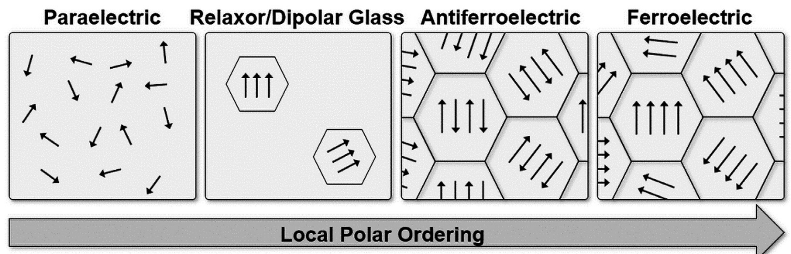
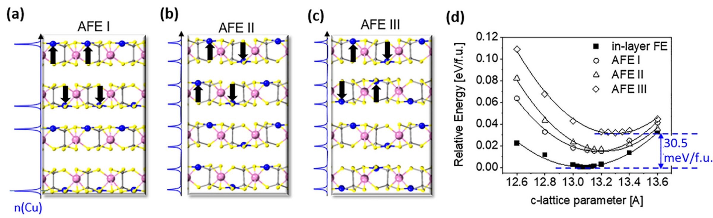
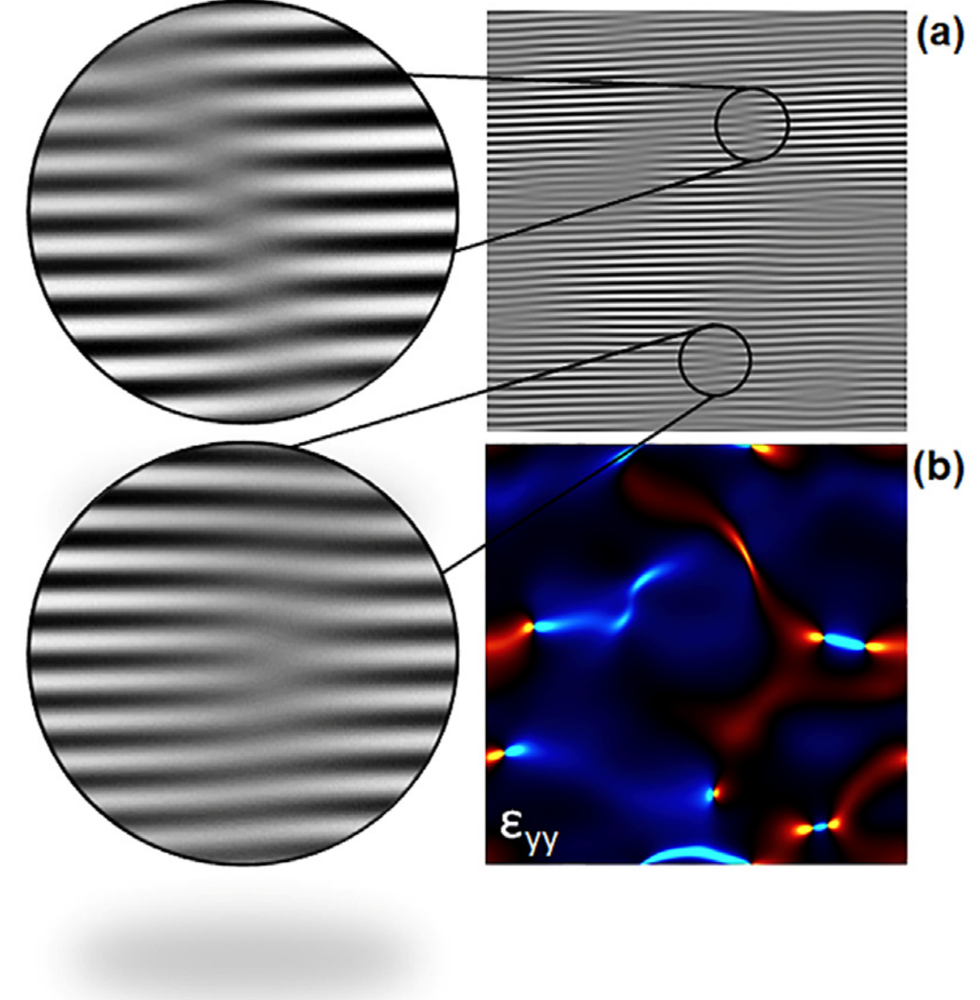

## neumayerCompetingPolarPhases2025 — 二维铁电过渡金属硫代和硒酸盐中的竞争极性相

## 📄 元数据
Sabine Neumayer, Huimin Qiao, Nina Balke et al.，2025，Applied Physics Letters 126, 120501，DOI: 10.1063/5.0253879

## 💡 一句话
系统综述了以 CuInP2S6（CIPS）和 CuInP2Se6（CIPSe）为代表的二维范德华过渡金属硫/硒磷酸盐（TMTPs）中，多种能量仅相差几十 meV/f.u. 的铁电（FE）、反铁电（AFE）和顺电（PE）相如何共存、竞争，并通过温度、电场、Cu 离子迁移和应变实现可逆相互转换。

## 🔗 Wiki 双链
  - 概念 [[../concepts/2D-materials]]
  - 概念 [[../concepts/polarization-switching]]
  - 概念 [[../concepts/strain-engineering]]
  - 概念 [[../concepts/density-functional-theory]]
  - 概念 [[../concepts/multiferroicity]]
  - 概念 [[../concepts/sliding-ferroelectricity]]（同为2D范德华铁电机制，可对照）
  - 概念 [[../concepts/ferroelectric-tunnel-junction]]（文中讨论2D FE在隧穿结中的应用）
  - 实体 [[../entities/TMDs]]（文中作为其他2D FE类别对比）
  - 实体 [[../entities/In2Se3]]（文中引用其面内/面外极化）
  - 实体 [[../entities/WTe2]]（文中提及WTe2异质结中的2D FE）
  - 实体 [[../entities/domain-wall]]（CIPSe中FE/AFE畴壁增强压电响应）
  - 实体 [[../entities/VASP]]（DFT计算工具背景）
  - 图表 [[../figures/crystal-structures]]（in-layer/in-gap FE及AFE结构图）
  - 图表 [[../figures/domain-walls]]（FE/AFE畴壁与PFM畴图）
  - 图表 [[../figures/vibrational-spectra]]（Raman光谱用于AFE相鉴定和压力依赖研究）
  - 图表 [[../figures/experimental-setups]]（PFM、STEM、P-E回线测量）
  - 图表 [[../figures/mathematical-models]]（Landau-Devonshire压力-温度相图）
  - 图表 [[../figures/electronic-devices]]（FeFET、隧道结、神经形态器件应用）
  - 图表 [[../figures/heterostructures-stacking-domains-devices|铁弹畴、畴壁、In₂Se₃ 与器件应用 (Domains, Domain Walls, In₂Se₃ & Devices)]]
  - 年度 [[../write/2025]]
  - 相关论文 [[../../raw/note/neumayerCompetingPolarPhases2025]]

## 🆕 新概念/实体建议
  - `cips-cu-in-p2s6`：CuInP2S6（CIPS）实体——明星TMTP材料，具有in-layer/in-gap两种FE相、负压电系数、Cu离子电导，是本文核心案例。
  - `cipse-cu-in-p2se6`：CuInP2Se6（CIPSe）实体——CIPS的硒代同构物，FE/AFE畴壁处压电响应增强，居里温度和相变行为与CIPS迥异。
  - `transition-metal-thio-selenophosphates`：TMTPs概念——通式MPX3（M=过渡金属，X=S/Se）的层状范德华材料家族，可同时容纳FE、AFE、铁磁性和高离子电导。
  - `competing-polar-phases`：竞争极性相概念——多种极性/非极性相能量差仅几十meV/f.u.，可通过外场可逆转换的统一框架。
  - `ionic-polar-coupling`：离子-极性耦合概念——Cu+离子在vdW间隙中长程迁移重构内建电场，导致极化逆外场翻转等非传统机制。
  - `antiferroelectricity`：反铁电性概念——交替偶极子净极化为零、电场下可转为FE态；wiki目前缺此基础概念条目。
  - `negative-piezoelectricity`：负压电性概念——CIPS等罕见材料中电场诱导反向应变，源于FE势阱高度非谐性，可用于零应变器件。
  - `in-gap-ferroelectric-phase`：间隙铁电相概念——Cu原子占据vdW间隙内稳定位置形成的高极化FE相（HP，P=11.3 μC/cm²）。
  - `ccps-cucrp2s6`：CuCrP2S6（CCPS）实体——多铁性TMTP，理论预测同时具有电极化和磁化及in-gap FE/AFE相，与project-2相关。
  - `ips-in43p2s6`：In4/3P2S6（IPS）实体——非极性介电相同源化合物，c轴较小，用于CIPS/IPS异质结构施加应变稳定亚稳相。
  - `pfm-piezoresponse-force-microscopy`：压电力显微镜实体/方法——本文核心局域表征工具，用于识别LP/HP/AFE相及翻转路径。

## 📊 关键图表
  - 
  - 
  -  → [[../figures/heterostructures-stacking-domains-devices|铁弹畴、畴壁、In₂Se₃ 与器件应用]]
  - 
  -  → [[../figures/heterostructures-stacking-domains-devices|铁弹畴、畴壁、In₂Se₃ 与器件应用]]
  - 注：图5（CIPS/CIPSe中FE-AFE转换PFM图）笔记未附图片文件。

## 🔬 项目连接
  - project-2 Mn多铁：本文理论预测部分明确讨论多铁性TMTPs（CCPS、CMPS、NCPS、NMPS）同时具有电极化和磁化，且预测了in-gap FE/AFE相，可直接丰富Mn多铁项目对2D多铁家族的视野。
  - project-5 SnTe铁电模拟：同属2D铁电材料主题，CIPS中离子-极性耦合、竞争极性相和应变工程的思路可为SnTe铁电模拟提供相竞争和多场调控的参照，但无直接数据连接。
  - 其余项目（双光子、机械发光NN、TTF分子计算、湿度传感器、CDW）无直接连接。

## 📝 组织与用词
文章采用典型Perspective"总-分-总"结构：（1）引言从传统铁电微型化困境→2D vdW FE→TMTPs独特性→提出"能量接近的竞争极性相"核心概念；（2）近期发展分两小节——A. CIPS中不同FE相（LP/HP）之间经温度/电场/离子电导的转换，B. CIPS与CIPSe中FE-AFE可逆转换及畴壁电子学；（3）展望围绕直接结构验证、缺陷工程、化学空间和异质结构展开。论证以DFT能量数据（meV/f.u.）为热力学基础、以PFM局域观测为实验证据、以宏观P-E回线为功能验证，形成"理论预测—局域证实—宏观调控"的证据链。值得复用的关键词：
  - 竞争极性相 / competing polar phases
  - 能量接近 / energetically close（几十 meV/f.u. 量级）
  - 层内/间隙铁电相 / in-layer vs in-gap FE phase（LP vs HP）
  - 离子-极性耦合 / ionic-polar coupling
  - 逆电场极化 / polarization against the electric field
  - 反铁电表面相 / AFE surface phase
  - 畴壁电子学 / domain-wall electronics
  - 超越二进制存储 / beyond-binary multi-state memory
  - 负压电系数 / negative piezoelectric coefficient
  - 几何相分析 / geometric phase analysis (GPA)

## ✏️ 可写入 Wiki 的要点
  1. CIPS中两种FE相的定量差异：in-layer（LP）相极化5.0 μC/cm²、压电系数−15.6 pm/V；in-gap（HP）相极化11.3 μC/cm²、压电系数+2.5 pm/V；二者DFT能量差仅21.6 meV/f.u.，平衡c轴参数略异，构成四态（±LP, ±HP）翻转基础。
  2. CIPS中FE相与三种AFE相（interlayer、intralayer I、intralayer II）最大能量差仅30.5 meV/f.u.，层间AFE能量最低；CIPSe中层内AFE最稳定；CCPS还预测Cu移入vdW间隙的AFE相。
  3. 温度路径：CIPS加热时60°C LP畴消失、65°C仅剩HP畴、70°C（居里温度）以上转为零压电响应的PE相；拉伸应变可降低居里温度，可作为额外调控旋钮。
  4. 电场诱导复杂翻转：PFM滞回线揭示+HP↔−LP、+LP↔−HP、+HP↔−HP、+LP↔−LP等多种路径，取决于样品位置和初始极化，远超传统二进制翻转。
  5. 离子-极性耦合机制：Cu+室温下可在vdW间隙中长程迁移，偏压PFM针尖或负DC脉冲（>200 ms）导致Cu在负电极积累、形成反向内建电场，使极化可逆外电场方向排列；更长/更强脉冲可使FE切换消失（Cu亚晶格完全无序形成PE态，或回线移出电压窗口），正DC电压后完全恢复。
  6. CIPS中FE-AFE转换证据：自发AFE表面相深达165 nm（其下为向上FE畴）；单极正三角DC电压网格写入非极性区，双极波形测得0 pm/V处台阶状"捏合"回线；5 VAC扫描使+LP畴转为AFE，零响应区持续深度6 nm；DFT证实AFE在+LP畴表面能量上更有利。
  7. CIPSe在200 K下FE/AFE共存，DC偏压可使FE畴长大；最独特的是FE/AFE畴壁处压电响应显著增强（CIPS及CIPS/IPS界面无此增强），构成畴壁电子学新功能单元。
  8. 界面效应：石墨烯和金属（Ni、Cu、Au、Ag）电极可改变AFE vs FE的临界厚度；Au/Ag因界面排列和应变使FE在双层极限稳定；电极还可稳定in-gap FE相；金电极使CIPS双层带隙中出现非零投影态密度，Cu耗尽层可变为金属性。
  9. 缺陷与应变：TEM已观察到CIPS中位错、扭结导致非均匀应变（GPA的eyy图）；Cu空位或过量Cu直接影响Cu跨vdW间隙的激活势垒；失去一半Cu时CIPS变为中心对称（Cu位于P2S6层中间）失去极性，完全Cu耗尽则变为金属性；大气下高场可能导致氧掺入。
  10. 化学与异质结构调控：CuInP2(S,Se)6固溶体低Se含量呈短程极性序、高Se抑制FE，宽带介电谱已绘出FE/弛豫/偶极玻璃完整相图；Cu/In<1时析出介电IPS相（c轴更小），XRD证实其对CIPS施加应变，可用于稳定in-gap FE等亚稳相；CIPS/IPS等FE/PE异质结构可产生增强FE/光学性能、涡旋畴、负电容和泡状畴。
  11. 压力调控：压力依赖Raman显示CIPS在4.0 GPa两相共存，铜势形状随压力改变；CIPS与CIPSe的亚铁电相变温度压力移动方向相反；Landau-Devonshire理论已探索CIPS压力-温度相图（但尚未纳入in-gap FE/AFE）。
  12. 表征挑战与方向：in-gap FE和AFE相证据仍主要为PFM间接信号（零响应不等于AFE）；2D vdW材料电子束敏感，现有STEM多沿⟨001⟩轴缺截面信息；未来需低剂量成像、cryo-TEM、cryo-FIB以直接确定Cu在vdW间隙中的原子位置。
