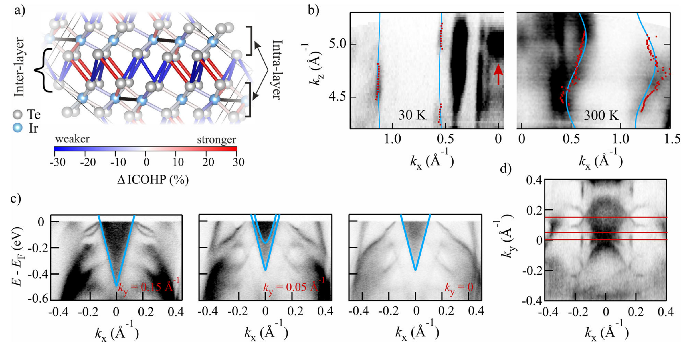

## nicholsonUniaxialStraininducedPhase2021 — 二维拓扑半金属 IrTe2 的单轴应变诱导相变

## 📄 元数据
Christopher W. Nicholson, Maxime Rumo, Aki Pulkkinen, Geoffroy Kremer, Björn Salzmann, Marie-Laure Mottas, Baptiste Hildebrand, Thomas Jaouen, Timur K. Kim, Saumya Mukherjee, KeYuan Ma, Matthias Muntwiler, Fabian O. von Rohr, Cephise Cacho, Claude Monney et al.，2021，Communications Materials 2, 25，DOI: 10.1038/s43246-021-00130-5

## 💡 一句话
沿 a 轴施加约 0.1% 的单轴拉伸应变，即可在宏观尺度上选择性稳定二维拓扑半金属 IrTe2 长期争论的 6×1 电荷有序基态，并首次光谱学观测到伴随的 Lifshitz 转变与 II 型体狄拉克态。

## 🔗 Wiki 双链
  - 概念 [[../concepts/strain-engineering]]
  - 概念 [[../concepts/2D-materials]]
  - 概念 [[../concepts/density-functional-theory]]
  - 概念 [[../concepts/charge-density-wave]]
  - 概念 [[../concepts/charge-order|电荷有序]]
  - 概念 [[../concepts/interlayer-depolymerization|层间解聚]]
  - 概念 [[../concepts/ir-dimerization|Ir 二聚化]]
  - 概念 [[../concepts/lifshitz-transition|Lifshitz 转变]]
  - 概念 [[../concepts/type-ii-dirac-semimetal|II 型狄拉克半金属]]
  - 概念 [[../concepts/uniaxial-strain-device|单轴应变装置]]
  - 实体 [[../entities/TMDs]]
  - 实体 [[../entities/VASP]]
  - 实体 [[../entities/WTe2]]
  - 实体 [[../entities/IrTe2|IrTe₂]]
  - 图表 [[../figures/electronic-bands]]
  - 图表 [[../figures/crystal-structures]]
  - 图表 [[../figures/experimental-setups]]
  - 图表 [[../figures/heterostructures-stacking-spintronics-strain|自旋电子学与应变工程]]
  - 年度 [[../write/2021]]
  - 项目 [[../projects/project-7-cdw-charge-density-wave]]
  - 相关论文 [[../../raw/note/nicholsonUniaxialStraininducedPhase2021]]

## 📊 关键图表
  - 
  - 
  - 
  -  → [[../figures/heterostructures-stacking-spintronics-strain|自旋电子学与应变工程]]

## 🔬 项目连接
project-7 CDW 有直接关联——IrTe2 的 6×1 电荷有序相与 CDW/电荷有序物理同属层状材料中电子失稳导致的周期调制，文中引用 NbSe3 等 CDW 体系并使用紧束缚维度渡越分析方法；其余项目（双光子、Mn 多铁、机械发光 NN、TTF 分子计算、SnTe 铁电模拟、湿度传感器）无直接连接。

## 📝 组织与用词
  - 论证组织：典型的"提出问题 → 实验验证 → 机制解释 → 物性发现 → 结论展望"结构。四个子主题层层递进：(1) ARPES 证明应变使能带锐化并出现 6×1 周期；(2) STM/LEED/微区 ARPES 在实空间确认宏观单畴；(3) XPS+DFT 揭示 Ir→Te 电荷转移是驱动力，并量化层间键弱化；(4) kz 色散+紧束缚拟合证明层间跳跃减小十倍，同时发现狄拉克态下移导致的 Lifshitz 转变。
  - 值得复用的关键词/术语：
    - Uniaxial strain / 单轴应变
    - Charge order / 电荷有序
    - Lifshitz transition / 利夫希茨相变
    - Type-II bulk Dirac state / II 型体狄拉克态
    - Interlayer hopping / 层间跳跃
    - Depolymerization / 解聚（层间键断裂）
    - Ir dimer / Ir 二聚体
    - COHP (crystal orbital Hamiltonian population) / 晶体轨道哈密顿布居
    - Fermi surface warping / 费米面翘曲

## ✏️ 可写入 Wiki 的要点
  1. IrTe2 体相在 280 K 和 180 K 发生一级相变，分别形成 5×1×5 和 8×1×8 结构；表面则在几十纳米尺度上共存 3n+2 系列（8×1, 11×1, 17×1…）近简并低温相；理论预测的 6×1 基态此前仅存在于纳米区域。
  2. 沿高温相 a 轴施加 ε≈0.1% 的单轴拉伸应变，可将 6×1 相畴尺寸增大四个数量级，达到约 0.5×0.4 mm² 的连续宏观单畴（STM、LEED、微区 ARPES 交叉验证）。
  3. 应变在室温（远高于相变温度 280 K）即诱导 Ir→Te 电荷转移：XPS 中应变样品高温相出现 Ir³⁺ᵟ⁺肩峰（峰面积比 0.14，低于 5×1 相的 0.4）；低温下该比值升至 0.67，恰好对应 6×1 相中 6 个 Ir 原子有 4 个二聚化。
  4. 电荷转移机制：Ir³⁺ 失去的电荷填充到层间 Te–Te 反键态，导致 6×1 相中四个不等价层间 Te–Te 键里有三个显著弱化（COHP 计算证实），即"解聚"；这改变了电子能量增益与晶格形变能之间的竞争格局，使二聚体密度最大的 6×1 相能量最低。
  5. 层间跳跃定量结果：紧束缚模型 E(k)=2ta·cos(kxa)+2tc·cos(kzc)+μ 拟合 kz 色散，面内 ta=−0.53 eV，层间 tc 从未应变高温相的 −0.156 eV 骤降至应变 6×1 相的 −0.014 eV，减小约十倍，电子结构准二维化。
  6. Lifshitz 转变：II 型体狄拉克态源自 Te 5pz 轨道，室温时狄拉克点位于 EF 以上而无法被 ARPES 观测；电荷转移将其下移 350 meV 至占据态，使电子型口袋进入费米能级以下，费米面拓扑突变，类似 WTe2 和 ZrTe5 中的温度驱动 Lifshitz 转变。
  7. 狄拉克态并非单一锥：ARPES 在 ky=−0.05 Å⁻¹ 处观测到两个部分重叠的锥形色散，费米面包含中心蝴蝶结形轮廓（ky=0）和位于 ky≈±0.15 Å⁻¹ 的不对称弧形，后者间距与 6×1 周期兼容，但复杂结构的起源尚待理论澄清。
  8. 方法学细节：自制三点弯应变装置由 Mo 基板、CuBe 桥、Al 块组成，用 EPO-TEK E4110 环氧树脂粘贴样品，商业应变片（350 Ω, k=2.2）配合自制惠斯通电桥校准，ε=4Vo/(k Vs)，最大可用应变约 0.1%（CuBe 塑性变形使初始 0.2% 松弛至此值）。
  9. DFT 计算参数：VASP + PBE + PAW，动能截断 400 eV，k 网格 5×15×4，6×1 起始结构取自 IrTe2−xSex（空间群 C2/c, No.15），力收敛至 1 meV/Å；COHP 用 LOBSTER；忽略自旋轨道耦合（晶胞体积差仅 0.8%，Ir–Ir 距离差≤1.2%）。
  10. 展望：压缩应变可能稳定 Pt/Pd 掺杂或淬火所诱导的超导相，与拓扑态共存指向应变可调拓扑超导；层间解耦有利于单层 IrTe2 在更高温度稳定 6×1 相；狄拉克态主导层间输运通道，可能产生大的非饱和磁电阻和显著电阻率各向异性（尚待输运测量验证）。
