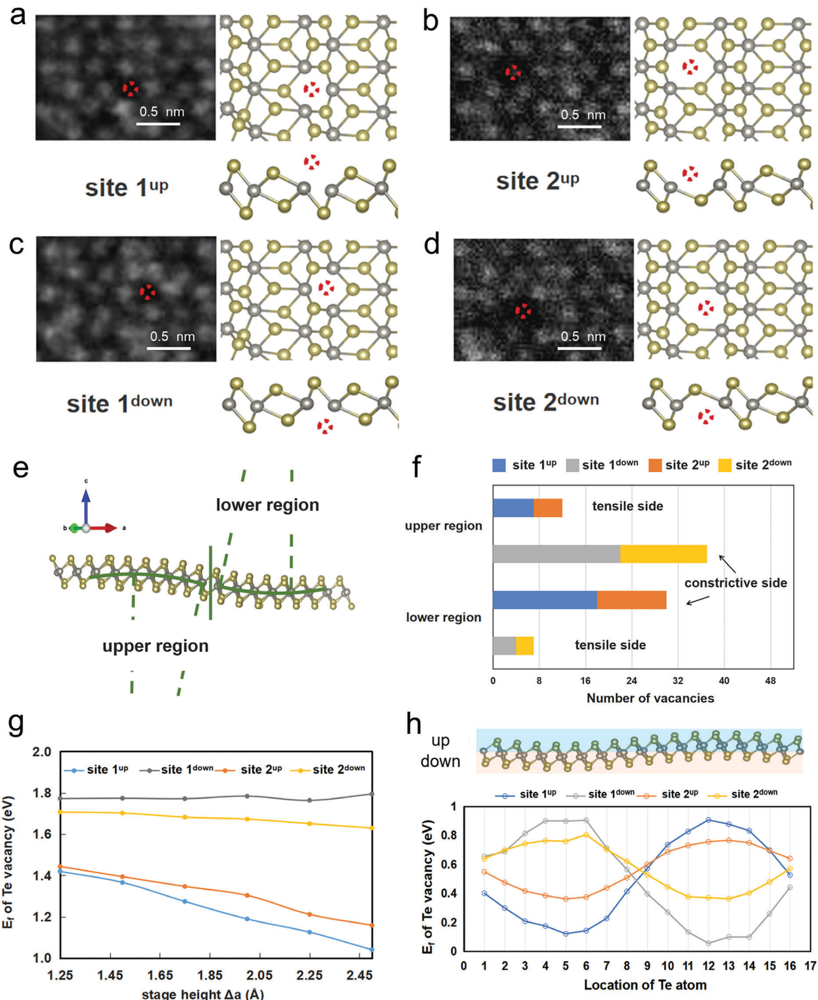
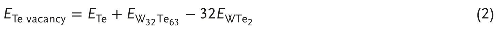

## niuDirectVisualizationLargeScale2021 — 气敏单层1T'-WTe2中大尺度本征原子晶格及其集体各向异性的直接可视化

## 📄 元数据
Niu, Weng, Li, Guo, Wang, Han, Pan, Lin et al.，2021，*Advanced Science* 8(20): 2101563，DOI 10.1002/advs.202101563
## 💡 一句话
通过全流程互联惰性气氛保护系统，用原子分辨 HAADF-STEM 直接可视化了空气敏感单层 1T'-WTe2 的大面积完整晶格，发现其本征的、只沿单一晶面方向传播的各向异性褶皱，以及该褶皱对 Te 空位分布的择优调控。

## 🔗 Wiki 双链
  - 概念 [[../concepts/2d-materials]]、[[../concepts/strain-engineering]]、[[../concepts/spin-orbit-coupling]]、[[../concepts/air-sensitive-2d-materials|空气敏感二维材料]]、[[../concepts/anisotropic-rippling|各向异性褶皱]]、[[../concepts/defect-engineering|缺陷工程]]、[[../concepts/low-symmetry-lattice|低对称性晶格]]、[[../concepts/vacancy-formation-energy|空位形成能]]
  - 实体 [[../entities/WTe2]]、[[../entities/h-BN]]、[[../entities/TMDs]]、[[../entities/graphene|石墨烯]]
  - 图表 [[../figures/crystal-structures]]、[[../figures/experimental-setups]]、[[../figures/heterostructures-stacking|铁弹畴、畴壁、In₂Se₃ 与器件应用]]
  - 年度 [[../write/2020-2024|2021]]
  - 实体 [[../entities/PWmat]]
  - 相关论文 [[../../raw/note/niuDirectVisualizationLargeScale2021]]

## 🆕 新概念/实体建议
  - 实体 [[../entities/PWmat|PWmat]]：GPU 加速的 DFT 计算软件包，本文用其完成 PBE/SG15/DFT-D2 计算。

## 📊 关键图表
  - **图1 空气 vs 惰性环境下 WTe2 单层的光学与 STEM 对比**
  -  → [[../figures/experimental-setups|实验装置与测量系统]]
  - **图示描述**：a–d 为光学显微照片对比 1T'-WTe2 在空气（a 刚取出、b 暴露 5 min）和手套箱惰性气氛（c 刚生长、d 保存 48 h）下的衬度变化；e、f 为空气中制备与全流程惰性气氛保护制备样品的大面积 HAADF-STEM 原子像对比。
  - **关键特征**：空气中暴露 5 min 光学衬度即由紫色褪色为淡紫色，STEM 像表面被氧化纳米颗粒和污染物覆盖、晶格周期性破坏；惰性气氛下 48 h 光学衬度无明显变化，STEM 像呈现大面积、干净、完整的 1T' 链状原子晶格。
  - **结论/意义**：从宏观光学衬度到原子分辨尺度直接证明全流程互联惰性气氛保护是获取空气敏感单层本征原子结构的必要前提。
  - **图2 褶皱的原子尺度识别：畸变 W–Te 四边形单元与 3D 重构**
  -  → [[../figures/experimental-setups|实验装置与测量系统]]
  - **图示描述**：a 为单层 WTe2 大面积 HAADF-STEM 像，橙/蓝阴影标出褶皱上升沿和下降沿；b–g 为上弯/下弯区域的俯视、侧视原子模型与对应 STEM 模拟像；h–k 为垂直于 (100) 与 (110) 晶面的两个不同薄片的原子像及畸变 W–Te 四边形单元空间分布图。
  - **关键特征**：弯曲使 Te/W 柱构成的投影四边形单元（红色菱形）沿弯曲方向被压扁，压扁方向判明上弯或下弯；畸变单元沿平直条带排列、其截断边界严格平行于 (100)、(110) 或 (1−10) 晶面；由四边形间距重构三维起伏，弯曲斜率约 0.2，机械剥离样品中同样存在。
  - **结论/意义**：建立了从二维投影像还原三维褶皱形貌的原子判据，证实各向异性褶皱是 1T'-WTe2 的本征结构而非 CVD 制备伪影。
  - **图3 双轴倾转电子衍射验证褶皱各向异性（FWHM 不对称展宽）**
  -  → [[../figures/crystal-structures-xrd-phases|XRD与相变]]
  - **图示描述**：a、b 为更大范围 HAADF-STEM 像及畸变单元分布图；c 为 0° 倾转的 SAED 图样；d、e 分别为绕 α 轴和 β 轴倾转时 (330)/(360) 与 (3−30)/(3−60) 衍射斑 FWHM 随倾角的变化；f 为各向异性褶皱示意，g 为倒易杆（relrod）锥角测量。
  - **关键特征**：绕 α 轴倾转时代表 (110)/(120) 晶面的 (330)、(360) 斑 FWHM 显著展宽，绕 β 轴时代表 (1−10)/(1−20) 的 (3−30)、(3−60) 几乎不变；倒易杆锥角 12°–16°，结合 HAADF 测得横向周期 L≈12 nm，得褶皱平均高度约 2.5 nm，AFM 佐证；与 MoS2 单层各向同性褶皱形成对照。
  - **结论/意义**：用宏观衍射方法独立验证了原子像的结论——原子集体位移只发生在垂直于某一择优晶面的方向，褶皱具有严格的各向异性。
  - **图4 Te 空位在褶皱挤压侧聚集的统计与 DFT 形成能**
  -  → [[../figures/crystal-structures-surfaces-defects|表面、缺陷与形貌]]
  - **图示描述**：a–d 为 1T' 低对称单胞产生的四种不等价 Te 空位（site 1up/down、site 2up/down）；e 把弯曲区域分为上/下部并标出挤压侧（constrictive side）与拉伸侧（tensile side）；f 为多个薄片约 1000 nm² 面积上四种空位在褶皱两侧的统计；g、h 为 DFT 计算的空位形成能随弯曲程度及在完整褶皱超胞中的波动。
  - **关键特征**：统计（P<0.05）表明无论哪种位点，Te 空位都优先聚集在挤压侧，上下弯曲段规律相反；DFT 显示挤压侧 site 1up/site 2up 形成能低于拉伸侧，弯曲越大形成能越低；site 1 因 W–Te 键更近对波纹调制应变更敏感，形成能波动比 site 2 更剧烈。
  - **结论/意义**：从实验统计与第一性原理两方面证明形貌诱导的非对称应变压倒各向异性晶格键合，决定本征 Te 空位的择优分布。
  - **图5 晶界与部分氧化对各向异性褶皱的调制**
  -  → [[../figures/crystal-structures-surfaces-defects|表面、缺陷与形貌]]
  - **图示描述**：a 为晶界附近的 STEM 像，左右两晶粒取向不同，黄色箭头标示来自晶界的应变方向；b 为部分氧化区域的原子像，畸变单元呈阶梯状排列；c 为对应示意模型，把连续波纹软化为同向小台阶。
  - **关键特征**：晶界右侧晶粒内出现垂直于 (1−10) 面的褶皱而左侧没有，因为右侧应变方向恰好垂直于该择优晶面；部分氧化时所有畸变区域沿同一面外方向（图中向下）弯曲，连续褶皱被分解为多个精细阶梯以释放局域应变。
  - **结论/意义**：说明晶界、氧化团簇等外来源施加的定向应变可各向异性地驱动或调制褶皱，支持"择优弯曲轴取决于初始应变方向"的物理图像。
  - **公式2 Te 空位形成能计算式**
  -  -> [[../figures/mathematical-models-formulas|光学、输运与其他解析公式]]
  - **图示描述**：DFT 中 Te 空位形成能表达式 E_f(Te vacancy) = E_Te + E(W₃₂Te₆₃) − 32 E(WTe₂)，其中 E_Te 为三角碲单质中每原子总能量，E(W₃₂Te₆₃) 为含 1/64 Te 空位的 WTe2 超胞总能量，E(WTe₂) 为完美单胞中每个基本单元能量。
  - **关键特征**：计算用 PWmat、PBE 交换关联、SG15 模守恒赝势、50 Ryd 截断、DFT-D2 色散校正；弯曲超胞通过固定 W 原子 z 坐标为 Δz = d·sin(2πy/b) 构建，W 的 x、y 及其余原子完全弛豫。
  - **结论/意义**：该公式把褶皱诱导的局域应变转化为空位形成能的定量差异，是图4g/h 中"挤压侧形成能更低"结论的计算基础。

## 🔬 项目连接
  - **project-7（CDW，weak）**：论文被收入"单层 CDW 与维度效应"分类，但其内容本身不研究 CDW；可参考之处在于对单层 TMD（WTe2）本征原子结构、集体晶格畸变与维度效应的原子尺度 STEM 表征方法，以及各向异性晶格畸变的电子衍射判据，可作为单层 TMD 结构表征的方法学参照。
  - **project-5（SnTe 铁电模拟，weak）**：本文用 DFT 证明局部弯曲应变可不对称地降低空位形成能（挤压侧更低），并将 SOC 诱导带隙从平坦时的 0.18 eV 增大到 0.22 eV；这种"应变—缺陷—电子结构"耦合的计算思路（固定 z 坐标正弦弯曲超胞 + 形成能公式）对低对称性、含自旋轨道耦合材料的应变工程模拟有方法类比价值，但材料体系与铁电主题无直接重合。
  - 其余项目（project-1 双光子、project-2 Mn多铁、project-3 机械发光NN、project-4 TTF分子计算、project-6 湿度传感器）无直接连接。

## 🔗 项目双链
- 项目 [[../projects/project-7-cdw-charge-density-wave|项目七：CDW电荷密度波]]

## 📝 组织与用词
论文按"提出空气敏感难题 → 构建全流程惰性保护方案 → 原子成像发现各向异性褶皱 → 双轴倾转衍射宏观验证 → DFT 解释缺陷择优 → 晶界/氧化外场验证 → 结论"的证据链递进。值得复用的术语：
  - [[../concepts/anisotropic-rippling|anisotropic rippling]]（各向异性褶皱/波纹）
  - constrictive/tensile side（挤压侧/拉伸侧）
  - collective lattice distortion（集体晶格畸变）
  - distorted W–Te quadrilateral unit（畸变 W–Te 四边形单元）
  - [[../concepts/reciprocal-relrod|reciprocal relrod / cone angle]]（倒易杆 / 锥角）
  - Z-contrast HAADF-STEM（Z 衬度高角环形暗场像）
  - preferential defect formation（择优缺陷形成）
  - ripple-modulated strain / defect engineering（波纹调制应变 / 缺陷工程）

  - [[../concepts/haadf-stem|haadf-stem]]
## ✏️ 可写入 Wiki 的要点
  1. 全流程互联惰性气氛系统（CVD 炉—手套箱—真空转移杆—TEM）使空气敏感单层 1T'-WTe2 在生长、转移、表征全过程中隔绝空气；空气中暴露 5 min 光学衬度即褪色，惰性环境保护 48 h 无变化，空气中制备的 STEM 样品晶格被氧化纳米颗粒破坏，而保护环境下呈现大面积完整原子晶格。
  2. CVD 生长条件：15 mg NaCl + 60 mg WO3 前驱体置于加热区中心，Te 粉在上游 9 cm；820 °C 保温 5 min，80 sccm Ar + 20 sccm H2 载气；用异丙醇辅助直接润湿转移到 Quantifoil Au 网，HF-H2O (1:4) 刻蚀氧化硅剥离。
  3. 单层 1T'-WTe2 中存在本征[[../concepts/anisotropic-rippling|各向异性褶皱]]：传播方向只垂直于 (100)、(110) 或 (1−10) 中的某一个晶面，且不能在同一薄片中共存；机械剥离样品中同样存在，证实其内禀性。
  4. 褶皱的原子判据：弯曲使 Te/W 柱构成的投影四边形单元沿弯曲方向被压扁（红色菱形/箭头）；通过对畸变单元做空间分布图可重建三维起伏并确定传播方向，弯曲斜率约 0.2。
  5. 双轴倾转电子衍射给出宏观验证：绕 α 轴倾转时 (330)、(360) 衍射斑 FWHM 显著展宽（对应 (110)/(120) 晶面原子集体位移），而绕 β 轴时 (3−30)、(3−60) 几乎不变；[[../concepts/reciprocal-relrod|倒易杆]]锥角 12°–16°，结合 HAADF测得横向周期 L≈12 nm，得褶皱平均高度 ≈2.5 nm（AFM 佐证）。与 MoS2 单层各向同性褶皱形成对比。
  6. 褶皱起源：1T' 相低对称性（无旋转对称）和各向异性 W–Te 键导致沿不同晶向对应变的响应/容忍度不同，热扰动下应变集中于某一择优面释放；DFT 能量景观支持该机制。
  7. 1T'-WTe2 单胞低对称性产生 4 个不等价 Te 空位（site 1/2 × up/down）；统计（多个薄片、约 1000 nm²、P<0.05）表明无论哪种位点，Te 空位都优先聚集在弯曲的挤压侧（constrictive side），形貌诱导变形压倒了各向异性晶格键合的作用。
  8. DFT（PWmat，PBE，SG15 [[../concepts/norm-conserving-pseudopotential|模守恒赝势]]，50 Ryd 截断，DFT-D2 色散校正）通过固定 W 原子 z 坐标为正弦函数 Δz=d·sin(2πy/b) 构建弯曲超胞，证实挤压侧[[../concepts/vacancy-formation-energy|空位[[../concepts/formation-energy|形成能]]]]更低，且弯曲越大形成能越低；site 1 因 W–Te 键更近、对应变更敏感，形成能波动比 site 2 更剧烈。Te 空位形成能公式 E_f = E_Te + E(W32Te63) − 32 E(WTe2)。
  9. 褶皱还调制电子结构：考虑 SOC 时 WTe2 由[[../concepts/half-metallicity]]变为半导体，褶皱使 SOC 带隙 from 平坦时 0.18 eV 增大到 0.22 eV，提示可通过褶皱形貌连续调控带隙。
  10. 晶界处仅当晶界应变方向在某一晶粒内垂直于择优晶面时才诱发该侧褶皱；部分氧化时连续褶皱被软化为同向（同面外方向）的阶梯状精细结构以释放局域应变，说明外来源（晶界、氧化团簇）的定向应变可各向异性地驱动/调制褶皱。