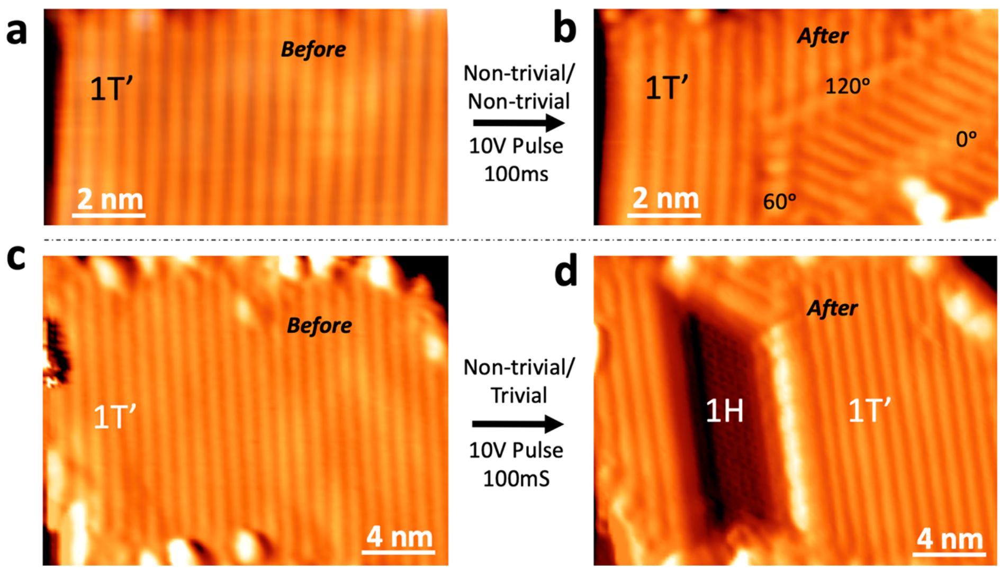
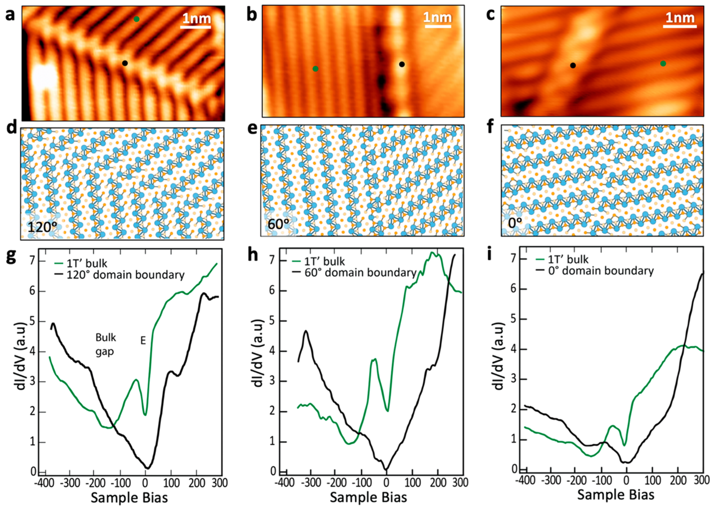
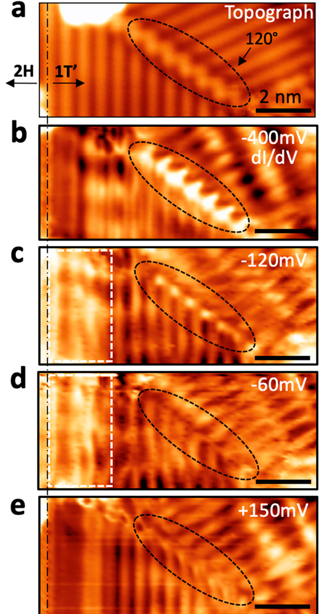

## pedramraziManipulatingTopologicalDomain2019 — 单层量子自旋霍尔绝缘体1T′–WSe2中拓扑畴边界的操控

- **元数据**：Zahra Pedramrazi, Charlotte Herbig, Artem Pulkin, Shujie Tang, ... Michael F. Crommie 等，2019，*Nano Letters* 19(8), 5634–5639，DOI: 10.1021/acs.nanolett.9b02157
- **一句话**：用 STM 针尖脉冲在单层 1T′-WSe2 中可逆写入/擦除铁弹畴界（120°/60°/0°）并诱导 1T′→1H 相变，结合 STS 与 DFT/NEGF 首次系统表征了 QSHI 中拓扑"未保护"的 1T′/1T′ 畴界面态，建立了其与拓扑保护 1T′/1H 边缘态的谱学鉴别标准。
- **现有wiki双链**：
  - 概念 [[../concepts/2D-materials]]、[[../concepts/topological-defects]]、[[../concepts/ferroelasticity]]、[[../concepts/strain-engineering]]、[[../concepts/density-functional-theory]]、[[../concepts/berry-phase]]、[[../concepts/spin-orbit-coupling]]
  - 实体 [[../entities/TMDs]]、[[../entities/domain-wall]]、[[../entities/WTe2]]
  - 图表 [[../figures/domain-walls]]、[[../figures/electronic-bands]]、[[../figures/crystal-structures]]、[[../figures/experimental-setups]]
  - 年度 [[../write/2019]]
  - 相关论文 [[../../raw/note/pedramraziManipulatingTopologicalDomain2019]]
- **新概念/实体建议**：
  - `quantum-spin-hall-insulator.md` — 量子自旋霍尔绝缘体（QSHI），体绝缘、边缘有受时间反演保护的螺旋边缘态；1T′-WTe2/WSe2 是典型二维代表（wiki 概念层目前缺这一条，仅有 berry-phase/topological-defects 间接相关）
  - `WSe2.md` — 二硒化钨，1T′ 相为 QSHI，1H 相为拓扑平庸半导体；本文核心材料，目前 wiki 实体无独立条目（仅有 TMDs 总条与 WTe2）
  - `topological-vs-trivial-interface.md` — 拓扑界面 vs 平庸界面：以 Z2 不变量是否跨越界面变化区分，决定是否必然存在拓扑保护边缘态
  - `nonequilibrium-greens-function.md` — NEGF 方法，用于半无限边界条件下计算一维线缺陷能带/LDOS，可作为 DFT 概念下的方法补充
  - `pseudogap-zero-bias-anomaly.md` — 赝能隙/零偏压异常，低维强关联/无序体系在费米能级处的 LDOS 抑制，区别于真实带隙
  - `peierls-distortion.md` — Peierls 畸变，1T 母相发生二聚化形成 1T′ 相并产生三等价取向畴的结构起源
- **关键图表**：
  - 
  - 
  - 
  - 
- **项目连接**：
  - **project-2 Mn多铁**：有间接参考价值。本文研究的是铁弹（ferroelastic）畴界而非铁电/磁畴壁，但其"畴界两侧序参量取向不同→畴界处出现一维界面态、界面态色散/自旋极化随畴界角度变化"的物理图像，可类比 Mn 基多铁材料中铁电/铁磁畴壁的导电通道与畴壁电子学（domain-wall electronics）。方法上，"DFT 弛豫畴界原子结构 + NEGF 半无限边界计算畴界能带/LDOS"的计算流程可直接迁移到多铁畴壁的电子结构计算；"用 STS dI/dV 谱区分拓扑保护态与平庸缺陷态、用能量依赖 LDOS mapping 提取衰减长度"的表征策略对多铁畴壁导电通道的实验鉴别有借鉴意义。
  - **project-5 SnTe铁电模拟**：参考价值较强但角度不同。SnTe 是铁电拓扑晶态绝缘体，本文研究的 1T′-WSe2 是 QSHI，两者都涉及"拓扑非平庸材料中畴/畴界的电子结构"这一核心问题。可迁移点：(1) 铁弹/铁电畴取向翻转机制——本文证实单层 1T′ 相通过 STM 脉冲在三等价 Peierls 畸变取向间可逆切换（V_pulse≥6 V，铁弹性证据），对 SnTe 中铁弹-铁电耦合畴的翻转势垒/成核概率计算有类比价值；(2) 畴界类型决定电子结构——120°畴界面外自旋极化、60°畴界自旋方向旋转、0°畴界因反演对称无自旋极化，这一"对称性→自旋纹理"的分析范式可迁移到 SnTe 不同类型铁电畴壁（如 {110} vs {100}）的拓扑性质差异；(3) 计算方法上 NEGF + 半无限边界处理一维畴界的方案适用于 SnTe 畴界的拓扑边缘态计算。但需注意 SnTe 是三维拓扑晶态绝缘体（镜面陈数保护），与二维 Z2 QSHI 的保护机制不同，不能直接套用"Z2 相同即平庸"的判据。
  - **project-1 双光子 / project-3 机械发光NN / project-4 TTF分子计算 / project-6 湿度传感器 / project-7 CDW**：无直接项目连接。唯一弱关联：本文提及 1T′ 相源于 1T 母相的 Peierls 畸变（一种 CDW 不稳定性），对 project-7 理解 CDW 与结构二聚化的关系有边缘背景价值，但不涉及 CDW 的核心物理，不计为实质连接。
- **组织与用词**：文章按"实验操控（针尖脉冲写入畴界）→结构分类（120°/60°/0°三种畴界的原子成像与 DFT 模型）→局域电子性质（STS 点谱 + 能量依赖 dI/dV mapping）→理论印证（DFT 弛豫 + NEGF 能带/LDOS，自旋极化分析）→结论与器件概念"的链条推进；核心对比是在同一区域同时测量平庸 1T′/1T′ 畴界与拓扑 1T′/1H 边界（图3），用能量依赖的实空间 LDOS 直观区分两者。值得复用的术语：
  - 量子自旋霍尔绝缘体 / quantum spin Hall insulator (QSHI)
  - 拓扑平庸畴界 / topologically trivial domain boundary（Z2 不变量两侧相同）
  - 铁弹性 / ferroelasticity（外应力下取向畴可逆切换）
  - Peierls 畸变 / Peierls distortion（1T→1T′ 二聚化的结构起源）
  - 非平衡格林函数 / nonequilibrium Green's function (NEGF)（半无限畴界电子结构方法）
  - 能量依赖衰减长度 / energy-dependent decay length（畴界面态空间局域程度随能量变化）
  - 赝能隙/零偏压异常 / pseudogap / zero-bias anomaly（无序+电子-电子相互作用导致的 V=0 处 LDOS 抑制）
  - 螺旋边缘态 / helical edge state（拓扑保护、自旋-动量锁定）
- **可写入wiki的要点**：
  1. 单层 1T′-WSe2 是 QSHI，体带隙约 85±21 mV（FWHM），中心位于 −130±5 mV（因 BLG/SiC 衬底 n 型掺杂而负移）；1H 相为拓扑平庸半导体。
  2. STM 针尖脉冲可在单层 1T′-WSe2 中实现两类操控：V_pulse≥6 V 时在不同 1T′ 取向往返切换（可逆，铁弹性直接证据，高电流 300 mV/1 nA 扫描可擦除）；V_pulse≥10 V 时诱导 1T′→1H 局部相变（不可逆，仅在受限区域发生，1H 区表观高度更低）。取向翻转势垒低于 1T′→1H 相变异垒。
  3. 1T′ 相由 C3 对称的 1T 母相经 Peierls 畸变形成三个等价二聚化取向，故畴界只能取 120°（占85%）、60°（13%）、0°（2%）三种；畴界为直线缺陷，最长约 20 nm。
  4. 120°和60°畴界的 STS 谱在 −300 mV 至 0 V 呈宽斜坡、无明显体带隙特征；0°畴界在体带隙能量处保留明显凹陷。三者均在 V=0 处有窄凹陷（赝能隙），归因于低维体系中无序与长程电子-电子相互作用的协同，在畴界处更显著。
  5. 能量依赖 dI/dV mapping（图3）：120°畴界态主要分布在 −400 mV<Vs<−60 mV，在价带深处（−400 mV）亮、能隙内（−120 mV）仍亮、接近导带底（−60 mV）变暗；1T′/1H 拓扑边缘态在能隙内保持高 LDOS。120°畴界态衰减长度比拓扑边缘态更强地依赖能量，低能端更弥散。
  6. DFT/NEGF 计算：60°畴界（对称性最低）缺陷模跨越整个带隙；120°畴界留有约 10 meV 微小能隙（经 σ=30 meV 高斯展宽后抹平，与实验一致）；0°畴界因反演对称保留类体能隙且无自旋极化。120°畴界态面外自旋极化，60°畴界同一能带内自旋方向旋转。
  7. 拓扑判据：界面两侧 Z2 不变量不同（1T′/1H、1T′/真空）则必然存在受拓扑保护、直接连接价带与导带的螺旋边缘态（STS 上为能隙内清晰峰）；Z2 相同（1T′/1T′）的界面态是非保护的色散缺陷模，不直接连接价带导带，对无序敏感。
  8. 理论方法：先以平面波 DFT 在 ribbon 几何下周期性边界弛豫畴界原子结构，再用 NEGF 加半无限边界条件计算一维线缺陷的自旋分辨能带和 LDOS，克服周期性超胞方法处理开放缺陷的局限。
  9. 理论与实验的主要差异：DFT 预言 E=0 处 LDOS 峰，实验观测到宽凹陷，归因于 DFT 未包含的无序+电子-电子相互作用（Altshuler-Aronov 型零偏压异常/库仑赝能隙），提示低维畴界体系需 GW 或 DMFT 等多体方法补充。
  10. 器件概念：可将 1T′ 拓扑边缘视为无耗散"高速公路"，用可控写入的平庸 1T′/1T′ 畴界作为"道岔"，将沿 QSH 边缘传播的载流子可控偏转入畴界面态，实现栅压可调的电荷/自旋输运（本文仅提供电子结构层面的概念验证，未做输运测量）。
