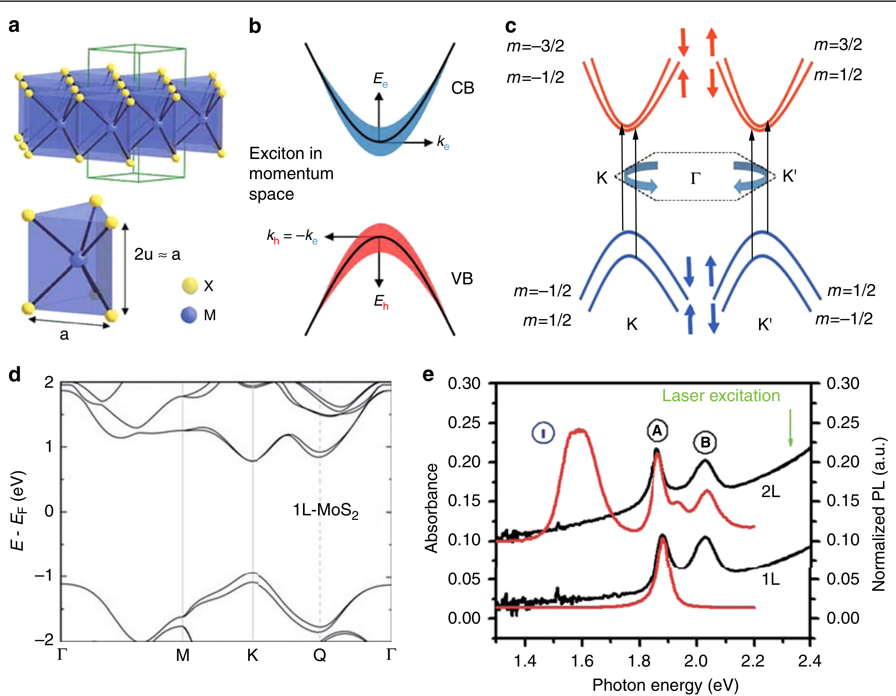
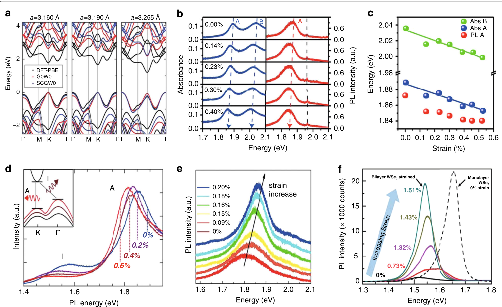
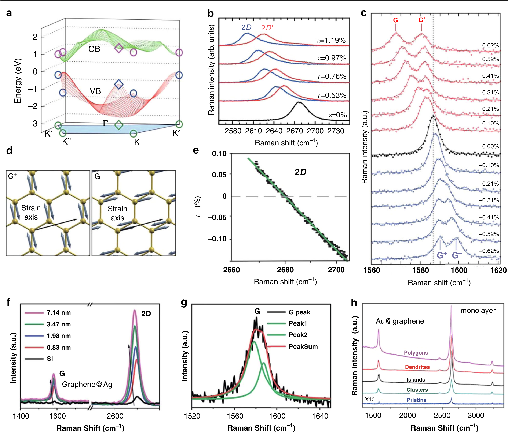
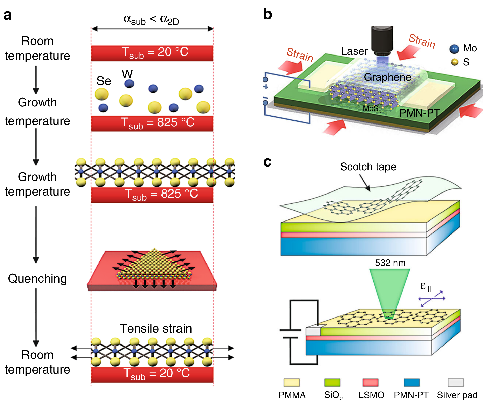
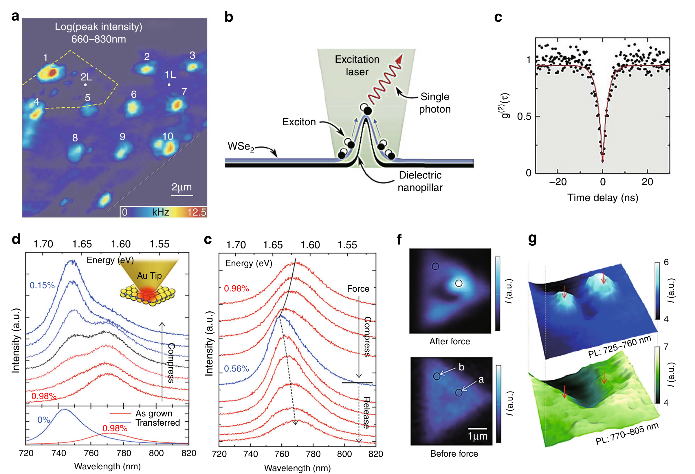
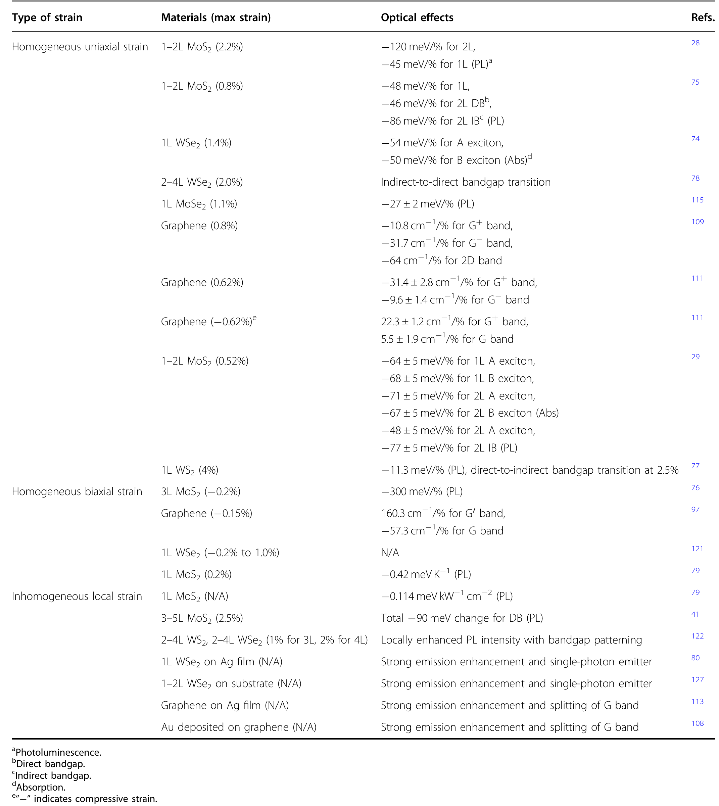

## pengStrainEngineering2D2020 — 二维半导体和石墨烯的应变工程：从应变场到能带结构调谐和光子应用

## 📄 元数据
Zhiwei Peng, Xiaolin Chen, Yulong Fan, David J. Srolovitz, Dangyuan Lei et al.，2020，*Light: Science & Applications* 9:190，DOI: 10.1038/s41377-020-00421-5

## 💡 一句话
系统综述了如何通过单轴/双轴/局部应变连续调控二维 TMDCs 和石墨烯的能带结构与光学性质（PL 红移、带隙类型转变、激子漏斗、拉曼分裂、SHG 应变成像、相变等），并梳理了应变加载技术及其在应变传感器、宽谱太阳能漏斗和单光子源等光子学器件中的应用。

## 🔗 Wiki 双链
  - 概念 [[../concepts/2D-materials]]
  - 概念 [[../concepts/strain-engineering]]
  - 概念 [[../concepts/density-functional-theory]]
  - 概念 [[../concepts/spin-orbit-coupling]]
  - 概念 [[../concepts/deformation-potential]]
  - 概念 [[../concepts/moire-superlattice]]
  - 概念 [[../concepts/exciton-funnel-effect|激子漏斗效应]]
  - 概念 [[../entities/graphene|石墨烯]]
  - 概念 [[../concepts/pseudomagnetic-field|赝磁场]]
  - 概念 [[../concepts/raman-strain-splitting|拉曼应变分裂]]
  - 概念 [[../concepts/second-harmonic-generation|二次谐波产生]]
  - 概念 [[../concepts/single-photon-emitter|单光子发射体]]
  - 实体 [[../entities/TMDs]]
  - 实体 [[../entities/h-BN]]
  - 实体 [[../entities/WTe2]]
  - 实体 [[../entities/graphene|石墨烯]]
  - 图表 [[../figures/electronic-bands]]
  - 图表 [[../figures/optical-spectra]]
  - 图表 [[../figures/vibrational-spectra]]
  - 图表 [[../figures/mathematical-models]]
  - 图表 [[../figures/experimental-setups]]
  - 图表 [[../figures/electronic-devices]]
  - 图表 [[../figures/heterostructures-stacking-spintronics-strain|自旋电子学与应变工程]]
  - 年度 [[../write/2020]]
  - 相关论文 [[../../raw/note/pengStrainEngineering2020]]

## 📊 关键图表
  -  → [[../figures/electronic-bands-band-structures|能带结构与带隙]]
    - **图示描述**：综述的 TMDCs 基线图，由 (a) MX₂ 三角棱柱晶体结构、(b) 激子电子-空穴库仑束缚示意图、(c) K/K′ 谷自旋-轨道劈裂产生的 A/B 亮激子与暗激子、(d) DFT 计算的单层 MoS₂ 能带（直接带隙位于 K 点）以及 (e) 单层/双层 MoS₂ 的吸收与 PL 光谱五部分组成。
    - **关键特征**：单层 MoS₂ 的 A 激子约 1.85 eV、B 激子约 2.0 eV，对应 ~1.9 eV 的光学带隙；双层 MoS₂ 因转为间接带隙，PL 强度骤降并出现标记为 I 的间接峰；重金属原子 d 轨道的强自旋-轨道耦合导致价带劈裂，是后续 PL 应变位移讨论的基准线。
    - **结论/意义**：确立"未应变 TMDCs"的结构与光谱参照系，为后文应变量化提供零点。
  -  → [[../figures/electronic-bands-band-structures|能带结构与带隙]]
    - **图示描述**：核心证据图，(a) DFT 给出 0–3% 拉伸应变下单层 MoS₂ 能带在 K 点带隙单调减小、Γ 点价带顶上移；(b–d) 单层/双层 MoS₂ 在单轴拉伸下吸收与 PL 峰的线性红移及位移率拟合；(e) 压电衬底上三层 MoS₂ 压缩双轴应变下的蓝移；(f) 双层 WSe₂ 在 0.73% 单轴拉伸下 PL 强度急剧增强。
    - **关键特征**：单层 MoS₂ 吸收 A 激子 −64±5 meV/%、B 激子 −68±5 meV/%；PL A 激子 −45±7 meV/%；WSe₂ 吸收 A/B 为 −54±2/−50±3 meV/%；双层 MoS₂ 间接峰位移率约 −129±20 meV/%，远大于直接峰；双层 WSe₂ 在 0.73% 应变即发生间接→直接转变。
    - **结论/意义**：把应变百分比直接换算为光谱能量位移，证明应变是带隙与发光效率的连续可逆"旋钮"。
  -  -> [[../figures/vibrational-spectra|振动光谱]]
    - **图示描述**：石墨烯的基线图，(a) 蜂窝晶格（A/B 两子格）与面内光学声子振动方向、(b) K/K′ 点处线性色散的狄拉克锥、(c) 2.41 eV 激发下典型拉曼光谱（G 峰 ~1582 cm⁻¹、2D/G′ 峰 ~2700 cm⁻¹，缺陷样出现 D 峰 ~1350 cm⁻¹）、(d) 双声子共振与 G/D/2D 峰的散射过程示意、(e) 可见光波段的普适透射率曲线。
    - **关键特征**：未应变石墨烯在狄拉克点为零带隙，载流子为无质量狄拉克费米子；单层可见光吸收率由精细结构常数决定，πα≈2.3%，透射率 ~97.7%，与频率和偏振无关；G 峰为双重简并的面内光学声子，是后续应变分裂讨论的基准。
    - **结论/意义**：与图1对应，建立石墨烯"无应变基准"，凸显后续应变如何打破其六重对称与普适吸收。
  -  -> [[../figures/vibrational-spectra|振动光谱]]
    - **图示描述**：(a) TB 计算的剪切+单轴应变（约 15%）下石墨烯能带，显示在狄拉克点附近打开带隙；(b–c) 单轴拉伸下 2D 峰与 G 峰的红移和分裂为 2D⁺/2D⁻、G⁺/G⁻ 子峰；(d) G⁺/G⁻ 声子本征矢量方向示意；(f–h) 石墨烯转移到粗糙银膜上同时出现 SERS 电磁增强与局部应变诱导的拉曼位移/分裂。
    - **关键特征**：G⁺（垂直应变方向）位移率约 −10.8 cm⁻¹/%，G⁻（平行应变方向）约 −31.7 cm⁻¹/%；2D 峰单轴位移约 −64 cm⁻¹/%，双轴拉伸可达 −160.3 cm⁻¹/%；压缩应变则出现蓝移（G⁺ 约 +22.3 cm⁻¹/%）；TB 预言 12–17% 剪切+单轴应变可打开 0–0.9 eV 带隙。
    - **结论/意义**：G/2D 峰的位移与分裂是定量反演石墨烯应变大小和方向的"指纹"，并展示了应变与等离激元增强协同的可行性。
  -  -> [[../figures/mathematical-models-elasticity-strain|应变、弹性与力学模型]]
    - **图示描述**：(a–c) 理论计算给出未应变石墨烯各向同性光学电导率，施加应变后沿应变方向与垂直方向的电导率出现差异，透射率随入射光电场偏振方向变化；(d–e) 柔性衬底上石墨烯的偏振分辨透射/吸收实验验证该各向异性。
    - **关键特征**：未应变时单层石墨烯吸收 πα≈2.3% 且无偏振依赖；单轴应变打破六重对称后，光学电导率张量出现非对角元与方向依赖，使平行/垂直应变方向的光吸收不同；该效应在较宽可见–近红外波段成立，可通过偏振角扫描读出应变量级。
    - **结论/意义**：这是应变打破石墨烯光学各向同性的直接证据，为偏振敏感光电探测器、光隔离器等无源偏振器件提供基础。
  - 
    - **图示描述**：四种典型均匀单轴应变加载装置：两点/三点弯曲柔性衬底、悬臂梁弯曲、将二维材料卷绕成圆柱/卷曲结构，以及 MEMS 热致或压电致动拉伸台对悬浮薄膜的单轴拉伸。
    - **关键特征**：弯曲法装置简单、应变可由梁厚与曲率半径估算，通常 <4%；MEMS 拉伸可对悬浮样品施加高达 ~10–25% 的极端均匀应变，便于验证大应变下的带隙打开与相变；卷曲法能在三维曲面上引入可控单轴应变但分布受几何限制。
    - **结论/意义**：为不同应变量级与样品构型提供"施工手册"，是连接理论预言与实验验证的关键硬件。
  -  → [[../figures/domain-walls-switching-properties|极化翻转与铁电性能]]
    - **图示描述**：左列为热膨胀系数（CTE）失配法——将二维材料转移到聚合物或玻璃等衬底上，通过升降温利用 CTE 差异在面内两个方向同时产生压缩或拉伸应变；右列为压电衬底法——将材料置于 PMN-PT 等压电晶体上，通过外加电压诱导衬底双轴形变。
    - **关键特征**：热膨胀法简单易行、可大面积施加，但应变与温度耦合、应变幅度较小；PMN-PT 压电法可通过电压电信号快速、可逆地切换拉伸/压缩双轴应变，典型应变量在 ~0.2% 量级，便于动态调制实验。
    - **结论/意义**：提供了两种各向同性面内应变的实现路径，适用于研究双轴应变下的带隙变化与 PL 蓝移/红移。
  -  → [[../figures/experimental-setups|实验装置与测量系统]]
    - **图示描述**：三类局部非均匀应变技术：(a) 激光辐照在样品上引入局部热膨胀/冲击应变；(b) 将二维材料转移到预拉伸弹性体后释放预应变形成周期性褶皱；(c–d) 将材料转移到刻蚀有纳米柱阵列或具有粗糙 Ag/Au 表面的衬底上，使其在尖端、边角处形成高度局域化的应变场。
    - **关键特征**：预拉伸释放法可在褶皱顶部产生大幅局部拉伸应变，是激子漏斗效应的物理载体；纳米柱/粗糙金属支撑可把应变局域到几十纳米尺度，是制备确定性单光子发射体的主流路线；激光法可实现远程、动态写入但应变场分布复杂、需精细表征。
    - **结论/意义**：将应变工程从"均匀旋钮"扩展到"空间设计"，使局域能带与量子光源工程成为可能。
  -  -> [[../figures/electronic-devices-memory-transistors|存储器与晶体管]]
    - **图示描述**：三组应用器件原型：(a–b) 石墨烯嵌入 PDMS 的光纤/柔性应变传感器，利用拉曼峰位移或电阻变化读出应变；(c) 基于偏振分辨 SHG 的二维材料应变场成像，空间分辨率可达亚微米；(d–g) 利用非均匀应变构造的"太阳能漏斗"器件，将不同波长光生激子汇集到低带隙区。
    - **关键特征**：SHG 强度公式 I∝[A cos(3φ)+B cos(2θ+φ)]² 中仅含两个独立光弹参数 P1、P2，Mennel 等据此实现 ~280 nm 空间分辨率的全应变张量映射；理论预言 0–9% 双轴应变可把 MoS₂ 带隙从 ~2.0 eV 连续调到 ~1.1 eV，对应 677–905 nm 的宽谱收集范围。
    - **结论/意义**：证明应变调控在传感、成像和光伏三个方向均已发展出器件级原型。
  -  → [[../figures/optical-spectra|光学光谱]]
    - **图示描述**：(a–c) 将单层/双层 WSe₂ 转移到 Si 纳米柱阵列上，每个柱顶的局部应变产生类量子点发射体，展示其阵列化光谱与二阶相干测量；(d–g) 利用金属或 AFM 针尖对二维材料施加可控弹性/塑性应变并进行尖端增强 PL（TEPL）成像，实现亚 15 nm 分辨率的形貌-光学关联。
    - **关键特征**：应变局域发射体线宽窄至约 0.1 meV（自由激子约 10 meV），二阶相干 g²(0)=0.07±0.04，衰减时间 2.8 ns（单层）/4.8 ns（双层）；与金属等离激元腔耦合后 Purcell 因子可达 551，寿命缩短至约 98 ps；TEPL 空间分辨率优于 15 nm。
    - **结论/意义**：标志着应变工程从连续谱调控进入确定性量子光源与纳米光学成像阶段，是综述最具前景的应用落点。
  -  -> [[../figures/electronic-devices-sensors|传感器与探测器]]
    - **图示描述**：综述主表，汇总 TMDCs（MoS₂、MoSe₂、WSe₂ 等）与石墨烯在单轴/双轴拉伸和压缩应变下的 PL、吸收、拉曼 G/2D 峰位移系数（meV/% 或 cm⁻¹/%）、带隙转变临界应变、相变条件以及 SHG/单光子源等光学效应。
    - **关键特征**：表中数值是设计应变传感器和可调谐光电器件的定量标尺，例如 TMDCs A 激子红移率在 −27 至 −64 meV/% 区间、双层 MoS₂ 间接峰约 −129 meV/%、石墨烯 G⁻ 峰 −31.7 cm⁻¹/%、2D 峰双轴 −160.3 cm⁻¹/%；同时列出 0.73%（双层 WSe₂ 间接→直接）、~2–2.5%（单层 MoS₂/WS₂ 直接→间接）、10–15%（MoS₂ 半导体→金属）等临界应变。
    - **结论/意义**：为跨材料、跨应变类型比较光学响应提供一站式数据参考，是综述"数据汇总"贡献的集中体现。

## 🔬 项目连接
无直接项目连接。（主题上与 project-3 机械发光的"力学刺激→光发射"范式有间接呼应，但材料体系与机理不同。）

## 🔗 项目双链

## 📝 组织与用词
文章采用经典综述逻辑链"理论奠基 → 本征基线 → 应变现象 → 加载技术 → 应用展望"。理论部分先建立宏观连续弹性理论（应变张量 ε_ij、拉伸能 F_st 与弯曲能 F_b、Lamé 常数、二维杨氏模量 Y_2d 和泊松比 ν），再通过 Cauchy–Born 近似连接到微观紧束缚（TB）和 k·p 有效哈密顿量（含形变势 f3、赝规范场 f4/f5 项）。现象部分按材料分两条线：TMDCs 侧写 PL 线性位移、直接-间接带隙转变、激子漏斗、SHG 应变传感、2H→1T' 相变；石墨烯侧写拉曼峰位移/分裂、带隙打开、各向异性吸收。技术部分按均匀单轴、均匀双轴、非均匀局部三类梳理并对比可达应变量级。最后汇总为传感器、太阳能漏斗、单光子源、纳米成像四类应用。值得在 wiki 叙述中复用的关键词：
  - 应变工程 [[../concepts/strain-engineering|应变工程]] / strain engineering
  - 带隙调谐 / band-structure tuning
  - 激子漏斗效应 [[../concepts/exciton-funnel-effect|激子漏斗效应]] / exciton funnel effect
  - 赝磁场 [[../concepts/pseudomagnetic-field|赝磁场]]（赝规范场）/ pseudomagnetic field (pseudo-gauge field)
  - 光致发光红移/蓝移 / PL redshift/blueshift
  - 直接-间接带隙转变 / direct-to-indirect bandgap transition
  - 拉曼 G 峰分裂 / Raman G-band splitting (G⁺/G⁻)
  - 二次谐波产生 [[../concepts/second-harmonic-generation|二次谐波产生]] / second-harmonic generation (SHG)

## ✏️ 可写入 Wiki 的要点
  1. **机械应变极限**：自由悬浮单层 MoS2 的断裂应变 >10%（断裂应力约为杨氏模量的 1/8，接近 Griffith 理论极限），而体硅通常在 ≤1.5% 应变下断裂；[[../entities/graphene|石墨烯]]可承受高达 25% 的弹性应变。这为大幅调控能带提供了空间。
  2. **TMDCs 激子峰位移率（实验定量值）**：单层 MoS2 吸收谱中 A 激子 −64±5 meV/%、B 激子 −68±5 meV/%；PL 谱中 A 激子 −45±7 meV/%；单层 WSe2 吸收谱 A/B 激子分别为 −54±2/−50±3 meV/%；单层 MoSe2 PL 为 −27±2 meV/%；双层 MoS2 间接带隙峰位移率高达约 −129 meV/%（远大于直接带隙峰），表明间接带隙对应变更敏感。
  3. **应变更变带隙类型**：单层 MoS2/WS2 在约 2–2.5% 单轴拉伸应变下发生直接→间接带隙转变（伴随 PL 猝灭）；双层 WSe2 在仅 0.73% 单轴拉伸应变下即发生间接→直接转变（PL 强度急剧增强）；单层 MoS2 在 10–15% 双轴拉伸应变下理论预言半导体→金属相变。
  4. **应变驱动室温相变**：Song 等（2016）在悬空 MoTe2 上用 AFM 针尖施加局部拉伸应变，在室温下实现半导体 2H 相（拉曼特征峰 230 cm⁻¹）向金属 1T' 相（140 cm⁻¹）的可逆转变，将相变温度从 855 °C 降至室温，有望用于非易失存储与可重构器件。
  5. **石墨烯拉曼应变指纹**：单轴拉伸破坏六重对称性，使 G 峰分裂为 G⁺（垂直应变方向，−10.8 cm⁻¹/%）和 G⁻（平行应变方向，−31.7 cm⁻¹/%），2D 峰位移 −64 cm⁻¹/% 并分裂为 2D⁺/2D⁻；压缩应变则产生蓝移（G⁺ +22.3 cm⁻¹/%）与分裂。双轴拉伸下 2D 峰位移率可达 −160.3 cm⁻¹/%。这些系数是定量反演应变大小和方向的标尺。
  6. **石墨烯带隙打开与[[../concepts/pseudomagnetic-field|赝磁场]]**：TB 计算预言 >20% 单轴应变可打开带隙；剪切+单轴应变在 12–17% 范围内可打开 0–0.9 eV 带隙；三角形对称的非均匀应变可产生 10–100 T（纳米气泡中高达 300 T）的均匀赝磁场，导致赝朗道能级与零场量子[[../concepts/hall-effect|霍尔效应]]；近期 GPa 级激光冲击实验在石墨烯中诱导出高达 2.1 eV 的可调带隙。
  7. **石墨烯普适吸收与应变[[../concepts/migdal-eliashberg-theory|各向异性]]**：未应变单层石墨烯的可见光吸收率由精细结构常数决定，πα≈2.3%，与频率和偏振无关；应变使[[../concepts/optical-conductivity|光学电导率]]变为各向异性，透射率依赖入射光偏振方向，可用于光隔离器等偏振器件。
  8. **[[../concepts/exciton-funnel-effect|激子漏斗效应]]**：Castellanos-Gomez 等（2013）在起皱 MoS2 中证实，褶皱顶部局部拉伸应变最大、带隙最小，光生激子在带隙梯度驱动下漂移数百纳米至褶皱顶部复合，A 激子 PL 红移；Feng 等（2012）理论提出 0–9% 双轴应变可将 MoS2 带隙从 2.0 eV 连续调至 1.1 eV，实现覆盖 677–905 nm 的宽谱太阳能漏斗。
  9. **SHG 应变成像**：二阶非线性极化率 χ^(2) 对应变线性依赖（五阶光弹张量，D3h 对称下仅 P1、P2 两个独立参数）；偏振分辨 SHG 强度 I∝[A cos(3φ)+B cos(2θ+φ)]²，Mennel 等（2018）据此实现了 280 nm 空间分辨率的全应变张量映射。
  10. **应变诱导单光子源**：将单层/双层 WSe2 转移到 Si 纳米柱阵列或粗糙 Ag 膜上，局部应变产生类量子点发射体，线宽窄至约 0.1 meV（自由激子约 10 meV），二阶相干 g²(0)=0.07±0.04，衰减时间 2.8 ns（单层）/4.8 ns（双层）；与金属等离激元腔耦合后 Purcell 因子可达 551，衰减时间缩短至约 98 ps。
  11. **理论框架公式**：弹性能 Fel=Fst+Fb，其中 Fst=Y2d/[2(1−ν²)](εxx²+εyy²+2ν εxx εyy+(1−ν)εxy²)，Fb=½κ(∇²h)²；微观 TB 哈密顿量中应变修正键矢 δ'n=(I+ε)δn+Δ；k·p 模型 H1=f3Σεii+f4Σεii σz+f5[(εxx−εyy)σx−2εxy σy]，分别对应中隙移动、赝规范场与剪切耦合。
