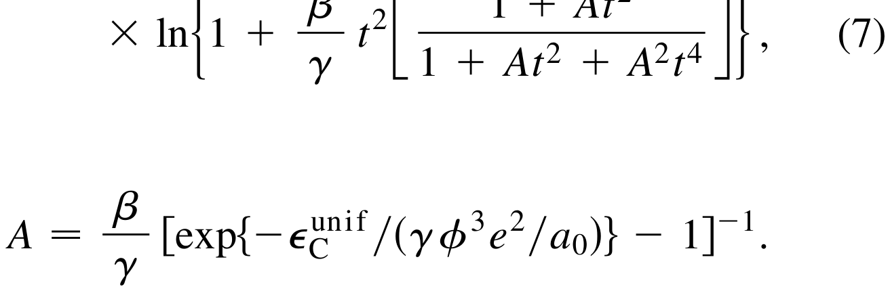
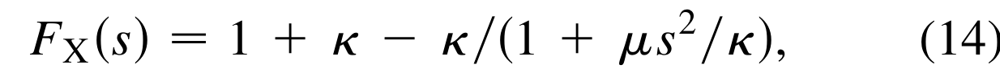

## perdewGeneralizedGradientApproximation1996a — 广义梯度近似简化（PBE 泛函）

## 📄 元数据
Perdew、Burke、Ernzerhof，1996，Physical Review Letters 77(18), 3865–3868，DOI 10.1103/PhysRevLett.77.3865
## 💡 一句话
从七个能量上关键的物理极限条件出发，推导出无经验参数、形式简洁的 PBE 广义梯度近似泛函，在保持与 PW91 同等精度的同时修正了其六大理论缺陷，成为后世 DFT 计算最广泛使用的标准泛函。
## 🔗 Wiki 双链
  - 概念 [[../concepts/density-functional-theory]]、[[../concepts/exchange-correlation-functional|交换-关联泛函]]、[[../concepts/generalized-gradient-approximation|广义梯度近似]]、[[../concepts/local-spin-density-approximation|局域自旋密度近似]]、[[../concepts/pbe-functional|PBE 泛函]]、[[../concepts/pw91-functional|PW91 泛函]]、[[../concepts/enhancement-factor|增强因子]]、[[../concepts/lieb-oxford-bound|Lieb-Oxford 界]]、[[../concepts/linear-response|线性响应]]、[[../concepts/uniform-electron-gas|均匀电子气]]、[[../concepts/self-interaction-error|自相互作用误差]]、[[../concepts/pseudopotential|赝势]]
  - 实体 [[../entities/VASP]]
  - 图表 [[../figures/mathematical-models]]、[[../figures/crystal-structures|晶体结构与原子排布]]、[[../figures/electronic-bands|电子能带与电子态]]、[[../figures/vibrational-spectra|振动能谱与声子谱]]
  - 年度 [[../write/1996]]
  - 项目 [[../projects/project-2-mn-multiferroics]]、[[../projects/project-4-ttf-molecular-calc]]、[[../projects/project-5-snte-ferroelectric-sim]]、[[../projects/project-7-cdw-charge-density-wave]]
  - 相关论文 [[../../raw/note/perdewGeneralizedGradientApproximation1996a]]
## 🆕 新概念/实体建议
  - 实体 `CADPAC`：Cambridge Analytical Derivatives Package，本文用于原子化能计算的量子化学程序。
## 📊 关键图表
  - 图1：PBE 与 PW91 增强因子 F_XC 随无量纲密度梯度 s 的对比，ζ=0 与 ζ=1 两种自旋极化情形 
  - 表I：20 个小分子原子化能，UHF/LSD/PW91/PBE 与实验值对比，平均绝对误差分别为 71.2/31.4/8.0/7.9 kcal/mol 
  - 公式(7)：关联能梯度修正项 H 的解析形式 
  - 公式(14)：交换增强因子 F_X(s)=1+κ−κ/(1+μs²/κ) 
## 🔬 项目连接
  - **project-2（Mn 多铁）**：strong。Mn 基多铁材料的 DFT 计算普遍以 PBE 或 PBE+U 为标准泛函；理解 PBE 的自相互作用误差、对过渡金属氧化物带隙低估和过度结合倾向，是判断何时需要加 U、加多大 U 的直接依据。论文对关联能梯度项 H 和交换增强因子的推导，有助于理解 +U 修正到底在补 PBE 的什么缺陷。
  - **project-4（TTF 分子计算）**：strong。PBE 是分子晶体 DFT 的主力泛函之一；表I 的小分子原子化能验证直接关系到分子内聚能/键能的可信度。论文同时明确承认半局域 GGA 无法描述范德华作用，这提示 TTF 等分子晶体计算必须在 PBE 基础上加色散修正（DFT-D/vdW-DF）。
  - **project-5（SnTe 铁电模拟）**：strong。SnTe 等铁电材料的结构弛豫、声子、Berry 相极化计算几乎都以 PBE 为默认泛函。PBE 相对 PW91 的核心改进之一——更平滑的交换-关联势——正是赝势构建和自洽收敛的关键；论文对线性响应条件的恢复也直接关系到软模/声子不稳定性的描述。PBE 略高估晶格常数的已知倾向可用于校正 SnTe 结构参数。
  - **project-7（CDW）**：strong。CDW 材料的 DFT 计算依赖 PBE 对结构能量差、能量势垒和晶格常数的描述；论文正文明确指出 GGA 相对 LSD 改进了总能量、原子化能、能量势垒和结构能量差，这正是判断 CDW 畸变稳定性所需的量。PBE 对带隙的低估也关系到 CDW 机制（能带嵌套 vs 激子）的解读。
  - project-1（双光子）、project-3（机械发光 NN）、project-6（湿度传感器）：无直接项目连接。
## 📝 组织与用词
文章采用"立靶—重构—验证"结构：先系统列出 PW91 的六大问题，再分别用三个物理极限条件构造关联能梯度项 H、用四个条件构造交换增强因子 F_X，最后用图1（定性）和表I（定量）验证。核心论证哲学是"奥卡姆剃刀"——只满足能量上重要的精确条件，牺牲形式上正确但能量上无关紧要的条件。值得复用的术语：
  - [[../concepts/correlation-energy|交换-关联能 exchange-correlation energy]] (E_XC)
  - [[../concepts/generalized-gradient-approximation|广义梯度近似 generalized gradient approximation]] ([[../concepts/gga-functional|GGA]])
  - [[../concepts/local-spin-density-approximation|局域自旋密度近似 local spin density]] (LSD/LDA)
  - 增强因子 enhancement factor F_X/F_XC
  - [[../concepts/linear-response|线性响应 linear response]]
  - [[../concepts/uniform-electron-gas|均匀电子气 uniform electron gas / jellium]]
  - [[../concepts/pseudopotential|赝势 pseudopotential]]
  - [[../concepts/lieb-oxford-bound|Lieb-Oxford 界 Lieb-Oxford bound]]
  - 原子化能 atomization energy
  - 无经验参数 parameter-free / nonempirical
## ✏️ 可写入 Wiki 的要点
  1. PBE 泛函形式：E^GGA_X=∫d³r n ε^unif_X(n) F_X(s)，其中 F_X(s)=1+κ−κ/(1+μs²/κ)，κ=0.804，μ=β(π²/3)≈0.21951；F_X(0)=1，s→∞ 时趋于 1+κ=1.804（Lieb-Oxford 界最紧限）。
  2. 关联能梯度项 H 的简洁解析式（公式7）由三个极限条件唯一约束：t→0 缓慢变化极限 H→(e²/a₀)βφ³t²（β≈0.066725）；t→∞ 快速变化极限 H→−ε^unif_C 使关联消失；高密度均匀缩放极限 H→(e²/a₀)γφ³ln t²（γ≈0.031091）以抵消 ε^unif_C 的对数奇点。
  3. PBE 相对 PW91 修正的关键缺陷：(i) 均匀电子气线性响应（条件 f，通过 μ=βπ²/3 使交换梯度系数与关联梯度系数精确抵消）；(ii) Levy 高密度均匀缩放下关联能趋于常数（条件 c）；(iii) 交换-关联势虚假振荡（参数无缝衔接，势更平滑，利于赝势构建）。
  4. PBE 所有非 LSD 参数均为基本物理常数，无经验拟合；κ=0.804 使 1+κ=1.804 恰好等于 Lieb-Oxford 界允许的最大值（最紧限选择），Becke 早期形式用经验值 κ=0.967、μ=0.235。
  5. 定量验证（表I）：20 个小分子原子化能平均绝对误差，UHF=71.2、LSD=31.4、PW91=8.0、PBE=7.9 kcal/mol；LSD 系统性过度结合（overbinding），PBE/PW91 将误差降低约一个数量级。
  6. 无量纲密度梯度 s=|∇n|/(2k_F n)，实际物理体系相关范围 0≤s≤3、0≤r_s/a₀≤10；s 增大时交换增强、关联减弱，价电子密度区（1≤r_s/a₀≤10）交换非局域性占主导，故 GGA 比 LSD 更偏好密度不均匀性。
  7. PBE 主动牺牲的 PW91 正确条件：(a) 缓慢变化极限下 E_X 和 E_C 的精确二阶梯度系数；(b) s→∞ 极限下 E_X 的非均匀缩放——作者论证这些对实际体系能量影响极小。
  8. 论文明确指出半局域形式（公式2）过于严格，无法再现精确泛函的全部已知行为，为后来 meta-GGA（引入动能密度 τ，如 TPSS、SCAN）和杂化泛函（PBE0）、范德华泛函（vdW-DF/DFT-D）的发展预留了方向。
  9. 已知 PBE 局限（论文及后续工作）：低估半导体/绝缘体带隙、略高估固体晶格常数（与 LSD 相反）、残存自相互作用误差、无法描述范德华色散作用、对强关联体系（莫特绝缘体、过渡金属氧化物）失效，需配 DFT+U、hybrid、GW 或色散修正。
  10. 论文承认公式(3)忽略了 ∇ζ（自旋极化梯度）修正，承诺后续工作推导；这是 PBE 构造中唯一显式标注的近似遗漏。
