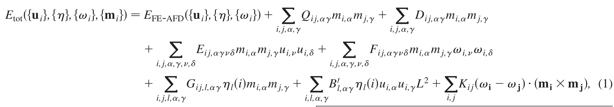
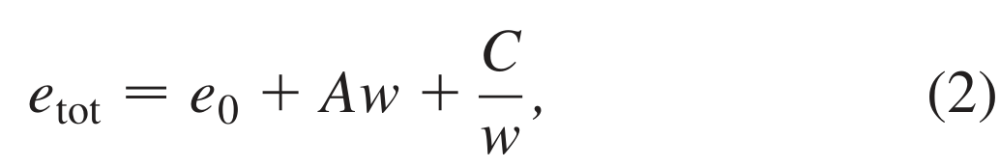

## prosandeevKittelLawInBiFeO3Ultrathin2010 — BiFeO3 超薄膜中的基特尔定律：基于第一性原理的研究

## 📄 元数据
S. Prosandeev, S. Lisenkov, L. Bellaiche et al.，2010，Physical Review Letters 105, 147603，DOI: 10.1103/PhysRevLett.105.147603
## 💡 一句话
用基于第一性原理的有效哈密顿量结合蒙特卡洛模拟证实 BFO 超薄膜（h ≳ 20 Å）规则 71° 条带畴遵循 Kittel 定律，但其微观驱动力由畴壁处氧八面体倾斜（AFD）短程相互作用与表面电偶极长程作用和磁电耦合的竞争所主导，与传统铁电/铁磁薄膜截然不同。
## 🔗 Wiki 双链
  - 概念 [[../concepts/multiferroicity]]、[[../concepts/magnetoelectric-coupling]]、[[../concepts/strain-engineering]]、[[../concepts/kittel-law|基特尔定律]]、[[../concepts/effective-hamiltonian|有效哈密顿量]]、[[../concepts/oxygen-octahedra-tilting|氧八面体倾斜]]、[[../concepts/domain-wall-energy|畴壁能]]、[[../concepts/depolarization-field]]、[[../concepts/open-circuit-boundary-conditions|开路电学边界条件]]、[[../concepts/real-space-energy-decomposition|实空间能量分解]]、[[../concepts/weak-ferromagnetism|弱铁磁性]]
  - 实体 [[../entities/BiFeO3]]、[[../concepts/domain-wall]]、[[../entities/BaTiO3|BaTiO₃]]、[[../entities/PZT|PZT]]、[[../entities/PbTiO3|PbTiO₃]]
  - 图表 [[../concepts/domain-wall]]、[[../figures/mathematical-models]]
  - 年度 [[../write/2010]]
  - 项目 [[../projects/project-2-mn-multiferroics]]、[[../projects/project-5-snte-ferroelectric-sim]]
  - 相关论文 [[../../raw/note/prosandeevKittelLawInBiFeO3Ultrathin2010]]
## 🆕 新概念/实体建议
  - [[../concepts/kittel-law|kittel-law]]（基特尔定律）：铁性薄膜中条带畴宽 w ∝ √h 的经典标度律，源自畴壁能（∝1/w）与长程场能（∝w）的竞争。
  - [[../concepts/effective-hamiltonian|effective-hamiltonian]]（有效哈密顿量方法）：从第一性原理提取参数、粗粒化至 u_i、ω_i、m_i、η 等关键自由度的经典能量模型，可对上万原子超胞做有限温度蒙特卡洛。
  - [[../concepts/oxygen-octahedra-tilting|oxygen-octahedra-tilting]]（氧八面体倾斜/AFD）：钙钛矿中相邻氧八面体反相旋转的结构自由度；本文揭示其短程相互作用在 BFO 中替代电偶极短程作用成为畴壁能主因。
  - [[../concepts/domain-wall-energy|domain-wall-energy]]（畴壁能）：形成单位面积畴壁所需能量，传统上对应 Kittel 公式中的 C/w 项。
  - [[../concepts/depolarization-field]]（退极化场）：开路边界下表面束缚电荷产生的反向电场，对应 Kittel 模型中的杂散场能。
  - [[../concepts/open-circuit-boundary-conditions|open-circuit-boundary-conditions]]（开路电学边界条件）：表面无自由电荷补偿的边界，存在退极化场，区别于短路（理想电极）条件。
  - [[../concepts/real-space-energy-decomposition|real-space-energy-decomposition]]（实空间逐点能量分解）：本文首创的分析方法，将每项能量按格点投影，从而在原子尺度定位其空间来源（畴壁 vs 表面）。
## 📊 关键图表
  -  -> [[../figures/domain-walls-structures|畴结构与畴壁]]
  - **图示描述**：8 nm 厚、1.5% 压应变的 (001) BFO 超薄膜在 10 K 蒙特卡洛平衡态下的 (X,Z) 截面矢量图；(a) 箭头为局域软模 u_i（即局域铁电偶极方向与大小），(b) 箭头为反铁畸变矢量 ξ_i=ω_i e^{ik·r_i}（氧八面体倾斜轴与倾角）。
  - **关键特征**：沿 [100] 交替出现"上/下"71° 纳米条带畴；畴内（远离上下各 4 层 (001) B 层）u_i 与 ξ_i 共同沿 [uuv]（up，v>u）或 [uu-v̄]（down）取向，方向一致来自压应变；上下表面四层内 u_i 与 ξ_i 卷曲形成 flux-closure 涡旋，无净面外极化以消除退极化场；每个畴内除 G 型反铁磁外还存在约 0.03 μ_B 的弱铁磁矢量，方向在 up/down 畴间翻转（倾向垂直 ξ_i）。
  - **结论/意义**：直观界定了后续能量分解所讨论的"规则直壁条带畴"，并展示其同时具备 Landau–Lifshitz 型表面磁通闭合与 Kittel 型直壁特征。
  -  -> [[../figures/domain-walls-structures|畴结构与畴壁]]
  - **图示描述**：揭示 Kittel 定律及其微观起源的六联图；(a) h=20 薄膜每 5 原子胞总内能 e_tot（mHa）对畴周期 w（晶格常数）的散点与 e_tot=e0+Aw+C/w 拟合；(b)–(c) 分项能量密度对 w 的依赖；(d)–(f) 平衡畴周期及拟合系数对膜厚 h 的依赖。
  - **关键特征**：(a) 散点呈碗形且被公式(2)精确拟合，最低点即 w_e；(b) AFD 短程相互作用能密度 e_AFD,SR 随 1/w 下降，是 C/w 项主因（约为短程偶极能代价的两倍，短程偶极的正 1/w 贡献被电偶极局域自能的负 1/w 几乎抵消）；(c) 电偶极-偶极长程能与磁电耦合能（公式(1)含 E_ij 项）均随 w 线性增长，构成 Aw 项；(d) h>5（约 20 Å）时 w_e²∝h，斜率约 31（以 5 原子胞晶格常数为单位，PZT 对比值约 20），h<3 时条带畴消失、h=1 转为纯 AFD 态；(e) h>5 时 1/A∝h，即 A=A0/(h−h0)，h0≈1.5 晶格常数；(f) C≈C0 与厚度无关；由 w_e=√(C/A)=√(C0(h−h0)/A0) 给出 w_e∝√h，且 C0/A0≈31 与 (d) 斜率自洽。
  - **结论/意义**：在临界厚度 h≈20 Å 以上严格证实 Kittel 定律，并通过系数厚度依赖从唯象层面锁定了"1/w 来自 AFD、w 来自偶极长程与磁电耦合"的非传统机制。
  -  -> [[../figures/domain-walls-structures|畴结构与畴壁]]
  - **图示描述**：h=20 薄膜在平衡畴周期 w_e 下的 (X,Z) 截面逐点能量密度热图，亮色代表能量代价高；(a) AFD 短程相互作用能、(b) 电偶极-偶极长程相互作用能、(c) 磁电耦合相互作用能。
  - **关键特征**：(a) e_AFD,SR 高值贯穿整个膜厚、强烈局域在畴壁处，微观解释了其 1/w 依赖（畴壁密度 ∝1/w）；(b) 电偶极长程能高值集中在上下表面、远离畴壁的畴内部，对应 Kittel 模型的杂散场/退极化场；(c) 磁电耦合能同样集中在表面远离畴壁处，原因是表面局域电偶极幅度最小（见图1(a)），从而改变 E_ij 耦合代价。
  - **结论/意义**：将抽象的"1/w 项"和"w 项"分别定位到原子尺度的畴壁与表面，是多铁 BFO 中 Kittel 定律非传统微观起源最直接的视觉证据，也示范了实空间逐点能量分解方法。
  -  -> [[../figures/mathematical-models-magnetoelectric|磁电耦合与多铁理论]]
  - **图示描述**：本文所用基于第一性原理参数化的有效哈密顿量 E_tot({u_i},{η},{ω_i},{m_i})，自由度为局域软模 u_i、应变 η、氧八面体倾斜 ω_i 与磁矩 m_i（|m_i|=4 μ_B）。
  - **关键特征**：共八项——E_FE-AFD（铁电/应变/AFD 及其耦合，长程偶极矩阵替换为开路边界下的二维形式）、磁偶极-偶极 Q_ij、磁交换 D_ij、软模-磁交换双二次耦合 E_ij（磁电耦合）、AFD-磁交换耦合 F_ij、应变-磁交换耦合 G_ij、应变-软模双二次项 B_0l（再现应变下极化）、以及 K_ij(ω_i−ω_j)·(m_i×m_j) 型 Dzyaloshinskii–Moriya 项（再现弱铁磁性）；j 对 Fe 位点 i 取第一至第三近邻，唯磁偶极项取所有 Fe 位点、DM 项仅取最近邻。
  - **结论/意义**：这是支撑全部蒙特卡洛与能量分解的模型基础，其中 E_ij 磁电项与 AFD 短程项正是图2、图3中新机制的来源。
  -  -> [[../figures/mathematical-models-formulas|光学、输运与其他解析公式]]
  - **图示描述**：Landau–Lifshitz–Kittel 唯象能量密度表达式，每 5 原子胞总能 e_tot=e0+Aw+C/w，其中 w 为畴周期，e0、A、C 对给定膜厚为常数。
  - **关键特征**：C/w 为畴壁能项（随畴细化而升高），Aw 为长程场/表面能项（随畴变大而升高）；对 w 求极小得平衡周期 w_e=√(C/A)；结合 h>5 时 A=A0/(h−h0)、C=C0，推得 w_e=√(C0(h−h0)/A0)∝√h，即 Kittel 定律；数值上 C0/A0≈31 晶格常数，与 w_e²-h 斜率一致。
  - **结论/意义**：公式(2)是连接原子尺度模拟与经典标度律的桥梁，本文证明其在 BFO 超薄膜中形式成立但 A、C 的物理内涵已被 AFD 与磁电耦合替换。

## 🔬 项目连接
  - **project-2（Mn 多铁）— core**：本文是 BiFeO3 多铁畴物理的核心机理论文，直接演示了多铁体系中铁电（u_i）、反铁畸变（ω_i）、G 型反铁磁与弱铁磁（m_i，约 0.03 μB）四套自由度及其磁电耦合如何共同决定畴结构；其有效哈密顿量中 E_ij、F_ij、G_ij、K_ij（Dzyaloshinskii-Moriya 型）等耦合项的构造方式，对 Mn 基多铁（如 MnVO3、SrMnO3 等）的磁电耦合建模有直接范本价值。
  - **project-5（SnTe 铁电模拟）— medium**：Kittel 定律本身是铁电薄膜畴标度的基础理论，本文给出的 w_e = √(C0(h-h0)/A0) 推导、开路边界下二维长程偶极矩阵的处理、以及实空间逐点能量分解方法，可直接迁移到 SnTe 薄膜/纳米片畴结构模拟中，用于判断畴宽-厚度关系并定位畴壁能与表面能的微观来源；1.5% 压应变迫使 u_i、ξ_i 沿 ⟨uuv⟩ 的结果也提示应力度对铁电方向的调控。
## 🔗 项目双链
- 项目 [[../projects/project-2-mn-multiferroics|项目二：Mn极化结构铁电材料]]
- 项目 [[../projects/project-5-snte-ferroelectric-sim|项目五：lammps势函数SnTe铁电模拟]]

## 📝 组织与用词
  - 论证结构遵循"争议提出 → 有效哈密顿量建模 → 蒙特卡洛求平衡畴 → Kittel 唯象拟合 → 系数厚度依赖 → 实空间能量分解定位微观机制"，层次非常清晰，是 PRL 式"现象验证+机制颠覆"的典范。
  - 关键术语：
    - Kittel law（基特尔定律）：w ∝ √h
    - straight-walled / stripe domains（直壁/条带畴）
    - 71° domains（71°畴，相邻 ⟨111⟩ 极化方向夹角）
    - effective Hamiltonian（有效哈密顿量）
    - local soft mode u_i（局域软模）
    - antiferrodistortive (AFD) motion / oxygen octahedra tilting ω_i（反铁畸变/氧八面体倾斜）
    - open-circuit (OC) electrical boundary conditions（开路电学边界条件）
    - site-by-site / real-space energetic decomposition（逐点/实空间能量分解）
    - flux-closure vortices（磁通闭合涡旋）
    - weak ferromagnetism（弱铁磁性，由 Dzyaloshinskii-Moriya 型 K_ij(ω_i−ω_j)·(m_i×m_j) 项产生）
## ✏️ 可写入 Wiki 的要点
  1. BFO(001) 超薄膜在 1.5% 压应变、开路边界、T=10 K 下形成沿 [100] 交替的"上/下"71° 纳米条带畴；畴内 u_i 与 ξ_i 均沿 [uuv]（v>u），表面四层内偶极和 AFD 矢量形成涡旋以消除面外极化与[[../concepts/depolarization-field|退极化场]]。
  2. 除 G 型反铁磁矢量外，每个畴内还存在约 0.03 μB 的弱铁磁矢量，其方向在 up/down 畴间翻转，原因是弱 FM 矢量倾向于垂直 ξ_i，而 ξ_i 在畴间旋转。
  3. 当 h>5（约 20 Å）时 w_e²∝h，斜率约 31（以 5 原子胞晶格常数为单位），严格遵循 [[../concepts/kittel-law]]；h<3 时条带畴消失（h=1 转为纯 AFD 态）。临界厚度与 PZT、PbTiO3 铁电薄膜（h≈3）同量级。
  4. 总能可用 e_tot=e0+Aw+C/w 精确拟合；对 h>5 有 1/A∝h（即 A=A0/(h−h0)，h0≈1.5 晶格常数）且 C≈C0 为常数；由 ∂E/∂w=0 得 w_e=√(C/A)=√(C0(h−h0)/A0)，且 C0/A0≈31，与 w_e²-h 斜率自洽。
  5. 颠覆性机制：1/w 项的主要贡献并非短程电偶极相互作用，而是 AFD（[[../concepts/oxygen-octahedra-tilting|氧八面体倾斜]]）短程相互作用 e_AFD,SR；短程偶极能的正 1/w 贡献几乎被电偶极局域自能的负 1/w 贡献完全抵消。AFD 短程能在数值上约为短程偶极能的两倍。
  6. w 项的两个主要贡献是：(i) 电偶极-偶极长程相互作用（对应 Kittel 模型中的杂散场）；(ii) 磁电相互作用能（公式(1)中含 E_ij 的双二次项），后者是多铁材料独有的新贡献。
  7. 实空间逐点分解显示：AFD 短程能在贯穿整个膜厚的畴壁内显著升高；电偶极长程能与[[../concepts/magnetoelectric-coupling|磁电耦合]]能则集中在上下表面、远离畴壁的畴内部；磁电耦合能集中在表面是因为该处局域电偶极幅度最小。
  8. [[../concepts/effective-hamiltonian|有效哈密顿量]]公式(1)共 8 项：E_FE-AFD（铁电、应变、AFD 及其耦合，长程偶极矩阵替换为二维 OC 形式）、磁偶极-偶极、磁交换、软模-磁交换耦合（E_ij）、AFD-磁交换耦合（F_ij）、应变-磁交换耦合（G_ij）、应变-软模双二次项（B_0l，再现应变下极化行为）、以及 (ω_i−ω_j)·(m_i×m_j) 型 Dzyaloshinskii-Moriya 项（K_ij，再现[[../concepts/weak-ferromagnetism|弱铁磁性]]）。
  9. 方法学意义：基于第一性原理参数化的有效哈密顿量 + 蒙特卡洛（最多 10⁶ sweeps）可处理 Nx×Ny×h 超胞（h=1–20，即约 4–80 Å），并通过逐点能量分解将宏观标度律映射到原子尺度的空间位置，这一分析范式可推广到其他复杂铁性/多铁体系。
  10. 与实验的关系：解释了 Catalan et al. (PRL 2008) 观察到的偏离 Kittel 定律现象源于分形/不规则畴而非材料本征；预测与 Huang et al. (PRB 2009) 关于 109° 畴的稀少线性数据一致；低生长速率下分形态可转变为直壁畴（H. Béa 私人通讯）。
