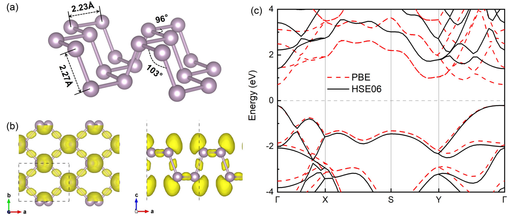
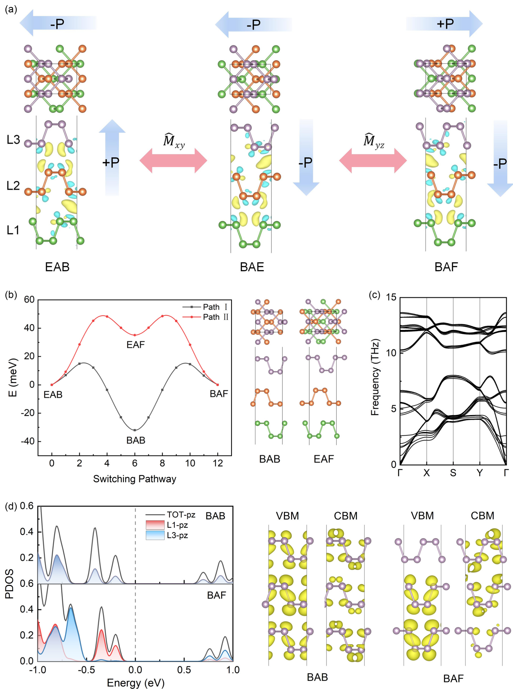
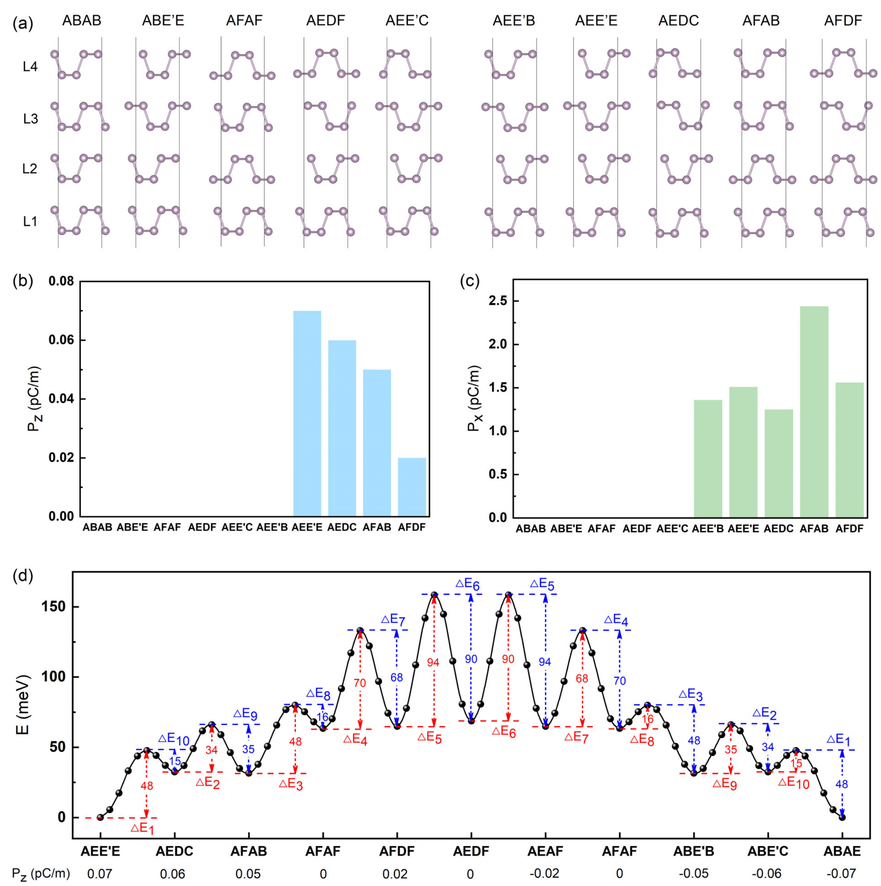
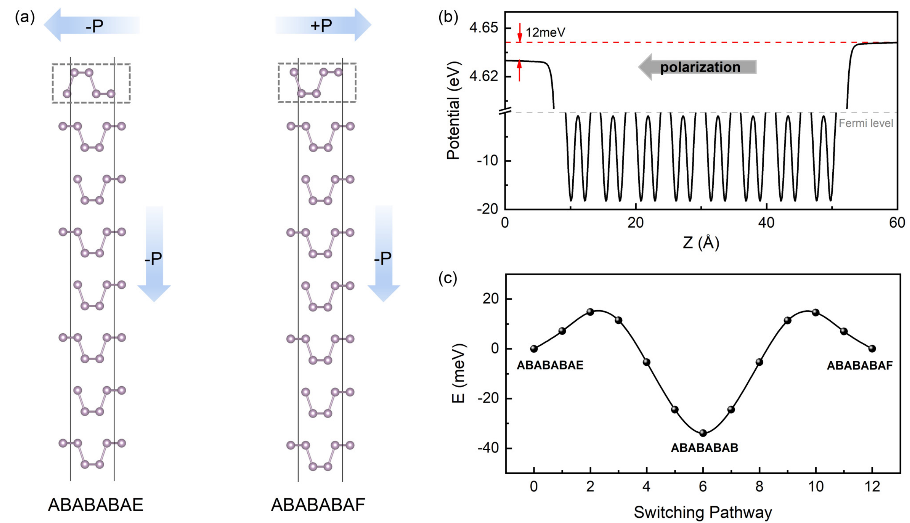

## shenEmergenceMultipleFerroelectric2025 — 多层黑磷中多铁电态的出现（Emergence of multiple ferroelectric states in multilayer black phosphorus）

## 📄 元数据
Wanping Shen, Jinbo Shen, Fang Wang, Yunhao Lu et al.，2025，Physical Review B 111, 115429，DOI: 10.1103/PhysRevB.111.115429
## 💡 一句话
通过第一性原理计算预言层数 N≥3 的多层黑磷可借助非对称层间堆叠（如 EAB）打破中心对称，产生可由层间滑移翻转的滑移铁电性，并随层数增加涌现多种可互转的极化态，为单质多层材料中的多态非易失存储提供新平台。

## 🔗 Wiki 双链
  - 概念 [[../concepts/sliding-ferroelectricity]]
  - 概念 [[../concepts/2D-materials]]
  - 概念 [[../concepts/density-functional-theory]]
  - 概念 [[../concepts/berry-phase]]
  - 概念 [[../concepts/polarization-switching]]
  - 概念 [[../concepts/moire-superlattice]]
  - 概念 [[../concepts/elemental-ferroelectrics|单质铁电材料]]
  - 概念 [[../concepts/interlayer-dipole-coupling|层间偶极耦合]]
  - 概念 [[../concepts/multistate-memory|多态存储]]
  - 概念 [[../concepts/black-phosphorus|黑磷 (概念)]]
  - 实体 [[../entities/VASP]]
  - 实体 [[../entities/h-BN]]
  - 实体 [[../entities/TMDs]]
  - 实体 [[../entities/WTe2]]
  - 实体 [[../entities/In2Se3]]
  - 实体 [[../entities/SnTe]]
  - 实体 [[../entities/black-phosphorus|黑磷 (BP)]]
  - 图表 [[../figures/crystal-structures]]
  - 图表 [[../figures/electronic-bands]]
  - 图表 [[../figures/heterostructures-stacking]]
  - 图表 [[../figures/heterostructures-stacking-multiferroic|多铁与磁电异质结 (Multiferroic & Magnetoelectric Heterostructures)]]
  - 图表 [[../figures/domain-walls]]
  - 年度 [[../write/2025]]
  - 相关论文 [[../../raw/note/shenEmergenceMultipleFerroelectric2025]]

## 📊 关键图表
  -  → [[../figures/heterostructures-stacking-multiferroic|多铁与磁电异质结]]
  -  → [[../figures/heterostructures-stacking-multiferroic|多铁与磁电异质结]]
  -  → [[../figures/heterostructures-stacking-multiferroic|多铁与磁电异质结]]
  -  → [[../figures/heterostructures-stacking-multiferroic|多铁与磁电异质结]]
  -  → [[../figures/heterostructures-stacking-multiferroic|多铁与磁电异质结]]
  -  → [[../figures/heterostructures-stacking-multiferroic|多铁与磁电异质结]]

## 🔬 项目连接
无直接项目连接。与 project-5（SnTe 铁电模拟）在"二维单质/IV–VI族铁电、滑移/面内极化、低翻转势垒"主题上相邻，可作为方法与物理图像参考；与 project-2（Mn 多铁）无直接关系（本文为纯铁电、非多铁）。

## 📝 组织与用词
论文采用"问题提出（单层/双层无极化）→ 三层破缺 → 四层多态 → 厚板表面可操控"的递进式论证，每一步都以能量、Berry 相位极化、CI-NEB 势垒、声子稳定性四件套证据闭环；方法上以双层势能面为"地图"将 N 层堆叠降维成相邻双层堆叠的组合穷举，并通过 PDOS/差分电荷密度给出微观电荷转移图像；最后用厚板模型桥接实验（STM/AFM 针尖电场）。值得复用的术语：
  - 滑移铁电性（[[../concepts/sliding-ferroelectricity|sliding ferroelectricity]]）
  - 单质铁电材料（elemental ferroelectric materials）
  - 层间偶极耦合（[[../concepts/interlayer-dipole-coupling|interlayer dipole coupling]]）
  - 反演对称破缺（[[../concepts/inversion-symmetry-breaking|inversion symmetry breaking]]）
  - Berry 相位法（[[../concepts/berry-phase|Berry phase method]]）
  - CI-NEB 翻转路径（climbing-image nudged elastic band switching pathway）
  - 多态/忆阻开关（multistate / memristive switching）
  - 表面层位移（surface-layer displacement）

  - [[../concepts/CINEB|CINEB]]
  - [[../concepts/elemental-ferroelectrics|elemental-ferroelectrics]]
## ✏️ 可写入 Wiki 的要点
  1. 单层 BP 晶格常数 a=4.58 Å、b=3.32 Å，sp³ 杂化形成褶皱蜂窝结构（P-P 键 2.23/2.27 Å，键角 96°/103°），空间群 Pmna 中心对称；GGA-PBE/HSE06 直接带隙分别为 0.91/1.61 eV（Γ 点），天然无铁电性。
  2. 双层 BP 二维势能面上仅有 AB（基态，Pbcm）、AE 和 AF（能量简并，P2/m，由 AA 平移约 ±0.28a 得到）三个稳定极小值；所有双层堆叠仍保持中心对称、极化皆为零，但不同堆叠的化学势不同，为多层电荷转移埋下伏笔。
  3. 与三层石墨烯只有 AAA/ABA/ABC 三种堆叠、四层才出现面外极化不同，BP 因相邻层存在 AB/AE/AF 等更多种稳定堆叠，仅需三层即可打破反演对称：EAB 堆叠（空间群 Pm）由 AB+AE 组合而成，能量仅比基态 BAB 高约 40 meV，面外极化 0.06 pC/m、面内极化 1.32 pC/m。
  4. 微观机制：BAF 堆叠中 L1 的 pz 轨道主要贡献价带顶、L3 的 pz 轨道主要贡献导带底，差分电荷密度 Δρ=ρ_TOT−ρ_L1−ρ_L2−ρ_L3 显示层间电荷定向转移，形成垂直电偶极矩；不同堆叠改变孤对电子重叠与 π–π 作用距离，从而调控偶极强度。
  5. 三层 EAB 的声子谱在整个布里渊区无虚频，动力学稳定；EAB↔BAE（M̂_xy 镜像，面外极化反向）和 BAE↔BAF（M̂_yz 镜像，面内极化反向）可经 BAB/EAF 中间态通过层间滑移互转，CI-NEB 两条路径势垒均约 48 meV，支持室温低功耗可逆翻转。
  6. 铁电极化还可调制激子：BAF 中 Γ 点 VBM–CBM 跃迁偶极矩平方为 202.4 Debye²，显著低于非极性 BAB 的 387.6 Debye²；因辐射寿命反比于 |TDM|²，极化有望延长激子寿命，提示铁电-激子耦合应用。
  7. 四层 BP 中相邻层取 AB/AE(AF) 组合时穷举出大量构型，其中 ABAB、ABE'E、AFAF、AEDF、AEE'C 仍中心对称，其余结构面外极化 0.02–0.07 pC/m、面内极化 1.25–2.44 pC/m；从最大正极化态 AEE'E 到最大负极化态 ABAE 经 AEDC→AFAB→AFDF→AEDF（中心对称）→AEAF→ABE'B→ABE'C 的逐级滑移，势垒 15–94 meV，构成多态可逆开关。
  8. 面外铁电性判据明确：堆叠构型既无反演对称（Î）又无 M̂_xy 镜面对称时即存在面外极化；将某层沿 b 方向平移半个晶格即可在平行/反平行堆叠间切换，因此多层 BP 所有堆叠构型原则上都能通过层间滑移互通。
  9. 八层 BP 厚板仅位移顶层约 (±0.28, 0.5) 即可产生 0.12 pC/m 面外极化和 1.53 pC/m 面内极化，上下表面真空能级差 12 meV（面外极化的直接静电学证据），翻转势垒约 49 meV；位移多个表面层可同时改变极化方向与大小，而单移顶层时面外方向保持不变——为导电 STM/AFM 针尖电场写入/读取小铁电畴提供了可操作路径。
  10. 计算方法栈：VASP + GGA-PBE 弛豫（截断能 500 eV，11×15×1 k 点，力收敛 1 meV/Å，能量收敛 10⁻⁷ eV）+ OptB88-vdW 层间修正 + HSE06（272 eV，7×9×1）算电子结构与极化，DS-PAW 算声子，Berry 相位算极化，CI-NEB 搜翻转路径；真空层 >20 Å，a/b 轴分别对应扶手椅/锯齿方向。
