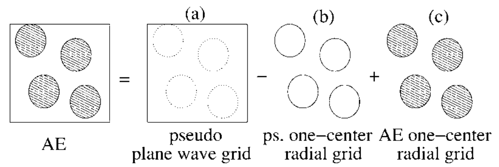
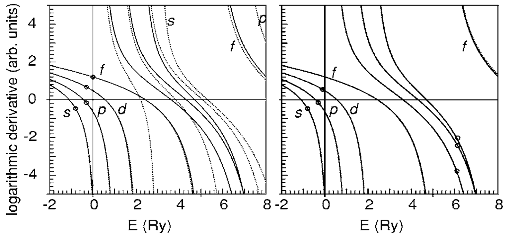

## shishkinImplementationPerformanceFrequencydependentGWmethod2006 — PAW框架下频率相关GW方法的实现与性能

## 📄 元数据
M. Shishkin, G. Kresse，2006，Physical Review B 74, 035101，DOI: 10.1103/PhysRevB.74.035101
## 💡 一句话
在VASP的PAW框架内实现了全频率依赖的G₀W₀计算，利用谱表示与Hilbert/Kramers-Kronig变换将计算成本降至仅约为静态计算的两倍，并以HF水平处理芯-价相互作用，使含d电子材料的准粒子能量计算既快又准。

## 🔗 Wiki 双链
  - 概念 [[../concepts/density-functional-theory]]
  - 实体 [[../entities/VASP]]
  - 实体 [[../entities/GaAs]]
  - 图表 [[../figures/electronic-bands]]
  - 图表 [[../figures/mathematical-models]]
  - 年度 [[../write/2006]]
  - 相关论文 [[../../raw/note/shishkinImplementationPerformanceFrequencydependentGWmethod2006]]

## 🆕 新概念/实体建议
  - `gw-approximation`（GW近似）：基于Green函数G与动态屏蔽库仑相互作用W的多体微扰方法，用于精确计算准粒子能量与激发谱；本文是VASP中GW模块的奠基性实现论文。
  - `paw-method`（投影缀加波方法，Projector Augmented Wave）：Blöchl提出的全势方法，通过加性缀加在平面波网格上处理平滑赝量、在原子球内修正成全电子量，兼具赝势效率与全电子精度。
  - `quasiparticle-energy`（准粒子能量）：多体体系中单粒子激发的重整化能量，对应ARPES等实验可测量；G₀W₀通过求解含自能Σ的非线性本征方程获得。
  - `self-energy`（自能算符Σ）：GW中描述多体效应的非局域、能量相关算符，Σ=iGW；其虚部给出准粒子寿命。
  - `plasmon-pole-model`（等离激元极点模型）：早期GW对介电函数频率依赖的简化模型，仅适用于sp材料且无法给出寿命/谱函数。
  - `spectral-representation-hilbert-transform`（谱表示与Hilbert变换）：将极化率/自能的频率依赖通过一次遍历占据-非占据态对建立谱函数，再用Kramers-Kronig变换合成任意频率响应，是本文加速算法的核心。
  - `core-valence-interaction`（芯-价相互作用）：芯电子与价电子间的交换关联贡献；本文证明在HF水平处理比LDA更精确且收敛更快，是PAW相对赝势的关键优势。
  - 实体 `silicon`（硅，Si）：本文sp材料基准，G₀W₀间接带隙X₁c≈1.15-1.17 eV。
  - 实体 `cadmium-sulfide`（硫化镉，CdS）：含Cd 4d电子的II-VI半导体，d带位于价带内，p-d杂化使4p解冻影响带隙。
  - 实体 `troullier-martins-pseudopotential`（TM模守恒赝势）：对比基准，在1 Ry以上散射性质偏离全电子结果，导致GW带隙偏大0.1-0.2 eV。

## 📊 关键图表
  -  -> [[../figures/experimental-setups|实验测试与测量装置]]
  - 
  - 表I（tab_15）：Si/Ga/As/Cd/S各PAW势的芯半径rc(a.u.)、截断能E(eV)、价态配置、频率点数N。
  - 表II（tab_25）：Si的LDA与G₀W₀准粒子能量，对比TM赝势、PAW、Si-2p解冻、FP-LMTO、FLAPW及实验值。
  - 表III（tab_41）：GaAs的准粒子能量，系统比较Ga/Ga-3d/Ga-3pd势及LDA vs HF芯-价处理。
  - 表IV：CdS准粒子能量（Cd-4d/Cd-4pd/Cd-4spd，仅HF芯-价处理）。
  - 表V：计算耗时（双Opteron 250，160能带，6×6×6 k点）：Si 3500 s，Ga-3d As 8700 s，Cd-4d S 10600 s，Cd-4pd S 19000 s。

## 🔬 项目连接
无直接项目连接。本文是GW计算方法学论文，属topic Z01-材料模拟计算设计；可作为project-4（TTF分子计算）及未来任何需要高精度准粒子能带/带隙计算的方法论参考。

## 🔗 项目双链
- 项目 [[../projects/project-4-ttf-molecular-calc|项目四：lsl老师的ttf分子计算]]

## 📝 组织与用词
文章按"方法动机（DFT带隙不准、GW成本高、d电子难处理）→ PAW形式体系（加性缀加、准粒子方程、介电矩阵、自能、单中心项HF近似、芯-价HF处理）→ 谱表示加速算法（极化率Hilbert变换、自能屏蔽双电子积分插值）→ Si/GaAs/CdS三材料系统验证（逐步解冻芯壳层、LDA vs HF芯-价对标全电子与赝势文献）→ 结论与耗时"组织。论证核心链条：PAW球内自能用HF近似误差<0.02 eV，平面波项精确处理；谱表示使全频率GW计算量约为静态2倍；HF处理芯-价相互作用是含d电子体系收敛的关键。值得复用的术语：
  - 准粒子能量（[[../concepts/quasiparticle-energy|quasiparticle energy]]）
  - G₀W₀单次近似（single-shot G₀W₀）
  - 投影缀加波（PAW, projector augmented wave）
  - 加性缀加（[[../concepts/additive-augmentation|additive augmentation]]）
  - 谱表示（spectral representation）
  - Hilbert/Kramers-Kronig变换（Hilbert/Kramers-Kronig transform）
  - 芯-价相互作用（[[../concepts/core-valence-interaction|core-valence interaction]]）
  - 单中心项（one-center term）
  - 动态屏蔽库仑相互作用（dynamically screened Coulomb interaction W）

  - [[../concepts/gw-approximation|gw-approximation]]
  - [[../concepts/spectral-representation-hilbert-transform|spectral-representation-hilbert-transform]]
  - [[../concepts/paw-method|paw-method]]
## ✏️ 可写入 Wiki 的要点
  1. **算法加速核心**：极化率χ₀的谱函数S(ω)（Eq.16）只需对所有占据-未占据态对遍历一次，每对仅在ω=ε_{n'k-q}-ε_{nk}处贡献；再经Hilbert变换（Eq.18）得到任意频率的χ₀(ω)，计算量与频率网格密度无关，恰为静态计算的两倍。该思想进一步扩展到自能：对屏蔽双电子积分S±(Eq.23-24)在两最近频率点线性插值(Eq.25)，使QP位移计算量同样约为静态GW的两倍。
  2. **PAW球内HF近似**：对PAW球内单中心项，直接用Hartree-Fock哈密顿量近似GW哈密顿量（假设球内介电矩阵对角且等于1，即无屏蔽）。物理依据：赝波函数与AE波函数差异仅在大G矢量处，而ε_{G,G'}在高G快速趋于δ_{G-G'}，W→v（裸库仑），故GW自能→Fock交换。Si芯半径从1.9减至1.6 a.u.、Cd 4s从2.3减至1.6 a.u.时QP位移变化<0.02 eV，验证了近似的鲁棒性；但作者明确指出过渡金属氧化物/镧系氧化物可能不适用。
  3. **交换[[../concepts/charge-density|电荷密度]]构造（Eq.9）**：不同于Arnaud & Alouani将单中心AE-赝电荷差作Fourier展开加到平面波网格的做法，本文采用Blöchl原始PAW Hartree处理方式——加[[../concepts/compensation-charge|补偿电荷]]Q̂^ij_LM以恢复AE电荷密度的正确多极矩。该构造即使在小基组（100-200平面波）下也守恒球内多极矩，避免了Arnaud方法在有限基组下范数/多极矩不守恒的问题。
  4. **芯-价HF处理是PAW核心优势**：在GW层面，芯-价[[../concepts/exchange-interaction|交换作用]]应使用HF而非LDA，因为短波区W→v、GW自能→Fock交换。Eq.15在PAW球内直接计算全电子芯-价交换积分。赝势方法因芯区价波函数无物理意义而无法做HF芯-价处理。GaAs中仅解冻Ga 3d并用HF芯-价处理即得收敛带隙1.26 eV；若用LDA处理则需解冻至3s才能接近HF结果，计算成本不可接受。
  5. **Si基准结果**：PAW(G₀W₀,HF芯-价)间接带隙Γ₂₅v→X₁c为1.15 eV（250能带时1.16-1.17 eV），实验值1.25 eV。TM[[../concepts/norm-conserving-pseudopotential|模守恒赝势]]给出1.33 eV，偏高约0.18 eV；误差约一半来自LDA芯-价处理，另一半来自TM势在>1 Ry高能区散射性质偏差（s波尤其明显，使高能导带被过强束缚）及芯区价波函数描述不准。解冻Si 2p仅使带隙减小0.015 eV。本文值与Friedrich等增广局域轨道的FLAPW结果（1.15-1.17 eV）一致，纠正了早期FP-LMTO的0.98 eV（线性化基组不足以描述高导带）。
  6. **GaAs中p-d交换屏蔽机制**：Ga 3d为价电子时，若3p在芯中，3p-3d间为裸HF交换；将3p解冻为价电子后，该交换被价电子屏蔽，3d态上移（但不影响价带顶和带隙）。HF芯-价处理下Ga-3d与Ga-3pd带隙几乎一致（Γ₁₅c: 1.26 vs 1.28 eV）；LDA芯-价处理下即使解冻3p仍偏离AE结果，必须解冻3s才收敛。LDA把3d当芯时带隙仅0.93 eV，HF处理则改善至1.38 eV。
  7. **CdS中d带位于价带内的p-d杂化**：Cd 4d位于价带内（约-8 eV），精确位置直接影响带隙。仅4d为价时d带在-8.35 eV、带隙1.92 eV；解冻4p后d带上移至-8.19 eV、带隙降至1.82 eV；继续解冻4s结果不变。机制：4p在芯中时4p-4d交换未屏蔽，d态被束缚过紧；4p解冻后交换被屏蔽，d态上移，经p-d杂化改变价带顶。Cd-4pd与Cd-4spd一致说明解冻至4p即收敛。
  8. **PAW势构造要点**：为GW专门构造的PAW势需在高能区精确再现原子散射性质（图2）：对s/p/d每个角动量使用两个分波/投影子（一个价带内、一个约真空能级以上6 Ry），并加入d投影子。常规VASP标准PAW势无此高能精度。响应函数/W的平面波截断取250 eV即可（[[../concepts/dielectric-function|介电函数]]对角分量已收敛至1），交换积分使用更大截断。所有计算用160能带、6×6×6 Γ中心k网格、0.1 eV复位移。
  9. **计算效率数据**：默认设置（160能带、6×6×6 k点、双Opteron 250）下Si约3500 s、GaAs约8700 s、CdS(Cd-4pd)约19000 s。优化参数（100频率点、响应函数截断150 eV）后Si可在900 s内完成且误差<0.01 eV；用4×4×4 k点和100能带仅需100 s，价带顶/导带底误差<0.02 eV。类似设置下64原子Si超胞在4个Opteron节点上不到一天可完成，使杂质能级和带阶的系统研究成为可能。
  10. **G₀W₀的系统偏差与未来方向**：本文所有材料的G₀W₀带隙均系统性小于实验值（Si 1.16 vs 1.25 eV，GaAs 1.26 vs 1.52 eV，CdS 1.81 vs 2.48 eV），作者明确指出这"强化了需要超越G₀W₀"的论点（指向自洽GW、顶点修正、BSE）。球内单中心项未来可改用乘积基组精确描述介电函数，甚至加入组态相互作用(CI)等量子化学处理。算法上提到可在Hilbert变换中引入变量代换以在更粗频率网格上获得更高精度。
