## shuTwoDimensionalBlackArsenic2020 — 用于近红外和中红外超快光子学的二维黑砷磷

## 📄 元数据
Yiqing Shu, Jia Guo, Taojian Fan 等，2020，ACS Applied Materials & Interfaces，12(41), 46509-46518，DOI: 10.1021/acsami.0c12408
## 💡 一句话
首次将液相剥离制备的二维黑砷磷（b-AsP）作为可饱和吸收体，在 1.5 μm 和 2 μm 光纤激光器中实现稳定锁模脉冲，并通过 DFT 揭示其低饱和强度源于极小带隙、电荷空间分离和结构破缺对称。
## 🔗 Wiki 双链
  - 概念 [[../concepts/2D-materials]]
  - 概念 [[../concepts/density-functional-theory]]
  - 概念 [[../concepts/electron-hole-recombination|电子-空穴复合]]
  - 概念 [[../concepts/saturable-absorption|可饱和吸收]]
  - 图表 [[../figures/crystal-structures]]
  - 图表 [[../figures/electronic-bands]]
  - 图表 [[../figures/optical-spectra]]
  - 图表 [[../figures/vibrational-spectra]]
  - 图表 [[../figures/experimental-setups]]
  - 图表 [[../figures/mathematical-models]]
  - 年度 [[../write/2020]]
  - 项目 [[../projects/project-1-two-photon]]
  - 相关论文 [[../../raw/note/shuTwoDimensionalBlackArsenic2020]]
## 🆕 新概念/实体建议
  - `b-asp`（实体）：黑砷磷，V 族二元二维合金，As:P ≈ 0.2:0.8，正交褶皱蜂窝结构，带隙 0.15-0.3 eV 可调，填补石墨烯与黑磷之间的带隙空白
  - `saturable-absorber`（概念）：可饱和吸收体，光强越强吸收越弱的非线性光学元件，用于光纤激光器被动锁模
  - `z-scan`（概念/方法）：Z 扫描技术，通过移动样品经过聚焦光束测量非线性吸收系数 β 和饱和强度 Is 的经典方法
  - `mode-locked-fiber-laser`（概念）：锁模光纤激光器，利用可饱和吸收体在环形腔内产生超短孤子脉冲
  - `electron-hole-recombination`（概念）：电子-空穴复合速率，决定半导体饱和吸收体的饱和强度和调制深度
## 📊 关键图表
  - 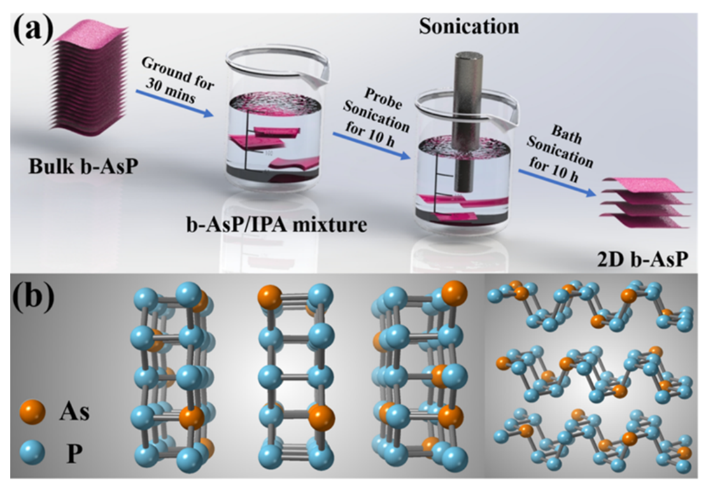
  - 
  - 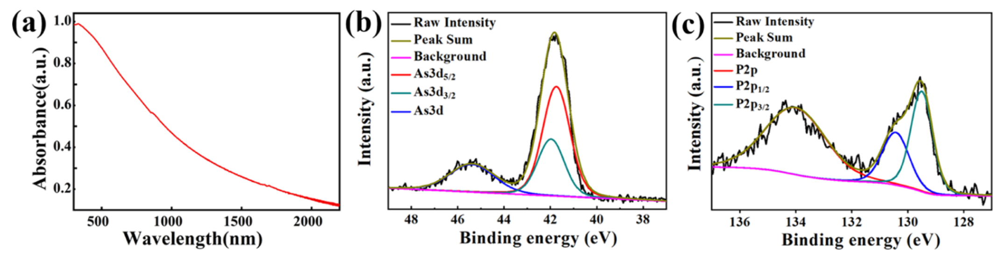
  - 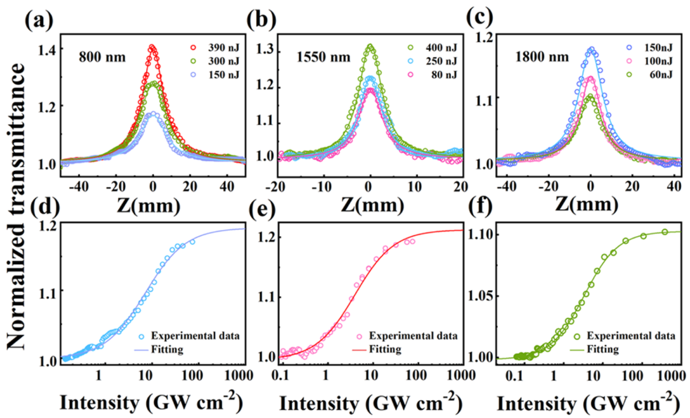
  - 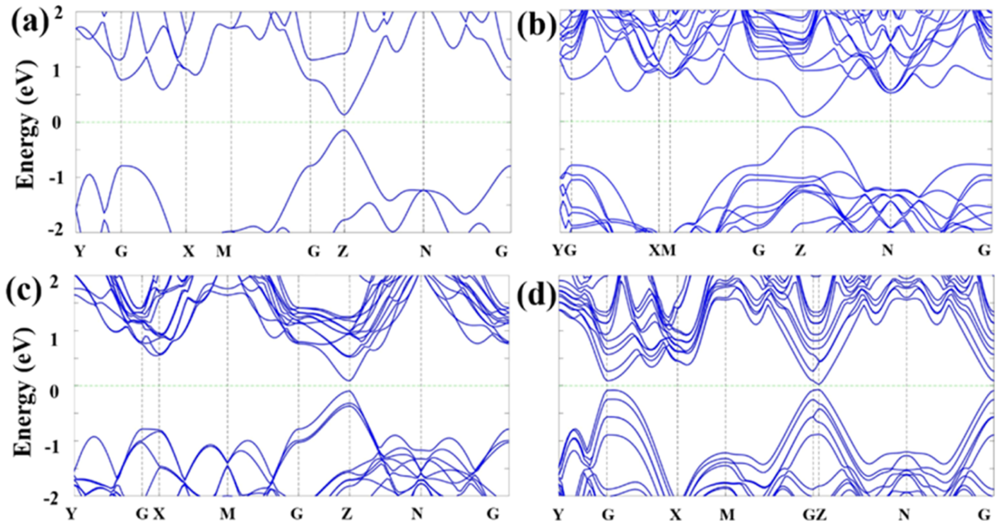
  - 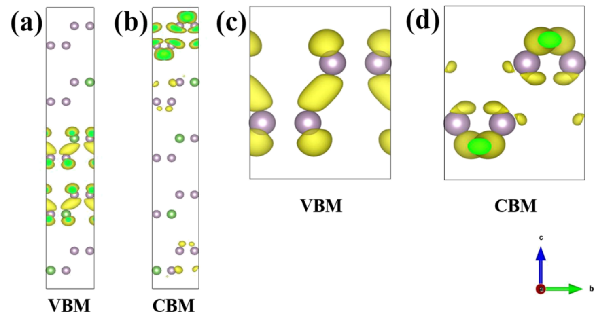
  - 
  - 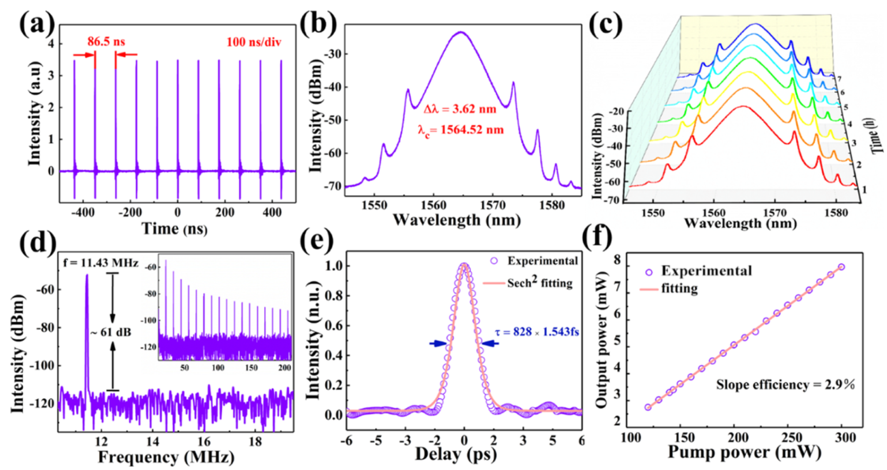
  - 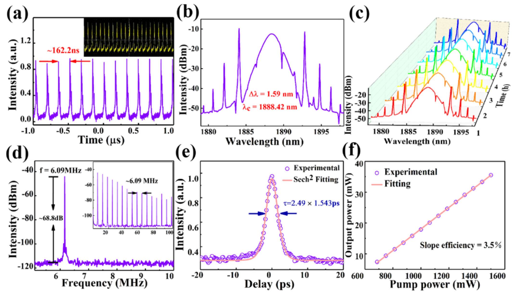
  - 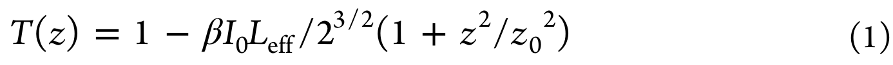
  - 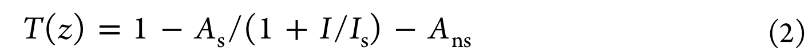
  - 
  - 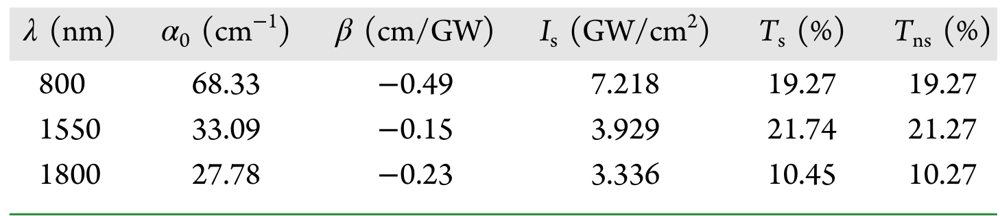
  - 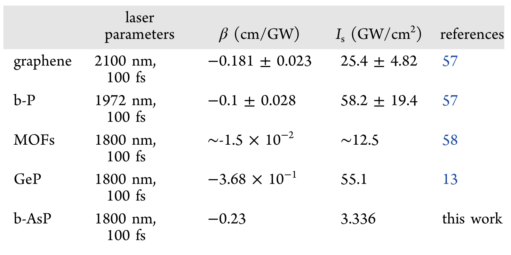
  - 
## 🔬 项目连接
  - **project-1（双光子）— weak**：本文使用开孔 Z 扫描技术测量非线性吸收系数，与双光子吸收研究中常用的 Z 扫描表征方法共享同一实验手段和数据拟合框架（T(z) 公式、单光子吸收模型）。但本文测量的是可饱和吸收（β < 0），与双光子吸收（β > 0）物理过程相反，仅在方法学层面有参考价值，材料和机理无直接关联。
  - project-2 / project-3 / project-4 / project-5 / project-6 / project-7：无直接项目连接。本文虽使用 DFT（PBE 泛函）计算能带结构和电荷密度，但研究对象（b-AsP 非线性光学）与上述项目的核心材料体系（Mn 多铁、TTF 分子、SnTe 铁电等）和物理问题差异较大，不构成有意义的参考。
## 📝 组织与用词
文章按"材料制备 → 结构表征 → 线性/非线性光学测量 → DFT 理论解释 → 光纤激光器器件验证"的经典材料科学闭环组织。论证链条为：DFT 揭示小带隙+电荷分离+破缺对称 → 低电子-空穴复合率 → 低饱和强度 → 高性能锁模脉冲。值得复用的术语：
  - [[../concepts/saturable-absorber|saturable absorber]]（可饱和吸收体，SA）
  - [[../concepts/nonlinear-absorption|nonlinear absorption coefficient]]（非线性吸收系数，β）
  - saturation intensity（饱和强度，Is）
  - modulation depth（调制深度，Ts）
  - nonsaturable loss（非饱和损耗，Tns）
  - [[../concepts/electron-hole-recombination|electron-hole recombination rate]]（电子-空穴复合速率）
  - [[../concepts/charge-density|partial charge density]]（部分电荷密度）
  - [[../concepts/kelly-sidebands|Kelly sidebands]]（Kelly 边带，孤子锁模标志）
  - [[../concepts/time-bandwidth-product|time-bandwidth product]]（时间带宽积，TBP）
  - liquid-phase exfoliation（液相剥离法，LPE）
  - [[../concepts/exfoliation-energy|exfoliation-energy]]
## ✏️ 可写入 Wiki 的要点
  1. b-AsP 是 V 族二元二维合金，As:P ≈ 0.2:0.8，正交晶系褶皱蜂窝晶格，带隙可在 0.15-0.3 eV（对应 4.13-8.27 μm）范围内调节，填补石墨烯（零带隙）与黑磷（0.3-2.2 eV）之间的长波红外空白。
  2. LPE 制备的 b-AsP 纳米片平均厚度约 5 nm，Raman 特征峰为 Ag1、B2g、Ag2；低频区（200-300 cm⁻¹）弱峰归因为 As 振动，高频区（300-500 cm⁻¹）归因为 P-P/As-P 键合。
  3. Z 扫描测得 1800 nm 处 β = -0.23 cm/GW，Is = 3.336 GW/cm²，Ts = 10.45%；Is 比石墨烯（25.4 GW/cm²）和黑磷（58.2 GW/cm²）低近一个数量级。
  4. DFT（PBE 泛函）计算块体 b-AsP 带隙 0.0915 eV，远小于块体 b-P 的 0.2737 eV；HSE 泛函因严重高估带隙而未采用。
  5. b-AsP 低饱和强度的三个微观机制：(a) 带隙小→激子结合能低→复合慢；(b) VBM 与 CBM 电荷密度在实空间分离→电子空穴空间隔离；(c) As 掺杂打破结构对称性→内建电场阻碍复合。
  6. 1.5 μm EDF 锁模结果：中心波长 1564.52 nm，3 dB 带宽 3.63 nm，脉宽 828 fs（Sech² 拟合），重频 8.49 MHz，SNR ≈ 61 dB，TBP ≈ 0.366，最大输出 7.97 mW（泵浦 300 mW，斜率效率 2.9%）。
  7. 2 μm TDF 锁模结果：中心波长 1888.42 nm，3 dB 带宽 1.59 nm，脉宽 2.49 ps，重频 6.09 MHz，SNR ≈ 68.8 dB，TBP ≈ 0.332，最大输出 35.5 mW（斜率效率 3.5%），光谱具典型 Kelly 边带。
  8. 移除 b-AsP SA 后无论如何调节偏振控制器均无锁模脉冲，证实 b-AsP 是锁模的关键因素；7 小时光谱监测无畸变，基频下无脉冲爆发和谐波锁模。
  9. Z 扫描拟合用两个公式：T(z) = 1 − βI₀L_eff/[2^(3/2)(1+z²/z₀²)] 提取 β；T(z) = 1 − As/(1+I/Is) − Ans 提取 Is、Ts、Tns。
  10. b-AsP 在 2 μm 波段输出功率 35.5 mW，是同期黑磷 SA（8.45 mW）的 4 倍以上，论文归因于其超低饱和强度使其能在高泵浦功率下稳定工作而不损坏。
