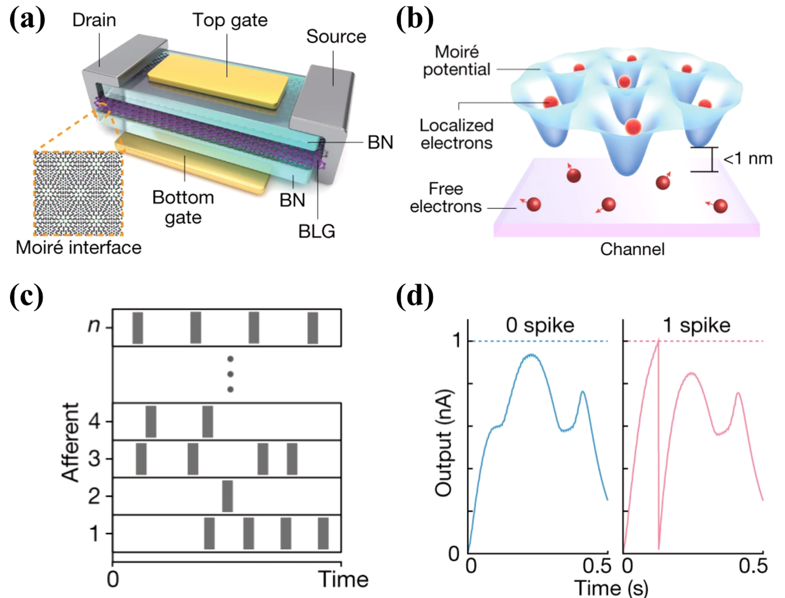
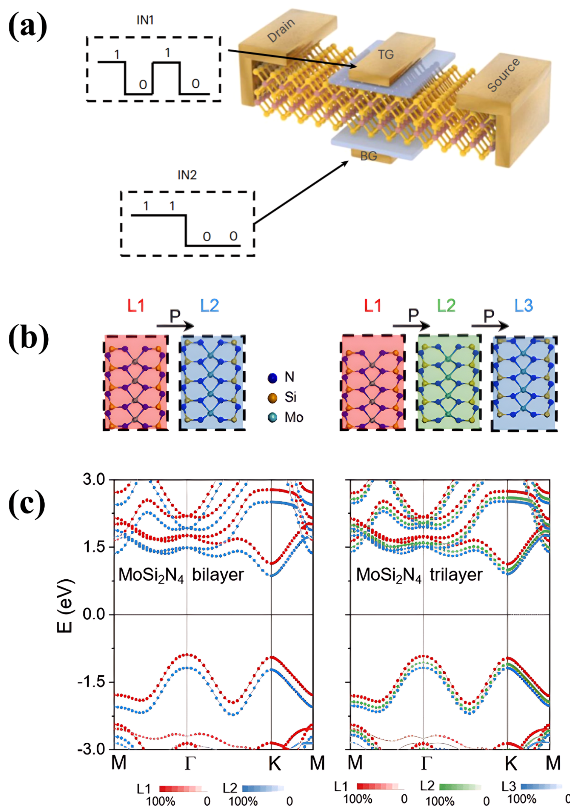
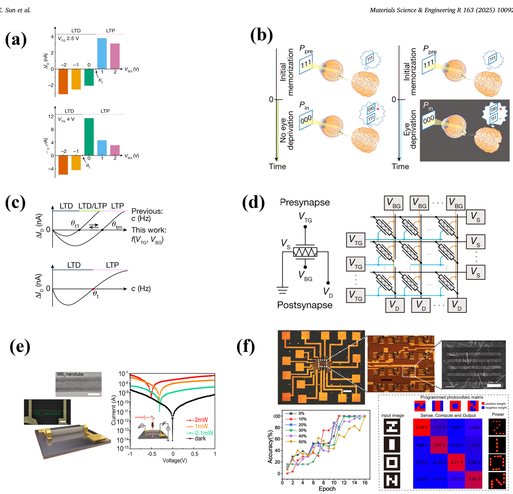

## sunSlidingFerroelectricityTwodimensional2025 — 二维材料中的滑动铁电性及其器件应用

## 📄 元数据
Xiaoyao Sun、Qian Xia、Tengfei Cao、Shuoguo Yuan 等，2025，*Materials Science and Engineering: R: Reports*，vol. 163，100927，DOI [10.1016/j.mser.2025.100927](https://doi.org/10.1016/j.mser.2025.100927)。
## 💡 一句话
这是一篇 2025 年的长篇综述，系统梳理了二维范德华材料中由层间相对滑移产生面外极化的"滑动铁电性"——三种构建路径（3R 菱方堆叠、扭转角、莫尔超晶格）、材料谱系、制备表征工具箱以及 FeFET/FTJ/突触/光伏存储器等器件应用，是当前该领域最完整的知识框架之一。

## 🔗 Wiki 双链

- 概念：
  - [[../concepts/sliding-ferroelectricity]]
  - [[../concepts/2D-materials]]
  - [[../concepts/moire-superlattice]]
  - [[../concepts/ferroelectric-tunnel-junction]]
  - [[../concepts/polarization-switching]]
  - [[../concepts/multiferroicity]]
  - [[../concepts/magnetoelectric-coupling]]
  - [[../concepts/berry-phase]]
  - [[../concepts/strain-engineering]]
  - [[../concepts/density-functional-theory]]
  - [[../concepts/charge-density-wave]]
  - [[../concepts/spin-orbit-coupling]]
  - [[../concepts/ferroelasticity]]
  - [[../concepts/topological-defects]]
  - [[../concepts/super-paraelectricity]]
  - [[../concepts/interlayer-charge-transfer]]
  - [[../concepts/stacking-engineering]]
  - [[../concepts/depolarization-field]]
  - [[../concepts/valley-polarization]]
  - [[../concepts/flat-band]]
  - [[../concepts/Cr2Ge2Te6]]
  - [[../concepts/CrI3]]
  - [[../concepts/GdI2]]
  - [[../concepts/MoS2]]
  - [[../concepts/VSe2]]
  - [[../concepts/WSe2]]
  - [[../concepts/graphene]]
- 实体：
  - [[../entities/h-BN]]
  - [[../entities/TMDs]]
  - [[../entities/WTe2]]
  - [[../entities/In2Se3]]
  - [[../entities/Fe3GeTe2]]
  - [[../entities/BiFeO3]]
  - [[../entities/VASP]]
  - [[../entities/SnTe]]
  - [[../entities/domain-wall]]
  - [[../entities/Cr2Ge2Te6]]
  - [[../entities/CrI3]]
  - [[../entities/MnSe]]
  - [[../entities/MoSi2N4]]
  - [[../entities/ReS2]]
  - [[../entities/VSe2]]
  - [[../entities/graphene]]
- 图表：
  - [[../figures/crystal-structures]]
  - [[../figures/heterostructures-stacking]]
  - [[../figures/heterostructures-stacking-reviews|层间滑移铁电：综述与材料体系 (Sliding Ferroelectricity: Reviews & Materials)]]
  - [[../figures/electronic-bands]]
  - [[../figures/electronic-devices]]
  - [[../figures/domain-walls]]
  - [[../figures/mathematical-models]]
  - [[../figures/experimental-setups]]
  - [[../figures/optical-spectra]]
  - [[../figures/vibrational-spectra]]
- 年度：[[../write/2025]]
- 项目：[[../projects/project-2-mn-multiferroics]]、[[../projects/project-5-snte-ferroelectric-sim]]、[[../projects/project-7-cdw-charge-density-wave]]
- 相关论文：[[../../raw/note/sunSlidingFerroelectricityTwodimensional2025]]

## 🆕 新概念/实体建议

- `concepts/3r-phase.md` — 3R 菱方相（空间群 R3m），TMDs 中非中心对称的多层堆叠，偶数层仍保留面外极化；与 2H 相对照。
- `concepts/twist-angle-engineering.md` — 扭转角工程，小角度扭转产生莫尔周期势与层间滑移铁电。
- `concepts/fatigue-free-switching.md` — 无疲劳翻转，源于范德华层间弱耦合、翻转路径不涉及键断裂/强离子位移；3R-MoS2 器件 >10⁴ 次循环。
- `concepts/fefet.md` — 铁电场效应晶体管，以滑动铁电层作为栅介质/沟道，实现非易失存储窗口（3R-MoS2 约 7 V）。
- `concepts/neuromorphic-synaptic-device.md` — 神经形态突触器件，利用滑动 FE 的渐进极化翻转实现 LTP/LTD、脉冲时序依赖可塑性。
- `concepts/landau-theory.md`（若 wiki 尚未建）— Landau–Ginzburg 描述滑动 FE 双层在垂直电场下的自由能（含弹性常数 λ、μ）。
- `concepts/chiral-phonons.md` — 莫尔/多层滑动 FE 衍生的手性声子与拓扑物理。
- 实体建议：`entities/WS2.md`、`entities/GaSe.md`、`entities/InSe.md`、`entities/Cd3Cl6.md`、`entities/Janus-MoSSe.md`。
- 方法/表征建议：`concepts/4d-stem.md`（四维扫描透射电镜，可直接看到 ~80 pm 层间位移与畴壁运动）、`concepts/ss-pfm.md`（开关谱 PFM）、`concepts/vector-pfm.md`（矢量 PFM 区分 IP/OOP 极化）、`concepts/kpfm.md`（开尔文探针力显微镜测表面电势）。

## 📊 关键图表

综述共 18 幅图、3 张表、1 个公式，全部嵌入如下：

- Fig. 1 二维滑动铁电材料与器件应用总览（FTJ、FeFET、光伏器件、突触器件）。
  
- Fig. 2 滑动铁电材料发展时间线（2017 理论预测—2020 h-BN/石墨烯结构观测—2021 h-BN 表面极化—后续器件验证）。
  
- Fig. 3 三种铁电机制对比：(a) ABO₃ 钙钛矿离子位移；(b) 二维本征铁电（α-In₂Se₃）；(c) 滑动铁电（h-BN）。
  
- Fig. 4 三种构建滑动 FE 的路径：(a) 双层间莫尔超晶格（石墨烯旋转）；(b) 3R 非中心对称堆叠层间滑移；(c) 双层间扭转。
  
- Fig. 5 (a) MoS₂ 的 3R 与 2H（镜面对称）原子结构；(b) 3R 菱方堆叠的晶格弛豫与极化；(c–d) 扭转双层/三层石墨烯中的莫尔条纹超晶格及层间滑移、畴演化。
  
- Fig. 6 (a–b) CVD 制备 MoS₂（硫粉+MoO₃，Ar 保护气）；(c–d) UV 胶带剥离/转移铜网上石墨烯。
  
- Fig. 7 (a) WTe₂ 铁电性探测；(b) 压电响应相位图；(c) 双层异质结构振幅响应；(d) 栅压对极化的影响、不同栅压下表面电势图与双层 3R-MoS₂ 能带。
  
- Fig. 8 (a) 4D-STEM 暗场成像；(b) 扭转角减小过程中非铁电—铁电转变时畴壁运动的实时观测；(c) MoSSe 扭转角产生 Se–Se 构象对应的滑动；(d) 扭转堆叠产生的波纹结构示意。
  
- Fig. 9 (a) 石墨烯/h-BN 扭转超晶格 vdW 器件；(b) 转移曲线迟滞；(c) Bernal 堆叠双层石墨烯晶格；(d) 石墨烯扭转形成超晶格的双层器件；(e) 石墨烯器件电阻特性。
  
- Fig. 10 (a) h-BN 堆叠类型；(b) 各类型不同偏压态 I–V 曲线；(c–d) 外加电场下 h-BN 畴演化；(e) 层间差分电荷密度；(f) r-BN z 轴极化；(g) 不同温度 PFM 信号指示居里温度；(h) 不同偏压下 PFM 振幅/相位回线。
  
- Fig. 11 (a) 不同层数下电场—漏极电流关系；(b) 三层 WTe₂ 电场—电导关系；(c) 3R-MoS₂ 双栅器件示意；(d) 双栅控制与 3R-MoS₂ 原子堆叠；(e–f) WSe₂ 等器件。
  
- Fig. 12 MX 结构与器件：(a) AA/AC 堆叠与层间滑移诱导极化；(b) 器件示意；(c) GaSe 纳米片 SS-PFM；(d) SHG 信号强度与偏振角依赖。
  
- Fig. 13 (a) 3R-MoS₂ 沟道 FeFET 示意；(b) 原子级铁电极化翻转；(c) 编程/擦除性能；(d) 堆叠 3R-MoS₂ FET 转移特性（约 7 V 存储窗口）。
  
- Fig. 14 (a) 硫族结构本征铁电极化（上）与滑动铁电极化转移（下）；(b) 3R-MoS₂ 器件对 53 ns、100 ns、10 μs 写脉冲的漏极电流响应（超快可编程性）；(c) 不同电场下 3R-MoS₂ 平均磁畴翻转速度（可达 ~300 μm/s）。
  
- Fig. 15 (a) 石墨烯/h-BN 异质结双栅沟道突触器件；(b) 顶面莫尔周期势将电荷局域化实现电子横向流动；(c) 输入图样训练；(d) 两个输出神经元对输入图样的响应训练；功耗低至 ~20 pW。
  
- Fig. 16 (a) 少数层 h-BN 与双层 3R-MoS₂ 作隧穿层、石墨烯作电极的 FTJ；(b–c) 双层 h-BN 与 3R-MoS₂ 隧穿电导 dI/dV（畴壁钉扎在隧穿区边缘）；(e–f) MoS₂/WS₂ 异质双层作隧穿层的高/低阻态及对应 ON/OFF ~10³。
  
- Fig. 17 (a) 双栅实现逻辑器件示意；(b–c) 用双层/三层 MoSi₂N₄ 替代沟道材料构建滑动铁电逻辑器件，实现极化行为。
  
- Fig. 18 (a) 人工突触晶体管 LTP/LTD 阈值（4 V 脉冲，底栅 0–1 V）；(b) 生物突触与自适应行为（含"眼睑"自适应示意）；(c) 双向突触阈值滑动，阈值 θₘ 可调（m=1,2,3,…）。
  
- Table 1 钙钛矿铁电、铪基铁电、典型二维本征铁电与滑动铁电的优缺点对比（退极化场、疲劳、CMOS 兼容性、极化值）。
  
- Table 2 实验报道与理论预测的二维滑动铁电材料汇总（h-BN、r-BN、WTe₂、GaSe、3R-MoS₂、ReS₂、γ-InSe、TaS₂、WS₂、WSe₂、Cd₃Cl₆；石墨烯、MnSe、MoSSe、Tl₂S、VSe₂、MX、MX₂、HgI₂、FeCl₂、GdI₂、CrI₃、β-ZrI₂、MoSi₂N₄、BX、YN、ZC、B₂X₃、LaBr₂、VSi₂N₄、PdSe₂/PtSe₂、Cr₂Ge₂Te₆、Fe₃GeTe₂），含层数、极化强度、表征证据、DFT 泛函等。
  
- Table 3 层间扭转角与铁电性的对应关系（石墨烯、MoS₂/graphene、h-BN/graphene、Tl₂S、h-BN、WSe₂、MoS₂、MoSe₂、WS₂；角度、相结构、层数、表征证据）。
  
- Eq. 1 垂直电场下滑动双层的哈密顿量：含共轭动量 π̂ₛ = ρₛ ûₛ、弹性常数 λ、μ 等，是 Landau/连续介质描述层间滑移自由度的核心方程。
  

## 🔬 项目连接

- **project-1 双光子**：无直接项目连接。综述中的 SHG（二次谐波产生）是非线性光学表征手段，用于判定反演对称性破缺，与双光子荧光/双光子吸收成像属于不同物理过程；不涉及双光子加工、双光子聚合或荧光探针。
- **project-2 Mn 多铁**：**strong（强相关）**。综述专节讨论滑动铁电与磁性的耦合：CrI₃、GdI₂、VSe₂、FeCl₂、Cr₂Ge₂Te₆、Fe₃GeTe₂ 等磁性二维双层在层间滑移下同时具有面外极化，是第 II 类多铁/磁电耦合候选；DFT（PAW/PBE/NEB）预测 MnSe 双层的滑动 FE 并给出翻转路径；还讨论了谷极化、自旋 FET 与手性声子等多铁衍生功能。对 Mn 多铁项目在"非钙钛矿、非本征极性、由层间滑移驱动的多铁机制"和"DFT 工作流（结构堆叠→极化计算→NEB 翻转势垒→磁电耦合）"两方面都有直接参考价值。
- **project-3 机械发光 NN**：无直接项目连接。综述的"神经形态/突触器件"利用的是铁电极化渐进翻转的 LTP/LTD 行为，属于电写电读的固态突触，与机械发光（力致发光）传感器—脉冲神经网络的物理输入模态不同；不涉及应力发光材料、力—光转换或机械驱动。
- **project-4 TTF 分子计算**：无直接项目连接。综述聚焦无机范德华层状材料，TTF 等有机分子晶体未被讨论；通用 DFT 流程虽有方法学共性，但项目核心是分子晶体电荷转移/输运，层间滑移铁电模型不直接适用。
- **project-5 SnTe 铁电模拟**：**strong（强相关，方法与物理双可复用）**。SnTe 是 IV–VI 族层状/岩盐铁电半导体，与综述中 MX（GeSe、SnSe、GaSe）族在极性来源、层间耦合、低维极化尺寸效应上高度可比。综述系统给出了可直接迁移到 SnTe 铁电模拟的计算与物理框架：（i）DFT+PAW+GGA-PBE 加 Berry 相/现代极化理论计算面外极化；（ii）NEB 计算层间滑移/离子翻转势垒并提取矫顽场；（iii）Landau 自由能（Eq. 1，弹性常数 λ、μ）+ 退极化场屏蔽模型；（iv）3R/2H/AA/AC 等堆叠对极化的调控，可类比 SnTe 不同堆叠/层数；（v）应变调控（3% 应变使 WTe₂ 在 FE/顺电之间切换）对应 SnTe 应变工程；（vi）Table 2 给出大量同族/等电子材料极化值（GaSe 6.19 pC/m、MX₂ 0.59–0.77 pC/m、BX 0.965–3.707 pC/m、YN 最高 13.837 pC/m 等）作为对照基准；（vii）FeFET/FTJ 器件级图像可指导 SnTe 铁电隧道结/存储器件的结构设计。这是本批笔记中对 project-5 最直接可复用的方法学综述之一。
- **project-6 湿度传感器**：无直接项目连接。综述未涉及水分子吸附、湿度敏感、离子电导或柔性传感；其"低功耗/原子级厚度"虽是传感器共性优势，但没有具体湿度传感内容。
- **project-7 CDW**：**medium（中等相关，物理与材料类比）**。综述明确讨论了 WTe₂ 双层/三层这一与 CDW 体系同族的半金属中的滑动铁电，以及 1T-TaS₂ 双层在 STEM 下观测到的层间阶跃滑移与超晶格畴；其畴壁运动（最快约 300 μm/s）、莫尔超晶格周期势、平带/van Hove 奇点、层间电荷转移与电声耦合等图像，与 CDW 的公度—近公度—非公度畴、畴壁滑移和层间耦合机制有明确物理类比。Table 2/3 中 TaS₂、WTe₂、ReS₂ 等正是 CDW/相关电子社区关心的材料。但综述不直接讨论 CDW 相变温度、Peierls 失稳或 ARPES 能隙，故评为 medium 而非 strong。

## 📝 组织与用词

综述采用"原理 → 材料 → 工艺表征 → 器件"的递进式框架：第 1–2 节建立与钙钛矿铁电、二维本征铁电并列的"滑动铁电第三范式"，并把所有实现方式收敛为三条路径——3R 菱方堆叠、层间扭转、莫尔超晶格；第 3 节给出制备（CVD/PVD/剥离/堆叠转移）与表征（PFM/KPFM/SHG/4D-STEM/电学）工具箱；第 4 节按石墨烯/h-BN/TMD/MX/异质结/InSe/其他/理论预测展开材料谱系，配 Table 2 大表；第 5 节按 FeFET→突触→FTJ→逻辑→光伏存储器的器件链展开，强调无疲劳、超快（53 ns）、超低功耗（20 pW）等指标。论证上大量使用"传统钙钛矿 vs 铪基 vs 2D 本征 vs 滑动 FE"的四列对比表（Table 1）来锚定滑动 FE 的差异化定位。

值得在 wiki 叙述中复用的关键词/术语（中英对照）：

- 滑动铁电性 / sliding ferroelectricity（interlayer-sliding ferroelectricity）
- 层间电荷转移 / interlayer charge transfer
- 退极化场 / depolarization field
- 3R 菱方堆叠 / 3R rhombohedral stacking（R3m，非中心对称）
- 莫尔超晶格 / moiré superlattice
- 扭转角工程 / twist-angle engineering
- 无疲劳翻转 / fatigue-free switching
- 铁电场效应晶体管 / FeFET（ferroelectric field-effect transistor）
- 铁电隧道结 / FTJ（ferroelectric tunnel junction，TER/tunnel electroresistance）
- 神经形态突触器件 / neuromorphic synaptic device（LTP/LTD，脉冲时序依赖可塑性）

## ✏️ 可写入 Wiki 的要点

1. **机制定义**：滑动铁电性是二维范德华双层/多层中，层间相对滑移打破反演对称而产生面外自发极化、并可被外电场翻转的新铁电范式；不涉及强离子位移或化学键断裂，因此本征抗疲劳、翻转能垒低。
2. **三条构建路径**：（i）3R 菱方堆叠（空间群 R3m，非中心对称，偶数层仍保留 OOP 极化，与镜面对称的 2H 相相对）；（ii）层间扭转角工程；（iii）莫尔超晶格（小角度扭转产生周期势与局域层间滑移）。
3. **微观起源**：层间滑移导致轨道重叠与电荷重心在 z 方向分离，即层间电荷转移；极化由 Berry 相/现代极化理论计算，载流子与电极屏蔽退极化场，使原子级厚度下仍能保持可翻转极化。
4. **理论框架（Eq. 1）**：垂直电场下滑动双层的连续介质哈密顿量以共轭动量 π̂ₛ=ρₛ ûₛ、弹性常数 λ（层间压缩）与 μ（层间剪切）描述滑移自由度；可与 Landau–Ginzburg 自由能结合给出矫顽场、畴壁能与翻转路径。
5. **材料谱系与极化强度基准（Table 2）**：GaSe 单层 6.19 pC/m；MX₂（Mo/W，S/Se）0.59–0.77 pC/m；BX（P/As/Sb）0.965–3.707 pC/m；YN（Al/Ga/In）5.765–13.837 pC/m；PdSe₂/PtSe₂ 双层 ±17.11 pC/cm；Tl₂S 0.037 pC/m；HgI₂ 约 0.16 μC/cm²；理论预测还覆盖 MnSe、VSe₂、FeCl₂、GdI₂、CrI₃、β-ZrI₂、MoSi₂N₄、VSi₂N₄、Cr₂Ge₂Te₆、Fe₃GeTe₂ 等磁性/多铁体系。
6. **关键器件指标**：3R-MoS₂ FeFET 存储窗口约 7 V，耐久 >10⁴ 次、保持特性良好；写脉冲可短至 53 ns，畴壁运动速度最高约 300 μm/s；MoS₂/WS₂ 异质双层 FTJ 的 ON/OFF ~10³；石墨烯/h-BN 莫尔突触器件功耗低至约 20 pW，可实现 LTP/LTD 与模式识别。
7. **表征工具箱**：PFM（含 SS-PFM、矢量 PFM 区分 IP/OOP 极化、读回线）、KPFM（表面电势/极化衬度）、SHG（反演对称破缺的光学指纹）、4D-STEM/HAADF-STEM（直接看到约 80 pm 量级的层间位移与畴壁运动）、Raman/AFM、I–V/C–V/P–E 电学测量。
8. **制备方法**：CVD（硫粉+MoO₃ 生长 MoS₂，对流/反向气流可获得 3R 相）、PVD/溅射、机械/液相/电化学剥离，以及堆叠工程与 UV/热释放胶带转移；瓶颈是大尺寸、层数与扭转角可控的合成。
9. **多铁与耦合**：在 CrI₃、GdI₂、VSe₂、FeCl₂、Cr₂Ge₂Te₆、Fe₃GeTe₂ 等磁性双层中，层间滑移可同时调控磁序与极化，是 II 类多铁/磁电耦合候选；MnSe 双层经 DFT+NEB 预测具有滑动 FE；莫尔体系还伴随谷极化、平带/van Hove 奇点、手性声子等新兴物理。
10. **应变与外场调控**：约 3% 的应变即可使 WTe₂ 在铁电相与顺电相之间切换，说明层间滑移 FE 对应变极敏感；Y 掺杂 γ-InSe 的 d₃₃ 可达 7.5 pm/V；层数奇偶、堆叠序列、扭转角（Table 3，石墨烯 0.3°–38.2°、WSe₂ 5.1° 等）共同决定极化大小与稳定性。

**项目连接汇总**：project-5 SnTe 铁电模拟 = strong；project-2 Mn 多铁 = strong；project-7 CDW = medium；project-1 双光子、project-3 机械发光 NN、project-4 TTF 分子计算、project-6 湿度传感器 = 无直接连接。

**图片数量**：22（18 幅图 fig_1–fig_18 + 3 张表 tab_1/tab_2/tab_3 + 1 个公式 eq_1）。
